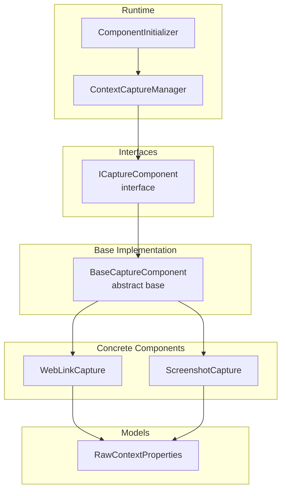
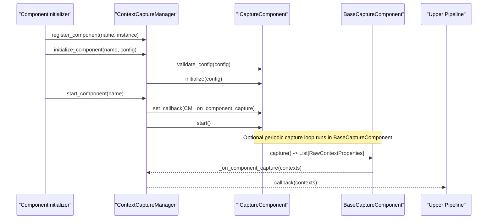
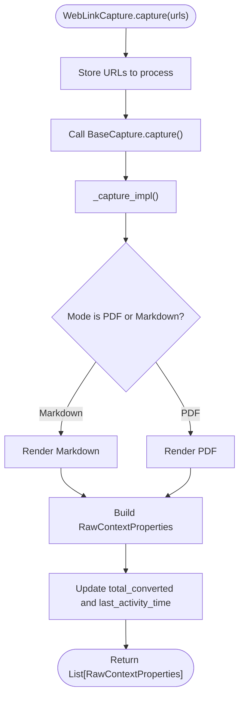
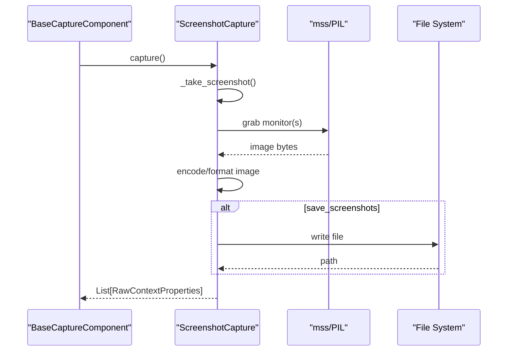
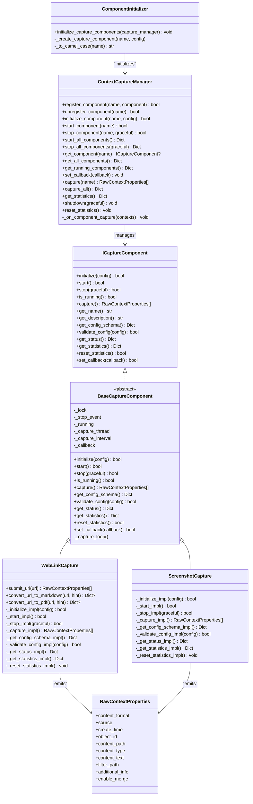
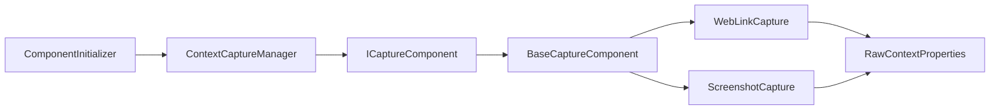

# Custom Capture Components

<cite>
**Referenced Files in This Document**
- [capture_interface.py](file://opencontext/interfaces/capture_interface.py)
- [base.py](file://opencontext/context_capture/base.py)
- [web_link_capture.py](file://opencontext/context_capture/web_link_capture.py)
- [screenshot.py](file://opencontext/context_capture/screenshot.py)
- [capture_manager.py](file://opencontext/managers/capture_manager.py)
- [component_initializer.py](file://opencontext/server/component_initializer.py)
- [context.py](file://opencontext/models/context.py)
- [config.yaml](file://config/config.yaml)
</cite>

## Table of Contents
1. [Introduction](#introduction)
2. [Project Structure](#project-structure)
3. [Core Components](#core-components)
4. [Architecture Overview](#architecture-overview)
5. [Detailed Component Analysis](#detailed-component-analysis)
6. [Dependency Analysis](#dependency-analysis)
7. [Performance Considerations](#performance-considerations)
8. [Troubleshooting Guide](#troubleshooting-guide)
9. [Conclusion](#conclusion)
10. [Appendices](#appendices)

## Introduction
This document explains how to implement custom capture components in MineContext. It covers the ICaptureComponent interface, the BaseCaptureComponent shared implementation, the data model for captured content (RawContextProperties), and the runtime lifecycle managed by CaptureManager and ComponentInitializer. It also provides concrete examples from web_link_capture.py and screenshot.py, guidance on configuration schema definition and validation, thread safety and error handling, performance considerations for frequent capture intervals, and testing/debugging practices.

## Project Structure
MineContext organizes capture-related logic under opencontext/context_capture, with interfaces and base classes in opencontext/context_capture and shared models in opencontext/models. Runtime orchestration is handled by opencontext/managers and opencontext/server.

**Diagram sources**
- [capture_interface.py](file://opencontext/interfaces/capture_interface.py#L18-L153)
- [base.py](file://opencontext/context_capture/base.py#L26-L515)
- [web_link_capture.py](file://opencontext/context_capture/web_link_capture.py#L24-L351)
- [screenshot.py](file://opencontext/context_capture/screenshot.py#L28-L508)
- [capture_manager.py](file://opencontext/managers/capture_manager.py#L23-L391)
- [component_initializer.py](file://opencontext/server/component_initializer.py#L37-L118)
- [context.py](file://opencontext/models/context.py#L35-L60)

**Section sources**
- [capture_interface.py](file://opencontext/interfaces/capture_interface.py#L18-L153)
- [base.py](file://opencontext/context_capture/base.py#L26-L515)
- [web_link_capture.py](file://opencontext/context_capture/web_link_capture.py#L24-L351)
- [screenshot.py](file://opencontext/context_capture/screenshot.py#L28-L508)
- [capture_manager.py](file://opencontext/managers/capture_manager.py#L23-L391)
- [component_initializer.py](file://opencontext/server/component_initializer.py#L37-L118)
- [context.py](file://opencontext/models/context.py#L35-L60)

## Core Components
- ICaptureComponent defines the contract for all capture components, including lifecycle methods (initialize, start, stop, is_running), capture execution (capture), metadata (get_name, get_description), configuration (get_config_schema, validate_config), status and statistics (get_status, get_statistics, reset_statistics), and callback registration (set_callback).
- BaseCaptureComponent implements common behavior: thread-safe state management, optional periodic capture loop, callback invocation, statistics, and configuration validation. Subclasses implement _initialize_impl, _start_impl, _stop_impl, and _capture_impl.
- RawContextProperties is the canonical data model for captured context, carrying source, content format, content path/text, timestamps, dedup/filter path, and additional metadata.

Key responsibilities:
- ICaptureComponent: Define the API surface and configuration schema contract.
- BaseCaptureComponent: Provide lifecycle, thread safety, periodic capture, and statistics.
- Concrete components: Implement capture logic and configuration schema validation.
- CaptureManager: Registers, initializes, starts/stops, and aggregates statistics for components; forwards captured data to the upper pipeline via callbacks.
- ComponentInitializer: Reads configuration and instantiates/register/initialize components according to config.

**Section sources**
- [capture_interface.py](file://opencontext/interfaces/capture_interface.py#L18-L153)
- [base.py](file://opencontext/context_capture/base.py#L33-L241)
- [context.py](file://opencontext/models/context.py#L35-L60)
- [capture_manager.py](file://opencontext/managers/capture_manager.py#L39-L153)
- [component_initializer.py](file://opencontext/server/component_initializer.py#L71-L118)

## Architecture Overview
The runtime flow:
- ComponentInitializer reads config.yaml and constructs components, registers them with ContextCaptureManager, validates and initializes them, then starts them.
- Components may run in auto-capture mode (periodic) or be triggered manually.
- On capture, components call set_callback with lists of RawContextProperties.
- CaptureManager aggregates statistics and forwards captured data to the upper pipeline via its own callback.

**Diagram sources**
- [component_initializer.py](file://opencontext/server/component_initializer.py#L71-L118)
- [capture_manager.py](file://opencontext/managers/capture_manager.py#L100-L171)
- [base.py](file://opencontext/context_capture/base.py#L176-L219)
- [capture_manager.py](file://opencontext/managers/capture_manager.py#L273-L311)

## Detailed Component Analysis

### ICaptureComponent Interface
- Methods:
  - initialize(config): Validates and prepares component internals.
  - start(): Starts background operations (threads, watchers).
  - stop(graceful): Stops cleanly, optionally waiting for current operations.
  - is_running(): Reports operational state.
  - capture(): Executes a single capture operation and returns captured data.
  - get_name()/get_description(): Metadata.
  - get_config_schema(): Returns JSON Schema describing configuration.
  - validate_config(config): Validates configuration against schema.
  - get_status()/get_statistics()/reset_statistics(): Observability.
  - set_callback(callback): Registers a callback invoked with captured data.

Implementation notes:
- Components must implement the abstract methods and can override validation/schema helpers.
- Components should honor graceful stop semantics and thread safety.

**Section sources**
- [capture_interface.py](file://opencontext/interfaces/capture_interface.py#L18-L153)

### BaseCaptureComponent Behavior
- Thread-safe state:
  - _lock (RLock) protects mutable state.
  - _stop_event controls capture loop termination.
  - _running flag tracks lifecycle.
- Periodic capture:
  - If capture_interval is configured, a daemon thread runs _capture_loop, invoking capture() at intervals.
  - On exceptions in the loop, waits a short period before retrying.
- Lifecycle:
  - initialize: Validates config, copies config, sets capture_interval, calls _initialize_impl.
  - start: Calls _start_impl, sets _running, starts capture thread if configured.
  - stop: Signals stop, joins capture thread with timeout, calls _stop_impl.
  - capture: Checks running state, calls _capture_impl, updates counters, invokes callback if provided.
- Configuration schema:
  - get_config_schema merges base schema with subclass schema via _get_config_schema_impl.
  - validate_config enforces base constraints and delegates to _validate_config_impl.
- Statistics and status:
  - Tracks counts, last error, uptime, and exposes via get_statistics/get_status.
  - reset_statistics delegates to _reset_statistics_impl.

Thread safety:
- All public methods acquire _lock where needed.
- Capture loop uses _stop_event for cooperative cancellation.

**Section sources**
- [base.py](file://opencontext/context_capture/base.py#L33-L241)
- [base.py](file://opencontext/context_capture/base.py#L239-L310)
- [base.py](file://opencontext/context_capture/base.py#L311-L387)
- [base.py](file://opencontext/context_capture/base.py#L388-L407)
- [base.py](file://opencontext/context_capture/base.py#L408-L430)

### WebLinkCapture Example
Purpose:
- Converts web URLs to Markdown or PDF and emits RawContextProperties for downstream processing.

Key behaviors:
- Configuration:
  - output_dir, mode ("pdf" | "markdown"), max_workers, timeout, wait_until, pdf_format, print_background, landscape.
  - _get_config_schema_impl and _validate_config_impl define and enforce schema.
- Capture override:
  - capture(urls: Optional[List[str]]) stores URLs and delegates to base capture, which calls _capture_impl.
- Conversion:
  - Uses external libraries (async for Markdown, sync for PDF) to render pages.
  - Emits RawContextProperties with ContextSource.WEB_LINK, ContentFormat.FILE, and additional_info including URL and file path.
- Thread safety:
  - Uses a lock for statistics updates and a thread pool for parallel conversions.

**Diagram sources**
- [web_link_capture.py](file://opencontext/context_capture/web_link_capture.py#L191-L252)
- [web_link_capture.py](file://opencontext/context_capture/web_link_capture.py#L254-L351)
- [context.py](file://opencontext/models/context.py#L35-L60)

**Section sources**
- [web_link_capture.py](file://opencontext/context_capture/web_link_capture.py#L24-L351)
- [context.py](file://opencontext/models/context.py#L35-L60)

### ScreenshotCapture Example
Purpose:
- Periodically captures screenshots from monitors and emits RawContextProperties.

Key behaviors:
- Configuration:
  - capture_interval, screenshot_format ("png" | "jpg" | "jpeg"), screenshot_quality, screenshot_region, storage_path, dedup_enabled, similarity_threshold, max_image_size, resize_quality.
  - _get_config_schema_impl and _validate_config_impl define and enforce schema.
- Capture:
  - Uses mss to grab monitor regions; converts to bytes; optionally saves to disk; builds RawContextProperties with ContextSource.SCREENSHOT, ContentFormat.IMAGE, and metadata.
- Graceful stop:
  - If graceful, flushes pending contexts via callback before clearing state.

**Diagram sources**
- [screenshot.py](file://opencontext/context_capture/screenshot.py#L217-L245)
- [screenshot.py](file://opencontext/context_capture/screenshot.py#L246-L299)
- [context.py](file://opencontext/models/context.py#L35-L60)

**Section sources**
- [screenshot.py](file://opencontext/context_capture/screenshot.py#L28-L508)
- [context.py](file://opencontext/models/context.py#L35-L60)

### Data Model: RawContextProperties
- Fields:
  - content_format: TEXT, FILE, IMAGE, VIDEO
  - source: ContextSource (e.g., WEB_LINK, SCREENSHOT)
  - create_time: datetime
  - object_id: unique identifier
  - content_path: file path for FILE/IMAGE; None for TEXT
  - content_type: MIME-like type
  - content_text: text content for TEXT; None otherwise
  - filter_path: deduplication key (e.g., URL)
  - additional_info: arbitrary metadata
  - enable_merge: whether to allow merging downstream

Usage:
- Components construct RawContextProperties and return them from capture.
- Downstream processors consume these objects.

**Section sources**
- [context.py](file://opencontext/models/context.py#L35-L60)

### Configuration Schema Definition and Validation
- Base schema (BaseCaptureComponent.get_config_schema):
  - auto_capture: boolean, default false
  - capture_interval: number >= 0.1, default 1.0
  - Subclasses can extend properties and required fields via _get_config_schema_impl.
- Validation (BaseCaptureComponent.validate_config):
  - Enforces base constraints and delegates to _validate_config_impl for subclass-specific checks.
- Concrete examples:
  - WebLinkCapture: output_dir (string), mode ("pdf"|"markdown"), max_workers (int>=1), timeout (int>=1000), wait_until (string), pdf_format (string), print_background (boolean), landscape (boolean).
  - ScreenshotCapture: capture_interval (number>0), screenshot_format ("png"|"jpg"|"jpeg"), screenshot_quality (1..100), screenshot_region (object with left, top, width, height), storage_path (string), dedup_enabled (boolean), similarity_threshold (0..100).

Best practices:
- Keep defaults reasonable and safe.
- Use enums for discrete options.
- Validate ranges and types early.
- Provide clear error logs for invalid configs.

**Section sources**
- [base.py](file://opencontext/context_capture/base.py#L239-L310)
- [base.py](file://opencontext/context_capture/base.py#L311-L387)
- [web_link_capture.py](file://opencontext/context_capture/web_link_capture.py#L254-L351)
- [screenshot.py](file://opencontext/context_capture/screenshot.py#L300-L353)

### Registration and Runtime Initialization
- ComponentInitializer:
  - Reads capture config from config.yaml.
  - Creates instances via CAPTURE_COMPONENTS mapping or dynamic import.
  - Registers with ContextCaptureManager, validates/initializes, and logs results.
- ContextCaptureManager:
  - register_component/unregister_component
  - initialize_component: validates config and calls component.initialize
  - start_component: sets callback and calls component.start
  - stop_component: calls component.stop(graceful)
  - capture/capture_all: manual triggers
  - _on_component_capture: aggregates statistics and forwards to upper callback

**Diagram sources**
- [capture_interface.py](file://opencontext/interfaces/capture_interface.py#L18-L153)
- [base.py](file://opencontext/context_capture/base.py#L26-L515)
- [web_link_capture.py](file://opencontext/context_capture/web_link_capture.py#L24-L351)
- [screenshot.py](file://opencontext/context_capture/screenshot.py#L28-L508)
- [capture_manager.py](file://opencontext/managers/capture_manager.py#L23-L391)
- [component_initializer.py](file://opencontext/server/component_initializer.py#L37-L118)
- [context.py](file://opencontext/models/context.py#L35-L60)

**Section sources**
- [component_initializer.py](file://opencontext/server/component_initializer.py#L71-L118)
- [capture_manager.py](file://opencontext/managers/capture_manager.py#L100-L171)
- [capture_manager.py](file://opencontext/managers/capture_manager.py#L273-L311)

## Dependency Analysis
- Coupling:
  - Components depend on BaseCaptureComponent for lifecycle and thread safety.
  - CaptureManager depends on ICaptureComponent for uniform behavior.
  - ComponentInitializer depends on CAPTURE_COMPONENTS mapping and config.
- Cohesion:
  - BaseCaptureComponent centralizes common concerns (threading, stats, schema).
  - Concrete components encapsulate capture logic and schema.
- External dependencies:
  - WebLinkCapture relies on external libraries for rendering.
  - ScreenshotCapture relies on mss and PIL.

**Diagram sources**
- [component_initializer.py](file://opencontext/server/component_initializer.py#L71-L118)
- [capture_manager.py](file://opencontext/managers/capture_manager.py#L100-L171)
- [base.py](file://opencontext/context_capture/base.py#L26-L515)
- [web_link_capture.py](file://opencontext/context_capture/web_link_capture.py#L24-L351)
- [screenshot.py](file://opencontext/context_capture/screenshot.py#L28-L508)
- [context.py](file://opencontext/models/context.py#L35-L60)

**Section sources**
- [component_initializer.py](file://opencontext/server/component_initializer.py#L71-L118)
- [capture_manager.py](file://opencontext/managers/capture_manager.py#L100-L171)
- [base.py](file://opencontext/context_capture/base.py#L26-L515)

## Performance Considerations
- Capture interval:
  - BaseCaptureComponent enforces a minimum capture_interval (e.g., 0.1s) to prevent excessive load.
  - ScreenshotCapture uses capture_interval to drive periodic captures; adjust based on hardware capabilities.
- Parallelism:
  - WebLinkCapture uses ThreadPoolExecutor to parallelize conversions; tune max_workers based on CPU and I/O capacity.
- Deduplication:
  - ScreenshotCapture supports deduplication to skip near-identical frames; tune similarity_threshold to balance noise reduction vs. motion sensitivity.
- I/O and storage:
  - ScreenshotCapture can persist images; ensure storage_path exists and is on fast media.
- Memory:
  - Limit image sizes (max_image_size) and quality (resize_quality) to control memory footprint.
- Backpressure:
  - CaptureManager’s callback pattern allows upstream components to throttle or batch processing.

[No sources needed since this section provides general guidance]

## Troubleshooting Guide
Common issues and resolutions:
- Failed initialization:
  - Verify configuration validity via validate_config; check logs for specific errors.
  - Ensure required external libraries are installed (e.g., mss for screenshots, Playwright/Crawl4AI for web links).
- Empty capture results:
  - Confirm component is running (is_running) and capture_interval is set appropriately.
  - For WebLinkCapture, ensure URLs are valid and reachable; check timeout/wait_until settings.
  - For ScreenshotCapture, verify monitor regions and permissions.
- Exceptions during capture:
  - BaseCaptureComponent catches and logs exceptions; inspect last_error and error_count via get_statistics.
  - For WebLinkCapture, review conversion failures and network timeouts.
  - For ScreenshotCapture, check mss availability and image encoding errors.
- Stopping hangs:
  - Use graceful stop; BaseCaptureComponent waits up to 5 seconds for the capture thread; investigate blocking operations in _stop_impl.
- Callback failures:
  - CaptureManager logs exceptions thrown by upper-level callbacks; ensure handlers are thread-safe and efficient.

**Section sources**
- [base.py](file://opencontext/context_capture/base.py#L142-L165)
- [base.py](file://opencontext/context_capture/base.py#L176-L219)
- [capture_manager.py](file://opencontext/managers/capture_manager.py#L273-L311)
- [web_link_capture.py](file://opencontext/context_capture/web_link_capture.py#L160-L181)
- [screenshot.py](file://opencontext/context_capture/screenshot.py#L128-L149)

## Conclusion
Custom capture components in MineContext follow a clear contract and shared implementation. By extending BaseCaptureComponent, implementing lifecycle and capture methods, defining a configuration schema, and honoring thread safety and graceful shutdown, you can integrate new capture sources seamlessly. Use the provided examples as templates, validate configurations rigorously, and leverage the runtime managers for robust initialization and data flow.

[No sources needed since this section summarizes without analyzing specific files]

## Appendices

### Configuration Reference
- Base capture settings:
  - auto_capture: boolean
  - capture_interval: number >= 0.1
- WebLinkCapture settings:
  - output_dir: string
  - mode: "pdf" | "markdown"
  - max_workers: integer >= 1
  - timeout: integer >= 1000
  - wait_until: string
  - pdf_format: string
  - print_background: boolean
  - landscape: boolean
- ScreenshotCapture settings:
  - capture_interval: number > 0
  - screenshot_format: "png" | "jpg" | "jpeg"
  - screenshot_quality: integer 1..100
  - screenshot_region: object with left, top, width, height
  - storage_path: string
  - dedup_enabled: boolean
  - similarity_threshold: number 0..100

**Section sources**
- [base.py](file://opencontext/context_capture/base.py#L239-L310)
- [web_link_capture.py](file://opencontext/context_capture/web_link_capture.py#L254-L351)
- [screenshot.py](file://opencontext/context_capture/screenshot.py#L300-L353)
- [config.yaml](file://config/config.yaml#L40-L75)

### Testing Custom Capture Components
- Unit tests:
  - Validate configuration schema via get_config_schema and validate_config.
  - Test lifecycle: initialize/start/stop/is_running with representative configs.
  - Mock external dependencies (e.g., mss, Playwright) to isolate logic.
- Integration tests:
  - Run ComponentInitializer with a minimal config enabling your component.
  - Verify ContextCaptureManager registers, initializes, and starts the component.
  - Trigger capture and assert emitted RawContextProperties meet expectations.
- Debugging:
  - Inspect get_status and get_statistics for runtime diagnostics.
  - Temporarily lower capture_interval for rapid feedback loops.
  - Use logs to trace initialization, capture, and callback execution.

[No sources needed since this section provides general guidance]