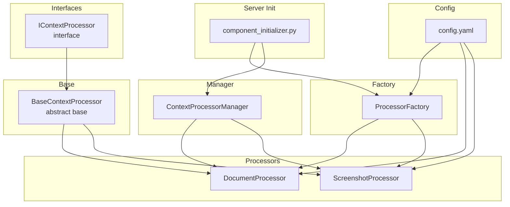
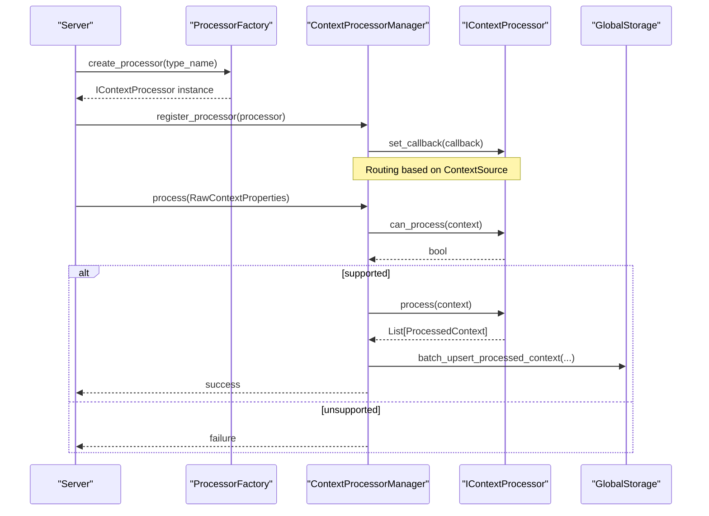
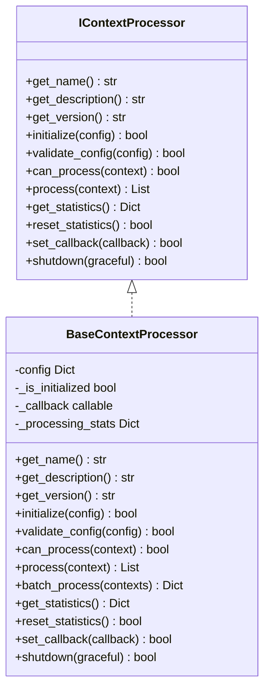
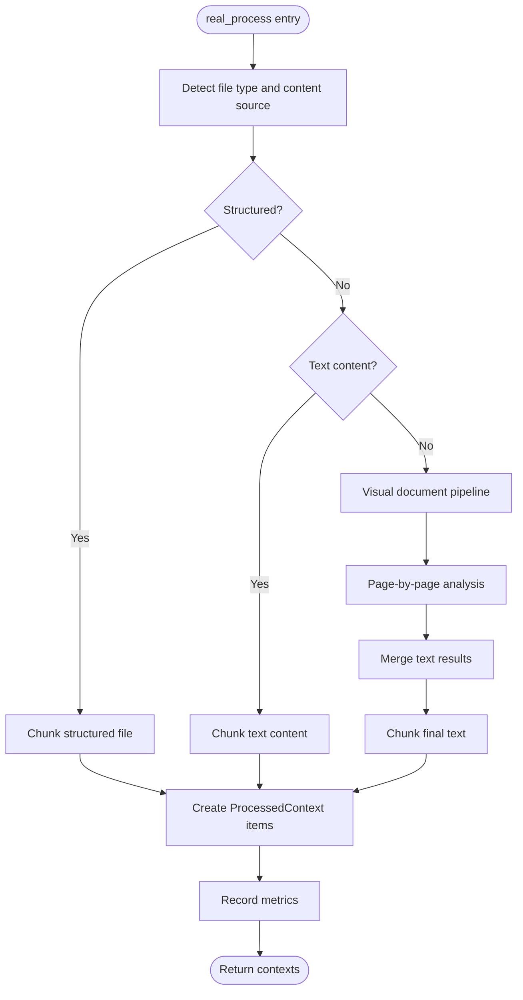
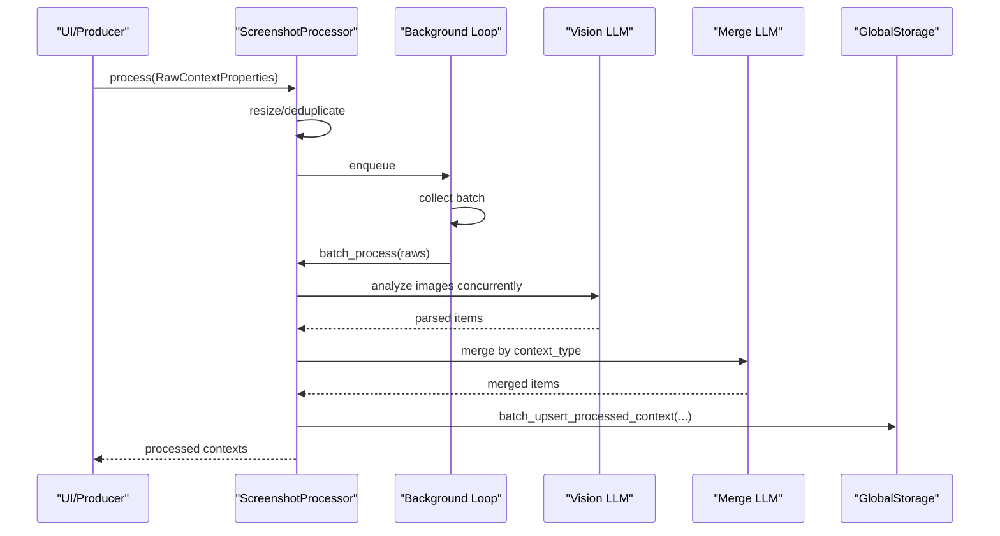
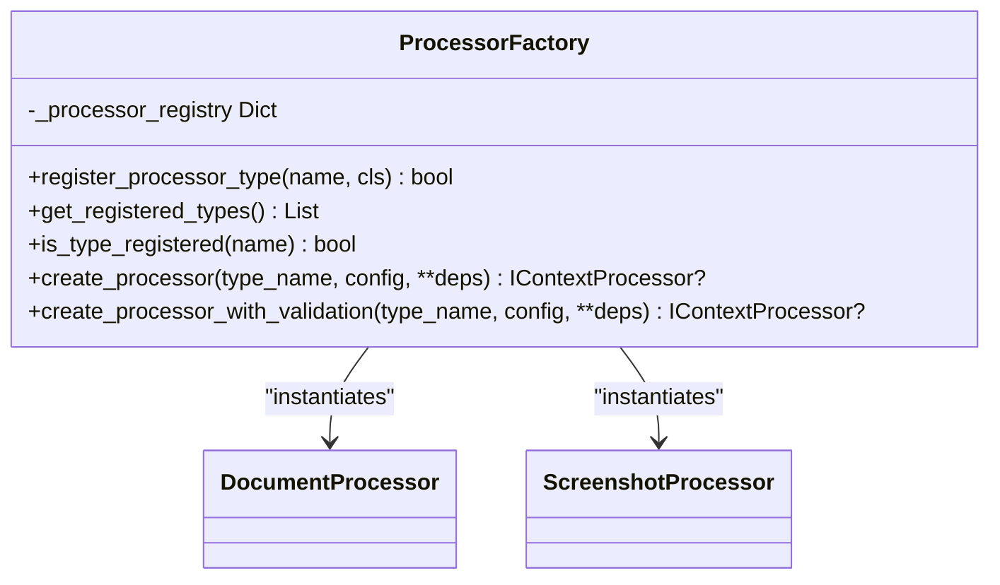
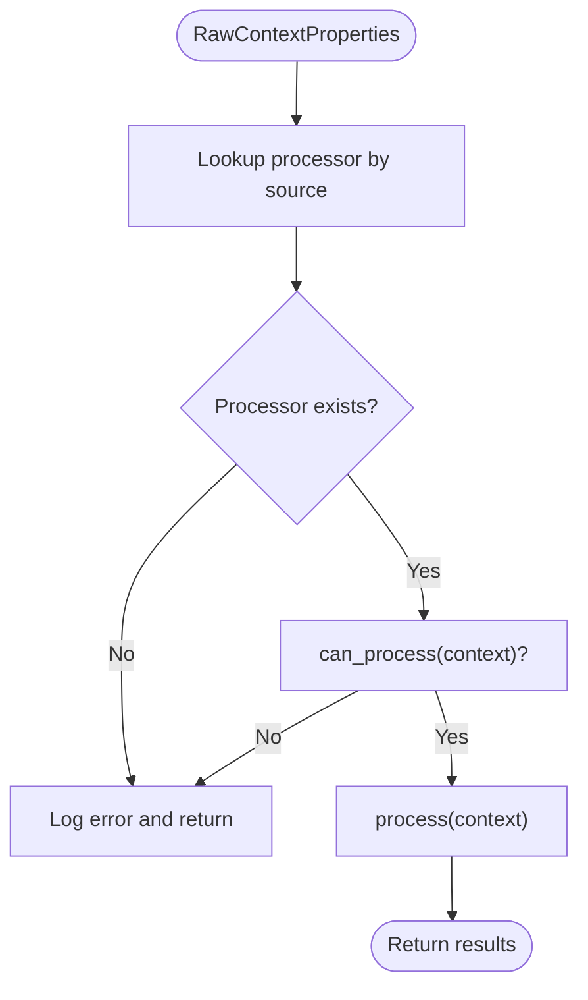
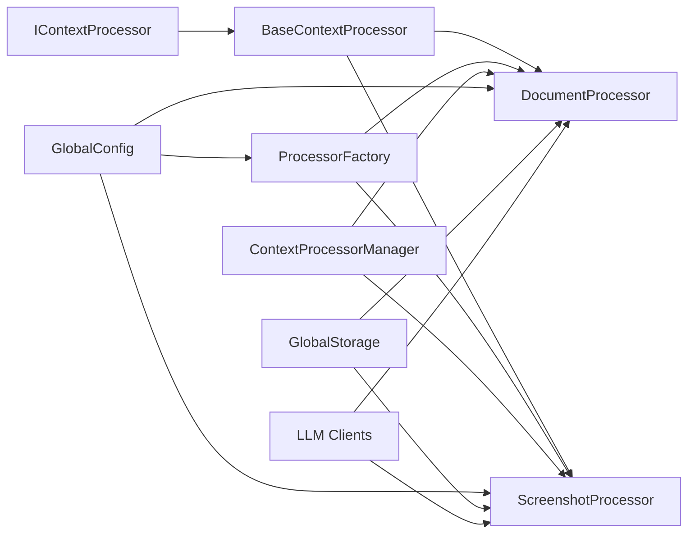

# Custom Processors

<cite>
**Referenced Files in This Document**
- [processor_interface.py](file://opencontext/interfaces/processor_interface.py)
- [base_processor.py](file://opencontext/context_processing/processor/base_processor.py)
- [processor_factory.py](file://opencontext/context_processing/processor/processor_factory.py)
- [document_processor.py](file://opencontext/context_processing/processor/document_processor.py)
- [screenshot_processor.py](file://opencontext/context_processing/processor/screenshot_processor.py)
- [processor_manager.py](file://opencontext/managers/processor_manager.py)
- [component_initializer.py](file://opencontext/server/component_initializer.py)
- [config.yaml](file://config/config.yaml)
- [example_document_processor.py](file://examples/example_document_processor.py)
- [example_screenshot_processor.py](file://examples/example_screenshot_processor.py)
- [entity_processor.py](file://opencontext/context_processing/processor/entity_processor.py)
</cite>

## Table of Contents
1. [Introduction](#introduction)
2. [Project Structure](#project-structure)
3. [Core Components](#core-components)
4. [Architecture Overview](#architecture-overview)
5. [Detailed Component Analysis](#detailed-component-analysis)
6. [Dependency Analysis](#dependency-analysis)
7. [Performance Considerations](#performance-considerations)
8. [Troubleshooting Guide](#troubleshooting-guide)
9. [Conclusion](#conclusion)
10. [Appendices](#appendices)

## Introduction
This document explains how to create custom data processing modules in MineContext by implementing the IContextProcessor interface and integrating them into the processing pipeline. It covers the four core methods—initialize, can_process, process, and shutdown—and the lifecycle from registration to execution. Concrete examples from document_processor.py and screenshot_processor.py illustrate real implementations. We also describe how the processor factory dynamically loads and instantiates processors based on configuration, how can_process determines appropriate processors for specific context types, configuration validation, passing processor-specific settings during initialization, error handling within process, maintaining processor state, generating meaningful statistics, and best practices for performance and thread safety.

## Project Structure
The processor subsystem is organized around a shared interface, a base class that implements common behaviors, concrete processor implementations, a factory for dynamic instantiation, and a manager that orchestrates routing and execution.

**Diagram sources**
- [processor_interface.py](file://opencontext/interfaces/processor_interface.py#L1-L136)
- [base_processor.py](file://opencontext/context_processing/processor/base_processor.py#L1-L261)
- [processor_factory.py](file://opencontext/context_processing/processor/processor_factory.py#L1-L175)
- [document_processor.py](file://opencontext/context_processing/processor/document_processor.py#L1-L653)
- [screenshot_processor.py](file://opencontext/context_processing/processor/screenshot_processor.py#L1-L590)
- [processor_manager.py](file://opencontext/managers/processor_manager.py#L1-L213)
- [component_initializer.py](file://opencontext/server/component_initializer.py#L138-L162)
- [config.yaml](file://config/config.yaml#L76-L94)

**Section sources**
- [processor_interface.py](file://opencontext/interfaces/processor_interface.py#L1-L136)
- [base_processor.py](file://opencontext/context_processing/processor/base_processor.py#L1-L261)
- [processor_factory.py](file://opencontext/context_processing/processor/processor_factory.py#L1-L175)
- [processor_manager.py](file://opencontext/managers/processor_manager.py#L1-L213)
- [component_initializer.py](file://opencontext/server/component_initializer.py#L138-L162)
- [config.yaml](file://config/config.yaml#L76-L94)

## Core Components
- IContextProcessor defines the contract for all processors, including identification, initialization, configuration validation, capability checks, processing, statistics, callbacks, and shutdown.
- BaseContextProcessor implements common behaviors: configuration management, statistics tracking, batch processing, callback invocation, and graceful shutdown. It leaves the core processing logic abstract.
- ProcessorFactory registers built-in processors and creates instances via parameterless constructors, optionally validating configuration from global settings.
- ContextProcessorManager routes inputs to the correct processor based on source, coordinates batch execution, aggregates statistics, and manages lifecycle.

**Section sources**
- [processor_interface.py](file://opencontext/interfaces/processor_interface.py#L16-L136)
- [base_processor.py](file://opencontext/context_processing/processor/base_processor.py#L23-L261)
- [processor_factory.py](file://opencontext/context_processing/processor/processor_factory.py#L31-L175)
- [processor_manager.py](file://opencontext/managers/processor_manager.py#L21-L120)

## Architecture Overview
The lifecycle begins with server initialization, where processors are discovered from configuration and registered with the manager. Inputs are routed to the appropriate processor based on source, and processors enqueue or execute workloads, reporting statistics and invoking callbacks.

**Diagram sources**
- [component_initializer.py](file://opencontext/server/component_initializer.py#L138-L162)
- [processor_factory.py](file://opencontext/context_processing/processor/processor_factory.py#L109-L171)
- [processor_manager.py](file://opencontext/managers/processor_manager.py#L132-L159)
- [processor_interface.py](file://opencontext/interfaces/processor_interface.py#L50-L136)

## Detailed Component Analysis

### IContextProcessor Interface
- Methods:
  - get_name/get_description/get_version: identification
  - initialize: configure and prepare runtime
  - validate_config: validate configuration dictionary
  - can_process: decide if a context can be handled
  - process: perform processing and return results
  - get_statistics/reset_statistics: metrics and state
  - set_callback: register post-processing callback
  - shutdown: release resources

These methods define a consistent contract across all processors, enabling uniform orchestration and observability.

**Section sources**
- [processor_interface.py](file://opencontext/interfaces/processor_interface.py#L16-L136)

### BaseContextProcessor
- Responsibilities:
  - Stores configuration and initialization state
  - Validates configuration via validate_config (default accepts any)
  - Tracks processed_count, contexts_generated_count, error_count
  - Provides batch_process to iterate contexts, grouping by object ID and updating stats
  - Supports callback invocation and graceful shutdown
- Key behaviors:
  - initialize updates config and marks initialized
  - batch_process calls can_process and process, increments counters, logs errors
  - _extract_object_id resolves object identifiers from raw or processed contexts
  - set_callback/_invoke_callback manage asynchronous notifications
  - shutdown resets state and clears callback

**Diagram sources**
- [processor_interface.py](file://opencontext/interfaces/processor_interface.py#L16-L136)
- [base_processor.py](file://opencontext/context_processing/processor/base_processor.py#L23-L261)

**Section sources**
- [base_processor.py](file://opencontext/context_processing/processor/base_processor.py#L31-L261)

### DocumentProcessor
- Purpose: Unified document processing for structured, text, and visual content.
- Initialization:
  - Reads processing.document_processor and document_processing from global config
  - Sets batch_size, batch_timeout, dpi, vlm_batch_size, text_threshold
  - Starts a background thread and initializes converters and chunkers
- can_process:
  - Checks enabled flag and context type
  - Accepts text content (INPUT source)
  - Accepts local/web files whose content_path exists and suffix is supported
- process:
  - Enqueues RawContextProperties into a bounded queue
  - Background loop consumes queue and calls real_process
- real_process:
  - Routes by file type: structured, text, or visual
  - Uses DocumentConverter and chunkers to produce ProcessedContext items
  - Records metrics and error handling
- Visual pipeline:
  - Converts to images, runs VLM in batches, merges page results, chunks text, and creates contexts
- Metrics:
  - _record_metrics records processing duration and context counts

**Diagram sources**
- [document_processor.py](file://opencontext/context_processing/processor/document_processor.py#L223-L653)

**Section sources**
- [document_processor.py](file://opencontext/context_processing/processor/document_processor.py#L41-L186)
- [document_processor.py](file://opencontext/context_processing/processor/document_processor.py#L186-L246)
- [document_processor.py](file://opencontext/context_processing/processor/document_processor.py#L247-L653)

### ScreenshotProcessor
- Purpose: Deduplicate screenshots, extract context via Vision LLM, merge semantically, and maintain caches.
- Initialization:
  - Reads processing.screenshot_processor from global config
  - Sets similarity hash threshold, batch size, timeouts, image resizing parameters, and deletion preference
  - Starts a background thread and initializes caches
- can_process:
  - Only handles contexts with SCREENSHOT source
- process:
  - Optionally resizes image, performs real-time deduplication using perceptual hashing, and enqueues for batch processing
- _run_processing_loop:
  - Consumes queue, batches contexts, calls batch_process, persists results, records metrics and counts
- batch_process:
  - Concurrently processes multiple screenshots via _process_vlm_single, then merges results via _merge_contexts
- _merge_contexts:
  - Groups by context_type, calls LLM to merge items, updates caches, deletes obsolete items, and refreshes entities
- Entity processing:
  - validate_and_clean_entities and refresh_entities are used to enrich and normalize entities

**Diagram sources**
- [screenshot_processor.py](file://opencontext/context_processing/processor/screenshot_processor.py#L172-L235)
- [screenshot_processor.py](file://opencontext/context_processing/processor/screenshot_processor.py#L498-L531)
- [entity_processor.py](file://opencontext/context_processing/processor/entity_processor.py#L1-L179)

**Section sources**
- [screenshot_processor.py](file://opencontext/context_processing/processor/screenshot_processor.py#L47-L113)
- [screenshot_processor.py](file://opencontext/context_processing/processor/screenshot_processor.py#L149-L235)
- [screenshot_processor.py](file://opencontext/context_processing/processor/screenshot_processor.py#L236-L531)
- [entity_processor.py](file://opencontext/context_processing/processor/entity_processor.py#L1-L179)

### ProcessorFactory and Dynamic Loading
- Registers built-in processors (document_processor, screenshot_processor)
- create_processor constructs instances via parameterless constructors
- create_processor_with_validation retrieves processing.<type_name> from global config and validates if the processor exposes validate_config
- The server’s component initializer uses this factory to instantiate and register processors based on configuration

**Diagram sources**
- [processor_factory.py](file://opencontext/context_processing/processor/processor_factory.py#L31-L175)

**Section sources**
- [processor_factory.py](file://opencontext/context_processing/processor/processor_factory.py#L31-L175)
- [component_initializer.py](file://opencontext/server/component_initializer.py#L138-L162)

### ProcessorManager and Routing
- Maintains a routing table mapping ContextSource to processor names
- Registers processors and aggregates statistics
- process selects processor by source, checks can_process, and invokes process
- batch_process executes multiple inputs concurrently using ThreadPoolExecutor
- Periodic compression can be scheduled via a merger processor

**Diagram sources**
- [processor_manager.py](file://opencontext/managers/processor_manager.py#L87-L120)
- [processor_manager.py](file://opencontext/managers/processor_manager.py#L132-L159)

**Section sources**
- [processor_manager.py](file://opencontext/managers/processor_manager.py#L87-L159)

## Dependency Analysis
- Coupling:
  - Processors depend on BaseContextProcessor and share the IContextProcessor contract
  - ProcessorFactory depends on global configuration and processor classes
  - ContextProcessorManager depends on IContextProcessor and routing rules
- Cohesion:
  - DocumentProcessor encapsulates document-specific logic (conversion, chunking, VLM)
  - ScreenshotProcessor encapsulates deduplication, VLM extraction, merging, and entity enrichment
- External dependencies:
  - Global configuration for settings
  - Global storage for persistence
  - LLM clients for VLM and embeddings
  - Monitoring utilities for metrics and error recording

**Diagram sources**
- [processor_interface.py](file://opencontext/interfaces/processor_interface.py#L16-L136)
- [base_processor.py](file://opencontext/context_processing/processor/base_processor.py#L23-L261)
- [processor_factory.py](file://opencontext/context_processing/processor/processor_factory.py#L1-L175)
- [processor_manager.py](file://opencontext/managers/processor_manager.py#L1-L213)
- [document_processor.py](file://opencontext/context_processing/processor/document_processor.py#L1-L653)
- [screenshot_processor.py](file://opencontext/context_processing/processor/screenshot_processor.py#L1-L590)

**Section sources**
- [processor_interface.py](file://opencontext/interfaces/processor_interface.py#L16-L136)
- [processor_factory.py](file://opencontext/context_processing/processor/processor_factory.py#L1-L175)
- [processor_manager.py](file://opencontext/managers/processor_manager.py#L1-L213)
- [document_processor.py](file://opencontext/context_processing/processor/document_processor.py#L1-L653)
- [screenshot_processor.py](file://opencontext/context_processing/processor/screenshot_processor.py#L1-L590)

## Performance Considerations
- Concurrency:
  - DocumentProcessor uses a background thread and queues; tune batch_size and batch_timeout for throughput vs latency
  - ScreenshotProcessor uses asyncio.gather for concurrent VLM calls and merges; adjust vlm_batch_size and batch_size
- I/O and CPU:
  - Image resizing and perceptual hashing impact performance; configure max_image_size and resize_quality
  - Page-by-page detection reduces unnecessary VLM calls by thresholding text density
- Memory:
  - Maintain bounded caches (e.g., deques) and periodically compress memory via a merger
- Persistence:
  - Batch upsert operations reduce I/O overhead
- Metrics:
  - Use _record_metrics and monitoring helpers to track durations and counts

[No sources needed since this section provides general guidance]

## Troubleshooting Guide
- Initialization failures:
  - validate_config returns False; check processing.<type_name> configuration
  - create_processor_with_validation logs errors when validation fails
- Runtime errors:
  - BaseContextProcessor.batch_process increments error_count and logs exceptions
  - ScreenshotProcessor records processing errors and increments failed counters
- Resource leaks:
  - Ensure shutdown(graceful) is called; processors stop background threads and join tasks
- Deduplication issues:
  - Verify similarity_hash_threshold and max_image_size settings
- VLM failures:
  - Inspect prompt groups and base64 encoding; ensure image paths exist

**Section sources**
- [base_processor.py](file://opencontext/context_processing/processor/base_processor.py#L133-L168)
- [screenshot_processor.py](file://opencontext/context_processing/processor/screenshot_processor.py#L172-L235)
- [processor_factory.py](file://opencontext/context_processing/processor/processor_factory.py#L143-L171)

## Conclusion
Custom processors in MineContext follow a clear contract and lifecycle. Implement IContextProcessor by extending BaseContextProcessor, define can_process to target specific context types, implement process to handle workloads efficiently, and leverage the factory and manager for registration and orchestration. Use configuration-driven initialization, robust error handling, and metrics to ensure reliability and performance. The provided examples demonstrate practical patterns for document and screenshot processing.

[No sources needed since this section summarizes without analyzing specific files]

## Appendices

### Configuration Validation and Settings
- Global configuration keys:
  - processing.document_processor: batch_size, batch_timeout
  - processing.screenshot_processor: dedup_cache_size, similarity_hash_threshold, batch_size, batch_timeout, max_image_size, resize_quality, enabled_delete, max_raw_properties
  - document_processing: enabled, batch_size, max_image_size, dpi, text_threshold_per_page
- ProcessorFactory reads processing.<type_name> and passes it to validate_config if implemented.

**Section sources**
- [config.yaml](file://config/config.yaml#L76-L94)
- [config.yaml](file://config/config.yaml#L16-L31)
- [processor_factory.py](file://opencontext/context_processing/processor/processor_factory.py#L143-L171)

### Example Usage
- DocumentProcessor example:
  - Demonstrates creating RawContextProperties, checking can_process, and calling real_process to generate chunks
- ScreenshotProcessor example:
  - Shows creating multiple RawContextProperties and calling batch_process to extract and merge contexts

**Section sources**
- [example_document_processor.py](file://examples/example_document_processor.py#L93-L192)
- [example_screenshot_processor.py](file://examples/example_screenshot_processor.py#L80-L148)