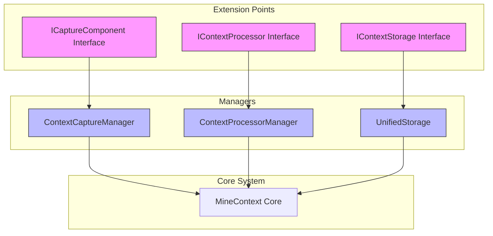
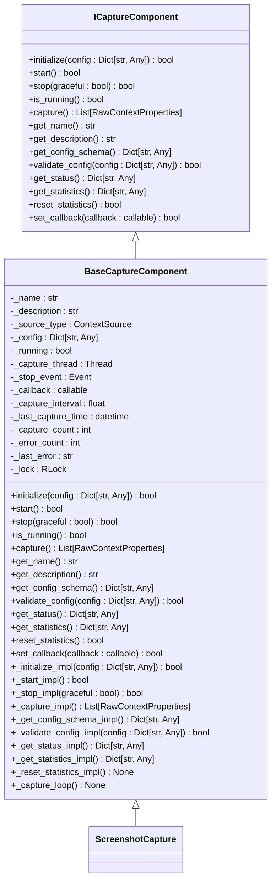
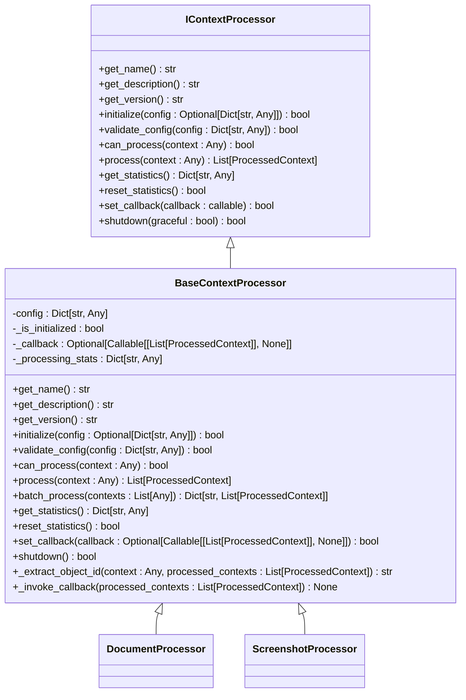
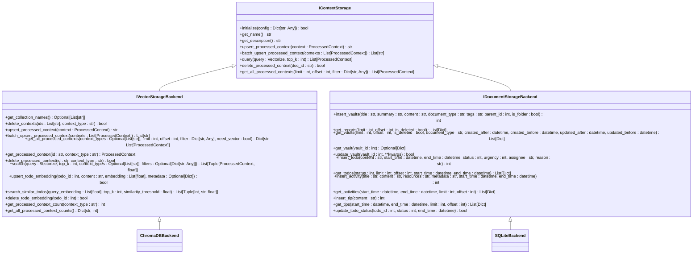
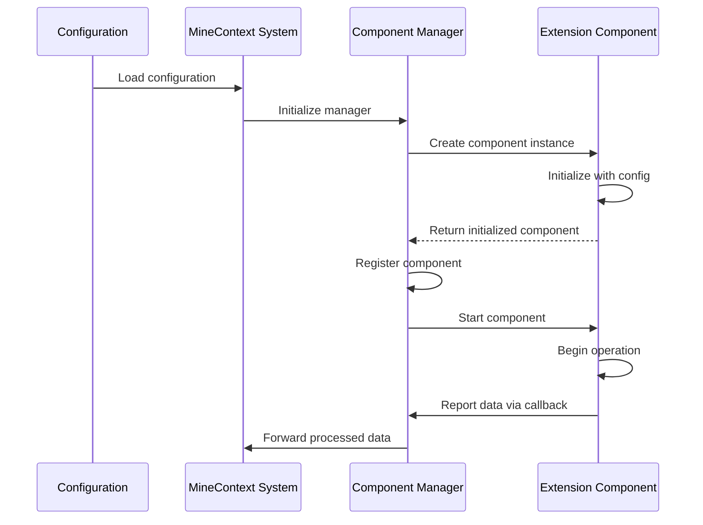
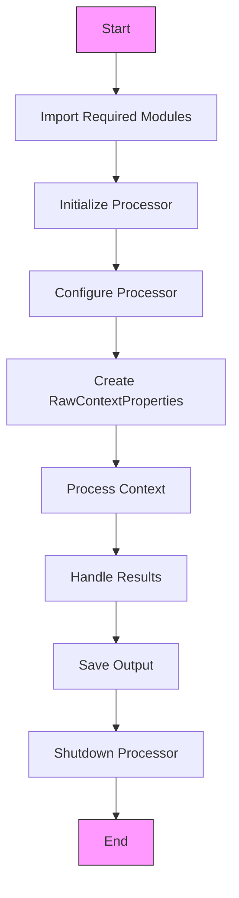

# Extension Points

<cite>
**Referenced Files in This Document**   
- [capture_interface.py](file://opencontext/interfaces/capture_interface.py)
- [processor_interface.py](file://opencontext/interfaces/processor_interface.py)
- [storage_interface.py](file://opencontext/interfaces/storage_interface.py)
- [capture_manager.py](file://opencontext/managers/capture_manager.py)
- [processor_manager.py](file://opencontext/managers/processor_manager.py)
- [base.py](file://opencontext/context_capture/base.py)
- [base_processor.py](file://opencontext/context_processing/processor/base_processor.py)
- [base_storage.py](file://opencontext/storage/base_storage.py)
- [screenshot.py](file://opencontext/context_capture/screenshot.py)
- [document_processor.py](file://opencontext/context_processing/processor/document_processor.py)
- [chromadb_backend.py](file://opencontext/storage/backends/chromadb_backend.py)
- [unified_storage.py](file://opencontext/storage/unified_storage.py)
- [context.py](file://opencontext/models/context.py)
- [example_document_processor.py](file://examples/example_document_processor.py)
- [example_screenshot_processor.py](file://examples/example_screenshot_processor.py)
</cite>

## Table of Contents
1. [Introduction](#introduction)
2. [Plugin Architecture Overview](#plugin-architecture-overview)
3. [ICaptureComponent Interface](#icapturecomponent-interface)
4. [IContextProcessor Interface](#icontextprocessor-interface)
5. [IContextStorage Interface](#icontextstorage-interface)
6. [Extension Registration and Discovery](#extension-registration-and-discovery)
7. [Configuration Requirements](#configuration-requirements)
8. [Practical Implementation Examples](#practical-implementation-examples)
9. [Best Practices for Extension Development](#best-practices-for-extension-development)
10. [Conclusion](#conclusion)

## Introduction
MineContext provides a flexible plugin architecture that allows developers to extend its functionality through custom components for capture, processing, and storage. This document details the extension points available in the system, focusing on the Python interfaces that define how developers can create and integrate new components. The architecture is designed to be modular and extensible, enabling the addition of new capture sources, data processors, and storage backends without modifying the core system. By implementing the provided interfaces, developers can create custom extensions that seamlessly integrate with MineContext's existing functionality.

## Plugin Architecture Overview

MineContext's plugin architecture is built around three core interfaces: `ICaptureComponent`, `IContextProcessor`, and `IContextStorage`. These interfaces define the contracts for capture, processing, and storage components, respectively. The system uses a manager-based approach to coordinate these components, with `ContextCaptureManager` and `ContextProcessorManager` handling the lifecycle and coordination of capture and processing components. The `UnifiedStorage` class manages storage backends, providing a unified interface for data persistence. Components are discovered and loaded at runtime through configuration, allowing for dynamic extension of the system's capabilities. This architecture promotes loose coupling between components, enabling independent development and deployment of extensions.

**Diagram sources**
- [capture_interface.py](file://opencontext/interfaces/capture_interface.py)
- [processor_interface.py](file://opencontext/interfaces/processor_interface.py)
- [storage_interface.py](file://opencontext/interfaces/storage_interface.py)
- [capture_manager.py](file://opencontext/managers/capture_manager.py)
- [processor_manager.py](file://opencontext/managers/processor_manager.py)
- [unified_storage.py](file://opencontext/storage/unified_storage.py)

**Section sources**
- [capture_interface.py](file://opencontext/interfaces/capture_interface.py)
- [processor_interface.py](file://opencontext/interfaces/processor_interface.py)
- [storage_interface.py](file://opencontext/interfaces/storage_interface.py)
- [capture_manager.py](file://opencontext/managers/capture_manager.py)
- [processor_manager.py](file://opencontext/managers/processor_manager.py)
- [unified_storage.py](file://opencontext/storage/unified_storage.py)

## ICaptureComponent Interface

The `ICaptureComponent` interface defines the contract for context capture components in MineContext. All capture components must implement this interface to ensure consistent behavior across different capture sources. The interface includes methods for initialization, startup, shutdown, and status monitoring, as well as methods for executing capture operations and managing component metadata. Key methods include `initialize()` for setting up the component with configuration, `start()` and `stop()` for managing the component's lifecycle, and `capture()` for executing capture operations. The interface also includes methods for retrieving component information such as name and description, and for validating configuration settings. Components can report captured data through a callback mechanism, allowing for asynchronous data processing.

**Diagram sources**
- [capture_interface.py](file://opencontext/interfaces/capture_interface.py)
- [base.py](file://opencontext/context_capture/base.py)
- [screenshot.py](file://opencontext/context_capture/screenshot.py)

**Section sources**
- [capture_interface.py](file://opencontext/interfaces/capture_interface.py)
- [base.py](file://opencontext/context_capture/base.py)

## IContextProcessor Interface

The `IContextProcessor` interface defines the contract for context processing components in MineContext. This interface enables the creation of custom processors that can transform raw context data into processed context data. Key methods include `initialize()` for setting up the processor with configuration, `can_process()` for determining if a processor can handle specific context data, and `process()` for executing the processing logic. The interface also includes methods for managing processor metadata, such as `get_name()` and `get_description()`, and for monitoring processor performance through statistics collection. Processors can be chained together to create complex processing pipelines, with each processor responsible for a specific transformation or analysis task. The interface supports both synchronous and asynchronous processing, allowing for flexible implementation of different processing strategies.

**Diagram sources**
- [processor_interface.py](file://opencontext/interfaces/processor_interface.py)
- [base_processor.py](file://opencontext/context_processing/processor/base_processor.py)
- [document_processor.py](file://opencontext/context_processing/processor/document_processor.py)

**Section sources**
- [processor_interface.py](file://opencontext/interfaces/processor_interface.py)
- [base_processor.py](file://opencontext/context_processing/processor/base_processor.py)

## IContextStorage Interface

The `IContextStorage` interface defines the contract for context storage components in MineContext. This interface enables the integration of alternative storage backends for processed context data. Key methods include `initialize()` for setting up the storage backend with configuration, `upsert_processed_context()` and `batch_upsert_processed_context()` for storing processed context data, and `query()` for retrieving stored data. The interface also includes methods for deleting stored data and retrieving storage backend metadata such as name and description. The storage system supports both vector and document storage, with specialized interfaces for each type. The `UnifiedStorage` class provides a facade that routes operations to the appropriate storage backend based on the data type and storage requirements, enabling seamless integration of multiple storage technologies.

**Diagram sources**
- [storage_interface.py](file://opencontext/interfaces/storage_interface.py)
- [base_storage.py](file://opencontext/storage/base_storage.py)
- [chromadb_backend.py](file://opencontext/storage/backends/chromadb_backend.py)

**Section sources**
- [storage_interface.py](file://opencontext/interfaces/storage_interface.py)
- [base_storage.py](file://opencontext/storage/base_storage.py)

## Extension Registration and Discovery

MineContext uses a configuration-driven approach for extension registration and discovery. Components are registered with their respective managers through the system's configuration files, which specify the component type, implementation class, and configuration parameters. The `ContextCaptureManager` and `ContextProcessorManager` classes handle the registration and lifecycle management of capture and processing components, respectively. When the system starts, it reads the configuration and instantiates the specified components, initializing them with their configuration parameters. Components are discovered at runtime based on the configuration, allowing for dynamic loading and unloading of extensions without requiring code changes. The registration process includes validation of component configuration and establishment of callback mechanisms for data flow between components.

**Diagram sources**
- [capture_manager.py](file://opencontext/managers/capture_manager.py)
- [processor_manager.py](file://opencontext/managers/processor_manager.py)

**Section sources**
- [capture_manager.py](file://opencontext/managers/capture_manager.py)
- [processor_manager.py](file://opencontext/managers/processor_manager.py)

## Configuration Requirements

Extensions in MineContext require specific configuration to integrate with the system. Configuration is typically provided through YAML files or dictionary structures that define component parameters and system settings. Each component type has specific configuration requirements, defined by its configuration schema. The configuration schema specifies the required and optional parameters, their data types, and validation rules. For capture components, configuration typically includes parameters such as capture interval, source type, and storage paths. Processor components require configuration for processing parameters, such as batch size and timeout settings. Storage components need configuration for connection parameters, such as host, port, and authentication credentials. Configuration validation is performed at initialization time to ensure that components are properly configured before they are started.

**Configuration Requirements for Extension Components**

| Component Type | Required Parameters | Optional Parameters | Validation Rules |
|----------------|-------------------|-------------------|----------------|
| Capture Component | source_type, name, description | capture_interval, auto_capture, storage_path | capture_interval > 0.1, storage_path must be valid directory |
| Processor Component | name, description | batch_size, batch_timeout, enabled | batch_size > 0, batch_timeout > 0 |
| Storage Component | storage_type, backend, config | default, data_types | config must contain valid connection parameters |

**Section sources**
- [capture_interface.py](file://opencontext/interfaces/capture_interface.py)
- [processor_interface.py](file://opencontext/interfaces/processor_interface.py)
- [storage_interface.py](file://opencontext/interfaces/storage_interface.py)

## Practical Implementation Examples

The MineContext codebase includes several practical examples that demonstrate how to implement and use extension components. The `example_document_processor.py` and `example_screenshot_processor.py` files in the examples directory show how to use existing processors to handle different types of documents and screenshots. These examples illustrate the process of initializing processors, configuring them with appropriate parameters, and processing input data. The `ScreenshotCapture` class provides a concrete implementation of the `ICaptureComponent` interface, demonstrating how to implement periodic screen capturing with configurable parameters such as capture interval and image format. Similarly, the `DocumentProcessor` class shows how to implement the `IContextProcessor` interface for processing various document formats, including PDF, DOCX, and image files.

**Diagram sources**
- [example_document_processor.py](file://examples/example_document_processor.py)
- [example_screenshot_processor.py](file://examples/example_screenshot_processor.py)

**Section sources**
- [example_document_processor.py](file://examples/example_document_processor.py)
- [example_screenshot_processor.py](file://examples/example_screenshot_processor.py)

## Best Practices for Extension Development

When developing extensions for MineContext, several best practices should be followed to ensure robust and maintainable code. First, extensions should implement proper error handling and logging to facilitate debugging and monitoring. Components should validate their configuration parameters and provide meaningful error messages when validation fails. Performance considerations are important, especially for components that run continuously or process large amounts of data. Extensions should be designed to be stateless where possible, minimizing memory usage and avoiding potential memory leaks. Testing is crucial, and extensions should include comprehensive unit tests that cover both normal operation and edge cases. Documentation should be provided for all public methods and configuration parameters, following the same standards as the core system.

**Best Practices Checklist for Extension Development**

- [x] Implement comprehensive error handling and logging
- [x] Validate configuration parameters with clear error messages
- [x] Optimize performance for high-frequency operations
- [x] Minimize memory usage and avoid memory leaks
- [x] Write comprehensive unit tests covering normal and edge cases
- [x] Provide clear documentation for all public methods and parameters
- [x] Follow coding standards and naming conventions of the core system
- [x] Implement proper resource cleanup in shutdown methods
- [x] Use asynchronous operations where appropriate to avoid blocking
- [x] Design components to be stateless when possible

**Section sources**
- [base.py](file://opencontext/context_capture/base.py)
- [base_processor.py](file://opencontext/context_processing/processor/base_processor.py)
- [base_storage.py](file://opencontext/storage/base_storage.py)

## Conclusion
MineContext's extension system provides a powerful and flexible framework for extending the functionality of the platform. By implementing the `ICaptureComponent`, `IContextProcessor`, and `IContextStorage` interfaces, developers can create custom components that integrate seamlessly with the core system. The plugin architecture promotes modularity and loose coupling, enabling independent development and deployment of extensions. The configuration-driven approach to component registration and discovery allows for dynamic loading of extensions without requiring code changes. With proper implementation of the interfaces and adherence to best practices, developers can create robust and maintainable extensions that enhance the capabilities of MineContext for specific use cases and requirements.

**Section sources**
- [capture_interface.py](file://opencontext/interfaces/capture_interface.py)
- [processor_interface.py](file://opencontext/interfaces/processor_interface.py)
- [storage_interface.py](file://opencontext/interfaces/storage_interface.py)