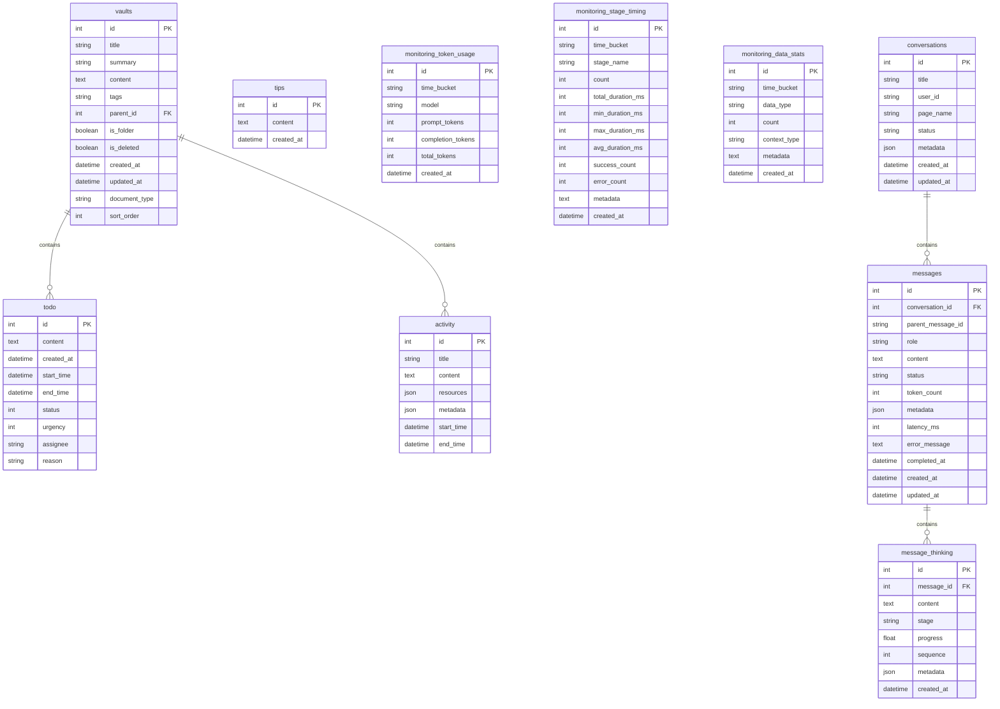

# Storage Backends

<cite>
**Referenced Files in This Document**   
- [storage_interface.py](file://opencontext/interfaces/storage_interface.py)
- [base_storage.py](file://opencontext/storage/base_storage.py)
- [sqlite_backend.py](file://opencontext/storage/backends/sqlite_backend.py)
- [chromadb_backend.py](file://opencontext/storage/backends/chromadb_backend.py)
- [qdrant_backend.py](file://opencontext/storage/backends/qdrant_backend.py)
- [unified_storage.py](file://opencontext/storage/unified_storage.py)
- [global_storage.py](file://opencontext/storage/global_storage.py)
- [context.py](file://opencontext/models/context.py)
- [config.yaml](file://config/config.yaml)
</cite>

## Table of Contents
1. [Introduction](#introduction)
2. [IContextStorage Interface](#icontextstorage-interface)
3. [Data Models](#data-models)
4. [Storage Backend Implementations](#storage-backend-implementations)
5. [Initialization and Configuration](#initialization-and-configuration)
6. [Query Semantics and Vector Search](#query-semantics-and-vector-search)
7. [Performance Considerations](#performance-considerations)
8. [Error Handling and Data Consistency](#error-handling-and-data-consistency)
9. [Testing and Validation](#testing-and-validation)
10. [Conclusion](#conclusion)

## Introduction
The MineContext storage system provides a flexible and extensible architecture for managing context data through multiple storage backends. This document details the storage backend integration, focusing on the IContextStorage interface, data models, implementation details for SQLite and ChromaDB backends, initialization processes, query semantics, performance considerations, and best practices for error handling and testing. The unified storage system allows seamless integration of alternative storage systems while maintaining consistent data access patterns across the application.

## IContextStorage Interface
The IContextStorage interface defines the contract for all storage backends in MineContext, ensuring consistent data access patterns regardless of the underlying storage technology. This abstract base class specifies essential methods for storing, retrieving, and managing processed context data.

```mermaid
classDiagram
class IContextStorage {
<<interface>>
+initialize(config : Dict[str, Any]) bool
+get_name() str
+get_description() str
+upsert_processed_context(context : ProcessedContext) str
+batch_upsert_processed_context(contexts : List[ProcessedContext]) List[str]
+query(query : Vectorize, top_k : int = 5) List[ProcessedContext]
+delete_processed_context(doc_id : str) bool
+get_all_processed_contexts(limit : int = 100, offset : int = 0, filter : Dict[str, Any] = {}) List[ProcessedContext]
}
class IVectorStorageBackend {
<<interface>>
+get_collection_names() Optional[List[str]]
+delete_contexts(ids : List[str], context_type : str) bool
+upsert_processed_context(context : ProcessedContext) str
+batch_upsert_processed_context(contexts : List[ProcessedContext]) List[str]
+get_all_processed_contexts(context_types : Optional[List[str]], limit : int = 100, offset : int = 0, filter : Optional[Dict[str, Any]], need_vector : bool = False) Dict[str, List[ProcessedContext]]
+get_processed_context(id : str, context_type : str) ProcessedContext
+delete_processed_context(id : str, context_type : str) bool
+search(query : Vectorize, top_k : int = 10, context_types : Optional[List[str]], filters : Optional[Dict[str, Any]]) List[Tuple[ProcessedContext, float]]
+upsert_todo_embedding(todo_id : int, content : str, embedding : List[float], metadata : Optional[Dict]) bool
+search_similar_todos(query_embedding : List[float], top_k : int = 10, similarity_threshold : float = 0.85) List[Tuple[int, str, float]]
+delete_todo_embedding(todo_id : int) bool
+get_processed_context_count(context_type : str) int
+get_all_processed_context_counts() Dict[str, int]
}
class IDocumentStorageBackend {
<<interface>>
+insert_vaults(title : str, summary : str, content : str, document_type : str, tags : str = None, parent_id : int = None, is_folder : bool = False) int
+get_reports(limit : int = 100, offset : int = 0, is_deleted : bool = False) List[Dict]
+get_vaults(limit : int = 100, offset : int = 0, is_deleted : bool = False, document_type : str = None, created_after : datetime = None, created_before : datetime = None, updated_after : datetime = None, updated_before : datetime = None) List[Dict]
+get_vault(vault_id : int) Optional[Dict]
+update_vault(vault_id : int, **kwargs) bool
+insert_todo(content : str, start_time : datetime = None, end_time : datetime = None, status : int = 0, urgency : int = 0, assignee : str = None, reason : str = None) int
+get_todos(status : int = None, limit : int = 100, offset : int = 0, start_time : datetime = None, end_time : datetime = None) List[Dict]
+insert_activity(title : str, content : str, resources : str = None, metadata : str = None, start_time : datetime = None, end_time : datetime = None) int
+get_activities(start_time : datetime = None, end_time : datetime = None, limit : int = 100, offset : int = 0) List[Dict]
+insert_tip(content : str) int
+get_tips(limit : int = 100, offset : int = 0) List[Dict]
+update_todo_status(todo_id : int, status : int, end_time : datetime = None) bool
}
IContextStorage <|-- IVectorStorageBackend
IContextStorage <|-- IDocumentStorageBackend
```

**Diagram sources**
- [storage_interface.py](file://opencontext/interfaces/storage_interface.py#L18-L65)
- [base_storage.py](file://opencontext/storage/base_storage.py#L83-L187)

**Section sources**
- [storage_interface.py](file://opencontext/interfaces/storage_interface.py#L18-L65)
- [base_storage.py](file://opencontext/storage/base_storage.py#L83-L187)

### upsert_processed_context Method
The `upsert_processed_context` method is responsible for storing or updating a single ProcessedContext object in the storage backend. This method takes a ProcessedContext object as input and returns a string identifier for the stored context. The operation is idempotent, meaning that if a context with the same ID already exists, it will be updated; otherwise, a new context will be created. This method is fundamental for persisting processed context data generated by the system's context processing components.

### query Method
The `query` method enables vector similarity search across stored context data. It accepts a Vectorize object containing the query content and an optional `top_k` parameter specifying the maximum number of results to return (defaulting to 5). The method returns a list of ProcessedContext objects ranked by their similarity to the query vector. This functionality is essential for retrieving relevant context information based on semantic similarity rather than exact keyword matching, enabling more intelligent and context-aware applications.

### get_all_processed_contexts Method
The `get_all_processed_contexts` method retrieves all stored processed contexts with optional filtering and pagination. It accepts parameters for limiting the number of results, specifying an offset for pagination, and applying filters to narrow the results. This method provides comprehensive access to the stored context data, allowing applications to browse, filter, and analyze the complete context repository. The method returns a list of ProcessedContext objects, preserving the rich metadata and relationships defined in the data model.

## Data Models
The storage system relies on well-defined data models to ensure consistency across different storage implementations. The core models include ProcessedContext and Vectorize, which encapsulate the structure and metadata of stored context data.


**Diagram sources**
- [context.py](file://opencontext/models/context.py#L131-L202)

**Section sources**
- [context.py](file://opencontext/models/context.py#L131-L202)

### ProcessedContext Model
The ProcessedContext model represents the primary data structure for storing context information in MineContext. It contains several key components: an ID for unique identification, properties that capture metadata about the context, extracted_data that holds information derived from the original content, a vectorize field for embedding data, and optional metadata for additional structured information. This comprehensive structure allows the system to preserve rich context information while enabling efficient retrieval and analysis.

### Vectorize Object
The Vectorize object is responsible for managing the vector representation of context data. It includes fields for specifying the content format (text or image), the actual content (text or image path), and the vector embedding. The object also provides methods for retrieving the content to be vectorized. This model ensures that both the original content and its vector representation are stored together, facilitating both semantic search and content retrieval.

## Storage Backend Implementations
MineContext supports multiple storage backends through a unified interface, allowing flexibility in choosing the appropriate storage technology for different use cases. The system currently includes implementations for SQLite and ChromaDB, with support for Qdrant as an alternative vector database.

### SQLite Backend
The SQLite backend provides document storage capabilities, specializing in storing structured data such as reports, todos, activities, and tips. It uses a relational database schema with multiple tables to organize different types of data.



**Diagram sources**
- [sqlite_backend.py](file://opencontext/storage/backends/sqlite_backend.py#L66-L340)

**Section sources**
- [sqlite_backend.py](file://opencontext/storage/backends/sqlite_backend.py#L29-L800)

The SQLite backend implements the IDocumentStorageBackend interface, providing methods for inserting, retrieving, and updating various types of structured data. It uses SQLite's JSON support for storing complex metadata and includes comprehensive indexing to optimize query performance. The backend also handles database initialization, creating tables and indexes when first initialized, and supports schema evolution through ALTER TABLE statements.

### ChromaDB Backend
The ChromaDB backend provides vector database capabilities, specializing in storing and retrieving ProcessedContext objects through vector similarity search. It creates separate collections for each context type, enabling efficient organization and retrieval of different types of context data.


**Diagram sources**
- [chromadb_backend.py](file://opencontext/storage/backends/chromadb_backend.py#L33-L449)

**Section sources**
- [chromadb_backend.py](file://opencontext/storage/backends/chromadb_backend.py#L33-L800)

The ChromaDB backend implements the IVectorStorageBackend interface, providing advanced vector search capabilities. It handles connection management, supporting both local persistence mode and server mode. The backend includes features for graceful shutdown, connection retry with exponential backoff, and pending write handling to ensure data durability. It also implements collection management, creating separate collections for each context type and a dedicated collection for todo deduplication.

### Qdrant Backend
The Qdrant backend provides an alternative vector database implementation, offering similar functionality to the ChromaDB backend but with different performance characteristics and deployment options. It uses UUIDs for point identifiers and supports both local file-based storage and server mode.

The Qdrant backend implements the same IVectorStorageBackend interface as ChromaDB, ensuring consistent behavior across different vector database implementations. It includes methods for creating collections with appropriate vector configurations, converting context objects to Qdrant's point format, and handling vector search operations. The backend also provides todo deduplication functionality through a dedicated collection.

## Initialization and Configuration
The storage system initialization process is managed through configuration files and a factory pattern that creates appropriate backend instances based on the specified configuration.


**Diagram sources**
- [unified_storage.py](file://opencontext/storage/unified_storage.py#L107-L158)
- [global_storage.py](file://opencontext/storage/global_storage.py#L87-L90)

**Section sources**
- [unified_storage.py](file://opencontext/storage/unified_storage.py#L90-L158)
- [global_storage.py](file://opencontext/storage/global_storage.py#L82-L99)
- [config.yaml](file://config/config.yaml#L146-L182)

### Configuration Structure
The storage configuration is defined in the config.yaml file, which specifies the enabled backends and their parameters. The configuration includes a list of backends, each with a name, storage type (vector_db or document_db), backend implementation (e.g., chromadb, qdrant, sqlite), and specific configuration parameters. This structure allows for flexible composition of storage systems, enabling the use of different backends for different purposes.

For vector databases, the configuration supports both local and server modes. In local mode, the path parameter specifies the directory for persistent storage. In server mode, parameters such as host, port, SSL settings, and authentication headers can be configured. The document database configuration specifies the path to the SQLite database file.

### Initialization Process
The initialization process begins with the GlobalStorage singleton, which automatically initializes the storage system based on the configuration. It creates a UnifiedStorage instance and initializes it with the configured backends. The UnifiedStorage uses a StorageBackendFactory to create specific backend instances based on the configuration. Each backend is then initialized with its specific configuration, establishing connections and creating necessary collections or tables.

## Query Semantics and Vector Search
The storage system provides sophisticated query capabilities, particularly for vector similarity search, which is essential for retrieving contextually relevant information.

### Query Method Semantics
The query method performs vector similarity search using the configured vector database backend. It accepts a Vectorize object containing the query content and an optional top_k parameter that determines the maximum number of results to return. The method first ensures the query is vectorized, either using an existing vector or generating a new one through the embedding service. It then performs a similarity search against the vector database, returning results ranked by their similarity score.

The top_k parameter directly affects result retrieval by limiting the number of results returned. A smaller top_k value provides faster response times but may miss relevant results, while a larger value increases recall at the cost of performance. The optimal value depends on the specific use case and performance requirements.

### Vector Search Implementation
The vector search implementation varies between backends but follows a consistent pattern. In ChromaDB, the search method uses the collection.query method with the query_embeddings parameter. In Qdrant, it uses the query_points method. Both implementations support filtering by context type and additional metadata filters.

The search results are returned as a list of tuples containing the ProcessedContext object and its similarity score. The scores are normalized to a 0-1 range, with 1 indicating perfect similarity. The results are sorted in descending order of similarity, ensuring the most relevant contexts are returned first.

## Performance Considerations
The storage system includes several features to optimize performance for vector similarity searches, indexing, and handling large datasets.

### Vector Similarity Search Optimization
Both vector database backends use HNSW (Hierarchical Navigable Small World) indexing for efficient similarity search. This indexing method provides fast approximate nearest neighbor search with configurable parameters for accuracy and performance. The ChromaDB backend configures HNSW with cosine distance metric, while Qdrant allows explicit configuration of the vector size and distance metric.

### Indexing Strategies
The SQLite backend employs comprehensive indexing to optimize query performance. It creates indexes on frequently queried fields such as creation time, document type, status, and urgency. These indexes significantly improve the performance of common queries, such as retrieving recent documents or filtering todos by status.

The vector databases automatically create indexes on vector embeddings, optimizing similarity search performance. The indexing strategy is configured through the backend configuration, allowing adjustment of parameters such as M (maximum number of connections per layer) and ef_construction (construction time parameter) to balance indexing speed and search performance.

### Large Dataset Handling
The storage system includes several features for handling large datasets efficiently. The UnifiedStorage class provides pagination support through limit and offset parameters in retrieval methods. The vector databases support efficient retrieval of large result sets through streaming or batched queries.

For monitoring data, the system uses time-based aggregation with hourly buckets, reducing the storage footprint while preserving temporal patterns. This approach enables efficient querying of time-series data without storing every individual event.

## Error Handling and Data Consistency
The storage system implements robust error handling and data consistency mechanisms to ensure reliability and durability.

### Error Handling Strategies
Each backend implements comprehensive error handling for database operations. The SQLite backend uses try-except blocks with explicit transaction management, rolling back transactions on failure. It also handles database connection errors and schema evolution issues.

The vector database backends implement connection health checks and automatic reconnection with exponential backoff. They also handle transient network errors and server unavailability through retry mechanisms. Both backends log detailed error information for debugging and monitoring.

### Transaction Management
The SQLite backend uses explicit transaction management with commit and rollback operations to ensure data consistency. All write operations are wrapped in transactions, preventing partial updates in case of errors.

The vector database backends rely on the underlying database's transaction semantics. ChromaDB and Qdrant provide atomic operations for upsert and delete operations, ensuring data consistency at the point level.

### Data Consistency Guarantees
The storage system ensures data consistency through several mechanisms. The UnifiedStorage class provides a consistent interface across different backends, ensuring that operations have predictable behavior regardless of the underlying storage technology. The factory pattern ensures that only properly initialized backends are used, preventing operations on uninitialized storage.

For critical operations, the system implements write-ahead logging and periodic persistence. The ChromaDB backend, for example, persists the index immediately after batch writes to prevent data loss in case of application crashes.

## Testing and Validation
The storage backend implementations should be thoroughly tested to ensure reliability and correctness.

### Testing Best Practices
Unit tests should verify the core functionality of each storage method, including upsert, query, and delete operations. Integration tests should validate the complete workflow, from initialization to data retrieval. Performance tests should measure query latency and throughput under various load conditions.

### Validation of Query Accuracy
Query accuracy should be validated by testing with known datasets and verifying that the most similar contexts are returned with the highest scores. This can be done by creating test contexts with controlled similarity relationships and verifying that the search results reflect these relationships.

## Conclusion
The MineContext storage system provides a flexible and extensible architecture for integrating alternative storage systems. Through the IContextStorage interface and unified storage layer, the system supports multiple backend implementations while maintaining consistent data access patterns. The detailed data models, comprehensive configuration options, and robust error handling ensure reliable and efficient storage and retrieval of context data. By following the documented patterns and best practices, developers can successfully integrate new storage backends and optimize the system for their specific use cases.