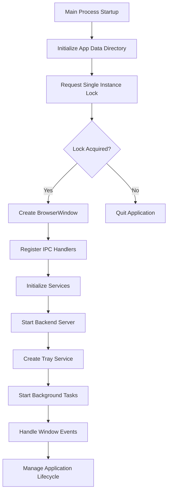
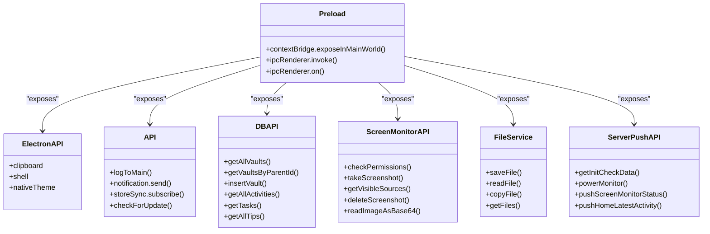
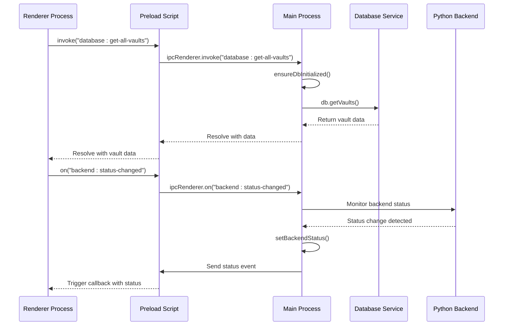
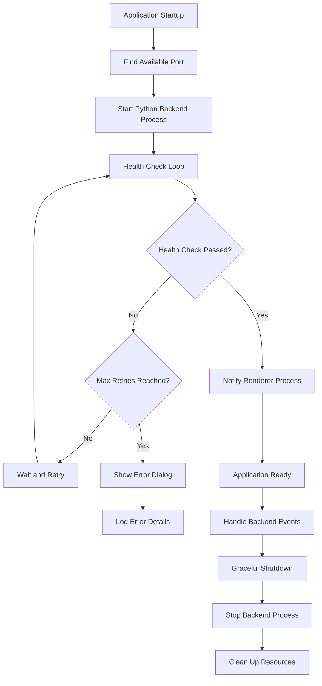
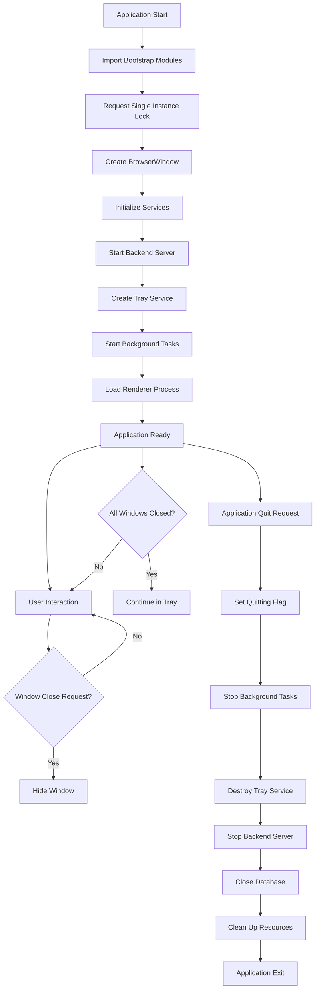

# Electron Process Architecture

<cite>
**Referenced Files in This Document**   
- [index.ts](file://frontend/src/main/index.ts)
- [backend.ts](file://frontend/src/main/backend.ts)
- [ipc.ts](file://frontend/src/main/ipc.ts)
- [index.ts](file://frontend/src/preload/index.ts)
- [server-push-api.tsx](file://frontend/src/preload/server-push-api.tsx)
- [electron.vite.config.ts](file://frontend/electron.vite.config.ts)
</cite>

## Table of Contents
1. [Introduction](#introduction)
2. [Three-Process Model Overview](#three-process-model-overview)
3. [Main Process Architecture](#main-process-architecture)
4. [Renderer Process Architecture](#renderer-process-architecture)
5. [Preload Scripts and Context Bridging](#preload-scripts-and-context-bridging)
6. [Inter-Process Communication (IPC) Architecture](#inter-process-communication-ipc-architecture)
7. [Python Backend Integration](#python-backend-integration)
8. [Security Implementation](#security-implementation)
9. [Application Lifecycle Management](#application-lifecycle-management)
10. [Architecture Diagram](#architecture-diagram)

## Introduction
MineContext implements a robust Electron application architecture based on the three-process model, which separates concerns between system-level operations, UI rendering, and secure context bridging. This architecture enables the application to maintain high performance, security, and maintainability while providing a rich desktop experience. The system is designed with clear separation of responsibilities between the main process, renderer process, and preload scripts, ensuring that sensitive operations are properly isolated and that communication between processes is secure and efficient.

## Three-Process Model Overview
The MineContext Electron application follows the standard Electron three-process architecture, which consists of:

1. **Main Process**: Responsible for system-level operations, window management, and application lifecycle control
2. **Renderer Process**: Handles React UI rendering and user interactions within the browser window
3. **Preload Scripts**: Serve as a secure bridge between the main and renderer processes, exposing limited Node.js APIs

This architectural pattern ensures that the application maintains security by isolating the potentially vulnerable renderer process from direct access to system resources, while still enabling necessary functionality through controlled communication channels. The main process acts as the central coordinator, managing system integration, IPC communication, and Python backend management, while the renderer process focuses exclusively on UI components and user interactions.

**Section sources**
- [index.ts](file://frontend/src/main/index.ts)
- [electron.vite.config.ts](file://frontend/electron.vite.config.ts)

## Main Process Architecture
The main process in MineContext is responsible for system-level operations and serves as the central hub for application functionality. Implemented in `index.ts`, the main process handles window creation, system integration, and lifecycle management. It initializes the application by creating the primary BrowserWindow with specific configurations, including custom titlebar styling on macOS and proper window dimensions.

Key responsibilities of the main process include:
- Application lifecycle management from startup to shutdown
- Window creation and management with proper event handling
- System integration through Electron's native APIs
- Python backend subprocess management
- Tray service initialization and management
- Screenshot cleanup task scheduling
- Power monitoring and system event handling

The main process also manages the application's single-instance lock, ensuring only one instance runs at a time, and handles window activation events to restore hidden windows when the application is reactivated. It implements proper cleanup procedures during application shutdown, including stopping background tasks, destroying the tray service, and terminating the Python backend server.



**Diagram sources**
- [index.ts](file://frontend/src/main/index.ts#L124-L194)
- [bootstrap.ts](file://frontend/src/main/bootstrap.ts#L1-L75)

**Section sources**
- [index.ts](file://frontend/src/main/index.ts#L1-L348)
- [bootstrap.ts](file://frontend/src/main/bootstrap.ts#L1-L75)

## Renderer Process Architecture
The renderer process in MineContext is responsible for rendering the React-based user interface and handling user interactions. Located in the `frontend/src/renderer` directory, this process runs in a sandboxed environment that prevents direct access to Node.js and system resources for security reasons.

The renderer process architecture includes:
- React component hierarchy for UI rendering
- State management using Redux for application state
- Event handling for user interactions
- API consumption through the exposed preload interfaces
- UI-specific services and utilities

The entry point for the renderer process is `main.tsx`, which creates the React root and renders the App component. The UI is organized into pages, components, and services, following a modular structure that promotes reusability and maintainability. The renderer process communicates with the main process exclusively through the IPC mechanism exposed via preload scripts, ensuring that all system-level operations are properly mediated.

**Section sources**
- [main.tsx](file://frontend/src/renderer/src/main.tsx#L1-L9)
- [index.ts](file://frontend/src/preload/index.ts#L1-L157)

## Preload Scripts and Context Bridging
The preload scripts in MineContext serve as a critical security layer between the main and renderer processes, implementing context isolation while exposing necessary functionality. The `index.ts` file in the preload directory uses Electron's `contextBridge` API to expose a controlled set of interfaces to the renderer process.

The preload script architecture includes:
- Secure API exposure through `contextBridge.exposeInMainWorld`
- Multiple API categories for different functionality domains
- Type safety through TypeScript definitions
- Error handling and logging mechanisms

Key API categories exposed through the preload script include:
- **api**: Core application functionality and logging
- **dbAPI**: Database operations for vaults, activities, and tasks
- **screenMonitorAPI**: Screen monitoring and screenshot functionality
- **fileService**: File operations and management
- **serverPushAPI**: Server push notifications and event handling

The preload script also implements a message listener for main process logs, allowing the renderer to display diagnostic information while maintaining security boundaries. This approach ensures that the renderer process can access necessary functionality without compromising the application's security model.



**Diagram sources**
- [index.ts](file://frontend/src/preload/index.ts#L1-L157)
- [server-push-api.tsx](file://frontend/src/preload/server-push-api.tsx#L1-L47)

**Section sources**
- [index.ts](file://frontend/src/preload/index.ts#L1-L157)
- [server-push-api.tsx](file://frontend/src/preload/server-push-api.tsx#L1-L47)
- [index.d.ts](file://frontend/src/preload/index.d.ts#L1-L47)

## Inter-Process Communication (IPC) Architecture
The IPC architecture in MineContext provides a structured and secure communication channel between the main and renderer processes. Implemented in `ipc.ts`, this system uses Electron's IPC mechanism with a well-defined channel naming convention and type safety.

The IPC system architecture includes:
- Request-response pattern using `ipcMain.handle()` and `ipcRenderer.invoke()`
- Event-driven communication using `ipcRenderer.on()` for server push notifications
- Comprehensive channel enumeration in `IpcChannel.ts`
- Error handling and logging for IPC operations
- Service-specific handlers for different functionality domains

Key IPC channel categories include:
- **App**: Application lifecycle and system operations
- **Database**: Data persistence operations for vaults, activities, and tasks
- **Screen Monitor**: Screen capture and monitoring functionality
- **File**: File operations and management
- **Backend**: Python backend service communication
- **Tray**: System tray interaction and status updates

The IPC handlers in the main process typically follow a pattern of ensuring database initialization before processing requests, providing robust error handling, and logging operations for debugging purposes. This architecture enables the renderer process to perform system-level operations while maintaining proper separation of concerns and security boundaries.



**Diagram sources**
- [ipc.ts](file://frontend/src/main/ipc.ts#L1-L610)
- [IpcChannel.ts](file://frontend/packages/shared/IpcChannel.ts#L1-L349)

**Section sources**
- [ipc.ts](file://frontend/src/main/ipc.ts#L1-L610)
- [IpcChannel.ts](file://frontend/packages/shared/IpcChannel.ts#L1-L349)

## Python Backend Integration
MineContext integrates a Python backend service that runs as a separate subprocess managed by the Electron main process. This architecture enables the application to leverage Python's capabilities for AI and data processing while maintaining the Electron framework for the desktop interface.

The backend integration is implemented in `backend.ts` and includes the following key components:

### Backend Lifecycle Management
- **Port Management**: Dynamically finds an available port starting from 1733
- **Process Spawning**: Uses Node.js child_process.spawn to start the Python executable
- **Health Checking**: Implements a robust health check mechanism with retry logic
- **Graceful Termination**: Properly terminates the backend process on application shutdown
- **Error Handling**: Comprehensive error handling and user feedback for startup failures

### Backend Communication
- **HTTP API**: Communicates with the Python backend via HTTP on localhost
- **Authentication**: Uses a shared token for authentication between frontend and backend
- **Event Push**: Implements server push notifications for backend events
- **Status Monitoring**: Tracks backend status and notifies the renderer process

### Key Functions
- `ensureBackendRunning()`: Ensures the backend is running and healthy
- `startBackendServer()`: Starts the backend server with proper configuration
- `stopBackendServer()`: Gracefully stops the backend server
- `checkBackendHealth()`: Performs health checks with retry logic
- `getBackendPort()`: Returns the current backend port

The Python backend is packaged as a standalone executable using PyInstaller (as seen in `opencontext.spec`) and is bundled with the Electron application. This ensures that users don't need to install Python separately and that the application can run in a consistent environment.



**Diagram sources**
- [backend.ts](file://frontend/src/main/backend.ts#L1-L740)
- [opencontext.spec](file://opencontext.spec#L1-L127)

**Section sources**
- [backend.ts](file://frontend/src/main/backend.ts#L1-L740)
- [opencontext.spec](file://opencontext.spec#L1-L127)

## Security Implementation
MineContext implements a comprehensive security model that follows Electron best practices and addresses common security concerns in desktop applications.

### Context Isolation
The application enables context isolation in the BrowserWindow configuration, which prevents the renderer process from accessing Node.js APIs directly. This is implemented in `index.ts` with the `contextIsolation: true` setting in the webPreferences. The preload script uses `contextBridge.exposeInMainWorld()` to expose only specific, vetted APIs to the renderer process, creating a secure bridge between the isolated contexts.

### Sandbox and Security Settings
The application configures the following security settings:
- `sandbox: false` (required for certain Electron APIs but mitigated by context isolation)
- `webSecurity: false` (necessary for certain development and integration scenarios)
- Proper handling of external links by opening them in the default browser
- Secure IPC communication with validation and error handling

### Sensitive Operation Restriction
All sensitive operations are restricted to the main process, including:
- File system access
- Database operations
- Python backend management
- System tray interaction
- Application lifecycle control

The renderer process can only perform these operations through the IPC channels exposed by the preload script, ensuring that all operations are properly mediated and validated.

### Input Validation and Error Handling
The application implements robust error handling in both the main and renderer processes, with proper logging and user feedback. Sensitive information is redacted from logs, and error messages are sanitized before being displayed to users.

**Section sources**
- [index.ts](file://frontend/src/main/index.ts#L143-L147)
- [index.ts](file://frontend/src/preload/index.ts#L124-L151)
- [ipc.ts](file://frontend/src/main/ipc.ts#L43-L610)

## Application Lifecycle Management
The application lifecycle in MineContext is carefully managed from startup to shutdown, ensuring proper initialization and cleanup of all components.

### Startup Sequence
1. **Initialization**: The main process starts and imports bootstrap modules
2. **Single Instance Check**: Requests a single instance lock to prevent multiple instances
3. **Window Creation**: Creates the BrowserWindow with proper configuration
4. **Service Initialization**: Initializes database, logging, and other services
5. **Backend Startup**: Starts the Python backend server in the background
6. **UI Loading**: Loads the renderer process HTML/JavaScript

### Window Management
The application implements custom window behavior:
- Windows are hidden rather than closed when the user attempts to close them
- On macOS, the application continues running in the tray when windows are closed
- Window activation restores hidden windows
- Proper minimum size constraints are enforced

### Shutdown Sequence
1. **Before Quit**: Sets quitting flag and restores console.log
2. **Cleanup Tasks**: Stops screenshot cleanup and other background tasks
3. **Service Termination**: Destroys tray service and closes database
4. **Backend Shutdown**: Synchronously stops the Python backend server
5. **Resource Cleanup**: Ensures all resources are properly released

The lifecycle management ensures that the application maintains data integrity, properly releases system resources, and provides a smooth user experience across different operating systems.



**Diagram sources**
- [index.ts](file://frontend/src/main/index.ts#L124-L348)
- [backend.ts](file://frontend/src/main/backend.ts#L203-L235)

**Section sources**
- [index.ts](file://frontend/src/main/index.ts#L1-L348)
- [backend.ts](file://frontend/src/main/backend.ts#L1-L740)

## Architecture Diagram
The following diagram illustrates the complete Electron process architecture in MineContext, showing the relationships between the main process, renderer process, preload scripts, and external components.

```mermaid
graph TD
subgraph "Main Process"
A[BrowserWindow] --> B[IPC Handlers]
B --> C[Database Service]
B --> D[Backend Manager]
B --> E[Tray Service]
B --> F[Screenshot Service]
D --> G[Python Backend]
H[Power Monitor] --> B
I[Task Scheduler] --> B
end
subgraph "Preload Context"
J[contextBridge] --> K[Exposed APIs]
K --> L[electron API]
K --> M[app API]
K --> N[dbAPI]
K --> O[screenMonitorAPI]
K --> P[fileService]
K --> Q[serverPushAPI]
end
subgraph "Renderer Process"
R[React UI] --> S[Redux Store]
S --> T[Components]
T --> U[Hooks]
U --> V[IPC Calls]
V --> J
W[Event Listeners] --> J
end
X[Python Backend] --> Y[AI Processing]
X --> Z[Data Storage]
X --> AA[Web Server]
A --> |loads| R
J --> |exposes| V
D --> |manages| X
B --> |handles| V
style Main Process fill:#f0f8ff,stroke:#333
style "Preload Context" fill:#e6f3ff,stroke:#333
style "Renderer Process" fill:#f0fff0,stroke:#333
```

**Diagram sources**
- [index.ts](file://frontend/src/main/index.ts#L1-L348)
- [backend.ts](file://frontend/src/main/backend.ts#L1-L740)
- [ipc.ts](file://frontend/src/main/ipc.ts#L1-L610)
- [index.ts](file://frontend/src/preload/index.ts#L1-L157)