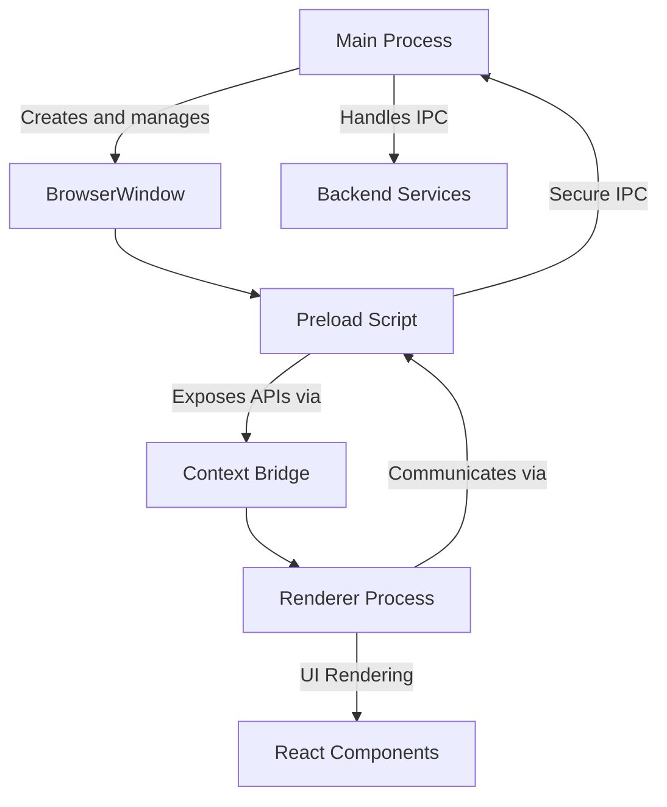
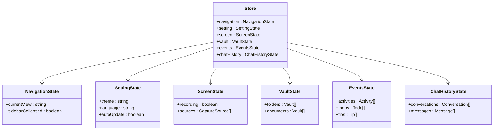
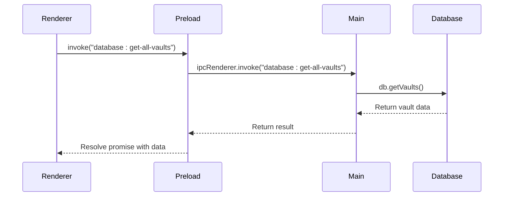
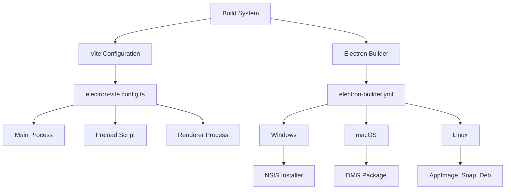
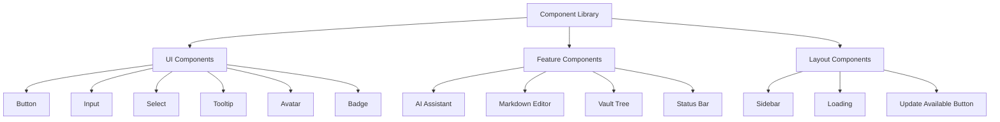
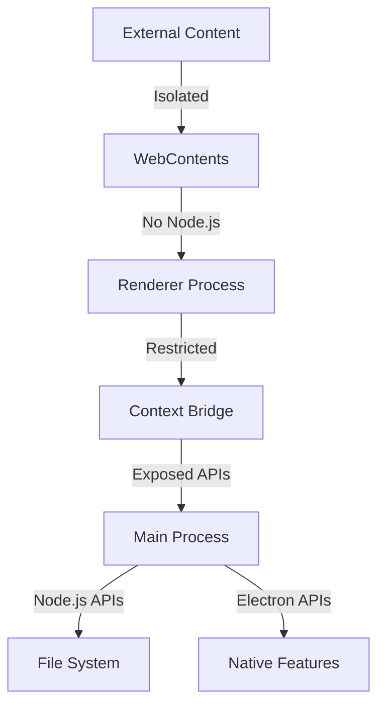
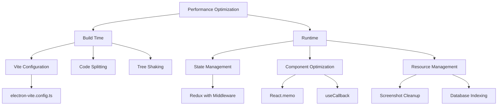

# Frontend Architecture

<cite>
**Referenced Files in This Document**   
- [electron.vite.config.ts](file://frontend/electron.vite.config.ts)
- [electron-builder.yml](file://frontend/electron-builder.yml)
- [package.json](file://frontend/package.json)
- [main/index.ts](file://frontend/src/main/index.ts)
- [preload/index.ts](file://frontend/src/preload/index.ts)
- [IpcChannel.ts](file://frontend/packages/shared/IpcChannel.ts)
- [App.tsx](file://frontend/src/renderer/src/App.tsx)
- [tailwind.config.js](file://frontend/tailwind.config.js)
- [index.ts](file://frontend/src/renderer/src/store/index.ts)
- [ipc.ts](file://frontend/src/main/ipc.ts)
- [button.tsx](file://frontend/src/renderer/src/components/ui/button.tsx)
- [capture.atom.tsx](file://frontend/src/renderer/src/atom/capture.atom.tsx)
</cite>

## Table of Contents
1. [Electron Process Architecture](#electron-process-architecture)
2. [State Management with Jotai and Redux](#state-management-with-jotai-and-redux)
3. [Styling System with Tailwind CSS](#styling-system-with-tailwind-css)
4. [IPC Communication Patterns](#ipc-communication-patterns)
5. [Build System Configuration](#build-system-configuration)
6. [Component Library and UI Organization](#component-library-and-ui-organization)
7. [Security Considerations](#security-considerations)
8. [Performance Optimization](#performance-optimization)

## Electron Process Architecture

The MineContext frontend architecture is built on Electron's multi-process model, which consists of three main components: the main process, the preload script, and the renderer process. This architecture provides a secure and efficient environment for the application to run.

The main process, defined in `src/main/index.ts`, is responsible for managing application windows, handling lifecycle events, and integrating with backend services. It creates the primary BrowserWindow instance and manages the application's overall behavior, including window management and system integration. The main process also handles system-level operations such as file system access, database operations, and communication with external services.

The preload script, located in `src/preload/index.ts`, serves as a secure bridge between the main process and the renderer process. It uses Electron's contextBridge API to expose specific Node.js and Electron APIs to the renderer process while maintaining security boundaries. This script is crucial for implementing secure IPC (Inter-Process Communication) patterns, allowing the renderer process to communicate with the main process without exposing the full Node.js environment.

The renderer process, implemented in `src/renderer/src`, hosts the React-based user interface. This process runs in a web environment and is responsible for rendering the application's UI components and handling user interactions. By separating the UI rendering from the main application logic, the architecture ensures that the user interface remains responsive even when the main process is performing intensive operations.



**Diagram sources**
- [main/index.ts](file://frontend/src/main/index.ts#L124-L194)
- [preload/index.ts](file://frontend/src/preload/index.ts#L4-L157)
- [App.tsx](file://frontend/src/renderer/src/App.tsx#L1-L138)

**Section sources**
- [main/index.ts](file://frontend/src/main/index.ts#L1-L348)
- [preload/index.ts](file://frontend/src/preload/index.ts#L1-L157)
- [App.tsx](file://frontend/src/renderer/src/App.tsx#L1-L138)

## State Management with Jotai and Redux

MineContext employs a hybrid state management approach using both Jotai and Redux to handle different aspects of application state. This combination allows for efficient state management while maintaining a clean separation of concerns.

Redux, configured in `src/renderer/src/store/index.ts`, serves as the primary state management solution for the application. The store is created using Redux Toolkit and is persisted using redux-persist to ensure data survives application restarts. The store contains several slices that manage different aspects of the application state, including navigation, settings, screen state, vault data, events, and chat history. The persistence configuration specifically excludes certain slices like vault and chatHistory from being persisted, as this data is stored in the SQLite database.



**Diagram sources**
- [index.ts](file://frontend/src/renderer/src/store/index.ts#L4-L85)

**Section sources**
- [index.ts](file://frontend/src/renderer/src/store/index.ts#L1-L85)

Jotai is used for more localized state management, particularly for atoms that represent asynchronous data or complex state logic. The `capture.atom.tsx` file demonstrates this pattern by defining atoms for managing capture sources. These atoms use Jotai's loadable utility to handle the loading state of asynchronous operations, providing a clean way to manage data fetching and state updates. The use of Jotai for specific use cases complements the global Redux store by providing a lightweight solution for component-specific state.

The integration between these state management systems is facilitated through middleware. The StoreSyncService, registered in the main process IPC handlers, creates a middleware that synchronizes specific parts of the Redux store across processes. This allows for real-time updates to be propagated throughout the application when state changes occur, ensuring consistency across different components and processes.

## Styling System with Tailwind CSS

The MineContext frontend utilizes Tailwind CSS as its primary styling solution, providing a utility-first approach to CSS that enables rapid UI development and consistent design patterns. The Tailwind configuration is defined in `tailwind.config.js`, which specifies the content sources and theme extensions for the application.

The styling system is designed to work alongside the Arco Design component library, which provides a comprehensive set of UI components. To avoid conflicts between Tailwind's utility classes and Arco Design's CSS, the configuration includes specific settings to manage this integration. The content configuration specifies the file paths where Tailwind should look for class usage, ensuring that only the necessary CSS is generated and reducing bundle size.

```mermaid
graph TD
A[Tailwind CSS] --> B[Configuration]
B --> C[tailwind.config.js]
C --> D[Content Sources]
D --> E[src/renderer/index.html]
D --> F[src/renderer/src/**/*.{js,ts,jsx,tsx}]
C --> G[Theme Extensions]
G --> H[Custom Colors]
G --> I[Typography]
G --> J[Spacing]
A --> I[Utility Classes]
I --> K[Layout]
I --> L[Typography]
I --> M[Spacing]
I --> N[Colors]
I --> O[Effects]
A --> P[Component Library]
P --> Q[Arco Design]
P --> R[Custom Components]
```

**Diagram sources**
- [tailwind.config.js](file://frontend/tailwind.config.js#L1-L26)
- [button.tsx](file://frontend/src/renderer/src/components/ui/button.tsx#L1-L54)

**Section sources**
- [tailwind.config.js](file://frontend/tailwind.config.js#L1-L26)
- [button.tsx](file://frontend/src/renderer/src/components/ui/button.tsx#L1-L54)

The component library in `src/renderer/src/components` demonstrates the integration of Tailwind CSS with React components. Custom components like the Button component use class-variance-authority (cva) to define reusable style variants, combining Tailwind utility classes with custom logic. This approach allows for consistent styling across components while maintaining flexibility for different use cases. The button component, for example, defines multiple variants (default, destructive, outline, secondary, ghost, link) and sizes (default, sm, lg, icon), each with their own combination of Tailwind classes.

The styling system also incorporates Arco Design's theme system through the ConfigProvider component in the App.tsx file. This allows for dynamic theme switching between English and Chinese locales, with the appropriate Arco Design theme (enUS or zhCN) being applied based on the user's language preference. The combination of Tailwind CSS for utility styling and Arco Design for component styling creates a robust and flexible styling system that supports both rapid development and consistent design.

## IPC Communication Patterns

The MineContext application implements a sophisticated IPC (Inter-Process Communication) system that enables secure and efficient communication between the main process, preload script, and renderer process. This system is centered around the IpcChannel abstraction defined in `packages/shared/IpcChannel.ts`, which provides a comprehensive set of named channels for different types of communication.

The IpcChannel enum defines over 300 distinct channels for various operations, categorized by functionality such as application management, database operations, file handling, screen monitoring, and system operations. Each channel is named using a consistent pattern of "domain:operation" (e.g., "app:check-for-update", "database:get-all-vaults"), making it easy to understand the purpose of each communication channel. This centralized definition of IPC channels ensures consistency across the codebase and makes it easier to maintain and extend the communication system.



**Diagram sources**
- [IpcChannel.ts](file://frontend/packages/shared/IpcChannel.ts#L1-L349)
- [ipc.ts](file://frontend/src/main/ipc.ts#L1-L610)
- [preload/index.ts](file://frontend/src/preload/index.ts#L1-L157)

**Section sources**
- [IpcChannel.ts](file://frontend/packages/shared/IpcChannel.ts#L1-L349)
- [ipc.ts](file://frontend/src/main/ipc.ts#L1-L610)
- [preload/index.ts](file://frontend/src/preload/index.ts#L1-L157)

The implementation of IPC handlers in the main process, defined in `src/main/ipc.ts`, follows a structured pattern where each channel is handled by a dedicated function. These handlers typically perform the following steps: ensure the database is initialized, execute the requested operation, and return the result. The handlers are registered using ipcMain.handle(), which creates asynchronous handlers that return promises to the calling process. This approach allows for non-blocking communication between processes, maintaining application responsiveness.

The preload script plays a crucial role in the IPC system by exposing a simplified API to the renderer process through the contextBridge. Instead of exposing raw ipcRenderer methods, the preload script defines higher-level APIs (such as api, dbAPI, screenMonitorAPI) that wrap IPC calls in more intuitive functions. This abstraction layer improves code readability and maintainability while also providing an opportunity to add additional security checks or preprocessing logic.

## Build System Configuration

The MineContext build system is configured using electron-vite.config.ts and electron-builder.yml, providing a comprehensive solution for development, building, and packaging the application. The Vite configuration, defined in electron-vite.config.ts, sets up the build process for the main, preload, and renderer processes, each with their own specific configuration.

The Vite configuration uses the electron-vite plugin to handle the Electron-specific aspects of the build process. It defines separate configurations for each process type, with the main process using externalizeDepsPlugin() to prevent bundling Node.js dependencies, the preload script including React support for JSX/TSX files, and the renderer process configured with Tailwind CSS and React plugins. The configuration also includes aliases for common paths (@main, @renderer, @shared, @types), improving code readability and maintainability.



**Diagram sources**
- [electron.vite.config.ts](file://frontend/electron.vite.config.ts#L1-L84)
- [electron-builder.yml](file://frontend/electron-builder.yml#L1-L72)

**Section sources**
- [electron.vite.config.ts](file://frontend/electron.vite.config.ts#L1-L84)
- [electron-builder.yml](file://frontend/electron-builder.yml#L1-L72)

The electron-builder configuration, defined in electron-builder.yml, specifies the packaging and distribution settings for the application. It includes platform-specific configurations for Windows, macOS, and Linux, with settings for application metadata, file inclusion/exclusion, and platform-specific resources. The configuration also defines the extraResources section, which includes external Python binaries for window capture and inspection functionality, ensuring these dependencies are properly packaged with the application.

The build process is orchestrated through npm scripts defined in package.json, which chain together the various build steps. These scripts handle tasks such as type checking, building external dependencies (Python scripts), and running the electron-vite build command. The build process also includes conditional logic for different platforms, such as setting appropriate file permissions on non-Windows systems and cleaning the dist directory before building.

## Component Library and UI Organization

The MineContext renderer process contains a well-organized component library in the `src/renderer/src/components` directory, following a modular structure that promotes reusability and maintainability. The component library is organized into several categories, including basic UI components, complex feature components, and layout components.

The UI components in the `components/ui` directory represent the foundational building blocks of the application's interface. These components, such as Button, Input, Select, and Tooltip, are implemented using Radix UI primitives and styled with Tailwind CSS. They follow a consistent pattern of using class-variance-authority (cva) to define style variants and the Slot component from Radix UI to support composition. This approach ensures that the components are both accessible and customizable.



**Diagram sources**
- [components/](file://frontend/src/renderer/src/components)
- [button.tsx](file://frontend/src/renderer/src/components/ui/button.tsx#L1-L54)

**Section sources**
- [components/](file://frontend/src/renderer/src/components)
- [button.tsx](file://frontend/src/renderer/src/components/ui/button.tsx#L1-L54)

Feature components, such as those in the `ai-assistant`, `ai-elements`, and `vault-tree` directories, represent more complex functionality that combines multiple UI components and business logic. These components often have their own sub-components and styles, creating a nested structure that encapsulates related functionality. For example, the AI assistant components include chat history management, message rendering, and interaction controls.

Layout components, such as Sidebar and Loading, provide structural elements for the application's interface. These components are responsible for organizing other components and managing the overall layout of the application. The Router component, while not in the components directory, serves as a critical layout component by managing navigation between different views in the application.

## Security Considerations

The MineContext application implements several security measures in its preload scripts and overall architecture to protect against common security vulnerabilities in Electron applications. The preload script, defined in `src/preload/index.ts`, follows the principle of least privilege by only exposing necessary APIs to the renderer process through the contextBridge.

The context isolation feature is enabled, preventing the renderer process from accessing Node.js APIs directly. Instead, specific functions are explicitly exposed through the contextBridge.exposeInMainWorld() method, creating a controlled interface between the processes. This approach mitigates the risk of remote code execution attacks that could occur if the renderer process had direct access to Node.js APIs.



**Diagram sources**
- [preload/index.ts](file://frontend/src/preload/index.ts#L4-L157)
- [main/index.ts](file://frontend/src/main/index.ts#L143-L148)

**Section sources**
- [preload/index.ts](file://frontend/src/preload/index.ts#L1-L157)
- [main/index.ts](file://frontend/src/main/index.ts#L1-L348)

The application also implements security measures in the BrowserWindow configuration, such as setting webSecurity to false only when necessary and using a custom protocol handler (vikingdb://) for secure file access. The custom protocol ensures that file access is properly validated and restricted to authorized paths, preventing directory traversal attacks.

Additional security considerations include the use of secure IPC patterns, where all communication between processes is explicitly defined through the IpcChannel enum. This prevents arbitrary code execution through IPC channels and ensures that only authorized operations can be performed. The application also handles sensitive operations, such as file system access and database operations, in the main process where they can be properly secured and logged.

## Performance Optimization

The MineContext application implements several performance optimization techniques to ensure a responsive and efficient user experience. These optimizations span multiple aspects of the application, from build-time optimizations to runtime performance improvements.

The build system leverages Vite's fast development server and efficient bundling capabilities to reduce development and production build times. The configuration includes optimizations such as code splitting, tree shaking, and minification to reduce the final bundle size. The use of aliases and proper dependency externalization also contributes to faster build times and smaller bundle sizes.



**Diagram sources**
- [electron.vite.config.ts](file://frontend/electron.vite.config.ts#L1-L84)
- [main/index.ts](file://frontend/src/main/index.ts#L76-L92)
- [index.ts](file://frontend/src/renderer/src/store/index.ts#L1-L85)

**Section sources**
- [electron.vite.config.ts](file://frontend/electron.vite.config.ts#L1-L84)
- [main/index.ts](file://frontend/src/main/index.ts#L1-L348)
- [index.ts](file://frontend/src/renderer/src/store/index.ts#L1-L85)

At runtime, the application employs several optimization strategies. The Redux store is configured with appropriate middleware and serialization settings to minimize performance overhead. The use of React's memoization hooks (useMemo, useCallback) in components helps prevent unnecessary re-renders, while the component structure is designed to minimize prop drilling and improve rendering efficiency.

Resource management is another key aspect of performance optimization. The application includes a scheduled task for cleaning up old screenshots, running daily to remove files older than 15 days. This prevents the accumulation of unnecessary files that could impact disk space and application performance. Database operations are also optimized through proper indexing and query optimization, ensuring that data retrieval remains fast even as the dataset grows.