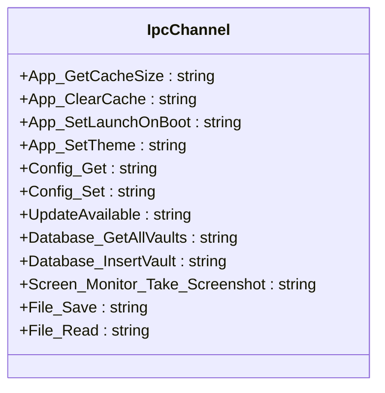
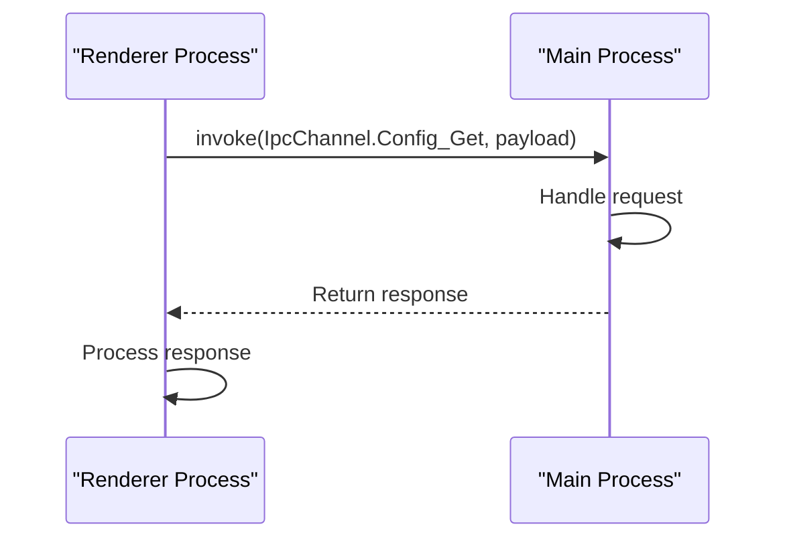
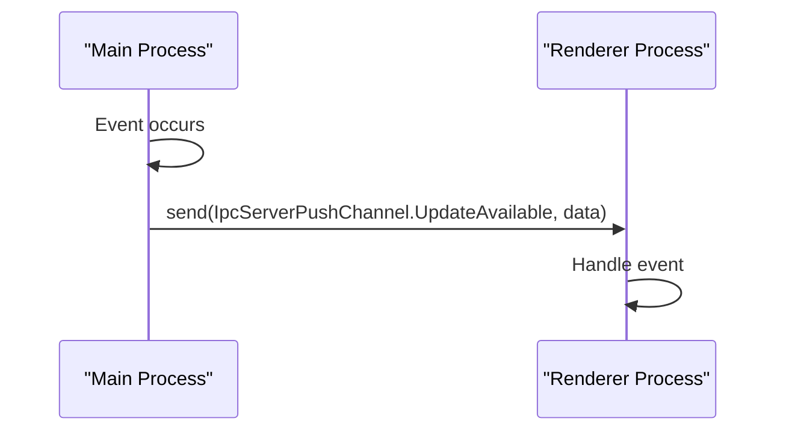
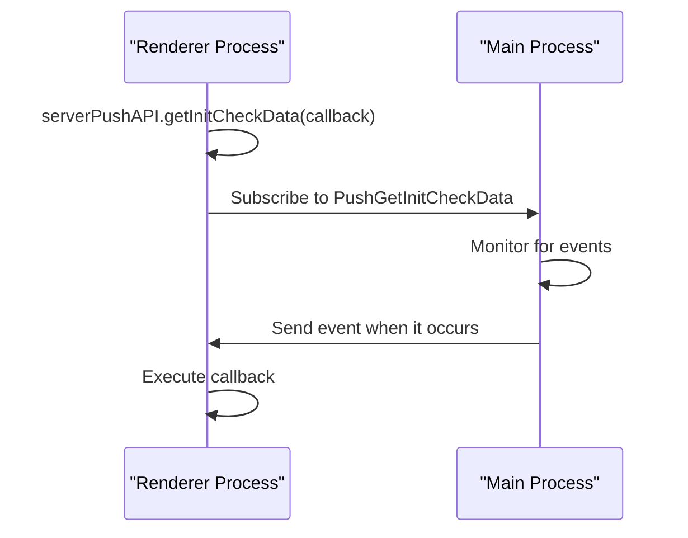
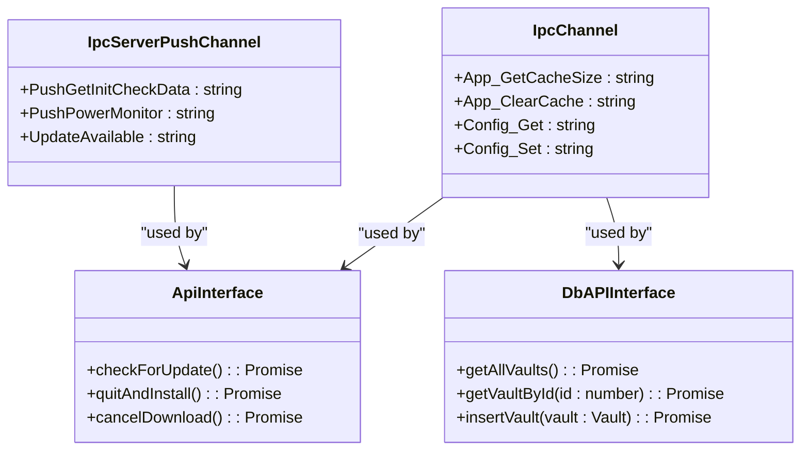
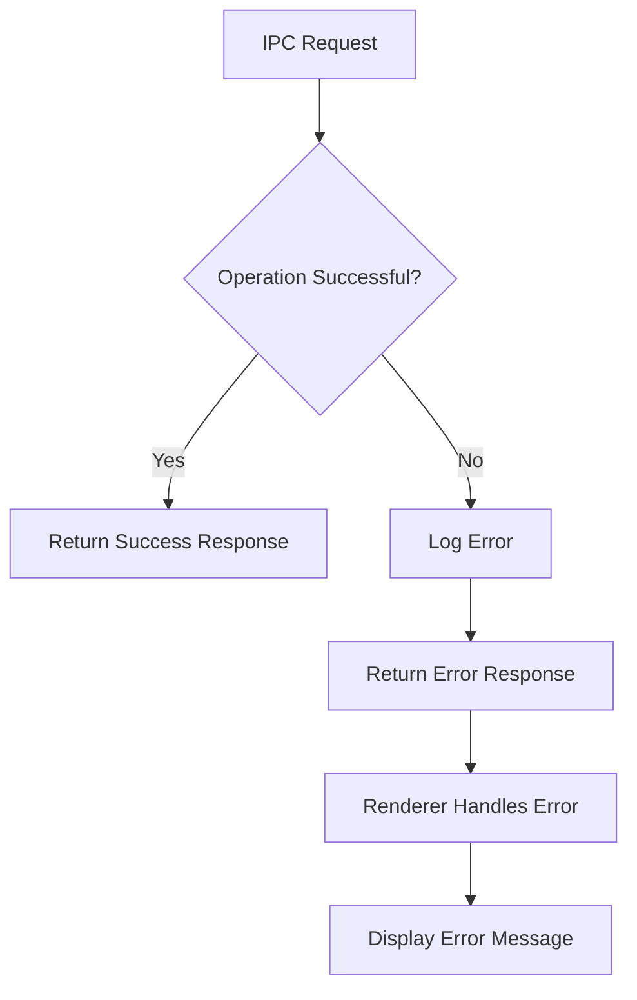
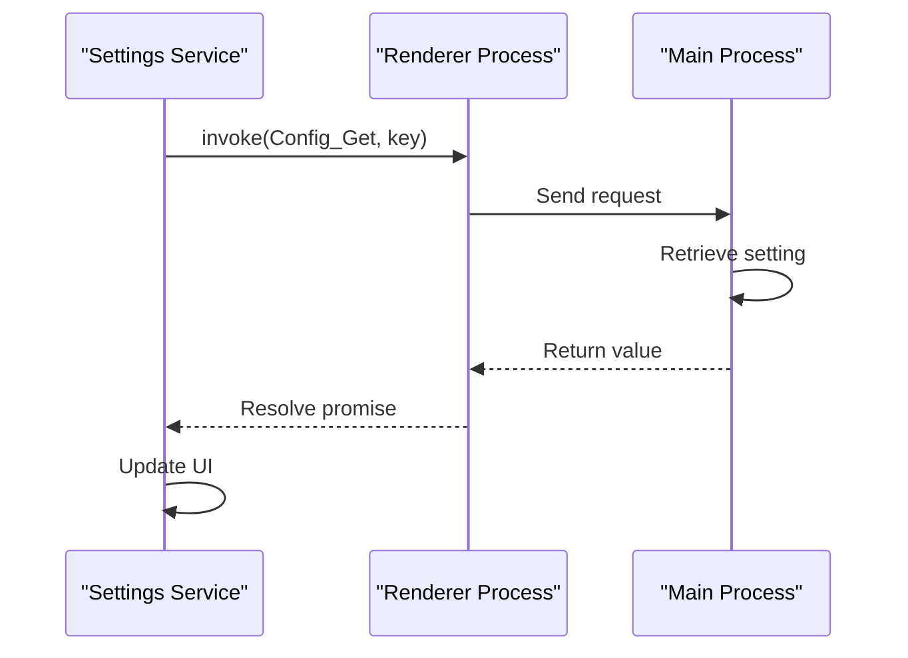
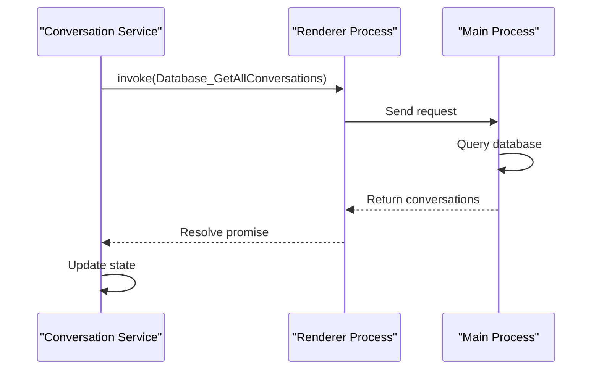
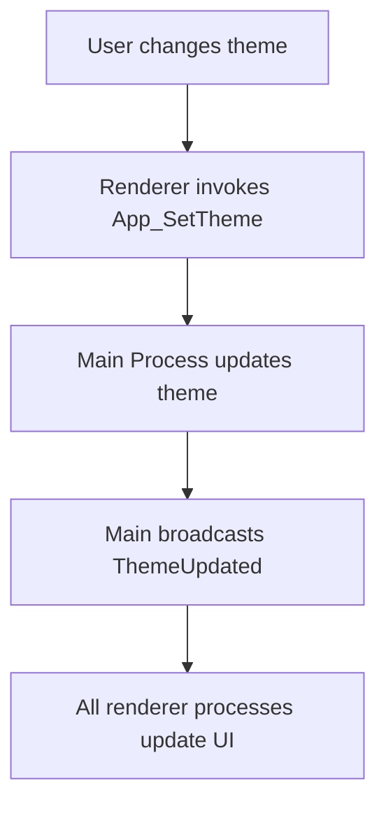
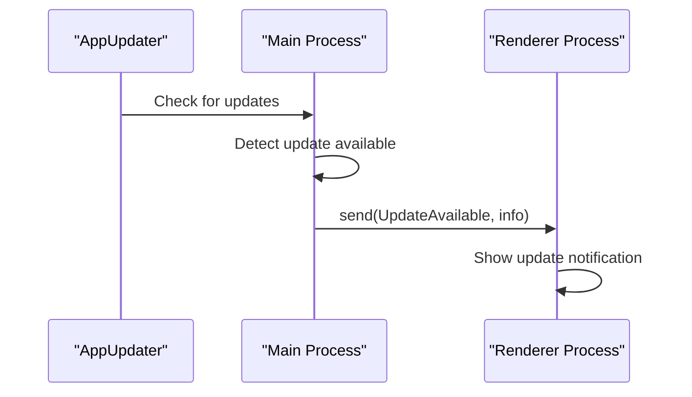

# IPC Communication Patterns

<cite>
**Referenced Files in This Document**   
- [IpcChannel.ts](file://frontend/packages/shared/IpcChannel.ts)
- [ipc-server-push-channel.ts](file://frontend/packages/shared/ipc-server-push-channel.ts)
- [ipc.ts](file://frontend/src/main/ipc.ts)
- [index.ts](file://frontend/src/preload/index.ts)
- [server-push-api.tsx](file://frontend/src/preload/server-push-api.tsx)
- [StoreSyncService.ts](file://frontend/src/main/services/StoreSyncService.ts)
- [Settings.ts](file://frontend/src/renderer/src/services/Settings.ts)
- [conversation-service.ts](file://frontend/src/renderer/src/services/conversation-service.ts)
- [AppUpdater.ts](file://frontend/src/main/services/AppUpdater.ts)
</cite>

## Table of Contents
1. [Introduction](#introduction)
2. [IpcChannel Enum Structure](#ipcchannel-enum-structure)
3. [Bidirectional Communication Patterns](#bidirectional-communication-patterns)
4. [Request-Response Channels](#request-response-channels)
5. [Event Emission Channels](#event-emission-channels)
6. [Type Safety Implementation](#type-safety-implementation)
7. [Error Handling Strategy](#error-handling-strategy)
8. [Timeout Considerations](#timeout-considerations)
9. [Service Implementation Examples](#service-implementation-examples)
10. [Common IPC Patterns](#common-ipc-patterns)

## Introduction
MineContext implements a robust IPC (Inter-Process Communication) system to facilitate communication between the main and renderer processes in its Electron-based architecture. This documentation details the IPC communication patterns, focusing on the IpcChannel enum that defines all communication channels, the bidirectional communication flow, type safety implementation, error handling, and practical usage examples in key services.

**Section sources**
- [IpcChannel.ts](file://frontend/packages/shared/IpcChannel.ts)
- [ipc.ts](file://frontend/src/main/ipc.ts)

## IpcChannel Enum Structure
The IpcChannel enum serves as the central definition for all IPC communication channels in MineContext, categorizing channels by functionality and establishing a consistent naming convention. The enum uses a colon-separated format "category:action" to organize channels into logical groups.

The enum includes channels for various functional areas:
- **Application management**: Channels like `App_SetTheme`, `App_SetLaunchOnBoot`, and `App_Reload` handle application-level operations
- **Configuration**: `Config_Get` and `Config_Set` channels manage configuration retrieval and updates
- **System operations**: Channels such as `System_GetDeviceType` and `System_GetHostname` provide system information
- **Database operations**: Channels like `Database_GetAllVaults` and `Database_InsertVault` handle data persistence
- **Screen monitoring**: Channels including `Screen_Monitor_Take_Screenshot` and `Screen_Monitor_Check_Permissions` manage screen capture functionality
- **File operations**: Channels such as `File_Save`, `File_Read`, and `File_Delete` handle file system interactions

Each channel is defined as a string literal with a descriptive name that indicates both the category and specific action, enabling clear identification of the channel's purpose.



**Diagram sources**
- [IpcChannel.ts](file://frontend/packages/shared/IpcChannel.ts)

**Section sources**
- [IpcChannel.ts](file://frontend/packages/shared/IpcChannel.ts)

## Bidirectional Communication Patterns
MineContext implements a bidirectional communication pattern between the main and renderer processes, supporting both request-response interactions and event-driven notifications.

### Renderer to Main Communication
The renderer process initiates communication with the main process through asynchronous message passing using Electron's `ipcRenderer.invoke()` method. This pattern follows a request-response model where the renderer sends a request to the main process and awaits a response. The communication is type-safe through TypeScript interfaces that define the expected payload structure for each channel.



**Diagram sources**
- [index.ts](file://frontend/src/preload/index.ts)
- [ipc.ts](file://frontend/src/main/ipc.ts)

### Main to Renderer Communication
The main process pushes events to the renderer process using Electron's `webContents.send()` method. This pattern enables the main process to broadcast state changes, notifications, and real-time updates to the renderer. The renderer subscribes to these events using `ipcRenderer.on()` to receive and process incoming messages.



**Diagram sources**
- [server-push-api.tsx](file://frontend/src/preload/server-push-api.tsx)
- [AppUpdater.ts](file://frontend/src/main/services/AppUpdater.ts)

**Section sources**
- [ipc.ts](file://frontend/src/main/ipc.ts)
- [index.ts](file://frontend/src/preload/index.ts)
- [server-push-api.tsx](file://frontend/src/preload/server-push-api.tsx)

## Request-Response Channels
Request-response channels enable the renderer process to send synchronous or asynchronous requests to the main process and receive responses. These channels are implemented using Electron's `ipcMain.handle()` and `ipcRenderer.invoke()` methods.

### Synchronous Operations
For operations that require immediate completion, MineContext uses synchronous IPC calls. The renderer process waits for the main process to complete the operation and return a response before continuing execution.

### Asynchronous Operations
For operations that may take time to complete, such as file system operations or network requests, MineContext uses asynchronous IPC calls. The renderer process sends the request and continues execution, receiving the response when the main process completes the operation.

The main process registers handlers for request-response channels in the `ipc.ts` file using `ipcMain.handle()`. Each handler is associated with a specific IpcChannel enum value and implements the corresponding functionality.

```mermaid
flowchart TD
A[Renderer Process] --> B[ipcRenderer.invoke(channel, payload)]
B --> C[Main Process]
C --> D{Channel Handler}
D --> E[Execute Operation]
E --> F[Return Response]
F --> G[ipcRenderer resolves promise]
G --> H[Renderer Processes Response]
```

**Diagram sources**
- [ipc.ts](file://frontend/src/main/ipc.ts)
- [index.ts](file://frontend/src/preload/index.ts)

**Section sources**
- [ipc.ts](file://frontend/src/main/ipc.ts)
- [index.ts](file://frontend/src/preload/index.ts)

## Event Emission Channels
Event emission channels enable the main process to push events to the renderer process, implementing a publish-subscribe pattern for real-time updates and notifications.

### Server Push Channels
The IpcServerPushChannel enum defines channels for events that the main process pushes to the renderer. These include:
- `PushGetInitCheckData`: Pushes initialization check data
- `PushPowerMonitor`: Pushes power monitoring events
- `PushScreenMonitorStatus`: Pushes screen monitoring status updates
- `UpdateAvailable`: Pushes application update notifications
- `Home_PushLatestActivity`: Pushes latest activity updates

### Event Subscription
The renderer process subscribes to event emission channels using the serverPushAPI object exposed through the preload script. Each subscription returns an unsubscribe function that should be called to clean up event listeners.



**Diagram sources**
- [ipc-server-push-channel.ts](file://frontend/packages/shared/ipc-server-push-channel.ts)
- [server-push-api.tsx](file://frontend/src/preload/server-push-api.tsx)

**Section sources**
- [ipc-server-push-channel.ts](file://frontend/packages/shared/ipc-server-push-channel.ts)
- [server-push-api.tsx](file://frontend/src/preload/server-push-api.tsx)

## Type Safety Implementation
MineContext implements comprehensive type safety for IPC communications using TypeScript interfaces and enums to ensure type correctness across process boundaries.

### Channel Definition
The IpcChannel enum provides type-safe channel names, preventing typos and ensuring that only valid channels are used in IPC communications. The enum values are string literals that correspond to the actual channel names used in Electron's IPC system.

### Payload Typing
Each IPC channel has associated TypeScript interfaces that define the expected payload structure. These interfaces are used to type the parameters and return values of IPC handlers, providing compile-time type checking.

### Preload API Exposure
The preload script uses contextBridge to expose IPC functionality to the renderer process with proper typing. The exposed APIs are defined with TypeScript interfaces that specify the method signatures and parameter types.



**Diagram sources**
- [IpcChannel.ts](file://frontend/packages/shared/IpcChannel.ts)
- [ipc-server-push-channel.ts](file://frontend/packages/shared/ipc-server-push-channel.ts)
- [index.ts](file://frontend/src/preload/index.ts)

**Section sources**
- [IpcChannel.ts](file://frontend/packages/shared/IpcChannel.ts)
- [ipc-server-push-channel.ts](file://frontend/packages/shared/ipc-server-push-channel.ts)
- [index.ts](file://frontend/src/preload/index.ts)

## Error Handling Strategy
MineContext implements a comprehensive error handling strategy for IPC communications to ensure robustness and provide meaningful error information.

### Try-Catch Wrapping
Main process IPC handlers wrap their logic in try-catch blocks to catch and handle errors that occur during execution. This prevents unhandled exceptions from crashing the application.

### Error Response Format
When an error occurs, the IPC handler returns a structured error response that includes a success flag and error message. This allows the renderer process to handle errors gracefully.

### Logging
All IPC-related errors are logged using the application's logging system with appropriate log levels (error, warn, info). This provides visibility into IPC issues for debugging and monitoring.

### Renderer-Side Handling
The renderer process handles IPC errors by catching rejected promises and displaying appropriate error messages to the user or taking corrective actions.



**Diagram sources**
- [ipc.ts](file://frontend/src/main/ipc.ts)

**Section sources**
- [ipc.ts](file://frontend/src/main/ipc.ts)

## Timeout Considerations
MineContext implements timeout mechanisms for IPC communications to prevent hanging operations and ensure application responsiveness.

### Backend Startup Timeout
When starting the backend process, a 30-second timeout is implemented. If the backend does not respond within this timeframe, a health check is attempted as a fallback before reporting a timeout error.

### Network Request Timeouts
For IPC channels that make network requests (such as those communicating with the backend API), appropriate timeouts are set to prevent indefinite waiting.

### Asynchronous Operation Limits
Long-running operations are designed to provide progress updates or be cancellable to prevent timeouts and maintain application responsiveness.

**Section sources**
- [backend.ts](file://frontend/src/main/backend.ts)

## Service Implementation Examples
This section provides examples of how services in the renderer process invoke IPC channels and handle responses.

### Settings Service
The Settings service in the renderer process uses IPC channels to retrieve and update application settings. It leverages the Config_Get and Config_Set channels to communicate with the main process.



**Diagram sources**
- [Settings.ts](file://frontend/src/renderer/src/services/Settings.ts)
- [ipc.ts](file://frontend/src/main/ipc.ts)

### Conversation Service
The conversation-service module uses IPC channels to manage conversation data. It interacts with the main process to retrieve, create, update, and delete conversations through database operations.



**Diagram sources**
- [conversation-service.ts](file://frontend/src/renderer/src/services/conversation-service.ts)
- [ipc.ts](file://frontend/src/main/ipc.ts)

**Section sources**
- [Settings.ts](file://frontend/src/renderer/src/services/Settings.ts)
- [conversation-service.ts](file://frontend/src/renderer/src/services/conversation-service.ts)

## Common IPC Patterns

### Settings Retrieval (Config_Get)
The settings retrieval pattern demonstrates a typical request-response interaction. The renderer process requests configuration data from the main process, which retrieves it from persistent storage and returns it to the renderer.

```mermaid
flowchart TD
A[Renderer] --> B[ipcRenderer.invoke(Config_Get, key)]
B --> C[Main Process]
C --> D[Retrieve setting from storage]
D --> E{Found?}
E --> |Yes| F[Return value]
E --> |No| G[Return default]
F --> H[Renderer resolves promise]
G --> H
H --> I[Update UI with setting]
```

**Diagram sources**
- [ipc.ts](file://frontend/src/main/ipc.ts)

### System Operations (App_SetTheme)
The system operations pattern shows how the renderer process can trigger system-level changes. When the user changes the theme, the renderer sends a request to the main process to update the application theme.



**Diagram sources**
- [ipc.ts](file://frontend/src/main/ipc.ts)

### Real-Time Event Broadcasting (UpdateAvailable)
The real-time event broadcasting pattern demonstrates how the main process can push events to the renderer. When a new application update is available, the main process broadcasts an UpdateAvailable event to all renderer processes.



**Diagram sources**
- [AppUpdater.ts](file://frontend/src/main/services/AppUpdater.ts)
- [ipc-server-push-channel.ts](file://frontend/packages/shared/ipc-server-push-channel.ts)

**Section sources**
- [ipc.ts](file://frontend/src/main/ipc.ts)
- [AppUpdater.ts](file://frontend/src/main/services/AppUpdater.ts)