# React Component Hierarchy

<cite>
**Referenced Files in This Document**   
- [App.tsx](file://frontend/src/renderer/src/App.tsx)
- [Router.tsx](file://frontend/src/renderer/src/Router.tsx)
- [home-page.tsx](file://frontend/src/renderer/src/pages/home/home-page.tsx)
- [screen-monitor.tsx](file://frontend/src/renderer/src/pages/screen-monitor/screen-monitor.tsx)
- [settings.tsx](file://frontend/src/renderer/src/pages/settings/settings.tsx)
- [Vault.tsx](file://frontend/src/renderer/src/pages/vault/Vault.tsx)
- [index.tsx](file://frontend/src/renderer/src/components/ai-assistant/index.tsx)
- [use-chat-stream.ts](file://frontend/src/renderer/src/hooks/use-chat-stream.ts)
- [ChatStreamService.ts](file://frontend/src/renderer/src/services/ChatStreamService.ts)
- [index.ts](file://frontend/src/renderer/src/store/index.ts)
</cite>

## Table of Contents
1. [Introduction](#introduction)
2. [Project Structure](#project-structure)
3. [Core Components](#core-components)
4. [Architecture Overview](#architecture-overview)
5. [Detailed Component Analysis](#detailed-component-analysis)
6. [Dependency Analysis](#dependency-analysis)
7. [Performance Considerations](#performance-considerations)
8. [Troubleshooting Guide](#troubleshooting-guide)
9. [Conclusion](#conclusion)

## Introduction
This document provides a comprehensive analysis of the React component hierarchy in the MineContext application. It details the top-level components that manage application routing and state initialization, page-level components for different views, and reusable UI components with a focus on AI-specific functionality. The documentation covers component organization principles, data flow patterns, and the use of React hooks for state management and side effects.

## Project Structure
The MineContext frontend application follows a modular structure with clear separation of concerns. The React components are organized under the `frontend/src/renderer/src` directory with the following key subdirectories:
- `pages`: Contains page-level components for different views (home, screen-monitor, settings, vault)
- `components`: Houses reusable UI components including AI-specific components
- `hooks`: Custom React hooks for state management and side effects
- `services`: Business logic and API interaction services
- `store`: Redux store configuration for global state management

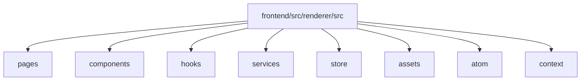

**Diagram sources**
- [App.tsx](file://frontend/src/renderer/src/App.tsx)
- [Router.tsx](file://frontend/src/renderer/src/Router.tsx)

**Section sources**
- [App.tsx](file://frontend/src/renderer/src/App.tsx)
- [Router.tsx](file://frontend/src/renderer/src/Router.tsx)

## Core Components
The core components of the MineContext application include the top-level App and Router components that manage application routing and state initialization, along with page-level components that represent different views in the application.

**Section sources**
- [App.tsx](file://frontend/src/renderer/src/App.tsx)
- [Router.tsx](file://frontend/src/renderer/src/Router.tsx)
- [home-page.tsx](file://frontend/src/renderer/src/pages/home/home-page.tsx)
- [screen-monitor.tsx](file://frontend/src/renderer/src/pages/screen-monitor/screen-monitor.tsx)
- [settings.tsx](file://frontend/src/renderer/src/pages/settings/settings.tsx)
- [Vault.tsx](file://frontend/src/renderer/src/pages/vault/Vault.tsx)

## Architecture Overview
The MineContext application follows a component-based architecture with a clear hierarchy and data flow pattern. The top-level App component serves as the entry point and manages global state and providers, while the Router component handles navigation between different views.

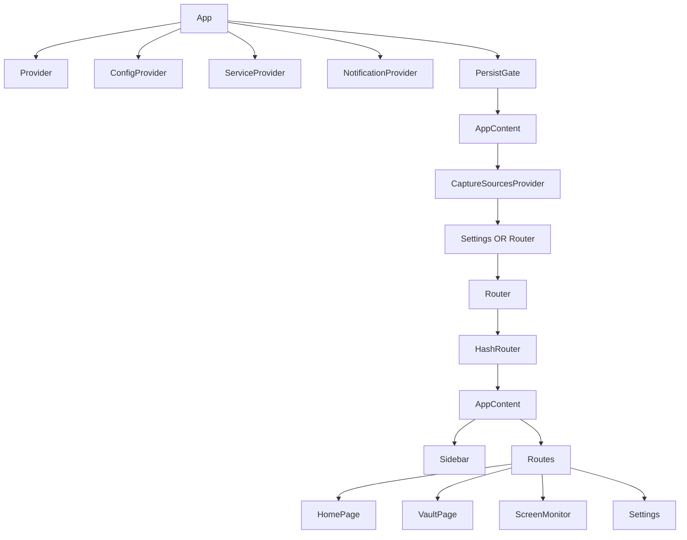

**Diagram sources**
- [App.tsx](file://frontend/src/renderer/src/App.tsx)
- [Router.tsx](file://frontend/src/renderer/src/Router.tsx)

## Detailed Component Analysis

### Top-Level Components Analysis
The App and Router components form the foundation of the application's component hierarchy, managing global state, routing, and providing context to child components.

#### App Component
The App component is the root component that initializes the application and manages global state providers. It uses Redux for state management with persistence, Arco Design for UI components, and custom providers for specific application needs.

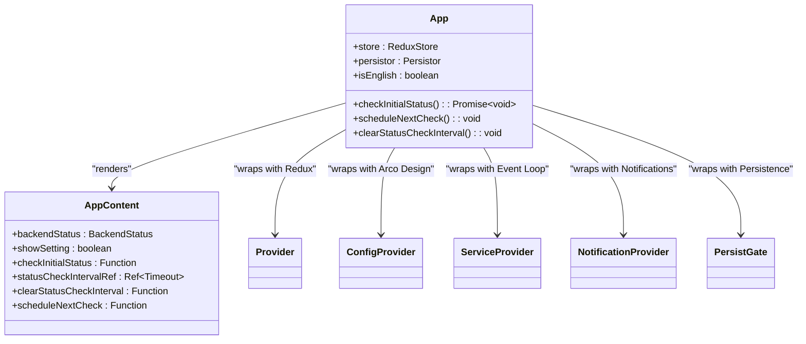

**Diagram sources**
- [App.tsx](file://frontend/src/renderer/src/App.tsx)

**Section sources**
- [App.tsx](file://frontend/src/renderer/src/App.tsx)

#### Router Component
The Router component manages application navigation using React Router's HashRouter. It defines routes for different pages and handles navigation events from the system tray.

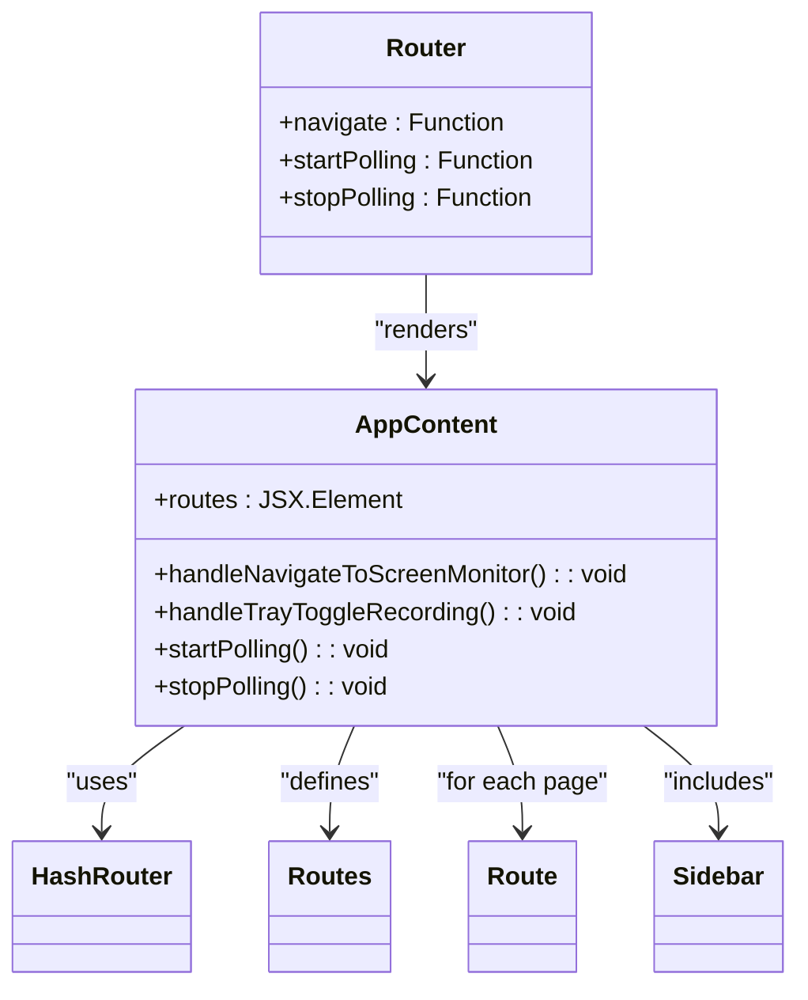

**Diagram sources**
- [Router.tsx](file://frontend/src/renderer/src/Router.tsx)

**Section sources**
- [Router.tsx](file://frontend/src/renderer/src/Router.tsx)

### Page-Level Components Analysis
The application includes several page-level components that represent different views and functionality areas.

#### Home Page Component
The home page serves as the main dashboard, displaying proactive insights, recent activities, and AI assistant functionality.

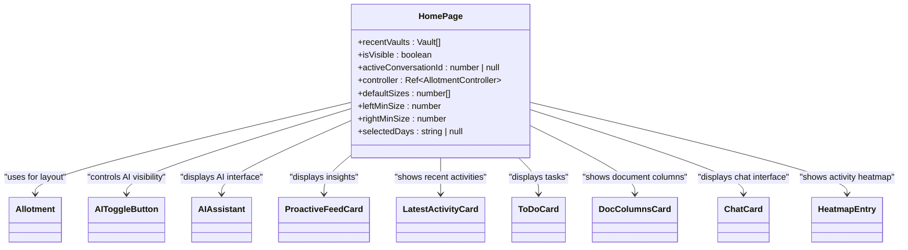

**Diagram sources**
- [home-page.tsx](file://frontend/src/renderer/src/pages/home/home-page.tsx)

**Section sources**
- [home-page.tsx](file://frontend/src/renderer/src/pages/home/home-page.tsx)

#### Screen Monitor Component
The screen monitor component provides functionality for monitoring screen activity, managing recording settings, and viewing captured content.

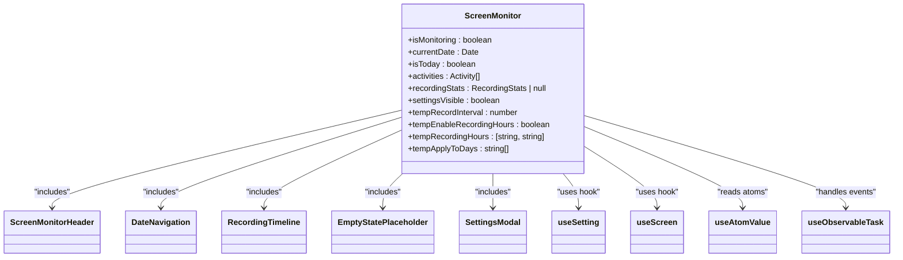

**Diagram sources**
- [screen-monitor.tsx](file://frontend/src/renderer/src/pages/screen-monitor/screen-monitor.tsx)

**Section sources**
- [screen-monitor.tsx](file://frontend/src/renderer/src/pages/screen-monitor/screen-monitor.tsx)

#### Settings Component
The settings component allows users to configure AI models, API keys, and other application settings.

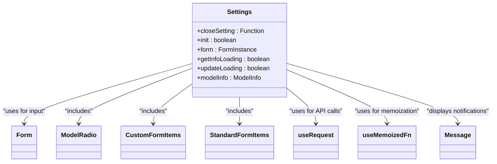

**Diagram sources**
- [settings.tsx](file://frontend/src/renderer/src/pages/settings/settings.tsx)

**Section sources**
- [settings.tsx](file://frontend/src/renderer/src/pages/settings/settings.tsx)

#### Vault Component
The vault component provides a document editor interface with AI assistance for creating and managing content.

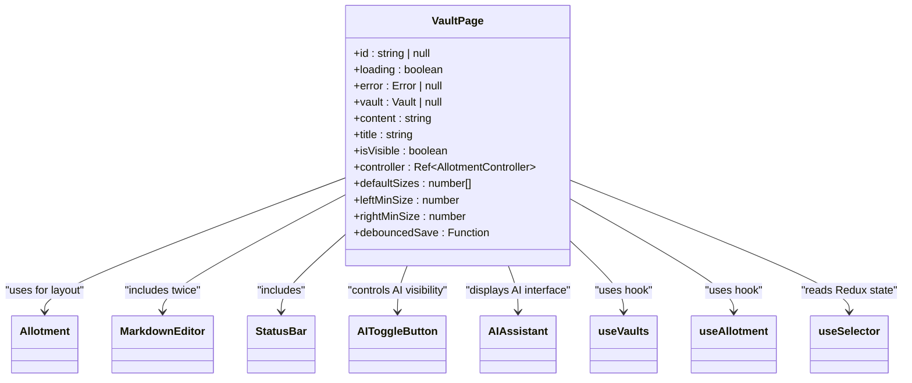

**Diagram sources**
- [Vault.tsx](file://frontend/src/renderer/src/pages/vault/Vault.tsx)

**Section sources**
- [Vault.tsx](file://frontend/src/renderer/src/pages/vault/Vault.tsx)

### AI Components Analysis
The AI components provide intelligent assistance functionality throughout the application, with a focus on natural language interaction and context-aware responses.

#### AI Assistant Component
The AI assistant component provides a chat interface for interacting with the AI, handling message streaming, and displaying conversation history.

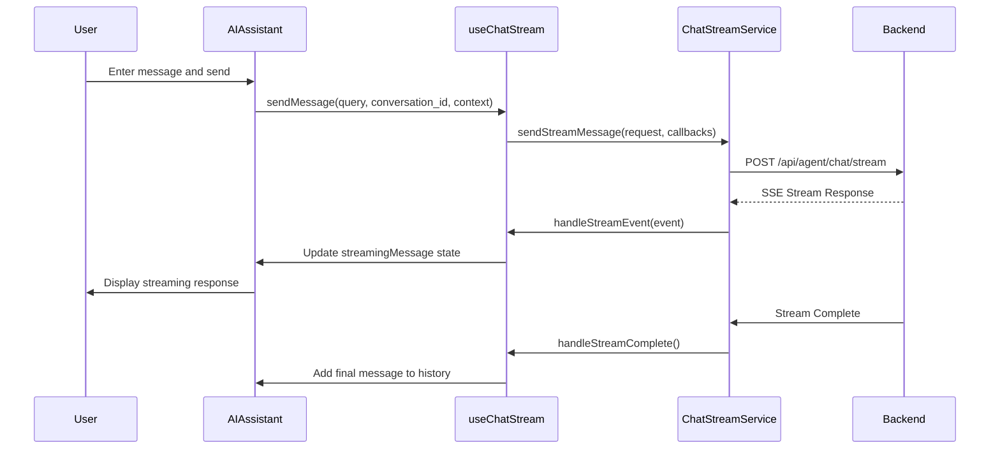

**Diagram sources**
- [index.tsx](file://frontend/src/renderer/src/components/ai-assistant/index.tsx)
- [use-chat-stream.ts](file://frontend/src/renderer/src/hooks/use-chat-stream.ts)
- [ChatStreamService.ts](file://frontend/src/renderer/src/services/ChatStreamService.ts)

**Section sources**
- [index.tsx](file://frontend/src/renderer/src/components/ai-assistant/index.tsx)
- [use-chat-stream.ts](file://frontend/src/renderer/src/hooks/use-chat-stream.ts)
- [ChatStreamService.ts](file://frontend/src/renderer/src/services/ChatStreamService.ts)

#### AI Elements Components
The AI elements components provide reusable UI elements for building AI-powered interfaces, including conversation displays, messages, and input components.

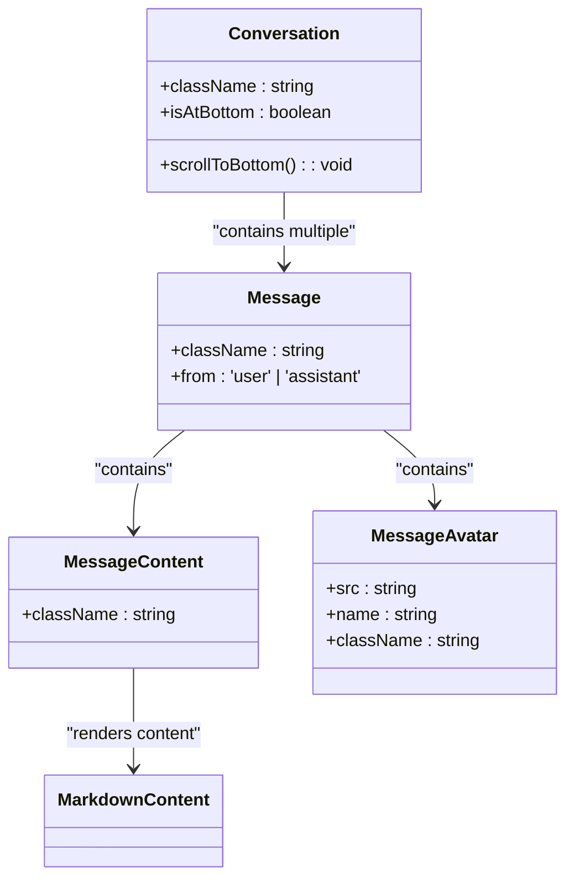

**Diagram sources**
- [conversation.tsx](file://frontend/src/renderer/src/components/ai-elements/conversation.tsx)
- [message.tsx](file://frontend/src/renderer/src/components/ai-elements/message.tsx)
- [index.tsx](file://frontend/src/renderer/src/components/ai-assistant/index.tsx)

**Section sources**
- [conversation.tsx](file://frontend/src/renderer/src/components/ai-elements/conversation.tsx)
- [message.tsx](file://frontend/src/renderer/src/components/ai-elements/message.tsx)

## Dependency Analysis
The component hierarchy in MineContext follows a clear dependency structure with well-defined relationships between components, hooks, and services.

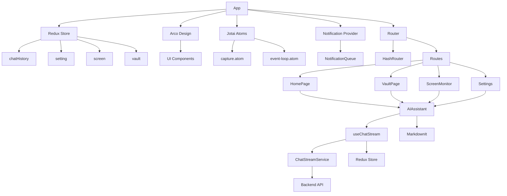

**Diagram sources**
- [App.tsx](file://frontend/src/renderer/src/App.tsx)
- [Router.tsx](file://frontend/src/renderer/src/Router.tsx)
- [index.ts](file://frontend/src/renderer/src/store/index.ts)
- [use-chat-stream.ts](file://frontend/src/renderer/src/hooks/use-chat-stream.ts)
- [ChatStreamService.ts](file://frontend/src/renderer/src/services/ChatStreamService.ts)

**Section sources**
- [App.tsx](file://frontend/src/renderer/src/App.tsx)
- [Router.tsx](file://frontend/src/renderer/src/Router.tsx)
- [index.ts](file://frontend/src/renderer/src/store/index.ts)

## Performance Considerations
The MineContext application employs several performance optimization techniques:

1. **Memoization**: Uses `useMemoizedFn` from ahooks to memoize expensive functions and prevent unnecessary re-renders
2. **Lazy Loading**: Components are organized in a way that allows for potential code splitting
3. **State Management**: Redux with persistence is used for global state, reducing prop drilling
4. **Event Handling**: Custom hooks manage side effects and event listeners efficiently
5. **Debouncing**: Input changes are debounced to prevent excessive API calls
6. **Conditional Rendering**: Components are only rendered when necessary based on state

The application also uses Allotment for resizable layouts, which optimizes rendering performance for complex UIs.

## Troubleshooting Guide
Common issues and their solutions in the MineContext component hierarchy:

1. **AI Assistant Not Responding**
   - Check backend status in App.tsx
   - Verify API keys in settings
   - Ensure network connectivity to the backend service

2. **Screen Monitoring Not Starting**
   - Check permissions in screen-monitor.tsx
   - Verify recording settings
   - Ensure the backend service is running

3. **State Not Persisting**
   - Check Redux persist configuration in store/index.ts
   - Verify storage permissions
   - Ensure proper cleanup in useEffect hooks

4. **Routing Issues**
   - Verify HashRouter configuration in Router.tsx
   - Check route definitions
   - Ensure proper navigation handling

5. **Performance Issues**
   - Check for unnecessary re-renders
   - Verify memoization of expensive operations
   - Monitor network requests from ChatStreamService

## Conclusion
The MineContext application features a well-structured React component hierarchy with clear separation of concerns. The top-level App and Router components effectively manage application state and navigation, while page-level components provide focused functionality for different views. The AI components are thoughtfully designed to provide intelligent assistance throughout the application, with efficient data flow from the backend through custom hooks to the UI components. The use of Redux for global state management, combined with Jotai for local state and custom hooks for side effects, creates a robust and maintainable architecture. The component organization follows best practices with reusable UI elements and clear data flow patterns, making the application scalable and easy to extend.