# State Management System

<cite>
**Referenced Files in This Document**   
- [index.ts](file://frontend/src/renderer/src/store/index.ts)
- [chat-history.ts](file://frontend/src/renderer/src/store/chat-history.ts)
- [setting.ts](file://frontend/src/renderer/src/store/setting.ts)
- [vault.ts](file://frontend/src/renderer/src/store/vault.ts)
- [screen.ts](file://frontend/src/renderer/src/store/screen.ts)
- [events.ts](file://frontend/src/renderer/src/store/events.ts)
- [navigation.ts](file://frontend/src/renderer/src/store/navigation.ts)
- [migrations.ts](file://frontend/src/renderer/src/store/migrations.ts)
- [use-ai-assistant.ts](file://frontend/src/renderer/src/hooks/use-ai-assistant.ts)
- [use-setting.ts](file://frontend/src/renderer/src/hooks/use-setting.ts)
- [StoreSyncService.ts](file://frontend/src/renderer/src/services/StoreSyncService.ts)
- [screen-thunk.ts](file://frontend/src/renderer/src/store/thunk/screen-thunk.ts)
- [vault-thunk.ts](file://frontend/src/renderer/src/store/thunk/vault-thunk.ts)
</cite>

## Table of Contents
1. [Introduction](#introduction)
2. [Project Structure](#project-structure)
3. [Core Components](#core-components)
4. [Architecture Overview](#architecture-overview)
5. [Detailed Component Analysis](#detailed-component-analysis)
6. [Dependency Analysis](#dependency-analysis)
7. [Performance Considerations](#performance-considerations)
8. [Troubleshooting Guide](#troubleshooting-guide)
9. [Conclusion](#conclusion)

## Introduction
The state management system in MineContext is built on Redux Toolkit, providing a centralized store for managing application state across various domains including chat history, settings, vault, and screen monitoring. The system implements a robust architecture with persisted state, middleware for cross-window synchronization, and custom hooks for component-level state access. This documentation provides a comprehensive overview of the implementation, covering the store configuration, slice reducers, custom hooks, middleware setup, and performance optimization strategies.

## Project Structure

The state management system is organized within the `frontend/src/renderer/src/store` directory, following a modular structure that separates concerns and promotes maintainability. The core components include slice reducers for different domains, thunks for side effects, and migration utilities for state evolution.

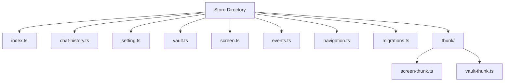

**Diagram sources**
- [index.ts](file://frontend/src/renderer/src/store/index.ts)
- [chat-history.ts](file://frontend/src/renderer/src/store/chat-history.ts)
- [setting.ts](file://frontend/src/renderer/src/store/setting.ts)
- [vault.ts](file://frontend/src/renderer/src/store/vault.ts)
- [screen.ts](file://frontend/src/renderer/src/store/screen.ts)
- [events.ts](file://frontend/src/renderer/src/store/events.ts)
- [navigation.ts](file://frontend/src/renderer/src/store/navigation.ts)
- [migrations.ts](file://frontend/src/renderer/src/store/migrations.ts)
- [screen-thunk.ts](file://frontend/src/renderer/src/store/thunk/screen-thunk.ts)
- [vault-thunk.ts](file://frontend/src/renderer/src/store/thunk/vault-thunk.ts)

**Section sources**
- [index.ts](file://frontend/src/renderer/src/store/index.ts)

## Core Components

The state management system consists of several core components that work together to provide a comprehensive state management solution. These include the root store configuration, individual slice reducers for different domains, custom hooks for component-level state access, and middleware for cross-window synchronization.

**Section sources**
- [index.ts](file://frontend/src/renderer/src/store/index.ts)
- [chat-history.ts](file://frontend/src/renderer/src/store/chat-history.ts)
- [setting.ts](file://frontend/src/renderer/src/store/setting.ts)
- [vault.ts](file://frontend/src/renderer/src/store/vault.ts)
- [screen.ts](file://frontend/src/renderer/src/store/screen.ts)

## Architecture Overview

The state management architecture in MineContext follows a Redux-based pattern with additional layers for persistence, synchronization, and side effect management. The system uses Redux Toolkit to simplify store configuration and reducer creation, while incorporating redux-persist for state persistence across application restarts.

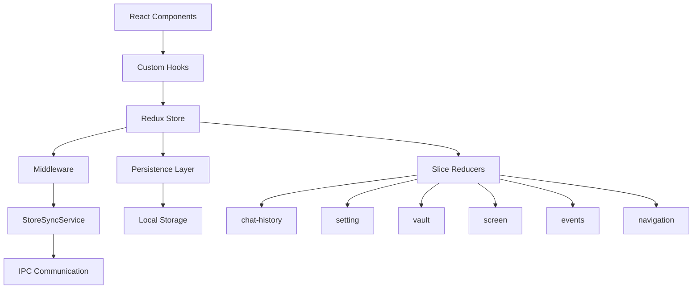

**Diagram sources**
- [index.ts](file://frontend/src/renderer/src/store/index.ts)
- [StoreSyncService.ts](file://frontend/src/renderer/src/services/StoreSyncService.ts)
- [chat-history.ts](file://frontend/src/renderer/src/store/chat-history.ts)
- [setting.ts](file://frontend/src/renderer/src/store/setting.ts)
- [vault.ts](file://frontend/src/renderer/src/store/vault.ts)
- [screen.ts](file://frontend/src/renderer/src/store/screen.ts)
- [events.ts](file://frontend/src/renderer/src/store/events.ts)
- [navigation.ts](file://frontend/src/renderer/src/store/navigation.ts)

## Detailed Component Analysis

### Root Store Configuration
The root store is configured using Redux Toolkit's `configureStore` function, combining multiple slice reducers into a single root reducer. The store implements persistence using redux-persist, with specific configuration for data recovery on application restart.

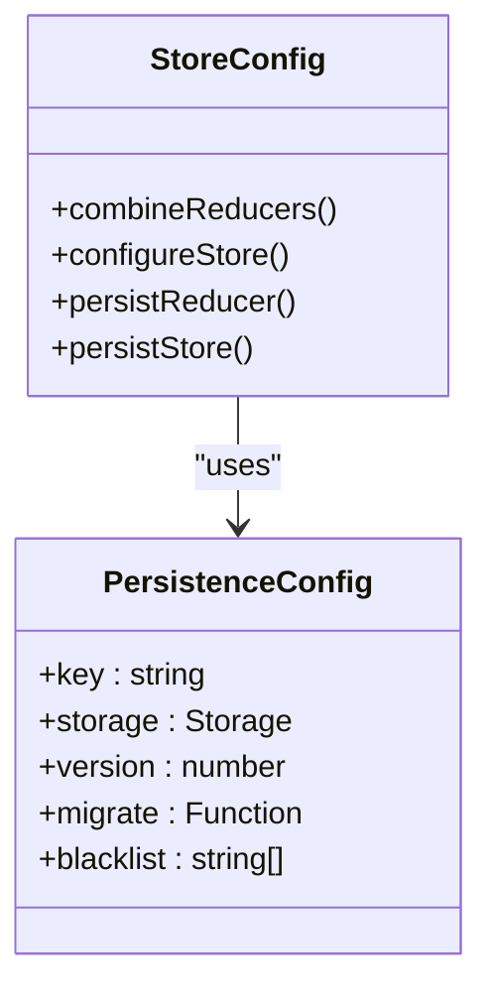

**Diagram sources**
- [index.ts](file://frontend/src/renderer/src/store/index.ts)

**Section sources**
- [index.ts](file://frontend/src/renderer/src/store/index.ts)

### Chat History Slice
The chat history slice manages the state for AI conversations, including conversation lists, messages, and UI state. It provides a comprehensive set of actions for managing chat data and maintains a well-defined state shape.

```mermaid
classDiagram
class ChatHistoryState {
+conversations : ConversationResponse[]
+activeConversationId : number | null
+chatHistoryMessages : Message[]
+loading : boolean
+error : string | null
+home : { aiAssistantVisible : boolean }
+creation : { aiAssistantVisible : boolean }
}
class Message {
+id : number
+conversation_id : number
+role : 'user' | 'assistant' | 'system'
+content : string
+created_at : string
+updated_at : string
+is_complete : boolean
+status : 'streaming' | 'completed' | 'failed' | 'cancelled'
+metadata? : Record<string, any>
}
ChatHistoryState --> Message : "contains"
```

**Diagram sources**
- [chat-history.ts](file://frontend/src/renderer/src/store/chat-history.ts)

**Section sources**
- [chat-history.ts](file://frontend/src/renderer/src/store/chat-history.ts)

### Settings Slice
The settings slice manages application configuration, particularly screen recording settings. It provides a type-safe interface for accessing and updating settings with proper TypeScript typing.

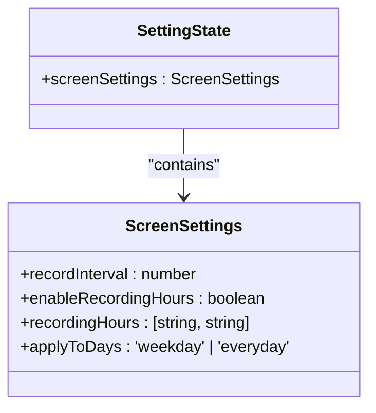

**Diagram sources**
- [setting.ts](file://frontend/src/renderer/src/store/setting.ts)

**Section sources**
- [setting.ts](file://frontend/src/renderer/src/store/setting.ts)

### Vault Slice
The vault slice manages the hierarchical structure of user content, implementing a tree-based data model for organizing notes and documents. It includes sophisticated logic for tree manipulation and maintains data consistency across operations.

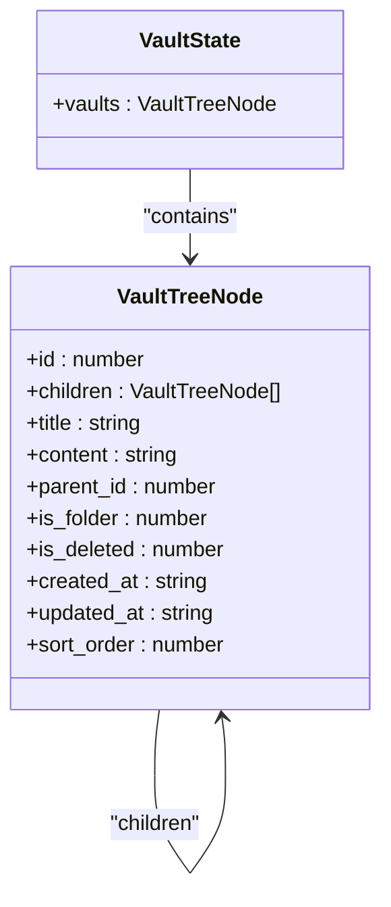

**Diagram sources**
- [vault.ts](file://frontend/src/renderer/src/store/vault.ts)

**Section sources**
- [vault.ts](file://frontend/src/renderer/src/store/vault.ts)

### Screen Monitoring Slice
The screen monitoring slice manages the state for screenshot capture and display, handling the current monitoring session and screenshot data. It implements a grouping mechanism for organizing screenshots temporally.

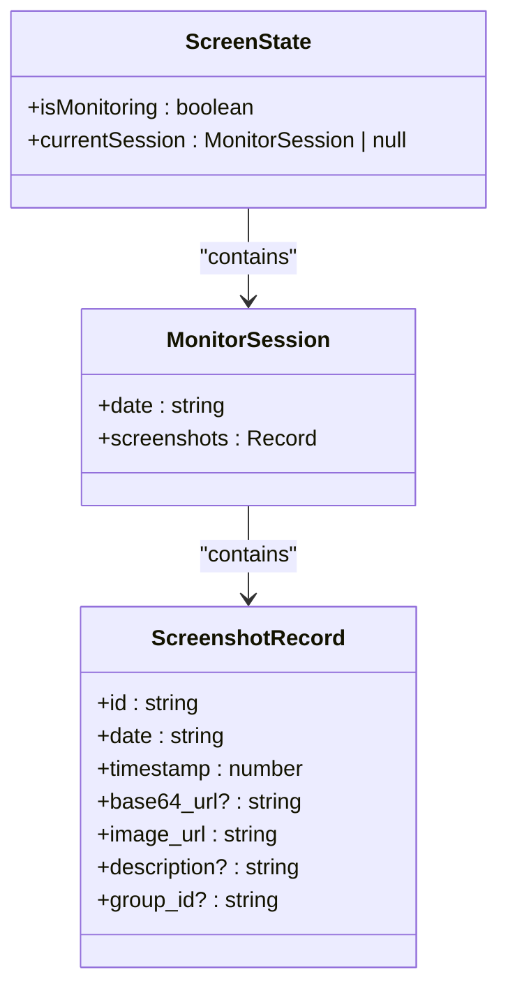

**Diagram sources**
- [screen.ts](file://frontend/src/renderer/src/store/screen.ts)

**Section sources**
- [screen.ts](file://frontend/src/renderer/src/store/screen.ts)

### Events Slice
The events slice manages proactive feed events and notifications, maintaining a list of events and the currently active event. It handles event display state and user interactions with the event modal.

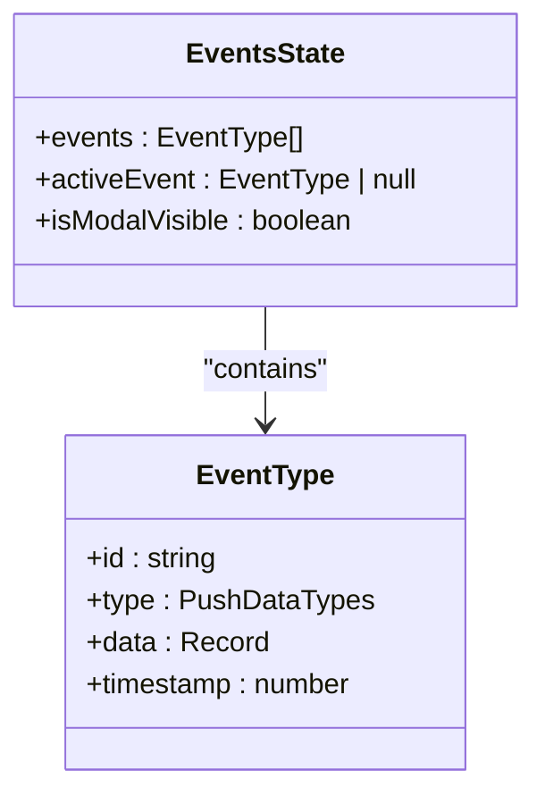

**Diagram sources**
- [events.ts](file://frontend/src/renderer/src/store/events.ts)

**Section sources**
- [events.ts](file://frontend/src/renderer/src/store/events.ts)

### Navigation Slice
The navigation slice manages the application's navigation state, tracking the currently active view and tab. It handles routing between different sections of the application and maintains navigation context.

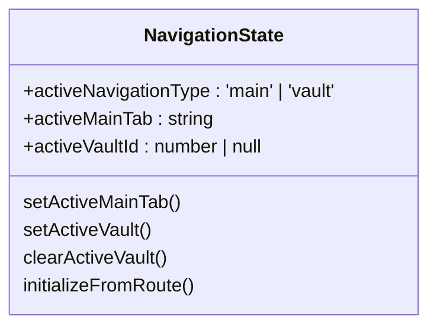

**Diagram sources**
- [navigation.ts](file://frontend/src/renderer/src/store/navigation.ts)

**Section sources**
- [navigation.ts](file://frontend/src/renderer/src/store/navigation.ts)

### Custom Hooks
Custom hooks provide a clean interface for components to access and manipulate state. These hooks encapsulate Redux logic and provide a more ergonomic API for common operations.

#### use-ai-assistant Hook
The use-ai-assistant hook manages the visibility state of the AI assistant interface and handles keyboard shortcuts for toggling visibility.

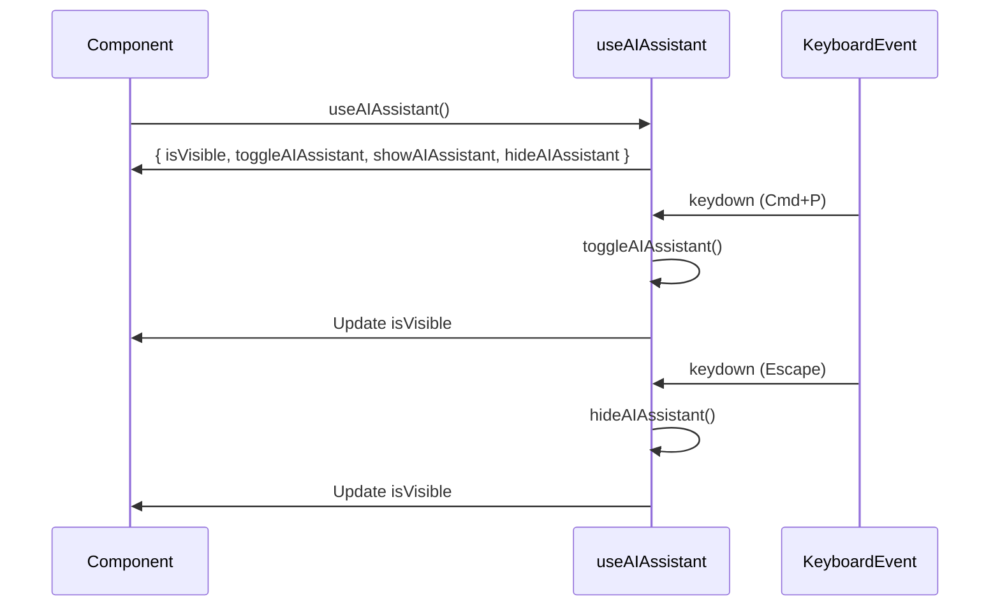

**Diagram sources**
- [use-ai-assistant.ts](file://frontend/src/renderer/src/hooks/use-ai-assistant.ts)

**Section sources**
- [use-ai-assistant.ts](file://frontend/src/renderer/src/hooks/use-ai-assistant.ts)

#### use-setting Hook
The use-setting hook provides access to application settings with convenience functions for updating specific settings values.

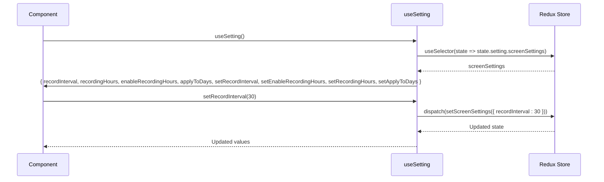

**Diagram sources**
- [use-setting.ts](file://frontend/src/renderer/src/hooks/use-setting.ts)

**Section sources**
- [use-setting.ts](file://frontend/src/renderer/src/hooks/use-setting.ts)

### Middleware and Side Effect Management
The StoreSyncService implements middleware for synchronizing state changes across multiple application windows, ensuring consistent state throughout the application.

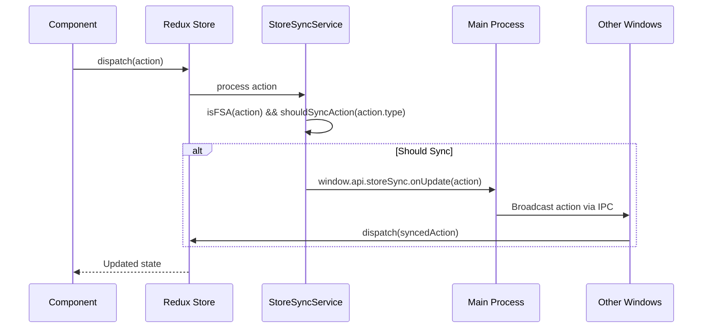

**Diagram sources**
- [StoreSyncService.ts](file://frontend/src/renderer/src/services/StoreSyncService.ts)

**Section sources**
- [StoreSyncService.ts](file://frontend/src/renderer/src/services/StoreSyncService.ts)

### Thunks for Side Effects
Thunks handle asynchronous operations and side effects, particularly for database operations and API calls. They coordinate between the Redux store and external systems.

#### Screen Thunk
The screen thunk manages the screenshot capture process, coordinating between the store and native APIs.

```mermaid
flowchart TD
A[Start captureScreenshotThunk] --> B[getState()]
B --> C{currentSession exists?}
C --> |Yes| D[Calculate group timestamp]
C --> |No| D
D --> E[Call takeScreenshot API]
E --> F{Success?}
F --> |Yes| G[Read image as Base64]
F --> |No| H[Throw error]
G --> I{Success?}
I --> |Yes| J[Build ScreenshotRecord]
I --> |No| H
J --> K[Return newScreenshot]
H --> L[Log error]
L --> M[Throw error]
```

**Diagram sources**
- [screen-thunk.ts](file://frontend/src/renderer/src/store/thunk/screen-thunk.ts)

**Section sources**
- [screen-thunk.ts](file://frontend/src/renderer/src/store/thunk/screen-thunk.ts)

#### Vault Thunk
The vault thunk manages database operations for vault items, ensuring consistency between the Redux store and persistent storage.

```mermaid
flowchart TD
A[Start addVaultThunk] --> B[insertVault to database]
B --> C{Success?}
C --> |Yes| D[Construct complete vault object]
C --> |No| E[Log error]
D --> F[dispatch(addVault)]
F --> G[Return newVault]
E --> H[Throw error]
```

**Diagram sources**
- [vault-thunk.ts](file://frontend/src/renderer/src/store/thunk/vault-thunk.ts)

**Section sources**
- [vault-thunk.ts](file://frontend/src/renderer/src/store/thunk/vault-thunk.ts)

## Dependency Analysis

The state management system has a well-defined dependency structure, with clear relationships between components. The core dependencies include Redux Toolkit for state management, redux-persist for persistence, and React Redux for component integration.

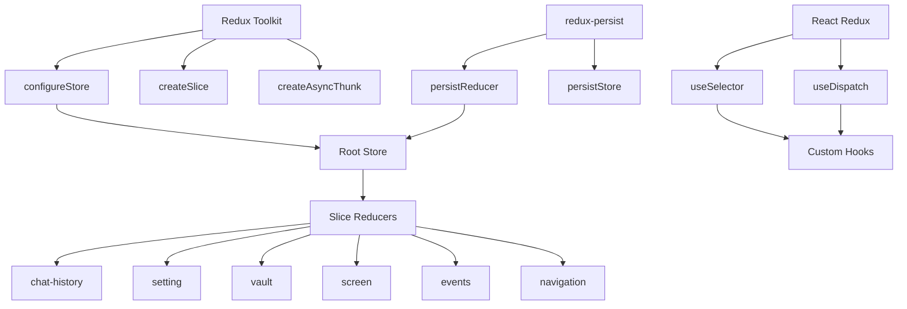

**Diagram sources**
- [index.ts](file://frontend/src/renderer/src/store/index.ts)
- [package.json](file://frontend/package.json)

**Section sources**
- [index.ts](file://frontend/src/renderer/src/store/index.ts)

## Performance Considerations

The state management system incorporates several performance optimizations to ensure efficient operation and minimize unnecessary re-renders. These include proper selector memoization, action type filtering, and careful state normalization.

### Selector Optimization
Selectors are memoized using React Redux's `useSelector` hook with appropriate comparison functions to prevent unnecessary re-renders when state changes do not affect the selected data.

### Action Type Filtering
The StoreSyncService implements action type filtering to prevent unnecessary IPC communication, only synchronizing actions that match specific prefixes.

### State Normalization
State is normalized where appropriate, particularly in the vault slice which uses a tree structure with parent-child relationships to minimize duplication and improve update efficiency.

### Middleware Optimization
The middleware is optimized to avoid unnecessary processing by checking action types before performing more expensive operations like serialization and IPC communication.

**Section sources**
- [StoreSyncService.ts](file://frontend/src/renderer/src/services/StoreSyncService.ts)
- [use-setting.ts](file://frontend/src/renderer/src/hooks/use-setting.ts)
- [chat-history.ts](file://frontend/src/renderer/src/store/chat-history.ts)

## Troubleshooting Guide

### Common Issues and Solutions
- **State not persisting**: Ensure the persistence configuration is correct and check for migration issues in the console.
- **Cross-window synchronization not working**: Verify that the StoreSyncService is properly initialized and that IPC channels are functioning.
- **Unnecessary re-renders**: Check selector functions for proper memoization and ensure components are not subscribing to unnecessary state changes.
- **Thunk errors**: Verify that database operations are successful and that the store is properly updated after asynchronous operations.

### Debugging Tips
- Use Redux DevTools to inspect state changes and action dispatches.
- Check the console for warnings from the StoreSyncService about unavailable APIs.
- Verify that migrations are running correctly when upgrading the application version.
- Monitor network/IPC traffic to ensure synchronization messages are being sent and received.

**Section sources**
- [StoreSyncService.ts](file://frontend/src/renderer/src/services/StoreSyncService.ts)
- [migrations.ts](file://frontend/src/renderer/src/store/migrations.ts)
- [index.ts](file://frontend/src/renderer/src/store/index.ts)

## Conclusion
The state management system in MineContext provides a robust and scalable solution for managing application state across multiple domains. By leveraging Redux Toolkit and complementary libraries, the system offers a type-safe, predictable, and maintainable approach to state management. The architecture supports persistence, cross-window synchronization, and efficient side effect management through thunks. Custom hooks provide a clean interface for components, while performance optimizations ensure smooth operation. This comprehensive state management solution effectively supports the complex requirements of the MineContext application.