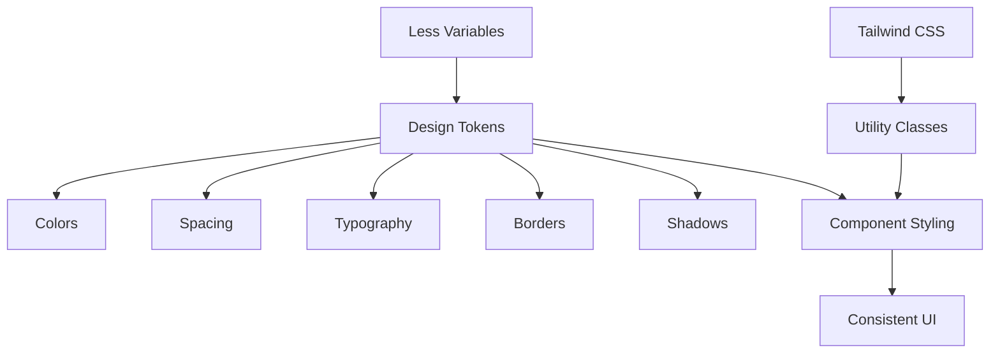

# UI Component Library

<cite>
**Referenced Files in This Document**   
- [button.tsx](file://frontend/src/renderer/src/components/ui/button.tsx)
- [input.tsx](file://frontend/src/renderer/src/components/ui/input.tsx)
- [tooltip.tsx](file://frontend/src/renderer/src/components/ui/tooltip.tsx)
- [select.tsx](file://frontend/src/renderer/src/components/ui/select.tsx)
- [scroll-area.tsx](file://frontend/src/renderer/src/components/ui/scroll-area.tsx)
- [avatar.tsx](file://frontend/src/renderer/src/components/ui/avatar.tsx)
- [badge.tsx](file://frontend/src/renderer/src/components/ui/badge.tsx)
- [carousel.tsx](file://frontend/src/renderer/src/components/ui/carousel.tsx)
- [theme.less](file://frontend/src/renderer/src/assets/theme/theme.less)
- [variables.less](file://frontend/src/renderer/src/assets/theme/variables.less)
- [tailwind.config.js](file://frontend/tailwind.config.js)
- [AIToggleButton/index.tsx](file://frontend/src/renderer/src/components/ai-toggle-button/index.tsx)
- [StatusBar.tsx](file://frontend/src/renderer/src/components/status-bar/StatusBar.tsx)
</cite>

## Table of Contents
1. [Introduction](#introduction)
2. [Design System Principles](#design-system-principles)
3. [Core UI Components](#core-ui-components)
4. [AI-Specific Components](#ai-specific-components)
5. [Styling System](#styling-system)
6. [Accessibility and Keyboard Navigation](#accessibility-and-keyboard-navigation)
7. [Component Combinations and Responsive Design](#component-combinations-and-responsive-design)
8. [Performance Considerations](#performance-considerations)
9. [Conclusion](#conclusion)

## Introduction
The UI Component Library in MineContext provides a comprehensive set of reusable components that form the foundation of the application's user interface. This documentation details the design system, component implementations, accessibility features, and styling approach used throughout the application. The library leverages modern React patterns with Radix UI primitives for accessible components, Tailwind CSS for utility-first styling, and a custom theme system for consistent visual language.

## Design System Principles
The design system in MineContext follows a structured approach to ensure consistency, accessibility, and maintainability across the application. The visual language is defined through a comprehensive set of design tokens in the theme files, which establish a cohesive color palette, typography scale, spacing system, and elevation patterns.

The design system emphasizes clarity and usability with a focus on content hierarchy and user experience. Components follow consistent interaction patterns and visual feedback mechanisms. The system supports both light and dark modes through a well-defined set of color variables that adapt appropriately to different viewing conditions.

**Section sources**
- [theme.less](file://frontend/src/renderer/src/assets/theme/theme.less#L1-L800)
- [variables.less](file://frontend/src/renderer/src/assets/theme/variables.less#L1-L800)

## Core UI Components

### Button Component
The Button component is a versatile interactive element that supports multiple variants and sizes. It uses the `class-variance-authority` library to define its styling variations through the `buttonVariants` function. The component supports several variants including default, destructive, outline, secondary, ghost, and link styles, each with distinct visual characteristics and use cases.

The button supports different sizes: default, small, large, and icon-only. It also implements proper accessibility features including focus states with visible ring indicators, disabled states with reduced opacity, and validation states with appropriate visual feedback. The component uses the Radix UI Slot pattern to allow for composability while maintaining consistent styling.

**Section sources**
- [button.tsx](file://frontend/src/renderer/src/components/ui/button.tsx#L1-L54)

### Input Component
The Input component provides a styled text input field with consistent styling and accessibility features. It implements proper focus states with border and shadow changes, placeholder text styling, and validation states. The component supports all standard HTML input attributes and maintains accessibility compliance with proper labeling and state management.

The input styling includes visual feedback for focus states with a prominent ring indicator, validation states with color-coded borders and shadows, and disabled states with reduced opacity. The component also handles file input styling consistently across browsers with customized file selection button appearance.

**Section sources**
- [input.tsx](file://frontend/src/renderer/src/components/ui/input.tsx#L1-L25)

### Tooltip Component
The Tooltip component implements accessible tooltips using Radix UI's Tooltip primitive. It provides a TooltipProvider to manage the delay duration globally, and individual Tooltip, TooltipTrigger, and TooltipContent components for implementation. The tooltip content has a subtle animation for entrance and exit, with positioning controlled by data attributes.

The tooltip styling includes a rounded background with appropriate text color, padding, and text size. It features an arrow indicator that points to the trigger element and is positioned correctly based on the tooltip's placement. The component handles accessibility by ensuring keyboard navigation support and proper ARIA attributes.

**Section sources**
- [tooltip.tsx](file://frontend/src/renderer/src/components/ui/tooltip.tsx#L1-L49)

### Select Component
The Select component is a fully accessible dropdown selection control built on Radix UI's Select primitive. It provides a comprehensive set of subcomponents including Select, SelectGroup, SelectValue, SelectTrigger, SelectContent, SelectLabel, SelectItem, SelectSeparator, and scroll buttons for long lists.

The select trigger displays the current value and includes a chevron icon for visual indication of the dropdown functionality. The content panel appears as a positioned overlay with scrolling capabilities for long lists, including up and down scroll buttons when content exceeds the available space. Each select item includes a checkmark indicator for the selected option and proper hover and focus states.

**Section sources**
- [select.tsx](file://frontend/src/renderer/src/components/ui/select.tsx#L1-L158)

### Scroll Area Component
The Scroll Area component provides a styled scrolling container with custom scrollbar styling. It uses Radix UI's ScrollArea primitive to ensure accessibility and proper touch support. The component displays a subtle scrollbar that appears on hover or when scrolling is possible, with a rounded thumb and minimal track styling.

The scroll area handles both vertical and horizontal orientations with appropriate styling adjustments. It includes a corner element to handle cases where both scrollbars are present. The component ensures smooth scrolling behavior and proper keyboard navigation support.

**Section sources**
- [scroll-area.tsx](file://frontend/src/renderer/src/components/ui/scroll-area.tsx#L1-L50)

### Avatar Component
The Avatar component displays user or entity images with fallback text when images are unavailable. It uses Radix UI's Avatar primitive for proper loading state management and error handling. The component consists of three subcomponents: Avatar (the container), AvatarImage (the image element), and AvatarFallback (the fallback content).

The avatar is styled as a circular container with overflow hidden to create the circular image effect. The fallback displays when the image fails to load or no image is provided, showing text content in a muted background. The component supports different sizes through standard sizing utilities.

**Section sources**
- [avatar.tsx](file://frontend/src/renderer/src/components/ui/avatar.tsx#L1-L36)

### Badge Component
The Badge component displays small status indicators or labels with different visual styles. It supports multiple variants including default, secondary, destructive, and outline, each with distinct color schemes and use cases. The component automatically adjusts its size to fit the content with appropriate padding.

Badges can contain text and icons, with proper spacing between elements. They support interactive states when used as links, with hover effects that maintain visual consistency with the overall design system. The component implements proper focus states for keyboard navigation.

**Section sources**
- [badge.tsx](file://frontend/src/renderer/src/components/ui/badge.tsx#L1-L40)

### Carousel Component
The Carousel component implements a swipeable, keyboard-navigable content carousel using the Embla Carousel library. It provides a complete set of controls including previous and next navigation buttons, and supports both horizontal and vertical orientations.

The component uses React context to manage state and provide access to carousel controls to child components. It implements proper keyboard navigation with arrow key support for moving between slides. The navigation buttons are absolutely positioned outside the main content area and include screen reader-only text for accessibility.

**Section sources**
- [carousel.tsx](file://frontend/src/renderer/src/components/ui/carousel.tsx#L1-L214)

## AI-Specific Components

### AI Toggle Button
The AI Toggle Button is a specialized component that controls the visibility of the AI assistant interface. It displays a floating button with an icon that changes based on the active state, along with the text "Chat with AI". The button uses a Tooltip component for additional context on hover.

When active, the button displays a white icon on a black background, indicating the AI assistant is open. When inactive, it shows a gray icon on a light background. The component is positioned absolutely in the interface with a high z-index to ensure it remains visible above other content. It implements proper click handling to toggle the AI assistant state.

**Section sources**
- [AIToggleButton/index.tsx](file://frontend/src/renderer/src/components/ai-toggle-button/index.tsx#L1-L70)

### Status Bar
The Status Bar component displays metadata and editable fields for a vault item. It shows information such as creation date, capture method, process method, and context type in a structured format. The component also includes editable summary and tags sections that support inline editing.

The summary field transitions from a static display to a textarea input when clicked, allowing users to edit the content in place. The tags section displays existing tags and provides an interface for adding new tags. When editing tags, users can enter a new tag and press Enter to add it to the collection. The component handles all state changes through callback functions passed as props.

**Section sources**
- [StatusBar.tsx](file://frontend/src/renderer/src/components/status-bar/StatusBar.tsx#L1-L115)

## Styling System
The styling system in MineContext combines Tailwind CSS with a custom theme system implemented using Less variables. The application uses Tailwind CSS for utility-first styling, providing a comprehensive set of utility classes for layout, spacing, typography, and visual properties.

The theme is defined in two main files: `theme.less` and `variables.less`, which contain design tokens for colors, spacing, typography, borders, shadows, and other visual properties. These variables establish a consistent design language across the application and support both light and dark themes through conditional variable definitions.

The `tailwind.config.js` file configures Tailwind CSS to work with the application, specifying content paths and theme extensions. The configuration enables the use of Tailwind classes throughout the component library while allowing for custom theme extensions when needed.

**Diagram sources**
- [tailwind.config.js](file://frontend/tailwind.config.js#L1-L26)
- [theme.less](file://frontend/src/renderer/src/assets/theme/theme.less#L1-L800)
- [variables.less](file://frontend/src/renderer/src/assets/theme/variables.less#L1-L800)

**Section sources**
- [tailwind.config.js](file://frontend/tailwind.config.js#L1-L26)
- [theme.less](file://frontend/src/renderer/src/assets/theme/theme.less#L1-L800)
- [variables.less](file://frontend/src/renderer/src/assets/theme/variables.less#L1-L800)

## Accessibility and Keyboard Navigation
The UI component library prioritizes accessibility with comprehensive support for keyboard navigation, screen readers, and assistive technologies. All interactive components implement proper ARIA attributes and roles to ensure they are correctly interpreted by assistive technologies.

Buttons and interactive elements include visible focus indicators with a ring effect that meets contrast requirements. Form controls have proper labeling and validation messaging that is announced to screen readers. The tab order follows a logical sequence through the interface, and all functionality is accessible via keyboard navigation.

Components like Select and Carousel implement advanced keyboard interactions, including arrow key navigation within options, Enter/Space to activate, and Escape to close. The focus management ensures that focus is properly trapped within open overlays like select dropdowns and returned to the appropriate element when closed.

**Section sources**
- [button.tsx](file://frontend/src/renderer/src/components/ui/button.tsx#L1-L54)
- [input.tsx](file://frontend/src/renderer/src/components/ui/input.tsx#L1-L25)
- [tooltip.tsx](file://frontend/src/renderer/src/components/ui/tooltip.tsx#L1-L49)
- [select.tsx](file://frontend/src/renderer/src/components/ui/select.tsx#L1-L158)
- [carousel.tsx](file://frontend/src/renderer/src/components/ui/carousel.tsx#L1-L214)

## Component Combinations and Responsive Design
The component library supports various common combinations that create complex UI patterns from simple building blocks. For example, input fields are often combined with buttons for search or action forms, and badges are used with avatars for status indicators.

The design system is fully responsive, with components adapting to different screen sizes and orientations. The layout system uses flexible grids and responsive breakpoints to ensure optimal presentation across devices. Components like the carousel automatically adjust their navigation controls based on available space.

Common responsive patterns include stacking elements vertically on small screens, adjusting font sizes and spacing for readability, and modifying navigation patterns for touch interfaces. The status bar, for example, adjusts its layout to accommodate different viewport widths while maintaining readability and functionality.

**Section sources**
- [button.tsx](file://frontend/src/renderer/src/components/ui/button.tsx#L1-L54)
- [input.tsx](file://frontend/src/renderer/src/components/ui/input.tsx#L1-L25)
- [StatusBar.tsx](file://frontend/src/renderer/src/components/status-bar/StatusBar.tsx#L1-L115)

## Performance Considerations
The component library implements several performance optimizations to ensure smooth rendering and interaction. Components use React.memo and other optimization techniques to prevent unnecessary re-renders, particularly for frequently rendered elements like list items.

The carousel component implements virtualization principles by only rendering visible slides and adjacent ones for smooth transitions. The scroll area component uses efficient scrolling implementations that avoid layout thrashing and ensure smooth performance even with large content.

For AI-specific components, the toggle button is designed as a lightweight overlay that minimizes DOM impact when the AI assistant is closed. The status bar implements efficient state management to avoid re-rendering the entire component when only specific fields change.

**Section sources**
- [carousel.tsx](file://frontend/src/renderer/src/components/ui/carousel.tsx#L1-L214)
- [AIToggleButton/index.tsx](file://frontend/src/renderer/src/components/ai-toggle-button/index.tsx#L1-L70)
- [StatusBar.tsx](file://frontend/src/renderer/src/components/status-bar/StatusBar.tsx#L1-L115)

## Conclusion
The UI Component Library in MineContext provides a robust foundation for building consistent, accessible, and performant user interfaces. By combining modern React patterns with accessible primitives from Radix UI and a comprehensive styling system, the library enables rapid development of high-quality interfaces.

The design system establishes clear guidelines for visual language and interaction patterns, ensuring a cohesive user experience across the application. The component library's focus on accessibility, responsiveness, and performance makes it suitable for complex applications with diverse user needs.

Future enhancements could include additional component variants, improved animation patterns, and expanded theme customization options while maintaining the core principles of consistency, accessibility, and usability.