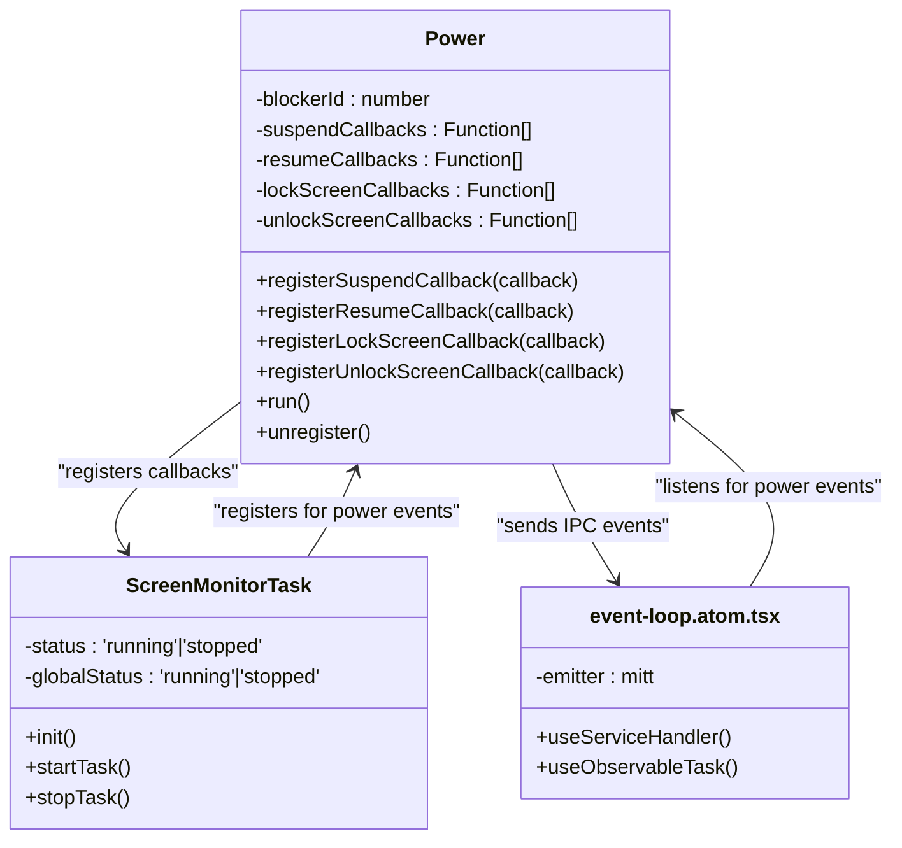
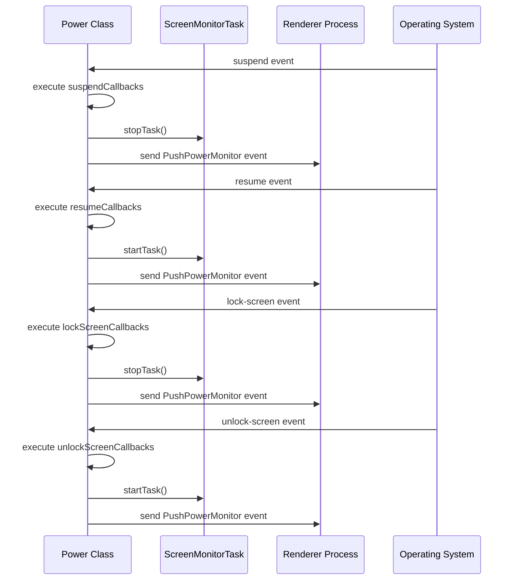
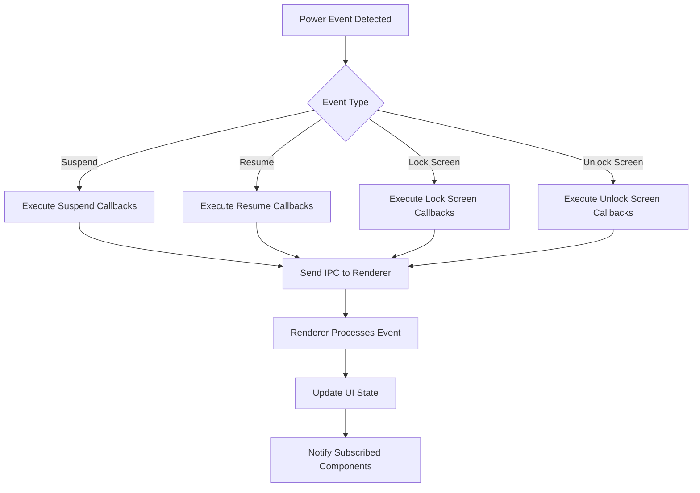
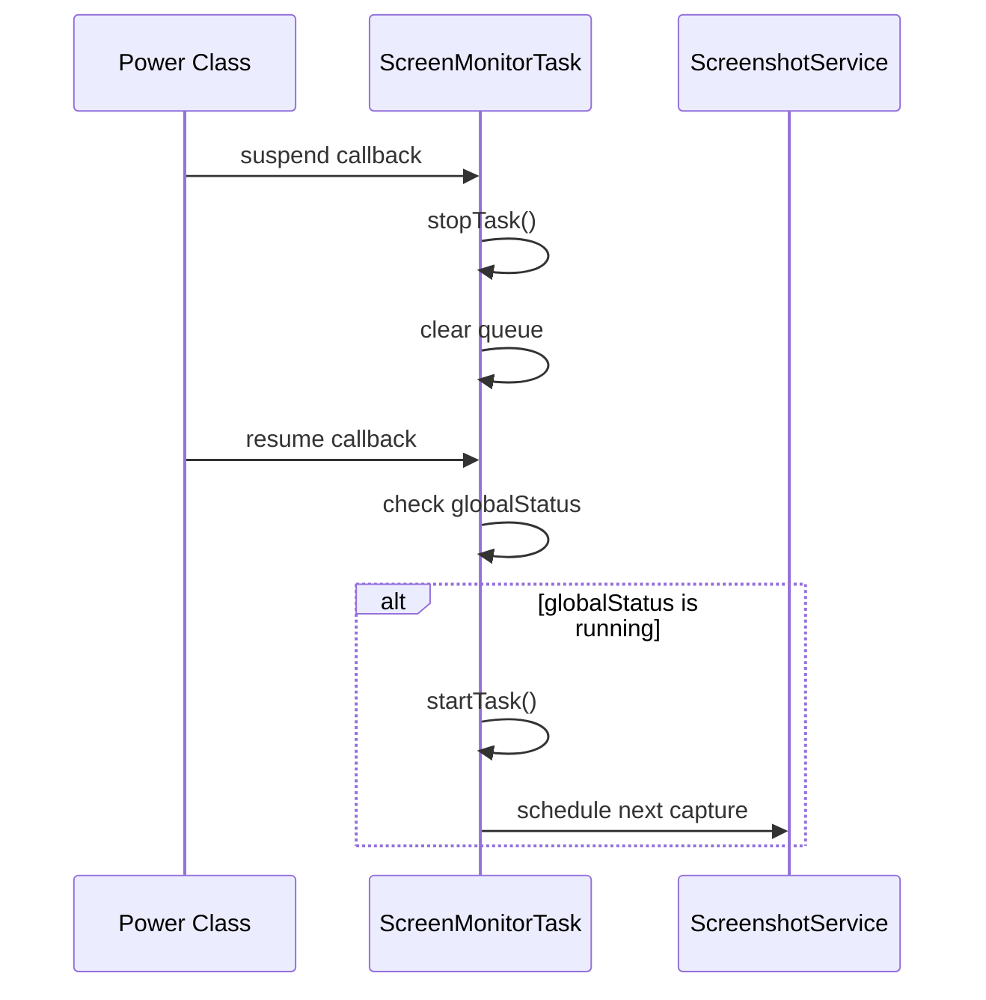
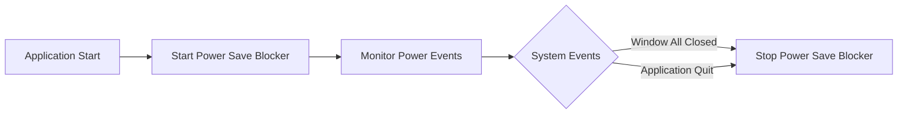
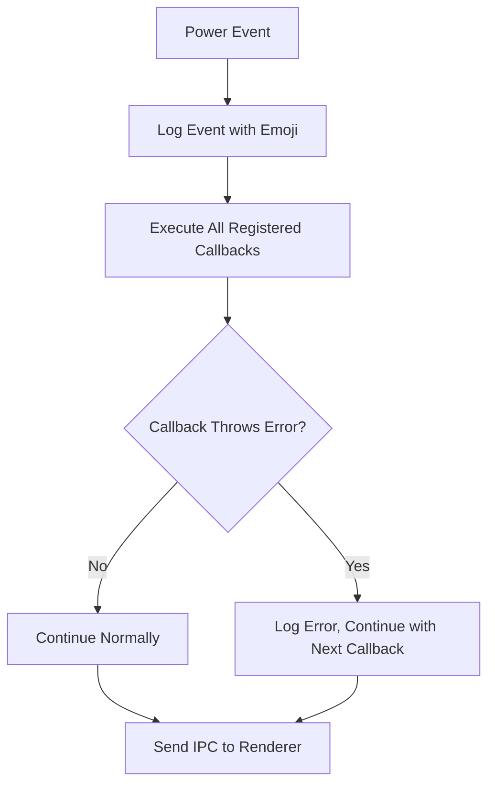

# Power Monitoring

<cite>
**Referenced Files in This Document**   
- [Power.ts](file://frontend/src/main/background/os/Power.ts)
- [power-monitor.ts](file://frontend/packages/shared/constant/power-monitor.ts)
- [screen-monitor-task.ts](file://frontend/src/main/background/task/screen-monitor-task.ts)
- [event-loop.atom.tsx](file://frontend/src/renderer/src/atom/event-loop.atom.tsx)
- [ipc-server-push-channel.ts](file://frontend/packages/shared/ipc-server-push-channel.ts)
- [logger/main.ts](file://frontend/packages/shared/logger/main.ts)
- [logger/renderer.ts](file://frontend/packages/shared/logger/renderer.ts)
</cite>

## Table of Contents
1. [Introduction](#introduction)
2. [Power Monitoring Architecture](#power-monitoring-architecture)
3. [Core Components](#core-components)
4. [Event Handling and Callback Registration](#event-handling-and-callback-registration)
5. [Power State Change Propagation](#power-state-change-propagation)
6. [Screen Capture Integration](#screen-capture-integration)
7. [Power Save Blocking](#power-save-blocking)
8. [Logging and Error Handling](#logging-and-error-handling)
9. [Platform-Specific Considerations](#platform-specific-considerations)
10. [Conclusion](#conclusion)

## Introduction
The MineContext application implements a comprehensive power monitoring system to detect and respond to system power events such as suspend, resume, screen lock, and screen unlock. This system ensures that critical operations are properly managed during power state transitions, particularly for context capture functionality. The implementation leverages Electron's powerMonitor API to detect power events and provides a robust mechanism for other components to react to these events through callback registration and inter-process communication.

**Section sources**
- [Power.ts](file://frontend/src/main/background/os/Power.ts#L1-L86)

## Power Monitoring Architecture

**Diagram sources**
- [Power.ts](file://frontend/src/main/background/os/Power.ts#L10-L86)
- [screen-monitor-task.ts](file://frontend/src/main/background/task/screen-monitor-task.ts#L29-L258)
- [event-loop.atom.tsx](file://frontend/src/renderer/src/atom/event-loop.atom.tsx#L1-L65)

## Core Components

The power monitoring system consists of several key components that work together to detect power events and coordinate the application's response. The core implementation is centered around the Power class in Power.ts, which serves as the primary interface to Electron's powerMonitor API. This class manages event listeners for various power states and provides a callback registration mechanism that allows other components to respond to power events.

The system also includes shared constants for power monitoring events, IPC channel definitions for communication between processes, and integration with the screen monitoring functionality. The architecture is designed to be modular, allowing components to subscribe to power events without direct dependencies on the power monitoring implementation.

**Section sources**
- [Power.ts](file://frontend/src/main/background/os/Power.ts#L1-L86)
- [power-monitor.ts](file://frontend/packages/shared/constant/power-monitor.ts#L1-L6)
- [ipc-server-push-channel.ts](file://frontend/packages/shared/ipc-server-push-channel.ts#L1-L13)

## Event Handling and Callback Registration

**Diagram sources**
- [Power.ts](file://frontend/src/main/background/os/Power.ts#L38-L68)
- [screen-monitor-task.ts](file://frontend/src/main/background/task/screen-monitor-task.ts#L79-L98)

The Power class implements a callback registration pattern that allows other components to subscribe to specific power events. The class maintains separate arrays for callbacks corresponding to different power states: suspend, resume, lock-screen, and unlock-screen. Components can register their callback functions using the public registration methods (registerSuspendCallback, registerResumeCallback, etc.).

When a power event occurs, the Power class iterates through the appropriate callback array and executes each registered function. This design enables multiple components to respond to the same power event without creating tight coupling between components. The callback registration mechanism is central to the system's flexibility and extensibility.

**Section sources**
- [Power.ts](file://frontend/src/main/background/os/Power.ts#L16-L27)
- [Power.ts](file://frontend/src/main/background/os/Power.ts#L38-L68)

## Power State Change Propagation

**Diagram sources**
- [Power.ts](file://frontend/src/main/background/os/Power.ts#L40-L67)
- [event-loop.atom.tsx](file://frontend/src/renderer/src/atom/event-loop.atom.tsx#L19-L26)

The power monitoring system propagates power state changes from the main process to the renderer process using Electron's Inter-Process Communication (IPC) mechanism. When a power event is detected, after executing the registered callbacks, the Power class sends an IPC message to all browser windows using BrowserWindow.getAllWindows().forEach().

The IPC message is sent through the PushPowerMonitor channel defined in IpcServerPushChannel, with a payload containing the specific event key (Suspend, Resume, LockScreen, or UnlockScreen). In the renderer process, the event-loop.atom.tsx component sets up an event handler using window.serverPushAPI.powerMonitor() to receive these power monitoring events and distribute them to subscribed components using the mitt event emitter library.

**Section sources**
- [Power.ts](file://frontend/src/main/background/os/Power.ts#L42-L67)
- [event-loop.atom.tsx](file://frontend/src/renderer/src/atom/event-loop.atom.tsx#L25-L26)

## Screen Capture Integration

The power monitoring system is tightly integrated with the screen capture functionality to ensure that context capture is appropriately managed during power state transitions. The ScreenMonitorTask class registers callbacks with the powerWatcher instance to respond to power events.

When a suspend or lock-screen event occurs, the ScreenMonitorTask stops its monitoring task to prevent unnecessary processing during system sleep or when the screen is locked. Conversely, when a resume or unlock-screen event occurs, the ScreenMonitorTask restarts its monitoring task if the global status indicates that recording should be active.

This integration ensures that screen capture operations are suspended during periods when they would be ineffective or unnecessary, conserving system resources and preventing the capture of blank or locked screen images.

**Diagram sources**
- [screen-monitor-task.ts](file://frontend/src/main/background/task/screen-monitor-task.ts#L79-L98)
- [Power.ts](file://frontend/src/main/background/os/Power.ts#L38-L68)

**Section sources**
- [screen-monitor-task.ts](file://frontend/src/main/background/task/screen-monitor-task.ts#L79-L98)

## Power Save Blocking

The power monitoring system implements power save blocking to prevent the application from being suspended during critical operations. When the Power class is initialized and its run() method is called, it starts a power save blocker with the type 'prevent-app-suspension' using Electron's powerSaveBlocker API.

This power save blocker prevents the system from automatically suspending the application, ensuring that background processes like context capture can continue uninterrupted. The blocker is stopped when all application windows are closed, as indicated by the app.on('window-all-closed') event handler.

The power save blocking feature is essential for maintaining continuous context capture functionality, particularly when the user has configured the application to record during specific time periods or for specific activities.

**Diagram sources**
- [Power.ts](file://frontend/src/main/background/os/Power.ts#L29-L35)
- [Power.ts](file://frontend/src/main/background/os/Power.ts#L78-L81)

**Section sources**
- [Power.ts](file://frontend/src/main/background/os/Power.ts#L29-L35)
- [Power.ts](file://frontend/src/main/background/os/Power.ts#L78-L81)

## Logging and Error Handling

The power monitoring system implements comprehensive logging to track power events and system responses. The Power class uses a dedicated logger instance with the scope 'Power' to record information about power state transitions.

Each power event is logged with an appropriate emoji icon for easy visual identification in the logs: '💤' for suspend, '🌞' for resume, '🔒' for lock-screen, and '🔓' for unlock-screen. Additional power-related events such as speed limit changes and thermal state changes are also logged using the performance monitor.

The system follows a defensive programming approach with proper error handling in the callback execution mechanism. Even if individual callbacks throw exceptions, the system continues to execute remaining callbacks and maintain overall functionality. The unregister method safely stops the power save blocker and removes all event listeners when the power monitoring service is being shut down.

**Diagram sources**
- [Power.ts](file://frontend/src/main/background/os/Power.ts#L39-L67)
- [Power.ts](file://frontend/src/main/background/os/Power.ts#L70-L75)
- [logger/main.ts](file://frontend/packages/shared/logger/main.ts#L12-L14)

**Section sources**
- [Power.ts](file://frontend/src/main/background/os/Power.ts#L39-L67)
- [Power.ts](file://frontend/src/main/background/os/Power.ts#L70-L75)
- [logger/main.ts](file://frontend/packages/shared/logger/main.ts#L12-L14)

## Platform-Specific Considerations

While Electron's powerMonitor API provides cross-platform power event detection, there are platform-specific considerations in the implementation. The code includes a comment indicating that it listens for "macOS power events," suggesting that the event handling may be optimized for macOS, which has specific power management characteristics.

The system handles various power-related events beyond the basic suspend/resume cycle, including lock-screen and unlock-screen events, which may have different behaviors across operating systems. Additionally, the implementation monitors speed limit changes and thermal state changes, which are particularly relevant for mobile and laptop devices that may throttle performance under certain conditions.

The power save blocker type 'prevent-app-suspension' is designed to work across platforms, but its effectiveness may vary depending on the operating system's power management policies and user settings.

**Section sources**
- [Power.ts](file://frontend/src/main/background/os/Power.ts#L37-L38)
- [Power.ts](file://frontend/src/main/background/os/Power.ts#L70-L75)

## Conclusion
The MineContext power monitoring system provides a robust foundation for detecting and responding to system power events. By leveraging Electron's powerMonitor API and implementing a flexible callback registration pattern, the system enables coordinated responses to power state changes across different components of the application.

The integration with screen capture functionality ensures that context capture is appropriately managed during system sleep and screen lock events, while the power save blocking feature prevents critical operations from being interrupted. The comprehensive logging system provides visibility into power events and system responses, aiding in debugging and performance optimization.

This architecture demonstrates a well-designed approach to power management in an Electron application, balancing the need for continuous operation with respect for system power management policies and user experience.