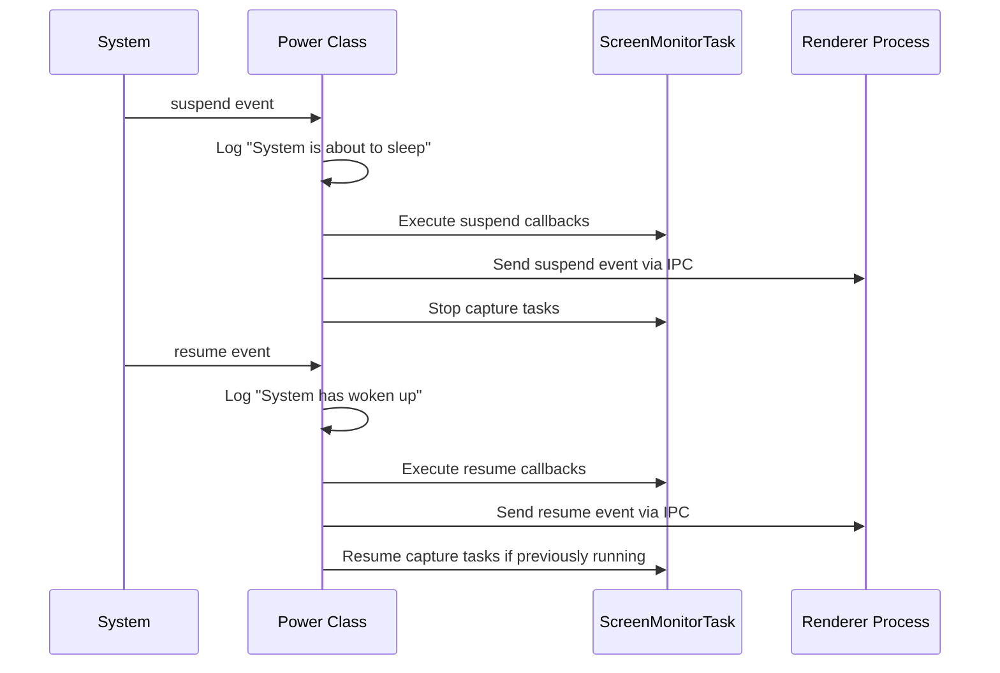
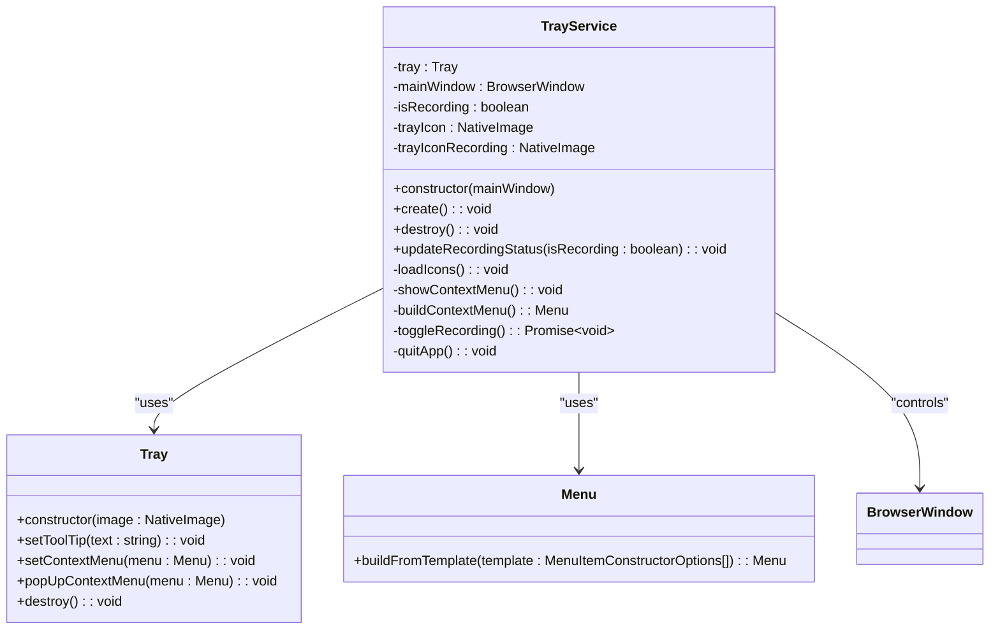
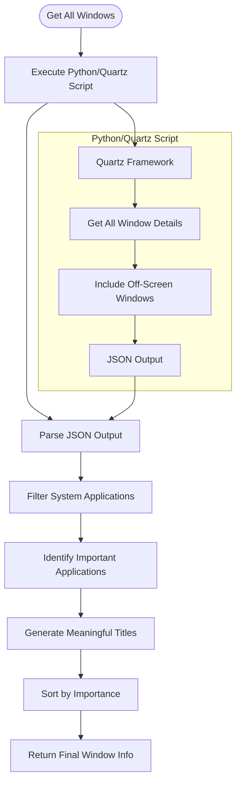
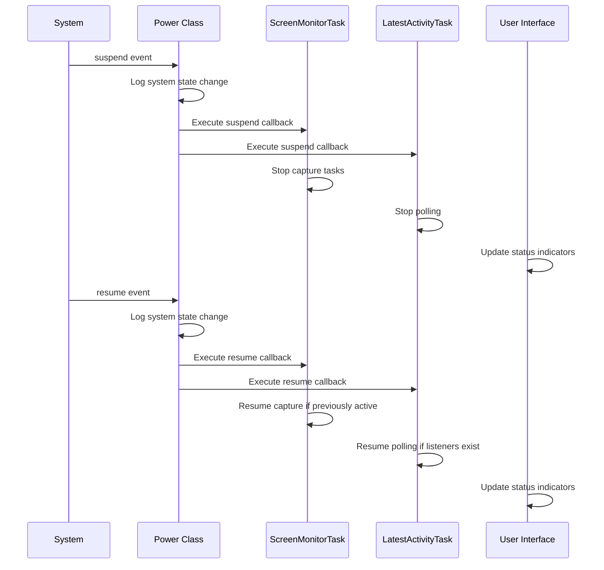
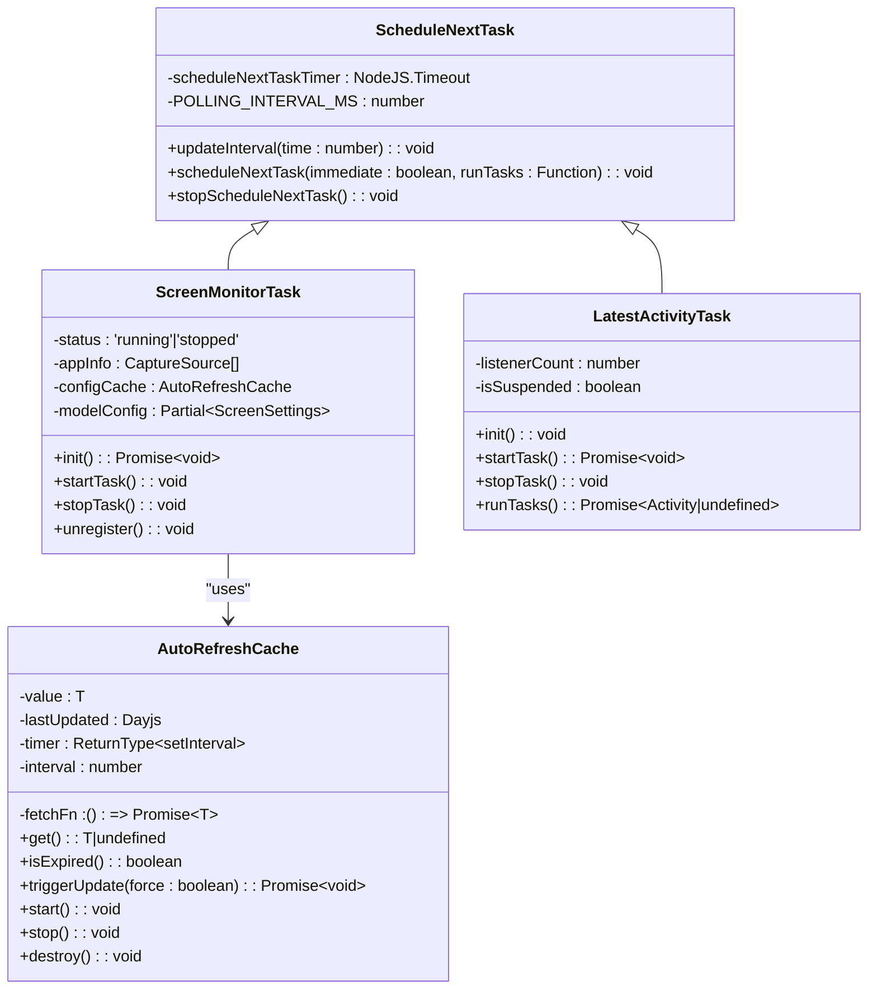
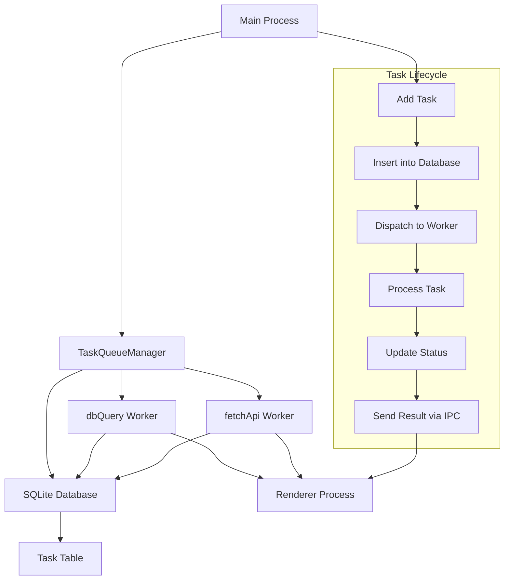

# System Integration

<cite>
**Referenced Files in This Document**   
- [Power.ts](file://frontend/src/main/background/os/Power.ts)
- [TrayService.ts](file://frontend/src/main/services/TrayService.ts)
- [mac-window-manager.ts](file://frontend/src/main/utils/mac-window-manager.ts)
- [screen-monitor-task.ts](file://frontend/src/main/background/task/screen-monitor-task.ts)
- [latest-activity.ts](file://frontend/src/main/background/task/latest-activity.ts)
- [task-queue.ts](file://frontend/src/main/background/utils/task-queue.ts)
- [cache-value.ts](file://frontend/src/main/background/task/cache-value.ts)
- [index.ts](file://frontend/src/main/index.ts)
- [ipc.ts](file://frontend/src/main/ipc.ts)
- [power-monitor.ts](file://frontend/packages/shared/constant/power-monitor.ts)
</cite>

## Table of Contents
1. [Introduction](#introduction)
2. [Power Monitoring](#power-monitoring)
3. [System Tray Integration](#system-tray-integration)
4. [Window Management](#window-management)
5. [System Event Integration](#system-event-integration)
6. [Background Task Management](#background-task-management)
7. [Task Queue Implementation](#task-queue-implementation)
8. [Conclusion](#conclusion)

## Introduction
MineContext provides comprehensive system integration features that enable seamless interaction between the application and the host operating system. This document details the implementation of key system integration components, including power monitoring, system tray integration, window management, and background task execution. The application is designed to maintain responsiveness during system transitions such as sleep/wake cycles and screen lock/unlock events, while providing users with convenient access to controls through the system tray. The integration with system events ensures that capture activities are properly managed based on system state, and background tasks are efficiently scheduled and executed to maintain application performance.

## Power Monitoring
MineContext implements robust power monitoring functionality through the `Power` class in `Power.ts`, which leverages Electron's `powerMonitor` API to detect and respond to system power events. The implementation provides event callbacks for system suspend, resume, lock screen, and unlock screen events, allowing the application to adjust its behavior based on system state changes.

The `Power` class maintains callback registries for different system events, enabling various components to subscribe to power state changes. When the application starts, it calls the `run()` method which initializes the power monitoring system and sets up event listeners for all supported power events. The class also implements a power save blocker using `powerSaveBlocker.start('prevent-app-suspension')`, which prevents the system from suspending the application under certain conditions.

Key power events are logged with descriptive messages:
- Suspend: "System is about to sleep"
- Resume: "System has woken up" 
- Lock screen: "Screen is locked"
- Unlock screen: "Screen is unlocked"

When a power event occurs, the `Power` class not only executes registered callbacks but also broadcasts the event to all renderer windows via IPC (Inter-Process Communication) using `IpcServerPushChannel.PushPowerMonitor`. This ensures that both main and renderer processes are aware of system state changes and can respond appropriately.

The power monitoring system is integrated with capture functionality, automatically pausing recording when the system suspends or the screen locks, and resuming when the system wakes or the screen unlocks. This prevents unnecessary resource consumption during periods when the user is not actively using the computer.

**Diagram sources**
- [Power.ts](file://frontend/src/main/background/os/Power.ts#L38-L68)
- [screen-monitor-task.ts](file://frontend/src/main/background/task/screen-monitor-task.ts#L79-L98)

**Section sources**
- [Power.ts](file://frontend/src/main/background/os/Power.ts#L10-L87)
- [power-monitor.ts](file://frontend/packages/shared/constant/power-monitor.ts#L1-L7)

## System Tray Integration
MineContext provides system tray integration through the `TrayService` class, which creates and manages a system tray icon with platform-specific behavior and visual styling. The tray service offers quick access to application controls and status information, allowing users to interact with the application without opening the main window.

The `TrayService` implementation handles icon loading and management for different platforms:
- **macOS**: Uses PNG icons with template image settings to automatically adapt to dark and light menu bar themes
- **Windows**: Uses high-resolution PNG icons that support high-DPI displays
- **Linux**: Uses a standard icon with appropriate sizing

The tray icon visually indicates the application's recording status by switching between two states:
- Default icon: Displayed when recording is paused
- Recording icon: Displayed when active capture is in progress

The context menu provides key application controls:
- Display status (e.g., "Recording" or "Paused")
- "Show main window" option
- "Pause/Resume recording" toggle
- "Exit MineContext" option

Platform-specific interaction patterns are implemented:
- **Windows**: Left-click shows the main window, right-click shows the context menu
- **macOS and Linux**: Click shows the context menu

The tray service integrates with the application's recording functionality through IPC communication. When the user toggles recording via the tray menu, the service sends a `Tray_ToggleRecording` event to the renderer process. Before starting recording, it checks for screen recording permissions and guides the user to the appropriate system settings if permissions are not granted.

**Diagram sources**
- [TrayService.ts](file://frontend/src/main/services/TrayService.ts#L12-L295)
- [index.ts](file://frontend/src/main/index.ts#L262-L264)

**Section sources**
- [TrayService.ts](file://frontend/src/main/services/TrayService.ts#L12-L295)
- [index.ts](file://frontend/src/main/index.ts#L262-L264)

## Window Management
On macOS, MineContext implements advanced window management capabilities through the `mac-window-manager` utility, which provides detailed information about application windows across different spaces and virtual desktops. This functionality is critical for accurately capturing user activity and understanding which applications are currently in focus.

The window management system uses a hybrid approach combining Python scripts with Electron's native capabilities:
- A Python script utilizing the Quartz framework retrieves comprehensive window information, including windows on other spaces and minimized windows
- The Electron main process communicates with the Python script via child process spawning and JSON output parsing
- The results are processed and filtered to provide relevant window information to the application

The `getAllWindows` function returns an array of `FinalWindowInfo` objects containing:
- Window ID
- Application name
- Window title
- Visibility status
- Importance flag (based on application type)
- Geometric bounds (position and size)
- Z-order layer

The implementation maintains lists of important applications (e.g., Zoom, Microsoft Office, Slack, Visual Studio Code) and system applications (e.g., MineContext, Electron, Dock) to filter and prioritize window information. Important applications are given higher priority in the results, and window titles are intelligently generated when not available (e.g., "Zoom Meeting" for Zoom windows).

The window manager also handles edge cases such as applications with empty window titles by providing meaningful defaults based on the application name. Results are sorted to prioritize important applications, ensuring that the most relevant windows are processed first.

**Diagram sources**
- [mac-window-manager.ts](file://frontend/src/main/utils/mac-window-manager.ts#L89-L186)
- [window_inspector.py](file://frontend/externals/python/window_inspector/window_inspector.py)

**Section sources**
- [mac-window-manager.ts](file://frontend/src/main/utils/mac-window-manager.ts#L89-L186)

## System Event Integration
MineContext maintains responsiveness during system transitions by integrating with various system events through a comprehensive event handling system. The application responds to power state changes, screen lock/unlock events, and other system-level notifications to ensure appropriate behavior during different system states.

The integration is achieved through the `Power` class, which acts as a central event dispatcher for system events. Multiple components register callbacks with the `Power` class to receive notifications when specific system events occur:

- **ScreenMonitorTask**: Registers callbacks for suspend, resume, lock screen, and unlock screen events to control capture activities
- **LatestActivityTask**: Registers the same callbacks to manage polling for latest activity data
- **Other components**: Can register additional callbacks as needed

When the system suspends or the screen locks, the application automatically:
- Stops all capture activities
- Pauses background polling tasks
- Preserves system resources

When the system resumes or the screen unlocks, the application:
- Restarts capture activities if they were running before the transition
- Resumes background polling tasks
- Updates the UI to reflect the current state

The event integration ensures that the application behaves appropriately during system transitions, preventing unnecessary resource consumption when the user is not actively using the computer while maintaining the ability to quickly resume operations when the user returns.

**Diagram sources**
- [Power.ts](file://frontend/src/main/background/os/Power.ts#L38-L68)
- [screen-monitor-task.ts](file://frontend/src/main/background/task/screen-monitor-task.ts#L79-L98)
- [latest-activity.ts](file://frontend/src/main/background/task/latest-activity.ts#L21-L24)

**Section sources**
- [Power.ts](file://frontend/src/main/background/os/Power.ts#L38-L68)
- [screen-monitor-task.ts](file://frontend/src/main/background/task/screen-monitor-task.ts#L79-L98)
- [latest-activity.ts](file://frontend/src/main/background/task/latest-activity.ts#L21-L24)

## Background Task Management
MineContext implements a sophisticated background task management system that handles various types of periodic and event-driven tasks. The system is built around the `ScheduleNextTask` class, which provides a foundation for scheduling and executing recurring tasks with precise timing control.

The `ScheduleNextTask` class manages task execution with the following features:
- Configurable polling intervals (default: 15 seconds)
- Dynamic delay calculation to correct for execution time drift
- Immediate execution option for the first run
- Proper cleanup and timer management

Multiple specialized task classes extend `ScheduleNextTask` to handle specific functionality:
- **ScreenMonitorTask**: Manages screenshot capture and upload operations
- **LatestActivityTask**: Polls for the latest user activity data

The `ScreenMonitorTask` implementation demonstrates advanced task management features:
- It maintains a global status and individual task status
- It uses an `AutoRefreshCache` to cache visible sources with a 3-second refresh interval
- It integrates with system events to pause and resume based on power state
- It uses a P-queue with concurrency control (3 concurrent tasks) to manage screenshot operations

The task system listens for IPC events from the renderer process to control task execution:
- `Task_Start`: Starts the capture task
- `Task_Stop`: Stops the capture task
- `Task_Update_Model_Config`: Updates the recording interval

The `LatestActivityTask` implements a listener-based approach where polling only occurs when there are active listeners (typically when the home page is visible). This conserves resources when the data is not needed.

**Diagram sources**
- [schedule-next-task.ts](file://frontend/src/main/background/task/schedule-next-task.ts#L4-L52)
- [screen-monitor-task.ts](file://frontend/src/main/background/task/screen-monitor-task.ts#L29-L258)
- [latest-activity.ts](file://frontend/src/main/background/task/latest-activity.ts#L11-L100)
- [cache-value.ts](file://frontend/src/main/background/task/cache-value.ts#L12-L98)

**Section sources**
- [schedule-next-task.ts](file://frontend/src/main/background/task/schedule-next-task.ts#L4-L52)
- [screen-monitor-task.ts](file://frontend/src/main/background/task/screen-monitor-task.ts#L29-L258)
- [latest-activity.ts](file://frontend/src/main/background/task/latest-activity.ts#L11-L100)

## Task Queue Implementation
MineContext implements a robust task queue system through the `TaskQueueManager` class, which manages background tasks using a combination of SQLite persistence and worker threads. This system ensures reliable execution of various application tasks while maintaining responsiveness.

The `TaskQueueManager` architecture includes:
- **SQLite database**: Persists tasks with status, retries, and metadata
- **Worker threads**: Two dedicated workers for database queries and API calls
- **IPC communication**: Coordinates between main process and workers

The database schema includes the following fields for each task:
- id: Unique identifier (auto-incrementing)
- type: Task type (e.g., 'dbQuery', 'fetchApi')
- payload: JSON data required for task execution
- status: Current status ('pending', 'processing', 'completed', 'failed')
- retries: Number of retry attempts
- max_retries: Maximum allowed retries
- cron: Cron expression for scheduled tasks
- created_at: Timestamp of task creation
- updated_at: Timestamp of last update

The implementation uses two worker threads:
- **dbQuery worker**: Handles database-related tasks
- **fetchApi worker**: Handles API call tasks

Tasks are added to the queue using the `addTask` method, which:
1. Inserts the task into the SQLite database
2. Dispatches the task to the appropriate worker thread based on type
3. Returns the task ID for reference

The system supports task deletion, retrieval of all tasks, and proper cleanup. The worker threads communicate back to the main process via IPC, allowing the UI to be updated with task progress and results.

This architecture provides several benefits:
- **Reliability**: Tasks are persisted to disk, surviving application restarts
- **Concurrency**: Multiple tasks can be processed simultaneously
- **Resource management**: Worker threads prevent the main thread from being blocked
- **Error handling**: Failed tasks can be retried up to a configurable maximum

**Diagram sources**
- [task-queue.ts](file://frontend/src/main/background/utils/task-queue.ts#L10-L88)
- [index.ts](file://frontend/src/main/index.ts#L23-L24)

**Section sources**
- [task-queue.ts](file://frontend/src/main/background/utils/task-queue.ts#L10-L88)

## Conclusion
MineContext's system integration features demonstrate a comprehensive approach to creating a responsive and efficient desktop application. The power monitoring system ensures appropriate behavior during system transitions, automatically pausing and resuming capture activities based on system sleep/wake and screen lock/unlock events. The system tray integration provides users with convenient access to application controls and status information across all supported platforms.

The macOS-specific window management capabilities, implemented through the `mac-window-manager` utility, enable accurate tracking of application windows across different spaces and virtual desktops. This functionality is essential for understanding user context and capturing relevant activity data.

The background task management system, built on the `ScheduleNextTask` foundation, efficiently handles periodic operations such as screenshot capture and activity polling. The implementation includes sophisticated features like dynamic timing adjustments to prevent drift and listener-based activation to conserve resources.

Finally, the task queue system provides reliable execution of background operations through a combination of SQLite persistence and worker threads, ensuring that tasks are completed even if the application restarts and preventing the main thread from being blocked by long-running operations.

Together, these system integration features create a robust foundation for MineContext's core functionality, enabling it to operate efficiently in the background while maintaining responsiveness to system events and user interactions.