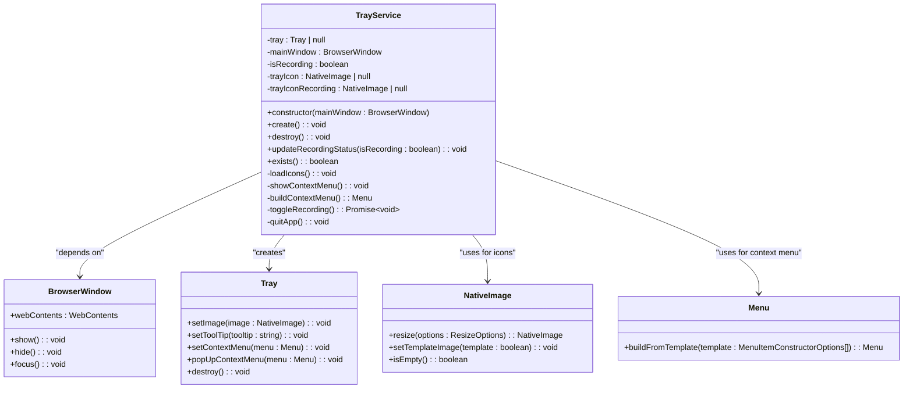
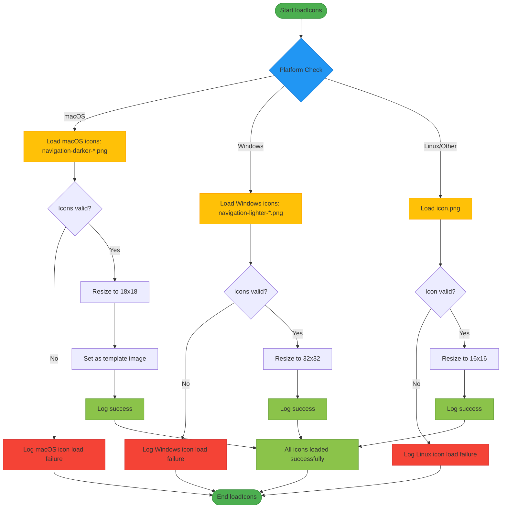
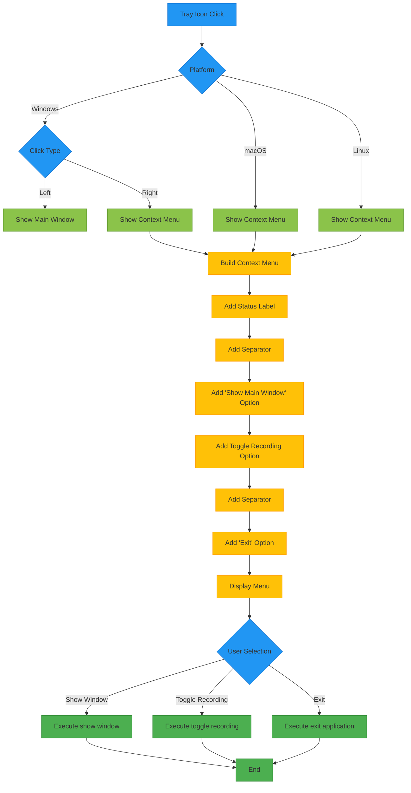
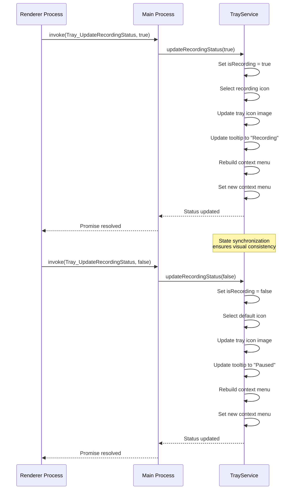
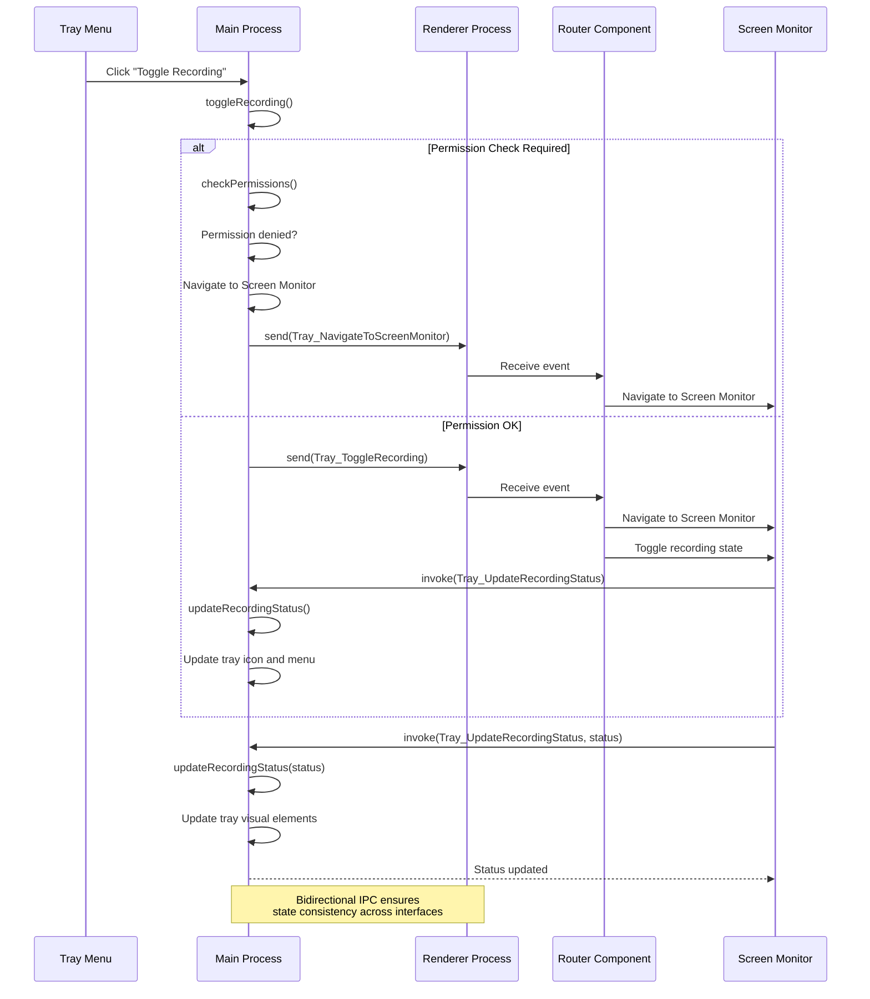
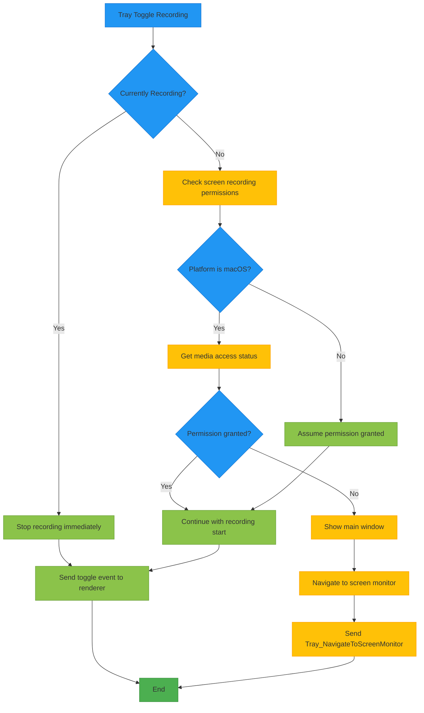

# System Tray Integration

<cite>
**Referenced Files in This Document**   
- [TrayService.ts](file://frontend/src/main/services/TrayService.ts)
- [IpcChannel.ts](file://frontend/packages/shared/IpcChannel.ts)
- [ipc-server-push-channel.ts](file://frontend/packages/shared/ipc-server-push-channel.ts)
- [ipc.ts](file://frontend/src/main/ipc.ts)
- [index.ts](file://frontend/src/main/index.ts)
- [screen-monitor.tsx](file://frontend/src/renderer/src/pages/screen-monitor/screen-monitor.tsx)
- [Router.tsx](file://frontend/src/renderer/src/Router.tsx)
- [ScreenshotService.ts](file://frontend/src/main/services/ScreenshotService.ts)
</cite>

## Table of Contents
1. [Introduction](#introduction)
2. [TrayService Architecture](#trayservice-architecture)
3. [Platform-Specific Icon Implementation](#platform-specific-icon-implementation)
4. [Context Menu Design](#context-menu-design)
5. [State Management and Visual Feedback](#state-management-and-visual-feedback)
6. [IPC Communication Flow](#ipc-communication-flow)
7. [Permission Integration](#permission-integration)
8. [Error Handling and Fallback Strategies](#error-handling-and-fallback-strategies)
9. [Conclusion](#conclusion)

## Introduction

The system tray integration in MineContext provides users with convenient access to core application functionality through a system tray icon that appears in the operating system's notification area. This feature enables quick control over screen recording operations, application visibility, and shutdown procedures without requiring the main application window to be open. The implementation is built around the `TrayService` class, which manages the creation, behavior, and lifecycle of the tray icon across different operating systems including macOS, Windows, and Linux.

The system tray functionality serves as a persistent interface point that maintains application state awareness, particularly regarding the screen recording status. It provides visual feedback through different icon states and tooltips, while offering a context menu with essential controls. The implementation demonstrates a thoughtful approach to cross-platform compatibility, high-DPI display support, and seamless integration with the application's permission system.

**Section sources**
- [TrayService.ts](file://frontend/src/main/services/TrayService.ts#L1-L295)

## TrayService Architecture

The `TrayService` class serves as the central component for managing the system tray functionality in MineContext. Implemented as a TypeScript class, it encapsulates all logic related to tray icon creation, state management, and user interaction handling. The service follows a dependency injection pattern by accepting the main application window as a constructor parameter, establishing a direct communication channel between the tray interface and the primary application interface.

The architecture is organized around several key responsibilities: icon management, platform-specific behavior handling, context menu generation, and state synchronization. The service maintains internal state variables including the current recording status and references to both the default and recording state tray icons. This state is used to dynamically update the visual representation and menu options presented to the user.

The service lifecycle begins with icon loading during construction, followed by explicit creation of the tray element when appropriate. The implementation includes proper cleanup methods to destroy the tray instance when needed, ensuring resource management and preventing memory leaks. The service also implements existence checking to prevent duplicate tray icon creation.

**Diagram sources **
- [TrayService.ts](file://frontend/src/main/services/TrayService.ts#L12-L295)

**Section sources**
- [TrayService.ts](file://frontend/src/main/services/TrayService.ts#L12-L295)

## Platform-Specific Icon Implementation

MineContext implements a sophisticated approach to tray icon management that accounts for the different requirements and conventions of each operating system. The `loadIcons` method in the `TrayService` class contains platform-specific logic that ensures optimal visual quality and adherence to platform design guidelines.

For macOS, the implementation uses PNG icons named "navigation-darker-default.png" and "navigation-darker-record.png" located in the resources directory. These icons are designed at 54x54 pixel resolution (3x for Retina displays) and are resized to 18x18 pixels for display. A key feature of the macOS implementation is the use of template images, enabled by calling `setTemplateImage(true)` on both icon states. This allows the operating system to automatically adjust the icon color based on the menu bar background, ensuring visibility whether the user has a light or dark menu bar theme.

On Windows, the application uses different PNG icons named "navigation-lighter-default.png" and "navigation-lighter-record.png" to better suit the typically lighter taskbar backgrounds. These icons are also sourced at 54x54 pixel resolution but are resized to 32x32 pixels for Windows tray display, which provides better clarity on high-DPI displays. The larger size accommodates Windows' tray icon standards while maintaining crisp rendering at various scaling factors.

For Linux and other platforms, the implementation falls back to a standard "icon.png" file, resized to 16x16 pixels, which represents the conventional size for Linux system tray icons. The recording state uses the same icon as the default state on Linux, simplifying the implementation for platforms with less standardized tray icon conventions.

The implementation includes comprehensive error handling for icon loading failures, with specific logging for each platform to aid in troubleshooting. The code also includes fallback mechanisms, such as attempting to reload icons if they were not initially loaded, ensuring robustness in various deployment scenarios.

**Diagram sources **
- [TrayService.ts](file://frontend/src/main/services/TrayService.ts#L27-L97)

**Section sources**
- [TrayService.ts](file://frontend/src/main/services/TrayService.ts#L27-L97)

## Context Menu Design

The context menu in MineContext's system tray provides users with quick access to essential application controls, designed to be intuitive and efficient. The menu is dynamically generated based on the current application state, particularly the recording status, ensuring that the available options are always relevant to the user's needs.

The menu structure consists of three main sections separated by visual dividers. The first section displays the current recording status as a non-interactive label, showing either "录制中" (Recording) or "已暂停" (Paused) to provide immediate visual feedback about the application state. This status indicator serves as a quick reference without requiring user interaction.

The second section contains the primary interactive controls. The "显示主窗口" (Show Main Window) option allows users to quickly bring the application to the foreground, which is particularly useful when the window is minimized or hidden. The recording toggle option changes its label based on the current state, displaying "暂停录制" (Pause Recording) when recording is active, or "继续录制" (Continue Recording) when paused. This contextual labeling reduces cognitive load by clearly indicating the action that will occur when selected.

The final section contains the "退出 MineContext" (Exit MineContext) option, which provides a convenient way to terminate the application completely. This menu structure follows platform conventions while maintaining consistency across operating systems, with the same options available regardless of whether the user is on macOS, Windows, or Linux.

The menu behavior varies slightly by platform to align with user expectations. On Windows, left-clicking the tray icon shows the main window while right-clicking displays the context menu, following Windows UI conventions. On macOS and Linux, a single click on the tray icon directly displays the context menu, which is consistent with the behavior expected on these platforms.

**Diagram sources **
- [TrayService.ts](file://frontend/src/main/services/TrayService.ts#L168-L207)

**Section sources**
- [TrayService.ts](file://frontend/src/main/services/TrayService.ts#L168-L207)

## State Management and Visual Feedback

MineContext employs a comprehensive state management system for the system tray that ensures visual elements remain synchronized with the application's recording status. The `updateRecordingStatus` method serves as the central mechanism for propagating state changes to the tray interface, updating the icon, tooltip, and context menu in a coordinated manner.

When the recording status changes, the method first updates the internal `isRecording` state variable, which serves as the source of truth for the current recording state. It then selects the appropriate icon from the pre-loaded icon set: the recording state icon when actively recording, or the default icon when paused. This approach of pre-loading both icon states during initialization ensures immediate visual feedback without loading delays when the state changes.

The tooltip text is dynamically updated to reflect the current state, displaying "MineContext - 录制中" (MineContext - Recording) when recording is active, or "MineContext - 已暂停" (MineContext - Paused) when recording is paused. This provides clear status information even when the context menu is not visible, enhancing accessibility and user awareness.

The context menu is rebuilt with each state change to ensure that the toggle recording option displays the correct action label. When recording is active, the menu shows "暂停录制" (Pause Recording), and when paused, it shows "继续录制" (Continue Recording). This contextual labeling reduces user errors by making the consequences of menu selection explicit.

The state management system is designed to be idempotent and safe against repeated calls, with null checks to prevent errors if the tray has not been created or has been destroyed. This robustness ensures that the application can call `updateRecordingStatus` from various parts of the codebase without needing to check the tray's existence first, simplifying integration with other components.

**Diagram sources **
- [TrayService.ts](file://frontend/src/main/services/TrayService.ts#L254-L273)
- [ipc.ts](file://frontend/src/main/ipc.ts#L556-L564)

**Section sources**
- [TrayService.ts](file://frontend/src/main/services/TrayService.ts#L254-L273)
- [ipc.ts](file://frontend/src/main/ipc.ts#L556-L564)

## IPC Communication Flow

The system tray functionality in MineContext relies on a sophisticated inter-process communication (IPC) system that coordinates actions between the main process (where the tray resides) and the renderer process (where the user interface is displayed). This bidirectional communication enables seamless integration between the system tray controls and the application's core functionality.

The communication flow operates in both directions. When a user interacts with the tray icon, events are sent from the main process to the renderer process using Electron's `webContents.send` method. For example, when the user clicks the recording toggle in the context menu, the `toggleRecording` method sends the `Tray_ToggleRecording` event to the renderer, which then handles the recording state change in the user interface.

Conversely, when the recording state changes in the renderer process (such as when recording starts or stops through the main interface), the renderer invokes an IPC handler in the main process to update the tray's visual state. The `Tray_UpdateRecordingStatus` IPC channel is used for this purpose, calling the `updateRecordingStatus` method on the `TrayService` instance to synchronize the tray icon, tooltip, and menu with the current recording state.

The Router component in the renderer process acts as a central hub for tray-related events, listening for both `Tray_NavigateToScreenMonitor` and `Tray_ToggleRecording` events. When these events are received, the router navigates to the appropriate page and may trigger recording actions, creating a cohesive user experience regardless of whether the user initiated the action from the tray or the main interface.

This bidirectional communication pattern ensures that the system tray remains an active participant in the application's state management rather than a passive display element. The design allows for multiple entry points to the same functionality, giving users flexibility in how they interact with the application while maintaining consistency across interfaces.

**Diagram sources **
- [TrayService.ts](file://frontend/src/main/services/TrayService.ts#L212-L234)
- [Router.tsx](file://frontend/src/renderer/src/Router.tsx#L46-L58)
- [screen-monitor.tsx](file://frontend/src/renderer/src/pages/screen-monitor/screen-monitor.tsx#L329-L344)
- [ipc.ts](file://frontend/src/main/ipc.ts#L556-L564)

**Section sources**
- [TrayService.ts](file://frontend/src/main/services/TrayService.ts#L212-L234)
- [Router.tsx](file://frontend/src/renderer/src/Router.tsx#L46-L58)
- [screen-monitor.tsx](file://frontend/src/renderer/src/pages/screen-monitor/screen-monitor.tsx#L329-L344)
- [ipc.ts](file://frontend/src/main/ipc.ts#L556-L564)

## Permission Integration

The system tray integration in MineContext includes robust permission handling that ensures the application can only initiate screen recording when appropriate permissions have been granted by the user. This security feature is particularly important on macOS, where screen recording permissions are strictly enforced by the operating system.

When a user attempts to start recording through the tray icon, the `toggleRecording` method first checks whether recording is currently active. If recording is not active (meaning the user is attempting to start recording), the method calls `checkPermissions` on the `screenshotService` to verify that the necessary permissions are in place.

On macOS, the permission check uses Electron's `systemPreferences.getMediaAccessStatus('screen')` method to determine if the application has been granted screen recording permissions. If permissions are not granted, the application does not attempt to start recording. Instead, it shows the main window and navigates to the screen monitor page, where the user can be guided through the permission granting process.

The implementation includes a specific IPC event, `Tray_NavigateToScreenMonitor`, which is sent to the renderer process to trigger navigation to the screen monitoring interface. This creates a seamless user experience where attempting to record without permissions naturally leads the user to the location where they can resolve the issue.

On Windows and Linux, the permission check currently returns true by default, as these platforms do not have a standardized API for checking screen recording permissions. This design allows the application to function on these platforms while reserving the ability to implement platform-specific permission checks in the future if needed.

The permission integration demonstrates a user-centric approach that prioritizes clear feedback and guidance over simply blocking functionality, helping users understand and resolve permission issues rather than encountering opaque failures.

**Diagram sources **
- [TrayService.ts](file://frontend/src/main/services/TrayService.ts#L214-L227)
- [ScreenshotService.ts](file://frontend/src/main/services/ScreenshotService.ts#L28-L33)

**Section sources**
- [TrayService.ts](file://frontend/src/main/services/TrayService.ts#L214-L227)
- [ScreenshotService.ts](file://frontend/src/main/services/ScreenshotService.ts#L28-L33)

## Error Handling and Fallback Strategies

The system tray implementation in MineContext incorporates comprehensive error handling and fallback strategies to ensure reliability and graceful degradation when issues occur. The design anticipates potential failure points and provides appropriate responses to maintain application stability and user experience.

Icon loading failures are handled through multiple layers of protection. The `loadIcons` method wraps the entire icon loading process in a try-catch block to capture any unexpected errors. Within each platform-specific block, the code checks whether the loaded icons are valid using the `isEmpty()` method before proceeding. If icon loading fails for a specific platform, the method logs an error but continues execution, allowing the application to function with whatever icons were successfully loaded.

The `create` method includes defensive checks to prevent tray creation when icons are not available. If the tray icon is null or empty, the method logs an error and returns without creating the tray. However, it also includes a fallback mechanism that attempts to load icons if they were not previously loaded, providing a second chance for successful initialization.

Resource management is handled through proper cleanup methods. The `destroy` method safely destroys the tray instance if it exists, setting the reference to null to prevent dangling pointers. This ensures that system resources are properly released when the tray is no longer needed, such as when the application is quitting or when tray functionality is disabled.

The implementation also includes null checks throughout the codebase to prevent runtime errors. Methods like `updateRecordingStatus` and `exists` include checks for the presence of the tray instance before attempting to interact with it, ensuring that calls to these methods are safe even if the tray has not been created or has been destroyed.

These error handling strategies demonstrate a robust approach to software reliability, prioritizing application stability over feature completeness when issues arise, while providing clear diagnostic information through comprehensive logging to aid in troubleshooting.

**Section sources**
- [TrayService.ts](file://frontend/src/main/services/TrayService.ts#L95-L97)
- [TrayService.ts](file://frontend/src/main/services/TrayService.ts#L115-L118)
- [TrayService.ts](file://frontend/src/main/services/TrayService.ts#L279-L284)

## Conclusion

The system tray integration in MineContext represents a well-designed feature that enhances user experience through convenient access to core application functionality. The implementation demonstrates thoughtful consideration of cross-platform differences, with tailored approaches for macOS, Windows, and Linux that respect each platform's conventions and technical requirements.

The `TrayService` class effectively encapsulates the complexity of tray management, providing a clean interface for creating, updating, and destroying the tray icon. The use of pre-loaded icons, template images on macOS, and appropriate sizing for high-DPI displays ensures visual quality across different environments. The dynamic context menu provides intuitive access to essential controls, with state-dependent labels that reduce user confusion.

The bidirectional IPC communication system creates a cohesive experience between the tray interface and the main application, allowing users to control recording from multiple entry points while maintaining state consistency. The integration with the permission system on macOS demonstrates a user-centric approach that guides users through permission granting rather than simply blocking functionality.

Robust error handling and fallback strategies ensure that the application remains stable even when icon loading fails or other issues occur. Comprehensive logging provides valuable diagnostic information for troubleshooting, while defensive programming practices prevent common runtime errors.

Overall, the system tray implementation in MineContext exemplifies good software engineering practices, balancing functionality, usability, and reliability to create a seamless user experience across different operating systems and usage scenarios.