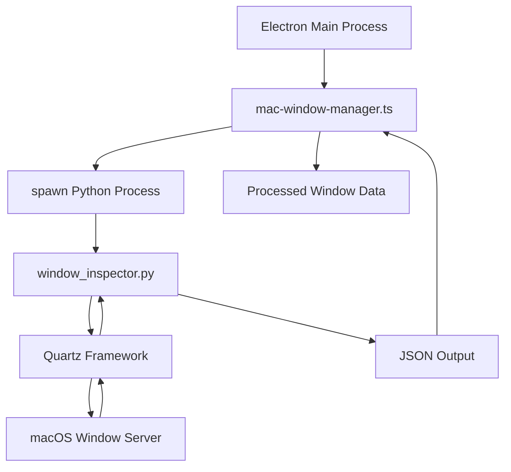
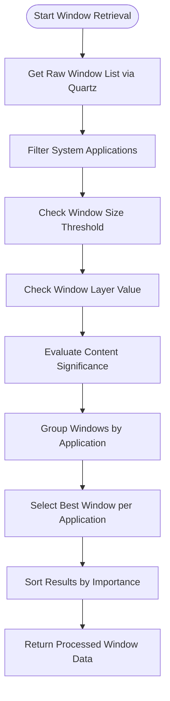
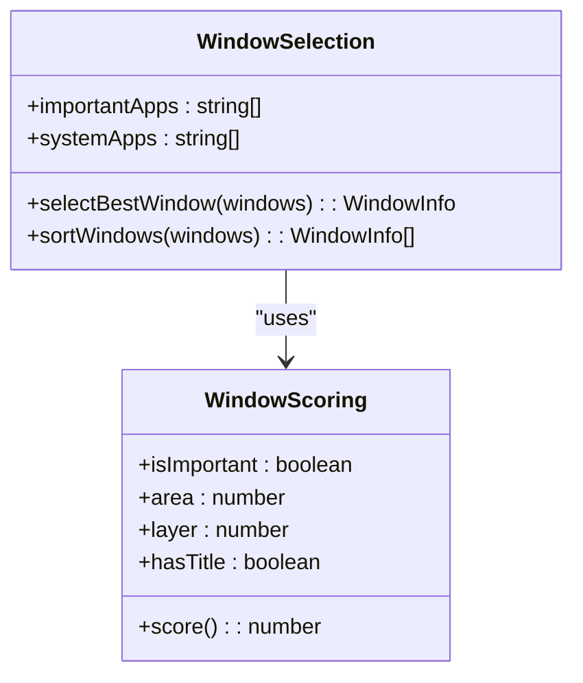
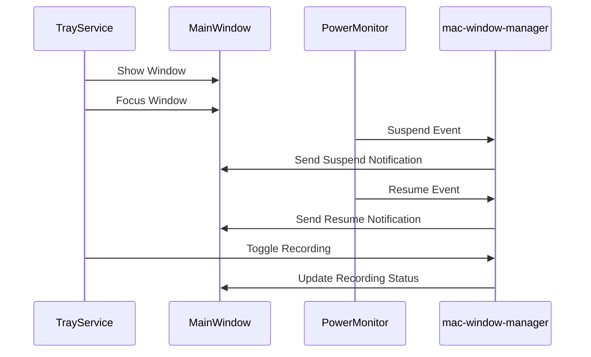
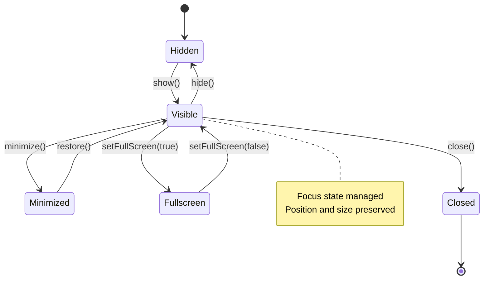
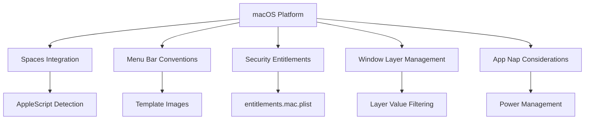
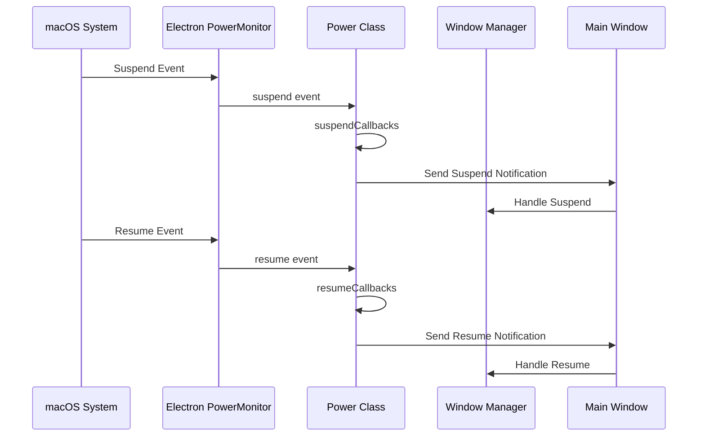

# Window Management

<cite>
**Referenced Files in This Document**   
- [mac-window-manager.ts](file://frontend/src/main/utils/mac-window-manager.ts)
- [window_inspector.py](file://frontend/externals/python/window_inspector/window_inspector.py)
- [window_capture.py](file://frontend/externals/python/window_capture/window_capture.py)
- [TrayService.ts](file://frontend/src/main/services/TrayService.ts)
- [Power.ts](file://frontend/src/main/background/os/Power.ts)
- [get-capture-sources.ts](file://frontend/src/main/utils/get-capture-sources.ts)
- [get-visible-source.ts](file://frontend/src/main/utils/get-visible-source.ts)
- [entitlements.mac.plist](file://frontend/build/entitlements.mac.plist)
</cite>

## Table of Contents
1. [Introduction](#introduction)
2. [mac-window-manager Utility Overview](#mac-window-manager-utility-overview)
3. [Window Information Retrieval Process](#window-information-retrieval-process)
4. [Window Selection and Prioritization Logic](#window-selection-and-prioritization-logic)
5. [Integration with System Services](#integration-with-system-services)
6. [Window State Management](#window-state-management)
7. [Platform-Specific Considerations for macOS](#platform-specific-considerations-for-macos)
8. [System Event Handling and Power Management](#system-event-handling-and-power-management)
9. [Conclusion](#conclusion)

## Introduction
The MineContext window management system on macOS provides comprehensive capabilities for monitoring, identifying, and interacting with application windows across the desktop environment. This documentation details the architecture and implementation of the window handling system, focusing on how the mac-window-manager utility interacts with macOS to manage application windows, integrate with system services, and maintain optimal user experience through proper window state management.

**Section sources**
- [mac-window-manager.ts](file://frontend/src/main/utils/mac-window-manager.ts#L1-L187)

## mac-window-manager Utility Overview
The mac-window-manager utility serves as the core component for window management in MineContext on macOS. It leverages the Quartz framework through Python scripts to obtain detailed information about all application windows, including those on other spaces or minimized. The utility is implemented as a TypeScript module that spawns Python processes to execute window inspection scripts and processes the resulting JSON output.

The architecture follows a layered approach where the Electron main process communicates with Python scripts via child process spawning. This design allows for deep integration with macOS system APIs while maintaining the cross-platform capabilities of the Electron framework. The utility handles window positioning, sizing, and state management according to macOS conventions, ensuring seamless integration with the operating system's window management paradigms.

**Diagram sources**
- [mac-window-manager.ts](file://frontend/src/main/utils/mac-window-manager.ts#L59-L85)
- [window_inspector.py](file://frontend/externals/python/window_inspector/window_inspector.py#L1-L133)

**Section sources**
- [mac-window-manager.ts](file://frontend/src/main/utils/mac-window-manager.ts#L1-L187)

## Window Information Retrieval Process
The window information retrieval process in MineContext employs a sophisticated multi-step approach to gather comprehensive data about application windows on macOS. The system first attempts to use a detailed method via Python/Quartz for maximum accuracy, falling back to alternative methods if necessary.

The primary retrieval mechanism involves executing the window_inspector.py script, which uses the Quartz framework's CGWindowListCopyWindowInfo function to obtain information about all windows. This approach provides access to windows regardless of their visibility state, including those on other desktop spaces or minimized. The Python script processes the raw window data, filtering out system applications and applying various criteria to identify relevant windows.

The retrieval process includes several key steps:
1. Obtaining the complete list of windows from the Quartz window server
2. Filtering out system applications and irrelevant window types
3. Applying size thresholds to exclude small or transient windows
4. Evaluating window layer values to avoid system-level UI elements
5. Processing window titles and application names for identification

**Diagram sources**
- [window_inspector.py](file://frontend/externals/python/window_inspector/window_inspector.py#L24-L125)
- [mac-window-manager.ts](file://frontend/src/main/utils/mac-window-manager.ts#L94-L187)

**Section sources**
- [window_inspector.py](file://frontend/externals/python/window_inspector/window_inspector.py#L1-L133)
- [mac-window-manager.ts](file://frontend/src/main/utils/mac-window-manager.ts#L1-L187)

## Window Selection and Prioritization Logic
MineContext implements a comprehensive window selection and prioritization system that determines which windows are most relevant for context capture and user interaction. The system uses a multi-factor scoring algorithm to identify the most important windows based on application significance, window size, layer position, and content presence.

The prioritization logic begins with a predefined list of important applications that are commonly used for productivity and collaboration, including Zoom, Microsoft Office applications, Notion, Slack, Teams, Figma, and development tools like Visual Studio Code. Windows belonging to these applications receive higher priority in the selection process.

The selection algorithm applies the following criteria in order of importance:
1. **Application importance**: Windows from designated important applications are prioritized
2. **Window area**: Larger windows are preferred over smaller ones
3. **Window layer**: Lower layer values (indicating normal application windows) are preferred over higher layers (which may indicate overlays or system UI)
4. **Title presence**: Windows with non-empty titles are preferred over untitled windows

For each application, the system selects the single best window based on this scoring system, ensuring that only the most relevant window is presented for each application. The results are then sorted to prioritize important applications, with non-important applications sorted alphabetically.

**Diagram sources**
- [window_inspector.py](file://frontend/externals/python/window_inspector/window_inspector.py#L107-L113)
- [mac-window-manager.ts](file://frontend/src/main/utils/mac-window-manager.ts#L100-L124)

**Section sources**
- [window_inspector.py](file://frontend/externals/python/window_inspector/window_inspector.py#L71-L116)
- [mac-window-manager.ts](file://frontend/src/main/utils/mac-window-manager.ts#L94-L187)

## Integration with System Services
The window management system in MineContext integrates closely with various system services to provide a seamless user experience on macOS. Key integrations include the tray icon service, power monitoring, and system event handling, all of which work together to maintain proper window state and application behavior.

The tray service integration allows users to control the application from the macOS menu bar, providing quick access to window management functions. When users interact with the tray icon, the system can show or hide the main application window, toggle recording states, and access application controls without requiring the main window to be visible.

The integration with power monitoring services ensures that window management respects system power states. When the system enters sleep mode or the screen is locked, the window manager appropriately handles these events to maintain data integrity and user privacy. Similarly, when the system resumes or the screen is unlocked, the window manager restores appropriate states.

**Diagram sources**
- [TrayService.ts](file://frontend/src/main/services/TrayService.ts#L1-L296)
- [Power.ts](file://frontend/src/main/background/os/Power.ts#L1-L86)

**Section sources**
- [TrayService.ts](file://frontend/src/main/services/TrayService.ts#L1-L296)
- [Power.ts](file://frontend/src/main/background/os/Power.ts#L1-L86)

## Window State Management
MineContext implements comprehensive window state management that handles showing, hiding, and focusing windows in response to both user actions and system events. The system follows macOS conventions for window behavior while providing additional functionality specific to the application's context-aware capabilities.

The window state management system handles several key scenarios:
- **Application activation**: When the dock icon is clicked and no windows are open, a new window is created
- **Window restoration**: When windows exist but are hidden, they are shown and focused
- **System event responses**: Windows are appropriately managed during system suspend, resume, lock, and unlock events
- **Tray interactions**: The tray icon provides controls for showing and hiding the main window

The system uses Electron's BrowserWindow class to manage window instances, with careful attention to lifecycle events and state persistence. When showing windows, the system ensures they are both visible and focused, bringing them to the front of the window stack. When hiding windows, the system preserves their state for restoration.

**Diagram sources**
- [index.ts](file://frontend/src/main/index.ts#L271-L283)
- [TrayService.ts](file://frontend/src/main/services/TrayService.ts#L130-L133)

**Section sources**
- [index.ts](file://frontend/src/main/index.ts#L256-L295)
- [TrayService.ts](file://frontend/src/main/services/TrayService.ts#L1-L296)

## Platform-Specific Considerations for macOS
The window management implementation in MineContext addresses several platform-specific considerations unique to macOS, ensuring proper integration with the operating system's window management paradigms and user expectations.

One key consideration is the handling of macOS Spaces (virtual desktops). The system uses AppleScript to determine which applications have windows on any space, not just the current one. This allows MineContext to identify active applications regardless of which virtual desktop the user is currently on, providing a more comprehensive view of application usage.

The system also respects macOS menu bar integration conventions. The tray icon uses template images that automatically adjust to the menu bar's appearance (white on dark, black on light), ensuring visual consistency with the system's aesthetic. The icon size is optimized for Retina displays, with 54x54 source images resized to 18x18 for crisp rendering.

Security and privacy considerations are addressed through proper entitlements configuration. The entitlements.mac.plist file includes necessary permissions for JIT compilation and executable memory, which are required for the Python integration to function properly on macOS.

**Diagram sources**
- [get-visible-source.ts](file://frontend/src/main/utils/get-visible-source.ts#L34-L64)
- [TrayService.ts](file://frontend/src/main/services/TrayService.ts#L49-L52)
- [entitlements.mac.plist](file://frontend/build/entitlements.mac.plist#L1-L13)

**Section sources**
- [get-visible-source.ts](file://frontend/src/main/utils/get-visible-source.ts#L1-L157)
- [TrayService.ts](file://frontend/src/main/services/TrayService.ts#L1-L296)
- [entitlements.mac.plist](file://frontend/build/entitlements.mac.plist#L1-L13)

## System Event Handling and Power Management
The window management system in MineContext includes robust handling of system events and power management states, ensuring proper behavior during system transitions such as sleep, wake, lock, and unlock events.

The Power class in the application monitors system power events through Electron's powerMonitor API, which provides cross-platform access to power state changes. On macOS, this includes events for system suspend/resume and screen lock/unlock. When these events occur, the system broadcasts notifications to all windows and executes registered callbacks.

During system suspend (sleep) events, the window manager ensures that any active recording or monitoring processes are properly paused to conserve power and respect user privacy. When the system resumes, these processes are restored to their previous state. Similarly, when the screen is locked, sensitive information is protected, and when unlocked, normal operation resumes.

The system also implements power save blocking to prevent the application from being suspended when important background tasks are running. This ensures that context capture and other critical functions can continue even when the system would otherwise enter a low-power state.

**Diagram sources**
- [Power.ts](file://frontend/src/main/background/os/Power.ts#L38-L68)
- [TrayService.ts](file://frontend/src/main/services/TrayService.ts#L41-L51)

**Section sources**
- [Power.ts](file://frontend/src/main/background/os/Power.ts#L1-L86)

## Conclusion
The window management system in MineContext demonstrates a sophisticated approach to handling application windows on macOS, combining native system integration with cross-platform Electron capabilities. By leveraging the Quartz framework through Python scripts, the system achieves deep visibility into the window environment, allowing for accurate context capture and intelligent window selection.

The implementation follows macOS conventions while extending functionality to support the application's context-aware goals. Key strengths include comprehensive window information retrieval, intelligent prioritization of important applications, seamless integration with system services like the tray icon and power management, and proper handling of platform-specific considerations such as Spaces and menu bar integration.

This window management architecture enables MineContext to provide a seamless user experience that respects system conventions while delivering advanced context capture capabilities, forming a critical foundation for the application's overall functionality.