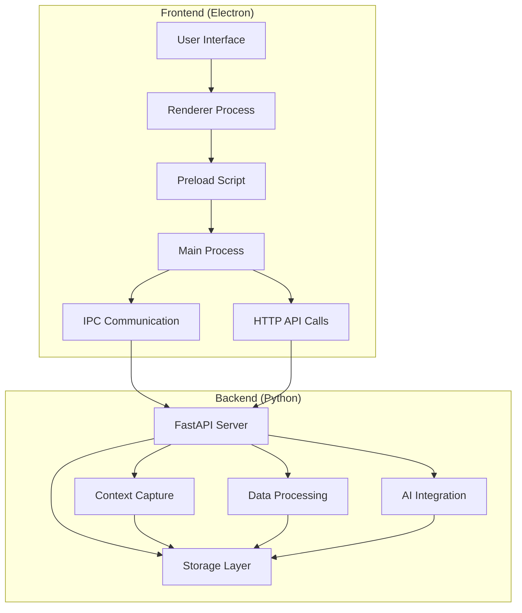
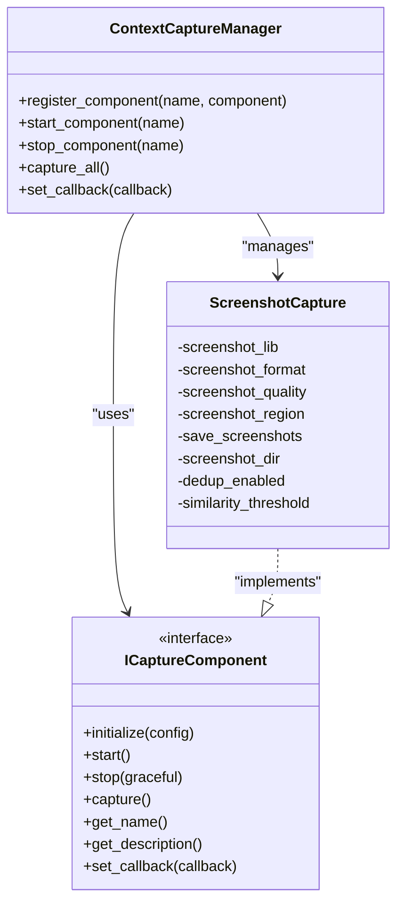
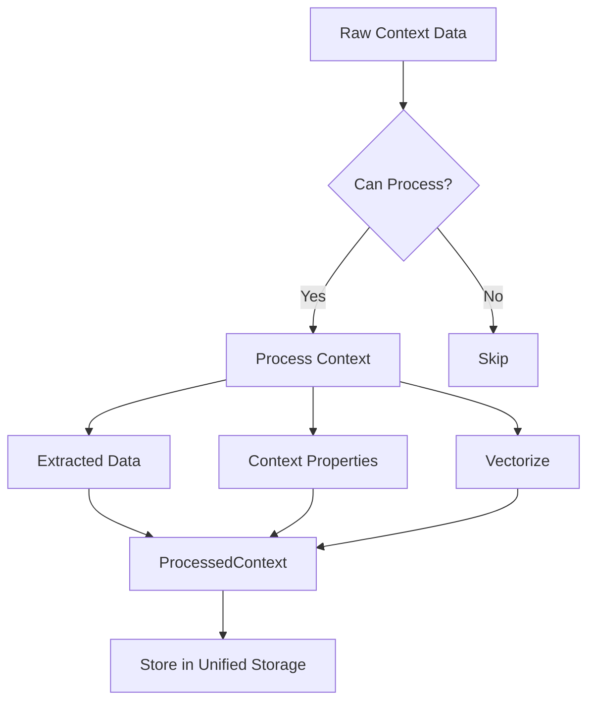
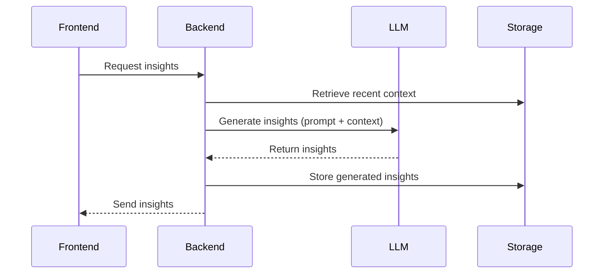
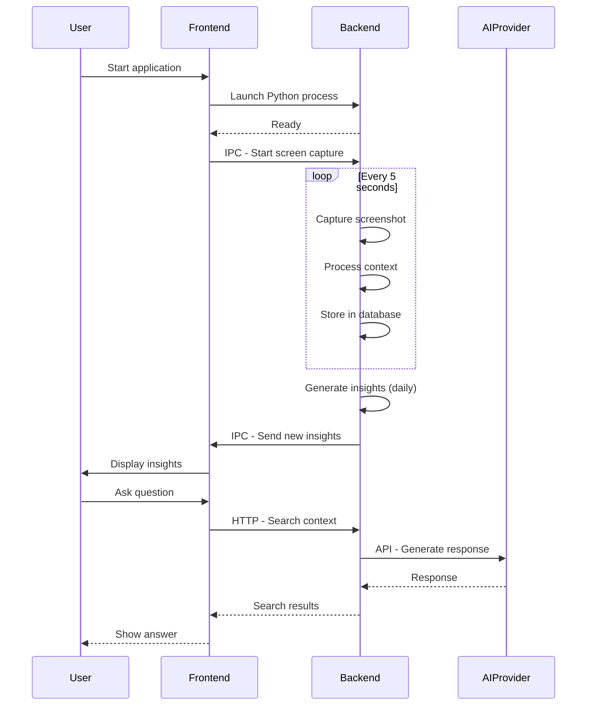

# System Overview

<cite>
**Referenced Files in This Document**   
- [README.md](file://README.md)
- [main.go](file://frontend/src/main/index.ts)
- [ipc.ts](file://frontend/src/main/ipc.ts)
- [index.ts](file://frontend/src/preload/index.ts)
- [api.py](file://opencontext/server/api.py)
- [capture_manager.py](file://opencontext/managers/capture_manager.py)
- [screenshot.py](file://opencontext/context_capture/screenshot.py)
- [base_processor.py](file://opencontext/context_processing/processor/base_processor.py)
- [unified_storage.py](file://opencontext/storage/unified_storage.py)
- [llm_client.py](file://opencontext/llm/llm_client.py)
- [smart_todo_manager.py](file://opencontext/context_consumption/generation/smart_todo_manager.py)
- [context.py](file://opencontext/server/routes/context.py)
</cite>

## Table of Contents
1. [Introduction](#introduction)
2. [Architecture Overview](#architecture-overview)
3. [Core Components](#core-components)
4. [Data Flow and Integration](#data-flow-and-integration)
5. [Use Cases and Workflows](#use-cases-and-workflows)
6. [Architectural Decisions and Trade-offs](#architectural-decisions-and-trade-offs)
7. [Conclusion](#conclusion)

## Introduction

MineContext is an open-source, proactive context-aware AI partner designed to bring clarity and efficiency to work, study, and creative processes. The application functions as a context-aware productivity tool that continuously captures digital activities—such as screen interactions, document edits, and web browsing—and transforms this raw data into AI-powered insights. These insights include daily summaries, actionable to-do lists, contextual tips, and activity records, all delivered proactively to the user.

The system is built on a hybrid desktop application architecture, combining an Electron-based frontend with a Python backend. This design enables rich user interface capabilities while leveraging Python's robust ecosystem for AI and data processing. MineContext prioritizes user privacy through a local-first data model, storing all captured context and processed insights on the user's device by default. It supports integration with various AI providers, including OpenAI and Doubao, and allows users to run fully local models, ensuring data never leaves their local environment.

This document provides a comprehensive system overview, detailing the high-level architecture, core components, integration mechanisms, and key workflows that define the MineContext application.

**Section sources**
- [README.md](file://README.md#L75-L108)

## Architecture Overview

The MineContext application follows a hybrid desktop architecture, consisting of a frontend built with Electron, React, and TypeScript, and a backend implemented in Python using FastAPI. The two components communicate through a combination of Inter-Process Communication (IPC) and HTTP APIs, enabling a secure and efficient separation of concerns.

The frontend is responsible for user interaction, rendering the graphical interface, managing application windows, and handling system-level events such as startup and shutdown. It uses Electron's main process for system integration and the renderer process for the React-based UI. The backend operates as a standalone FastAPI server that runs in the background, handling context capture, data processing, AI integration, and storage operations.

The overall system flow begins with the Electron frontend launching the Python backend as a subprocess. Once the backend is running, the frontend communicates with it via HTTP requests for data retrieval and IPC for real-time events and control commands. This dual-communication model allows for both synchronous API interactions and asynchronous event-driven updates.

**Diagram sources **
- [README.md](file://README.md#L169-L227)
- [main.go](file://frontend/src/main/index.ts#L22-L23)
- [api.py](file://opencontext/server/api.py#L37-L57)

## Core Components

### Context Capture

The context capture component is responsible for collecting raw digital activity data from the user's environment. The primary capture method is periodic screen screenshots, which are taken at configurable intervals (default 5 seconds). The `ScreenshotCapture` class, located in `opencontext/context_capture/screenshot.py`, implements this functionality using the `mss` library for cross-platform screen capture.

The capture process is managed by the `ContextCaptureManager`, which coordinates multiple capture sources. It supports configuration options such as screenshot format (PNG, JPG), quality, region selection, and deduplication based on image similarity. Captured screenshots are stored locally in a designated directory and are processed into structured context data.

**Diagram sources **
- [capture_manager.py](file://opencontext/managers/capture_manager.py#L23-L391)
- [screenshot.py](file://opencontext/context_capture/screenshot.py#L28-L508)
- [capture_interface.py](file://opencontext/interfaces/capture_interface.py#L18-L153)

**Section sources**
- [screenshot.py](file://opencontext/context_capture/screenshot.py#L1-L508)
- [capture_manager.py](file://opencontext/managers/capture_manager.py#L1-L391)

### Data Processing

The data processing component transforms raw captured data into structured, meaningful context. This is achieved through a modular processing pipeline where different processors handle specific types of context. The base class `BaseContextProcessor`, defined in `opencontext/context_processing/processor/base_processor.py`, provides a common interface and functionality for all processors.

Processors are responsible for tasks such as text extraction from documents, entity recognition, keyword extraction, and semantic analysis. They operate on `RawContextProperties` and produce `ProcessedContext` objects that contain enriched metadata and are ready for AI consumption. The processing pipeline supports batch operations and includes statistics tracking for monitoring performance.

**Diagram sources **
- [base_processor.py](file://opencontext/context_processing/processor/base_processor.py#L23-L261)
- [context.py](file://opencontext/models/context.py#L131-L203)

**Section sources**
- [base_processor.py](file://opencontext/context_processing/processor/base_processor.py#L1-L261)

### AI Integration

The AI integration component leverages large language models (LLMs) to generate intelligent insights from processed context data. The system supports multiple LLM providers, including OpenAI and Doubao, through a unified `LLMClient` interface. The client handles both chat completions and embedding generation, with support for streaming responses and tool integration.

AI-powered features include the generation of to-do lists, daily summaries, and contextual tips. For example, the `SmartTodoManager` analyzes recent activities and extracted insights to identify actionable tasks, applying vector-based deduplication to avoid redundant suggestions. The system uses embeddings to enable semantic search and context retrieval, allowing users to query their digital history naturally.

**Diagram sources **
- [llm_client.py](file://opencontext/llm/llm_client.py#L32-L466)
- [smart_todo_manager.py](file://opencontext/context_consumption/generation/smart_todo_manager.py#L46-L505)

**Section sources**
- [llm_client.py](file://opencontext/llm/llm_client.py#L1-L466)
- [smart_todo_manager.py](file://opencontext/context_consumption/generation/smart_todo_manager.py#L1-L505)

### User Interface

The user interface is built with React and TypeScript, running within the Electron framework. It provides a modern, responsive interface for viewing insights, managing captured context, and configuring application settings. The UI is organized into key sections including the home dashboard, screen monitor, settings, and vault management.

The frontend communicates with the backend through a well-defined IPC and HTTP API. The preload script securely exposes Node.js APIs to the renderer process, enabling access to system resources while maintaining security. The UI updates in real-time through event-driven communication, such as receiving notifications when new insights are generated.

**Section sources**
- [README.md](file://README.md#L169-L227)
- [main.go](file://frontend/src/main/index.ts#L1-L348)

## Data Flow and Integration

The integration between the Electron frontend and Python backend is achieved through a combination of IPC and HTTP APIs. IPC is used for real-time events, control commands, and system-level operations, while HTTP is used for data retrieval and complex operations.

When the application starts, the Electron main process launches the Python backend as a subprocess. The frontend then establishes communication through the following channels:

1. **IPC Channels**: Used for commands like starting/stopping screen capture, checking system permissions, and receiving real-time notifications. The `IpcChannel` enum in `@shared/IpcChannel` defines all available IPC endpoints.

2. **HTTP API**: The backend exposes a FastAPI server on a configurable port (default 8765). The frontend makes HTTP requests to endpoints such as `/api/context_types` and `/api/vector_search` to retrieve data and trigger processing.

The `ExpressService` in the frontend also creates an additional Express server to handle AI chat requests, demonstrating the multi-layered communication architecture.

**Diagram sources **
- [ipc.ts](file://frontend/src/main/ipc.ts#L45-L610)
- [index.ts](file://frontend/src/preload/index.ts#L1-L157)
- [api.py](file://opencontext/server/api.py#L37-L57)
- [context.py](file://opencontext/server/routes/context.py#L69-L145)

**Section sources**
- [ipc.ts](file://frontend/src/main/ipc.ts#L1-L610)
- [api.py](file://opencontext/server/api.py#L1-L58)

## Use Cases and Workflows

### Application Startup

When MineContext starts, the Electron main process initializes the application window and services. It then launches the Python backend using `startBackendInBackground`. The backend server starts on the configured port, and the frontend establishes communication through IPC and HTTP. The tray icon is created, and scheduled tasks such as screenshot capture and insight generation are initialized.

### Manual Capture

Users can manually trigger a screenshot capture through the UI. This action sends an IPC message to the main process, which forwards it to the `ScreenshotService`. The service captures the current screen state, saves the image to the local storage directory, and notifies the backend through the capture manager's callback mechanism. The captured context is then processed and stored.

### Proactive Insight Delivery

The system automatically generates insights on a scheduled basis. The `SmartTodoManager` queries recent activities and processed context, combines this with historical data, and uses the LLM to identify actionable tasks. Generated to-dos are stored in the local database and pushed to the frontend via IPC, where they appear on the home dashboard without requiring user interaction.

## Architectural Decisions and Trade-offs

The hybrid Electron-Python architecture was chosen to balance development efficiency, performance, and functionality. Electron provides a robust framework for cross-platform desktop applications with rich UI capabilities, while Python offers superior support for AI/ML libraries and data processing.

Key trade-offs include:

- **Performance**: Running two separate processes (Electron and Python) consumes more system resources than a single-language solution, but enables optimal use of each technology's strengths.
- **Complexity**: The dual-communication model (IPC + HTTP) adds complexity but provides clear separation between real-time events and data operations.
- **Deployment**: Packaging a Python backend with an Electron frontend requires careful handling of dependencies and environment setup, as seen in the build scripts.
- **Privacy**: The local-first design ensures user privacy but limits cloud-based features and synchronization across devices.

The modular, layered architecture promotes maintainability and extensibility, allowing new capture sources, processors, and AI features to be added without disrupting existing functionality.

**Section sources**
- [README.md](file://README.md#L271-L328)
- [main.go](file://frontend/src/main/index.ts#L22-L23)
- [pyproject.toml](file://pyproject.toml#L23-L46)

## Conclusion

MineContext represents a sophisticated context-aware productivity system that bridges the gap between passive activity tracking and proactive AI assistance. By combining an Electron frontend with a Python backend, it delivers a powerful desktop application that captures, processes, and transforms digital activities into actionable insights. The architecture emphasizes user privacy through local data storage while providing flexibility in AI integration. The modular design, clear separation of concerns, and well-defined interfaces make the system maintainable and extensible, positioning it as a robust platform for context-aware computing.