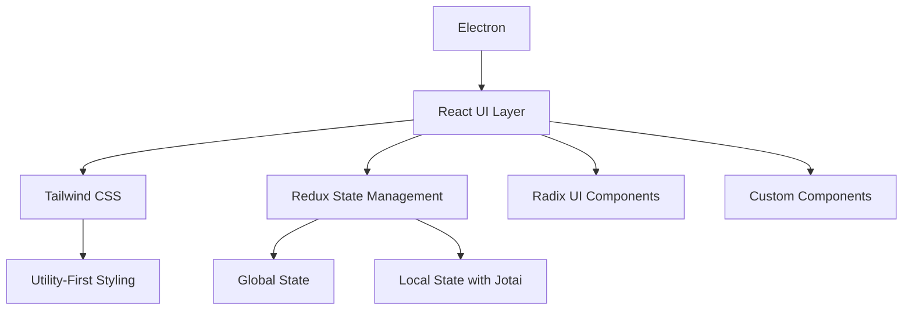
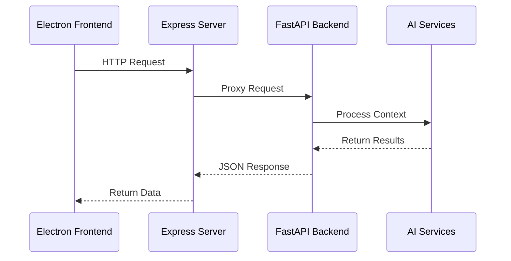
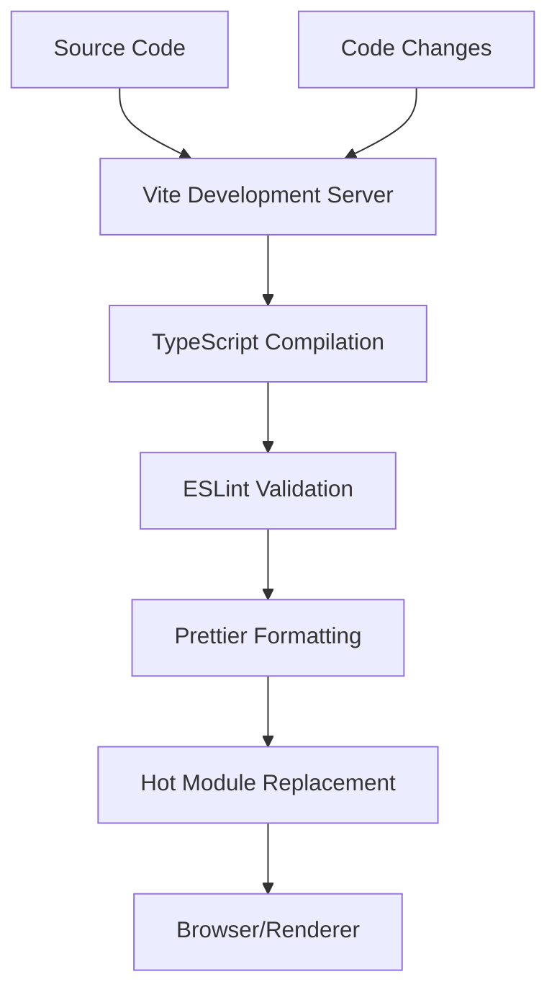
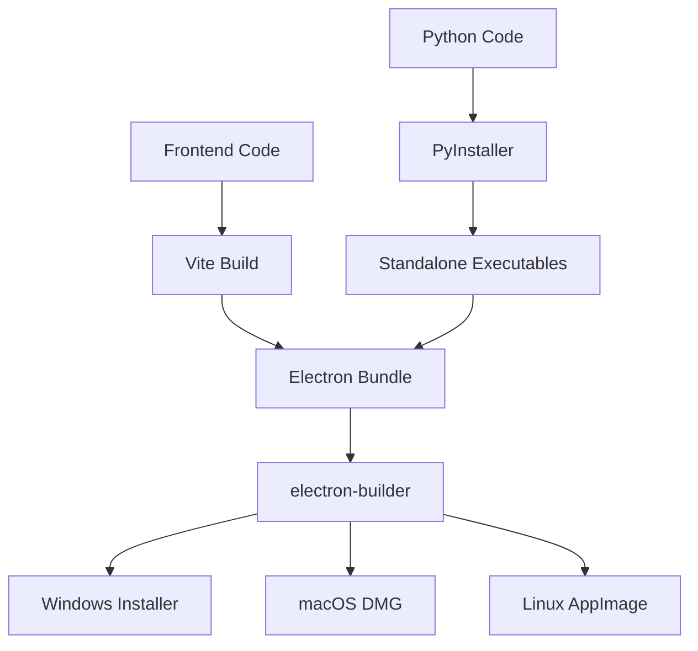
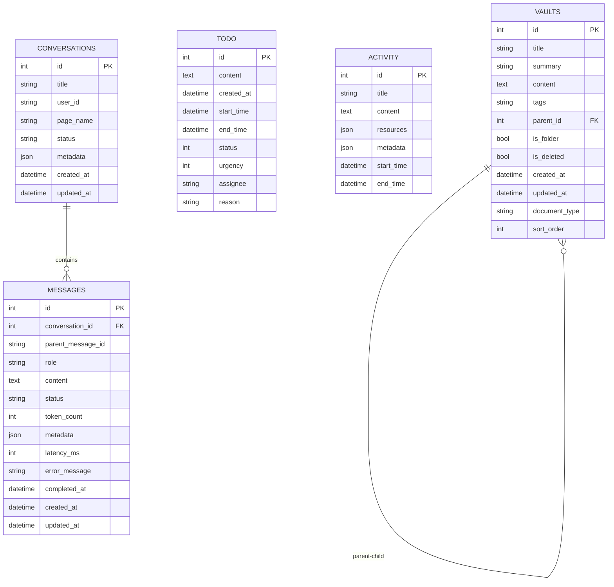

# Technology Stack

<cite>
**Referenced Files in This Document**   
- [package.json](file://package.json)
- [pyproject.toml](file://pyproject.toml)
- [frontend/package.json](file://frontend/package.json)
- [frontend/electron.vite.config.ts](file://frontend/electron.vite.config.ts)
- [frontend/tailwind.config.js](file://frontend/tailwind.config.js)
- [frontend/eslint.config.mjs](file://frontend/eslint.config.mjs)
- [frontend/.prettierrc.yaml](file://frontend/.prettierrc.yaml)
- [frontend/electron-builder.yml](file://frontend/electron-builder.yml)
- [build.sh](file://build.sh)
- [opencontext.spec](file://opencontext.spec)
- [opencontext/config/config_manager.py](file://opencontext/config/config_manager.py)
- [opencontext/storage/backends/sqlite_backend.py](file://opencontext/storage/backends/sqlite_backend.py)
</cite>

## Table of Contents
1. [Introduction](#introduction)
2. [Core Technology Selection](#core-technology-selection)
3. [Frontend Architecture](#frontend-architecture)
4. [Backend Architecture](#backend-architecture)
5. [Development Tools and Workflow](#development-tools-and-workflow)
6. [Build and Packaging System](#build-and-packaging-system)
7. [Data Storage and Management](#data-storage-and-management)
8. [Cross-Platform Compatibility](#cross-platform-compatibility)
9. [Dependency Management](#dependency-management)
10. [Conclusion](#conclusion)

## Introduction

The MineContext application employs a sophisticated hybrid architecture that combines modern frontend technologies with robust Python-based backend processing. This technology stack has been carefully selected to deliver a high-performance, cross-platform desktop application with advanced AI capabilities. The architecture leverages Electron for desktop integration, React with TypeScript for the user interface, and Python with FastAPI for backend services, creating a seamless experience for context-aware AI assistance. This document details the rationale behind each technology choice and how they work together to form a cohesive system.

## Core Technology Selection

The MineContext application's architecture is built on a strategic selection of technologies that balance performance, developer experience, and cross-platform compatibility. The hybrid approach combines Electron's desktop capabilities with React's modern UI framework and Python's extensive AI/ML ecosystem. Electron serves as the foundation for cross-platform desktop deployment, allowing the application to run natively on Windows, macOS, and Linux while maintaining a consistent user experience. React with TypeScript provides a type-safe, component-based UI development environment that enhances code quality and maintainability. Python was chosen for backend processing due to its dominance in the AI and machine learning space, with extensive library support for natural language processing, computer vision, and data analysis tasks.

**Section sources**
- [frontend/package.json](file://frontend/package.json#L2-L8)
- [pyproject.toml](file://pyproject.toml#L1-L21)

## Frontend Architecture

The frontend architecture of MineContext is built on a modern React stack with TypeScript, leveraging Vite as the build tool for rapid development and optimized production builds. The UI layer is implemented using React 19 with TypeScript, providing strong typing and enhanced developer productivity. The application uses Tailwind CSS for styling, enabling utility-first CSS development that promotes consistency and reduces the need for custom CSS files. The component architecture follows a modular design with clear separation between UI components, state management, and business logic.

The frontend employs a sophisticated state management system using Redux with Redux Toolkit for global state and Jotai for local component state. This combination provides a flexible approach to state management that scales well with application complexity. UI components are built using a combination of Radix UI primitives for accessible, unstyled components and custom implementations for application-specific elements. The styling system integrates Tailwind CSS with Less for preprocessing, allowing for both utility-first styling and traditional CSS methodologies.

**Diagram sources**
- [frontend/package.json](file://frontend/package.json#L129-L135)
- [frontend/tailwind.config.js](file://frontend/tailwind.config.js#L1-L26)
- [frontend/electron.vite.config.ts](file://frontend/electron.vite.config.ts#L4-L9)

**Section sources**
- [frontend/package.json](file://frontend/package.json#L129-L146)
- [frontend/tailwind.config.js](file://frontend/tailwind.config.js#L1-L26)
- [frontend/electron.vite.config.ts](file://frontend/electron.vite.config.ts#L4-L9)

## Backend Architecture

The backend architecture of MineContext is built on Python with FastAPI, creating a high-performance, asynchronous service layer for AI processing and data management. FastAPI was selected for its modern, type-annotated approach to API development, automatic OpenAPI documentation generation, and excellent performance characteristics. The backend services handle critical functionality including context capture, AI agent processing, document analysis, and storage operations.

The Python backend exposes RESTful endpoints through FastAPI, which are consumed by the Electron frontend via Express middleware running within the Electron main process. This hybrid approach allows the desktop application to leverage web API patterns while maintaining native desktop capabilities. The backend includes specialized modules for different processing tasks, including context capture (screenshot processing, web link capture), context consumption (AI agent processing, completion services), and context processing (document conversion, chunking, merging).

**Diagram sources**
- [pyproject.toml](file://pyproject.toml#L23-L46)
- [opencontext/server/api.py](file://opencontext/server/api.py)
- [frontend/src/main/services/ExpressService.ts](file://frontend/src/main/services/ExpressService.ts)

**Section sources**
- [pyproject.toml](file://pyproject.toml#L23-L46)
- [opencontext/server/api.py](file://opencontext/server/api.py)
- [frontend/src/main/services/ExpressService.ts](file://frontend/src/main/services/ExpressService.ts)

## Development Tools and Workflow

MineContext employs a comprehensive suite of development tools to ensure code quality, consistency, and developer productivity. The development workflow is centered around Vite for rapid frontend development, with hot module replacement and fast refresh capabilities. ESLint and Prettier are configured with custom rules to enforce code style consistency and catch potential issues early in the development process. The ESLint configuration includes TypeScript support, React hooks rules, and custom rules for import sorting and unused imports.

The development environment is configured with TypeScript for type safety across both frontend and shared code. The TypeScript configuration is split into multiple tsconfig files to support different build targets (node and web). The editor integration is enhanced with .editorconfig and IDE-specific configuration files to ensure consistent formatting across different development environments. The project also includes code inspection tools like CodeInspectorPlugin for debugging and performance analysis during development.

**Diagram sources**
- [frontend/electron.vite.config.ts](file://frontend/electron.vite.config.ts#L1-L84)
- [frontend/eslint.config.mjs](file://frontend/eslint.config.mjs#L1-L129)
- [frontend/.prettierrc.yaml](file://frontend/.prettierrc.yaml#L1-L5)

**Section sources**
- [frontend/electron.vite.config.ts](file://frontend/electron.vite.config.ts#L1-L84)
- [frontend/eslint.config.mjs](file://frontend/eslint.config.mjs#L1-L129)
- [frontend/.prettierrc.yaml](file://frontend/.prettierrc.yaml#L1-L5)

## Build and Packaging System

The build and packaging system for MineContext is designed to create cross-platform desktop applications with embedded Python backend services. The Electron application is packaged using electron-builder, which handles platform-specific packaging requirements for Windows, macOS, and Linux. The build process is orchestrated through npm scripts that coordinate the compilation of both frontend and backend components.

A key aspect of the build system is the integration of Python executables into the Electron application. The build-python.js script compiles Python modules (window_inspector and window_capture) into standalone executables using PyInstaller, which are then bundled with the Electron application. This hybrid approach allows the desktop application to leverage Python's capabilities while maintaining a single executable distribution.

The electron-builder configuration specifies platform-specific settings, including application identifiers, icons, and installation options. For macOS, the configuration includes entitlements for accessing system resources like the camera and microphone. The build process also handles code signing for macOS applications, with support for notarization to meet Apple's security requirements.

**Diagram sources**
- [frontend/electron-builder.yml](file://frontend/electron-builder.yml#L1-L72)
- [frontend/build-python.js](file://frontend/build-python.js#L1-L134)
- [build.sh](file://build.sh#L1-L91)

**Section sources**
- [frontend/electron-builder.yml](file://frontend/electron-builder.yml#L1-L72)
- [frontend/build-python.js](file://frontend/build-python.js#L1-L134)
- [build.sh](file://build.sh#L1-L91)

## Data Storage and Management

MineContext implements a comprehensive data storage system using SQLite as the primary local database, with support for alternative backends like ChromaDB and Qdrant for vector storage. The SQLite backend is implemented as a specialized storage layer that manages various data types including vault documents, to-do items, activity records, and monitoring data. The database schema is designed to support the application's context-aware features, with tables for conversations, messages, and message thinking processes.

The storage architecture follows a layered approach with a unified storage interface that abstracts the underlying storage implementation. This allows the application to potentially support multiple storage backends while maintaining a consistent API for data operations. The SQLite implementation includes comprehensive indexing strategies to optimize query performance for common access patterns, such as retrieving vault documents by creation time or filtering to-do items by status and urgency.

The data model includes support for hierarchical organization of vault documents, with parent-child relationships and folder structures. Activity records are stored with rich metadata including resources and contextual information, enabling the AI system to analyze user behavior patterns. The monitoring tables track token usage, stage timing, and data statistics, providing insights into application performance and usage patterns.

**Diagram sources**
- [opencontext/storage/backends/sqlite_backend.py](file://opencontext/storage/backends/sqlite_backend.py#L66-L341)
- [opencontext/storage/base_storage.py](file://opencontext/storage/base_storage.py)

**Section sources**
- [opencontext/storage/backends/sqlite_backend.py](file://opencontext/storage/backends/sqlite_backend.py#L1-L800)
- [opencontext/storage/base_storage.py](file://opencontext/storage/base_storage.py)

## Cross-Platform Compatibility

The MineContext application is designed for cross-platform compatibility across Windows, macOS, and Linux operating systems. The Electron framework provides the foundation for this compatibility, abstracting platform-specific differences in the desktop environment. However, the application also includes platform-specific code to leverage native capabilities where appropriate.

For macOS, the application includes specialized Python modules (window_inspector and window_capture) that use the Quartz framework to capture window information and screenshots. These modules are compiled into standalone executables and bundled with the application, but are only executed on macOS systems. The build process includes conditional logic to skip these components on non-macOS platforms.

The configuration system supports platform-specific settings through environment variable substitution and user settings files. The application can adapt its behavior based on the underlying operating system, such as using different file system paths or system APIs. The UI also adapts to platform conventions, such as menu bar placement and keyboard shortcuts.

The packaging process generates platform-specific installers: MSI for Windows, DMG for macOS, and AppImage for Linux. Each platform has specific requirements for code signing and distribution, which are handled through the build configuration. For macOS, the application supports ad-hoc signing and notarization to meet Apple's security requirements.

**Section sources**
- [frontend/build-python.js](file://frontend/build-python.js#L113-L118)
- [build.sh](file://build.sh#L60-L65)
- [frontend/electron-builder.yml](file://frontend/electron-builder.yml#L22-L50)

## Dependency Management

MineContext employs a dual dependency management system to handle both JavaScript/TypeScript and Python dependencies. For the frontend and Electron components, the application uses pnpm as the package manager, as indicated by the pnpm-lock.yaml file. pnpm provides efficient dependency management with a content-addressable store that reduces disk usage and improves installation speed.

For Python dependencies, the project uses uv as the preferred dependency manager, with fallback to pip. The build.sh script checks for the presence of uv and uses it to install dependencies if available, otherwise falling back to pip. This approach ensures compatibility across different development environments while taking advantage of uv's improved performance and dependency resolution when available.

The Python dependencies are specified in pyproject.toml using the modern Poetry-style format, which provides a clear and structured way to define project metadata and dependencies. The dependencies include essential packages for AI processing (openai, chromadb, qdrant-client), web services (fastapi, uvicorn), and system integration (mss, pillow, pypdfium2).

The development dependencies include tools for code quality (black, isort, pre-commit) that help maintain consistent code style across the Python codebase. The configuration for these tools is included in pyproject.toml, providing a centralized location for development tool configuration.

**Section sources**
- [pyproject.toml](file://pyproject.toml#L23-L53)
- [build.sh](file://build.sh#L17-L26)
- [package.json](file://package.json#L1-L6)

## Conclusion

The MineContext application's technology stack represents a thoughtful integration of modern web technologies with powerful Python-based AI processing capabilities. The hybrid architecture successfully combines Electron's cross-platform desktop capabilities with React's modern UI framework and Python's extensive machine learning ecosystem. This combination enables the application to deliver advanced context-aware AI features while maintaining a responsive and intuitive user interface.

The development workflow is supported by a comprehensive set of tools that ensure code quality and developer productivity, from Vite's rapid development server to ESLint and Prettier's code quality enforcement. The build and packaging system effectively integrates JavaScript and Python components into a single distributable application, with platform-specific optimizations for each target operating system.

The data storage architecture provides a robust foundation for the application's context-aware features, with SQLite serving as a reliable local database and support for vector databases enabling advanced AI capabilities. The modular design and clear separation of concerns make the application extensible and maintainable, positioning it well for future enhancements and feature additions.

This technology stack demonstrates how modern desktop applications can leverage the strengths of multiple programming ecosystems to deliver sophisticated functionality that would be difficult to achieve with a single technology stack.