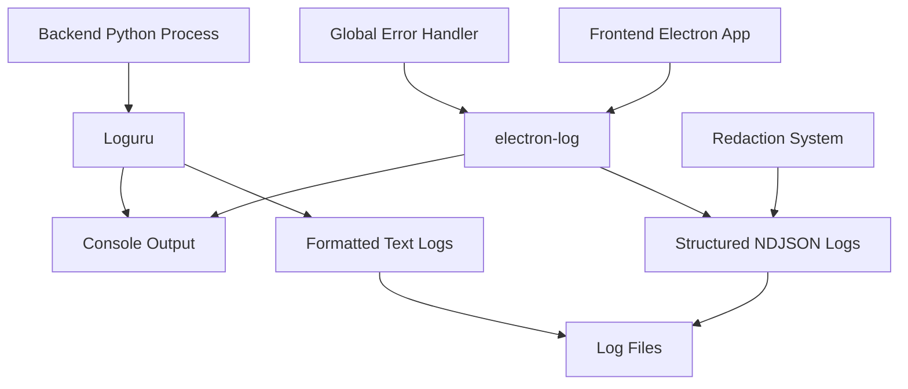
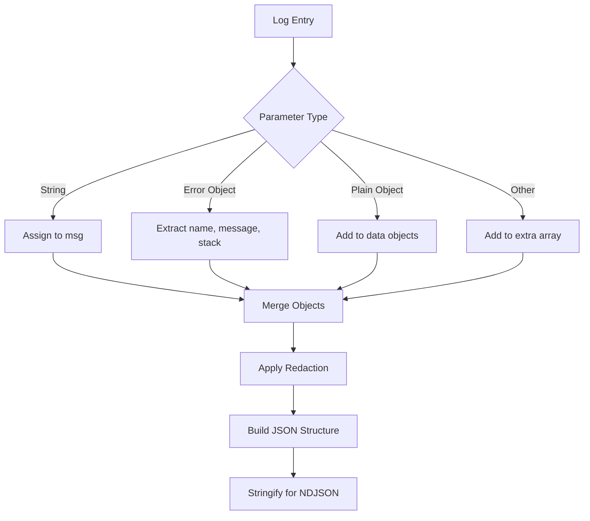
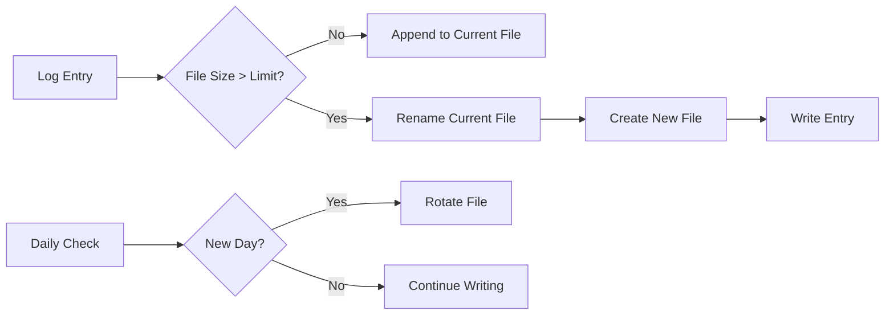

# Logging System

<cite>
**Referenced Files in This Document**   
- [init.ts](file://frontend/packages/shared/logger/init.ts)
- [main.ts](file://frontend/packages/shared/logger/main.ts)
- [renderer.ts](file://frontend/packages/shared/logger/renderer.ts)
- [logger.py](file://opencontext/utils/logger.py)
- [logging_utils.py](file://opencontext/utils/logging_utils.py)
- [redact.ts](file://frontend/packages/shared/logger/redact.ts)
- [bootstrap.ts](file://frontend/src/main/bootstrap.ts)
- [ipc.ts](file://frontend/src/main/ipc.ts)
</cite>

## Table of Contents
1. [Introduction](#introduction)
2. [Core Architecture](#core-architecture)
3. [Log Levels and Usage Patterns](#log-levels-and-usage-patterns)
4. [Log Formatting and Structure](#log-formatting-and-structure)
5. [Log Storage and Rotation](#log-storage-and-rotation)
6. [Cross-Process Logging Integration](#cross-process-logging-integration)
7. [Sensitive Data Redaction](#sensitive-data-redaction)
8. [Error Handling and Global Catching](#error-handling-and-global-catching)
9. [Environment-Specific Configuration](#environment-specific-configuration)
10. [Log Path Management](#log-path-management)
11. [Backend Python Logging](#backend-python-logging)
12. [Frontend Electron Logging](#frontend-electron-logging)
13. [Example Log Entries](#example-log-entries)
14. [Debugging and Verbose Logging](#debugging-and-verbose-logging)
15. [Log Filtering and Analysis](#log-filtering-and-analysis)

## Introduction
The MineContext logging system provides comprehensive monitoring and debugging capabilities across both frontend Electron and backend Python processes. The system is designed with structured logging principles, security considerations, and cross-platform compatibility in mind. It enables detailed tracking of application behavior, error diagnosis, and performance monitoring through a unified logging framework that spans the entire application stack.

**Section sources**
- [init.ts](file://frontend/packages/shared/logger/init.ts#L1-L114)
- [logger.py](file://opencontext/utils/logger.py#L1-L85)

## Core Architecture
The logging system in MineContext follows a distributed architecture with separate but coordinated logging mechanisms for the frontend Electron application and backend Python processes. The frontend utilizes electron-log for comprehensive logging across main and renderer processes, while the backend employs Loguru for Python-based logging. Both systems are initialized early in the application lifecycle and provide structured, machine-readable output.

The architecture features automatic IPC (Inter-Process Communication) handling, allowing seamless log propagation between Electron's main and renderer processes. This ensures that logs from all parts of the application are captured and stored consistently. The system also implements global error catching to prevent application crashes and ensure that all exceptions are properly logged.



**Diagram sources**
- [init.ts](file://frontend/packages/shared/logger/init.ts#L23-L114)
- [logger.py](file://opencontext/utils/logger.py#L19-L79)

**Section sources**
- [init.ts](file://frontend/packages/shared/logger/init.ts#L1-L114)
- [logger.py](file://opencontext/utils/logger.py#L1-L85)

## Log Levels and Usage Patterns
The logging system implements a hierarchical level system that allows for granular control over log verbosity and severity. The frontend and backend systems use compatible but slightly different level naming conventions to accommodate their respective frameworks.

Frontend log levels include:
- **ERROR**: Critical issues that prevent normal operation
- **WARN**: Potential problems that don't disrupt functionality
- **INFO**: General operational information and milestones
- **DEBUG**: Detailed information for debugging purposes
- **SILLY**: Extremely verbose logging for deep debugging

Backend Python processes use standard Python logging levels (DEBUG, INFO, WARNING, ERROR, CRITICAL) through the Loguru library. The system automatically maps between these levels when necessary for cross-process communication.

Usage patterns vary by component:
- Main process components use INFO for startup/shutdown events
- Renderer processes log UI interactions at INFO level
- Background tasks use DEBUG for periodic status updates
- Error conditions are logged at ERROR level with full stack traces
- Security-sensitive operations use WARN for suspicious activities

**Section sources**
- [main.ts](file://frontend/packages/shared/logger/main.ts#L6-L7)
- [renderer.ts](file://frontend/packages/shared/logger/renderer.ts#L6-L7)
- [logger.py](file://opencontext/utils/logger.py#L38-L39)
- [config/logger.ts](file://frontend/packages/shared/config/logger.ts#L15-L23)

## Log Formatting and Structure
The frontend logging system employs a structured NDJSON (Newline Delimited JSON) format for all log entries, enabling easy parsing and analysis. Each log entry is a single-line JSON object containing standardized fields:

- **t**: Timestamp in ISO 8601 format with millisecond precision
- **level**: Log severity level (error, warn, info, debug, silly)
- **scope**: Logical grouping that identifies the source module
- **msg**: Human-readable message string
- **data**: Additional structured data, including redacted sensitive information

The backend Python logging uses a formatted text approach with color-coded console output and plain text file output. The format includes timestamp, log level, and message, with structured data included as JSON when appropriate.

The structured format enables powerful log analysis capabilities, allowing for filtering, aggregation, and correlation of events across different components and time periods.



**Diagram sources**
- [init.ts](file://frontend/packages/shared/logger/init.ts#L67-L113)
- [redact.ts](file://frontend/packages/shared/logger/redact.ts#L6-L12)

**Section sources**
- [init.ts](file://frontend/packages/shared/logger/init.ts#L63-L113)
- [logger.py](file://opencontext/utils/logger.py#L40-L42)

## Log Storage and Rotation
The logging system implements a robust storage and rotation strategy to balance accessibility with disk space efficiency. Frontend logs are stored in a dedicated directory within the user's data path, with separate files created for each process type and date.

Frontend log rotation is configured with:
- Maximum file size of 50MB
- Daily file rotation based on date
- Automatic creation of log directory if missing
- Separate files for main and renderer processes

Backend Python logs use a different rotation strategy:
- Maximum file size of 100MB
- Daily file rotation with date-stamped filenames
- Retention of only the 2 most recent files
- Configurable log path with automatic directory creation

The system automatically manages log file locations based on the execution environment (development vs. production), ensuring that logs are stored in appropriate locations according to platform conventions.



**Diagram sources**
- [init.ts](file://frontend/packages/shared/logger/init.ts#L38-L50)
- [logger.py](file://opencontext/utils/logger.py#L58-L67)

**Section sources**
- [init.ts](file://frontend/packages/shared/logger/init.ts#L36-L50)
- [logger.py](file://opencontext/utils/logger.py#L58-L67)

## Cross-Process Logging Integration
The logging system seamlessly integrates logging across Electron's main and renderer processes through electron-log's automatic IPC capabilities. When `log.initialize()` is called in the main process, it establishes communication channels that allow renderer process logs to be forwarded to the main process for unified handling.

This integration enables:
- Consistent log formatting across all processes
- Centralized log file management
- Unified error handling and exception catching
- Coordinated log level settings
- Shared configuration parameters

The system automatically prefixes log entries with process-specific identifiers ("main" or "renderer") and can include additional context such as window identifiers when available. This allows for clear differentiation of log sources while maintaining a unified logging experience.

IPC channels are also used to expose logging functionality and log-related information to the frontend, such as retrieving the log path for display in diagnostic tools.

**Section sources**
- [init.ts](file://frontend/packages/shared/logger/init.ts#L25-L26)
- [ipc.ts](file://frontend/src/main/ipc.ts#L70)
- [IpcChannel.ts](file://frontend/packages/shared/IpcChannel.ts#L45)

## Sensitive Data Redaction
The logging system includes a built-in redaction mechanism to protect sensitive information from being written to log files. The redaction function automatically identifies and masks common types of sensitive data before logs are formatted and written to disk.

Redacted fields include:
- Passwords (any property named "password")
- Authentication tokens (any property named "token")
- Authorization headers (headers.authorization)

The redaction process occurs within the logging hook, ensuring that sensitive data is never written to logs in plain text. This provides a critical security layer that helps prevent accidental exposure of credentials and other sensitive information through log files.

The redaction system is implemented as a simple but effective function that recursively processes log data, replacing sensitive values with asterisks while preserving the overall structure of the logged objects.

**Section sources**
- [redact.ts](file://frontend/packages/shared/logger/redact.ts#L6-L12)
- [init.ts](file://frontend/packages/shared/logger/init.ts#L97-L98)

## Error Handling and Global Catching
The logging system implements comprehensive error handling to ensure that all application errors are properly captured and recorded. This includes both explicit error logging through the logging API and automatic catching of unhandled exceptions.

Global error handlers are registered for:
- Uncaught exceptions in the main process
- Unhandled promise rejections
- Critical system events

When an unhandled exception occurs, the system automatically logs the error with full stack trace information at the ERROR level, helping developers diagnose issues even when they cause application crashes. This safety net ensures that no critical error goes unrecorded, providing valuable diagnostic information for troubleshooting.

The error handling system is initialized during the logging system setup and remains active for the lifetime of the application.

**Section sources**
- [init.ts](file://frontend/packages/shared/logger/init.ts#L56-L61)

## Environment-Specific Configuration
The logging system adapts its behavior based on the execution environment, providing different configurations for development and production scenarios.

In development mode:
- Console logging level is set to DEBUG for maximum visibility
- Console format includes more detailed timing information
- Log files are stored in a local "backend" directory for easy access
- More verbose output to aid debugging

In production mode:
- Console logging level is reduced to WARN to minimize noise
- Console format includes dates for better temporal context
- Log files are stored in the system's standard user data location
- File logging level is set to INFO for balanced detail

The system automatically detects the environment based on NODE_ENV and Electron's packaging status, ensuring appropriate configuration without manual intervention.

**Section sources**
- [init.ts](file://frontend/packages/shared/logger/init.ts#L27-L38)

## Log Path Management
The logging system implements a sophisticated path management strategy that accounts for cross-platform differences and deployment scenarios. Log file locations are determined dynamically based on the operating system and execution context.

On different platforms:
- **Windows**: Logs stored in %APPDATA%\MineContext\frontend-logs\
- **macOS**: Logs stored in ~/Library/Application Support/MineContext/frontend-logs/
- **Linux**: Logs stored in ~/.config/MineContext/frontend-logs/

The system also handles special cases such as portable installations and development environments, adjusting paths accordingly. For development, logs are stored in a local "backend" directory to facilitate easy access and cleanup.

Path resolution is handled by Electron's app.getPath('userData') method, ensuring compliance with platform-specific conventions for user data storage.

**Section sources**
- [init.ts](file://frontend/packages/shared/logger/init.ts#L45-L49)
- [ipc.ts](file://frontend/src/main/ipc.ts#L70)

## Backend Python Logging
The backend Python processes use Loguru as the logging framework, providing a modern and feature-rich logging experience. The LogManager class centralizes logging configuration and provides a consistent interface for all Python components.

Key features of the backend logging system:
- Configurable log levels through the "level" parameter
- Colorized console output for improved readability
- Automatic file rotation based on size
- Limited file retention to conserve disk space
- UTF-8 encoding for international character support

The logging system is initialized through the setup_logging function, which configures both console and file handlers according to the application's configuration. This ensures that backend processes generate logs that are consistent with the overall application logging strategy.

Python components import and use the global logger instance, which is configured during application startup.

**Section sources**
- [logger.py](file://opencontext/utils/logger.py#L19-L79)
- [logging_utils.py](file://opencontext/utils/logging_utils.py#L15-L23)

## Frontend Electron Logging
The frontend Electron application uses electron-log as its primary logging framework, leveraging its built-in Electron integration and advanced features. The logging system is initialized in the main process through the initLog function, which configures all aspects of logging behavior.

Key initialization steps include:
- Calling log.initialize() to enable IPC and other features
- Configuring console and file transport levels
- Setting up the NDJSON formatting hook
- Registering global error handlers
- Establishing dynamic log file paths

The system provides separate logger instances for the main and renderer processes, with appropriate scoping to identify the source of each log entry. Developers can create scoped loggers with meaningful names to provide context for log entries.

The frontend logging system is designed to be both powerful and easy to use, requiring minimal configuration while providing comprehensive logging capabilities.

**Section sources**
- [init.ts](file://frontend/packages/shared/logger/init.ts#L23-L114)
- [main.ts](file://frontend/packages/shared/logger/main.ts#L12-L14)
- [renderer.ts](file://frontend/packages/shared/logger/renderer.ts#L12-L14)

## Example Log Entries
The logging system generates structured entries that follow consistent patterns across the application. Below are examples of typical log entries for common operations:

**Context Capture Event:**
```json
{"t":"2025-01-15 14:30:25.123","level":"info","scope":"main - context-capture","msg":"Captured screenshot","data":{"sourceId":"window-123","batchTime":"2025-01-15T14:30:25Z"}}
```

**AI Processing Event:**
```json
{"t":"2025-01-15 14:31:10.456","level":"debug","scope":"renderer - ai-assistant","msg":"Processing user query","data":{"queryLength":45,"model":"gpt-4"}}
```

**System Event (Startup):**
```json
{"t":"2025-01-15 09:15:30.789","level":"info","scope":"[main]","msg":"Application started","data":{"version":"1.2.0","platform":"darwin","arch":"x64"}}
```

**Error Condition:**
```json
{"t":"2025-01-15 14:32:05.234","level":"error","scope":"main - database","msg":"Failed to connect to database","data":{"error":{"name":"ConnectionError","message":"Connection timeout","stack":"..."}}}
```

These examples demonstrate the consistent structure and rich contextual information provided by the logging system.

**Section sources**
- [init.ts](file://frontend/packages/shared/logger/init.ts#L100-L106)
- [logger.py](file://opencontext/utils/logger.py#L41-L42)

## Debugging and Verbose Logging
The logging system supports verbose debugging through environment-based configuration and runtime controls. In development environments, the system automatically enables DEBUG level logging to console, providing maximum visibility into application behavior.

To enable verbose logging:
- Set NODE_ENV=development for development mode
- Use command-line arguments to override log levels
- Configure specific components for detailed logging

The system also supports runtime log level adjustments through configuration files or API calls, allowing for dynamic control of logging verbosity without restarting the application.

For deep debugging, the SILLY log level can be enabled to capture extremely detailed information about application state and execution flow. This is particularly useful for diagnosing complex issues that are difficult to reproduce.

**Section sources**
- [init.ts](file://frontend/packages/shared/logger/init.ts#L30-L31)
- [logger.py](file://opencontext/utils/logger.py#L38)

## Log Filtering and Analysis
The structured NDJSON format used by the frontend logging system enables powerful filtering and analysis capabilities. Logs can be easily parsed and queried using standard JSON processing tools and log analysis platforms.

Common filtering approaches include:
- Filtering by log level (e.g., show only ERROR and WARN entries)
- Filtering by scope/component (e.g., show only database-related logs)
- Time-based filtering (e.g., show logs from the last hour)
- Content-based filtering (e.g., show logs containing specific keywords)

The inclusion of timestamps with millisecond precision allows for precise correlation of events across different components. The structured data field enables filtering based on specific properties of logged objects, making it possible to identify patterns and anomalies in application behavior.

For backend Python logs, similar analysis can be performed using text processing tools, with the structured message format facilitating parsing and extraction of relevant information.

**Section sources**
- [init.ts](file://frontend/packages/shared/logger/init.ts#L100-L106)
- [logger.py](file://opencontext/utils/logger.py#L58-L59)