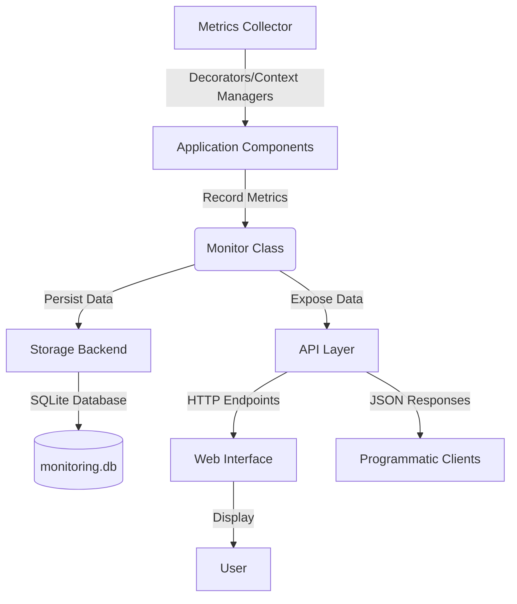
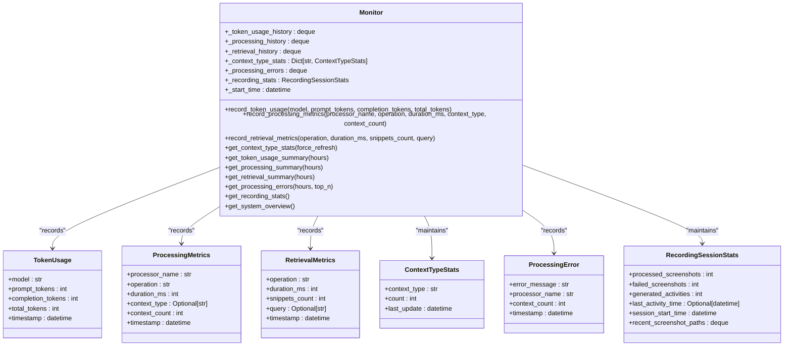
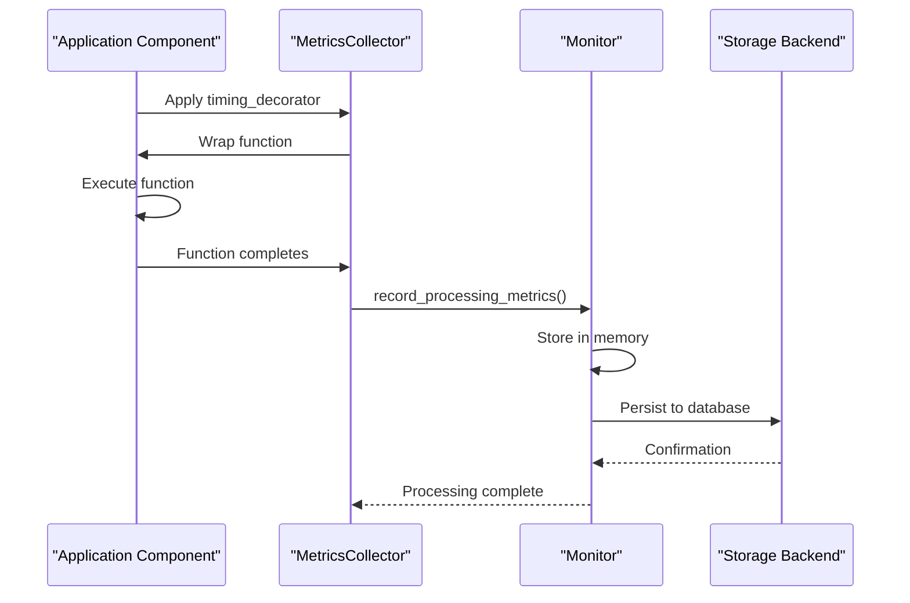
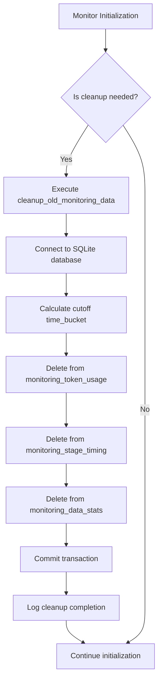
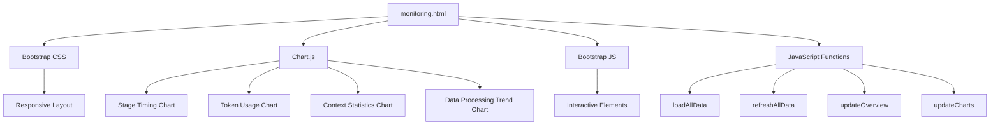

# Monitoring and Metrics Collection

<cite>
**Referenced Files in This Document**   
- [monitor.py](file://opencontext/monitoring/monitor.py)
- [metrics_collector.py](file://opencontext/monitoring/metrics_collector.py)
- [monitoring.py](file://opencontext/server/routes/monitoring.py)
- [monitoring.html](file://opencontext/web/templates/monitoring.html)
- [sqlite_backend.py](file://opencontext/storage/backends/sqlite_backend.py)
- [global_storage.py](file://opencontext/storage/global_storage.py)
- [unified_storage.py](file://opencontext/storage/unified_storage.py)
</cite>

## Table of Contents
1. [Introduction](#introduction)
2. [Monitoring Architecture](#monitoring-architecture)
3. [Metrics Collection System](#metrics-collection-system)
4. [Monitoring API Endpoints](#monitoring-api-endpoints)
5. [Data Storage and Persistence](#data-storage-and-persistence)
6. [Web Interface and Visualization](#web-interface-and-visualization)
7. [Programmatic Access](#programmatic-access)
8. [Anomaly Detection and Troubleshooting](#anomaly-detection-and-troubleshooting)
9. [Security Considerations](#security-considerations)
10. [Conclusion](#conclusion)

## Introduction

The MineContext monitoring and metrics collection system provides comprehensive insights into application performance, resource usage, and system health. This system enables developers and administrators to track key performance indicators, identify bottlenecks, and troubleshoot issues effectively. The monitoring subsystem collects various metrics including CPU and memory usage (indirectly through processing metrics), AI processing latency, database operations, and system health indicators.

The architecture is built around a centralized Monitor class that aggregates system data from various components throughout the application. Metrics are exposed through a dedicated /monitoring API endpoint with a well-defined JSON response structure, allowing both programmatic access and visualization through a web interface. The system is designed to be extensible, with multiple collection methods including decorators, context managers, and direct method calls.

This documentation provides a detailed explanation of the monitoring subsystem, covering its architecture, metrics collection mechanisms, API endpoints, data storage, visualization capabilities, and security considerations.

## Monitoring Architecture

The monitoring architecture in MineContext follows a modular design with clear separation of concerns between data collection, aggregation, storage, and presentation layers. At the core of the system is the Monitor class, which serves as the central aggregation point for all system metrics. This class maintains in-memory data structures for recent metrics while also persisting data to a persistent storage backend for long-term analysis.

The architecture can be visualized as a multi-layered system where various components interact with the Monitor through different interfaces. The primary components include:

- **Monitor Class**: The central component responsible for collecting, aggregating, and managing system metrics
- **Metrics Collector**: A utility class that provides decorators and context managers for automatic metric collection
- **Storage Backend**: The persistence layer that stores monitoring data in a SQLite database
- **API Layer**: The interface that exposes monitoring data through REST endpoints
- **Web Interface**: The frontend visualization layer that presents monitoring data to users



**Diagram sources**
- [monitor.py](file://opencontext/monitoring/monitor.py)
- [metrics_collector.py](file://opencontext/monitoring/metrics_collector.py)
- [monitoring.py](file://opencontext/server/routes/monitoring.py)
- [sqlite_backend.py](file://opencontext/storage/backends/sqlite_backend.py)

**Section sources**
- [monitor.py](file://opencontext/monitoring/monitor.py)
- [metrics_collector.py](file://opencontext/monitoring/metrics_collector.py)

## Metrics Collection System

The metrics collection system in MineContext is designed to capture various performance indicators and system health metrics through multiple mechanisms. The system collects data on token usage, processing performance, retrieval operations, context type statistics, and processing errors.

### Monitor Class

The Monitor class is the central component responsible for collecting and aggregating system data. It maintains several data structures to track different types of metrics:

- **Token Usage History**: Tracks token consumption by different AI models
- **Processing Performance History**: Records the duration of various processing operations
- **Retrieval Performance History**: Measures the performance of data retrieval operations
- **Context Type Statistics**: Maintains counts of different context types
- **Processing Errors**: Records errors that occur during processing
- **Recording Session Statistics**: Tracks statistics for the current recording session

The Monitor class provides methods to record different types of metrics and retrieve aggregated summaries. It uses thread-safe operations with RLock to ensure data consistency in a multi-threaded environment.



**Diagram sources**
- [monitor.py](file://opencontext/monitoring/monitor.py#L24-L87)

**Section sources**
- [monitor.py](file://opencontext/monitoring/monitor.py#L89-L800)

### Metrics Collection Methods

The system provides multiple methods for collecting metrics, allowing flexibility in how data is captured:

1. **Direct Method Calls**: Components can directly call methods on the Monitor instance to record metrics
2. **Global Convenience Functions**: Global functions provide simplified access to common monitoring operations
3. **Decorators**: The MetricsCollector class provides decorators for automatic timing of functions
4. **Context Managers**: Context managers allow for manual timing of code blocks

The MetricsCollector class offers several utilities for automatic metric collection:

- **timing_decorator**: A decorator that automatically measures the execution time of a function and records processing metrics
- **retrieval_timing_decorator**: A decorator specifically designed for retrieval operations that also captures the number of snippets returned
- **manual_timing_context**: A context manager for manually timing code blocks
- **manual_retrieval_timing_context**: A context manager for manually timing retrieval operations

These collection methods abstract the complexity of metric collection, allowing developers to focus on business logic while still capturing valuable performance data.



**Diagram sources**
- [metrics_collector.py](file://opencontext/monitoring/metrics_collector.py#L21-L208)
- [monitor.py](file://opencontext/monitoring/monitor.py#L166-L189)

**Section sources**
- [metrics_collector.py](file://opencontext/monitoring/metrics_collector.py#L21-L208)

## Monitoring API Endpoints

The monitoring system exposes its data through a set of REST API endpoints under the /api/monitoring prefix. These endpoints provide structured JSON responses that can be consumed by both the web interface and programmatic clients.

### API Endpoint Overview

The following table summarizes the available monitoring API endpoints:

| Endpoint | Method | Description | Parameters | Response Structure |
|---------|--------|-------------|------------|-------------------|
| /api/monitoring/overview | GET | Get system monitoring overview | None | System uptime, context types, token usage, processing metrics, stage timing, data stats |
| /api/monitoring/context-types | GET | Get context type statistics | force_refresh (bool) | Count of records for each context type |
| /api/monitoring/token-usage | GET | Get token usage details | hours (int, 1-168) | Token usage summary by model, total tokens, prompt tokens, completion tokens |
| /api/monitoring/processing | GET | Get processor performance metrics | hours (int, 1-168) | Processing performance summary by processor and context type |
| /api/monitoring/stage-timing | GET | Get stage timing metrics | hours (int, 1-168) | Average duration of processing stages, success/error counts |
| /api/monitoring/data-stats | GET | Get data statistics | hours (int, 1-168) | Counts of screenshots, documents, and contexts processed |
| /api/monitoring/data-stats-trend | GET | Get data statistics trend | hours (int, 1-168) | Time series data showing processing trends |
| /api/monitoring/data-stats-range | GET | Get data statistics by custom range | start_time, end_time (datetime) | Data statistics for a custom time range |
| /api/monitoring/refresh-context-stats | POST | Refresh context type statistics | None | Refreshed context type statistics |
| /api/monitoring/health | GET | Monitoring system health check | None | Monitor active status and uptime |
| /api/monitoring/processing-errors | GET | Get processing errors | hours (int, 1-24), top (int, 1-20) | Top processing errors with timestamps and details |
| /api/monitoring/recording-stats | GET | Get recording session statistics | None | Current recording session statistics |
| /api/monitoring/recording-stats/reset | POST | Reset recording statistics | None | Confirmation of reset |

### JSON Response Structure

The monitoring API endpoints return a consistent JSON response structure with the following format:

```json
{
  "success": true,
  "data": { /* endpoint-specific data */ }
}
```

For endpoints that retrieve processing errors, the response includes additional metadata:

```json
{
  "success": true,
  "data": {
    "errors": [
      {
        "error_message": "string",
        "processor_name": "string",
        "context_count": "integer",
        "timestamp": "ISO datetime string"
      }
    ],
    "total_errors": "integer",
    "time_range_hours": "integer"
  }
}
```

The system overview endpoint returns a comprehensive response containing multiple metric categories:

```json
{
  "success": true,
  "data": {
    "uptime_seconds": "integer",
    "uptime_formatted": "string",
    "context_types": {
      "context_type": "count"
    },
    "token_usage_24h": { /* token usage summary */ },
    "token_usage_7d": { /* token usage summary */ },
    "processing": { /* processing summary */ },
    "stage_timing": { /* stage timing summary */ },
    "data_stats_24h": { /* data statistics summary */ },
    "last_updated": "ISO datetime string"
  }
}
```

**Section sources**
- [monitoring.py](file://opencontext/server/routes/monitoring.py#L20-L245)

## Data Storage and Persistence

The monitoring system persists collected metrics to a SQLite database for long-term storage and analysis. The data storage architecture is designed to balance performance with data retention requirements.

### Database Schema

The monitoring data is stored in several tables within the SQLite database:

- **monitoring_token_usage**: Tracks token consumption by AI models
- **monitoring_stage_timing**: Records the duration of processing stages and LLM API calls
- **monitoring_data_stats**: Tracks counts of processed data types (screenshots, documents, contexts)

Each table uses a time_bucket column to group data by hour, which enables efficient querying and aggregation. The time_bucket follows the format "YYYY-MM-DD HH:00:00" to represent the start of each hour.

The monitoring_token_usage table schema:
- id: Primary key
- time_bucket: Hourly time bucket (TEXT)
- model: AI model name (TEXT)
- prompt_tokens: Number of prompt tokens (INTEGER)
- completion_tokens: Number of completion tokens (INTEGER)
- total_tokens: Total tokens (INTEGER)
- created_at: Timestamp (DATETIME)
- UNIQUE constraint on (time_bucket, model)

The monitoring_stage_timing table schema:
- id: Primary key
- time_bucket: Hourly time bucket (TEXT)
- stage_name: Name of the processing stage (TEXT)
- count: Number of operations (INTEGER)
- total_duration_ms: Total duration in milliseconds (INTEGER)
- min_duration_ms: Minimum duration in milliseconds (INTEGER)
- max_duration_ms: Maximum duration in milliseconds (INTEGER)
- avg_duration_ms: Average duration in milliseconds (INTEGER)
- success_count: Number of successful operations (INTEGER)
- error_count: Number of failed operations (INTEGER)
- metadata: Additional metadata (TEXT)
- created_at: Timestamp (DATETIME)
- UNIQUE constraint on (time_bucket, stage_name)

The monitoring_data_stats table schema:
- id: Primary key
- time_bucket: Hourly time bucket (TEXT)
- data_type: Type of data (screenshot, document, context) (TEXT)
- count: Number of items processed (INTEGER)
- context_type: Type of context (TEXT, nullable)
- metadata: Additional metadata (TEXT)
- created_at: Timestamp (DATETIME)
- UNIQUE constraint on (time_bucket, data_type, context_type)

### Data Retention and Cleanup

The system automatically cleans up monitoring data older than 7 days to prevent unbounded growth of the database. This cleanup operation is performed when the Monitor is initialized and can also be triggered manually through the API.

The cleanup process removes records from all monitoring tables where the time_bucket is older than the specified retention period. This ensures that historical data is preserved for a reasonable period while preventing the database from becoming excessively large.



**Diagram sources**
- [sqlite_backend.py](file://opencontext/storage/backends/sqlite_backend.py#L167-L215)
- [monitor.py](file://opencontext/monitoring/monitor.py#L125-L131)

**Section sources**
- [sqlite_backend.py](file://opencontext/storage/backends/sqlite_backend.py#L167-L1318)
- [monitor.py](file://opencontext/monitoring/monitor.py#L125-L131)

## Web Interface and Visualization

The monitoring system includes a web interface that provides visual representations of the collected metrics. This interface is accessible through the monitoring.html template and offers an intuitive way to understand system performance and health.

### Interface Features

The web interface provides several visualization components:

1. **Core Metrics Cards**: Display key indicators such as token consumption and context statistics with time range selectors
2. **Bar Charts**: Show distribution of metrics like stage timing and token usage by model
3. **Line Chart**: Display trends in data processing over time
4. **Error Log Table**: List recent processing errors with timestamps and details
5. **Refresh Functionality**: Allow users to refresh all data with a single click

The interface is designed to be responsive and user-friendly, with Bootstrap styling and Chart.js for data visualization. It automatically loads all monitoring data when the page is opened and provides controls to refresh the data or change the time range for certain metrics.

### Data Visualization

The web interface uses Chart.js to create interactive visualizations of the monitoring data:

- **Stage Timing Chart**: A bar chart showing the average duration of different processing stages
- **Token Usage Chart**: A bar chart displaying token consumption by different AI models
- **Context Statistics Chart**: A bar chart showing the distribution of different context types
- **Data Processing Trend Chart**: A line chart with multiple datasets showing the trend of screenshots, documents, and contexts processed over time

The interface also includes a table-based visualization for processing errors, showing the timestamp, processor name, error message, and context count for each error.



**Diagram sources**
- [monitoring.html](file://opencontext/web/templates/monitoring.html#L1-L607)

**Section sources**
- [monitoring.html](file://opencontext/web/templates/monitoring.html#L1-L607)

## Programmatic Access

The monitoring system provides multiple ways to access monitoring data programmatically, enabling integration with external tools and custom analysis scripts.

### API Client Usage

Programmatic clients can access monitoring data through the REST API endpoints. The following example demonstrates how to retrieve system overview data using Python:

```python
import requests
import json

# Set the base URL for the monitoring API
base_url = "http://localhost:8000/api/monitoring"

# Set the API key header
headers = {
    "X-API-Key": "your-api-key"
}

# Get system overview
response = requests.get(f"{base_url}/overview", headers=headers)
if response.status_code == 200:
    data = response.json()
    print(json.dumps(data, indent=2))
else:
    print(f"Error: {response.status_code} - {response.text}")
```

Clients can also retrieve specific metrics by calling the appropriate endpoints:

```python
# Get token usage for the last 24 hours
response = requests.get(f"{base_url}/token-usage?hours=24", headers=headers)

# Get processing errors from the last hour
response = requests.get(f"{base_url}/processing-errors?hours=1&top=10", headers=headers)

# Get data statistics trend for the last 12 hours
response = requests.get(f"{base_url}/data-stats-trend?hours=12", headers=headers)
```

### In-Application Monitoring

Within the application code, developers can use the global monitoring functions to record metrics:

```python
from opencontext.monitoring import (
    record_token_usage,
    record_processing_metrics,
    record_retrieval_metrics,
    record_processing_error,
    increment_screenshot_count,
    increment_context_count
)

# Record token usage
record_token_usage(
    model="gpt-4",
    prompt_tokens=100,
    completion_tokens=50,
    total_tokens=150
)

# Record processing metrics
record_processing_metrics(
    processor_name="screenshot_processor",
    operation="process",
    duration_ms=125,
    context_type="ACTIVITY_CONTEXT",
    context_count=1
)

# Record retrieval metrics
record_retrieval_metrics(
    operation="vector_search",
    duration_ms=80,
    snippets_count=5,
    query="user interface design"
)

# Record a processing error
record_processing_error(
    error_message="Failed to process screenshot",
    processor_name="screenshot_processor",
    context_count=1
)

# Increment data counts
increment_screenshot_count()
increment_context_count("ACTIVITY_CONTEXT")
```

### Decorator-Based Monitoring

For automatic monitoring of function execution time, developers can use the MetricsCollector decorators:

```python
from opencontext.monitoring.metrics_collector import MetricsCollector

@MetricsCollector.timing_decorator(
    processor_name="document_processor",
    operation="convert_to_text",
    context_type="DOCUMENT_CONTEXT"
)
def convert_document_to_text(document_path):
    # Document processing logic here
    pass

@MetricsCollector.retrieval_timing_decorator(operation="semantic_search")
def perform_semantic_search(query):
    # Search logic here
    pass
```

**Section sources**
- [monitoring.py](file://opencontext/server/routes/monitoring.py#L20-L245)
- [monitor.py](file://opencontext/monitoring/monitor.py#L744-L799)
- [metrics_collector.py](file://opencontext/monitoring/metrics_collector.py#L21-L208)

## Anomaly Detection and Troubleshooting

The monitoring system provides valuable data for detecting anomalies, identifying performance bottlenecks, and troubleshooting system issues.

### Performance Bottleneck Identification

By analyzing the processing metrics and stage timing data, administrators can identify performance bottlenecks in the system. The processing summary endpoint provides average duration metrics by processor and operation, allowing comparison of performance across different components.

For example, if the average duration of the screenshot_processor is significantly higher than other processors, this indicates a potential bottleneck in the screenshot processing pipeline. Similarly, examining the stage timing metrics can reveal which specific stages of processing are taking the most time.

The data processing trend chart can also help identify bottlenecks by showing periods of high or low processing activity. Sudden drops in processing rate may indicate resource constraints or system issues.

### Error Analysis

The processing errors endpoint provides a valuable tool for troubleshooting system issues. By examining the most recent errors, administrators can quickly identify recurring problems and their root causes.

The error data includes:
- Error message: Description of the error
- Processor name: Component that generated the error
- Context count: Number of contexts affected
- Timestamp: When the error occurred

This information can be used to correlate errors with specific system changes or usage patterns. For example, if errors from the screenshot_processor increase after a system update, this suggests the update may have introduced a regression.

### System Health Monitoring

The system overview and health endpoints provide insights into overall system health. Key indicators to monitor include:

- **Uptime**: Sudden drops in uptime may indicate system crashes or restarts
- **Token usage patterns**: Unusual spikes in token consumption may indicate inefficient AI usage
- **Processing error rates**: Increasing error rates may indicate underlying system issues
- **Data processing trends**: Changes in processing patterns may indicate performance issues

The recording session statistics endpoint is particularly useful for monitoring the health of the recording functionality. It provides metrics on processed and failed screenshots, generated activities, and recent errors from the screenshot processor.

### Proactive Issue Detection

The monitoring system can be used to implement proactive issue detection by setting up alerts based on specific thresholds. For example:

- Alert when processing error rate exceeds 5% in an hour
- Alert when average processing duration increases by more than 50% compared to baseline
- Alert when token usage exceeds expected levels for a given time period
- Alert when no activities have been generated for an extended period

These alerts can be implemented by periodically querying the monitoring API and comparing the results against predefined thresholds.

**Section sources**
- [monitor.py](file://opencontext/monitoring/monitor.py#L530-L574)
- [monitoring.py](file://opencontext/server/routes/monitoring.py#L202-L230)
- [monitor.py](file://opencontext/monitoring/monitor.py#L641-L697)

## Security Considerations

The monitoring system includes several security features to protect sensitive monitoring data and prevent unauthorized access.

### Authentication and Authorization

Access to the monitoring endpoints is protected by API key authentication. The system uses the auth_dependency from the auth middleware to verify that requests include a valid API key.

The authentication process works as follows:
1. Requests to monitoring endpoints must include an X-API-Key header or api_key query parameter
2. The auth middleware verifies the API key against a list of valid keys configured in the system
3. If the API key is valid, the request is allowed to proceed
4. If the API key is invalid or missing, a 401 Unauthorized response is returned

The API keys are configured in the system configuration file, allowing administrators to manage access to the monitoring system.

### Data Protection

The monitoring data itself may contain sensitive information, such as error messages that could reveal system internals. To protect this data:

- Access is restricted to authorized users only through API key authentication
- The monitoring endpoints are not included in the list of excluded paths, ensuring they are always protected
- The system logs authentication attempts, providing an audit trail of access to monitoring data

### Security Best Practices

To maintain the security of the monitoring system, administrators should follow these best practices:

1. Use strong, randomly generated API keys
2. Rotate API keys periodically
3. Limit the number of valid API keys
4. Monitor authentication logs for suspicious activity
5. Ensure the monitoring database is protected with appropriate file system permissions
6. Regularly review access to monitoring data

The system also provides a health check endpoint that can be used to verify the monitoring system is operational without exposing sensitive data. This endpoint returns basic health information and can be used for uptime monitoring.

**Section sources**
- [auth.py](file://opencontext/server/middleware/auth.py#L1-L113)
- [monitoring.py](file://opencontext/server/routes/monitoring.py#L20-L245)

## Conclusion

The monitoring and metrics collection system in MineContext provides a comprehensive solution for tracking application performance, resource usage, and system health. The architecture is centered around the Monitor class, which collects and aggregates various metrics including token usage, processing performance, retrieval operations, and system statistics.

The system offers multiple methods for collecting metrics, from direct method calls to decorators and context managers, making it easy to integrate monitoring into application components. Collected data is persisted to a SQLite database with automatic cleanup of old data to manage storage requirements.

Monitoring data is exposed through a well-designed REST API with consistent JSON responses, enabling both programmatic access and visualization through the web interface. The web interface provides intuitive visualizations of key metrics, making it easy to understand system performance at a glance.

The monitoring data can be used to detect anomalies, identify performance bottlenecks, and troubleshoot system issues. By analyzing processing metrics, error rates, and system trends, administrators can maintain optimal system performance and quickly address problems.

Security is addressed through API key authentication, ensuring that monitoring data is protected from unauthorized access. The system follows security best practices to protect sensitive information while providing valuable insights into system operation.

Overall, the monitoring system in MineContext provides a robust foundation for maintaining system health and performance, enabling both proactive issue detection and reactive troubleshooting.