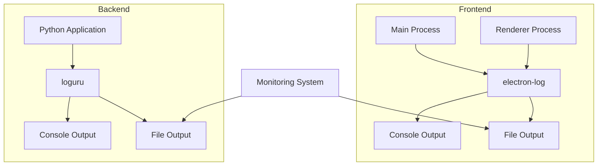
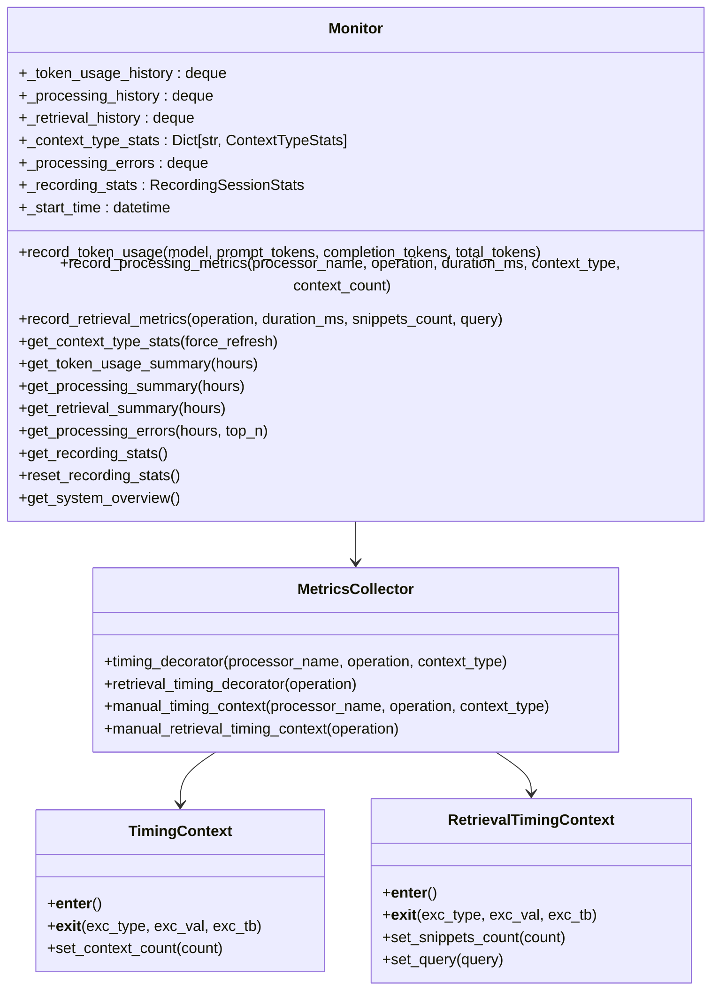
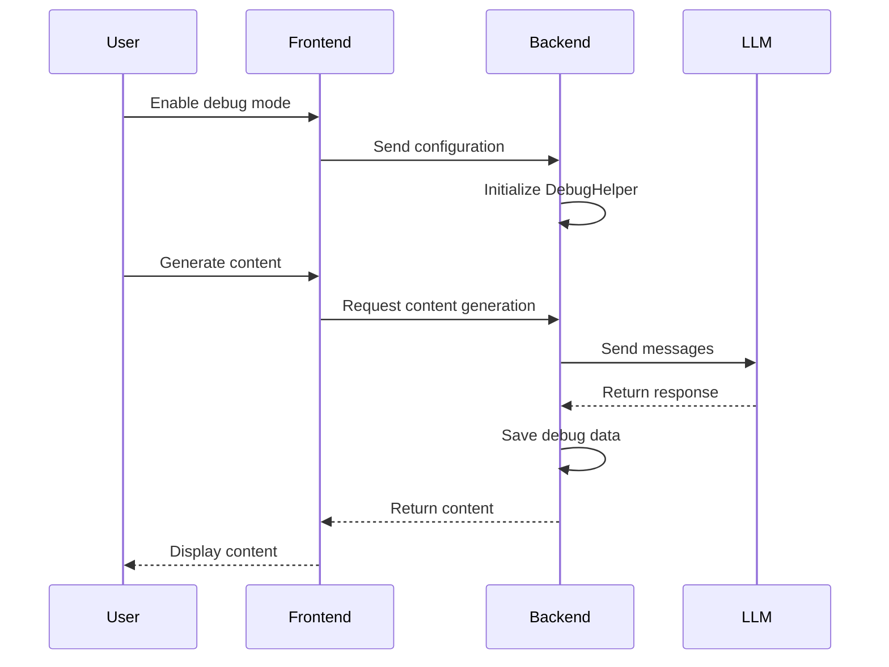
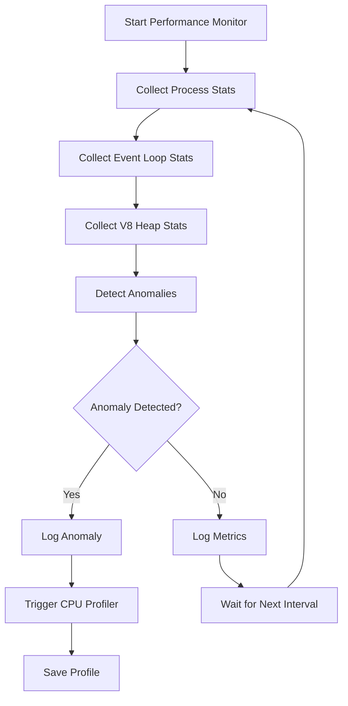

# Troubleshooting and Debugging

<cite>
**Referenced Files in This Document**   
- [init.ts](file://frontend/packages/shared/logger/init.ts)
- [main.ts](file://frontend/packages/shared/logger/main.ts)
- [renderer.ts](file://frontend/packages/shared/logger/renderer.ts)
- [logger.py](file://opencontext/utils/logger.py)
- [metrics_collector.py](file://opencontext/monitoring/metrics_collector.py)
- [monitor.py](file://opencontext/monitoring/monitor.py)
- [debug_helper.py](file://opencontext/context_consumption/generation/debug_helper.py)
- [config.yaml](file://config/config.yaml)
- [performance.ts](file://frontend/packages/shared/logger/performance.ts)
- [logging_utils.py](file://opencontext/utils/logging_utils.py)
- [debug.py](file://opencontext/server/routes/debug.py)
- [monitoring.py](file://opencontext/server/routes/monitoring.py)
</cite>

## Table of Contents
1. [Introduction](#introduction)
2. [Logging System Architecture](#logging-system-architecture)
3. [Log Levels and Categories](#log-levels-and-categories)
4. [Monitoring System](#monitoring-system)
5. [Common Issues](#common-issues)
6. [Debugging Procedures](#debugging-procedures)
7. [Log File Locations and Format](#log-file-locations-and-format)
8. [Debug Helper Utilities](#debug-helper-utilities)
9. [Platform-Specific Troubleshooting](#platform-specific-troubleshooting)
10. [Performance Monitoring](#performance-monitoring)

## Introduction
This document provides comprehensive guidance for troubleshooting and debugging MineContext, a context-aware productivity application. It covers the logging and monitoring systems, common issues users may encounter, step-by-step debugging procedures, and platform-specific troubleshooting tips. The information is designed to help users and developers identify and resolve issues efficiently, ensuring optimal performance and reliability of the application.

## Logging System Architecture

MineContext employs a sophisticated logging system that spans both frontend and backend components, ensuring comprehensive visibility into application behavior. The architecture is designed to capture detailed information while maintaining performance and security.

The frontend logging system is built on `electron-log`, a powerful logging library for Electron applications. It is initialized in the main process and automatically handles communication between the main and renderer processes. The logging system is configured to output logs to both the console and files, with different log levels and formats for each transport. In development mode, the console transport outputs debug-level logs with a detailed format, while in production, it outputs only warning and error messages. The file transport captures debug-level logs in production, providing a rich source of information for troubleshooting.

The backend logging system is implemented using `loguru`, a modern Python logging library. It is configured through the `LogManager` class, which sets up both console and file logging. The file logging is configured to rotate when the log file reaches 100 MB, retaining only the two most recent files to manage disk space usage. The log files are named with a date suffix, making it easy to identify logs from specific days.

Both logging systems use a structured format, with the frontend logs formatted as NDJSON (Newline Delimited JSON) and the backend logs using a custom format that includes timestamps, log levels, and messages. This structured approach enables easy parsing and analysis of log data, facilitating automated monitoring and alerting.

**Diagram sources**
- [init.ts](file://frontend/packages/shared/logger/init.ts)
- [logger.py](file://opencontext/utils/logger.py)

**Section sources**
- [init.ts](file://frontend/packages/shared/logger/init.ts)
- [logger.py](file://opencontext/utils/logger.py)

## Log Levels and Categories

MineContext uses a standardized set of log levels across both frontend and backend components, enabling consistent interpretation of log messages. The log levels, in order of severity, are: debug, info, warn, error, and silly.

The debug level is used for detailed information that is useful for debugging, such as the entry and exit of functions, the values of variables, and the flow of control. This level is typically enabled only during development or when troubleshooting specific issues.

The info level is used for general information about the application's operation, such as the start and stop of services, the completion of tasks, and the status of components. This level provides a high-level overview of the application's behavior.

The warn level is used for warning messages that indicate potential issues, such as deprecated features, suboptimal configurations, or recoverable errors. These messages should be reviewed and addressed to prevent more serious problems.

The error level is used for error messages that indicate a failure in the application's operation, such as the inability to connect to a service, the failure of a task, or the occurrence of an exception. These messages require immediate attention and investigation.

The silly level is used for extremely detailed information that is rarely needed, such as the contents of large data structures or the results of complex calculations. This level is typically used only for in-depth debugging of specific issues.

In addition to log levels, MineContext uses categories to organize log messages by component or functionality. The categories include main, renderer, database, network, and security, among others. This categorization enables users to filter log messages by area of interest, making it easier to identify and diagnose issues.

**Section sources**
- [main.ts](file://frontend/packages/shared/logger/main.ts)
- [renderer.ts](file://frontend/packages/shared/logger/renderer.ts)
- [logger.py](file://opencontext/utils/logger.py)

## Monitoring System

The monitoring system in MineContext is designed to collect metrics and detect anomalies in the application's performance and behavior. It is implemented as a set of decorators and utilities that automatically collect performance metrics and store them in a persistent storage.

The monitoring system is centered around the `Monitor` class, which maintains various metrics in memory and persists them to a database. The metrics include token usage, processing performance, retrieval performance, and context type statistics. The `Monitor` class uses a thread-safe design to ensure that metrics can be collected and accessed concurrently from multiple threads.

The `MetricsCollector` class provides decorators that can be applied to functions to automatically collect performance metrics. The `timing_decorator` decorator measures the duration of a function call and records the metrics in the `Monitor` instance. The `retrieval_timing_decorator` decorator measures the duration of a retrieval operation and the number of snippets returned, providing insights into the efficiency of the retrieval process.

The monitoring system also includes utilities for manual measurement of performance, such as the `manual_timing_context` and `manual_retrieval_timing_context` methods. These utilities can be used to measure the performance of specific code blocks or operations that are not easily decorated.

The collected metrics are exposed through a set of API endpoints, enabling users to access and analyze the data. The endpoints include `/api/monitoring/overview`, which provides a summary of the system's performance, and `/api/monitoring/processing-errors`, which provides a list of recent processing errors.

**Diagram sources**
- [monitor.py](file://opencontext/monitoring/monitor.py)
- [metrics_collector.py](file://opencontext/monitoring/metrics_collector.py)

**Section sources**
- [monitor.py](file://opencontext/monitoring/monitor.py)
- [metrics_collector.py](file://opencontext/monitoring/metrics_collector.py)

## Common Issues

Users of MineContext may encounter a variety of issues, ranging from capture failures to AI connectivity problems and performance bottlenecks. Understanding these common issues and their causes is essential for effective troubleshooting.

Capture failures can occur due to a variety of reasons, such as incorrect configuration, missing dependencies, or permission issues. For example, the screenshot capture feature may fail if the `capture.screenshot.enabled` setting is not set to `true` in the configuration file, or if the application does not have the necessary permissions to capture the screen.

AI connectivity problems can arise from issues with the LLM (Large Language Model) API, such as incorrect API keys, network connectivity issues, or rate limiting. The application uses the `LLM_BASE_URL`, `LLM_API_KEY`, and `LLM_MODEL` environment variables to configure the LLM client, and any errors in these settings can prevent the application from connecting to the AI service.

Performance bottlenecks can occur when the application is processing large amounts of data or when the system resources are constrained. For example, the document processing feature may be slow if the `document_processing.batch_size` setting is too high, causing the application to process too many documents at once. Similarly, the application may consume excessive memory if the `processing.screenshot_processor.max_image_size` setting is too high, causing the application to load large images into memory.

Other common issues include database connectivity problems, file system errors, and network connectivity issues. These issues can be caused by a variety of factors, such as incorrect configuration, missing dependencies, or system resource constraints.

**Section sources**
- [config.yaml](file://config/config.yaml)
- [base.py](file://opencontext/context_capture/base.py)

## Debugging Procedures

Effective debugging of MineContext requires a systematic approach that leverages the application's logging and monitoring systems. The following procedures provide step-by-step guidance for diagnosing and resolving common issues.

For capture failures, the first step is to check the application's configuration file, `config.yaml`, to ensure that the capture feature is enabled and configured correctly. The `capture.screenshot.enabled` setting should be set to `true`, and the `capture.screenshot.storage_path` setting should point to a valid directory. If the configuration is correct, the next step is to check the application's logs for error messages related to the capture feature. The logs can be found in the `frontend-logs` directory for the frontend logs and in the `logs` directory for the backend logs.

For AI connectivity problems, the first step is to verify that the LLM API is accessible and that the API keys are correct. The `LLM_BASE_URL`, `LLM_API_KEY`, and `LLM_MODEL` environment variables should be set to the correct values for the LLM service being used. If the API keys are correct, the next step is to check the application's logs for error messages related to the LLM client. The logs can provide insights into the nature of the connectivity problem, such as network timeouts or authentication failures.

For performance bottlenecks, the first step is to use the application's monitoring system to identify the source of the bottleneck. The `/api/monitoring/overview` endpoint provides a summary of the system's performance, including CPU and memory usage, event loop lag, and detached contexts. If the CPU usage is high, the `/api/monitoring/processing` endpoint can be used to identify the processors that are consuming the most CPU time. If the memory usage is high, the `/api/monitoring/data-stats` endpoint can be used to identify the data types that are consuming the most memory.

In addition to the monitoring system, the application's performance can be analyzed using the CPU profiler, which is integrated into the `PerformanceMonitor` class. The profiler can be triggered automatically when the CPU usage exceeds a certain threshold, or it can be started manually using the `start` method. The profiler generates a `.cpuprofile` file that can be analyzed using Chrome DevTools to identify performance bottlenecks in the application's code.

**Section sources**
- [config.yaml](file://config/config.yaml)
- [monitor.py](file://opencontext/monitoring/monitor.py)
- [performance.ts](file://frontend/packages/shared/logger/performance.ts)

## Log File Locations and Format

Understanding the location and format of log files is essential for effective troubleshooting in MineContext. The application generates log files in multiple locations, depending on the component and the environment.

The frontend log files are stored in the `frontend-logs` directory, which is located in the user data directory on production systems and in the `backend` directory on development systems. The log files are named with a date suffix, such as `main-2025-10-13.log`, and contain logs from the main and renderer processes. The logs are formatted as NDJSON, with each log message on a separate line and containing fields for the timestamp, log level, scope, message, and data.

The backend log files are stored in the `logs` directory, which is located in the context path, typically the user's home directory. The log files are named with a date suffix, such as `opencontext_2025-10-13.log`, and contain logs from the Python application. The logs are formatted with a custom format that includes the timestamp, log level, and message, separated by pipes.

The log files can be analyzed using a variety of tools, such as `grep`, `awk`, and `jq`, to filter and extract specific information. For example, the `grep` command can be used to search for error messages in the log files, while the `jq` command can be used to parse and analyze the NDJSON logs from the frontend.

The log files are rotated when they reach a certain size, with the frontend logs rotating at 50 MB and the backend logs rotating at 100 MB. The rotated log files are archived with a timestamp suffix, such as `opencontext_2025-10-13.log.2025-10-13_14-30-00`, making it easy to identify and access logs from specific times.

**Section sources**
- [init.ts](file://frontend/packages/shared/logger/init.ts)
- [logger.py](file://opencontext/utils/logger.py)

## Debug Helper Utilities

MineContext includes a set of debug helper utilities that can be used to diagnose and resolve issues in the application. These utilities provide additional information and functionality that is not available through the standard logging and monitoring systems.

The `DebugHelper` class is a utility that can be used to save generation messages and responses for debugging prompts. It is configured through the `content_generation.debug` section of the configuration file, with the `enabled` setting controlling whether the debug mode is enabled and the `output_path` setting specifying the directory where the debug files are saved. When debug mode is enabled, the `DebugHelper` saves the messages and responses to a JSON file in the specified directory, with a filename that includes a timestamp.

The debug files contain the timestamp, task type, messages, response, and metadata, providing a complete record of the generation process. This information can be used to analyze the behavior of the LLM and to identify issues with the prompts or the generation process.

The `DebugHelper` can be used in conjunction with the `/api/debug/generate/{category}/custom` endpoint to generate content with custom prompts. This endpoint allows users to specify a custom prompt for a specific category, such as tips, todos, or reports, and to generate content using that prompt. The generated content is saved to the debug directory, along with the custom prompt, enabling users to compare the results of different prompts.

The debug helper utilities are particularly useful for developers and advanced users who are working on customizing the application's behavior or who are troubleshooting issues with the LLM integration.

**Diagram sources**
- [debug_helper.py](file://opencontext/context_consumption/generation/debug_helper.py)
- [debug.py](file://opencontext/server/routes/debug.py)

**Section sources**
- [debug_helper.py](file://opencontext/context_consumption/generation/debug_helper.py)
- [debug.py](file://opencontext/server/routes/debug.py)

## Platform-Specific Troubleshooting

MineContext is designed to run on multiple platforms, including Windows, macOS, and Linux. Each platform has its own set of challenges and considerations for troubleshooting and debugging.

On Windows, the application may encounter issues with the Python executables that are used for window capture and inspection. These executables are built using PyInstaller and are specific to the Windows platform. If the executables are missing or corrupted, the application may fail to capture windows or to inspect the window hierarchy. To resolve this issue, the user can rebuild the executables using the `build-python.js` script, which is located in the `frontend` directory.

On macOS, the application uses the Quartz framework for window capture and inspection. This framework is only available on macOS, and the corresponding Python tools are not available on other platforms. If the application fails to capture windows or to inspect the window hierarchy on macOS, the user should ensure that the application has the necessary permissions to access the screen and to control the computer. The user can grant these permissions in the Security & Privacy settings of the System Preferences.

On Linux, the application may encounter issues with the desktop environment or with the window manager. The application uses the `desktopCapturer` API to capture windows, which may not be supported by all desktop environments or window managers. If the application fails to capture windows on Linux, the user should ensure that the desktop environment and window manager are supported and that the necessary dependencies are installed.

In addition to platform-specific issues, users may encounter issues that are specific to the version of the operating system or to the hardware configuration. For example, the application may have performance issues on older hardware or may not be compatible with certain versions of the operating system. Users should ensure that their system meets the minimum requirements for running the application and that they are using a supported version of the operating system.

**Section sources**
- [build-python.js](file://frontend/build-python.js)
- [native-capture-helper.ts](file://frontend/src/main/utils/native-capture-helper.ts)
- [get-capture-sources.ts](file://frontend/src/main/utils/get-capture-sources.ts)
- [constant.ts](file://frontend/src/main/constant.ts)

## Performance Monitoring

Performance monitoring in MineContext is a critical aspect of ensuring the application's reliability and responsiveness. The monitoring system collects a wide range of metrics that provide insights into the application's performance and behavior.

The `PerformanceMonitor` class is responsible for collecting and logging performance metrics from the frontend. It uses the `pidusage` library to monitor the CPU and memory usage of the application, the `perf_hooks` library to monitor the event loop delay, and the `v8` library to monitor the V8 heap statistics. The collected metrics are logged to a file in the `frontend-logs/performance` directory, with a filename that includes a date suffix.

The `PerformanceMonitor` also includes a CPU profiler that can be used to generate CPU profiles of the application. The profiler is triggered automatically when the CPU usage exceeds a certain threshold or when the event loop lag exceeds a certain threshold. The generated profiles are saved to the `frontend-logs/profiles` directory, with a filename that includes a timestamp and a label.

The monitoring system also includes utilities for measuring the performance of specific code blocks or operations. The `measure` method of the `PerformanceObserver` class can be used to measure the duration of a code block, and the results are logged to the performance log file. This information can be used to identify performance bottlenecks in the application's code and to optimize the performance of critical operations.

The collected performance metrics can be analyzed using a variety of tools, such as `grep`, `awk`, and `jq`, to filter and extract specific information. For example, the `grep` command can be used to search for high CPU usage or high memory usage in the performance log file, while the `jq` command can be used to parse and analyze the CPU profiles.

**Diagram sources**
- [performance.ts](file://frontend/packages/shared/logger/performance.ts)

**Section sources**
- [performance.ts](file://frontend/packages/shared/logger/performance.ts)