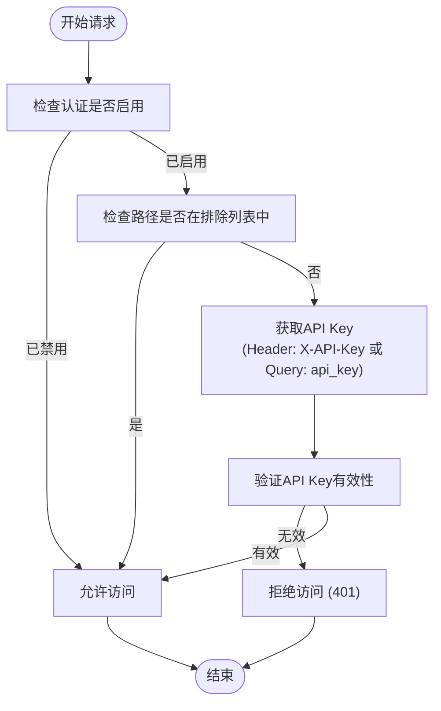

# API参考

<cite>
**本文档中引用的文件**  
- [api.py](file://opencontext/server/api.py)
- [agent_chat.py](file://opencontext/server/routes/agent_chat.py)
- [completions.py](file://opencontext/server/routes/completions.py)
- [context.py](file://opencontext/server/routes/context.py)
- [health.py](file://opencontext/server/routes/health.py)
- [conversation.py](file://opencontext/server/routes/conversation.py)
- [messages.py](file://opencontext/server/routes/messages.py)
- [documents.py](file://opencontext/server/routes/documents.py)
- [auth.py](file://opencontext/server/middleware/auth.py)
- [config.yaml](file://config/config.yaml)
</cite>

## 目录
1. [简介](#简介)
2. [API认证机制](#api认证机制)
3. [健康检查端点](#健康检查端点)
4. [智能聊天端点](#智能聊天端点)
5. [补全服务端点](#补全服务端点)
6. [上下文管理端点](#上下文管理端点)
7. [会话管理端点](#会话管理端点)
8. [消息管理端点](#消息管理端点)
9. [文档上传端点](#文档上传端点)
10. [错误码](#错误码)

## 简介
本API参考文档详细介绍了OpenContext后端暴露的所有RESTful端点。API提供了智能聊天、内容补全、上下文管理、会话和消息管理等功能，支持流式响应和非流式响应。所有端点均基于FastAPI框架构建，并通过API Key进行认证。

**Section sources**
- [api.py](file://opencontext/server/api.py#L1-L57)

## API认证机制
API使用基于API Key的认证机制。客户端需要在请求头中设置`X-API-Key`或在查询参数中提供`api_key`来通过认证。

认证配置在`config.yaml`文件中定义，主要配置项包括：
- `api_auth.enabled`: 是否启用API认证
- `api_auth.api_keys`: 有效的API密钥列表
- `api_auth.excluded_paths`: 免认证的路径列表

当认证启用时，系统会验证提供的API Key是否在有效列表中。如果未提供或提供无效的Key，将返回401错误。某些路径（如健康检查）被排除在认证之外。



**Diagram sources**
- [auth.py](file://opencontext/server/middleware/auth.py#L1-L113)
- [config.yaml](file://config/config.yaml#L192-L211)

**Section sources**
- [auth.py](file://opencontext/server/middleware/auth.py#L1-L113)

## 健康检查端点
`/health`端点用于服务健康检查，允许客户端验证API服务器是否正常运行。

### GET /health
基础健康检查端点，返回服务的基本状态。

- **HTTP方法**: GET
- **URL路径**: `/health`
- **请求头**: 无（此路径免认证）
- **请求体**: 无
- **响应体**:
```json
{
  "success": true,
  "data": {
    "status": "healthy",
    "service": "opencontext"
  }
}
```

### GET /api/health
详细健康检查端点，包含组件健康状态。

- **HTTP方法**: GET
- **URL路径**: `/api/health`
- **请求头**: 无（此路径免认证）
- **请求体**: 无
- **响应体**:
```json
{
  "success": true,
  "data": {
    "status": "healthy",
    "service": "opencontext",
    "components": {
      "storage": "healthy",
      "llm": "healthy"
    }
  }
}
```

### GET /api/auth/status
检查API认证是否启用。

- **HTTP方法**: GET
- **URL路径**: `/api/auth/status`
- **请求头**: 无（此路径免认证）
- **请求体**: 无
- **响应体**:
```json
{
  "success": true,
  "data": {
    "auth_enabled": false
  }
}
```

**Section sources**
- [health.py](file://opencontext/server/routes/health.py#L1-L47)

## 智能聊天端点
智能聊天端点基于Context Agent提供智能对话功能，支持非流式和流式响应。

### POST /api/agent/chat
发起智能聊天请求。

- **HTTP方法**: POST
- **URL路径**: `/api/agent/chat`
- **请求头**: `X-API-Key: your_api_key`
- **请求体**:
```json
{
  "query": "用户查询内容",
  "context": {},
  "session_id": "会话ID",
  "user_id": "用户ID",
  "conversation_id": 123
}
```
- **响应体**:
```json
{
  "success": true,
  "workflow_id": "工作流ID",
  "stage": "当前阶段",
  "query": "查询内容",
  "intent": {},
  "context": {},
  "execution": {},
  "reflection": {},
  "errors": []
}
```

### POST /api/agent/chat/stream
发起流式智能聊天请求。

- **HTTP方法**: POST
- **URL路径**: `/api/agent/chat/stream`
- **请求头**: `X-API-Key: your_api_key`
- **请求体**: 同上
- **响应体**: `text/event-stream`，包含多个事件：
  - `session_start`: 会话开始
  - `thinking`: 思考过程
  - `stream_chunk`: 流式内容块
  - `completed`: 完成

**curl示例**:
```bash
curl -X POST http://localhost:1733/api/agent/chat/stream \
  -H "X-API-Key: your_api_key" \
  -H "Content-Type: application/json" \
  -d '{"query": "你好", "session_id": "sess_123"}'
```

**Python请求示例**:
```python
import requests

url = "http://localhost:1733/api/agent/chat/stream"
headers = {"X-API-Key": "your_api_key", "Content-Type": "application/json"}
data = {"query": "你好", "session_id": "sess_123"}

response = requests.post(url, headers=headers, json=data, stream=True)
for line in response.iter_lines():
    if line:
        print(line.decode('utf-8'))
```

**Section sources**
- [agent_chat.py](file://opencontext/server/routes/agent_chat.py#L1-L367)

## 补全服务端点
补全服务端点提供类似GitHub Copilot的智能补全功能。

### POST /api/completions/suggest
获取智能补全建议。

- **HTTP方法**: POST
- **URL路径**: `/api/completions/suggest`
- **请求头**: `X-API-Key: your_api_key`
- **请求体**:
```json
{
  "text": "当前文档内容",
  "cursor_position": 10,
  "document_id": 1,
  "completion_types": ["semantic_continuation"],
  "max_suggestions": 3,
  "context": {}
}
```
- **响应体**:
```json
{
  "success": true,
  "suggestions": [
    {
      "completion_type": "semantic_continuation",
      "suggestion": "补全建议内容",
      "score": 0.95,
      "metadata": {}
    }
  ],
  "processing_time_ms": 123.45,
  "cache_hit": false,
  "timestamp": "2025-01-01T00:00:00"
}
```

### POST /api/completions/suggest/stream
流式获取补全建议。

- **HTTP方法**: POST
- **URL路径**: `/api/completions/suggest/stream`
- **请求头**: `X-API-Key: your_api_key`
- **请求体**: 同上
- **响应体**: `text/event-stream`，包含`suggestion`事件

### POST /api/completions/feedback
提交补全反馈以改进质量。

- **HTTP方法**: POST
- **URL路径**: `/api/completions/feedback`
- **请求头**: `X-API-Key: your_api_key`
- **请求参数**:
  - `suggestion_text`: 建议文本
  - `document_id`: 文档ID
  - `accepted`: 是否接受
  - `completion_type`: 补全类型

**Section sources**
- [completions.py](file://opencontext/server/routes/completions.py#L1-L329)

## 上下文管理端点
上下文管理端点用于查询和管理上下文数据。

### POST /api/vector_search
向量数据库搜索，无需使用LLM。

- **HTTP方法**: POST
- **URL路径**: `/api/vector_search`
- **请求头**: `X-API-Key: your_api_key`
- **请求体**:
```json
{
  "query": "搜索查询",
  "top_k": 10,
  "context_types": ["activity", "document"],
  "filters": {}
}
```
- **响应体**:
```json
{
  "success": true,
  "data": {
    "results": [],
    "total": 0,
    "query": "搜索查询",
    "top_k": 10
  }
}
```

### GET /api/context_types
获取所有可用的上下文类型。

- **HTTP方法**: GET
- **URL路径**: `/api/context_types`
- **请求头**: `X-API-Key: your_api_key`
- **响应体**:
```json
{
  "success": true,
  "data": ["activity", "document", "webpage"]
}
```

**Section sources**
- [context.py](file://opencontext/server/routes/context.py#L1-L146)

## 会话管理端点
会话管理端点处理聊天会话的CRUD操作。

### POST /api/agent/chat/conversations
创建新会话。

- **HTTP方法**: POST
- **URL路径**: `/api/agent/chat/conversations`
- **请求头**: `X-API-Key: your_api_key`
- **请求体**:
```json
{
  "page_name": "home",
  "document_id": "doc_123"
}
```
- **响应体**:
```json
{
  "id": 1,
  "title": null,
  "user_id": null,
  "created_at": "2025-01-01T00:00:00",
  "updated_at": "2025-01-01T00:00:00",
  "metadata": "{}",
  "page_name": "home",
  "status": "active"
}
```

### GET /api/agent/chat/conversations/list
获取会话列表。

- **HTTP方法**: GET
- **URL路径**: `/api/agent/chat/conversations/list`
- **请求头**: `X-API-Key: your_api_key`
- **查询参数**:
  - `limit`: 返回限制（默认20）
  - `offset`: 偏移量（默认0）
  - `page_name`: 页面名称过滤
  - `user_id`: 用户ID过滤
  - `status`: 状态过滤（'active', 'deleted'）
- **响应体**:
```json
{
  "success": true,
  "data": {
    "items": [],
    "total": 0
  }
}
```

### GET /api/agent/chat/conversations/{cid}
获取会话详情。

- **HTTP方法**: GET
- **URL路径**: `/api/agent/chat/conversations/{cid}`
- **请求头**: `X-API-Key: your_api_key`
- **响应体**: 同创建会话响应

### PATCH /api/agent/chat/conversations/{cid}/update
更新会话标题。

- **HTTP方法**: PATCH
- **URL路径**: `/api/agent/chat/conversations/{cid}/update`
- **请求头**: `X-API-Key: your_api_key`
- **请求体**:
```json
{
  "title": "新标题"
}
```
- **响应体**: 同创建会话响应

### DELETE /api/agent/chat/conversations/{cid}/update
删除会话（软删除）。

- **HTTP方法**: DELETE
- **URL路径**: `/api/agent/chat/conversations/{cid}/update`
- **请求头**: `X-API-Key: your_api_key`
- **响应体**:
```json
{
  "success": true,
  "data": {
    "id": 1
  }
}
```

**Section sources**
- [conversation.py](file://opencontext/server/routes/conversation.py#L1-L234)

## 消息管理端点
消息管理端点处理会话中消息的CRUD操作。

### POST /api/agent/chat/message/{mid}/create
创建新消息。

- **HTTP方法**: POST
- **URL路径**: `/api/agent/chat/message/{mid}/create`
- **请求头**: `X-API-Key: your_api_key`
- **请求体**:
```json
{
  "conversation_id": 1,
  "role": "user",
  "content": "消息内容",
  "is_complete": true,
  "token_count": 10
}
```
- **响应体**: 消息ID

### POST /api/agent/chat/message/stream/{mid}/create
创建流式消息（占位符）。

- **HTTP方法**: POST
- **URL路径**: `/api/agent/chat/message/stream/{mid}/create`
- **请求头**: `X-API-Key: your_api_key`
- **请求体**:
```json
{
  "conversation_id": 1,
  "role": "assistant"
}
```
- **响应体**: 消息ID

### POST /api/agent/chat/message/{mid}/update
更新消息内容。

- **HTTP方法**: POST
- **URL路径**: `/api/agent/chat/message/{mid}/update`
- **请求头**: `X-API-Key: your_api_key`
- **请求体**:
```json
{
  "message_id": 1,
  "new_content": "新内容",
  "is_complete": true,
  "token_count": 15
}
```
- **响应体**: 布尔值

### POST /api/agent/chat/message/{mid}/append
追加消息内容（用于流式传输）。

- **HTTP方法**: POST
- **URL路径**: `/api/agent/chat/message/{mid}/append`
- **请求头**: `X-API-Key: your_api_key`
- **请求体**:
```json
{
  "message_id": 1,
  "content_chunk": "追加内容",
  "token_count": 5
}
```
- **响应体**: 布尔值

### POST /api/agent/chat/message/{mid}/finished
标记消息为完成。

- **HTTP方法**: POST
- **URL路径**: `/api/agent/chat/message/{mid}/finished`
- **请求头**: `X-API-Key: your_api_key`
- **响应体**: 布尔值

### GET /api/agent/chat/conversations/{cid}/messages
获取会话的所有消息。

- **HTTP方法**: GET
- **URL路径**: `/api/agent/chat/conversations/{cid}/messages`
- **请求头**: `X-API-Key: your_api_key`
- **响应体**: 消息对象数组

### POST /api/agent/chat/messages/{mid}/interrupt
中断消息生成。

- **HTTP方法**: POST
- **URL路径**: `/api/agent/chat/messages/{mid}/interrupt`
- **请求头**: `X-API-Key: your_api_key`
- **响应体**:
```json
{
  "success": true,
  "data": {
    "message_id": "1"
  }
}
```

**Section sources**
- [messages.py](file://opencontext/server/routes/messages.py#L1-L316)

## 文档上传端点
文档上传端点用于上传本地文档或网页链接。

### POST /api/documents/upload
上传本地文档。

- **HTTP方法**: POST
- **URL路径**: `/api/documents/upload`
- **请求头**: `X-API-Key: your_api_key`
- **请求体**:
```json
{
  "file_path": "/path/to/document.pdf"
}
```
- **响应体**:
```json
{
  "success": true,
  "message": "Document queued for processing successfully"
}
```

### POST /api/weblinks/upload
上传网页链接。

- **HTTP方法**: POST
- **URL路径**: `/api/weblinks/upload`
- **请求头**: `X-API-Key: your_api_key`
- **请求体**:
```json
{
  "url": "https://example.com",
  "filename_hint": "example.pdf"
}
```
- **响应体**: 同上传文档响应

**Section sources**
- [documents.py](file://opencontext/server/routes/documents.py#L1-L101)

## 错误码
API使用标准HTTP状态码和自定义错误码。

| 状态码 | 错误码 | 描述 |
|--------|--------|------|
| 400 | 400 | 请求参数错误 |
| 401 | 401 | 未授权，API Key缺失或无效 |
| 404 | 404 | 资源未找到 |
| 429 | 429 | 请求过于频繁，限流 |
| 500 | 500 | 服务器内部错误 |
| 503 | 503 | 服务不可用 |

**Section sources**
- [auth.py](file://opencontext/server/middleware/auth.py#L90-L106)
- [health.py](file://opencontext/server/routes/health.py#L40-L41)