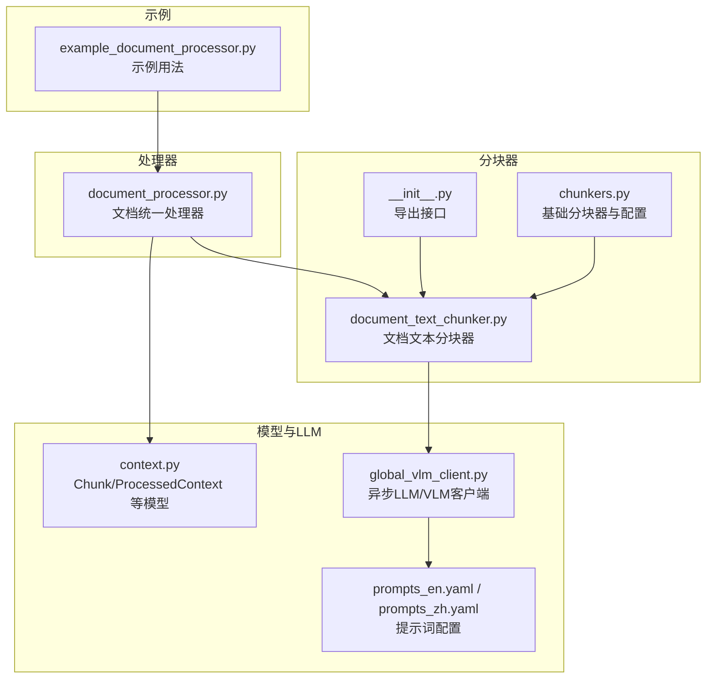
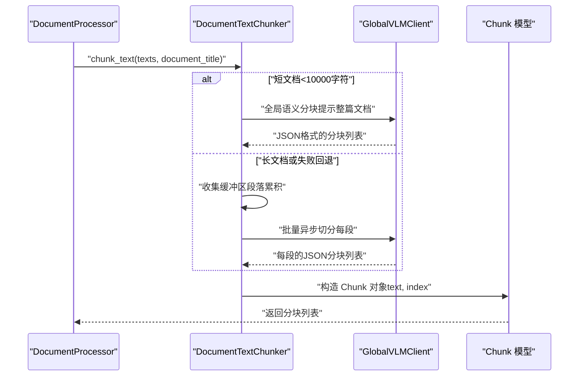
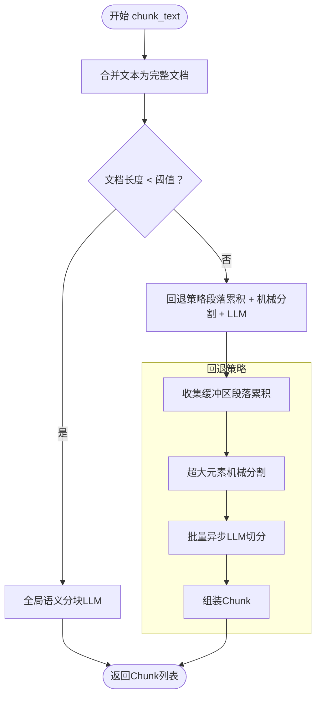
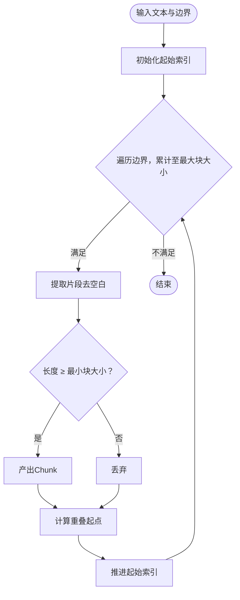
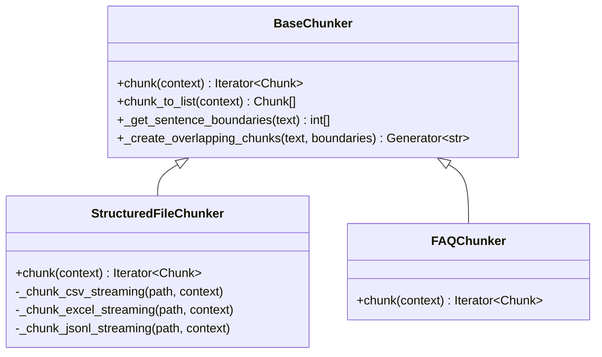
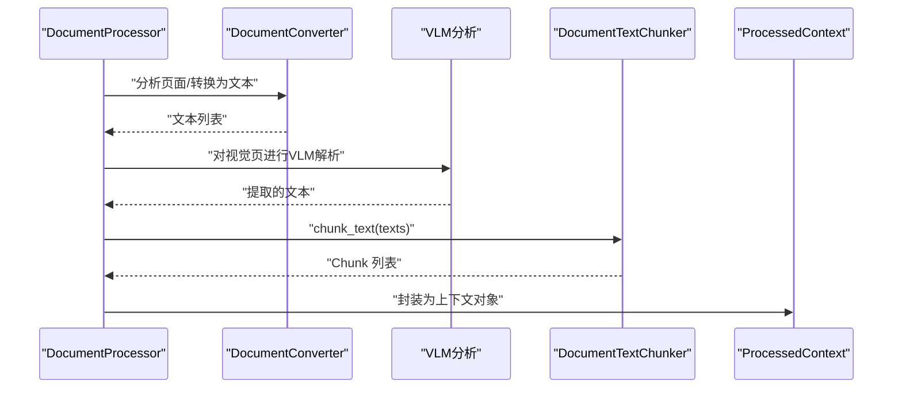
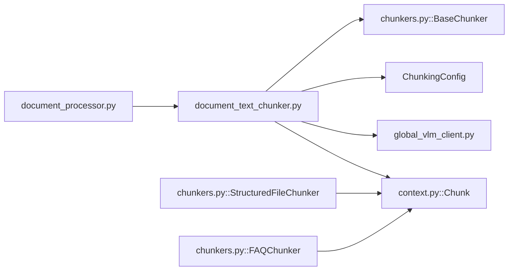

# 上下文分块

<cite>
**本文引用的文件列表**
- [document_text_chunker.py](file://opencontext/context_processing/chunker/document_text_chunker.py)
- [chunkers.py](file://opencontext/context_processing/chunker/chunkers.py)
- [__init__.py](file://opencontext/context_processing/chunker/__init__.py)
- [document_processor.py](file://opencontext/context_processing/processor/document_processor.py)
- [context.py](file://opencontext/models/context.py)
- [global_vlm_client.py](file://opencontext/llm/global_vlm_client.py)
- [prompts_en.yaml](file://config/prompts_en.yaml)
- [prompts_zh.yaml](file://config/prompts_zh.yaml)
- [example_document_processor.py](file://examples/example_document_processor.py)
</cite>

## 目录
1. [引言](#引言)
2. [项目结构](#项目结构)
3. [核心组件](#核心组件)
4. [架构总览](#架构总览)
5. [详细组件分析](#详细组件分析)
6. [依赖关系分析](#依赖关系分析)
7. [性能考量](#性能考量)
8. [故障排查指南](#故障排查指南)
9. [结论](#结论)
10. [附录](#附录)

## 引言
本篇文档围绕“上下文分块”展开，重点解析 DocumentTextChunker 类如何将长文本拆分为适合大模型（LLM/VLM）处理的语义块，并结合 chunkers.py 中的基础分块器与处理器流水线，说明分块在文档处理流程中的位置与作用。我们将系统阐述：
- 基于字符/标记的分割与语义边界的检测（句子、段落）
- 重叠策略（overlap）以保持上下文连贯性
- 其他分块器的扩展可能性
- 分块在文本提取与向量化之间的定位
- 不同分块策略对检索效果的影响及针对文档类型的参数调优
- 分块前后对比与性能基准方法

## 项目结构
与“上下文分块”直接相关的模块主要位于 opencontext/context_processing/chunker 与 opencontext/context_processing/processor 下，配合模型定义与 LLM 客户端共同完成端到端的分块与处理。

图表来源
- [chunkers.py](file://opencontext/context_processing/chunker/chunkers.py#L1-L120)
- [document_text_chunker.py](file://opencontext/context_processing/chunker/document_text_chunker.py#L1-L120)
- [__init__.py](file://opencontext/context_processing/chunker/__init__.py#L1-L24)
- [document_processor.py](file://opencontext/context_processing/processor/document_processor.py#L75-L109)
- [context.py](file://opencontext/models/context.py#L24-L60)
- [global_vlm_client.py](file://opencontext/llm/global_vlm_client.py#L176-L210)
- [prompts_en.yaml](file://config/prompts_en.yaml#L1-L120)
- [prompts_zh.yaml](file://config/prompts_zh.yaml#L1-L120)
- [example_document_processor.py](file://examples/example_document_processor.py#L152-L177)

章节来源
- [chunkers.py](file://opencontext/context_processing/chunker/chunkers.py#L1-L120)
- [document_text_chunker.py](file://opencontext/context_processing/chunker/document_text_chunker.py#L1-L120)
- [document_processor.py](file://opencontext/context_processing/processor/document_processor.py#L75-L109)

## 核心组件
- ChunkingConfig：分块配置，包含最大块大小、最小块大小、重叠大小、批大小与缓存开关。
- BaseChunker：抽象基类，提供迭代式 chunk 接口、列表转换、句子边界缓存与重叠块生成等通用能力。
- StructuredFileChunker：面向结构化文件（CSV/XLSX/JSONL）的流式分块器。
- FAQChunker：面向 FAQ 的 Excel 文件分块器，按 Q&A 对切分。
- DocumentTextChunker：面向文档文本的智能分块器，支持全局语义分块与回退策略，结合 LLM 进行语义边界识别与机械分割。

章节来源
- [chunkers.py](file://opencontext/context_processing/chunker/chunkers.py#L28-L120)
- [chunkers.py](file://opencontext/context_processing/chunker/chunkers.py#L155-L439)
- [document_text_chunker.py](file://opencontext/context_processing/chunker/document_text_chunker.py#L25-L120)

## 架构总览
DocumentTextChunker 在文档处理流水线中承担“智能分块”的角色，通常位于文本提取之后、向量化之前。其核心流程如下：
- 文本输入合并为完整文档
- 短文档采用“全局语义分块”，由 LLM 对整篇文档进行语义切分
- 长文档或失败回退采用“段落累积 + 机械分割 + LLM 批量切分”的策略
- 通过 Chunk 数据模型输出标准化的分块结果

图表来源
- [document_processor.py](file://opencontext/context_processing/processor/document_processor.py#L303-L402)
- [document_text_chunker.py](file://opencontext/context_processing/chunker/document_text_chunker.py#L39-L120)
- [document_text_chunker.py](file://opencontext/context_processing/chunker/document_text_chunker.py#L255-L319)
- [document_text_chunker.py](file://opencontext/context_processing/chunker/document_text_chunker.py#L320-L339)
- [context.py](file://opencontext/models/context.py#L24-L60)
- [global_vlm_client.py](file://opencontext/llm/global_vlm_client.py#L176-L210)

## 详细组件分析

### DocumentTextChunker：智能分块策略
- 文档长度自适应策略
  - 短文档（字符数小于阈值）：全局语义分块，一次性让 LLM 对整篇文档进行语义切分
  - 长文档或失败回退：采用段落累积 + 机械分割 + LLM 批量切分
- 分块阶段
  - 阶段一：收集需要 LLM 分割的缓冲区；同时处理超大元素的机械分割
  - 阶段二：并发异步调用 LLM，批量处理缓冲区
  - 阶段三：组装最终 Chunk 列表
- 机械分割策略
  - 优先按标点（中英文句号、问号、感叹号）切分句子
  - 若无标点，则按长度折半切分
- 全局语义分块
  - 将完整文档作为输入，提示 LLM 输出 JSON 格式的分块列表
  - 失败时回退到默认策略

图表来源
- [document_text_chunker.py](file://opencontext/context_processing/chunker/document_text_chunker.py#L39-L120)
- [document_text_chunker.py](file://opencontext/context_processing/chunker/document_text_chunker.py#L133-L179)
- [document_text_chunker.py](file://opencontext/context_processing/chunker/document_text_chunker.py#L223-L254)
- [document_text_chunker.py](file://opencontext/context_processing/chunker/document_text_chunker.py#L255-L319)
- [document_text_chunker.py](file://opencontext/context_processing/chunker/document_text_chunker.py#L320-L339)

章节来源
- [document_text_chunker.py](file://opencontext/context_processing/chunker/document_text_chunker.py#L39-L120)
- [document_text_chunker.py](file://opencontext/context_processing/chunker/document_text_chunker.py#L133-L179)
- [document_text_chunker.py](file://opencontext/context_processing/chunker/document_text_chunker.py#L223-L254)
- [document_text_chunker.py](file://opencontext/context_processing/chunker/document_text_chunker.py#L255-L319)
- [document_text_chunker.py](file://opencontext/context_processing/chunker/document_text_chunker.py#L320-L339)

### BaseChunker 与重叠策略
- 句子边界缓存：通过正则匹配句子边界，减少重复计算
- 重叠块生成：在给定边界上构建带重叠的块，保证上下文连贯性
- 参数：最大块大小、最小块大小、重叠大小、批大小、缓存开关

图表来源
- [chunkers.py](file://opencontext/context_processing/chunker/chunkers.py#L82-L154)

章节来源
- [chunkers.py](file://opencontext/context_processing/chunker/chunkers.py#L28-L120)
- [chunkers.py](file://opencontext/context_processing/chunker/chunkers.py#L82-L154)

### StructuredFileChunker 与 FAQChunker：扩展与兼容
- StructuredFileChunker：面向 CSV/XLSX/JSONL 的流式分块，按批读取并生成结构化文本块，保留元信息（列名、行范围、sheet 名等）
- FAQChunker：自动识别问题/答案列，逐条 Q&A 生成块，便于问答检索

图表来源
- [chunkers.py](file://opencontext/context_processing/chunker/chunkers.py#L155-L439)

章节来源
- [chunkers.py](file://opencontext/context_processing/chunker/chunkers.py#L155-L439)

### 分块在文档处理流水线中的位置
- 文本内容：直接调用 DocumentTextChunker 的 chunk_text
- 视觉文档（PDF/DOCX/图片/PPT）：先进行页面级分析与 VLM 提取，再对得到的文本列表进行分块
- 统一处理器初始化时注入 DocumentTextChunker，并设置最大/最小块大小与重叠大小

图表来源
- [document_processor.py](file://opencontext/context_processing/processor/document_processor.py#L303-L402)
- [document_processor.py](file://opencontext/context_processing/processor/document_processor.py#L75-L109)

章节来源
- [document_processor.py](file://opencontext/context_processing/processor/document_processor.py#L75-L109)
- [document_processor.py](file://opencontext/context_processing/processor/document_processor.py#L303-L402)

## 依赖关系分析
- DocumentTextChunker 依赖：
  - BaseChunker（继承）与 ChunkingConfig（配置）
  - LLM 客户端：通过全局 VLM 客户端进行异步消息生成
  - 提示词：从配置中加载“document_processing.text_chunking”与“document_processing.global_semantic_chunking”
  - Chunk 模型：用于输出标准化的分块对象
- StructuredFileChunker 与 FAQChunker 依赖：
  - pandas 流式读取
  - Chunk 模型与日志记录
- DocumentProcessor 注入 DocumentTextChunker 并在文本/视觉路径中调用

图表来源
- [document_processor.py](file://opencontext/context_processing/processor/document_processor.py#L75-L109)
- [document_text_chunker.py](file://opencontext/context_processing/chunker/document_text_chunker.py#L1-L120)
- [chunkers.py](file://opencontext/context_processing/chunker/chunkers.py#L1-L120)
- [context.py](file://opencontext/models/context.py#L24-L60)
- [global_vlm_client.py](file://opencontext/llm/global_vlm_client.py#L176-L210)

章节来源
- [document_text_chunker.py](file://opencontext/context_processing/chunker/document_text_chunker.py#L1-L120)
- [chunkers.py](file://opencontext/context_processing/chunker/chunkers.py#L1-L120)
- [context.py](file://opencontext/models/context.py#L24-L60)
- [global_vlm_client.py](file://opencontext/llm/global_vlm_client.py#L176-L210)
- [document_processor.py](file://opencontext/context_processing/processor/document_processor.py#L75-L109)

## 性能考量
- 并发与异步
  - 使用 asyncio 事件循环与 gather 并发执行 LLM 切分，显著降低总延迟
  - 批量大小（batch_size）影响 I/O 与 LLM 调用次数，需权衡吞吐与成本
- 缓存与边界检测
  - 句子边界缓存（LRU）减少重复正则扫描
  - 合理设置重叠大小可提升检索召回，但会增加向量库存储与计算开销
- 机械分割兜底
  - 面对 LLM 返回异常或非预期格式，机械分割（按句号/折半）保证稳定性
- 文档长度阈值
  - 短文档走全局语义分块，长文档走回退策略，平衡质量与成本

章节来源
- [document_text_chunker.py](file://opencontext/context_processing/chunker/document_text_chunker.py#L133-L179)
- [chunkers.py](file://opencontext/context_processing/chunker/chunkers.py#L82-L154)

## 故障排查指南
- LLM 返回非列表或异常
  - 记录错误并回退到机械分割或默认策略
  - 检查提示词组是否存在、参数格式是否正确
- 空文本或全空白输入
  - 警告并返回空分块列表
- VLM 客户端未初始化
  - 确认配置中存在 vlm_model，或在运行时触发自动初始化
- 示例输出验证
  - 使用示例脚本打印分块摘要并保存为 JSON，便于人工核验

章节来源
- [document_text_chunker.py](file://opencontext/context_processing/chunker/document_text_chunker.py#L181-L222)
- [document_text_chunker.py](file://opencontext/context_processing/chunker/document_text_chunker.py#L316-L339)
- [global_vlm_client.py](file://opencontext/llm/global_vlm_client.py#L70-L90)
- [example_document_processor.py](file://examples/example_document_processor.py#L152-L177)

## 结论
DocumentTextChunker 通过“短文档全局语义分块 + 长文档回退策略”的组合，在保证语义连贯的同时兼顾性能与稳定性。结合 BaseChunker 的重叠策略与结构化分块器，整体分块方案覆盖了文本、结构化数据与问答场景。在实际应用中，应根据文档类型与检索目标调整最大/最小块大小与重叠大小，并通过示例脚本与日志进行效果验证与性能基准。

## 附录

### 分块参数与调优建议
- 最大块大小（max_chunk_size）
  - 技术文档：较大，便于承载完整公式/表格上下文
  - 小说/散文：适中，避免跨段落截断
  - 代码：较小，便于定位函数/类边界
- 最小块大小（min_chunk_size）
  - 建议不小于 100 字符，避免噪声
- 重叠大小（chunk_overlap）
  - 建议占最大块大小的 10%-20%，提升检索召回
- 批大小（batch_size）
  - 面向结构化文件时，按行/块聚合，平衡内存与吞吐

章节来源
- [chunkers.py](file://opencontext/context_processing/chunker/chunkers.py#L28-L44)
- [document_processor.py](file://opencontext/context_processing/processor/document_processor.py#L75-L84)

### 分块前后对比与性能基准方法
- 对比方法
  - 选取同一文档的不同分块策略（如仅字符切分 vs 语义切分），比较检索命中率与相关性评分
  - 对比不同重叠大小下的召回与误检率
- 基准指标
  - 平均分块长度、分块数量、LLM 调用次数与耗时、向量库存储体积
- 实践步骤
  - 使用示例脚本对同一文档进行处理，输出分块摘要并统计
  - 对比不同 ChunkingConfig 设置下的检索效果与资源消耗

章节来源
- [example_document_processor.py](file://examples/example_document_processor.py#L152-L177)
- [document_processor.py](file://opencontext/context_processing/processor/document_processor.py#L303-L402)