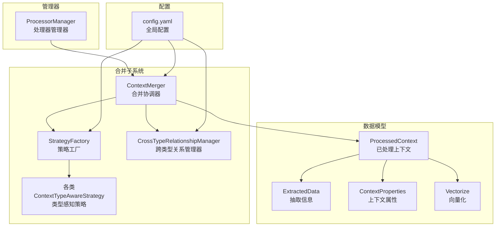
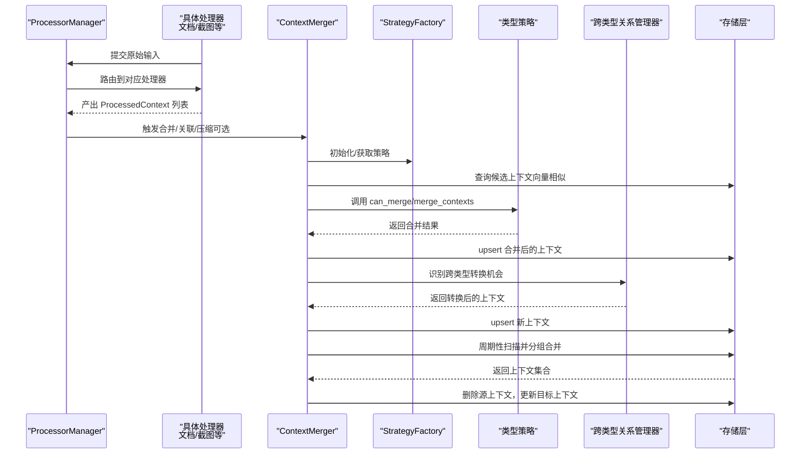
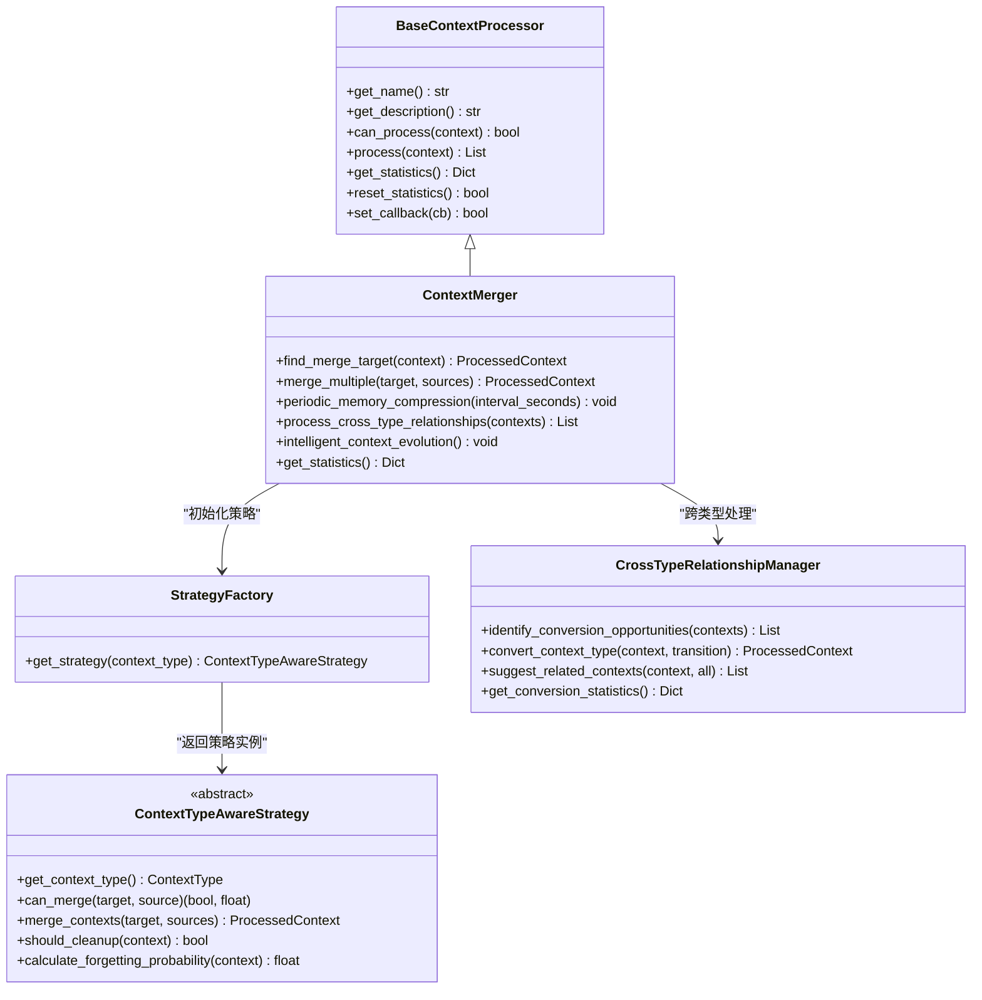
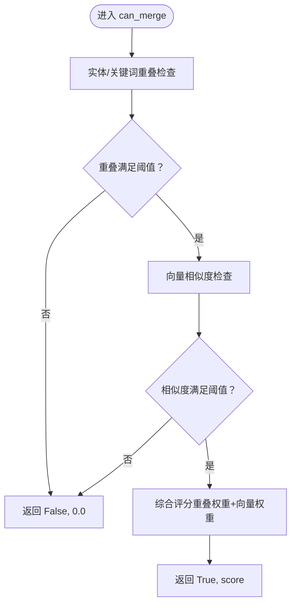
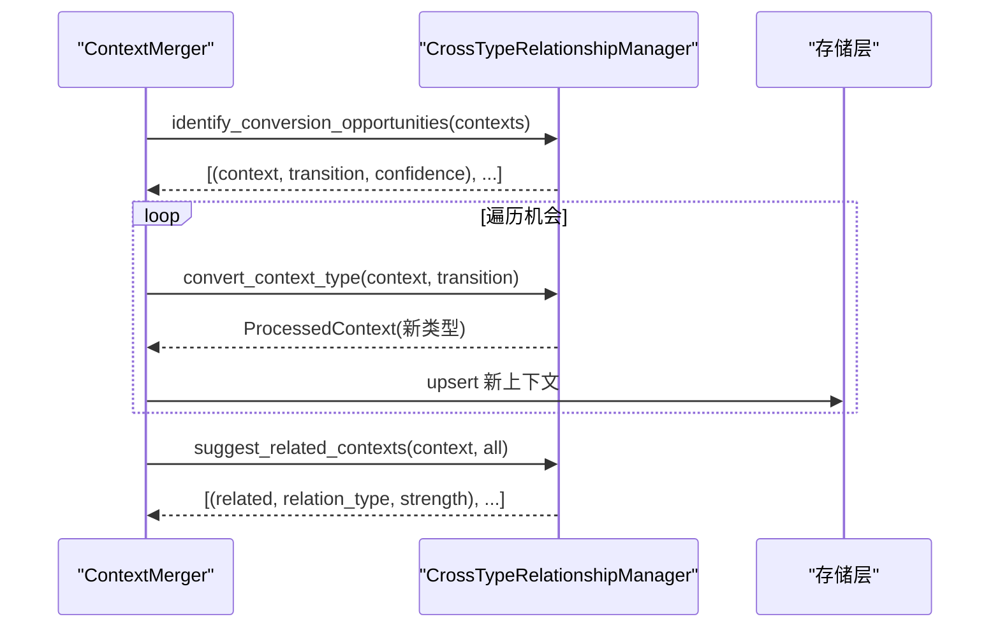
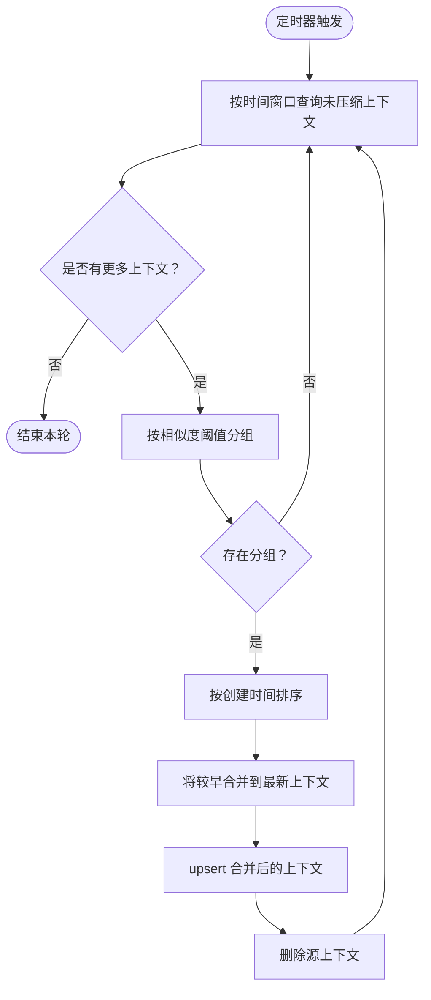
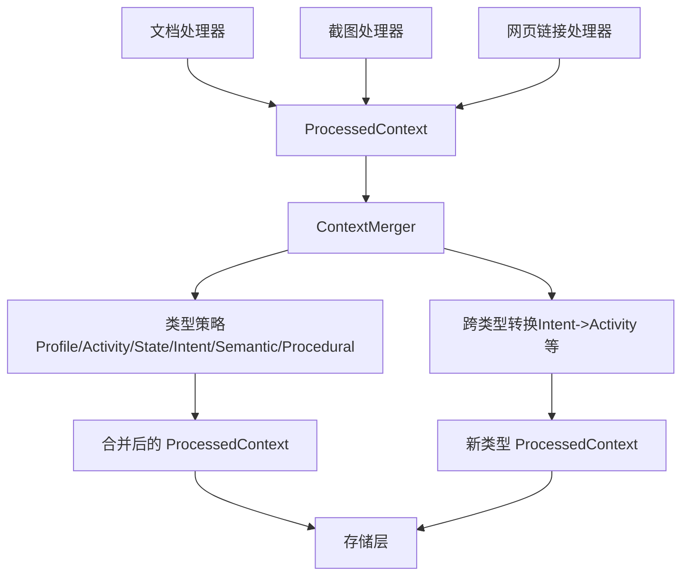
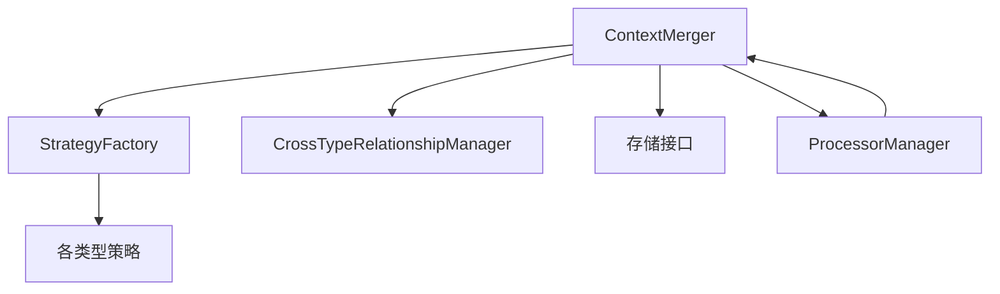

# 上下文合并

<cite>
**本文引用的文件**
- [context_merger.py](file://opencontext/context_processing/merger/context_merger.py)
- [merge_strategies.py](file://opencontext/context_processing/merger/merge_strategies.py)
- [cross_type_relationships.py](file://opencontext/context_processing/merger/cross_type_relationships.py)
- [processor_manager.py](file://opencontext/managers/processor_manager.py)
- [context.py](file://opencontext/models/context.py)
- [config.yaml](file://config/config.yaml)
- [base_processor.py](file://opencontext/context_processing/processor/base_processor.py)
</cite>

## 目录
1. [简介](#简介)
2. [项目结构](#项目结构)
3. [核心组件](#核心组件)
4. [架构总览](#架构总览)
5. [详细组件分析](#详细组件分析)
6. [依赖分析](#依赖分析)
7. [性能考量](#性能考量)
8. [故障排查指南](#故障排查指南)
9. [结论](#结论)
10. [附录](#附录)

## 简介
本文件围绕“上下文合并”机制展开，重点从 ContextMerger 类入手，解释其作为特殊处理器的角色；梳理 merge_strategies.py 中定义的不同合并策略（时间序列聚合、主题聚类与关系图谱构建）；说明 cross_type_relationships.py 如何建立不同类型上下文（如文档与截图）之间的关联；深入解析 ProcessorManager 的 periodic_memory_compression 机制：定时器如何触发合并任务、内存压缩的算法逻辑、以及如何减少上下文冗余；最后给出数据流图，展示多个处理器输出如何被合并为统一的上下文视图，并提供配置示例以调整合并频率与策略。

## 项目结构
- 合并子系统位于 opencontext/context_processing/merger，包含 ContextMerger、多种合并策略、跨类型关系管理器。
- 管理器位于 opencontext/managers，负责调度与周期性任务（如内存压缩）。
- 数据模型位于 opencontext/models，定义 ProcessedContext、ExtractedData、ContextProperties、Vectorize 等核心结构。
- 配置位于 config/config.yaml，集中管理合并器、策略、跨类型处理等参数。

图表来源
- [context_merger.py](file://opencontext/context_processing/merger/context_merger.py#L39-L143)
- [merge_strategies.py](file://opencontext/context_processing/merger/merge_strategies.py#L1270-L1286)
- [cross_type_relationships.py](file://opencontext/context_processing/merger/cross_type_relationships.py#L35-L112)
- [processor_manager.py](file://opencontext/managers/processor_manager.py#L25-L85)
- [context.py](file://opencontext/models/context.py#L57-L202)
- [config.yaml](file://config/config.yaml#L95-L132)

章节来源
- [context_merger.py](file://opencontext/context_processing/merger/context_merger.py#L39-L143)
- [merge_strategies.py](file://opencontext/context_processing/merger/merge_strategies.py#L1270-L1286)
- [cross_type_relationships.py](file://opencontext/context_processing/merger/cross_type_relationships.py#L35-L112)
- [processor_manager.py](file://opencontext/managers/processor_manager.py#L25-L85)
- [context.py](file://opencontext/models/context.py#L57-L202)
- [config.yaml](file://config/config.yaml#L95-L132)

## 核心组件
- ContextMerger：作为特殊处理器，负责智能合并相似上下文、跨类型转换与演化、周期性内存压缩与清理、以及统计与日志。
- StrategyFactory 与 ContextTypeAwareStrategy 及其子类：按上下文类型提供差异化合并策略（如 Profile、Activity、State、Intent、Semantic、Procedural），并内置遗忘概率与清理逻辑。
- CrossTypeRelationshipManager：识别跨类型转换机会，执行类型转换，建议跨类型关联上下文。
- ProcessorManager：统一编排处理器，启动/停止周期性内存压缩任务（定时器）。

章节来源
- [context_merger.py](file://opencontext/context_processing/merger/context_merger.py#L39-L143)
- [merge_strategies.py](file://opencontext/context_processing/merger/merge_strategies.py#L24-L120)
- [cross_type_relationships.py](file://opencontext/context_processing/merger/cross_type_relationships.py#L35-L112)
- [processor_manager.py](file://opencontext/managers/processor_manager.py#L25-L85)

## 架构总览
下面的序列图展示了从处理器产生上下文到 ContextMerger 合并、跨类型转换与周期性压缩的整体流程。

图表来源
- [processor_manager.py](file://opencontext/managers/processor_manager.py#L132-L179)
- [context_merger.py](file://opencontext/context_processing/merger/context_merger.py#L145-L214)
- [merge_strategies.py](file://opencontext/context_processing/merger/merge_strategies.py#L1270-L1286)
- [cross_type_relationships.py](file://opencontext/context_processing/merger/cross_type_relationships.py#L91-L112)

## 详细组件分析

### ContextMerger：特殊处理器角色与职责
- 继承 BaseContextProcessor，提供统一的统计、回调与配置管理能力。
- 作为“合并协调器”，负责：
  - 智能合并：基于类型策略与向量相似度选择合并目标。
  - 回退合并：若无可用策略，使用 LLM 提示模板进行合并。
  - 跨类型处理：识别转换机会并生成新上下文。
  - 周期性内存压缩：按时间窗口扫描、相似度分组、合并并清理源上下文。
  - 智能清理与强化：基于遗忘曲线与重要性进行选择性清理与强化。

图表来源
- [base_processor.py](file://opencontext/context_processing/processor/base_processor.py#L23-L235)
- [context_merger.py](file://opencontext/context_processing/merger/context_merger.py#L39-L143)
- [merge_strategies.py](file://opencontext/context_processing/merger/merge_strategies.py#L24-L120)
- [cross_type_relationships.py](file://opencontext/context_processing/merger/cross_type_relationships.py#L35-L112)

章节来源
- [context_merger.py](file://opencontext/context_processing/merger/context_merger.py#L39-L143)
- [base_processor.py](file://opencontext/context_processing/processor/base_processor.py#L23-L235)

### 合并策略体系：时间序列、主题聚类与关系图谱
- ProfileContextStrategy：面向个人身份档案，强调实体重叠与向量相似度，增量式合并实体与关键词，生成综合性摘要与标题。
- ActivityContextStrategy：面向行为活动历史，按时间窗口与实体/关键词重叠判断，对活动序列进行时间排序与关键词频率聚合，生成活动序列摘要。
- StateContextStrategy：面向状态监控记录，强调短时间窗口与高度实体重叠，提取状态趋势关键词，结合遗忘概率加速清理。
- IntentContextStrategy：面向意图规划目标，强调语义相关性与向量相似度，整合目标层次与计划特征，对已完成意图采用更高遗忘概率。
- SemanticContextStrategy：面向语义知识概念，强调概念与知识领域的重叠，构建知识网络，生成综合概念描述。
- ProceduralContextStrategy：面向流程方法操作，强调工具/方法与操作步骤相关性，整合最佳实践，生成操作指南。

图表来源
- [merge_strategies.py](file://opencontext/context_processing/merger/merge_strategies.py#L110-L192)
- [merge_strategies.py](file://opencontext/context_processing/merger/merge_strategies.py#L264-L364)
- [merge_strategies.py](file://opencontext/context_processing/merger/merge_strategies.py#L442-L590)
- [merge_strategies.py](file://opencontext/context_processing/merger/merge_strategies.py#L631-L800)
- [merge_strategies.py](file://opencontext/context_processing/merger/merge_strategies.py#L854-L1060)
- [merge_strategies.py](file://opencontext/context_processing/merger/merge_strategies.py#L1062-L1268)

章节来源
- [merge_strategies.py](file://opencontext/context_processing/merger/merge_strategies.py#L110-L192)
- [merge_strategies.py](file://opencontext/context_processing/merger/merge_strategies.py#L264-L364)
- [merge_strategies.py](file://opencontext/context_processing/merger/merge_strategies.py#L442-L590)
- [merge_strategies.py](file://opencontext/context_processing/merger/merge_strategies.py#L631-L800)
- [merge_strategies.py](file://opencontext/context_processing/merger/merge_strategies.py#L854-L1060)
- [merge_strategies.py](file://opencontext/context_processing/merger/merge_strategies.py#L1062-L1268)

### 跨类型关系：建立文档与截图等不同上下文之间的关联
- CrossTypeRelationshipManager 提供：
  - 转换规则：定义六种跨类型转换（如 Intent->Activity、Activity->Profile、State->Activity 等），并配置触发关键词、置信度提升、重要性调整与保留天数。
  - 机会识别：基于关键词匹配、置信度与重要性评估，筛选高置信度转换机会。
  - 类型转换：将源上下文转换为目标类型，保留实体，调整重要性与关键词，生成新的 ProcessedContext。
  - 关联建议：基于实体/关键词重叠强度，建议跨类型相关上下文。

图表来源
- [context_merger.py](file://opencontext/context_processing/merger/context_merger.py#L823-L888)
- [cross_type_relationships.py](file://opencontext/context_processing/merger/cross_type_relationships.py#L91-L112)
- [cross_type_relationships.py](file://opencontext/context_processing/merger/cross_type_relationships.py#L203-L243)
- [cross_type_relationships.py](file://opencontext/context_processing/merger/cross_type_relationships.py#L362-L408)

章节来源
- [context_merger.py](file://opencontext/context_processing/merger/context_merger.py#L823-L888)
- [cross_type_relationships.py](file://opencontext/context_processing/merger/cross_type_relationships.py#L35-L112)
- [cross_type_relationships.py](file://opencontext/context_processing/merger/cross_type_relationships.py#L203-L243)
- [cross_type_relationships.py](file://opencontext/context_processing/merger/cross_type_relationships.py#L362-L408)

### ProcessorManager 的 periodic_memory_compression：定时器触发与内存压缩算法
- 定时器机制：
  - start_periodic_compression：启动 Timer，首次延迟后执行，随后按间隔循环。
  - _run_periodic_compression：调用 ContextMerger.periodic_memory_compression(interval)，并重新调度下一次。
- 内存压缩算法：
  - 时间窗口过滤：仅处理最近一段时间内未压缩且允许合并的上下文。
  - 相似度分组：基于余弦相似度阈值，贪心地将相似上下文归入同一组。
  - 组内合并：按创建时间排序，将较早上下文合并到最新上下文中，更新合并统计与向量文本。
  - 清理源上下文：删除被合并的源上下文，避免冗余。

图表来源
- [processor_manager.py](file://opencontext/managers/processor_manager.py#L46-L85)
- [context_merger.py](file://opencontext/context_processing/merger/context_merger.py#L465-L547)
- [context_merger.py](file://opencontext/context_processing/merger/context_merger.py#L548-L595)

章节来源
- [processor_manager.py](file://opencontext/managers/processor_manager.py#L46-L85)
- [context_merger.py](file://opencontext/context_processing/merger/context_merger.py#L465-L595)

### 数据流图：多个处理器输出如何被合并为统一上下文视图
- 输入：来自不同处理器（文档、截图等）产生的 ProcessedContext。
- 处理：ContextMerger 通过策略工厂选择类型策略，进行相似度匹配与合并；必要时回退至 LLM 合并；同时进行跨类型转换与关联建议。
- 输出：统一的 ProcessedContext 视图，包含抽取信息、上下文属性与向量化表示。

图表来源
- [context_merger.py](file://opencontext/context_processing/merger/context_merger.py#L145-L214)
- [merge_strategies.py](file://opencontext/context_processing/merger/merge_strategies.py#L1270-L1286)
- [cross_type_relationships.py](file://opencontext/context_processing/merger/cross_type_relationships.py#L203-L243)

章节来源
- [context_merger.py](file://opencontext/context_processing/merger/context_merger.py#L145-L214)
- [merge_strategies.py](file://opencontext/context_processing/merger/merge_strategies.py#L1270-L1286)
- [cross_type_relationships.py](file://opencontext/context_processing/merger/cross_type_relationships.py#L203-L243)

## 依赖分析
- ContextMerger 依赖：
  - StrategyFactory：按 ContextType 获取对应策略实例。
  - CrossTypeRelationshipManager：跨类型转换与关联建议。
  - Storage 接口：查询、upsert、删除上下文。
  - Prompt 管理器：类型特定提示模板。
- StrategyFactory 依赖：
  - 各类型策略类：Profile/Activity/State/Intent/Semantic/Procedural。
- ProcessorManager 依赖：
  - Timer：周期性调度 ContextMerger 的压缩任务。
  - IContextProcessor：统一接口，便于扩展更多处理器。

图表来源
- [context_merger.py](file://opencontext/context_processing/merger/context_merger.py#L39-L143)
- [merge_strategies.py](file://opencontext/context_processing/merger/merge_strategies.py#L1270-L1286)
- [processor_manager.py](file://opencontext/managers/processor_manager.py#L25-L85)

章节来源
- [context_merger.py](file://opencontext/context_processing/merger/context_merger.py#L39-L143)
- [merge_strategies.py](file://opencontext/context_processing/merger/merge_strategies.py#L1270-L1286)
- [processor_manager.py](file://opencontext/managers/processor_manager.py#L25-L85)

## 性能考量
- 相似度计算复杂度：分组阶段对上下文两两比较，整体复杂度近似 O(N^2)；可通过分桶/索引优化（当前实现为贪心分组，适合中小规模）。
- 向量相似度：余弦相似度计算为线性复杂度，主要瓶颈在于嵌入维度与批量查询。
- 存储访问：周期性扫描与 upsert/delete 操作应配合分页与限流，避免阻塞。
- LLM 合并：当策略不可用时回退至 LLM，需注意提示模板长度与响应解析成本。
- 清理与强化：基于遗忘曲线的概率清理可降低长期存储压力，但需平衡重要性与访问频率。

## 故障排查指南
- 合并失败：
  - 检查 ContextMerger 的统计信息与错误计数，定位 can_merge/merge_contexts 异常。
  - 确认向量是否成功生成与存储后端可用。
- LLM 合并异常：
  - 核对提示模板是否存在，响应 JSON 结构是否完整。
- 跨类型转换失败：
  - 检查触发关键词与置信度阈值配置，确认转换规则是否匹配。
- 周期性压缩无效：
  - 确认 ProcessorManager 的定时器是否启动，interval 是否合理，存储查询是否返回上下文。

章节来源
- [context_merger.py](file://opencontext/context_processing/merger/context_merger.py#L265-L461)
- [context_merger.py](file://opencontext/context_processing/merger/context_merger.py#L800-L821)
- [cross_type_relationships.py](file://opencontext/context_processing/merger/cross_type_relationships.py#L203-L243)
- [processor_manager.py](file://opencontext/managers/processor_manager.py#L46-L85)

## 结论
ContextMerger 将“类型感知策略 + 向量相似度 + LLM 回退 + 跨类型转换”的能力整合为统一的上下文合并引擎。通过 ProcessorManager 的定时器驱动，系统实现了周期性的内存压缩与清理，有效减少冗余上下文。策略体系覆盖了从时间序列到主题聚类再到关系图谱构建的多种场景，能够适应文档、截图、网页等多种来源的上下文融合需求。

## 附录

### 配置示例与说明
- 合并器基础配置（processing.context_merger）
  - enable_memory_management：启用/禁用记忆管理（清理与压缩）
  - cleanup_interval_hours：清理检查间隔（小时）
  - similarity_threshold：通用相似度阈值
  - associative_similarity_threshold：关联合并阈值
  - use_intelligent_merging：启用智能合并策略
  - enable_cross_type_processing：启用跨类型处理
  - conversion_confidence_threshold：跨类型转换置信度阈值
  - max_conversions_per_session：每轮最大转换数量
- 类型特定配置（以 ENTITY_CONTEXT/activity_context/intent_context/semantic_context 为例）
  - <类型>_similarity_threshold：类型特定相似度阈值
  - <类型>_retention_days：保留天数
  - <类型>_max_merge_count：最大合并次数
  - activity_context_time_window_hours：活动时间窗口（小时）
  - intent_context_time_window_minutes：意图时间窗口（分钟）

章节来源
- [config.yaml](file://config/config.yaml#L95-L132)