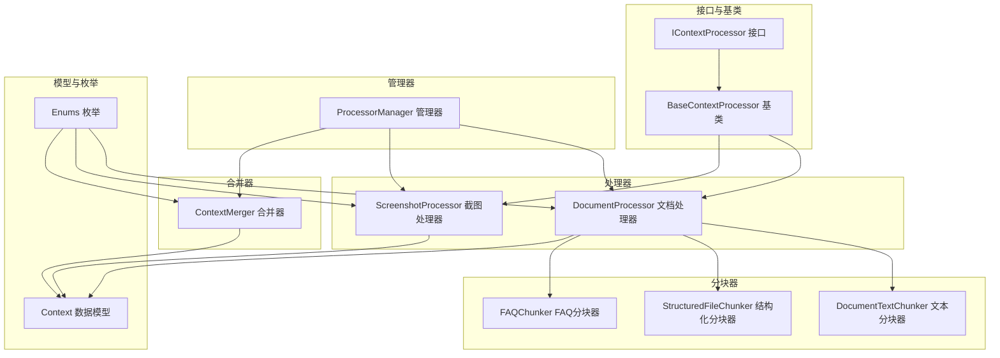
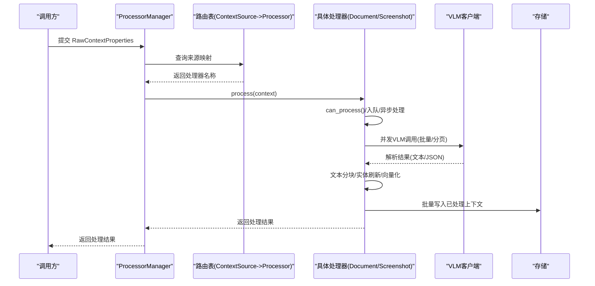
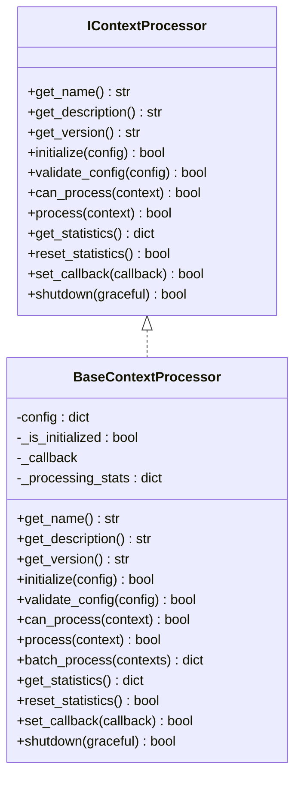
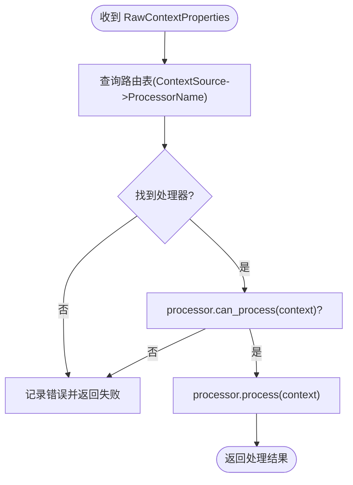
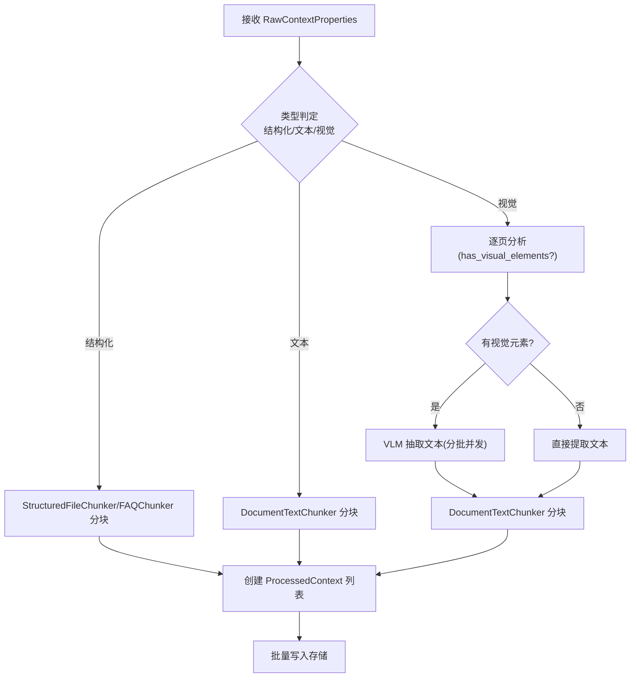
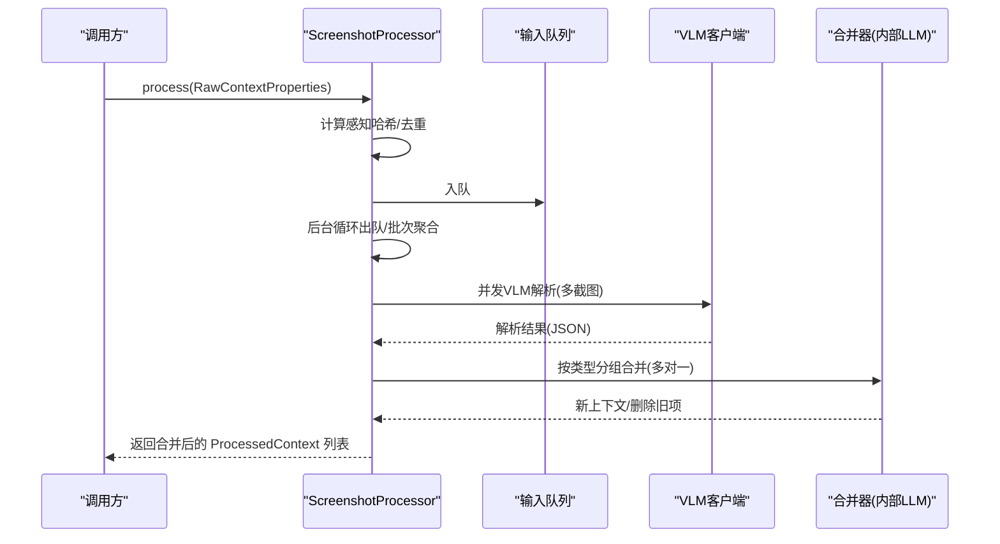
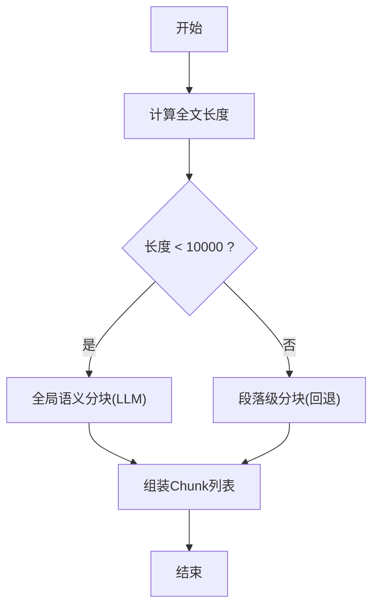
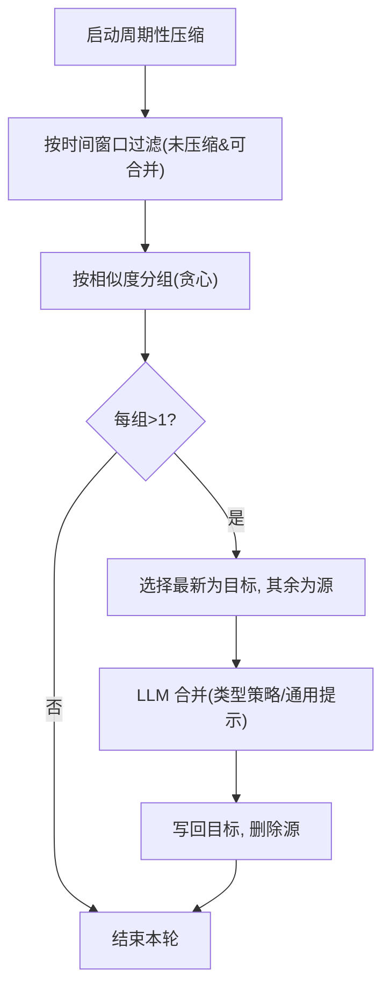
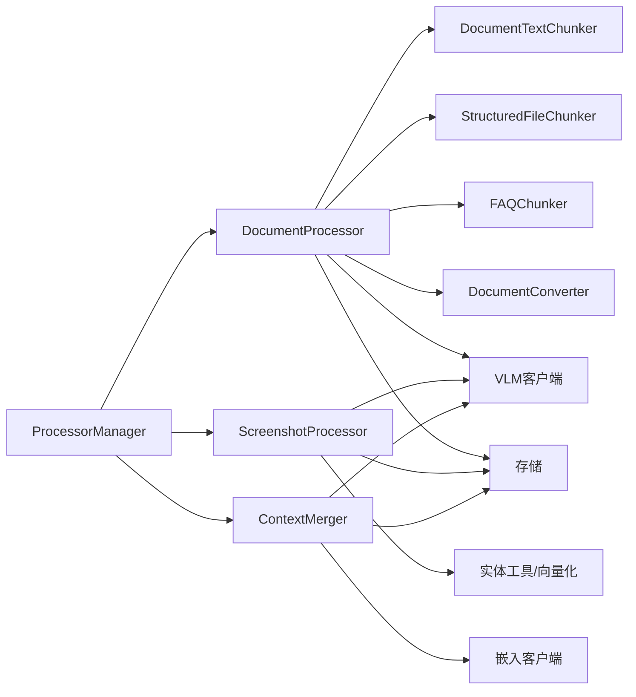

# 上下文处理

<cite>
**本文引用的文件列表**
- [processor_interface.py](file://opencontext/interfaces/processor_interface.py)
- [base_processor.py](file://opencontext/context_processing/processor/base_processor.py)
- [document_processor.py](file://opencontext/context_processing/processor/document_processor.py)
- [screenshot_processor.py](file://opencontext/context_processing/processor/screenshot_processor.py)
- [processor_manager.py](file://opencontext/managers/processor_manager.py)
- [document_text_chunker.py](file://opencontext/context_processing/chunker/document_text_chunker.py)
- [chunkers.py](file://opencontext/context_processing/chunker/chunkers.py)
- [context_merger.py](file://opencontext/context_processing/merger/context_merger.py)
- [context.py](file://opencontext/models/context.py)
- [enums.py](file://opencontext/models/enums.py)
- [processor_factory.py](file://opencontext/context_processing/processor/processor_factory.py)
- [example_document_processor.py](file://examples/example_document_processor.py)
- [example_screenshot_processor.py](file://examples/example_screenshot_processor.py)
</cite>

## 目录
1. [引言](#引言)
2. [项目结构](#项目结构)
3. [核心组件](#核心组件)
4. [架构总览](#架构总览)
5. [详细组件分析](#详细组件分析)
6. [依赖关系分析](#依赖关系分析)
7. [性能与延迟考量](#性能与延迟考量)
8. [故障排查指南](#故障排查指南)
9. [结论](#结论)
10. [附录](#附录)

## 引言
本文件围绕“上下文处理模块”的完整流水线展开，重点阐述以下方面：
- IContextProcessor 接口与 BaseContextProcessor 基类的通用处理模式
- ProcessorManager 的路由机制与按上下文来源（ContextSource）选择处理器
- DocumentProcessor 对 PDF/Office/图片/Markdown 等文档的处理策略，以及 VLM 的图像理解流程
- ScreenshotProcessor 利用 VLM 进行截图理解与实体抽取，并结合去重与缓存合并
- Chunker 模块（DocumentTextChunker）的文本切分策略
- Merger 模块对多来源上下文的智能合并与周期性压缩
- 处理流水线的时序图与延迟、错误处理机制

## 项目结构
上下文处理模块位于 opencontext/context_processing 下，包含处理器、分块器、合并器；管理器位于 opencontext/managers；数据模型与枚举位于 opencontext/models；示例位于 examples。

图表来源
- [processor_interface.py](file://opencontext/interfaces/processor_interface.py#L1-L136)
- [base_processor.py](file://opencontext/context_processing/processor/base_processor.py#L1-L261)
- [document_processor.py](file://opencontext/context_processing/processor/document_processor.py#L1-L653)
- [screenshot_processor.py](file://opencontext/context_processing/processor/screenshot_processor.py#L1-L590)
- [document_text_chunker.py](file://opencontext/context_processing/chunker/document_text_chunker.py#L1-L349)
- [chunkers.py](file://opencontext/context_processing/chunker/chunkers.py#L1-L439)
- [context_merger.py](file://opencontext/context_processing/merger/context_merger.py#L1-L981)
- [context.py](file://opencontext/models/context.py#L1-L200)
- [enums.py](file://opencontext/models/enums.py#L1-L200)

章节来源
- [processor_interface.py](file://opencontext/interfaces/processor_interface.py#L1-L136)
- [base_processor.py](file://opencontext/context_processing/processor/base_processor.py#L1-L261)
- [processor_manager.py](file://opencontext/managers/processor_manager.py#L1-L213)

## 核心组件
- IContextProcessor 接口：定义处理器的统一能力，包括初始化、配置校验、can_process/process、统计、回调、关闭等。
- BaseContextProcessor 基类：提供通用统计、配置、回调、批量处理、对象ID提取、生命周期管理等。
- ProcessorManager：负责注册处理器、设置合并器、按 ContextSource 路由、并发批处理、周期性压缩任务调度。
- DocumentProcessor：文档统一处理入口，支持结构化/文本/视觉三类文档，异步队列后台处理，VLM 批量推理，文本分块。
- ScreenshotProcessor：截图流处理，实时去重（感知哈希）、并发 VLM 解析、按类型合并、向量化与实体刷新。
- DocumentTextChunker：面向 VLM 输出的语义分块策略，长文档回退段落分块，短文档全局语义分块。
- ContextMerger：基于向量相似与类型策略的智能合并，支持周期性压缩与记忆管理。

章节来源
- [processor_interface.py](file://opencontext/interfaces/processor_interface.py#L1-L136)
- [base_processor.py](file://opencontext/context_processing/processor/base_processor.py#L1-L261)
- [processor_manager.py](file://opencontext/managers/processor_manager.py#L1-L213)
- [document_processor.py](file://opencontext/context_processing/processor/document_processor.py#L1-L653)
- [screenshot_processor.py](file://opencontext/context_processing/processor/screenshot_processor.py#L1-L590)
- [document_text_chunker.py](file://opencontext/context_processing/chunker/document_text_chunker.py#L1-L349)
- [context_merger.py](file://opencontext/context_processing/merger/context_merger.py#L1-L981)

## 架构总览
上下文处理采用“管理器路由 + 多处理器并行 + 后台队列 + 分块与合并”的流水线架构。管理器根据输入来源选择对应处理器，处理器内部通过线程队列与异步 VLM 调用实现高吞吐；分块器负责将大文本拆分为语义片段；合并器在存储层进行相似上下文的智能合并与周期性压缩。

图表来源
- [processor_manager.py](file://opencontext/managers/processor_manager.py#L120-L180)
- [document_processor.py](file://opencontext/context_processing/processor/document_processor.py#L186-L246)
- [screenshot_processor.py](file://opencontext/context_processing/processor/screenshot_processor.py#L149-L235)

## 详细组件分析

### IContextProcessor 接口与 BaseContextProcessor 基类
- IContextProcessor 定义了处理器的最小契约：名称、描述、版本、初始化、配置校验、can_process/process、统计、回调、关闭。
- BaseContextProcessor 实现了：
  - 统一的统计字段（处理数量、生成上下文数量、错误数）
  - 批量处理逻辑（按对象ID聚合结果）
  - 回调机制（处理完成后回调）
  - 生命周期管理（初始化/关闭）
  - 配置校验钩子（默认接受，子类可覆盖）

图表来源
- [processor_interface.py](file://opencontext/interfaces/processor_interface.py#L1-L136)
- [base_processor.py](file://opencontext/context_processing/processor/base_processor.py#L1-L261)

章节来源
- [processor_interface.py](file://opencontext/interfaces/processor_interface.py#L1-L136)
- [base_processor.py](file://opencontext/context_processing/processor/base_processor.py#L1-L261)

### ProcessorManager 路由机制
- 路由表：将 ContextSource 映射到处理器名称（如 SCREENSHOT->screenshot_processor、LOCAL_FILE/WEB_LINK/VAULT->document_processor）。
- 单条处理：根据来源查表，检查 can_process 后调用 process。
- 批量处理：ThreadPoolExecutor 并发提交，收集 future 结果。
- 周期性压缩：定时器触发 ContextMerger 的 periodic_memory_compression(interval)，默认间隔 1800 秒。

图表来源
- [processor_manager.py](file://opencontext/managers/processor_manager.py#L120-L180)

章节来源
- [processor_manager.py](file://opencontext/managers/processor_manager.py#L1-L213)

### DocumentProcessor 文档处理流程
- 支持格式：PDF、DOCX、DOC、PPTX、PPT、PNG/JPG/GIF/BMP/WEBP、XLSX/XLS/CSV/JSONL、MD、TXT。
- 处理策略：
  - 结构化文档：使用 StructuredFileChunker 或 FAQChunker 分块
  - 文本内容：使用 DocumentTextChunker 分块
  - 视觉文档：按页分析，纯文本页直接提取，含图表页使用 VLM 抽取文本，再统一分块
- VLM 批量推理：按 vlm_batch_size 分批并发，支持 Doc 图像嵌入直抽
- 后台队列：线程安全队列 + 后台循环，批量 upsert 存储
- 文本分块：短文档全局语义分块，长文档回退段落分块

图表来源
- [document_processor.py](file://opencontext/context_processing/processor/document_processor.py#L172-L403)
- [document_text_chunker.py](file://opencontext/context_processing/chunker/document_text_chunker.py#L1-L349)
- [chunkers.py](file://opencontext/context_processing/chunker/chunkers.py#L1-L439)

章节来源
- [document_processor.py](file://opencontext/context_processing/processor/document_processor.py#L1-L653)
- [document_text_chunker.py](file://opencontext/context_processing/chunker/document_text_chunker.py#L1-L349)
- [chunkers.py](file://opencontext/context_processing/chunker/chunkers.py#L1-L439)

### ScreenshotProcessor 截图处理流程
- 实时去重：计算感知哈希，阈值比较，重复则移动至最近使用或可选删除
- 并发 VLM：对每张截图异步调用 VLM，解析 JSON，构造 ProcessedContext
- 类型合并：按 ContextType 分组，调用 LLM 进行合并（支持“合并/新增”），更新缓存并删除旧项
- 向量化与实体刷新：并行执行向量化与实体刷新，最终输出合并后的上下文

图表来源
- [screenshot_processor.py](file://opencontext/context_processing/processor/screenshot_processor.py#L149-L235)
- [screenshot_processor.py](file://opencontext/context_processing/processor/screenshot_processor.py#L236-L532)

章节来源
- [screenshot_processor.py](file://opencontext/context_processing/processor/screenshot_processor.py#L1-L590)

### 文本分块策略（DocumentTextChunker）
- 短文档（字符数 < 10000）：全局语义分块，一次性让 LLM 生成分块
- 长文档：回退为段落级分块，避免 LLM 输入过长
- 机械回退：当 LLM 返回异常或不可解析时，按标点/句号/半句策略切分
- 并发 LLM：分批并发调用，异常自动降级

图表来源
- [document_text_chunker.py](file://opencontext/context_processing/chunker/document_text_chunker.py#L39-L118)
- [document_text_chunker.py](file://opencontext/context_processing/chunker/document_text_chunker.py#L255-L319)

章节来源
- [document_text_chunker.py](file://opencontext/context_processing/chunker/document_text_chunker.py#L1-L349)

### 合并器与周期性压缩（ContextMerger）
- 智能合并：按 ContextType 初始化策略，基于向量相似度寻找最佳目标，支持“关联合并/相似度合并”
- LLM 合并：当无智能策略或失败时，使用类型特定/通用提示词进行合并
- 周期性压缩：按时间窗口（默认 30 分钟）扫描未压缩且可合并上下文，按相似度聚合并合并，删除源上下文
- 记忆管理：支持智能清理与记忆强化（提升重要性、重置遗忘状态）

图表来源
- [context_merger.py](file://opencontext/context_processing/merger/context_merger.py#L465-L547)

章节来源
- [context_merger.py](file://opencontext/context_processing/merger/context_merger.py#L1-L981)

## 依赖关系分析
- 处理器依赖：
  - DocumentProcessor 依赖 DocumentTextChunker、StructuredFileChunker、FAQChunker、DocumentConverter、VLM 客户端、存储
  - ScreenshotProcessor 依赖 VLM 客户端、实体工具、向量化客户端、存储
  - ContextMerger 依赖存储后端、嵌入客户端、LLM 客户端、类型策略工厂
- 管理器依赖：
  - ProcessorManager 注册处理器、设置合并器、按 ContextSource 路由、并发批处理、调度周期性压缩
- 模型与枚举：
  - RawContextProperties/ProcessedContext/ContextProperties/Vectorize/Chunk
  - ContextSource/ContextType/ContentFormat/FileType/STRUCTURED_FILE_TYPES

图表来源
- [processor_manager.py](file://opencontext/managers/processor_manager.py#L1-L213)
- [document_processor.py](file://opencontext/context_processing/processor/document_processor.py#L1-L653)
- [screenshot_processor.py](file://opencontext/context_processing/processor/screenshot_processor.py#L1-L590)
- [context_merger.py](file://opencontext/context_processing/merger/context_merger.py#L1-L981)

章节来源
- [processor_manager.py](file://opencontext/managers/processor_manager.py#L1-L213)
- [document_processor.py](file://opencontext/context_processing/processor/document_processor.py#L1-L653)
- [screenshot_processor.py](file://opencontext/context_processing/processor/screenshot_processor.py#L1-L590)
- [context_merger.py](file://opencontext/context_processing/merger/context_merger.py#L1-L981)

## 性能与延迟考量
- 后台队列与异步 VLM：
  - DocumentProcessor 使用线程队列 + 后台循环，减少主线程阻塞；VLM 批量并发，按 vlm_batch_size 控制吞吐
  - ScreenshotProcessor 使用线程队列 + 批次聚合，异步并发 VLM，降低单图延迟
- 文本分块：
  - 短文档走全局语义分块，长文档回退段落分块，避免 LLM 输入超限
- 存储写入：
  - 批量 upsert，减少 IO 次数
- 周期性压缩：
  - 默认 1800 秒一次，避免频繁扫描；按时间窗口与相似度聚类，降低合并成本

章节来源
- [document_processor.py](file://opencontext/context_processing/processor/document_processor.py#L197-L246)
- [screenshot_processor.py](file://opencontext/context_processing/processor/screenshot_processor.py#L172-L235)
- [document_text_chunker.py](file://opencontext/context_processing/chunker/document_text_chunker.py#L39-L118)
- [context_merger.py](file://opencontext/context_processing/merger/context_merger.py#L465-L547)

## 故障排查指南
- 初始化失败：
  - 检查处理器 initialize/validate_config 日志，确认配置是否有效
- 处理异常：
  - BaseContextProcessor 的 batch_process 会捕获异常并增加错误统计；各处理器内部也记录异常
- VLM 调用失败：
  - ScreenshotProcessor 与 DocumentProcessor 在 VLM 调用处有异常捕获与记录，必要时抛出运行时错误
- 去重与文件删除：
  - 截图去重开启删除时，若删除失败会记录错误
- 周期性压缩：
  - 若合并器未设置或不支持 periodic_memory_compression，将跳过；异常会被记录并继续调度下一次

章节来源
- [base_processor.py](file://opencontext/context_processing/processor/base_processor.py#L133-L168)
- [document_processor.py](file://opencontext/context_processing/processor/document_processor.py#L419-L469)
- [screenshot_processor.py](file://opencontext/context_processing/processor/screenshot_processor.py#L114-L171)
- [processor_manager.py](file://opencontext/managers/processor_manager.py#L46-L79)

## 结论
上下文处理模块以“接口 + 基类 + 管理器 + 多处理器 + 分块 + 合并”的方式构建了高扩展、高吞吐、可维护的流水线。DocumentProcessor 与 ScreenshotProcessor 分别覆盖结构化/文本/视觉与截图两大场景，配合智能分块与 VLM 推理，实现高质量上下文生成；ContextMerger 通过相似度与类型策略进行合并，并通过周期性压缩控制内存占用。ProcessorManager 提供统一路由与并发控制，确保系统稳定高效运行。

## 附录
- 示例用法：
  - 文档处理器示例：[example_document_processor.py](file://examples/example_document_processor.py#L1-L237)
  - 截图处理器示例：[example_screenshot_processor.py](file://examples/example_screenshot_processor.py#L1-L181)
- 工厂注册：
  - 处理器工厂：[processor_factory.py](file://opencontext/context_processing/processor/processor_factory.py#L1-L175)

章节来源
- [example_document_processor.py](file://examples/example_document_processor.py#L1-L237)
- [example_screenshot_processor.py](file://examples/example_screenshot_processor.py#L1-L181)
- [processor_factory.py](file://opencontext/context_processing/processor/processor_factory.py#L1-L175)