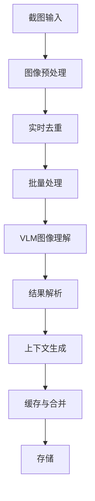
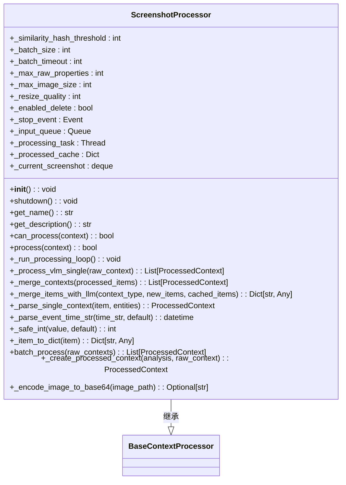
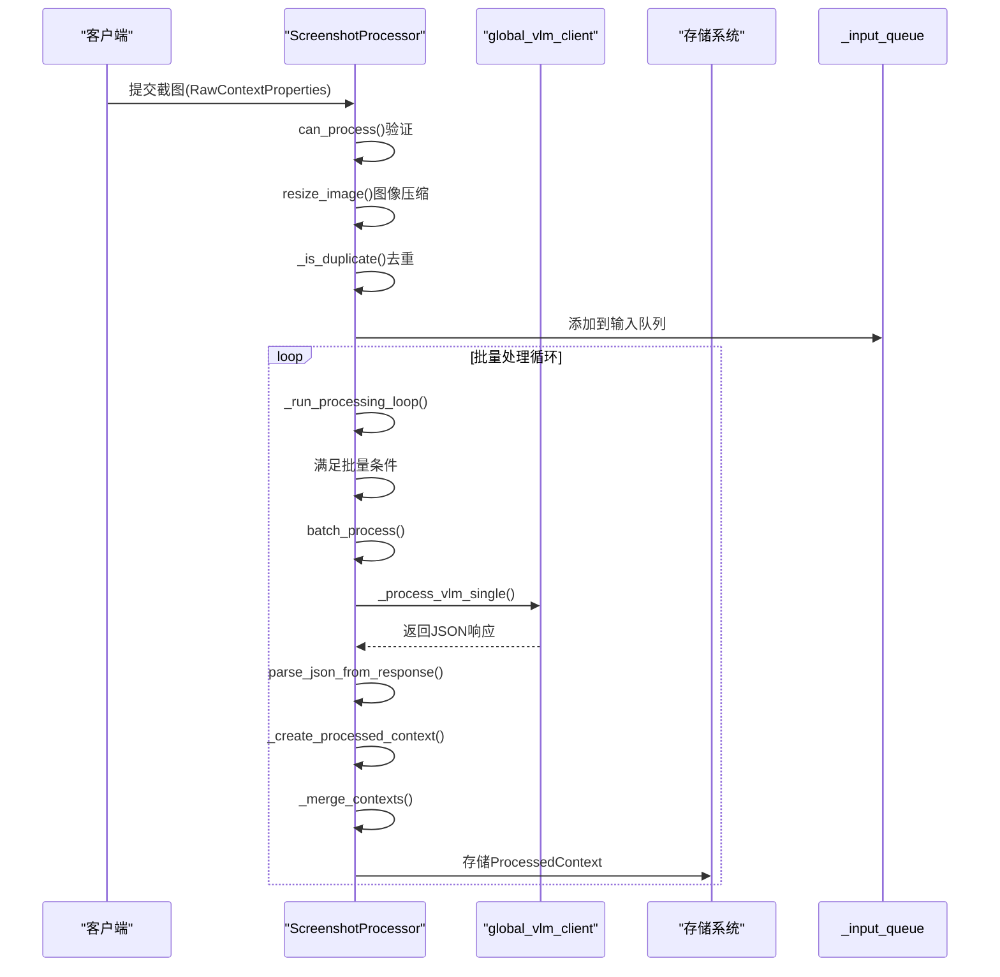
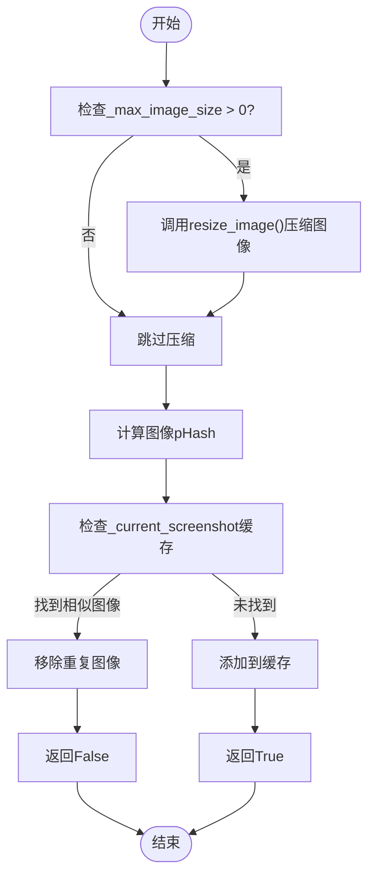
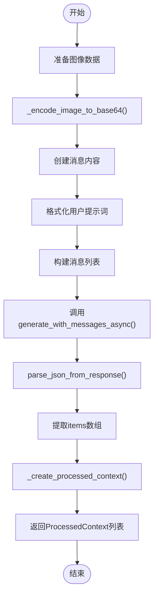
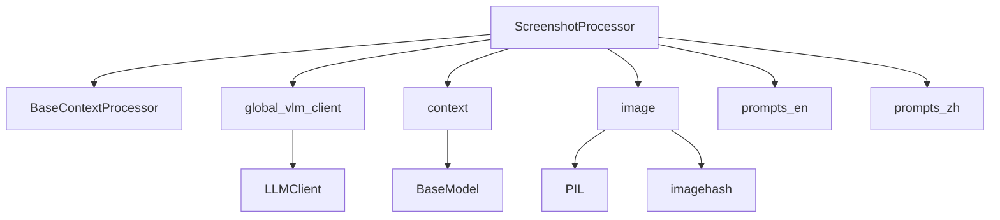
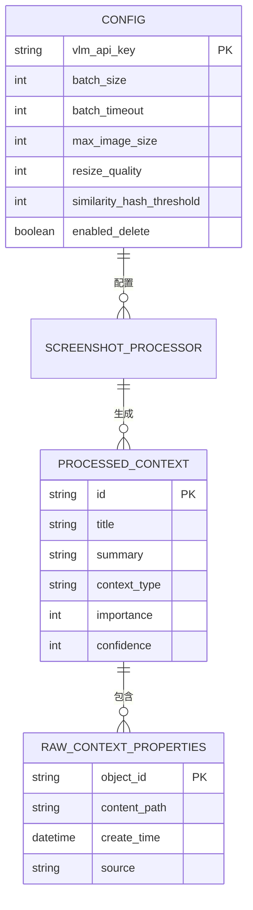

# 截图处理

<cite>
**本文档引用文件**   
- [screenshot_processor.py](file://opencontext/context_processing/processor/screenshot_processor.py)
- [global_vlm_client.py](file://opencontext/llm/global_vlm_client.py)
- [context.py](file://opencontext/models/context.py)
- [image.py](file://opencontext/utils/image.py)
- [prompts_en.yaml](file://config/prompts_en.yaml)
- [prompts_zh.yaml](file://config/prompts_zh.yaml)
- [example_screenshot_processor.py](file://examples/example_screenshot_processor.py)
</cite>

## 目录
1. [简介](#简介)
2. [核心组件分析](#核心组件分析)
3. [截图处理流程架构](#截图处理流程架构)
4. [详细组件分析](#详细组件分析)
5. [依赖分析](#依赖分析)
6. [性能与优化策略](#性能与优化策略)
7. [配置与使用示例](#配置与使用示例)
8. [结论](#结论)

## 简介
本文档详细阐述了`ScreenshotProcessor`类的截图处理流程。该处理器利用视觉语言模型（VLM）进行图像理解，将屏幕截图发送给`global_vlm_client`并解析返回的结构化描述。文档深入分析了`process`方法的实现细节，包括图像预处理、提示词工程和结果后处理。同时，解释了处理器如何生成丰富的上下文信息，包括界面元素识别、操作意图推断和内容摘要，并讨论了处理延迟问题和成本优化策略。

## 核心组件分析
`ScreenshotProcessor`是处理和分析截图以提取上下文信息的核心类。它继承自`BaseContextProcessor`，实现了`can_process`和`process`等抽象方法。该处理器支持实时去重、上下文感知的信息提取和周期性内存压缩。其主要功能包括：
- 通过`_input_queue`接收截图任务
- 使用`_current_screenshot`缓存进行实时去重
- 调用VLM进行图像理解
- 生成结构化的`ProcessedContext`对象

**Section sources**
- [screenshot_processor.py](file://opencontext/context_processing/processor/screenshot_processor.py#L46-L94)

## 截图处理流程架构



**Diagram sources **
- [screenshot_processor.py](file://opencontext/context_processing/processor/screenshot_processor.py#L148-L169)
- [screenshot_processor.py](file://opencontext/context_processing/processor/screenshot_processor.py#L235-L300)

## 详细组件分析

### ScreenshotProcessor类分析
`ScreenshotProcessor`类是截图处理的核心实现，负责从图像预处理到最终上下文生成的完整流程。

#### 初始化与配置


**Diagram sources **
- [screenshot_processor.py](file://opencontext/context_processing/processor/screenshot_processor.py#L46-L94)

#### 处理流程分析


**Diagram sources **
- [screenshot_processor.py](file://opencontext/context_processing/processor/screenshot_processor.py#L148-L169)
- [screenshot_processor.py](file://opencontext/context_processing/processor/screenshot_processor.py#L235-L300)
- [screenshot_processor.py](file://opencontext/context_processing/processor/screenshot_processor.py#L497-L530)

### 图像预处理与去重
处理器在处理截图前会进行图像预处理和实时去重，以优化性能和减少冗余处理。



**Diagram sources **
- [screenshot_processor.py](file://opencontext/context_processing/processor/screenshot_processor.py#L157-L159)
- [screenshot_processor.py](file://opencontext/context_processing/processor/screenshot_processor.py#L113-L146)
- [image.py](file://opencontext/utils/image.py#L46-L67)

### VLM交互与结果解析
处理器通过`global_vlm_client`与视觉语言模型进行交互，发送图像并解析返回的结构化数据。



**Diagram sources **
- [screenshot_processor.py](file://opencontext/context_processing/processor/screenshot_processor.py#L235-L300)
- [global_vlm_client.py](file://opencontext/llm/global_vlm_client.py#L176-L232)

## 依赖分析



**Diagram sources **
- [screenshot_processor.py](file://opencontext/context_processing/processor/screenshot_processor.py#L22-L38)
- [global_vlm_client.py](file://opencontext/llm/global_vlm_client.py#L19-L21)
- [context.py](file://opencontext/models/context.py#L21-L22)
- [image.py](file://opencontext/utils/image.py#L12-L13)

**Section sources**
- [screenshot_processor.py](file://opencontext/context_processing/processor/screenshot_processor.py#L1-L590)
- [global_vlm_client.py](file://opencontext/llm/global_vlm_client.py#L1-L317)
- [context.py](file://opencontext/models/context.py#L1-L343)
- [image.py](file://opencontext/utils/image.py#L1-L68)

## 性能与优化策略
`ScreenshotProcessor`实现了多种性能优化策略来处理截图延迟和成本问题：

1. **图像压缩**：通过`_max_image_size`和`_resize_quality`配置项控制图像大小和质量，减少传输和处理开销
2. **批量处理**：使用`_batch_size`配置项进行批量处理，提高VLM调用效率
3. **实时去重**：通过`_similarity_hash_threshold`配置项使用pHash算法识别相似截图，避免重复处理
4. **异步处理**：采用后台线程模型`_processing_task`，将处理任务放入队列异步执行
5. **缓存机制**：使用`_processed_cache`缓存已处理的上下文，支持后续合并操作

这些策略共同作用，确保了截图处理的高效性和经济性。

**Section sources**
- [screenshot_processor.py](file://opencontext/context_processing/processor/screenshot_processor.py#L64-L70)
- [screenshot_processor.py](file://opencontext/context_processing/processor/screenshot_processor.py#L171-L233)

## 配置与使用示例
以下是配置VLM API密钥和调整截图处理参数的示例：



**Diagram sources **
- [screenshot_processor.py](file://opencontext/context_processing/processor/screenshot_processor.py#L64-L70)
- [context.py](file://opencontext/models/context.py#L35-L46)
- [context.py](file://opencontext/models/context.py#L131-L143)

使用示例代码展示了如何配置和使用`ScreenshotProcessor`：

```python
# 从example_screenshot_processor.py提取的使用示例
processor = ScreenshotProcessor()
raw_context = RawContextProperties(
    source=ContextSource.SCREENSHOT,
    content_path=screenshot_path,
    content_format=ContentFormat.IMAGE,
    create_time=datetime.now(),
    content_text="",
)
processed_contexts = await processor.batch_process([raw_context])
```

**Section sources**
- [example_screenshot_processor.py](file://examples/example_screenshot_processor.py#L106-L122)

## 结论
`ScreenshotProcessor`实现了一个完整的截图处理流水线，从图像预处理、VLM交互到上下文生成。它通过批量处理、异步执行和智能缓存等机制优化了性能和成本。处理器能够生成丰富的上下文信息，包括界面元素识别、操作意图推断和内容摘要，为后续的智能分析和决策提供了坚实的基础。