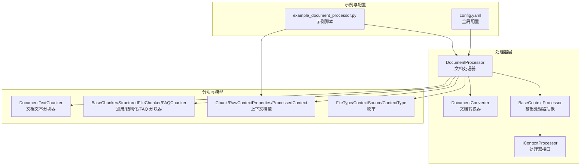
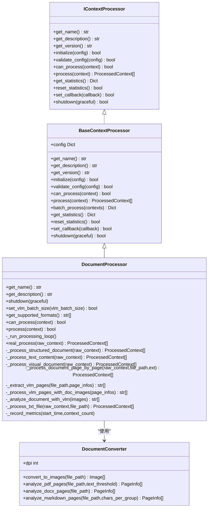
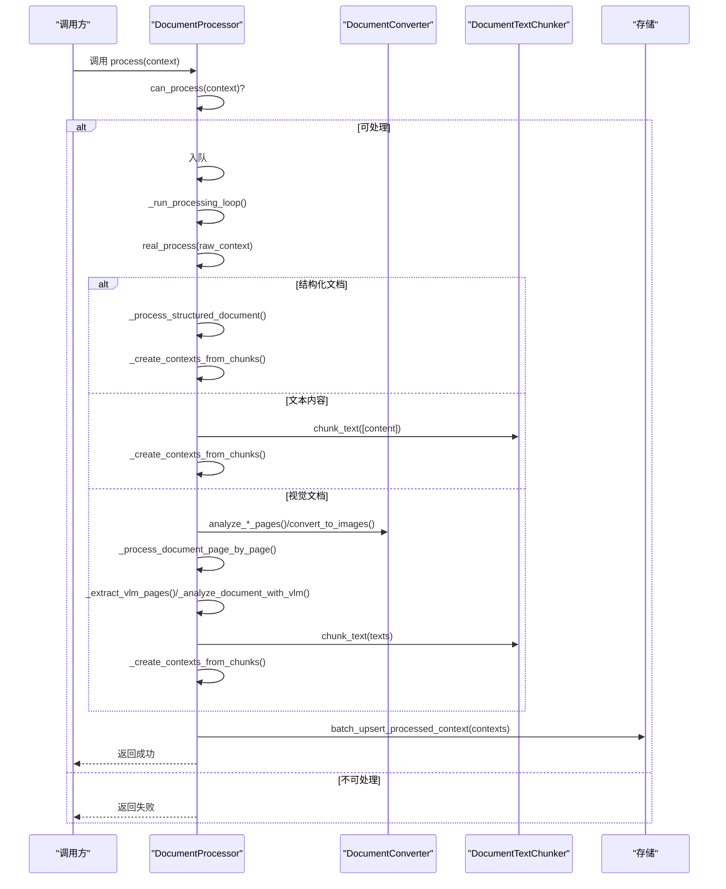
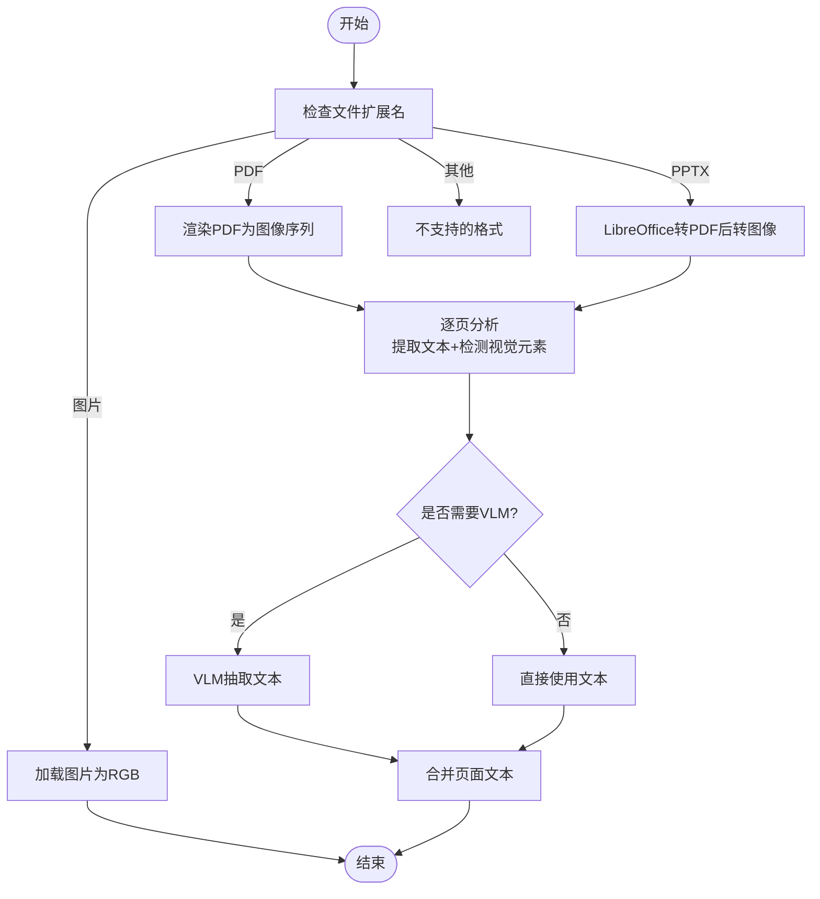
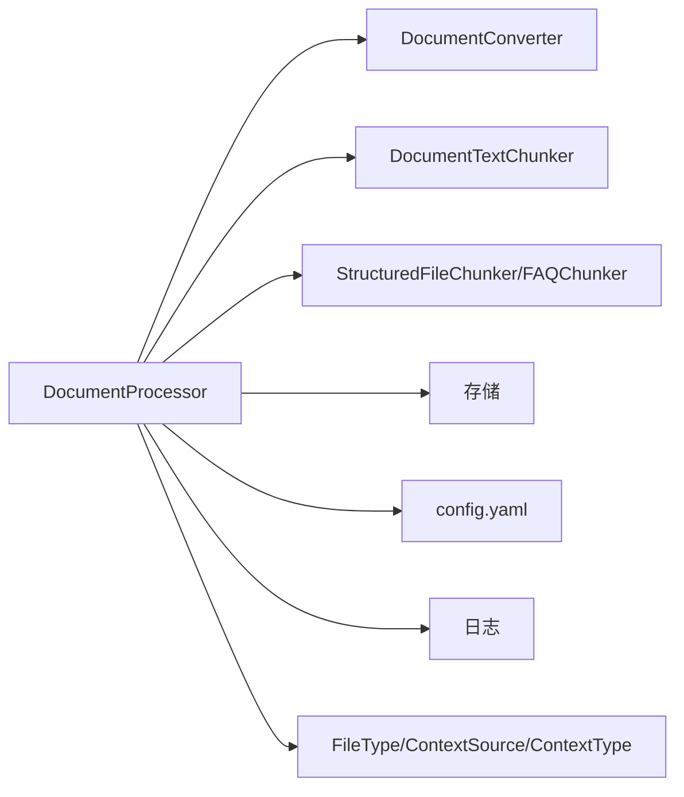

# 文档处理

<cite>
**本文引用的文件列表**
- [opencontext/context_processing/processor/document_processor.py](file://opencontext/context_processing/processor/document_processor.py)
- [opencontext/context_processing/processor/document_converter.py](file://opencontext/context_processing/processor/document_converter.py)
- [opencontext/context_processing/processor/base_processor.py](file://opencontext/context_processing/processor/base_processor.py)
- [opencontext/interfaces/processor_interface.py](file://opencontext/interfaces/processor_interface.py)
- [opencontext/models/context.py](file://opencontext/models/context.py)
- [opencontext/models/enums.py](file://opencontext/models/enums.py)
- [opencontext/context_processing/chunker/document_text_chunker.py](file://opencontext/context_processing/chunker/document_text_chunker.py)
- [opencontext/context_processing/chunker/chunkers.py](file://opencontext/context_processing/chunker/chunkers.py)
- [examples/example_document_processor.py](file://examples/example_document_processor.py)
- [config/config.yaml](file://config/config.yaml)
</cite>

## 目录
1. [简介](#简介)
2. [项目结构](#项目结构)
3. [核心组件](#核心组件)
4. [架构总览](#架构总览)
5. [详细组件分析](#详细组件分析)
6. [依赖关系分析](#依赖关系分析)
7. [性能与优化](#性能与优化)
8. [故障排查指南](#故障排查指南)
9. [结论](#结论)
10. [附录](#附录)

## 简介
本文围绕文档处理流程进行系统化说明，重点从 DocumentProcessor 类入手，阐述其如何继承 BaseContextProcessor 并实现 IContextProcessor 接口；详解 DocumentConverter 如何将 PDF、Office 文档、图片、Markdown、纯文本等多格式统一转换为可处理的文本表示；梳理处理器支持的文件类型（通过 can_process 判断）、处理流程（文件读取、格式转换、文本提取、元数据生成）；给出 process 方法的时序图，展示从 RawContextProperties 到 ProcessedContext 的转换过程；讨论文档处理中的错误处理机制（如损坏文件、密码保护文档）与性能优化策略（异步处理、批处理、缓存）；最后提供实际代码示例，说明如何配置与调用文档处理器。

## 项目结构
文档处理相关的核心代码位于 opencontext/context_processing/processor 目录，配合 chunker、models、enums 等模块共同完成端到端的文档处理链路。示例脚本 examples/example_document_processor.py 展示了如何创建 RawContextProperties 并调用 DocumentProcessor 进行处理。

图表来源
- [opencontext/context_processing/processor/document_processor.py](file://opencontext/context_processing/processor/document_processor.py#L1-L120)
- [opencontext/context_processing/processor/document_converter.py](file://opencontext/context_processing/processor/document_converter.py#L1-L120)
- [opencontext/context_processing/processor/base_processor.py](file://opencontext/context_processing/processor/base_processor.py#L1-L120)
- [opencontext/interfaces/processor_interface.py](file://opencontext/interfaces/processor_interface.py#L1-L120)
- [opencontext/context_processing/chunker/document_text_chunker.py](file://opencontext/context_processing/chunker/document_text_chunker.py#L1-L120)
- [opencontext/context_processing/chunker/chunkers.py](file://opencontext/context_processing/chunker/chunkers.py#L1-L120)
- [opencontext/models/context.py](file://opencontext/models/context.py#L1-L120)
- [opencontext/models/enums.py](file://opencontext/models/enums.py#L1-L120)
- [examples/example_document_processor.py](file://examples/example_document_processor.py#L1-L120)
- [config/config.yaml](file://config/config.yaml#L1-L120)

章节来源
- [opencontext/context_processing/processor/document_processor.py](file://opencontext/context_processing/processor/document_processor.py#L1-L120)
- [opencontext/context_processing/processor/document_converter.py](file://opencontext/context_processing/processor/document_converter.py#L1-L120)
- [opencontext/context_processing/processor/base_processor.py](file://opencontext/context_processing/processor/base_processor.py#L1-L120)
- [opencontext/interfaces/processor_interface.py](file://opencontext/interfaces/processor_interface.py#L1-L120)
- [opencontext/context_processing/chunker/document_text_chunker.py](file://opencontext/context_processing/chunker/document_text_chunker.py#L1-L120)
- [opencontext/context_processing/chunker/chunkers.py](file://opencontext/context_processing/chunker/chunkers.py#L1-L120)
- [opencontext/models/context.py](file://opencontext/models/context.py#L1-L120)
- [opencontext/models/enums.py](file://opencontext/models/enums.py#L1-L120)
- [examples/example_document_processor.py](file://examples/example_document_processor.py#L1-L120)
- [config/config.yaml](file://config/config.yaml#L1-L120)

## 核心组件
- DocumentProcessor：统一文档处理器，负责根据文件类型分流到结构化/文本/视觉文档处理路径，并通过 DocumentConverter 将非文本格式转换为图像或文本，再用 DocumentTextChunker 或结构化分块器切分为语义片段，最终生成 ProcessedContext。
- DocumentConverter：提供文档到图像的转换能力（PDF、PPTX、图片），以及页面级分析（PDF/DOCX/Markdown），识别是否包含视觉元素，用于后续 VLM 文本抽取策略选择。
- BaseContextProcessor：处理器抽象基类，定义统一的生命周期、统计、回调、批量处理等通用能力。
- IContextProcessor：处理器接口，约束处理器必须实现的方法集合。
- DocumentTextChunker/StructuredFileChunker：文本与结构化文件的分块器，保证大文档的内存友好与语义完整性。
- 模型与枚举：RawContextProperties、ProcessedContext、Chunk 等数据模型，以及 FileType、ContextSource、ContextType 等枚举，支撑跨类型处理与元数据管理。

章节来源
- [opencontext/context_processing/processor/document_processor.py](file://opencontext/context_processing/processor/document_processor.py#L1-L120)
- [opencontext/context_processing/processor/document_converter.py](file://opencontext/context_processing/processor/document_converter.py#L1-L120)
- [opencontext/context_processing/processor/base_processor.py](file://opencontext/context_processing/processor/base_processor.py#L1-L120)
- [opencontext/interfaces/processor_interface.py](file://opencontext/interfaces/processor_interface.py#L1-L120)
- [opencontext/context_processing/chunker/document_text_chunker.py](file://opencontext/context_processing/chunker/document_text_chunker.py#L1-L120)
- [opencontext/context_processing/chunker/chunkers.py](file://opencontext/context_processing/chunker/chunkers.py#L1-L120)
- [opencontext/models/context.py](file://opencontext/models/context.py#L1-L120)
- [opencontext/models/enums.py](file://opencontext/models/enums.py#L1-L120)

## 架构总览
DocumentProcessor 作为核心编排者，结合 DocumentConverter 的页面分析与图像转换能力，以及多种分块器，形成“格式感知”的统一处理管线。其继承关系与接口契约如下：

图表来源
- [opencontext/context_processing/processor/document_processor.py](file://opencontext/context_processing/processor/document_processor.py#L1-L120)
- [opencontext/context_processing/processor/document_converter.py](file://opencontext/context_processing/processor/document_converter.py#L1-L120)
- [opencontext/context_processing/processor/base_processor.py](file://opencontext/context_processing/processor/base_processor.py#L1-L120)
- [opencontext/interfaces/processor_interface.py](file://opencontext/interfaces/processor_interface.py#L1-L120)

## 详细组件分析

### DocumentProcessor 组件
- 继承关系与接口实现
  - 继承 BaseContextProcessor，复用初始化、统计、回调、批量处理等通用能力。
  - 实现 IContextProcessor 接口，提供名称、描述、版本、can_process、process 等方法。
- 配置与并发
  - 从全局配置加载文档处理开关、DPI、VLM 批大小、文本阈值等参数。
  - 后台线程维护输入队列，按批次超时消费，异步执行 real_process 并批量写入存储。
- 文件类型判定
  - 支持扩展名白名单（PDF、图片、DOCX、PPTX、表格、JSONL、Markdown、TXT 等）。
  - 基于 FileType 枚举与特殊规则（如 FAQ_XLSX）区分结构化文档。
- 处理路径
  - 结构化文档：使用结构化分块器（含 FAQ 分块器）切分后生成 ProcessedContext。
  - 文本内容：直接使用 DocumentTextChunker 切分。
  - 视觉文档：PDF/DOCX/Markdown/TXT 等采用页面级策略，先分析页面是否含视觉元素，再决定直接文本抽取或 VLM 抽取，最后统一切分与生成上下文。
- 元数据与向量化
  - 生成 ProcessedContext 时填充知识元数据（来源、文件路径、原始 ID 等），向量化字段设置为文本内容。

图表来源
- [opencontext/context_processing/processor/document_processor.py](file://opencontext/context_processing/processor/document_processor.py#L120-L420)
- [opencontext/context_processing/processor/document_converter.py](file://opencontext/context_processing/processor/document_converter.py#L1-L200)
- [opencontext/context_processing/chunker/document_text_chunker.py](file://opencontext/context_processing/chunker/document_text_chunker.py#L1-L120)

章节来源
- [opencontext/context_processing/processor/document_processor.py](file://opencontext/context_processing/processor/document_processor.py#L1-L200)
- [opencontext/context_processing/processor/document_processor.py](file://opencontext/context_processing/processor/document_processor.py#L200-L420)
- [opencontext/context_processing/processor/document_processor.py](file://opencontext/context_processing/processor/document_processor.py#L420-L653)

### DocumentConverter 组件
- 图像转换
  - PDF：按 DPI 渲染为 RGB 图像序列。
  - PPTX：通过 LibreOffice 转 PDF 再转图像（需安装 LibreOffice）。
  - 图片：直接加载为 RGB 图像。
- 页面级分析
  - PDF：提取文本并检测页面是否包含图像/表格，结合阈值判断是否需要 VLM。
  - DOCX：按段落与表格顺序拆组，提取嵌入图片，便于后续 VLM 分析。
  - Markdown：按标题与字符数分组，提取本地/远程图片，便于图文混合处理。
- 错误处理
  - 文件不存在、LibreOffice 转换失败、图像加载异常等均记录日志并抛出异常，便于上层捕获与降级。

图表来源
- [opencontext/context_processing/processor/document_converter.py](file://opencontext/context_processing/processor/document_converter.py#L1-L200)
- [opencontext/context_processing/processor/document_converter.py](file://opencontext/context_processing/processor/document_converter.py#L200-L420)
- [opencontext/context_processing/processor/document_converter.py](file://opencontext/context_processing/processor/document_converter.py#L420-L607)

章节来源
- [opencontext/context_processing/processor/document_converter.py](file://opencontext/context_processing/processor/document_converter.py#L1-L200)
- [opencontext/context_processing/processor/document_converter.py](file://opencontext/context_processing/processor/document_converter.py#L200-L420)
- [opencontext/context_processing/processor/document_converter.py](file://opencontext/context_processing/processor/document_converter.py#L420-L607)

### 分块器与模型
- DocumentTextChunker
  - 对长文档采用全局语义分块策略，短文档则使用 LLM 辅助智能切分；超过阈值回退为段落级切分。
  - 使用异步批量调用 LLM，提升吞吐。
- 结构化分块器（StructuredFileChunker/FAQChunker）
  - 流式读取 CSV/XLSX/JSONL，避免一次性加载大文件导致内存压力。
- 数据模型
  - RawContextProperties：原始上下文属性（来源、路径、文本、类型等）。
  - ProcessedContext：处理后的上下文（属性、抽取信息、向量化、元数据）。
  - Chunk：分块单元（文本、关键词、实体等）。

章节来源
- [opencontext/context_processing/chunker/document_text_chunker.py](file://opencontext/context_processing/chunker/document_text_chunker.py#L1-L200)
- [opencontext/context_processing/chunker/chunkers.py](file://opencontext/context_processing/chunker/chunkers.py#L1-L200)
- [opencontext/models/context.py](file://opencontext/models/context.py#L1-L200)

## 依赖关系分析
- 继承与接口
  - DocumentProcessor 继承 BaseContextProcessor，后者实现 IContextProcessor。
- 组件耦合
  - DocumentProcessor 依赖 DocumentConverter（图像转换与页面分析）、DocumentTextChunker/结构化分块器（切分）、存储（批量写入）。
- 外部依赖
  - PDF：pypdfium2（渲染 PDF）、pypdf（提取文本）。
  - DOCX：python-docx（解析与图片提取）。
  - PPTX：LibreOffice（转 PDF）。
  - VLM：异步消息调用生成文本。
- 配置依赖
  - 通过全局配置加载文档处理开关、DPI、VLM 批大小、文本阈值等。

图表来源
- [opencontext/context_processing/processor/document_processor.py](file://opencontext/context_processing/processor/document_processor.py#L1-L120)
- [opencontext/context_processing/processor/document_converter.py](file://opencontext/context_processing/processor/document_converter.py#L1-L120)
- [opencontext/context_processing/chunker/document_text_chunker.py](file://opencontext/context_processing/chunker/document_text_chunker.py#L1-L120)
- [opencontext/context_processing/chunker/chunkers.py](file://opencontext/context_processing/chunker/chunkers.py#L1-L120)
- [config/config.yaml](file://config/config.yaml#L1-L120)
- [opencontext/models/enums.py](file://opencontext/models/enums.py#L1-L120)

章节来源
- [opencontext/context_processing/processor/document_processor.py](file://opencontext/context_processing/processor/document_processor.py#L1-L120)
- [opencontext/context_processing/processor/document_converter.py](file://opencontext/context_processing/processor/document_converter.py#L1-L120)
- [opencontext/context_processing/chunker/document_text_chunker.py](file://opencontext/context_processing/chunker/document_text_chunker.py#L1-L120)
- [opencontext/context_processing/chunker/chunkers.py](file://opencontext/context_processing/chunker/chunkers.py#L1-L120)
- [config/config.yaml](file://config/config.yaml#L1-L120)
- [opencontext/models/enums.py](file://opencontext/models/enums.py#L1-L120)

## 性能与优化
- 异步与批处理
  - VLM 文本抽取采用异步 gather 并发执行，按 vlm_batch_size 分批，减少等待时间。
  - 文档处理循环使用队列与超时控制，避免阻塞。
- 缓存与内存
  - 分块器内部使用 LRU 缓存句子边界，降低重复计算成本。
  - 结构化分块器采用流式读取，避免大文件内存峰值。
- DPI 与分辨率
  - 通过 DPI 控制 PDF 转图像质量与体积，平衡准确率与成本。
- 配置建议
  - 在 config.yaml 中调整 document_processing.dpi、document_processing.batch_size、processing.document_processor.batch_size 等参数以适配硬件与业务需求。

章节来源
- [opencontext/context_processing/processor/document_processor.py](file://opencontext/context_processing/processor/document_processor.py#L1-L120)
- [opencontext/context_processing/processor/document_processor.py](file://opencontext/context_processing/processor/document_processor.py#L420-L653)
- [opencontext/context_processing/chunker/chunkers.py](file://opencontext/context_processing/chunker/chunkers.py#L1-L120)
- [config/config.yaml](file://config/config.yaml#L1-L120)

## 故障排查指南
- 常见问题与处理
  - 文件不存在：DocumentConverter 在转换前校验路径，不存在时抛出异常；建议在调用前确保路径有效。
  - LibreOffice 未安装：PPTX 转图像依赖 LibreOffice，未安装会报错；请按提示安装后再试。
  - PDF/DOCX/图片损坏：转换或加载异常时记录日志并抛出异常；建议先验证文件完整性。
  - 密码保护文档：当前实现未显式处理密码保护；若遇到无法打开的情况，请先解密或导出为可读格式。
  - VLM 调用失败：异步任务中捕获异常并记录；检查 LLM 基础配置（地址、密钥、模型）。
- 日志与指标
  - 处理耗时与上下文数量通过指标记录；可在监控模块查看。
  - 异常通过日志记录，便于定位具体文件与步骤。

章节来源
- [opencontext/context_processing/processor/document_converter.py](file://opencontext/context_processing/processor/document_converter.py#L1-L200)
- [opencontext/context_processing/processor/document_processor.py](file://opencontext/context_processing/processor/document_processor.py#L420-L653)
- [config/config.yaml](file://config/config.yaml#L1-L120)

## 结论
DocumentProcessor 通过“格式感知”的统一处理管线，将 PDF、Office 文档、图片、Markdown、纯文本等多种格式转换为统一的 ProcessedContext，结合 DocumentConverter 的页面分析与图像转换能力，以及多种分块器，实现了高鲁棒性与高性能的文档处理。其继承 BaseContextProcessor 并实现 IContextProcessor 接口，具备良好的扩展性与可维护性。通过合理的配置与异步批处理策略，能够在保证质量的同时提升吞吐与稳定性。

## 附录

### 支持的文件类型与处理策略
- 结构化文档：XLSX、XLS、CSV、JSONL、FAQ_XLSX（特殊规则）
- 视觉文档：PDF、DOCX、DOC、PPTX、PPT、PNG、JPG、JPEG、GIF、BMP、WEBP、MD（Markdown）
- 文本内容：TXT、MD（Markdown）

章节来源
- [opencontext/context_processing/processor/document_processor.py](file://opencontext/context_processing/processor/document_processor.py#L110-L170)
- [opencontext/models/enums.py](file://opencontext/models/enums.py#L1-L120)

### 配置项参考
- 文档处理开关与 DPI：document_processing.enabled、document_processing.dpi
- VLM 批大小与文本阈值：document_processing.batch_size、document_processing.text_threshold_per_page
- 文档处理器批大小与超时：processing.document_processor.batch_size、processing.document_processor.batch_timeout

章节来源
- [config/config.yaml](file://config/config.yaml#L1-L120)

### 示例：如何配置与调用
- 创建 RawContextProperties（指定来源、路径、内容格式、创建时间等）
- 调用 processor.can_process 判定是否可处理
- 调用 processor.real_process 执行处理，返回 ProcessedContext 列表
- 可选：processor.shutdown 关闭后台任务

章节来源
- [examples/example_document_processor.py](file://examples/example_document_processor.py#L1-L200)
- [opencontext/models/context.py](file://opencontext/models/context.py#L1-L120)
- [opencontext/context_processing/processor/document_processor.py](file://opencontext/context_processing/processor/document_processor.py#L120-L220)