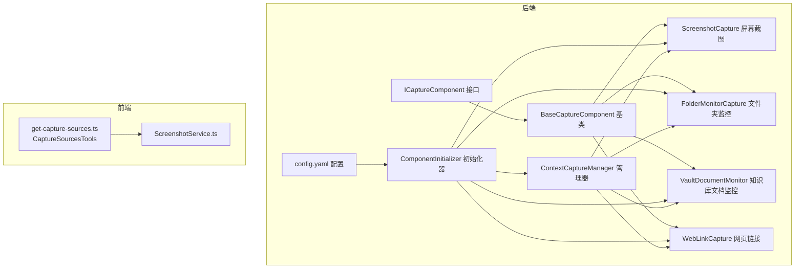
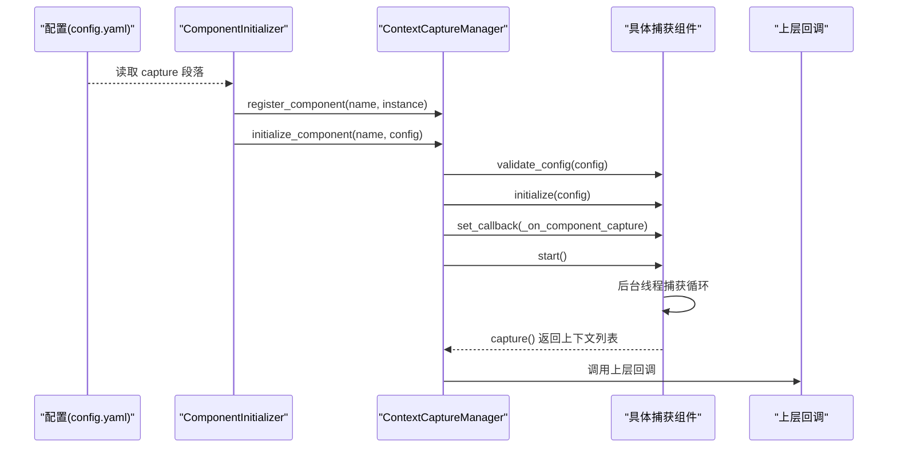
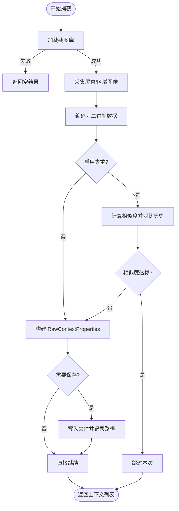
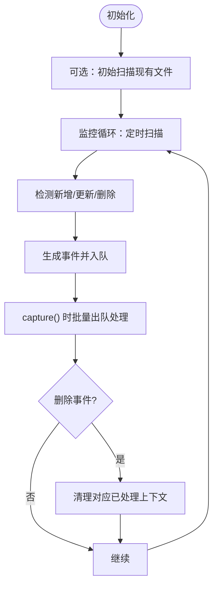
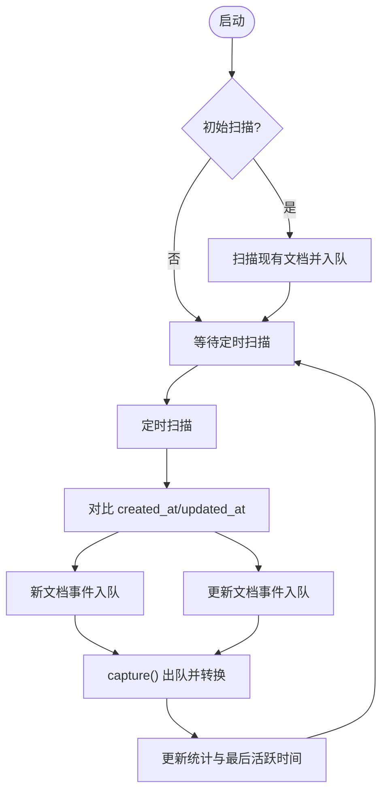
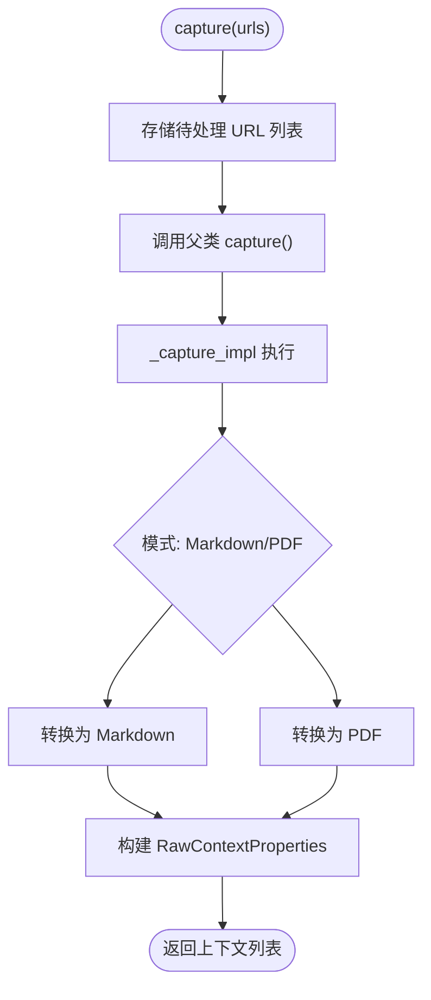
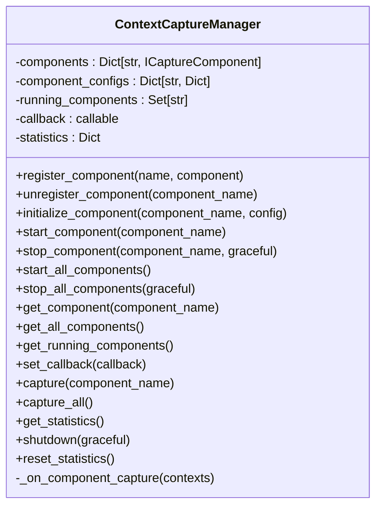
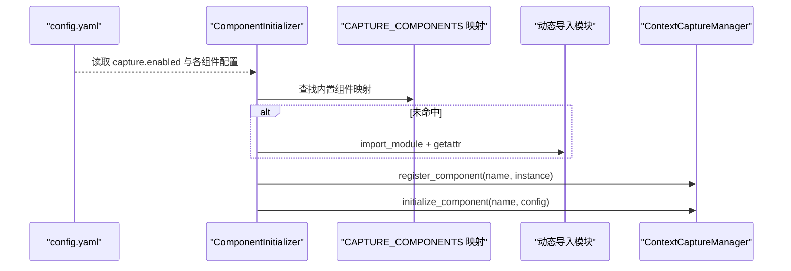
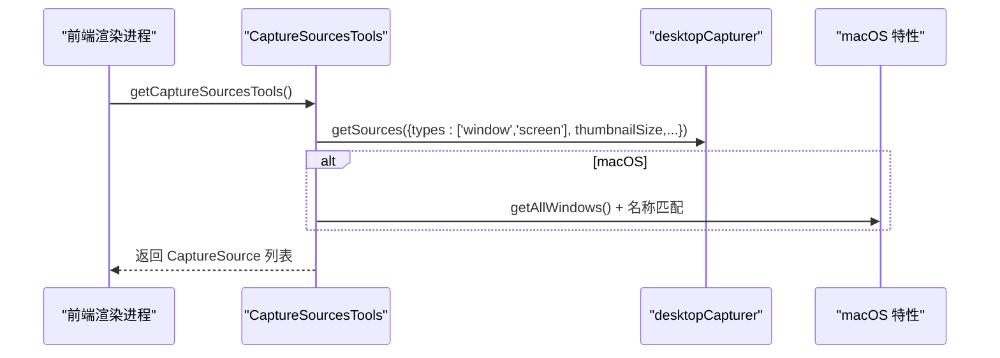
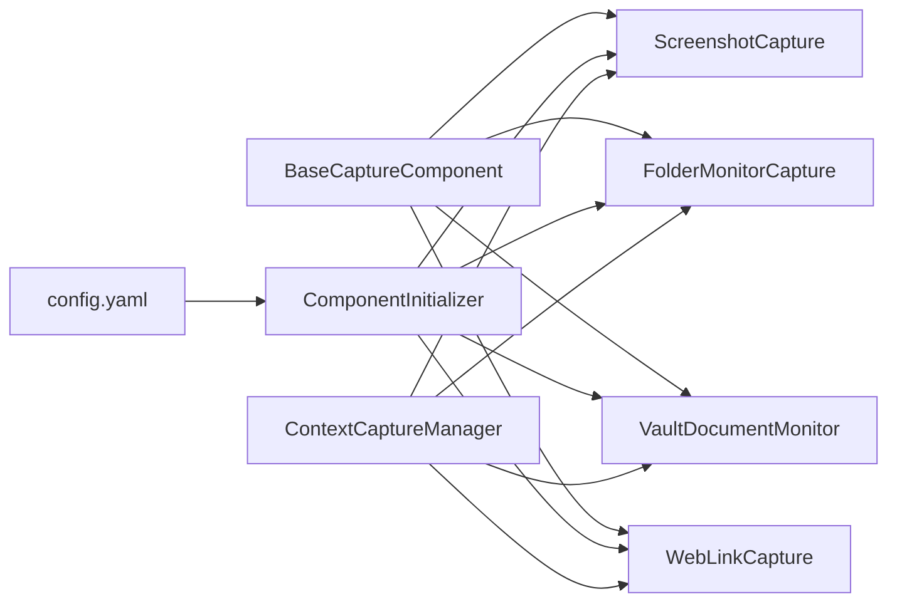

# 上下文捕获

<cite>
**本文引用的文件**
- [opencontext/context_capture/base.py](file://opencontext/context_capture/base.py)
- [opencontext/context_capture/screenshot.py](file://opencontext/context_capture/screenshot.py)
- [opencontext/context_capture/folder_monitor.py](file://opencontext/context_capture/folder_monitor.py)
- [opencontext/context_capture/vault_document_monitor.py](file://opencontext/context_capture/vault_document_monitor.py)
- [opencontext/context_capture/web_link_capture.py](file://opencontext/context_capture/web_link_capture.py)
- [opencontext/managers/capture_manager.py](file://opencontext/managers/capture_manager.py)
- [opencontext/server/component_initializer.py](file://opencontext/server/component_initializer.py)
- [opencontext/interfaces/capture_interface.py](file://opencontext/interfaces/capture_interface.py)
- [config/config.yaml](file://config/config.yaml)
- [opencontext/models/context.py](file://opencontext/models/context.py)
- [frontend/src/main/utils/get-capture-sources.ts](file://frontend/src/main/utils/get-capture-sources.ts)
- [frontend/src/main/services/ScreenshotService.ts](file://frontend/src/main/services/ScreenshotService.ts)
- [examples/verify_folder_monitor.py](file://examples/verify_folder_monitor.py)
- [examples/example_screenshot_processor.py](file://examples/example_screenshot_processor.py)
</cite>

## 目录
1. [简介](#简介)
2. [项目结构](#项目结构)
3. [核心组件](#核心组件)
4. [架构总览](#架构总览)
5. [详细组件分析](#详细组件分析)
6. [依赖关系分析](#依赖关系分析)
7. [性能考量](#性能考量)
8. [故障排查指南](#故障排查指南)
9. [结论](#结论)
10. [附录](#附录)

## 简介
本文件系统性阐述“上下文捕获”模块的设计与实现，重点覆盖：
- 接口与基类：ICaptureComponent 接口与 BaseCaptureComponent 基类提供的通用能力（线程管理、状态控制、回调机制、配置校验与统计）。
- 具体组件：屏幕截图捕获（ScreenshotCapture）、本地文件夹监控（FolderMonitorCapture）、知识库文档监控（VaultDocumentMonitor），以及网页链接捕获（WebLinkCapture）的工作原理与差异。
- 管理器：CaptureManager 如何通过配置文件动态注册与初始化组件，并统一调度。
- 前端对接：前端如何通过 CaptureSource 接口获取可用的捕获源列表。
- 新组件实现示例：如何基于 BaseCaptureComponent 实现新的捕获组件（如摄像头捕获）。
- 性能与资源：捕获频率、并发与资源消耗的权衡建议。

## 项目结构
上下文捕获相关代码主要位于 opencontext/context_capture 下，配合 opencontext/managers 与 opencontext/server 组件初始化流程，形成“组件定义—管理—初始化—运行”的完整闭环；前端通过 Electron 的 desktopCapturer 获取系统窗口/屏幕源并进行截图。

图表来源
- [opencontext/interfaces/capture_interface.py](file://opencontext/interfaces/capture_interface.py#L1-L153)
- [opencontext/context_capture/base.py](file://opencontext/context_capture/base.py#L1-L515)
- [opencontext/context_capture/screenshot.py](file://opencontext/context_capture/screenshot.py#L1-L508)
- [opencontext/context_capture/folder_monitor.py](file://opencontext/context_capture/folder_monitor.py#L1-L472)
- [opencontext/context_capture/vault_document_monitor.py](file://opencontext/context_capture/vault_document_monitor.py#L1-L389)
- [opencontext/context_capture/web_link_capture.py](file://opencontext/context_capture/web_link_capture.py#L1-L351)
- [opencontext/managers/capture_manager.py](file://opencontext/managers/capture_manager.py#L1-L391)
- [opencontext/server/component_initializer.py](file://opencontext/server/component_initializer.py#L1-L229)
- [config/config.yaml](file://config/config.yaml#L1-L253)
- [frontend/src/main/utils/get-capture-sources.ts](file://frontend/src/main/utils/get-capture-sources.ts#L1-L775)
- [frontend/src/main/services/ScreenshotService.ts](file://frontend/src/main/services/ScreenshotService.ts#L1-L370)

章节来源
- [opencontext/context_capture/base.py](file://opencontext/context_capture/base.py#L1-L515)
- [opencontext/managers/capture_manager.py](file://opencontext/managers/capture_manager.py#L1-L391)
- [opencontext/server/component_initializer.py](file://opencontext/server/component_initializer.py#L1-L229)
- [config/config.yaml](file://config/config.yaml#L1-L253)
- [frontend/src/main/utils/get-capture-sources.ts](file://frontend/src/main/utils/get-capture-sources.ts#L1-L775)

## 核心组件
- ICaptureComponent 接口：定义组件生命周期（initialize/start/stop/is_running/capture）、元信息（get_name/get_description）、配置（get_config_schema/validate_config）、状态与统计（get_status/get_statistics/reset_statistics）以及回调（set_callback）。
- BaseCaptureComponent 基类：实现线程安全的状态字段、捕获循环（自动周期捕获）、回调分发、配置校验与合并、统计与错误计数、锁保护等通用能力。子类仅需实现 _initialize_impl/_start_impl/_stop_impl/_capture_impl 以及可选的配置模式扩展方法。

章节来源
- [opencontext/interfaces/capture_interface.py](file://opencontext/interfaces/capture_interface.py#L1-L153)
- [opencontext/context_capture/base.py](file://opencontext/context_capture/base.py#L1-L515)

## 架构总览
后端通过 ComponentInitializer 读取 config.yaml 中的 capture 段落，按名称映射到内置组件或动态导入自定义模块，实例化后交由 ContextCaptureManager 注册、初始化并启动。各组件在后台线程执行捕获逻辑，捕获结果通过 set_callback 回调上报给管理器，再由上层业务消费。

图表来源
- [opencontext/server/component_initializer.py](file://opencontext/server/component_initializer.py#L71-L118)
- [opencontext/managers/capture_manager.py](file://opencontext/managers/capture_manager.py#L100-L171)
- [config/config.yaml](file://config/config.yaml#L39-L75)

章节来源
- [opencontext/server/component_initializer.py](file://opencontext/server/component_initializer.py#L71-L118)
- [opencontext/managers/capture_manager.py](file://opencontext/managers/capture_manager.py#L100-L171)
- [config/config.yaml](file://config/config.yaml#L39-L75)

## 详细组件分析

### ScreenshotCapture（屏幕截图）
- 功能概述：周期性抓取屏幕（支持多显示器），可选择区域、格式与质量，支持去重与保存为文件，生成 RawContextProperties 上报。
- 关键点：
  - 自动去重：维护最近稳定截图，按相似度阈值判断是否跳过重复帧。
  - 存储策略：可选保存到指定目录，便于后续处理或审计。
  - 配置项：截图格式、质量、区域、保存路径、去重开关与阈值、默认捕获间隔等。
  - 状态与统计：记录最近截图时间、路径、总数、活动截图集合等。
- 与 BaseCaptureComponent 的协作：继承 _capture_impl 实现抓取逻辑，_get_config_schema_impl/_validate_config_impl 提供配置约束，_get_status_impl/_get_statistics_impl/_reset_statistics_impl 提供运行时信息。

图表来源
- [opencontext/context_capture/screenshot.py](file://opencontext/context_capture/screenshot.py#L217-L299)
- [opencontext/context_capture/screenshot.py](file://opencontext/context_capture/screenshot.py#L300-L453)
- [opencontext/context_capture/screenshot.py](file://opencontext/context_capture/screenshot.py#L455-L508)

章节来源
- [opencontext/context_capture/screenshot.py](file://opencontext/context_capture/screenshot.py#L1-L508)
- [opencontext/context_capture/base.py](file://opencontext/context_capture/base.py#L1-L515)
- [config/config.yaml](file://config/config.yaml#L43-L47)

### FolderMonitorCapture（本地文件夹监控）
- 功能概述：轮询监控指定目录树，检测新增、更新、删除事件，生成 RawContextProperties 上报；支持初始扫描、递归扫描、最大文件大小限制、文件哈希去重。
- 关键点：
  - 初始扫描：首次启动时扫描已有文件建立缓存。
  - 变更检测：基于 mtime/size/hash 组合判断变更；删除事件触发清理已处理上下文。
  - 事件队列：内部事件缓冲，capture() 时批量处理并清空队列。
  - 状态与统计：记录扫描时间、待处理事件数、处理总数、最后活跃时间等。
- 与 BaseCaptureComponent 的协作：继承 _capture_impl 从事件队列取出事件并转换为上下文，_get_config_schema_impl/_validate_config_impl 控制监控行为。

图表来源
- [opencontext/context_capture/folder_monitor.py](file://opencontext/context_capture/folder_monitor.py#L137-L186)
- [opencontext/context_capture/folder_monitor.py](file://opencontext/context_capture/folder_monitor.py#L187-L246)
- [opencontext/context_capture/folder_monitor.py](file://opencontext/context_capture/folder_monitor.py#L247-L325)
- [opencontext/context_capture/folder_monitor.py](file://opencontext/context_capture/folder_monitor.py#L326-L383)

章节来源
- [opencontext/context_capture/folder_monitor.py](file://opencontext/context_capture/folder_monitor.py#L1-L472)
- [opencontext/context_capture/base.py](file://opencontext/context_capture/base.py#L1-L515)
- [config/config.yaml](file://config/config.yaml#L49-L66)

### VaultDocumentMonitor（知识库文档监控）
- 功能概述：定期扫描知识库表（vaults），识别新创建与更新的文档，生成 RawContextProperties 上报；支持初始扫描。
- 关键点：
  - 时间窗口：比较 created_at/updated_at，仅对超过上次扫描时间的文档发出事件。
  - 事件聚合：capture() 时批量出队并转换为上下文。
  - 状态与统计：记录处理过的文档数量、待处理事件数、最后扫描时间、最后活跃时间等。
- 与 BaseCaptureComponent 的协作：继承 _capture_impl 处理事件队列，_get_config_schema_impl/_validate_config_impl 控制扫描间隔与初始扫描开关。

图表来源
- [opencontext/context_capture/vault_document_monitor.py](file://opencontext/context_capture/vault_document_monitor.py#L145-L248)
- [opencontext/context_capture/vault_document_monitor.py](file://opencontext/context_capture/vault_document_monitor.py#L249-L310)
- [opencontext/context_capture/vault_document_monitor.py](file://opencontext/context_capture/vault_document_monitor.py#L311-L389)

章节来源
- [opencontext/context_capture/vault_document_monitor.py](file://opencontext/context_capture/vault_document_monitor.py#L1-L389)
- [opencontext/context_capture/base.py](file://opencontext/context_capture/base.py#L1-L515)
- [config/config.yaml](file://config/config.yaml#L71-L75)

### WebLinkCapture（网页链接捕获）
- 功能概述：接收 URL 列表，异步下载并转存为 Markdown 或 PDF，生成 RawContextProperties 上报；支持并发线程池与超时控制。
- 关键点：
  - 模式切换：Markdown 或 PDF 输出，可配置 PDF 页面格式、背景打印、横版等。
  - 并发控制：ThreadPoolExecutor 控制最大并发数。
  - 配置校验：输出目录、模式、超时、等待条件、并发数等。
- 与 BaseCaptureComponent 的协作：重载 capture() 支持传入 URL 列表，_capture_impl 内部执行转换并构造上下文。

图表来源
- [opencontext/context_capture/web_link_capture.py](file://opencontext/context_capture/web_link_capture.py#L191-L252)
- [opencontext/context_capture/web_link_capture.py](file://opencontext/context_capture/web_link_capture.py#L254-L351)

章节来源
- [opencontext/context_capture/web_link_capture.py](file://opencontext/context_capture/web_link_capture.py#L1-L351)
- [opencontext/context_capture/base.py](file://opencontext/context_capture/base.py#L1-L515)
- [config/config.yaml](file://config/config.yaml#L1-L253)

### CaptureManager（组件管理器）
- 功能概述：统一注册、初始化、启动/停止组件；设置回调；统计汇总；对外暴露手动捕获与批量捕获接口。
- 关键点：
  - 注册与初始化：validate_config + initialize，支持覆盖注册。
  - 启动/停止：为每个组件设置回调，内部线程由组件自行管理。
  - 统计：累计捕获次数、上下文数量、错误计数、组件级统计。
  - 手动捕获：支持对单组件或全部组件发起一次捕获。
- 与组件交互：通过 set_callback 将组件产出的上下文回传至管理器，管理器负责更新统计并转发给上层回调。

图表来源
- [opencontext/managers/capture_manager.py](file://opencontext/managers/capture_manager.py#L1-L391)

章节来源
- [opencontext/managers/capture_manager.py](file://opencontext/managers/capture_manager.py#L1-L391)

### 组件初始化与动态注册
- ComponentInitializer 依据 config.yaml 的 capture 段落逐项解析，若内置映射不存在则尝试动态导入模块与类名（snake_case -> CamelCase），随后实例化并交由 ContextCaptureManager 注册与初始化。
- 支持“enabled”开关与按组件粒度的配置，便于灵活启用/禁用不同捕获源。

图表来源
- [opencontext/server/component_initializer.py](file://opencontext/server/component_initializer.py#L37-L118)
- [config/config.yaml](file://config/config.yaml#L39-L75)

章节来源
- [opencontext/server/component_initializer.py](file://opencontext/server/component_initializer.py#L1-L229)
- [config/config.yaml](file://config/config.yaml#L39-L75)

### 前端捕获源接口
- 前端通过 CaptureSourcesTools 获取系统窗口/屏幕源列表，支持：
  - 获取所有源（含缩略图与应用图标）
  - 可视性检测（跨桌面/空间）
  - 截取指定源的缩略图
  - macOS 权限检查与引导
- ScreenshotService 在此基础上封装截图保存、历史查询、清理等能力。

图表来源
- [frontend/src/main/utils/get-capture-sources.ts](file://frontend/src/main/utils/get-capture-sources.ts#L1-L332)
- [frontend/src/main/services/ScreenshotService.ts](file://frontend/src/main/services/ScreenshotService.ts#L1-L370)

章节来源
- [frontend/src/main/utils/get-capture-sources.ts](file://frontend/src/main/utils/get-capture-sources.ts#L1-L775)
- [frontend/src/main/services/ScreenshotService.ts](file://frontend/src/main/services/ScreenshotService.ts#L1-L370)

## 依赖关系分析
- 组件间耦合：各捕获组件均继承 BaseCaptureComponent，遵循 ICaptureComponent 接口，耦合度低、扩展性强。
- 外部依赖：
  - 图像处理：Pillow、mss（截图）、screenshot-desktop（屏幕截图）。
  - 网页内容：crawl4ai（Markdown）、playwright（PDF）。
  - 存储：全局存储接口 get_storage（用于知识库/文件上下文清理）。
- 配置驱动：config.yaml 的 capture 段落决定组件启用与参数，初始化器按配置动态装配。

图表来源
- [opencontext/context_capture/base.py](file://opencontext/context_capture/base.py#L1-L515)
- [opencontext/context_capture/screenshot.py](file://opencontext/context_capture/screenshot.py#L1-L508)
- [opencontext/context_capture/folder_monitor.py](file://opencontext/context_capture/folder_monitor.py#L1-L472)
- [opencontext/context_capture/vault_document_monitor.py](file://opencontext/context_capture/vault_document_monitor.py#L1-L389)
- [opencontext/context_capture/web_link_capture.py](file://opencontext/context_capture/web_link_capture.py#L1-L351)
- [opencontext/server/component_initializer.py](file://opencontext/server/component_initializer.py#L1-L229)
- [opencontext/managers/capture_manager.py](file://opencontext/managers/capture_manager.py#L1-L391)
- [config/config.yaml](file://config/config.yaml#L1-L253)

章节来源
- [opencontext/context_capture/base.py](file://opencontext/context_capture/base.py#L1-L515)
- [opencontext/server/component_initializer.py](file://opencontext/server/component_initializer.py#L1-L229)
- [opencontext/managers/capture_manager.py](file://opencontext/managers/capture_manager.py#L1-L391)
- [config/config.yaml](file://config/config.yaml#L1-L253)

## 性能考量
- 捕获频率与线程模型
  - 自动捕获：当配置 capture_interval > 0 时，组件内部启动守护线程按固定间隔执行 capture()。建议根据场景调整：
    - 屏幕截图：较短间隔（如 2–5 秒）可提升实时性，但 CPU/IO 增加；较长间隔降低开销但延迟上升。
    - 文件夹监控：monitor_interval 建议 ≥ 3 秒，避免频繁 IO。
    - 知识库监控：monitor_interval 建议 ≥ 5 秒，减少数据库压力。
  - 并发与批处理：WebLinkCapture 使用线程池并发转换 URL，max_workers 建议根据 CPU 核心数与网络带宽平衡。
- 资源消耗
  - 图像编码与存储：截图质量、尺寸、保存路径都会影响磁盘与内存占用。建议：
    - 控制截图分辨率与质量，必要时启用去重以减少重复数据。
    - 合理设置 max_image_size 与 resize_quality，避免过度放大导致内存峰值过高。
  - 文件扫描：FolderMonitorCapture 的 max_file_size 与递归扫描范围直接影响 IO 与 CPU；建议限制扫描目录层级与文件大小上限。
  - 网页内容：PDF 渲染耗时较长，建议合理设置超时与并发数，避免阻塞主线程。
- 统计与可观测性
  - 通过 get_statistics()/get_status() 获取组件运行指标，结合管理器统计进行资源评估与调优。
  - 错误计数与 last_error 有助于定位异常（如权限不足、库缺失、磁盘空间不足等）。

章节来源
- [opencontext/context_capture/screenshot.py](file://opencontext/context_capture/screenshot.py#L300-L353)
- [opencontext/context_capture/folder_monitor.py](file://opencontext/context_capture/folder_monitor.py#L384-L423)
- [opencontext/context_capture/vault_document_monitor.py](file://opencontext/context_capture/vault_document_monitor.py#L310-L331)
- [opencontext/context_capture/web_link_capture.py](file://opencontext/context_capture/web_link_capture.py#L254-L296)
- [opencontext/context_capture/base.py](file://opencontext/context_capture/base.py#L1-L515)

## 故障排查指南
- 权限问题（macOS）
  - 屏幕录制权限未授予会导致截图失败。前端提供权限检查与引导打开系统偏好设置。
- 库缺失
  - 截图库（mss）、网页抓取（crawl4ai）、PDF 渲染（playwright）等需按需安装；初始化阶段会尝试导入，失败时记录错误日志。
- 配置无效
  - validate_config 会严格校验类型与范围；若配置不合法，组件初始化失败。请核对 config.yaml 中的 capture 段落。
- 磁盘空间与路径
  - 截图保存目录不可写或空间不足会导致失败；建议设置合理的 storage_path 并定期清理历史快照。
- 组件未运行
  - 若 is_running() 返回 False，检查 start_component 是否成功，确认回调是否正确设置。

章节来源
- [frontend/src/main/utils/get-capture-sources.ts](file://frontend/src/main/utils/get-capture-sources.ts#L333-L359)
- [opencontext/context_capture/screenshot.py](file://opencontext/context_capture/screenshot.py#L70-L127)
- [opencontext/context_capture/web_link_capture.py](file://opencontext/context_capture/web_link_capture.py#L160-L181)
- [opencontext/context_capture/base.py](file://opencontext/context_capture/base.py#L1-L515)

## 结论
上下文捕获模块通过清晰的接口与强大的基类抽象，实现了多种来源的统一接入与管理。借助配置驱动的动态初始化与管理器的集中调度，系统具备良好的可扩展性与可维护性。前端通过桌面源接口提供了直观的可视化捕获体验。在实际部署中，应结合业务需求合理设置捕获频率与并发策略，关注资源消耗与稳定性。

## 附录

### 如何实现一个新的捕获组件（示例：摄像头捕获）
- 步骤
  - 新建类继承 BaseCaptureComponent，并实现以下方法：
    - _initialize_impl(config)：解析摄像头设备、分辨率、帧率等配置。
    - _start_impl()/_stop_impl(graceful)：打开/关闭摄像头句柄，必要时释放资源。
    - _capture_impl()：从摄像头读取一帧，编码为图像数据，构造 RawContextProperties 列表返回。
    - _get_config_schema_impl()/_validate_config_impl()：提供配置模式与校验规则。
    - _get_status_impl()/_get_statistics_impl()/_reset_statistics_impl()：补充运行时信息。
  - 在 config.yaml 的 capture 段落添加新组件配置，或在 CAPTURE_COMPONENTS 映射中注册类名。
  - 使用 ComponentInitializer 初始化并交由 ContextCaptureManager 管理。

章节来源
- [opencontext/context_capture/base.py](file://opencontext/context_capture/base.py#L431-L515)
- [opencontext/server/component_initializer.py](file://opencontext/server/component_initializer.py#L37-L118)
- [config/config.yaml](file://config/config.yaml#L39-L75)

### 示例参考
- 文件夹监控验证：通过单元测试验证创建/更新/删除事件与清理逻辑。
- 截图处理器示例：演示如何将截图作为 RawContextProperties 输入进行视觉理解与提取。

章节来源
- [examples/verify_folder_monitor.py](file://examples/verify_folder_monitor.py#L1-L160)
- [examples/example_screenshot_processor.py](file://examples/example_screenshot_processor.py#L1-L181)