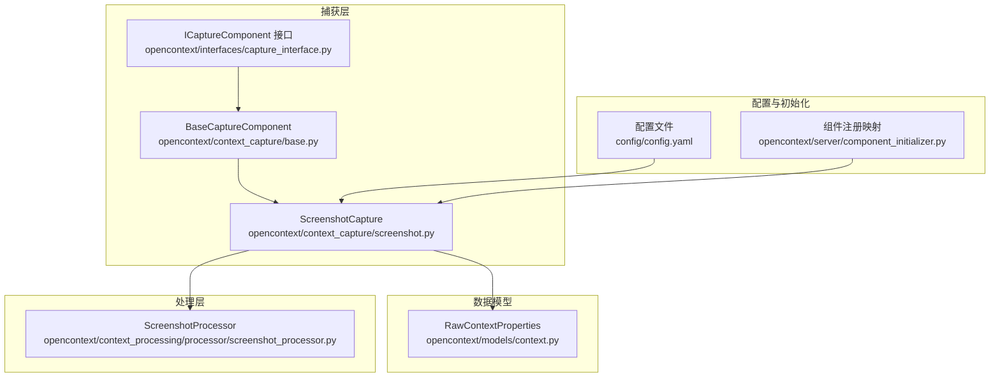
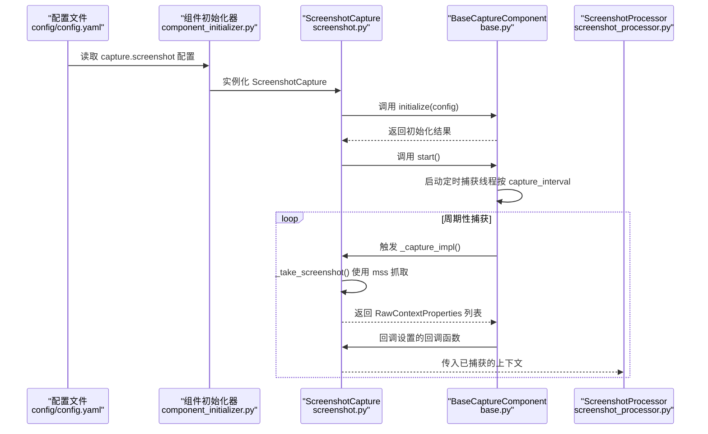
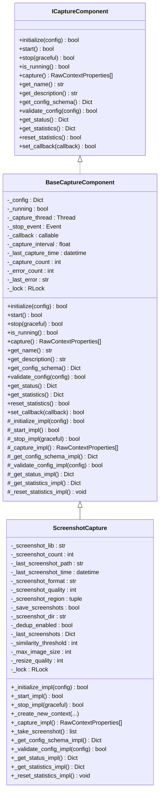
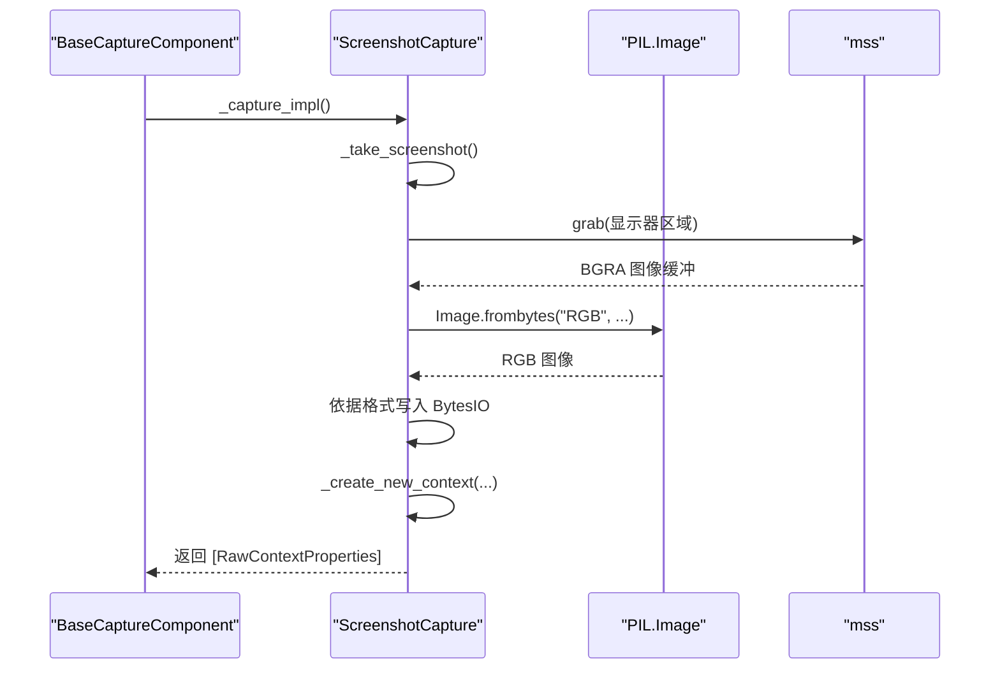
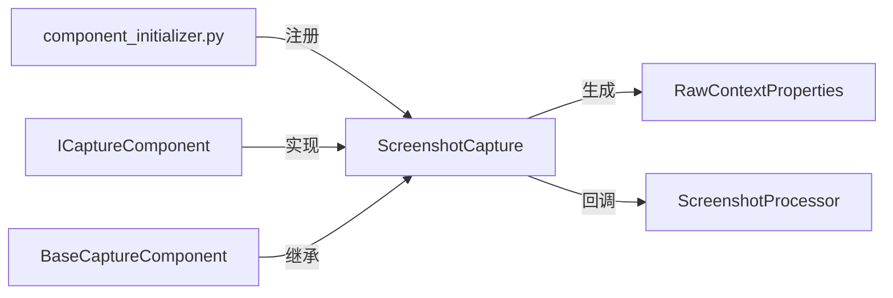

# 屏幕截图捕获

<cite>
**本文引用的文件列表**
- [screenshot.py](file://opencontext/context_capture/screenshot.py)
- [base.py](file://opencontext/context_capture/base.py)
- [capture_interface.py](file://opencontext/interfaces/capture_interface.py)
- [context.py](file://opencontext/models/context.py)
- [config.yaml](file://config/config.yaml)
- [component_initializer.py](file://opencontext/server/component_initializer.py)
- [screenshot_processor.py](file://opencontext/context_processing/processor/screenshot_processor.py)
</cite>

## 目录
1. [简介](#简介)
2. [项目结构](#项目结构)
3. [核心组件](#核心组件)
4. [架构总览](#架构总览)
5. [详细组件分析](#详细组件分析)
6. [依赖关系分析](#依赖关系分析)
7. [性能考量](#性能考量)
8. [故障排查指南](#故障排查指南)
9. [结论](#结论)
10. [附录](#附录)

## 简介
本章节面向“屏幕截图捕获”能力，聚焦于 ScreenshotCapture 组件的实现与使用。该组件继承自 BaseCaptureComponent，并实现 ICaptureComponent 接口，通过 mss 库进行屏幕截图，支持全屏或指定区域捕获，可配置截图格式（PNG/JPG）、质量、保存路径与去重策略；其核心方法 _capture_impl 执行截图并返回一组 RawContextProperties 对象，供后续上下文处理链路使用。本文还解释 capture_interval、dedup_enabled、similarity_threshold 等配置项的作用，并给出在配置文件中启用与配置该组件的方法，以及截图频率对系统性能的影响与大尺寸图像的处理策略。

## 项目结构
围绕屏幕截图捕获的相关模块分布如下：
- 捕获层：opencontext/context_capture/screenshot.py 定义 ScreenshotCapture 组件；opencontext/context_capture/base.py 提供通用捕获基类；opencontext/interfaces/capture_interface.py 定义 ICaptureComponent 接口。
- 数据模型：opencontext/models/context.py 定义 RawContextProperties 等核心数据结构。
- 配置：config/config.yaml 中包含 capture.screenshot 的启用与参数示例。
- 初始化：opencontext/server/component_initializer.py 将 "screenshot" 映射到 ScreenshotCapture 类型。
- 处理器：opencontext/context_processing/processor/screenshot_processor.py 提供对截图的后处理（如去重、批处理、向量化等）。

图表来源
- [screenshot.py](file://opencontext/context_capture/screenshot.py#L28-L35)
- [base.py](file://opencontext/context_capture/base.py#L26-L31)
- [capture_interface.py](file://opencontext/interfaces/capture_interface.py#L18-L35)
- [context.py](file://opencontext/models/context.py#L35-L55)
- [config.yaml](file://config/config.yaml#L40-L50)
- [component_initializer.py](file://opencontext/server/component_initializer.py#L37-L41)
- [screenshot_processor.py](file://opencontext/context_processing/processor/screenshot_processor.py#L47-L70)

章节来源
- [screenshot.py](file://opencontext/context_capture/screenshot.py#L28-L35)
- [base.py](file://opencontext/context_capture/base.py#L26-L31)
- [capture_interface.py](file://opencontext/interfaces/capture_interface.py#L18-L35)
- [context.py](file://opencontext/models/context.py#L35-L55)
- [config.yaml](file://config/config.yaml#L40-L50)
- [component_initializer.py](file://opencontext/server/component_initializer.py#L37-L41)
- [screenshot_processor.py](file://opencontext/context_processing/processor/screenshot_processor.py#L47-L70)

## 核心组件
- ScreenshotCapture：继承 BaseCaptureComponent，实现 ICaptureComponent，负责周期性抓取屏幕截图，支持全屏或指定区域，输出 RawContextProperties 列表。
- BaseCaptureComponent：提供统一的生命周期管理（initialize/start/stop/capture）、定时循环捕获线程、统计与状态查询等通用能力。
- ICaptureComponent：定义捕获组件的标准接口规范。
- RawContextProperties：承载截图上下文的元信息与内容路径等字段。

章节来源
- [screenshot.py](file://opencontext/context_capture/screenshot.py#L28-L35)
- [base.py](file://opencontext/context_capture/base.py#L26-L31)
- [capture_interface.py](file://opencontext/interfaces/capture_interface.py#L18-L35)
- [context.py](file://opencontext/models/context.py#L35-L55)

## 架构总览
下图展示了从配置到组件实例化、启动、捕获与回调的整体流程。

图表来源
- [config.yaml](file://config/config.yaml#L40-L50)
- [component_initializer.py](file://opencontext/server/component_initializer.py#L37-L41)
- [screenshot.py](file://opencontext/context_capture/screenshot.py#L216-L244)
- [base.py](file://opencontext/context_capture/base.py#L94-L129)

## 详细组件分析

### ScreenshotCapture 类与继承关系
- 继承关系：ScreenshotCapture 继承 BaseCaptureComponent，后者实现 ICaptureComponent 接口。
- 关键字段与行为：
  - 截图库选择：默认使用 mss。
  - 截图格式与质量：支持 PNG/JPG/JPEG，默认 PNG，JPG 质量范围 1-100。
  - 截图区域：可选，未设置时抓取所有显示器。
  - 保存策略：可配置存储目录，开启后将二进制截图写入磁盘。
  - 去重策略：通过 _last_screenshots 缓存每块显示器最近稳定截图，结合相似度阈值判断是否跳过重复帧。
  - 最大图像尺寸与缩放质量：用于控制输出图像大小与压缩质量。
  - 线程安全：使用 RLock 保护内部状态。

图表来源
- [capture_interface.py](file://opencontext/interfaces/capture_interface.py#L18-L153)
- [base.py](file://opencontext/context_capture/base.py#L26-L515)
- [screenshot.py](file://opencontext/context_capture/screenshot.py#L28-L508)

章节来源
- [screenshot.py](file://opencontext/context_capture/screenshot.py#L28-L508)
- [base.py](file://opencontext/context_capture/base.py#L26-L515)
- [capture_interface.py](file://opencontext/interfaces/capture_interface.py#L18-L153)

### _capture_impl 方法与 RawContextProperties 生成
- _capture_impl 调用 _take_screenshot 获取二进制截图数据、格式与显示器坐标信息，随后为每个截图调用 _create_new_context 生成 RawContextProperties。
- RawContextProperties 字段要点：
  - source: SCREENSHOT
  - content_format: IMAGE
  - content_path: 若开启保存，则指向磁盘上的截图文件绝对路径
  - additional_info: 包含 format、timestamp、region、screenshot_format、screenshot_path、tags 等
  - create_time: 截图时间戳
- 生成的上下文列表会被 BaseCaptureComponent 的 capture 流程回调给上层处理器（如 ScreenshotProcessor）。

图表来源
- [screenshot.py](file://opencontext/context_capture/screenshot.py#L216-L244)
- [screenshot.py](file://opencontext/context_capture/screenshot.py#L246-L298)
- [screenshot.py](file://opencontext/context_capture/screenshot.py#L176-L215)
- [context.py](file://opencontext/models/context.py#L35-L55)

章节来源
- [screenshot.py](file://opencontext/context_capture/screenshot.py#L216-L244)
- [screenshot.py](file://opencontext/context_capture/screenshot.py#L246-L298)
- [screenshot.py](file://opencontext/context_capture/screenshot.py#L176-L215)
- [context.py](file://opencontext/models/context.py#L35-L55)

### 配置项详解
- capture_interval：捕获间隔（秒），由 BaseCaptureComponent 在 initialize/start 时生效，决定定时捕获线程的等待时间。
- screenshot_format：截图格式，支持 png/jpg/jpeg，默认 png。
- screenshot_quality：当格式为 jpg/jpeg 时有效，1-100，默认 80。
- screenshot_region：可选，字典包含 left/top/width/height，未设置则全屏抓取。
- storage_path：截图保存目录，开启后会将二进制截图写入磁盘。
- dedup_enabled：是否启用去重，跳过与上次稳定的截图相似度过高的帧。
- similarity_threshold：图像相似度阈值（0-100），越高越严格。
- max_image_size：最大图像尺寸，用于控制输出图像大小。
- resize_quality：图像缩放质量（0-100），用于缩放时的质量控制。

章节来源
- [screenshot.py](file://opencontext/context_capture/screenshot.py#L59-L125)
- [screenshot.py](file://opencontext/context_capture/screenshot.py#L299-L352)
- [screenshot.py](file://opencontext/context_capture/screenshot.py#L354-L452)
- [base.py](file://opencontext/context_capture/base.py#L57-L92)
- [base.py](file://opencontext/context_capture/base.py#L94-L129)

### 在配置文件中启用与配置
- 在 config/config.yaml 中找到 capture.screenshot 节点，设置 enabled、capture_interval、storage_path 等参数即可启用并配置 ScreenshotCapture。
- 组件类型在 opencontext/server/component_initializer.py 中以 "screenshot" 映射到 ScreenshotCapture 类型，便于统一初始化。

章节来源
- [config.yaml](file://config/config.yaml#L40-L50)
- [component_initializer.py](file://opencontext/server/component_initializer.py#L37-L41)

### 去重与相似度阈值
- 去重逻辑：组件内部维护 _last_screenshots，按显示器键缓存最近稳定截图；若新截图与对应显示器的稳定截图相似度高于阈值，则视为重复，不生成新的 RawContextProperties。
- 相似度阈值：similarity_threshold 默认较高，可在配置中调整，以平衡稳定性与变化捕捉。

章节来源
- [screenshot.py](file://opencontext/context_capture/screenshot.py#L51-L53)
- [screenshot.py](file://opencontext/context_capture/screenshot.py#L113-L118)

### 截图频率对系统性能的影响
- 频率越高，CPU/GPU 与内存占用越大；建议根据场景选择合适 capture_interval。
- 全屏抓取比区域抓取更耗资源；优先使用 screenshot_region 限定区域。
- JPG 质量越高，编码开销越大；PNG 无损但体积更大；可根据需求权衡格式与质量。
- 开启保存会带来磁盘 IO 压力，建议合理规划存储路径与清理策略。

章节来源
- [screenshot.py](file://opencontext/context_capture/screenshot.py#L299-L352)
- [screenshot.py](file://opencontext/context_capture/screenshot.py#L354-L452)

### 大尺寸图像的处理策略
- 输出侧：max_image_size 控制输出图像的最大边长；resize_quality 控制缩放质量。
- 输入侧：ScreenshotProcessor 可在批处理前对图像进行缩放与哈希计算，减少后续向量化与存储成本。
- 删除重复文件：当启用删除策略时，重复截图可直接删除，降低磁盘占用。

章节来源
- [screenshot.py](file://opencontext/context_capture/screenshot.py#L119-L121)
- [screenshot_processor.py](file://opencontext/context_processing/processor/screenshot_processor.py#L65-L72)
- [screenshot_processor.py](file://opencontext/context_processing/processor/screenshot_processor.py#L137-L147)

## 依赖关系分析
- 组件注册：component_initializer.py 将 "screenshot" 映射到 ScreenshotCapture，便于统一初始化。
- 接口契约：ScreenshotCapture 必须实现 ICaptureComponent 的全部抽象方法，BaseCaptureComponent 提供了通用实现骨架。
- 数据模型：RawContextProperties 作为上下文载体贯穿捕获与处理阶段。
- 处理链路：捕获完成后，BaseCaptureComponent 会将上下文通过回调传递给上层处理器（如 ScreenshotProcessor）。

图表来源
- [component_initializer.py](file://opencontext/server/component_initializer.py#L37-L41)
- [capture_interface.py](file://opencontext/interfaces/capture_interface.py#L18-L153)
- [base.py](file://opencontext/context_capture/base.py#L26-L515)
- [screenshot.py](file://opencontext/context_capture/screenshot.py#L28-L508)
- [context.py](file://opencontext/models/context.py#L35-L55)
- [screenshot_processor.py](file://opencontext/context_processing/processor/screenshot_processor.py#L47-L70)

章节来源
- [component_initializer.py](file://opencontext/server/component_initializer.py#L37-L41)
- [capture_interface.py](file://opencontext/interfaces/capture_interface.py#L18-L153)
- [base.py](file://opencontext/context_capture/base.py#L26-L515)
- [screenshot.py](file://opencontext/context_capture/screenshot.py#L28-L508)
- [context.py](file://opencontext/models/context.py#L35-L55)
- [screenshot_processor.py](file://opencontext/context_processing/processor/screenshot_processor.py#L47-L70)

## 性能考量
- 捕获频率与硬件资源：降低 capture_interval 或全屏抓取会显著增加 CPU/GPU 与内存压力，建议按需调整。
- 图像格式与质量：JPG 更省空间但有损，PNG 无损但体积大；质量越高，编码与传输成本越高。
- 存储策略：开启保存会带来磁盘 IO；建议定期清理旧截图或启用删除重复策略。
- 去重与相似度：合理设置 similarity_threshold 可减少无效上下文数量，提升吞吐。
- 处理链路优化：在 ScreenshotProcessor 中进行批处理、缩放与哈希计算，有助于降低后续向量化成本。

## 故障排查指南
- 无法导入 mss：组件初始化失败，检查环境依赖安装情况。
- 截图区域参数非法：left/top/width/height 必须为正整数且满足约束，否则校验失败。
- 截图质量不在范围：仅当格式为 jpg/jpeg 时有效，超出 1-100 会报错。
- 捕获间隔过小导致卡顿：适当增大 capture_interval 或缩小截图区域。
- 存储目录不可写：确保 storage_path 存在且具备写权限。
- 去重误判：提高 similarity_threshold 或缩短去重窗口。

章节来源
- [screenshot.py](file://opencontext/context_capture/screenshot.py#L70-L125)
- [screenshot.py](file://opencontext/context_capture/screenshot.py#L354-L452)
- [base.py](file://opencontext/context_capture/base.py#L275-L310)

## 结论
ScreenshotCapture 通过 mss 实现高效、可控的屏幕截图捕获，支持区域与全屏、格式与质量配置、保存策略与去重机制，并以 RawContextProperties 为载体无缝接入后续处理链路。合理配置 capture_interval、截图区域与格式质量，结合 ScreenshotProcessor 的批处理与去重策略，可在保证效果的同时控制资源消耗。

## 附录
- 示例：在配置文件中启用截图捕获并设置参数
  - 在 config/config.yaml 的 capture.screenshot 节点中设置 enabled、capture_interval、storage_path 等参数。
- 示例：查看组件注册映射
  - 在 opencontext/server/component_initializer.py 中确认 "screenshot" 映射到 ScreenshotCapture。

章节来源
- [config.yaml](file://config/config.yaml#L40-L50)
- [component_initializer.py](file://opencontext/server/component_initializer.py#L37-L41)