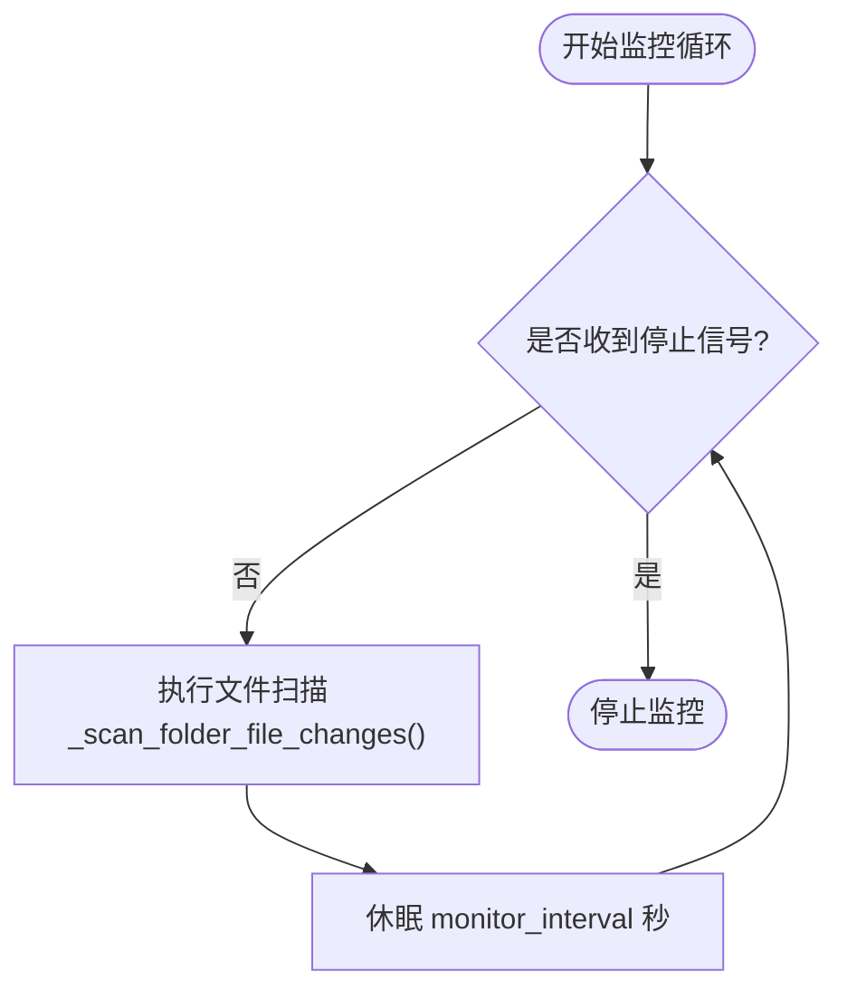
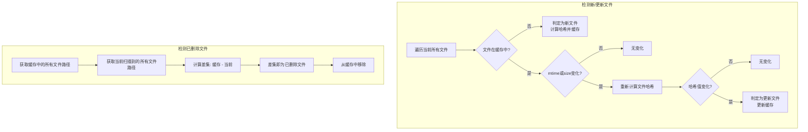
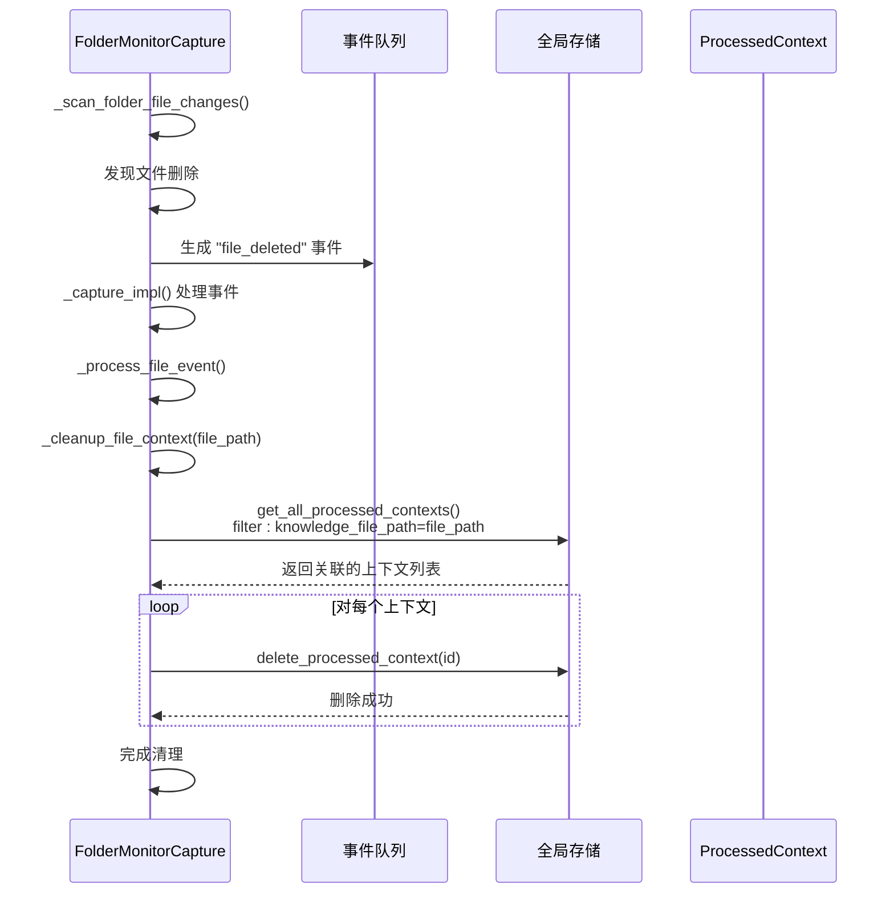

# 文件夹监控捕获

<cite>
**本文档引用的文件**   
- [folder_monitor.py](file://opencontext/context_capture/folder_monitor.py)
- [base.py](file://opencontext/context_capture/base.py)
- [context.py](file://opencontext/models/context.py)
- [enums.py](file://opencontext/models/enums.py)
- [document_processor.py](file://opencontext/context_processing/processor/document_processor.py)
- [global_storage.py](file://opencontext/storage/global_storage.py)
- [unified_storage.py](file://opencontext/storage/unified_storage.py)
- [config.yaml](file://config/config.yaml)
</cite>

## 目录
1. [简介](#简介)
2. [核心组件分析](#核心组件分析)
3. [监控循环与文件变化检测](#监控循环与文件变化检测)
4. [上下文事件创建与清理](#上下文事件创建与清理)
5. [配置项详解](#配置项详解)
6. [使用示例](#使用示例)
7. [性能考量](#性能考量)
8. [结论](#结论)

## 简介
`FolderMonitorCapture` 组件是 OpenContext 系统中的一个核心功能模块，负责监控本地文件夹中的文件变化（包括创建、更新和删除），并生成相应的上下文事件。这些事件随后被用于知识库的构建和智能分析。该组件通过一个后台线程定期扫描指定的文件夹，利用文件大小、修改时间和哈希值来精确检测文件的变化，并根据文件类型（如文本、图像、文档）创建结构化的 `RawContextProperties` 对象。本文档将深入分析其内部实现机制，包括监控循环、变化检测算法、上下文创建逻辑以及相关的配置选项。

**Section sources**
- [folder_monitor.py](file://opencontext/context_capture/folder_monitor.py#L1-L50)

## 核心组件分析
`FolderMonitorCapture` 类继承自 `BaseCaptureComponent`，实现了 `ICaptureComponent` 接口，遵循了初始化、启动、停止和捕获等标准生命周期。其核心职责是作为文件系统变化的监听器，将物理文件的变更转化为系统内部可处理的上下文数据。该组件通过 `RawContextProperties` 模型来封装捕获到的原始上下文信息，这些信息包括文件路径、内容格式、创建时间以及附加的元数据。

**Section sources**
- [folder_monitor.py](file://opencontext/context_capture/folder_monitor.py#L29-L58)
- [base.py](file://opencontext/context_capture/base.py#L26-L56)
- [context.py](file://opencontext/models/context.py#L35-L46)

## 监控循环与文件变化检测

### 监控循环
`_monitor_loop` 方法是 `FolderMonitorCapture` 的心脏，它在一个独立的后台线程中运行。该循环会根据配置的 `monitor_interval`（默认5秒）周期性地调用 `_scan_folder_file_changes` 方法来检查文件夹的变化。循环通过一个 `threading.Event` 对象（`_stop_event`）来控制，当收到停止信号时，循环会优雅地退出。



**Diagram sources **
- [folder_monitor.py](file://opencontext/context_capture/folder_monitor.py#L137-L145)

### 文件变化检测
文件变化的检测由 `_detect_new_and_updated_files` 和 `_detect_deleted_files` 两个方法协同完成。它们依赖于一个名为 `_file_info_cache` 的内存缓存，该缓存存储了所有被监控文件的元数据，包括最后修改时间（`mtime`）、大小（`size`）和SHA-256哈希值（`hash`）。

- **新文件和更新文件**: `_detect_new_and_updated_files` 方法遍历当前扫描到的所有文件。如果一个文件的路径不在缓存中，则判定为新文件。如果文件已在缓存中，则比较其当前的 `mtime` 和 `size` 与缓存中的值。如果任一值发生变化，则会重新计算该文件的哈希值，并与缓存中的哈希值进行比对。只有当哈希值也发生变化时，才最终判定为文件已更新。这种三重校验（路径、大小/时间、哈希）确保了检测的准确性，避免了因文件系统瞬时状态导致的误报。
- **已删除文件**: `_detect_deleted_files` 方法通过计算缓存中文件路径集合与当前扫描到的文件路径集合的差集来识别已删除的文件。一旦发现文件被删除，它会立即从 `_file_info_cache` 中移除该文件的缓存条目。



**Diagram sources **
- [folder_monitor.py](file://opencontext/context_capture/folder_monitor.py#L190-L231)

**Section sources**
- [folder_monitor.py](file://opencontext/context_capture/folder_monitor.py#L165-L231)

## 上下文事件创建与清理

### 创建上下文
`_create_context_from_event` 方法负责将文件事件（如“file_created”或“file_updated”）转换为 `RawContextProperties` 对象。首先，它通过文件扩展名确定内容格式（`ContentFormat`），支持的格式包括文本（`.txt`, `.md`）、图像（`.png`, `.jpg`等）和文档（`.pdf`, `.docx`, `.xlsx`等）。对于文本文件，该方法会尝试读取其内容并填充到 `content_text` 字段。最终，它创建一个 `RawContextProperties` 实例，其中包含了文件的源类型、格式、路径、创建时间以及包含事件类型和文件信息的 `additional_info` 字典。

### 清理已删除文件的上下文
当检测到文件被删除时，`_process_file_event` 方法会调用 `_cleanup_file_context`。该方法利用全局存储（`get_storage()`）查询并删除与该文件关联的所有已处理的上下文数据。它通过 `knowledge_file_path` 这个过滤条件来查找 `ContextType.KNOWLEDGE_CONTEXT` 类型的上下文，并调用 `delete_processed_context` 逐一删除。这确保了知识库的整洁性，避免了对已不存在文件的引用。



**Diagram sources **
- [folder_monitor.py](file://opencontext/context_capture/folder_monitor.py#L289-L324)
- [folder_monitor.py](file://opencontext/context_capture/folder_monitor.py#L253-L287)
- [global_storage.py](file://opencontext/storage/global_storage.py#L144-L148)

**Section sources**
- [folder_monitor.py](file://opencontext/context_capture/folder_monitor.py#L289-L324)
- [folder_monitor.py](file://opencontext/context_capture/folder_monitor.py#L253-L287)

## 配置项详解
`FolderMonitorCapture` 的行为由其配置决定，这些配置在 `_get_config_schema_impl` 方法中定义。关键的配置项包括：
- **`watch_folder_paths`**: 一个字符串列表，指定了需要监控的文件夹路径。可以配置多个路径以监控不同的目录。
- **`recursive`**: 布尔值，决定是否递归地扫描子文件夹。
- **`max_file_size`**: 整数，定义了要处理的文件的最大大小（以字节为单位），默认为100MB。超过此大小的文件将被忽略，以防止性能问题。
- **`monitor_interval`**: 整数，定义了两次扫描之间的间隔时间（秒）。
- **`initial_scan`**: 布尔值，决定在启动时是否执行一次初始扫描，以建立文件缓存。

**Section sources**
- [folder_monitor.py](file://opencontext/context_capture/folder_monitor.py#L346-L423)

## 使用示例
以下是一个配置 `FolderMonitorCapture` 以监控多个文件夹的示例：

```yaml
capture:
  folder_monitor:
    enabled: true
    monitor_interval: 30
    watch_folder_paths:
      - "/Users/username/Documents/Projects"
      - "/Users/username/Desktop/Notes"
      - "/home/user/research/data"
    recursive: true
    max_file_size: 104857600 # 100MB
    initial_scan: true
```

此配置将启用文件夹监控，每30秒检查一次指定的三个路径（包括其子文件夹），并忽略超过100MB的文件。

**Section sources**
- [config.yaml](file://config/config.yaml#L48-L58)

## 性能考量
文件哈希计算（尤其是SHA-256）是一个计算密集型操作，对于大文件会消耗大量CPU和I/O资源。`FolderMonitorCapture` 通过以下方式优化性能：
1.  **增量检测**: 仅在文件大小或修改时间发生变化时才计算哈希，避免了对未更改文件的重复计算。
2.  **大文件处理**: 通过 `max_file_size` 配置项限制处理的文件大小，防止系统因处理超大文件而卡顿。
3.  **异步处理**: 文件监控和上下文捕获是分离的。监控线程只负责检测变化并生成轻量级事件，而实际的文件读取和上下文处理由其他组件（如 `DocumentProcessor`）在后台异步完成，避免了阻塞监控循环。

**Section sources**
- [folder_monitor.py](file://opencontext/context_capture/folder_monitor.py#L372-L382)
- [document_processor.py](file://opencontext/context_processing/processor/document_processor.py#L223-L245)

## 结论
`FolderMonitorCapture` 组件通过一个健壮且高效的机制，实现了对本地文件系统的持续监控。它利用缓存和哈希校验来精确识别文件变化，并通过事件驱动的方式将这些变化转化为系统可用的上下文数据。其灵活的配置选项和对性能的考量使其能够适应不同的使用场景，是构建动态、实时知识库的关键基石。