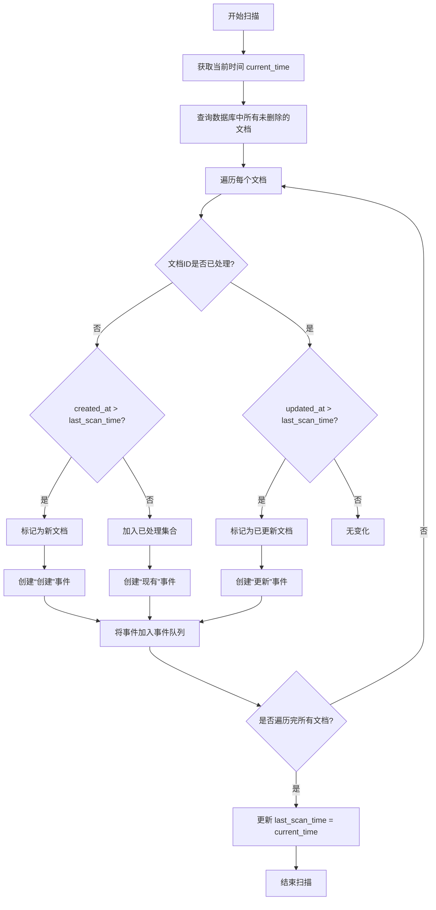
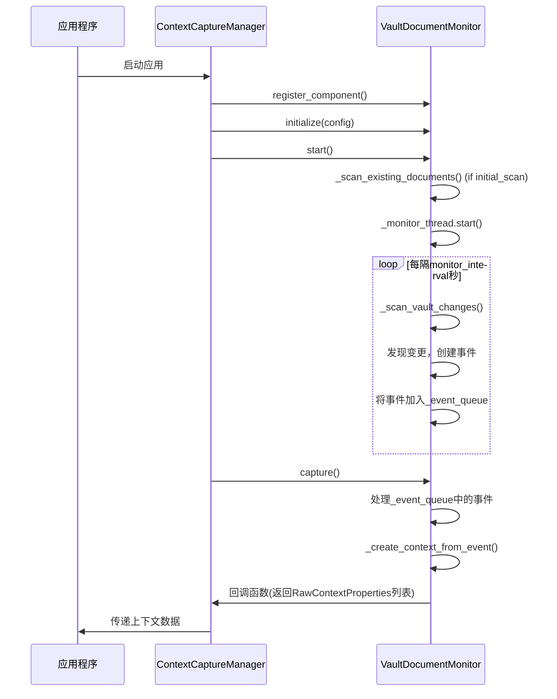

# 知识库文档监控

<cite>
**本文档引用的文件**   
- [vault_document_monitor.py](file://opencontext/context_capture/vault_document_monitor.py#L1-L389)
- [base.py](file://opencontext/context_capture/base.py#L1-L515)
- [context.py](file://opencontext/models/context.py#L1-L343)
- [global_storage.py](file://opencontext/storage/global_storage.py#L1-L196)
- [unified_storage.py](file://opencontext/storage/unified_storage.py#L1-L925)
- [sqlite_backend.py](file://opencontext/storage/backends/sqlite_backend.py#L1-L2136)
- [config.yaml](file://config/config.yaml#L1-L253)
- [capture_manager.py](file://opencontext/managers/capture_manager.py#L1-L391)
</cite>

## 目录
1. [简介](#简介)
2. [核心组件分析](#核心组件分析)
3. [监控循环与变更检测](#监控循环与变更检测)
4. [上下文创建与文档路径](#上下文创建与文档路径)
5. [配置项详解](#配置项详解)
6. [组件初始化与启动流程](#组件初始化与启动流程)
7. [性能考量与扩展建议](#性能考量与扩展建议)

## 简介
`VaultDocumentMonitor` 是一个核心的上下文捕获组件，负责监控数据库中 `vaults` 表的文档变化。该组件通过一个独立的后台线程，定期查询数据库，识别出新创建或已更新的文档，并将这些变化作为上下文事件进行捕获。这些捕获到的上下文数据随后会被传递给系统的其他模块（如消费模块）进行进一步处理，例如生成智能摘要、提供上下文感知的AI助手服务等。本文档将深入分析其内部实现机制、工作流程和配置方式。

## 核心组件分析

`VaultDocumentMonitor` 组件继承自 `BaseCaptureComponent`，实现了 `ICaptureComponent` 接口，是上下文捕获系统的一部分。其主要职责是作为 `vaults` 表的观察者，将数据库中的文档变更转化为系统可理解的 `RawContextProperties` 对象。

该组件在初始化时会获取一个全局的存储实例（`get_storage()`），用于与数据库进行交互。它维护了多个内部状态：
- `_processed_vault_ids`：一个集合，用于记录已经处理过的文档ID，以避免重复处理。
- `_document_events`：一个列表，用作事件队列，暂存检测到的文档变更事件（如“创建”、“更新”）。
- `_last_scan_time`：一个时间戳，记录了上一次扫描数据库的时间，这是判断文档是否为“新”或“已更新”的关键依据。
- `_monitor_interval`：一个整数，表示两次扫描之间的间隔时间（秒），由配置文件决定。

当组件启动时，它会创建一个名为 `vault_document_monitor` 的守护线程，并启动一个无限循环（`_monitor_loop`），该循环会按照设定的间隔时间持续运行，从而实现对数据库的周期性轮询。

**Section sources**
- [vault_document_monitor.py](file://opencontext/context_capture/vault_document_monitor.py#L26-L50)
- [base.py](file://opencontext/context_capture/base.py#L26-L56)

## 监控循环与变更检测

### 监控循环
`_monitor_loop` 方法是整个监控系统的核心。它在一个独立的线程中运行，形成了一个永不停止的循环。循环体内的逻辑非常简洁：
1.  调用 `_scan_vault_changes()` 方法，执行一次数据库扫描，检测自上次扫描以来的变化。
2.  调用 `time.sleep(self._monitor_interval)`，使线程休眠指定的秒数，然后重复上述过程。

这种设计确保了监控是持续且规律的。通过使用 `threading.Event()` 事件对象（`_stop_event`），主程序可以在需要时安全地停止这个循环，保证了组件的可管理性。

### 变更检测逻辑
`_scan_vault_changes` 方法是变更检测的具体执行者。其工作流程如下：

1.  **获取当前时间**：记录本次扫描的开始时间 `current_time`。
2.  **查询数据库**：通过 `self._storage.get_vaults()` 方法，从数据库中获取所有未被删除的文档（`is_deleted=False`）。为了性能考虑，查询结果通常会限制数量（如 `limit=100`）。
3.  **遍历文档**：对查询到的每个文档进行检查。
4.  **解析时间戳**：从文档数据中提取 `created_at` 和 `updated_at` 字段，并将其转换为 Python 的 `datetime` 对象。代码中处理了 `Z` 时区标识符，将其替换为 `+00:00`。
5.  **判断变更类型**：
    *   **新文档**：如果该文档的 `id` 不在 `_processed_vault_ids` 集合中，并且其 `created_at` 时间晚于 `_last_scan_time`，则判定为新文档。
    *   **已更新文档**：如果该文档的 `id` 已存在于 `_processed_vault_ids` 集合中，并且其 `updated_at` 时间晚于 `_last_scan_time`，则判定为已更新文档。
6.  **记录事件**：将检测到的新文档和已更新文档分别添加到 `new_documents` 和 `updated_documents` 列表中。
7.  **生成事件**：遍历 `new_documents` 和 `updated_documents` 列表，为每个文档创建一个事件字典（`event`），其中包含事件类型、文档ID、文档数据和时间戳。
8.  **存储事件**：在 `self._event_lock` 锁的保护下，将这些事件添加到 `_document_events` 队列中。使用锁是为了保证多线程环境下的数据安全。
9.  **更新状态**：最后，将 `_last_scan_time` 更新为本次扫描的 `current_time`，为下一次扫描做准备。

值得注意的是，在 `start` 阶段，如果配置了 `initial_scan`，组件会先调用 `_scan_existing_documents` 方法，对数据库中所有现有文档进行一次全量扫描，将它们作为“existing”事件加入队列。这确保了系统在启动时就能捕获到知识库的完整状态。



**Diagram sources**
- [vault_document_monitor.py](file://opencontext/context_capture/vault_document_monitor.py#L145-L247)
- [sqlite_backend.py](file://opencontext/storage/backends/sqlite_backend.py#L481-L559)

## 上下文创建与文档路径

### 上下文创建
当外部系统（如 `ContextCaptureManager`）调用组件的 `capture` 方法时，组件会从 `_document_events` 队列中取出所有待处理的事件，并通过 `_create_context_from_event` 方法将每个事件转换为 `RawContextProperties` 对象。

该方法的实现如下：
1.  从事件字典中提取文档数据（`doc`）和文档ID（`vault_id`）。
2.  创建一个 `RawContextProperties` 实例，其关键属性包括：
    *   `source`: 设置为 `ContextSource.VAULT`，标识数据来源。
    *   `content_format`: 设置为 `ContentFormat.TEXT`，表示内容为文本。
    *   `content_text`: 将文档的 `title`、`summary` 和 `content` 字段拼接成一个长字符串，作为上下文的主要内容。
    *   `create_time`: 使用文档的 `created_at` 时间戳。
    *   `filter_path`: 调用 `_get_document_path(doc)` 方法获取文档的完整路径。
    *   `additional_info`: 一个字典，包含了文档ID、标题、摘要、标签、文档类型和事件类型等元数据。
    *   `enable_merge`: 设置为 `False`，表示此上下文不参与合并。

### 文档路径构建
`_get_document_path` 方法旨在根据文档的 `parent_id` 层级关系，构建出类似 `/文件夹/子文件夹/文档名` 的完整路径。然而，根据代码中的注释 `# TODO: Implement complete path building logic`，当前的实现是不完整的。它仅返回一个简单的路径，如 `/folder/文档名` 或 `/文档名`。这是一个潜在的扩展点，未来可以通过递归查询 `parent_id` 来构建真实的层级路径。

**Section sources**
- [vault_document_monitor.py](file://opencontext/context_capture/vault_document_monitor.py#L119-L143)
- [vault_document_monitor.py](file://opencontext/context_capture/vault_document_monitor.py#L251-L287)
- [vault_document_monitor.py](file://opencontext/context_capture/vault_document_monitor.py#L288-L308)
- [context.py](file://opencontext/models/context.py#L35-L46)

## 配置项详解

`VaultDocumentMonitor` 组件的行为可以通过配置文件进行调整。其配置模式遵循 `BaseCaptureComponent` 的规范，通过 `get_config_schema_impl` 方法定义了两个核心配置项：

- **`monitor_interval`**:
    *   **描述**: 监控间隔（秒）。
    *   **类型**: 整数。
    *   **默认值**: `5`。
    *   **作用**: 定义了 `_monitor_loop` 线程中 `time.sleep()` 的休眠时间。值越小，监控越频繁，能更快地发现变更，但会增加数据库的查询压力；值越大，则更节省资源，但变更的发现会有延迟。

- **`initial_scan`**:
    *   **描述**: 是否执行初始扫描。
    *   **类型**: 布尔值。
    *   **默认值**: `True`。
    *   **作用**: 在组件启动时，如果此选项为 `True`，则会执行一次全量扫描，将数据库中所有现有文档作为上下文事件捕获。这对于系统首次启动或需要重新同步状态时非常有用。

这些配置项在 `config.yaml` 文件中定义，位于 `capture.vault_document_monitor` 节点下。例如：
```yaml
capture:
  vault_document_monitor:
    enabled: true
    monitor_interval: 30
    initial_scan: true
```
`enabled` 选项控制整个组件是否启用。

**Section sources**
- [vault_document_monitor.py](file://opencontext/context_capture/vault_document_monitor.py#L310-L331)
- [config.yaml](file://config/config.yaml#L70-L75)

## 组件初始化与启动流程

`VaultDocumentMonitor` 组件的生命周期由 `ContextCaptureManager` 统一管理。其流程如下：

1.  **注册**：应用启动时，`ContextCaptureManager` 会创建 `VaultDocumentMonitor` 的实例，并通过 `register_component` 方法将其注册到管理器中。
2.  **初始化**：管理器调用组件的 `initialize` 方法，并传入从 `config.yaml` 中读取的配置。组件的 `_initialize_impl` 方法会设置 `monitor_interval` 并初始化 `_last_scan_time`。
3.  **启动**：管理器调用组件的 `start` 方法。组件的 `_start_impl` 方法会：
    *   如果 `initial_scan` 为 `True`，则执行一次初始扫描。
    *   创建并启动 `_monitor_loop` 线程。
4.  **捕获**：`_monitor_loop` 线程开始运行，定期调用 `_scan_vault_changes` 检测变更，并将事件存入队列。
5.  **回调**：当管理器调用 `capture` 方法时，组件会处理队列中的事件，通过 `_create_context_from_event` 创建 `RawContextProperties` 对象，并通过预设的回调函数将这些对象传递给上层系统（如 `OpenContext` 应用）。



**Diagram sources**
- [vault_document_monitor.py](file://opencontext/context_capture/vault_document_monitor.py#L76-L98)
- [capture_manager.py](file://opencontext/managers/capture_manager.py#L135-L172)
- [base.py](file://opencontext/context_capture/base.py#L94-L124)

## 性能考量与扩展建议

### 性能考量
数据库查询频率（由 `monitor_interval` 决定）是影响性能的关键因素。过于频繁的查询（如每秒一次）会给数据库带来持续的负载，可能导致性能瓶颈，尤其是在文档数量庞大的情况下。反之，过长的间隔（如几分钟）则会导致上下文更新的延迟，影响用户体验。因此，需要根据实际的文档变更频率和系统负载来权衡，选择一个合适的 `monitor_interval` 值。在 `config.yaml` 中，默认值为30秒，这是一个相对平衡的设置。

### 扩展建议
1.  **完善文档路径**：首要的扩展是实现 `_get_document_path` 方法中 TODO 的功能。可以通过在 `UnifiedStorage` 或 `SQLiteBackend` 中添加一个递归查询 `parent_id` 的方法，来构建真实的、反映文件夹层级的完整路径。
2.  **增量查询优化**：目前的 `_scan_vault_changes` 方法会查询所有未删除的文档。可以优化为只查询 `created_at` 或 `updated_at` 大于 `_last_scan_time` 的文档，这能显著减少数据传输量和处理时间。
3.  **事件通知机制**：目前采用的是轮询（Polling）模式。一个更高效的方案是采用事件驱动（Event-driven）模式，例如监听数据库的变更日志（Change Data Capture, CDC），这样可以做到实时响应，且对数据库的压力更小。

**Section sources**
- [vault_document_monitor.py](file://opencontext/context_capture/vault_document_monitor.py#L39-L40)
- [vault_document_monitor.py](file://opencontext/context_capture/vault_document_monitor.py#L288-L308)
- [config.yaml](file://config/config.yaml#L73)