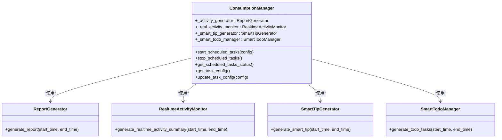
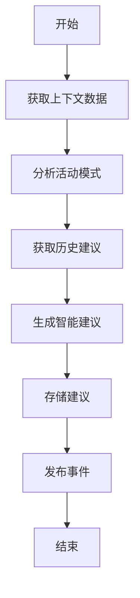
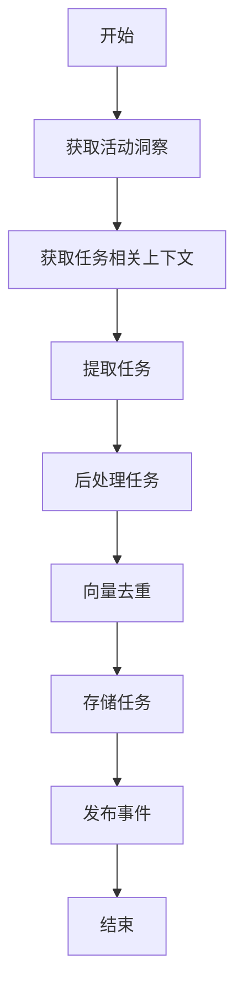
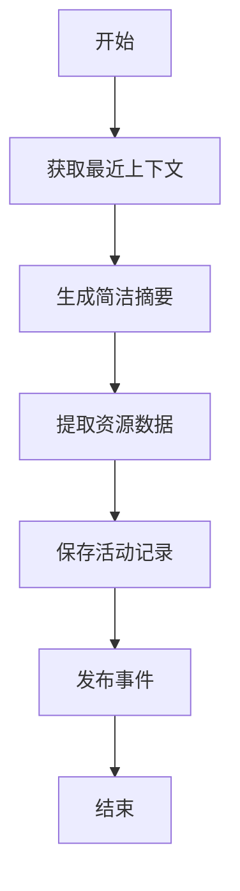
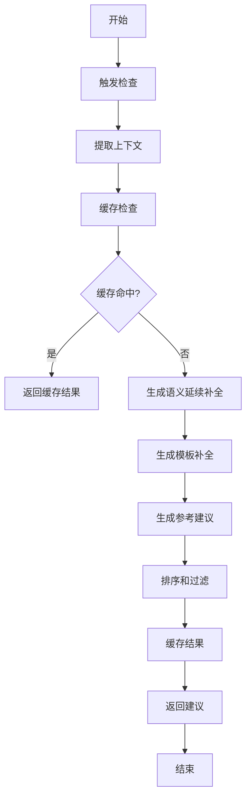
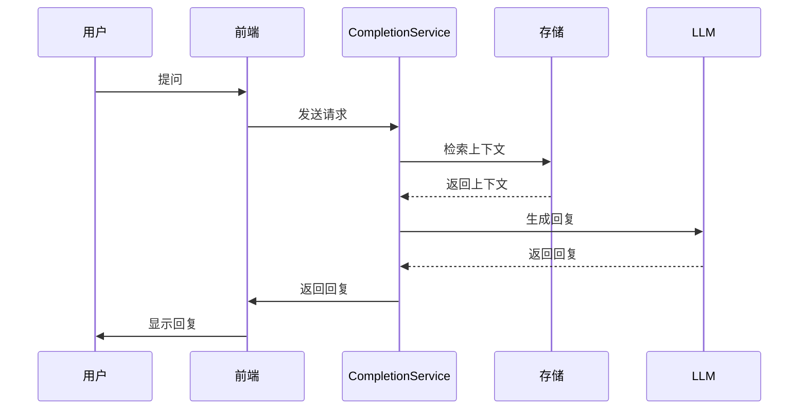

# 上下文消费

<cite>
**本文档引用的文件**   
- [consumption_manager.py](file://opencontext/managers/consumption_manager.py)
- [smart_tip_generator.py](file://opencontext/context_consumption/generation/smart_tip_generator.py)
- [smart_todo_manager.py](file://opencontext/context_consumption/generation/smart_todo_manager.py)
- [realtime_activity_monitor.py](file://opencontext/context_consumption/generation/realtime_activity_monitor.py)
- [completion_service.py](file://opencontext/context_consumption/completion/completion_service.py)
- [completion_cache.py](file://opencontext/context_consumption/completion/completion_cache.py)
- [generation_report.py](file://opencontext/context_consumption/generation/generation_report.py)
- [agent.py](file://opencontext/context_consumption/context_agent/agent.py)
- [context.py](file://opencontext/context_consumption/context_agent/nodes/context.py)
- [intent.py](file://opencontext/context_consumption/context_agent/nodes/intent.py)
- [prompts_en.yaml](file://config/prompts_en.yaml)
- [global_storage.py](file://opencontext/storage/global_storage.py)
- [global_vlm_client.py](file://opencontext/llm/global_vlm_client.py)
</cite>

## 目录
1. [引言](#引言)
2. [核心组件](#核心组件)
3. [ConsumptionManager 协调机制](#consumptionmanager-协调机制)
4. [智能建议生成](#智能建议生成)
5. [任务去重与管理](#任务去重与管理)
6. [实时活动报告](#实时活动报告)
7. [聊天请求处理](#聊天请求处理)
8. [用户工作流示例](#用户工作流示例)
9. [性能与资源管理](#性能与资源管理)
10. [结论](#结论)

## 引言
上下文消费模块是 OpenContext 系统的核心功能之一，负责将已处理和存储的上下文数据转化为对用户有价值的信息。该模块通过协调多个消费组件，如 `SmartTipGenerator`、`SmartTodoManager` 和 `RealtimeActivityMonitor`，来生成智能建议、管理任务和生成实时活动报告。此外，`CompletionService` 组件利用大型语言模型（LLM）处理用户的聊天请求，生成回复。这些功能共同构成了一个强大的上下文消费系统，为用户提供个性化的智能服务。

## 核心组件
上下文消费模块包含多个核心组件，每个组件负责不同的功能。`ConsumptionManager` 作为协调者，管理并协调这些组件的运行。`SmartTipGenerator` 负责生成智能建议，`SmartTodoManager` 负责任务的去重和管理，`RealtimeActivityMonitor` 负责生成实时活动报告，而 `CompletionService` 则负责处理用户的聊天请求。

**Section sources**
- [consumption_manager.py](file://opencontext/managers/consumption_manager.py#L31-L524)
- [smart_tip_generator.py](file://opencontext/context_consumption/generation/smart_tip_generator.py#L40-L373)
- [smart_todo_manager.py](file://opencontext/context_consumption/generation/smart_todo_manager.py#L46-L505)
- [realtime_activity_monitor.py](file://opencontext/context_consumption/generation/realtime_activity_monitor.py#L54-L343)
- [completion_service.py](file://opencontext/context_consumption/completion/completion_service.py#L56-L492)

## ConsumptionManager 协调机制
`ConsumptionManager` 是上下文消费模块的核心协调者，负责管理并协调各个消费组件的运行。它通过初始化各个组件实例，并根据配置启动定时任务，确保各个组件能够按计划执行其功能。

**Diagram sources**
- [consumption_manager.py](file://opencontext/managers/consumption_manager.py#L31-L524)
- [generation_report.py](file://opencontext/context_consumption/generation/generation_report.py#L26-L277)
- [realtime_activity_monitor.py](file://opencontext/context_consumption/generation/realtime_activity_monitor.py#L54-L343)
- [smart_tip_generator.py](file://opencontext/context_consumption/generation/smart_tip_generator.py#L40-L373)
- [smart_todo_manager.py](file://opencontext/context_consumption/generation/smart_todo_manager.py#L46-L505)

## 智能建议生成
`SmartTipGenerator` 组件负责生成个性化的智能建议。它通过分析用户最近的活动模式，结合历史建议，生成有价值的提醒和建议。

### 生成流程
1. **获取上下文数据**：从存储中获取指定时间范围内的多类型上下文数据，包括活动、语义、意图、实体、过程和状态上下文。
2. **分析活动模式**：分析用户在最近6小时内的活动模式，包括工作时间分布、类别趋势、关键实体、焦点转移和连续工作时段。
3. **获取历史建议**：查询过去24小时内的历史建议，以避免重复生成。
4. **生成智能建议**：结合上下文数据、活动模式和历史建议，通过大型语言模型生成智能建议。

**Diagram sources**
- [smart_tip_generator.py](file://opencontext/context_consumption/generation/smart_tip_generator.py#L46-L373)

## 任务去重与管理
`SmartTodoManager` 组件负责智能识别和管理待办事项。它通过分析用户活动中的潜在任务，结合历史任务信息，生成高质量的待办事项，并进行去重处理。

### 去重机制
1. **向量化**：为每个新生成的任务生成向量表示。
2. **相似性搜索**：在向量数据库中搜索与新任务相似的历史任务。
3. **阈值判断**：如果相似度超过预设阈值（默认0.85），则认为是重复任务，予以过滤。
4. **批内去重**：在当前批次生成的任务之间进行相似性比较，避免批内重复。

**Diagram sources**
- [smart_todo_manager.py](file://opencontext/context_consumption/generation/smart_todo_manager.py#L57-L505)

## 实时活动报告
`RealtimeActivityMonitor` 组件负责生成实时活动报告。它通过分析用户最近的活动记录，生成一个包含类别分布、提取洞察和代表性上下文ID的摘要。

### 生成流程
1. **获取最近上下文**：从存储中获取指定时间范围内的活动和意图上下文。
2. **生成简洁摘要**：结合上下文数据，通过大型语言模型生成一个简洁的活动摘要。
3. **提取资源数据**：从上下文中提取截图等资源数据。
4. **保存活动记录**：将生成的摘要和资源数据保存到活动表中，并发布事件。

**Diagram sources**
- [realtime_activity_monitor.py](file://opencontext/context_consumption/generation/realtime_activity_monitor.py#L60-L343)

## 聊天请求处理
`CompletionService` 组件负责处理用户的聊天请求。它通过检索相关上下文，利用大型语言模型生成回复，并支持工具调用来获取背景信息。

### 处理流程
1. **触发检查**：检查是否满足触发补全的条件，如输入长度和光标位置。
2. **提取上下文**：提取光标前后的文本、当前行、当前段落和文档结构信息。
3. **缓存检查**：检查缓存中是否有匹配的结果，如果有则直接返回。
4. **生成补全建议**：
   - **语义延续补全**：基于上下文生成语义延续建议。
   - **模板补全**：根据文档结构生成模板补全建议。
   - **参考建议**：通过向量搜索生成参考建议。
5. **排序和过滤**：根据置信度对建议进行排序，并进行去重过滤。
6. **缓存结果**：将生成的建议缓存起来，以提高后续请求的响应速度。

**Diagram sources**
- [completion_service.py](file://opencontext/context_consumption/completion/completion_service.py#L92-L492)
- [completion_cache.py](file://opencontext/context_consumption/completion/completion_cache.py#L46-L443)

## 用户工作流示例
以下是一个典型的用户工作流示例，展示了从用户提问到返回前端的完整过程：

**Diagram sources**
- [completion_service.py](file://opencontext/context_consumption/completion/completion_service.py#L92-L492)
- [global_storage.py](file://opencontext/storage/global_storage.py#L124-L185)
- [global_vlm_client.py](file://opencontext/llm/global_vlm_client.py#L114-L317)

## 性能与资源管理
上下文消费模块通过多种机制来优化性能和资源管理，确保系统的高效运行。

### 异步任务队列
- **并发处理**：`RealtimeActivityMonitor` 和 `ReportGenerator` 使用异步任务队列来并发处理多个时间片段，提高处理效率。
- **资源优化**：通过限制并发任务数量（如 `ReportGenerator` 中的 `Semaphore(5)`），避免资源过度消耗。

### 缓存机制
- **补全缓存**：`CompletionService` 使用 `CompletionCache` 来缓存补全建议，减少重复计算，提高响应速度。
- **预计算上下文**：`CompletionCache` 支持预计算文档上下文，进一步优化性能。

### 定时任务管理
- **动态配置**：`ConsumptionManager` 支持动态更新任务配置，如生成间隔和启用状态，无需重启服务。
- **定时器管理**：通过 `threading.Timer` 管理定时任务，确保任务按计划执行。

**Section sources**
- [consumption_manager.py](file://opencontext/managers/consumption_manager.py#L132-L357)
- [generation_report.py](file://opencontext/context_consumption/generation/generation_report.py#L76-L109)
- [completion_cache.py](file://opencontext/context_consumption/completion/completion_cache.py#L46-L443)

## 结论
上下文消费模块通过 `ConsumptionManager` 协调多个消费组件，实现了智能建议生成、任务去重与管理、实时活动报告生成和聊天请求处理等功能。这些功能充分利用了已处理和存储的上下文数据，为用户提供个性化的智能服务。通过异步任务队列和缓存机制，模块在保证高性能的同时，有效管理了系统资源。未来可以进一步优化算法和增加更多消费场景，提升用户体验。