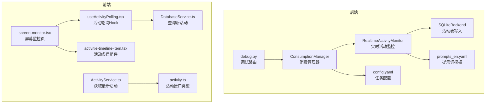
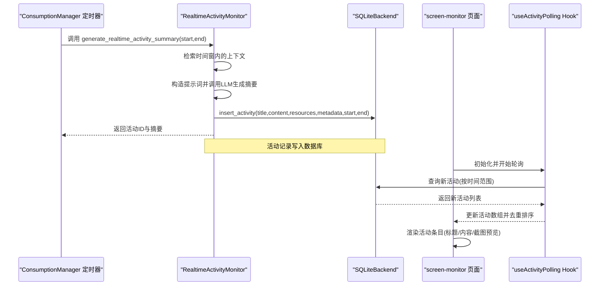
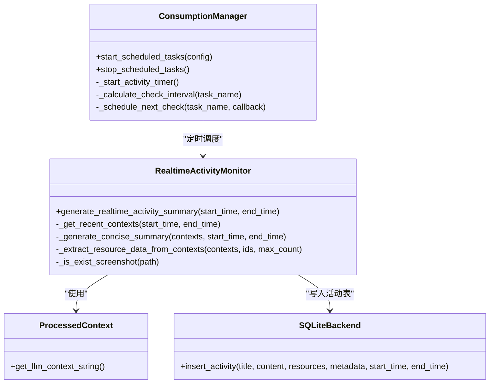
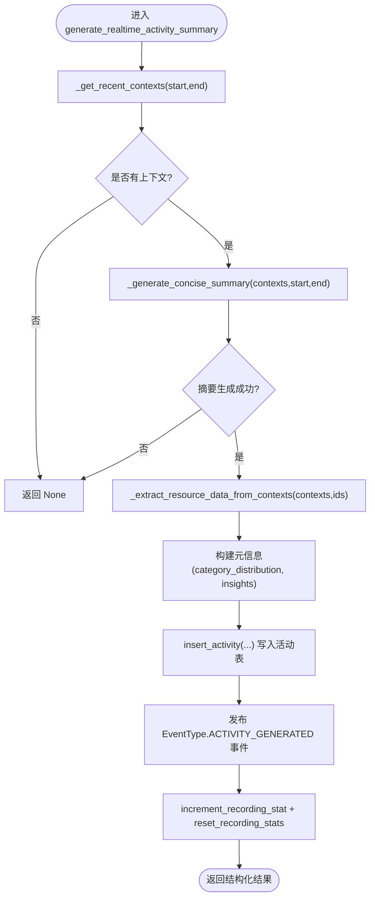

# 实时活动监控

<cite>
**本文引用的文件列表**
- [realtime_activity_monitor.py](file://opencontext/context_consumption/generation/realtime_activity_monitor.py)
- [consumption_manager.py](file://opencontext/managers/consumption_manager.py)
- [context.py](file://opencontext/models/context.py)
- [sqlite_backend.py](file://opencontext/storage/backends/sqlite_backend.py)
- [prompts_en.yaml](file://config/prompts_en.yaml)
- [config.yaml](file://config/config.yaml)
- [screen-monitor.tsx](file://frontend/src/renderer/src/pages/screen-monitor/screen-monitor.tsx)
- [useActivityPolling.tsx](file://frontend/src/renderer/src/pages/screen-monitor/hooks/useActivityPolling.tsx)
- [activity.tsx](file://frontend/src/renderer/src/pages/screen-monitor/components/activitie-timeline-item.tsx)
- [activity.ts](file://frontend/src/interface/db/activity.ts)
- [ActivityService.ts](file://frontend/src/main/services/ActivityService.ts)
- [DatabaseService.ts](file://frontend/src/main/services/DatabaseService.ts)
- [debug.py](file://opencontext/server/routes/debug.py)
</cite>

## 目录
1. [简介](#简介)
2. [项目结构](#项目结构)
3. [核心组件](#核心组件)
4. [架构总览](#架构总览)
5. [详细组件分析](#详细组件分析)
6. [依赖关系分析](#依赖关系分析)
7. [性能考量](#性能考量)
8. [故障排查指南](#故障排查指南)
9. [结论](#结论)
10. [附录](#附录)

## 简介
本文件系统性阐述 RealtimeActivityMonitor 组件的实现与功能，重点覆盖以下方面：
- 如何聚合与分析用户的实时活动数据（屏幕截图、应用程序使用情况、文档编辑记录等），生成简洁的活动摘要；
- generate_realtime_activity_summary 方法的执行流程：时间窗口检索、多模态数据融合、LLM 总结、结构化存储；
- 摘要如何用于提供用户当前工作状态的快速概览，并作为日报生成、智能建议等后续消费功能的基础；
- 实时性保障机制与 ConsumptionManager 定时任务的集成方式。

## 项目结构
围绕“实时活动监控”的关键模块分布如下：
- 后端 Python 侧
  - generation/realtime_activity_monitor.py：实时活动监控主逻辑
  - managers/consumption_manager.py：消费管理器，负责调度与定时任务
  - models/context.py：上下文模型与 LLM 输入字符串构造
  - storage/backends/sqlite_backend.py：活动表写入
  - config/prompts_en.yaml：实时活动摘要提示词模板
  - config/config.yaml：内容生成任务配置（含 activity 间隔）
  - server/routes/debug.py：调试接口触发实时活动生成
- 前端 Electron/React 侧
  - screen-monitor 页面：展示活动时间线、轮询新活动、预览截图资源
  - hooks/useActivityPolling.tsx：活动轮询逻辑
  - components/activitie-timeline-item.tsx：活动条目渲染（标题、内容、截图预览）
  - interface/db/activity.ts：活动表结构类型定义
  - main/services/ActivityService.ts、DatabaseService.ts：数据库读取封装

图表来源
- [realtime_activity_monitor.py](file://opencontext/context_consumption/generation/realtime_activity_monitor.py#L59-L131)
- [consumption_manager.py](file://opencontext/managers/consumption_manager.py#L243-L281)
- [sqlite_backend.py](file://opencontext/storage/backends/sqlite_backend.py#L758-L804)
- [prompts_en.yaml](file://config/prompts_en.yaml#L1270-L1286)
- [config.yaml](file://config/config.yaml#L224-L239)
- [debug.py](file://opencontext/server/routes/debug.py#L658-L691)
- [screen-monitor.tsx](file://frontend/src/renderer/src/pages/screen-monitor/screen-monitor.tsx#L186-L271)
- [useActivityPolling.tsx](file://frontend/src/renderer/src/pages/screen-monitor/hooks/useActivityPolling.tsx#L1-L112)
- [activity.tsx](file://frontend/src/renderer/src/pages/screen-monitor/components/activitie-timeline-item.tsx#L1-L48)
- [activity.ts](file://frontend/src/interface/db/activity.ts#L1-L27)
- [ActivityService.ts](file://frontend/src/main/services/ActivityService.ts#L1-L25)
- [DatabaseService.ts](file://frontend/src/main/services/DatabaseService.ts#L191-L221)

章节来源
- [realtime_activity_monitor.py](file://opencontext/context_consumption/generation/realtime_activity_monitor.py#L59-L131)
- [consumption_manager.py](file://opencontext/managers/consumption_manager.py#L243-L281)
- [sqlite_backend.py](file://opencontext/storage/backends/sqlite_backend.py#L758-L804)
- [prompts_en.yaml](file://config/prompts_en.yaml#L1270-L1286)
- [config.yaml](file://config/config.yaml#L224-L239)
- [debug.py](file://opencontext/server/routes/debug.py#L658-L691)
- [screen-monitor.tsx](file://frontend/src/renderer/src/pages/screen-monitor/screen-monitor.tsx#L186-L271)
- [useActivityPolling.tsx](file://frontend/src/renderer/src/pages/screen-monitor/hooks/useActivityPolling.tsx#L1-L112)
- [activity.tsx](file://frontend/src/renderer/src/pages/screen-monitor/components/activitie-timeline-item.tsx#L1-L48)
- [activity.ts](file://frontend/src/interface/db/activity.ts#L1-L27)
- [ActivityService.ts](file://frontend/src/main/services/ActivityService.ts#L1-L25)
- [DatabaseService.ts](file://frontend/src/main/services/DatabaseService.ts#L191-L221)

## 核心组件
- RealtimeActivityMonitor：负责在指定时间窗口内检索处理后的上下文，构造提示词，调用 LLM 生成摘要，抽取代表性截图资源，将摘要与元信息持久化到活动表，并发布事件通知。
- ConsumptionManager：统一协调内容消费组件，启动定时任务，按配置周期触发实时活动生成；同时维护各任务的启用状态、间隔与最后生成时间。
- ProcessedContext：承载已处理上下文的结构化信息，提供 get_llm_context_string 将关键字段拼接为 LLM 输入字符串。
- SQLiteBackend：提供 insert_activity 接口，将活动摘要写入数据库。
- 前端 screen-monitor 页面与 useActivityPolling Hook：轮询新活动并更新 UI，支持截图预览与标题气泡展示。

章节来源
- [realtime_activity_monitor.py](file://opencontext/context_consumption/generation/realtime_activity_monitor.py#L59-L131)
- [consumption_manager.py](file://opencontext/managers/consumption_manager.py#L243-L281)
- [context.py](file://opencontext/models/context.py#L131-L184)
- [sqlite_backend.py](file://opencontext/storage/backends/sqlite_backend.py#L758-L804)
- [screen-monitor.tsx](file://frontend/src/renderer/src/pages/screen-monitor/screen-monitor.tsx#L186-L271)
- [useActivityPolling.tsx](file://frontend/src/renderer/src/pages/screen-monitor/hooks/useActivityPolling.tsx#L1-L112)

## 架构总览
下图展示了从定时任务到前端展示的完整链路：

图表来源
- [consumption_manager.py](file://opencontext/managers/consumption_manager.py#L243-L281)
- [realtime_activity_monitor.py](file://opencontext/context_consumption/generation/realtime_activity_monitor.py#L59-L131)
- [sqlite_backend.py](file://opencontext/storage/backends/sqlite_backend.py#L758-L804)
- [screen-monitor.tsx](file://frontend/src/renderer/src/pages/screen-monitor/screen-monitor.tsx#L186-L271)
- [useActivityPolling.tsx](file://frontend/src/renderer/src/pages/screen-monitor/hooks/useActivityPolling.tsx#L1-L112)

## 详细组件分析

### RealtimeActivityMonitor 组件
- 职责
  - 在指定时间窗口内检索最近的处理后上下文（活动/意图两类）；
  - 将上下文转换为 LLM 友好的字符串，拼装提示词并调用全局 VLM/LLM 客户端生成摘要；
  - 抽取代表性截图资源，构建元信息（类别分布、洞察等），写入活动表；
  - 发布事件通知，重置录制统计，返回结构化结果供上层消费。

- 关键方法
  - generate_realtime_activity_summary(start_time, end_time)
    - 检索上下文、生成摘要、抽取资源、写库、发布事件、重置统计；
  - _get_recent_contexts(start_time, end_time)
    - 使用过滤条件按时间窗口检索两类上下文；
  - _generate_concise_summary(contexts, start_time, end_time)
    - 加载提示词模板，构造消息，调用 generate_with_messages，解析 JSON 并归一化类别分布；
  - _extract_resource_data_from_contexts(contexts, recommended_ids, max_count)
    - 优先挑选摘要中推荐的上下文对应的图片资源，补充部分活动上下文中的图片，限制数量；
  - _is_exist_screenshot(path)
    - 校验图片路径合法性与存在性。

- 数据结构
  - ProcessedContext.get_llm_context_string：将上下文的关键字段拼接为字符串，作为 LLM 输入；
  - ActivitySummaryResult：摘要结果的结构化字典（标题、描述、代表性上下文ID、类别分布、提取洞察）。

- 与提示词的关系
  - 提示词模板位于 prompts_en.yaml 中，限定输出字段与风格要求，确保摘要可解析且聚焦于应用使用、内容交互、目标行为与活动模式等维度。

- 与存储的关系
  - 通过 get_storage().insert_activity 写入活动表，包含 title、content、resources、metadata、start_time、end_time 字段。

- 与事件的关系
  - 生成完成后发布 EventType.ACTIVITY_GENERATED 事件，携带 doc_id、doc_type、title、content 等信息，便于订阅方同步更新。

- 与前端的关系
  - 前端通过轮询接口获取新活动，渲染标题、内容与截图预览；当屏幕锁定或暂停时停止轮询，恢复后再继续。

章节来源
- [realtime_activity_monitor.py](file://opencontext/context_consumption/generation/realtime_activity_monitor.py#L59-L131)
- [realtime_activity_monitor.py](file://opencontext/context_consumption/generation/realtime_activity_monitor.py#L133-L150)
- [realtime_activity_monitor.py](file://opencontext/context_consumption/generation/realtime_activity_monitor.py#L152-L244)
- [realtime_activity_monitor.py](file://opencontext/context_consumption/generation/realtime_activity_monitor.py#L278-L321)
- [realtime_activity_monitor.py](file://opencontext/context_consumption/generation/realtime_activity_monitor.py#L323-L341)
- [context.py](file://opencontext/models/context.py#L131-L184)
- [prompts_en.yaml](file://config/prompts_en.yaml#L1270-L1286)
- [sqlite_backend.py](file://opencontext/storage/backends/sqlite_backend.py#L758-L804)

### ConsumptionManager 定时任务集成
- 启动与调度
  - start_scheduled_tasks：根据配置启动各类定时器（活动/提示/待办/日报）；
  - _start_activity_timer：按配置间隔检查是否应生成活动摘要，计算时间窗并调用 RealtimeActivityMonitor；
  - _calculate_check_interval：将检查间隔设置为生成间隔的 1/4，但不超过上限，以降低抖动与开销；
  - _schedule_next_check：在每次生成后安排下一次检查。

- 配置项
  - content_generation.activity.interval：活动摘要生成间隔（秒），默认 900；
  - content_generation.activity.enabled：是否启用活动摘要任务；
  - 其他任务（tips、todos、report）也有类似配置。

- 动态更新
  - update_task_config 支持动态调整启用状态与间隔，必要时重启对应定时器。

- 调试触发
  - debug.py 的调试路由可直接调用 _real_activity_monitor.generate_realtime_activity_summary，便于验证与演示。

章节来源
- [consumption_manager.py](file://opencontext/managers/consumption_manager.py#L132-L170)
- [consumption_manager.py](file://opencontext/managers/consumption_manager.py#L243-L281)
- [consumption_manager.py](file://opencontext/managers/consumption_manager.py#L358-L371)
- [consumption_manager.py](file://opencontext/managers/consumption_manager.py#L380-L401)
- [consumption_manager.py](file://opencontext/managers/consumption_manager.py#L402-L450)
- [consumption_manager.py](file://opencontext/managers/consumption_manager.py#L483-L512)
- [config.yaml](file://config/config.yaml#L224-L239)
- [debug.py](file://opencontext/server/routes/debug.py#L658-L691)

### 前端展示与轮询
- screen-monitor.tsx
  - 在屏幕解锁时恢复轮询，在暂停/停止时停止轮询；
  - 仅在查看当天时轮询新活动，避免跨日数据错乱；
  - 过滤当日活动并去重，按时间顺序插入到数组前部。

- useActivityPolling.tsx
  - 初始化当天活动列表；
  - 每 5 秒轮询一次新活动，更新 lastCheckedTime 并合并新活动；
  - 卸载时清理轮询定时器。

- activitie-timeline-item.tsx
  - 展示活动标题与内容气泡；
  - 对 resources 中的图片资源进行预览组展示。

- DatabaseService.ts / ActivityService.ts
  - 提供查询新活动与获取最新活动的接口，支撑前端轮询与展示。

章节来源
- [screen-monitor.tsx](file://frontend/src/renderer/src/pages/screen-monitor/screen-monitor.tsx#L186-L271)
- [useActivityPolling.tsx](file://frontend/src/renderer/src/pages/screen-monitor/hooks/useActivityPolling.tsx#L1-L112)
- [activity.tsx](file://frontend/src/renderer/src/pages/screen-monitor/components/activitie-timeline-item.tsx#L1-L48)
- [DatabaseService.ts](file://frontend/src/main/services/DatabaseService.ts#L191-L221)
- [ActivityService.ts](file://frontend/src/main/services/ActivityService.ts#L1-L25)

## 依赖关系分析

图表来源
- [realtime_activity_monitor.py](file://opencontext/context_consumption/generation/realtime_activity_monitor.py#L59-L131)
- [realtime_activity_monitor.py](file://opencontext/context_consumption/generation/realtime_activity_monitor.py#L133-L150)
- [realtime_activity_monitor.py](file://opencontext/context_consumption/generation/realtime_activity_monitor.py#L152-L244)
- [realtime_activity_monitor.py](file://opencontext/context_consumption/generation/realtime_activity_monitor.py#L278-L341)
- [consumption_manager.py](file://opencontext/managers/consumption_manager.py#L243-L281)
- [context.py](file://opencontext/models/context.py#L131-L184)
- [sqlite_backend.py](file://opencontext/storage/backends/sqlite_backend.py#L758-L804)

章节来源
- [realtime_activity_monitor.py](file://opencontext/context_consumption/generation/realtime_activity_monitor.py#L59-L131)
- [consumption_manager.py](file://opencontext/managers/consumption_manager.py#L243-L281)
- [context.py](file://opencontext/models/context.py#L131-L184)
- [sqlite_backend.py](file://opencontext/storage/backends/sqlite_backend.py#L758-L804)

## 性能考量
- 时间窗口与批量检索
  - _get_recent_contexts 使用 update_time_ts 过滤，限制最大返回量，避免一次性加载过多上下文导致内存压力。
- LLM 调用与解析
  - 提示词模板明确输出结构，便于 parse_json_from_response 快速解析，减少失败重试成本；
  - 若解析失败，组件会回退为空结果，避免阻塞后续流程。
- 资源抽取与去重
  - _extract_resource_data_from_contexts 优先推荐上下文，限制最大数量，避免 UI 呈现过多图片造成卡顿；
  - _is_exist_screenshot 做基础校验，避免无效路径写入。
- 定时任务节流
  - 检查间隔为生成间隔的 1/4，且有上限，兼顾及时性与系统负载。
- 前端轮询
  - 每 5 秒轮询一次，仅在查看当天时生效，避免跨日数据错乱与重复请求。

[本节为通用性能建议，不直接分析具体文件]

## 故障排查指南
- 无活动记录
  - 现象：generate_realtime_activity_summary 返回空；
  - 排查：确认时间窗口内是否存在活动/意图上下文；检查 get_storage().get_all_processed_contexts 是否返回数据；查看日志异常堆栈。
- LLM 解析失败
  - 现象：_generate_concise_summary 解析 JSON 失败；
  - 排查：检查提示词模板是否被修改；确认 generate_with_messages 返回格式符合预期；查看 DebugHelper 保存的调试信息。
- 截图资源缺失
  - 现象：活动资源为空或图片无法显示；
  - 排查：确认 _is_exist_screenshot 校验通过；检查 content_path 是否存在且为图片扩展名；确认文件系统权限。
- 定时任务未触发
  - 现象：未生成活动摘要；
  - 排查：确认 content_generation.activity.enabled 与 interval 配置；查看 _should_generate 判定逻辑；检查 ConsumptionManager 的定时器状态。
- 前端不刷新
  - 现象：页面不显示新活动；
  - 排查：确认 screen-monitor.tsx 在屏幕解锁后恢复轮询；useActivityPolling.tsx 的轮询定时器是否正常；DatabaseService.ts 的查询参数是否正确。

章节来源
- [realtime_activity_monitor.py](file://opencontext/context_consumption/generation/realtime_activity_monitor.py#L59-L131)
- [realtime_activity_monitor.py](file://opencontext/context_consumption/generation/realtime_activity_monitor.py#L152-L244)
- [realtime_activity_monitor.py](file://opencontext/context_consumption/generation/realtime_activity_monitor.py#L278-L341)
- [consumption_manager.py](file://opencontext/managers/consumption_manager.py#L112-L127)
- [consumption_manager.py](file://opencontext/managers/consumption_manager.py#L243-L281)
- [screen-monitor.tsx](file://frontend/src/renderer/src/pages/screen-monitor/screen-monitor.tsx#L186-L271)
- [useActivityPolling.tsx](file://frontend/src/renderer/src/pages/screen-monitor/hooks/useActivityPolling.tsx#L1-L112)
- [DatabaseService.ts](file://frontend/src/main/services/DatabaseService.ts#L191-L221)

## 结论
RealtimeActivityMonitor 通过“时间窗口检索 + 多模态上下文拼装 + LLM 结构化摘要 + 资源抽取 + 结构化存储”的闭环，实现了对用户近期工作状态的快速概览。结合 ConsumptionManager 的定时调度与前端轮询机制，既能保证实时性，又能在不同场景下（如屏幕锁定）进行节流与降噪。生成的活动摘要可作为后续日报、智能建议等消费功能的数据基础，形成从采集、处理、生成到展示的完整链路。

[本节为总结性内容，不直接分析具体文件]

## 附录

### 生成摘要流程图（代码级映射）

图表来源
- [realtime_activity_monitor.py](file://opencontext/context_consumption/generation/realtime_activity_monitor.py#L59-L131)
- [realtime_activity_monitor.py](file://opencontext/context_consumption/generation/realtime_activity_monitor.py#L133-L150)
- [realtime_activity_monitor.py](file://opencontext/context_consumption/generation/realtime_activity_monitor.py#L152-L244)
- [realtime_activity_monitor.py](file://opencontext/context_consumption/generation/realtime_activity_monitor.py#L278-L341)
- [sqlite_backend.py](file://opencontext/storage/backends/sqlite_backend.py#L758-L804)