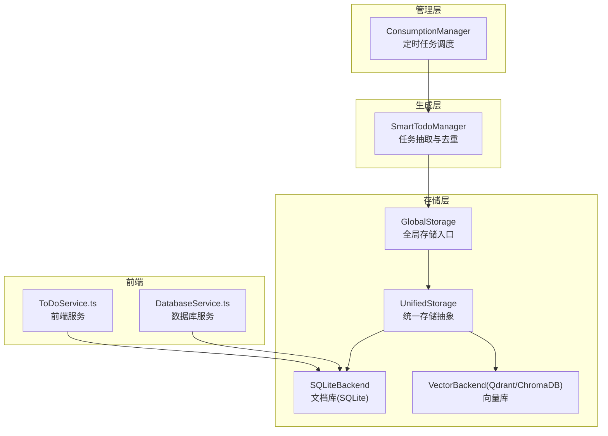
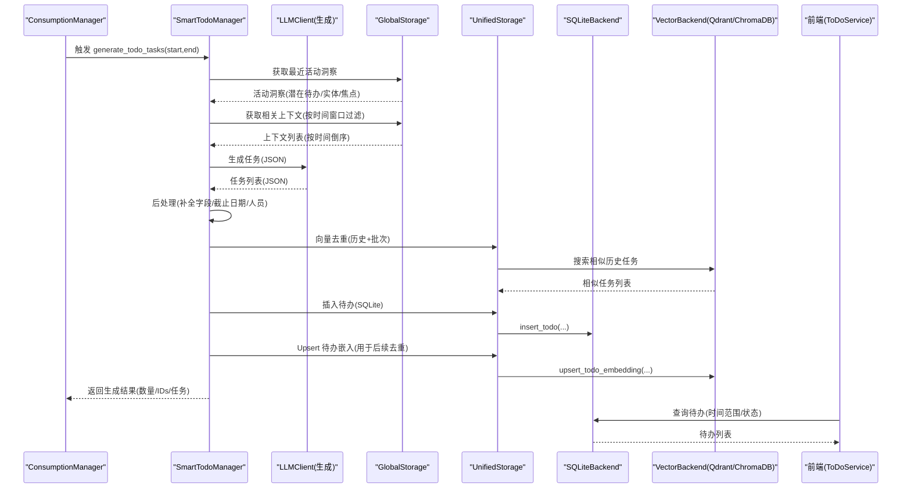
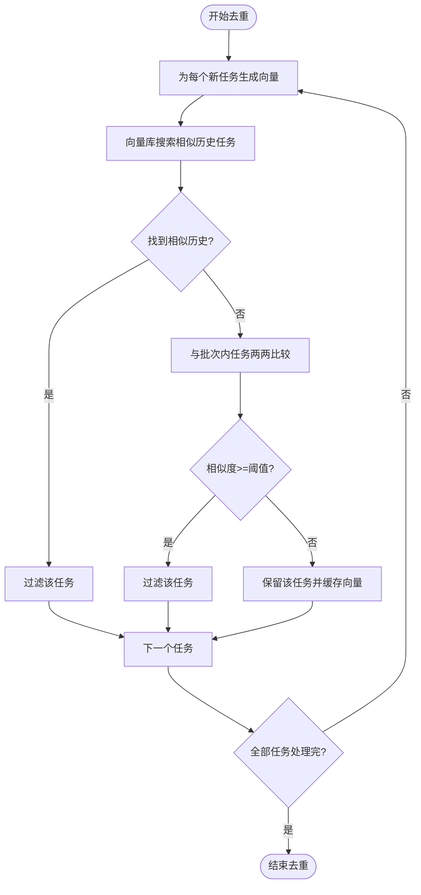
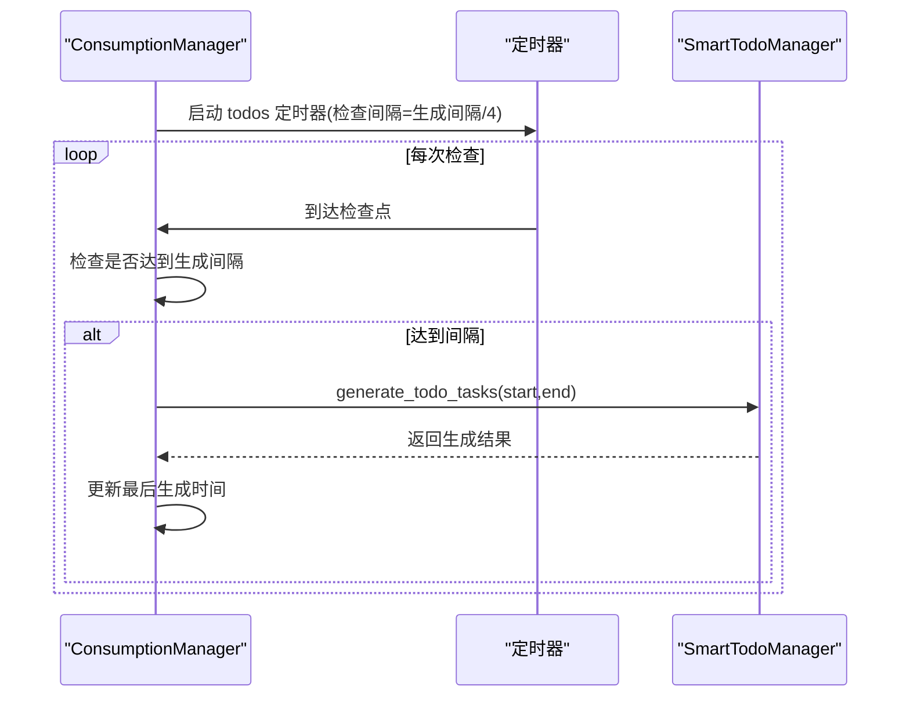
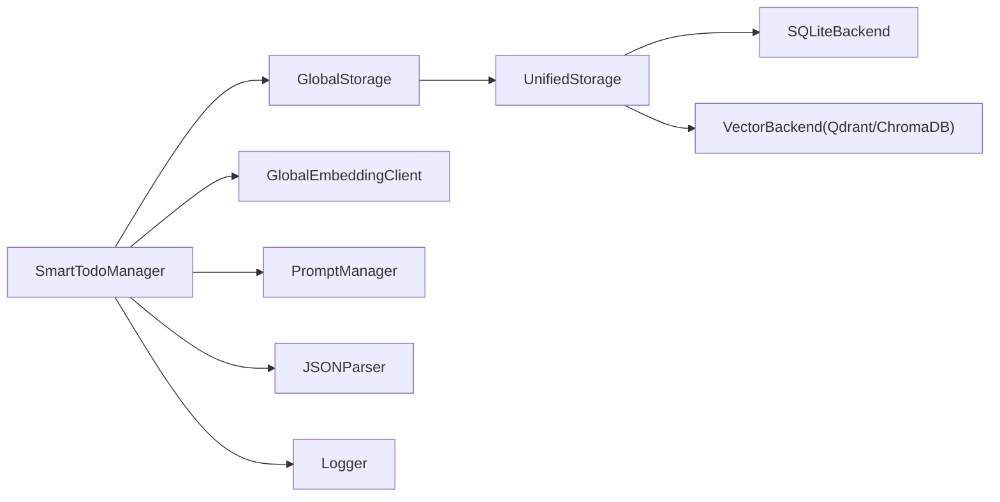

# 智能任务管理

<cite>
**本文引用的文件**
- [smart_todo_manager.py](file://opencontext/context_consumption/generation/smart_todo_manager.py)
- [consumption_manager.py](file://opencontext/managers/consumption_manager.py)
- [config.yaml](file://config/config.yaml)
- [global_storage.py](file://opencontext/storage/global_storage.py)
- [unified_storage.py](file://opencontext/storage/unified_storage.py)
- [sqlite_backend.py](file://opencontext/storage/backends/sqlite_backend.py)
- [qdrant_backend.py](file://opencontext/storage/backends/qdrant_backend.py)
- [global_embedding_client.py](file://opencontext/llm/global_embedding_client.py)
- [example_todo_deduplication.py](file://examples/example_todo_deduplication.py)
- [ToDoService.ts](file://frontend/src/main/services/ToDoService.ts)
- [DatabaseService.ts](file://frontend/src/main/services/DatabaseService.ts)
</cite>

## 目录
1. [简介](#简介)
2. [项目结构](#项目结构)
3. [核心组件](#核心组件)
4. [架构总览](#架构总览)
5. [详细组件分析](#详细组件分析)
6. [依赖关系分析](#依赖关系分析)
7. [性能考量](#性能考量)
8. [故障排查指南](#故障排查指南)
9. [结论](#结论)
10. [附录](#附录)

## 简介
本文件围绕“智能任务管理”子系统，系统性阐述 SmartTodoManager 组件的实现与功能，重点覆盖以下方面：
- 如何从用户上下文数据（会议记录、文档、聊天内容等）中自动抽取、生成并去重待办任务；
- generate_todo_tasks 方法的内部流程：提示工程、LLM 响应解析、任务去重算法（基于语义相似度）、任务状态管理；
- 任务持久化存储到数据库并与前端待办事项列表同步；
- 结合 example_todo_deduplication.py 示例，说明去重功能的使用场景与 API；
- 通过 ConsumptionManager 的定时任务周期性触发，以及相关配置项（如生成间隔）。

## 项目结构
智能任务管理位于 opencontext 子系统内，主要由以下层次构成：
- 生成层：SmartTodoManager 负责从上下文抽取任务、调用 LLM、解析结果、去重与入库；
- 管理层：ConsumptionManager 负责调度 SmartTodoManager 的周期性执行；
- 存储层：UnifiedStorage 抽象多后端（向量库 ChromaDB/Qdrant、文档库 SQLite），提供统一接口；
- 前端层：ToDoService/DatabaseService 提供待办查询、创建、更新、删除等操作，与 SQLite 数据库交互。

图表来源
- [smart_todo_manager.py](file://opencontext/context_consumption/generation/smart_todo_manager.py#L57-L132)
- [consumption_manager.py](file://opencontext/managers/consumption_manager.py#L319-L356)
- [global_storage.py](file://opencontext/storage/global_storage.py#L188-L196)
- [unified_storage.py](file://opencontext/storage/unified_storage.py#L578-L701)
- [sqlite_backend.py](file://opencontext/storage/backends/sqlite_backend.py#L100-L125)
- [qdrant_backend.py](file://opencontext/storage/backends/qdrant_backend.py#L580-L667)
- [ToDoService.ts](file://frontend/src/main/services/ToDoService.ts#L1-L200)
- [DatabaseService.ts](file://frontend/src/main/services/DatabaseService.ts#L223-L257)

章节来源
- [smart_todo_manager.py](file://opencontext/context_consumption/generation/smart_todo_manager.py#L57-L132)
- [consumption_manager.py](file://opencontext/managers/consumption_manager.py#L319-L356)

## 核心组件
- SmartTodoManager：负责从最近活动洞察、相关上下文与历史任务中合成高质量待办；调用 LLM 进行抽取与解析；执行向量去重；将任务写入 SQLite 并将嵌入写入向量库；返回生成结果。
- ConsumptionManager：周期性调度内容生成任务，其中包含“智能待办”任务；支持动态启停与调整间隔。
- UnifiedStorage/GlobalStorage：统一访问向量库与文档库，提供插入任务、查询任务、插入/查询活动、向量嵌入 Upsert/搜索等能力。
- 前端 ToDoService/DatabaseService：提供待办查询、创建、更新、删除等接口，与本地 SQLite 数据库交互。

章节来源
- [smart_todo_manager.py](file://opencontext/context_consumption/generation/smart_todo_manager.py#L46-L132)
- [consumption_manager.py](file://opencontext/managers/consumption_manager.py#L319-L356)
- [unified_storage.py](file://opencontext/storage/unified_storage.py#L578-L701)
- [global_storage.py](file://opencontext/storage/global_storage.py#L188-L196)
- [ToDoService.ts](file://frontend/src/main/services/ToDoService.ts#L1-L200)
- [DatabaseService.ts](file://frontend/src/main/services/DatabaseService.ts#L223-L257)

## 架构总览
下图展示从“最近活动洞察”到“生成待办并去重”的完整链路，以及与存储层、前端的交互。

图表来源
- [consumption_manager.py](file://opencontext/managers/consumption_manager.py#L319-L356)
- [smart_todo_manager.py](file://opencontext/context_consumption/generation/smart_todo_manager.py#L57-L132)
- [unified_storage.py](file://opencontext/storage/unified_storage.py#L311-L339)
- [sqlite_backend.py](file://opencontext/storage/backends/sqlite_backend.py#L100-L125)
- [qdrant_backend.py](file://opencontext/storage/backends/qdrant_backend.py#L580-L667)
- [ToDoService.ts](file://frontend/src/main/services/ToDoService.ts#L44-L95)

## 详细组件分析

### SmartTodoManager 组件
- 职责
  - 从最近活动洞察中聚合潜在待办；
  - 汇聚相关上下文（按时间窗口过滤）；
  - 调用 LLM 进行任务抽取与解析；
  - 后处理：补全字段、设置默认截止日期、清洗参与人信息；
  - 向量去重：历史去重 + 批次内去重；
  - 写入 SQLite 并将嵌入写入向量库，便于未来去重；
  - 返回生成结果（数量、IDs、任务列表）。

- 关键方法与流程
  - generate_todo_tasks(start_time, end_time)
    - 获取最近活动洞察；
    - 获取相关上下文；
    - 调用 LLM 抽取任务；
    - 解析 JSON 并后处理；
    - 向量去重；
    - 插入 SQLite 并 Upsert 嵌入；
    - 返回结果。
  - _extract_tasks_from_contexts_enhanced(...)
    - 读取提示模板（generation.todo_extraction）；
    - 组装 user prompt（包含当前时间、历史待办、潜在待办、上下文数据）；
    - 调用 generate_with_messages；
    - 保存调试信息；
    - 解析 JSON 并 post-process；
    - 应用向量去重。
  - _post_process_tasks(tasks)
    - 补齐必要字段（标题、描述、分类、优先级、截止日期/时间、预估时长、经办人、参与人、上下文引用、创建时间、原因）；
    - 处理截止日期与默认时间；
    - 清洗参与人并去重。
  - _deduplicate_with_vector_search(new_tasks, threshold)
    - 为每个新任务生成向量；
    - 在向量库中搜索相似历史任务（阈值控制）；
    - 若命中则过滤；
    - 对批次内任务两两计算余弦相似度，过滤重复；
    - 缓存已计算的向量，避免重复向量化（优化复杂度）。

- 任务状态管理
  - 优先级映射为数值紧急度；
  - 截止日期根据优先级设定默认值；
  - 参与人去重，保证经办人不重复出现在参与人列表中；
  - SQLite 中字段包含 urgency、assignee、reason 等，便于前端渲染与筛选。

- 与存储层交互
  - 插入待办：insert_todo(...)；
  - Upsert 嵌入：upsert_todo_embedding(...)；
  - 搜索相似历史任务：search_similar_todos(...)。

- 与前端交互
  - 前端通过 ToDoService/DatabaseService 查询待办（按时间范围、状态、紧急度排序）；
  - 前端可创建/更新/删除待办，状态变更时更新 end_time。

章节来源
- [smart_todo_manager.py](file://opencontext/context_consumption/generation/smart_todo_manager.py#L57-L132)
- [smart_todo_manager.py](file://opencontext/context_consumption/generation/smart_todo_manager.py#L134-L218)
- [smart_todo_manager.py](file://opencontext/context_consumption/generation/smart_todo_manager.py#L223-L295)
- [smart_todo_manager.py](file://opencontext/context_consumption/generation/smart_todo_manager.py#L297-L334)
- [smart_todo_manager.py](file://opencontext/context_consumption/generation/smart_todo_manager.py#L335-L369)
- [smart_todo_manager.py](file://opencontext/context_consumption/generation/smart_todo_manager.py#L370-L465)
- [unified_storage.py](file://opencontext/storage/unified_storage.py#L578-L701)
- [unified_storage.py](file://opencontext/storage/unified_storage.py#L311-L339)
- [sqlite_backend.py](file://opencontext/storage/backends/sqlite_backend.py#L100-L125)
- [ToDoService.ts](file://frontend/src/main/services/ToDoService.ts#L44-L95)
- [DatabaseService.ts](file://frontend/src/main/services/DatabaseService.ts#L223-L257)

### 去重算法与提示工程

- 提示工程
  - 使用 generation.todo_extraction 提示组（system/user）；
  - user prompt 包含：
    - 当前时间；
    - 历史待办（可选）；
    - 潜在待办（来自活动洞察）；
    - 相关上下文数据（按时间倒序）；
  - 通过 structured JSON 输出，便于解析与后处理。

- LLM 响应解析
  - 使用 parse_json_from_response 解析；
  - 后处理阶段补齐字段、默认截止日期、清洗参与人。

- 向量去重
  - 历史去重：对每个新任务，向量库检索相似历史任务，若相似度高于阈值则过滤；
  - 批次去重：对同一批次内的任务，两两计算余弦相似度，过滤重复；
  - 优化：缓存已计算的向量，避免重复向量化，降低 API 调用与计算成本。

- 示例与 API
  - 示例脚本 example_todo_deduplication.py 展示了：
    - 构造样本任务；
    - 调用 _deduplicate_with_vector_search；
    - 将去重后的任务插入 SQLite 并 Upsert 嵌入；
    - 支持自定义相似度阈值。

图表来源
- [smart_todo_manager.py](file://opencontext/context_consumption/generation/smart_todo_manager.py#L370-L465)
- [example_todo_deduplication.py](file://examples/example_todo_deduplication.py#L102-L207)

章节来源
- [smart_todo_manager.py](file://opencontext/context_consumption/generation/smart_todo_manager.py#L223-L295)
- [smart_todo_manager.py](file://opencontext/context_consumption/generation/smart_todo_manager.py#L370-L465)
- [example_todo_deduplication.py](file://examples/example_todo_deduplication.py#L102-L207)

### 定时任务与配置
- ConsumptionManager 负责启动/停止定时任务，包括“智能待办”；
- 配置项（content_generation.todos）：
  - enabled：是否启用；
  - interval：生成间隔（秒）；
- 检查间隔为生成间隔的 1/4（有上限限制），用于轮询是否到达生成时间；
- 达到间隔后，调用 SmartTodoManager.generate_todo_tasks(start, end)，并更新最后生成时间。

图表来源
- [consumption_manager.py](file://opencontext/managers/consumption_manager.py#L319-L356)
- [consumption_manager.py](file://opencontext/managers/consumption_manager.py#L358-L371)
- [config.yaml](file://config/config.yaml#L223-L239)

章节来源
- [consumption_manager.py](file://opencontext/managers/consumption_manager.py#L319-L356)
- [consumption_manager.py](file://opencontext/managers/consumption_manager.py#L358-L371)
- [config.yaml](file://config/config.yaml#L223-L239)

## 依赖关系分析
- 组件耦合
  - SmartTodoManager 依赖 GlobalStorage/UnifiedStorage 进行数据读写；
  - 依赖 GlobalEmbeddingClient 进行向量化；
  - 依赖 Prompt 管理器获取提示模板；
  - 依赖 JSON 解析工具解析 LLM 响应；
  - 依赖日志工具记录调试信息与异常。
- 外部依赖
  - 向量库：ChromaDB 或 Qdrant（由配置决定）；
  - 文档库：SQLite；
  - LLM 与嵌入模型：由配置提供 base_url、api_key、模型名等。

图表来源
- [smart_todo_manager.py](file://opencontext/context_consumption/generation/smart_todo_manager.py#L17-L25)
- [global_storage.py](file://opencontext/storage/global_storage.py#L188-L196)
- [unified_storage.py](file://opencontext/storage/unified_storage.py#L311-L339)
- [global_embedding_client.py](file://opencontext/llm/global_embedding_client.py#L101-L139)

章节来源
- [smart_todo_manager.py](file://opencontext/context_consumption/generation/smart_todo_manager.py#L17-L25)
- [global_storage.py](file://opencontext/storage/global_storage.py#L188-L196)
- [unified_storage.py](file://opencontext/storage/unified_storage.py#L311-L339)
- [global_embedding_client.py](file://opencontext/llm/global_embedding_client.py#L101-L139)

## 性能考量
- 向量去重优化
  - 批次内相似度计算复用已计算向量，避免重复向量化；
  - 历史去重仅在向量可用时进行，失败则保守保留任务；
  - 相似度阈值可调，平衡召回与去重严格度。
- I/O 与并发
  - SQLite 插入与向量 Upsert 串行化，避免并发冲突；
  - 向量库查询使用 top_k 控制召回规模；
  - 日志级别建议在生产环境设为 INFO，减少调试开销。
- 前端查询
  - 前端按 urgency 与 created_at 排序，索引已建立，查询效率较高。

[本节为通用指导，无需特定文件来源]

## 故障排查指南
- LLM 响应解析失败
  - 现象：generate_todo_tasks 返回空或异常；
  - 排查：确认提示模板存在且格式正确；检查 parse_json_from_response 是否能解析；
  - 参考路径：[smart_todo_manager.py](file://opencontext/context_consumption/generation/smart_todo_manager.py#L223-L295)
- 嵌入生成失败
  - 现象：某些任务未生成向量，导致历史去重失效；
  - 排查：检查 GlobalEmbeddingClient 初始化与 do_vectorize 调用；
  - 参考路径：[global_embedding_client.py](file://opencontext/llm/global_embedding_client.py#L101-L139)
- 向量库不可用
  - 现象：upsert_todo_embedding/search_similar_todos 报错或无结果；
  - 排查：确认配置中的向量库后端（ChromaDB/Qdrant）已正确初始化；
  - 参考路径：[qdrant_backend.py](file://opencontext/storage/backends/qdrant_backend.py#L580-L667)
- SQLite 插入失败
  - 现象：insert_todo 抛出异常；
  - 排查：确认 SQLiteBackend 初始化与表结构（todo 表）；
  - 参考路径：[sqlite_backend.py](file://opencontext/storage/backends/sqlite_backend.py#L100-L125)
- 前端无法显示待办
  - 现象：查询不到待办；
  - 排查：确认时间范围参数格式（ISO 字符串）；检查索引是否存在；
  - 参考路径：[DatabaseService.ts](file://frontend/src/main/services/DatabaseService.ts#L223-L257)

章节来源
- [smart_todo_manager.py](file://opencontext/context_consumption/generation/smart_todo_manager.py#L223-L295)
- [global_embedding_client.py](file://opencontext/llm/global_embedding_client.py#L101-L139)
- [qdrant_backend.py](file://opencontext/storage/backends/qdrant_backend.py#L580-L667)
- [sqlite_backend.py](file://opencontext/storage/backends/sqlite_backend.py#L100-L125)
- [DatabaseService.ts](file://frontend/src/main/services/DatabaseService.ts#L223-L257)

## 结论
SmartTodoManager 通过“最近活动洞察 + 相关上下文 + 历史任务”的融合，借助 LLM 的结构化输出与向量去重策略，实现了高质量、低冗余的智能待办生成。配合 ConsumptionManager 的定时调度与配置化间隔，系统可在后台持续产出任务并写入 SQLite 与向量库。前端通过 ToDoService/DatabaseService 实时查询与管理待办，形成闭环。示例脚本 example_todo_deduplication.py 为独立演示了去重流程与 API 使用方式。

[本节为总结，无需特定文件来源]

## 附录

### 配置项参考
- content_generation.todos.enabled：是否启用智能待办定时任务；
- content_generation.todos.interval：生成间隔（秒）；
- storage.backends.vector_db：向量库配置（ChromaDB/Qdrant）；
- storage.backends.document_db：文档库配置（SQLite）。

章节来源
- [config.yaml](file://config/config.yaml#L223-L239)
- [config.yaml](file://config/config.yaml#L146-L182)

### 数据模型（SQLite）
- todo 表关键字段：id、content、created_at、start_time、end_time、status、urgency、assignee、reason；
- 索引：idx_todo_status、idx_todo_urgency、idx_todo_created。

章节来源
- [sqlite_backend.py](file://opencontext/storage/backends/sqlite_backend.py#L100-L125)
- [sqlite_backend.py](file://opencontext/storage/backends/sqlite_backend.py#L256-L276)

### 前端 API（ToDoService/DatabaseService）
- 查询待办：queryToDos(options)；
- 创建待办：createToDo(todo)；
- 更新待办状态：updateToDoStatus(id, status, endTime?)；
- 更新待办字段：updateToDo(id, updates)；
- 删除待办：deleteToDo(id)；
- 获取单条待办：getToDoById(id)；
- 数据库服务：getTasks(startTime, endTime)、addTask(taskData)、toggleTaskStatus(taskId)、updateTask(taskId, taskData)。

章节来源
- [ToDoService.ts](file://frontend/src/main/services/ToDoService.ts#L44-L200)
- [DatabaseService.ts](file://frontend/src/main/services/DatabaseService.ts#L223-L304)