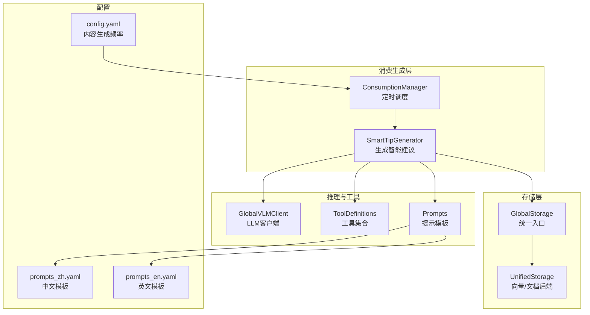
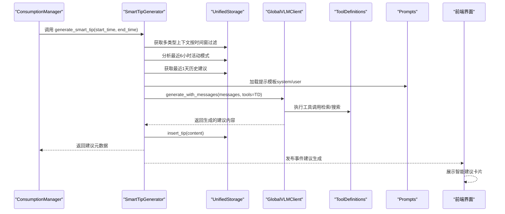
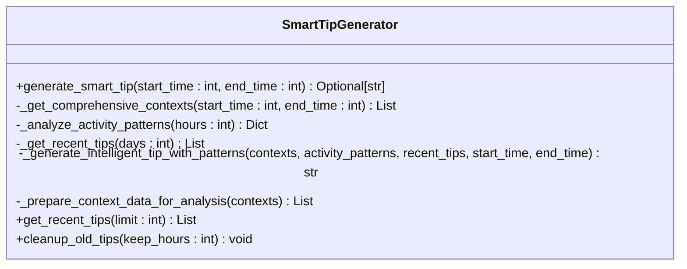
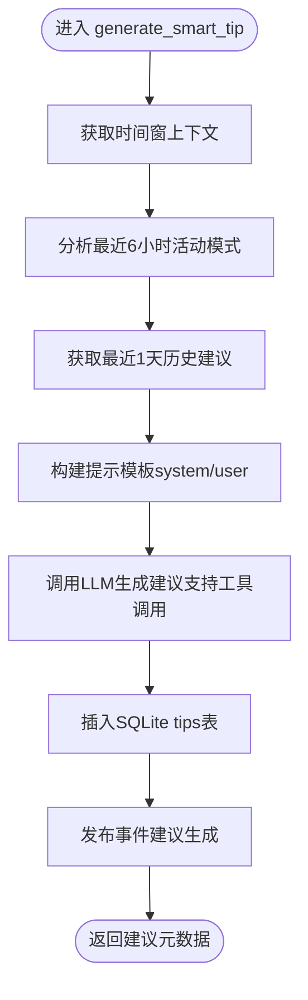
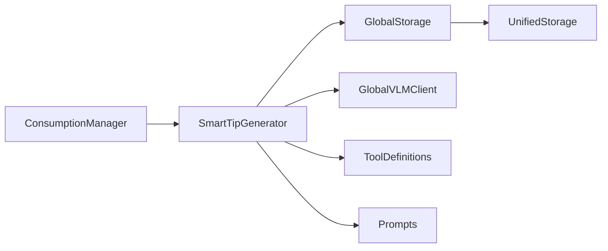

# 智能建议生成

<cite>
**本文引用的文件**
- [smart_tip_generator.py](file://opencontext/context_consumption/generation/smart_tip_generator.py)
- [consumption_manager.py](file://opencontext/managers/consumption_manager.py)
- [global_storage.py](file://opencontext/storage/global_storage.py)
- [unified_storage.py](file://opencontext/storage/unified_storage.py)
- [global_vlm_client.py](file://opencontext/llm/global_vlm_client.py)
- [tool_definitions.py](file://opencontext/tools/tool_definitions.py)
- [prompts_zh.yaml](file://config/prompts_zh.yaml)
- [prompts_en.yaml](file://config/prompts_en.yaml)
- [config.yaml](file://config/config.yaml)
</cite>

## 目录
1. [简介](#简介)
2. [项目结构](#项目结构)
3. [核心组件](#核心组件)
4. [架构总览](#架构总览)
5. [详细组件分析](#详细组件分析)
6. [依赖关系分析](#依赖关系分析)
7. [性能考量](#性能考量)
8. [故障排查指南](#故障排查指南)
9. [结论](#结论)
10. [附录](#附录)

## 简介
本文件面向开发者与产品使用者，系统化阐述 SmartTipGenerator 组件的实现与功能，解释其如何利用已处理与存储的上下文数据（活动记录、文档内容、网页链接等）生成个性化智能建议。文档覆盖 generate_smart_tip 方法的执行流程、时间范围参数的使用、上下文检索策略、提示模板构建、与大模型的交互过程，以及建议如何被持久化到知识库（Vault）并通过前端界面展示。同时，提供建议生成的触发机制（通过 ConsumptionManager 的定时任务）、质量控制策略、频率配置（config.yaml 中 content_generation.tips）以及性能优化建议（上下文采样与过滤）。

## 项目结构
SmartTipGenerator 位于消费生成模块，与存储层、LLM 客户端、工具集合、提示模板、定时调度器协同工作。下图展示了与本组件直接相关的模块关系与数据流。

图表来源
- [smart_tip_generator.py](file://opencontext/context_consumption/generation/smart_tip_generator.py#L45-L86)
- [consumption_manager.py](file://opencontext/managers/consumption_manager.py#L282-L317)
- [global_storage.py](file://opencontext/storage/global_storage.py#L188-L196)
- [unified_storage.py](file://opencontext/storage/unified_storage.py#L90-L158)
- [global_vlm_client.py](file://opencontext/llm/global_vlm_client.py#L114-L175)
- [tool_definitions.py](file://opencontext/tools/tool_definitions.py#L1-L40)
- [prompts_zh.yaml](file://config/prompts_zh.yaml#L1080-L1120)
- [prompts_en.yaml](file://config/prompts_en.yaml#L1114-L1162)
- [config.yaml](file://config/config.yaml#L224-L239)

章节来源
- [smart_tip_generator.py](file://opencontext/context_consumption/generation/smart_tip_generator.py#L45-L86)
- [consumption_manager.py](file://opencontext/managers/consumption_manager.py#L282-L317)
- [config.yaml](file://config/config.yaml#L224-L239)

## 核心组件
- SmartTipGenerator：负责生成智能建议的主类，包含 generate_smart_tip、活动模式分析、历史建议去重、上下文检索与准备、提示模板构建与 LLM 交互、结果入库与事件发布等。
- ConsumptionManager：负责定时调度，周期性触发 SmartTipGenerator 的 generate_smart_tip。
- GlobalStorage/UnifiedStorage：提供统一的存储访问接口，支持向量数据库与文档数据库后端。
- GlobalVLMClient：封装 LLM 客户端与工具执行器，支持多轮工具调用与消息流。
- ToolDefinitions：汇总检索工具（上下文检索、文档检索、实体检索、网络检索）。
- Prompts：提示模板，包含智能建议生成的 system/user 模板。
- Config：内容生成频率配置（tips 间隔、开关等）。

章节来源
- [smart_tip_generator.py](file://opencontext/context_consumption/generation/smart_tip_generator.py#L45-L86)
- [consumption_manager.py](file://opencontext/managers/consumption_manager.py#L37-L85)
- [global_storage.py](file://opencontext/storage/global_storage.py#L188-L196)
- [unified_storage.py](file://opencontext/storage/unified_storage.py#L90-L158)
- [global_vlm_client.py](file://opencontext/llm/global_vlm_client.py#L114-L175)
- [tool_definitions.py](file://opencontext/tools/tool_definitions.py#L1-L40)
- [prompts_zh.yaml](file://config/prompts_zh.yaml#L1080-L1120)
- [prompts_en.yaml](file://config/prompts_en.yaml#L1114-L1162)
- [config.yaml](file://config/config.yaml#L224-L239)

## 架构总览
SmartTipGenerator 的建议生成流程如下：
1. ConsumptionManager 定时器触发 generate_smart_tip(start_time, end_time)。
2. SmartTipGenerator 获取指定时间窗内的多类型上下文（活动、语义、意图、实体、流程、状态）。
3. 分析最近 6 小时的活动模式（类别分布、关键实体、连续工作时长、任务切换次数等）。
4. 获取最近 1 天的历史建议，避免重复。
5. 构建提示模板（system/user），将时间范围、上下文数据、活动模式、历史建议注入。
6. 调用 LLM 客户端（支持工具调用），生成建议内容。
7. 将建议存入 SQLite 文档库（tips 表），并发布事件通知前端。
8. 前端监听事件并展示建议卡片。

图表来源
- [consumption_manager.py](file://opencontext/managers/consumption_manager.py#L282-L317)
- [smart_tip_generator.py](file://opencontext/context_consumption/generation/smart_tip_generator.py#L45-L86)
- [global_vlm_client.py](file://opencontext/llm/global_vlm_client.py#L114-L175)
- [tool_definitions.py](file://opencontext/tools/tool_definitions.py#L1-L40)
- [prompts_zh.yaml](file://config/prompts_zh.yaml#L1080-L1120)
- [prompts_en.yaml](file://config/prompts_en.yaml#L1114-L1162)

## 详细组件分析

### SmartTipGenerator 类与方法
- generate_smart_tip(start_time, end_time)：主流程入口，串联上下文检索、活动模式分析、历史建议去重、提示模板构建、LLM 交互、结果入库与事件发布。
- _get_comprehensive_contexts(start_time, end_time)：按时间窗过滤，检索多类型上下文（活动、语义、意图、实体、流程、状态），并按创建时间倒序。
- _analyze_activity_patterns(hours=6)：分析最近 6 小时活动，计算类别分布、关键实体、连续工作时长、任务切换次数等。
- _get_recent_tips(days=1)：获取最近 1 天的历史建议，避免重复。
- _generate_intelligent_tip_with_patterns(contexts, activity_patterns, recent_tips, start_time, end_time)：构建提示模板，调用 LLM，返回建议内容。
- _prepare_context_data_for_analysis(contexts)：将 ProcessedContext 转换为 LLM 可读的上下文字符串。
- get_recent_tips(limit)、cleanup_old_tips(keep_hours)：辅助查询与清理历史建议。

图表来源
- [smart_tip_generator.py](file://opencontext/context_consumption/generation/smart_tip_generator.py#L45-L371)

章节来源
- [smart_tip_generator.py](file://opencontext/context_consumption/generation/smart_tip_generator.py#L45-L371)

### generate_smart_tip 执行流程详解
- 输入时间窗：start_time、end_time 由定时器计算传入，用于限定检索范围。
- 上下文检索：按 create_time_ts 过滤，拉取多类型上下文并按时间排序，保证最新上下文优先。
- 活动模式分析：基于最近 6 小时的活动记录，统计类别分布、关键实体、连续工作时长、任务切换次数等。
- 历史建议去重：按天获取最近建议，避免与本次生成重复。
- 提示模板构建：从提示组加载 system/user 模板，注入当前时间、时间窗、上下文数据、活动模式、历史建议。
- LLM 交互：调用 generate_with_messages，启用工具定义（检索/搜索/实体），支持最多 N 轮工具调用。
- 结果入库与事件发布：将建议插入 SQLite 文档库，发布 TIP_GENERATED 事件，前端监听并展示。

图表来源
- [smart_tip_generator.py](file://opencontext/context_consumption/generation/smart_tip_generator.py#L45-L86)
- [global_vlm_client.py](file://opencontext/llm/global_vlm_client.py#L114-L175)
- [tool_definitions.py](file://opencontext/tools/tool_definitions.py#L1-L40)

章节来源
- [smart_tip_generator.py](file://opencontext/context_consumption/generation/smart_tip_generator.py#L45-L86)
- [global_vlm_client.py](file://opencontext/llm/global_vlm_client.py#L114-L175)
- [tool_definitions.py](file://opencontext/tools/tool_definitions.py#L1-L40)

### 提示模板与 LLM 交互
- 提示模板：在 config/prompts_zh.yaml 与 config/prompts_en.yaml 中定义 generation.smart_tip_generation 的 system/user 模板，要求建议具备建设性、具体可操作、有数据支撑、避免重复与低价值提醒。
- LLM 客户端：GlobalVLMClient.generate_with_messages 支持工具调用，自动收集 tool_calls 并并发执行，再将工具结果回传给模型，直至达到最大调用轮次或无工具调用为止。
- 工具集合：ToolDefinitions 汇总上下文检索、文档检索、实体检索、网络检索等工具，SmartTipGenerator 在生成建议时启用 ALL_TOOL_DEFINITIONS。

章节来源
- [prompts_zh.yaml](file://config/prompts_zh.yaml#L1080-L1120)
- [prompts_en.yaml](file://config/prompts_en.yaml#L1114-L1162)
- [global_vlm_client.py](file://opencontext/llm/global_vlm_client.py#L114-L175)
- [tool_definitions.py](file://opencontext/tools/tool_definitions.py#L1-L40)

### 存储与知识库（Vault）
- GlobalStorage/UnifiedStorage：提供统一的存储访问接口，支持向量数据库与文档数据库后端。SmartTipGenerator 通过 get_storage().insert_tip 将建议持久化至 SQLite 文档库（tips 表）。
- 建议入库后，通过事件发布（EventType.TIP_GENERATED）通知前端，前端组件可订阅并渲染智能建议卡片。

章节来源
- [global_storage.py](file://opencontext/storage/global_storage.py#L188-L196)
- [unified_storage.py](file://opencontext/storage/unified_storage.py#L90-L158)
- [smart_tip_generator.py](file://opencontext/context_consumption/generation/smart_tip_generator.py#L69-L82)

### 触发机制：ConsumptionManager 定时任务
- ConsumptionManager 在初始化时从 GlobalConfig 读取 content_generation 配置，设置 activity/tips/todos/report 的启用与间隔。
- _start_tips_timer 启动定时器，周期性检查是否到达生成时间，若满足则调用 SmartTipGenerator.generate_smart_tip(start_time, end_time)，并将生成时间写入 last_generation_times。
- 生成间隔默认 3600 秒（1 小时），可通过 config.yaml 动态更新。

章节来源
- [consumption_manager.py](file://opencontext/managers/consumption_manager.py#L37-L85)
- [consumption_manager.py](file://opencontext/managers/consumption_manager.py#L282-L317)
- [config.yaml](file://config/config.yaml#L224-L239)

## 依赖关系分析
- 组件耦合与内聚：
  - SmartTipGenerator 与存储层（GlobalStorage/UnifiedStorage）耦合，通过 get_storage() 接口访问上下文与文档存储。
  - 与 LLM 客户端（GlobalVLMClient）耦合，通过 generate_with_messages 与工具集合（ToolDefinitions）交互。
  - 与提示模板（Prompts）耦合，通过 get_prompt_group("generation.smart_tip_generation") 获取模板。
  - 与定时调度（ConsumptionManager）耦合，通过定时器触发生成。
- 外部依赖与集成点：
  - 向量数据库（ChromaDB/Qdrant）与文档数据库（SQLite）后端由 UnifiedStorage 管理。
  - 工具执行器（ToolsExecutor）由 GlobalVLMClient 内部持有，支持异步并发执行工具调用。
- 潜在循环依赖：
  - 代码结构未见循环导入；SmartTipGenerator 依赖存储与 LLM 客户端，二者均不反向依赖 SmartTipGenerator。

图表来源
- [smart_tip_generator.py](file://opencontext/context_consumption/generation/smart_tip_generator.py#L45-L86)
- [global_storage.py](file://opencontext/storage/global_storage.py#L188-L196)
- [unified_storage.py](file://opencontext/storage/unified_storage.py#L90-L158)
- [global_vlm_client.py](file://opencontext/llm/global_vlm_client.py#L114-L175)
- [tool_definitions.py](file://opencontext/tools/tool_definitions.py#L1-L40)
- [consumption_manager.py](file://opencontext/managers/consumption_manager.py#L282-L317)

章节来源
- [smart_tip_generator.py](file://opencontext/context_consumption/generation/smart_tip_generator.py#L45-L86)
- [global_storage.py](file://opencontext/storage/global_storage.py#L188-L196)
- [unified_storage.py](file://opencontext/storage/unified_storage.py#L90-L158)
- [global_vlm_client.py](file://opencontext/llm/global_vlm_client.py#L114-L175)
- [tool_definitions.py](file://opencontext/tools/tool_definitions.py#L1-L40)
- [consumption_manager.py](file://opencontext/managers/consumption_manager.py#L282-L317)

## 性能考量
- 上下文采样与过滤
  - 时间窗限制：通过 start_time/end_time 限定检索范围，避免全量扫描。
  - 类型过滤：仅检索必要上下文类型（活动、语义、意图、实体、流程、状态），减少无关数据。
  - 数量上限：检索限制为 10000，避免内存与带宽压力。
  - 去重与排序：按创建时间倒序，优先使用最新上下文。
- LLM 调用优化
  - 工具调用轮次限制：通过 max_calls 控制工具调用次数，防止过度检索。
  - 并行工具执行：工具调用使用线程池并发执行，提高吞吐。
  - 模板精简：提示模板中仅注入必要字段，减少 token 消耗。
- 存储与索引
  - 向量数据库与文档数据库分离，建议根据数据规模与查询模式选择后端。
  - SQLite 文档库适合轻量存储与快速检索，建议定期清理历史建议（cleanup_old_tips）。
- 频率配置
  - tips 间隔默认 3600 秒，可根据业务需求调整；过短可能导致频繁检索与 LLM 调用，过长可能降低建议时效性。

章节来源
- [smart_tip_generator.py](file://opencontext/context_consumption/generation/smart_tip_generator.py#L194-L224)
- [smart_tip_generator.py](file://opencontext/context_consumption/generation/smart_tip_generator.py#L226-L302)
- [global_vlm_client.py](file://opencontext/llm/global_vlm_client.py#L114-L175)
- [config.yaml](file://config/config.yaml#L224-L239)

## 故障排查指南
- 建议为空或质量差
  - 检查提示模板质量与注入字段是否完整（时间窗、上下文、活动模式、历史建议）。
  - 确认 LLM 客户端初始化与工具定义加载正常。
  - 检查时间窗内是否存在有效上下文与活动记录。
- LLM 工具调用失败
  - 查看工具执行器日志，确认工具参数解析与执行结果。
  - 适当增加 max_calls 或减少工具复杂度。
- 历史建议重复
  - 确认 _get_recent_tips 的时间范围与 limit 设置是否合理。
  - 建议在提示模板中加入“避免重复”的约束，或在入库前做去重处理。
- 定时任务未触发
  - 检查 config.yaml 中 content_generation.tips.enabled 与 interval 是否正确。
  - 确认 ConsumptionManager 的定时器是否启动，last_generation_times 是否更新。
- 存储异常
  - 检查 UnifiedStorage 初始化与后端配置（ChromaDB/Qdrant/SQLite）。
  - 确认 SQLite 路径与权限，避免写入失败。

章节来源
- [smart_tip_generator.py](file://opencontext/context_consumption/generation/smart_tip_generator.py#L64-L86)
- [global_vlm_client.py](file://opencontext/llm/global_vlm_client.py#L114-L175)
- [consumption_manager.py](file://opencontext/managers/consumption_manager.py#L282-L317)
- [config.yaml](file://config/config.yaml#L224-L239)

## 结论
SmartTipGenerator 通过“时间窗限定 + 多类型上下文检索 + 活动模式分析 + 历史建议去重 + 提示模板 + LLM 工具调用”的闭环，实现了高质量、低重复、可解释的智能建议生成。结合 ConsumptionManager 的定时调度与配置化的频率控制，系统可在保证性能的前提下稳定产出建议，并通过事件驱动的方式在前端展示。建议在生产环境中配合日志与监控，持续优化提示模板与工具链路，以进一步提升建议质量与时效性。

## 附录
- 配置项参考
  - content_generation.tips.enabled：是否启用智能建议生成
  - content_generation.tips.interval：生成间隔（秒）
- 前端展示
  - 建议生成事件发布后，前端组件可订阅并渲染智能建议卡片，实现用户可见的“智能提醒”。

章节来源
- [config.yaml](file://config/config.yaml#L224-L239)
- [smart_tip_generator.py](file://opencontext/context_consumption/generation/smart_tip_generator.py#L71-L82)