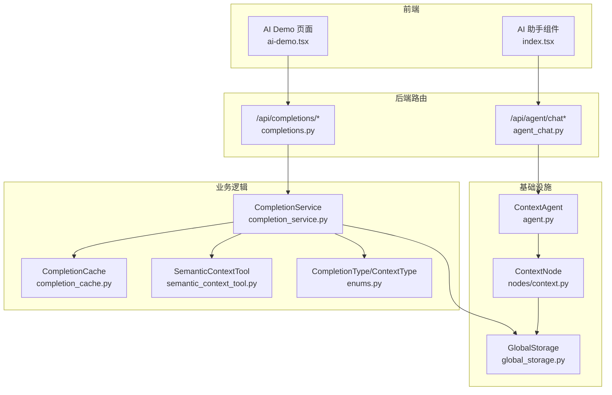
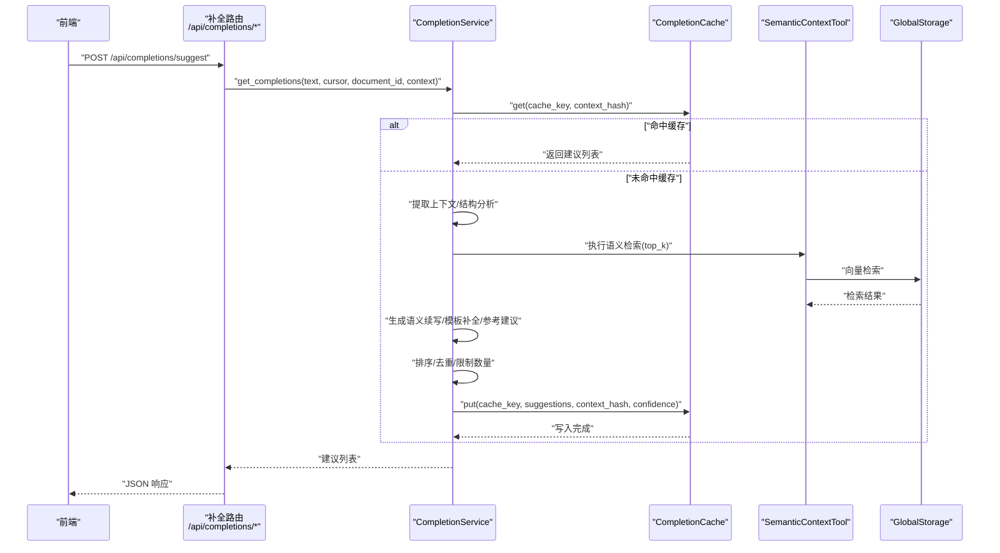
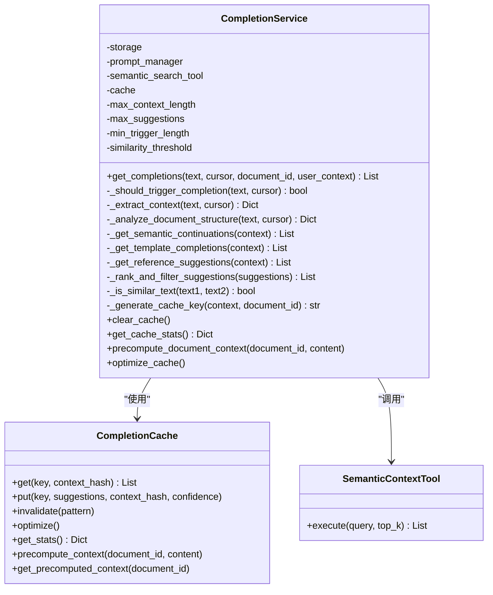
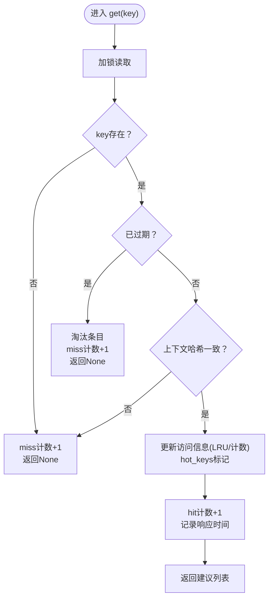
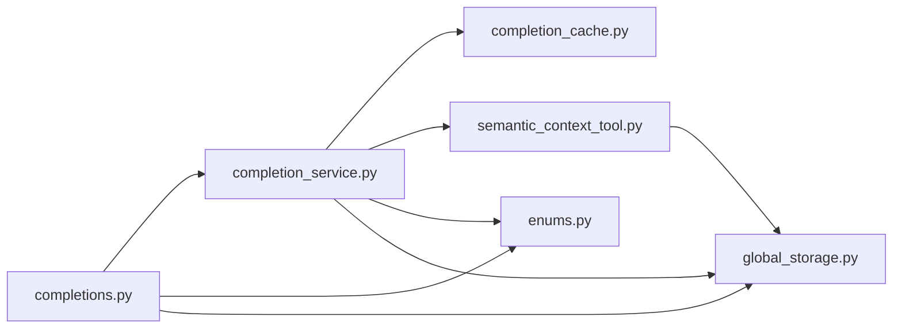

# 补全服务

<cite>
**本文引用的文件**
- [opencontext/context_consumption/completion/completion_service.py](file://opencontext/context_consumption/completion/completion_service.py)
- [opencontext/context_consumption/completion/completion_cache.py](file://opencontext/context_consumption/completion/completion_cache.py)
- [opencontext/server/routes/completions.py](file://opencontext/server/routes/completions.py)
- [opencontext/server/routes/agent_chat.py](file://opencontext/server/routes/agent_chat.py)
- [opencontext/tools/retrieval_tools/semantic_context_tool.py](file://opencontext/tools/retrieval_tools/semantic_context_tool.py)
- [opencontext/models/enums.py](file://opencontext/models/enums.py)
- [opencontext/storage/global_storage.py](file://opencontext/storage/global_storage.py)
- [opencontext/context_consumption/context_agent/agent.py](file://opencontext/context_consumption/context_agent/agent.py)
- [opencontext/context_consumption/context_agent/nodes/context.py](file://opencontext/context_consumption/context_agent/nodes/context.py)
- [frontend/src/renderer/src/pages/ai-demo/ai-demo.tsx](file://frontend/src/renderer/src/pages/ai-demo/ai-demo.tsx)
- [frontend/src/renderer/src/components/ai-assistant/index.tsx](file://frontend/src/renderer/src/components/ai-assistant/index.tsx)
</cite>

## 目录
1. [简介](#简介)
2. [项目结构](#项目结构)
3. [核心组件](#核心组件)
4. [架构总览](#架构总览)
5. [详细组件分析](#详细组件分析)
6. [依赖关系分析](#依赖关系分析)
7. [性能考量](#性能考量)
8. [故障排查指南](#故障排查指南)
9. [结论](#结论)
10. [附录](#附录)

## 简介
本文件系统性梳理“补全服务”的实现与功能，围绕以下目标展开：
- 解释补全服务如何处理来自前端的聊天或补全请求，核心流程包括：接收用户输入、从向量数据库检索最相关的上下文片段、将上下文与用户问题组合为提示词、调用LLM生成回复、并将结果返回给客户端。
- 说明 completion_cache.py 如何通过缓存机制提升重复查询的响应速度并降低LLM调用成本。
- 阐述补全服务与 agent_chat.py API 端点的关联，以及前端 ai-demo.tsx 与之交互的方式。
- 讨论补全服务在“上下文消费”中的核心作用，即实现基于个人知识库的对话式AI体验，并给出错误处理、流式响应与性能优化策略。

## 项目结构
补全服务位于后端 opencontext 子模块中，主要由以下层次构成：
- 路由层：提供 /api/completions/* 的REST接口，负责参数校验、调用补全服务并返回结果（支持非流式与流式）。
- 业务层：CompletionService 负责提取上下文、触发不同类型的补全策略（语义续写、模板补全、参考建议）、向量化检索与LLM生成、排序去重与缓存。
- 缓存层：CompletionCache 提供多策略缓存（LRU/TTL/Hybrid），支持命中检测、过期淘汰、热键保护、预计算文档上下文等。
- 检索工具：SemanticContextTool 基于向量存储检索语义相关知识。
- 存储与配置：global_storage 提供统一存储访问；prompt_manager 与 embedding/vlm 客户端在服务初始化时注入。
- 前端：ai-demo.tsx 作为演示页面入口，AI助手组件与后端完成流式对话；补全服务的API亦可被编辑器内联补全场景复用。

图表来源
- [opencontext/server/routes/completions.py](file://opencontext/server/routes/completions.py#L1-L329)
- [opencontext/context_consumption/completion/completion_service.py](file://opencontext/context_consumption/completion/completion_service.py#L1-L492)
- [opencontext/context_consumption/completion/completion_cache.py](file://opencontext/context_consumption/completion/completion_cache.py#L1-L443)
- [opencontext/tools/retrieval_tools/semantic_context_tool.py](file://opencontext/tools/retrieval_tools/semantic_context_tool.py#L1-L85)
- [opencontext/storage/global_storage.py](file://opencontext/storage/global_storage.py#L1-L196)
- [opencontext/context_consumption/context_agent/agent.py](file://opencontext/context_consumption/context_agent/agent.py#L1-L165)
- [opencontext/context_consumption/context_agent/nodes/context.py](file://opencontext/context_consumption/context_agent/nodes/context.py#L1-L171)
- [frontend/src/renderer/src/pages/ai-demo/ai-demo.tsx](file://frontend/src/renderer/src/pages/ai-demo/ai-demo.tsx#L1-L57)
- [frontend/src/renderer/src/components/ai-assistant/index.tsx](file://frontend/src/renderer/src/components/ai-assistant/index.tsx#L1-L356)

章节来源
- [opencontext/server/routes/completions.py](file://opencontext/server/routes/completions.py#L1-L329)
- [opencontext/context_consumption/completion/completion_service.py](file://opencontext/context_consumption/completion/completion_service.py#L1-L492)
- [opencontext/context_consumption/completion/completion_cache.py](file://opencontext/context_consumption/completion/completion_cache.py#L1-L443)
- [opencontext/tools/retrieval_tools/semantic_context_tool.py](file://opencontext/tools/retrieval_tools/semantic_context_tool.py#L1-L85)
- [opencontext/storage/global_storage.py](file://opencontext/storage/global_storage.py#L1-L196)
- [opencontext/context_consumption/context_agent/agent.py](file://opencontext/context_consumption/context_agent/agent.py#L1-L165)
- [opencontext/context_consumption/context_agent/nodes/context.py](file://opencontext/context_consumption/context_agent/nodes/context.py#L1-L171)
- [frontend/src/renderer/src/pages/ai-demo/ai-demo.tsx](file://frontend/src/renderer/src/pages/ai-demo/ai-demo.tsx#L1-L57)
- [frontend/src/renderer/src/components/ai-assistant/index.tsx](file://frontend/src/renderer/src/components/ai-assistant/index.tsx#L1-L356)

## 核心组件
- CompletionService：面向“智能补全”的核心类，负责：
  - 触发条件判断（光标位置、空白字符、是否处于单词中间）
  - 上下文提取（前后文、当前行/段落、文档结构分析）
  - 多策略补全生成：语义续写、模板补全、参考建议（向量检索）
  - 排序与去重、缓存命中与写入、统计与优化
- CompletionCache：高性能缓存管理器，支持 LRU/TTL/Hybrid 策略，提供命中检测、过期淘汰、热键保护、预计算文档上下文、统计导出等能力。
- SemanticContextTool：语义检索工具，封装向量检索与过滤参数，用于“参考建议”策略。
- 路由层（/api/completions/*）：提供补全建议、流式补全、反馈、统计、缓存操作等接口。
- 前端交互：AI 助手组件与后端流式对话；ai-demo.tsx 作为演示入口，展示AI侧边栏与交互。

章节来源
- [opencontext/context_consumption/completion/completion_service.py](file://opencontext/context_consumption/completion/completion_service.py#L56-L492)
- [opencontext/context_consumption/completion/completion_cache.py](file://opencontext/context_consumption/completion/completion_cache.py#L45-L443)
- [opencontext/tools/retrieval_tools/semantic_context_tool.py](file://opencontext/tools/retrieval_tools/semantic_context_tool.py#L1-L85)
- [opencontext/server/routes/completions.py](file://opencontext/server/routes/completions.py#L1-L329)
- [frontend/src/renderer/src/components/ai-assistant/index.tsx](file://frontend/src/renderer/src/components/ai-assistant/index.tsx#L1-L356)
- [frontend/src/renderer/src/pages/ai-demo/ai-demo.tsx](file://frontend/src/renderer/src/pages/ai-demo/ai-demo.tsx#L1-L57)

## 架构总览
补全服务的典型调用链路如下：
- 前端通过 /api/completions/suggest 或 /api/completions/suggest/stream 发起请求
- 后端路由层进行参数校验与限流/鉴权，随后调用 CompletionService
- CompletionService 内部：
  - 生成缓存键并尝试命中缓存
  - 若未命中，则按顺序生成三类补全建议：语义续写、模板补全、参考建议
  - 参考建议通过 SemanticContextTool 执行向量检索
  - 对建议进行排序、去重、限制数量
  - 将结果写入 CompletionCache 并返回
- 流式场景下，/api/completions/suggest/stream 会分阶段返回不同类型建议，便于前端实时展示进度

图表来源
- [opencontext/server/routes/completions.py](file://opencontext/server/routes/completions.py#L57-L203)
- [opencontext/context_consumption/completion/completion_service.py](file://opencontext/context_consumption/completion/completion_service.py#L92-L158)
- [opencontext/context_consumption/completion/completion_cache.py](file://opencontext/context_consumption/completion/completion_cache.py#L83-L164)
- [opencontext/tools/retrieval_tools/semantic_context_tool.py](file://opencontext/tools/retrieval_tools/semantic_context_tool.py#L1-L85)
- [opencontext/storage/global_storage.py](file://opencontext/storage/global_storage.py#L1-L196)

## 详细组件分析

### 补全服务（CompletionService）
- 触发条件：仅当光标前文本长度达到阈值、末尾非空白、且不在单词中间时才触发补全。
- 上下文提取：包含光标前/后文本、当前行、当前段落、文档结构（标题层级、列表、代码块）等。
- 三类补全策略：
  - 语义续写：构造系统/用户提示词，调用LLM生成续写候选。
  - 模板补全：根据文档结构自动补全标题、列表、代码块等。
  - 参考建议：使用 SemanticContextTool 进行向量检索，筛选相似度高于阈值的结果，抽取句子片段作为建议。
- 排序与去重：按置信度降序，基于词集相似度去重，限制最大数量。
- 缓存：生成短MD5键，结合上下文哈希进行命中校验；命中则直接返回；未命中则写入缓存并记录平均响应时间与热键。
- 统计与优化：提供缓存统计、清理、优化、预计算文档上下文等能力。

图表来源
- [opencontext/context_consumption/completion/completion_service.py](file://opencontext/context_consumption/completion/completion_service.py#L56-L492)
- [opencontext/context_consumption/completion/completion_cache.py](file://opencontext/context_consumption/completion/completion_cache.py#L45-L443)
- [opencontext/tools/retrieval_tools/semantic_context_tool.py](file://opencontext/tools/retrieval_tools/semantic_context_tool.py#L1-L85)

章节来源
- [opencontext/context_consumption/completion/completion_service.py](file://opencontext/context_consumption/completion/completion_service.py#L92-L481)
- [opencontext/context_consumption/completion/completion_cache.py](file://opencontext/context_consumption/completion/completion_cache.py#L83-L334)

### 补全缓存（CompletionCache）
- 多策略缓存：
  - LRU：基于访问顺序淘汰
  - TTL：基于创建时间的过期控制
  - Hybrid：结合LRU与TTL，优先保护热键
- 关键能力：
  - 命中检测：支持上下文哈希一致性校验
  - 热键保护：访问次数阈值提升热键存活率
  - 预计算文档上下文：对文档特征进行摘要与哈希，加速后续匹配
  - 统计指标：命中数、未命中数、淘汰数、平均响应时间、内存估算
  - 优化：清理过期项、更新热键集合、压缩访问序列、清理旧预计算上下文

图表来源
- [opencontext/context_consumption/completion/completion_cache.py](file://opencontext/context_consumption/completion/completion_cache.py#L83-L164)

章节来源
- [opencontext/context_consumption/completion/completion_cache.py](file://opencontext/context_consumption/completion/completion_cache.py#L83-L334)

### 路由与前端交互
- 补全路由：
  - /api/completions/suggest：非流式补全建议
  - /api/completions/suggest/stream：流式补全建议，按“模板/语义/参考”三类逐步返回
  - /api/completions/feedback：提交补全反馈
  - /api/completions/stats/cache/stats/optimize/precompute/clear：统计、缓存操作
- 前端交互：
  - AI 助手组件负责与 /api/agent/chat/stream 进行流式对话（与补全服务互补）
  - ai-demo.tsx 作为演示页面，打开侧边栏以展示AI能力

章节来源
- [opencontext/server/routes/completions.py](file://opencontext/server/routes/completions.py#L1-L329)
- [frontend/src/renderer/src/pages/ai-demo/ai-demo.tsx](file://frontend/src/renderer/src/pages/ai-demo/ai-demo.tsx#L1-L57)
- [frontend/src/renderer/src/components/ai-assistant/index.tsx](file://frontend/src/renderer/src/components/ai-assistant/index.tsx#L1-L356)

### 与上下文消费的关系
- 补全服务属于“上下文消费”的一部分，聚焦于“即时补全”场景（如编辑器内联补全、快速续写）。
- 与 ContextAgent 的关系：
  - ContextAgent 更偏向“完整对话式AI”，包含意图分析、上下文收集、执行与反思等阶段，适合长对话与复杂任务。
  - 补全服务更轻量，强调低延迟与高命中率，适合高频、短粒度的补全需求。
- ContextNode 展示了上下文收集的迭代过程，体现了“先评估充足性、再规划工具调用、并发执行、验证过滤、增量加入”的策略，这与补全服务的“参考建议”策略在思想上相通（先评估、再检索、再过滤）。

章节来源
- [opencontext/context_consumption/context_agent/agent.py](file://opencontext/context_consumption/context_agent/agent.py#L1-L165)
- [opencontext/context_consumption/context_agent/nodes/context.py](file://opencontext/context_consumption/context_agent/nodes/context.py#L1-L171)

## 依赖关系分析
- 组件耦合：
  - CompletionService 依赖 CompletionCache、SemanticContextTool、PromptManager、GlobalStorage、CompletionType
  - 路由层仅依赖 CompletionService 与认证中间件
  - SemanticContextTool 依赖 GlobalStorage 与向量存储后端
- 外部依赖：
  - LLM/VLM 客户端通过全局管理器注入（例如 generate_with_messages）
  - Prompt 管理器提供提示词组
- 潜在循环依赖：
  - 当前文件组织避免了直接循环导入；若未来扩展，需注意避免服务与工具之间的双向依赖

图表来源
- [opencontext/server/routes/completions.py](file://opencontext/server/routes/completions.py#L1-L329)
- [opencontext/context_consumption/completion/completion_service.py](file://opencontext/context_consumption/completion/completion_service.py#L1-L120)
- [opencontext/context_consumption/completion/completion_cache.py](file://opencontext/context_consumption/completion/completion_cache.py#L1-L82)
- [opencontext/tools/retrieval_tools/semantic_context_tool.py](file://opencontext/tools/retrieval_tools/semantic_context_tool.py#L1-L85)
- [opencontext/models/enums.py](file://opencontext/models/enums.py#L360-L367)
- [opencontext/storage/global_storage.py](file://opencontext/storage/global_storage.py#L1-L196)

章节来源
- [opencontext/server/routes/completions.py](file://opencontext/server/routes/completions.py#L1-L120)
- [opencontext/context_consumption/completion/completion_service.py](file://opencontext/context_consumption/completion/completion_service.py#L1-L120)
- [opencontext/context_consumption/completion/completion_cache.py](file://opencontext/context_consumption/completion/completion_cache.py#L1-L82)
- [opencontext/tools/retrieval_tools/semantic_context_tool.py](file://opencontext/tools/retrieval_tools/semantic_context_tool.py#L1-L85)
- [opencontext/models/enums.py](file://opencontext/models/enums.py#L360-L367)
- [opencontext/storage/global_storage.py](file://opencontext/storage/global_storage.py#L1-L196)

## 性能考量
- 缓存命中与一致性：
  - 使用短MD5键与上下文哈希双重校验，避免“键相同但上下文变化”导致的脏读。
  - 热键保护与LRU结合，减少抖动与热点淘汰。
- 检索效率：
  - 语义检索前先做最小触发长度与结构分析，减少无效调用。
  - 相似度阈值与TopK限制，平衡召回与性能。
- 响应时间优化：
  - CompletionCache 记录指数移动平均响应时间，便于监控与调优。
  - 流式补全接口允许前端逐步渲染，改善感知延迟。
- 内存与统计：
  - 提供内存使用估算与缓存统计，便于容量规划与异常定位。

章节来源
- [opencontext/context_consumption/completion/completion_service.py](file://opencontext/context_consumption/completion/completion_service.py#L119-L151)
- [opencontext/context_consumption/completion/completion_cache.py](file://opencontext/context_consumption/completion/completion_cache.py#L182-L221)
- [opencontext/context_consumption/completion/completion_cache.py](file://opencontext/context_consumption/completion/completion_cache.py#L234-L243)
- [opencontext/context_consumption/completion/completion_cache.py](file://opencontext/context_consumption/completion/completion_cache.py#L335-L361)

## 故障排查指南
- 常见错误与处理：
  - 参数非法：路由层对 text 与 cursor_position 做基础校验，返回 400。
  - 初始化失败：CompletionService 在初始化时捕获异常并抛出，检查日志定位。
  - 检索异常：SemanticContextTool 返回错误字段时，服务记录警告并跳过该条目。
  - 缓存异常：CompletionCache 使用线程锁保护，异常时记录日志并继续运行。
- 日志与可观测性：
  - 服务与路由均使用统一日志器，便于串联请求链路。
  - 提供统计接口与缓存统计接口，便于定位性能瓶颈。
- 建议排查步骤：
  - 检查 /api/completions/stats 与 /api/completions/cache/stats 获取命中率与平均响应时间
  - 使用 /api/completions/cache/optimize 清理过期与热键，观察命中率变化
  - 使用 /api/completions/cache/clear 清空缓存，验证是否为缓存污染导致的问题

章节来源
- [opencontext/server/routes/completions.py](file://opencontext/server/routes/completions.py#L57-L132)
- [opencontext/context_consumption/completion/completion_service.py](file://opencontext/context_consumption/completion/completion_service.py#L88-L100)
- [opencontext/context_consumption/completion/completion_service.py](file://opencontext/context_consumption/completion/completion_service.py#L352-L406)
- [opencontext/context_consumption/completion/completion_cache.py](file://opencontext/context_consumption/completion/completion_cache.py#L182-L221)

## 结论
补全服务通过“上下文提取 + 多策略补全 + 向量检索 + 缓存优化”的闭环，实现了低延迟、高命中率的智能补全体验。配合流式接口与前端交互，既满足编辑器内联补全的即时性需求，又为后续扩展到对话式AI提供了良好基础。CompletionCache 的多策略与热键保护进一步提升了系统的稳定性与性能。未来可在提示词工程、相似度阈值自适应、缓存预热等方面持续优化。

## 附录
- 关键枚举与类型：
  - CompletionType：语义续写、模板补全、参考建议、上下文感知
  - ContextType：实体、活动、意图、语义、过程、状态、知识等
- 典型调用路径参考：
  - 补全建议：/api/completions/suggest → CompletionService.get_completions → 缓存命中/生成 → 返回
  - 流式补全：/api/completions/suggest/stream → 分阶段返回不同类型建议
  - 对话式AI：/api/agent/chat/stream → ContextAgent → ContextNode 上下文收集 → 流式事件

章节来源
- [opencontext/models/enums.py](file://opencontext/models/enums.py#L360-L367)
- [opencontext/server/routes/completions.py](file://opencontext/server/routes/completions.py#L134-L203)
- [opencontext/context_consumption/context_agent/agent.py](file://opencontext/context_consumption/context_agent/agent.py#L1-L165)
- [opencontext/context_consumption/context_agent/nodes/context.py](file://opencontext/context_consumption/context_agent/nodes/context.py#L1-L171)