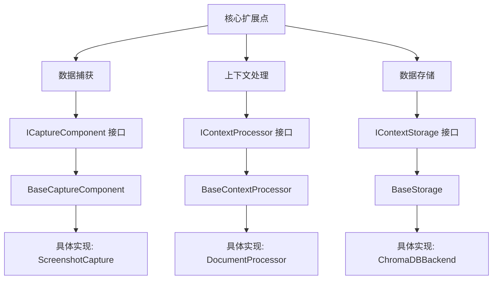
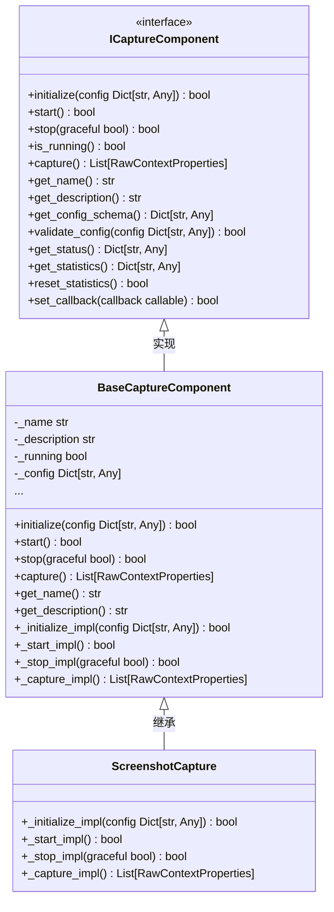
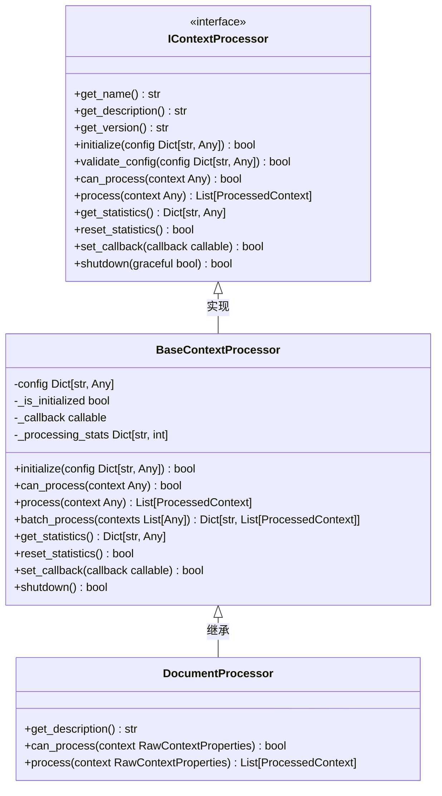
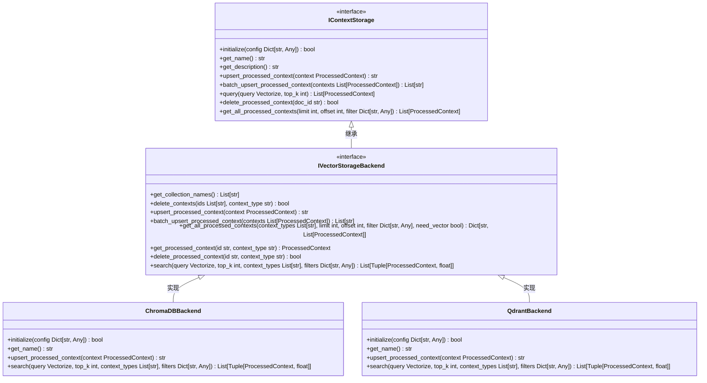
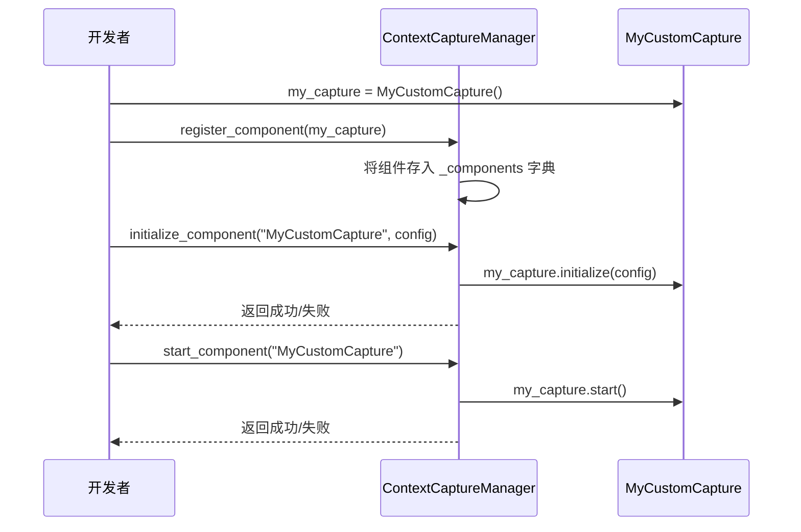

# 扩展开发

<cite>
**本文档引用的文件**   
- [capture_interface.py](file://opencontext/interfaces/capture_interface.py)
- [processor_interface.py](file://opencontext/interfaces/processor_interface.py)
- [storage_interface.py](file://opencontext/interfaces/storage_interface.py)
- [base.py](file://opencontext/context_capture/base.py)
- [base_processor.py](file://opencontext/context_processing/processor/base_processor.py)
- [base_storage.py](file://opencontext/storage/base_storage.py)
- [config.yaml](file://config/config.yaml)
- [example_document_processor.py](file://examples/example_document_processor.py)
- [example_screenshot_processor.py](file://examples/example_screenshot_processor.py)
- [example_weblink_processor.py](file://examples/example_weblink_processor.py)
- [web_link_capture.py](file://opencontext/context_capture/web_link_capture.py)
- [screenshot.py](file://opencontext/context_capture/screenshot.py)
- [chromadb_backend.py](file://opencontext/storage/backends/chromadb_backend.py)
- [qdrant_backend.py](file://opencontext/storage/backends/qdrant_backend.py)
- [unified_storage.py](file://opencontext/storage/unified_storage.py)
</cite>

## 目录
1. [引言](#引言)
2. [核心扩展点](#核心扩展点)
3. [创建新的数据捕获源](#创建新的数据捕获源)
4. [开发新的上下文处理器](#开发新的上下文处理器)
5. [集成新的向量数据库](#集成新的向量数据库)
6. [依赖注入与组件注册](#依赖注入与组件注册)
7. [完整扩展开发流程](#完整扩展开发流程)
8. [最佳实践与注意事项](#最佳实践与注意事项)

## 引言
本文档旨在为开发者提供一份详细的扩展开发指南，帮助您为系统添加新功能。本系统采用松耦合的设计架构，通过定义清晰的接口（如`ICaptureComponent`、`BaseContextProcessor`和`BaseStorage`）来实现模块化扩展。开发者可以通过实现这些接口来创建新的数据捕获源（例如浏览器标签捕获）、开发新的上下文处理器（例如音频转录处理器）或集成新的向量数据库（例如Milvus）。文档将使用`examples/`目录下的示例代码作为教学材料，提供一个从定义接口、实现类到在`config.yaml`中注册新组件的完整分步教程，并强调松耦合设计和依赖注入的重要性，以确保新组件能无缝集成到现有系统中。

## 核心扩展点
系统提供了三个主要的扩展点，分别对应数据的捕获、处理和存储。每个扩展点都由一个核心接口定义，开发者需要实现这些接口来创建自定义功能。



**Diagram sources**
- [interfaces/capture_interface.py](file://opencontext/interfaces/capture_interface.py)
- [interfaces/processor_interface.py](file://opencontext/interfaces/processor_interface.py)
- [interfaces/storage_interface.py](file://opencontext/interfaces/storage_interface.py)
- [context_capture/base.py](file://opencontext/context_capture/base.py)
- [context_processing/processor/base_processor.py](file://opencontext/context_processing/processor/base_processor.py)
- [storage/base_storage.py](file://opencontext/storage/base_storage.py)

## 创建新的数据捕获源
要创建一个新的数据捕获源（例如，一个用于捕获浏览器标签的组件），您需要实现`ICaptureComponent`接口。系统提供了一个`BaseCaptureComponent`基类，它实现了接口中的大部分通用功能，您只需继承它并实现特定的抽象方法即可。

### ICaptureComponent 接口
`ICaptureComponent`接口定义了所有捕获组件必须实现的行为。核心方法包括：
- `initialize(config)`: 使用配置初始化组件。
- `start()`: 启动捕获组件。
- `stop(graceful)`: 停止捕获组件。
- `capture()`: 执行一次捕获操作，返回捕获到的原始上下文数据列表。
- `get_name()` 和 `get_description()`: 返回组件的名称和描述。



**Diagram sources**
- [interfaces/capture_interface.py](file://opencontext/interfaces/capture_interface.py)
- [context_capture/base.py](file://opencontext/context_capture/base.py)
- [context_capture/screenshot.py](file://opencontext/context_capture/screenshot.py)

### 分步实现：创建 WebLinkCapture
以`WebLinkCapture`为例，展示如何创建一个新的捕获组件。

1.  **继承 `BaseCaptureComponent`**: 创建一个新类，继承`BaseCaptureComponent`。
2.  **实现 `__init__` 方法**: 在构造函数中调用父类的`__init__`，并传入组件的名称、描述和来源类型。
3.  **实现抽象方法**: 重写`_initialize_impl`, `_start_impl`, `_stop_impl`, 和 `_capture_impl`方法。

```python
from opencontext.context_capture.base import BaseCaptureComponent
from opencontext.models.enums import ContextSource

class WebLinkCapture(BaseCaptureComponent):
    def __init__(self):
        super().__init__(
            name="WebLinkCapture",
            description="捕获网页链接，渲染为MarkDown或PDF",
            source_type=ContextSource.WEB_LINK,
        )
        # 初始化自定义属性
        self._output_dir = Path("uploads/weblinks").resolve()
        self._mode = "markdown"

    def _initialize_impl(self, config: Dict[str, Any]) -> bool:
        # 实现初始化逻辑
        self._output_dir = Path(config.get("output_dir", "uploads/weblinks")).resolve()
        self._mode = config.get("mode", "markdown")
        # ... 其他配置
        return True

    def _start_impl(self) -> bool:
        # 如果没有后台线程，可以返回True
        return True

    def _stop_impl(self, graceful: bool = True) -> bool:
        # 清理资源
        return True

    def _capture_impl(self) -> List[RawContextProperties]:
        # 核心捕获逻辑
        urls_to_process = self._urls_to_process  # 假设URLs已通过其他方式传入
        results = []
        for url in urls_to_process:
            # 调用外部库（如crawl4ai）将URL转换为Markdown或PDF
            if self._mode == "markdown":
                result = self.convert_url_to_markdown(url)
            else:
                result = self.convert_url_to_pdf(url)
            
            if result:
                raw_context = RawContextProperties(
                    source=ContextSource.WEB_LINK,
                    content_path=result["file_path"],
                    content_format=ContentFormat.FILE,
                    create_time=datetime.now(),
                    additional_info={"url": url}
                )
                results.append(raw_context)
        return results
```

**Section sources**
- [context_capture/web_link_capture.py](file://opencontext/context_capture/web_link_capture.py)
- [context_capture/base.py](file://opencontext/context_capture/base.py)

## 开发新的上下文处理器
要开发一个新的上下文处理器（例如，一个用于音频转录的处理器），您需要实现`IContextProcessor`接口。系统提供了一个`BaseContextProcessor`基类，它提供了统计、配置管理和回调处理等通用功能。

### IContextProcessor 接口
`IContextProcessor`接口定义了处理器的基本行为。核心方法包括：
- `initialize(config)`: 初始化处理器。
- `can_process(context)`: 判断该处理器是否能处理给定的上下文。
- `process(context)`: 处理上下文数据，返回处理后的结果列表。
- `get_name()` 和 `get_description()`: 返回处理器的名称和描述。



**Diagram sources**
- [interfaces/processor_interface.py](file://opencontext/interfaces/processor_interface.py)
- [context_processing/processor/base_processor.py](file://opencontext/context_processing/processor/base_processor.py)
- [context_processing/processor/document_processor.py](file://opencontext/context_processing/processor/document_processor.py)

### 分步实现：使用 DocumentProcessor
`examples/example_document_processor.py`展示了如何使用`DocumentProcessor`来处理各种文档。

1.  **导入和初始化**: 导入`DocumentProcessor`并创建其实例。
2.  **配置和初始化**: 调用`initialize()`方法（可选）。
3.  **执行处理**: 调用`real_process()`方法处理`RawContextProperties`对象。

```python
from opencontext.context_processing.processor.document_processor import DocumentProcessor
from opencontext.models.context import RawContextProperties, ContextSource

# 1. 创建处理器实例
processor = DocumentProcessor()

# 2. (可选) 初始化
processor.initialize({})

# 3. 创建要处理的上下文
raw_context = RawContextProperties(
    source=ContextSource.LOCAL_FILE,
    content_path="/path/to/document.pdf",
    content_format=ContentFormat.FILE,
    create_time=datetime.now(),
    content_text=""
)

# 4. 检查处理器是否能处理此上下文
if processor.can_process(raw_context):
    # 5. 执行处理
    processed_contexts = processor.real_process(raw_context)
    for ctx in processed_contexts:
        print(f"标题: {ctx.extracted_data.title}")
        print(f"摘要: {ctx.extracted_data.summary}")
```

**Section sources**
- [examples/example_document_processor.py](file://examples/example_document_processor.py)
- [context_processing/processor/base_processor.py](file://opencontext/context_processing/processor/base_processor.py)

## 集成新的向量数据库
要集成一个新的向量数据库（例如，Milvus），您需要实现`IContextStorage`接口。系统提供了一个`UnifiedStorage`类来管理多个后端，您需要创建一个实现`IVectorStorageBackend`的后端类。

### IContextStorage 接口
`IContextStorage`接口定义了存储后端的行为。核心方法包括：
- `initialize(config)`: 初始化存储后端。
- `upsert_processed_context(context)`: 存储单个处理后的上下文。
- `query(query, top_k)`: 根据查询向量进行相似性搜索。
- `get_name()` 和 `get_description()`: 返回后端的名称和描述。



**Diagram sources**
- [interfaces/storage_interface.py](file://opencontext/interfaces/storage_interface.py)
- [storage/base_storage.py](file://opencontext/storage/base_storage.py)
- [storage/backends/chromadb_backend.py](file://opencontext/storage/backends/chromadb_backend.py)
- [storage/backends/qdrant_backend.py](file://opencontext/storage/backends/qdrant_backend.py)

### 分步实现：配置 Qdrant
`config.yaml`文件展示了如何配置Qdrant作为向量数据库。

1.  **在配置文件中定义后端**: 在`storage.backends`列表中添加一个Qdrant配置。
2.  **设置连接参数**: 配置`host`, `port`, `path`（本地模式）或API密钥等。
3.  **确保向量维度匹配**: `vector_size`必须与`embedding_model.output_dim`一致。

```yaml
storage:
  enabled: true
  backends:
    # - name: "default_vector"
    #   storage_type: "vector_db"
    #   backend: "chromadb"
    #   config: ...

    # 使用Qdrant替代ChromaDB
    - name: "default_vector"
      storage_type: "vector_db"
      backend: "qdrant"
      config:
        vector_size: 2048 # 必须与embedding_model.output_dim匹配
        # 本地文件模式
        path: "${CONTEXT_PATH:.}/persist/qdrant"
        # 或者服务器模式
        # host: "localhost"
        # port: 6333
        # https: false
        # api_key: "${QDRANT_API_KEY}"
```

**Section sources**
- [config/config.yaml](file://config/config.yaml)
- [storage/backends/qdrant_backend.py](file://opencontext/storage/backends/qdrant_backend.py)

## 依赖注入与组件注册
系统通过依赖注入和组件管理器来实现松耦合。组件的生命周期由`ContextCaptureManager`、`ContextProcessorManager`等管理器控制。

### 组件注册流程
1.  **创建实例**: 首先创建您自定义组件的实例。
2.  **注册到管理器**: 调用管理器的`register_component`方法。
3.  **初始化和启动**: 通过管理器调用`initialize_component`和`start_component`。



**Diagram sources**
- [managers/capture_manager.py](file://opencontext/managers/capture_manager.py)
- [context_capture/base.py](file://opencontext/context_capture/base.py)

### 依赖注入示例
`ComponentInitializer`类负责根据`config.yaml`中的配置自动创建和初始化所有组件，这体现了依赖注入的思想。

```python
# opencontext/server/component_initializer.py
class ComponentInitializer:
    def initialize_capture_components(self, capture_manager: ContextCaptureManager) -> None:
        capture_config = self.config.get("capture", {})
        for component_name, component_config in capture_config.items():
            if component_name in CAPTURE_COMPONENTS:
                # 通过类名动态创建实例，实现依赖注入
                component_class = CAPTURE_COMPONENTS[component_name]
                component_instance = component_class() 
                capture_manager.register_component(component_instance)
                if component_config.get("enabled", False):
                    capture_manager.initialize_component(component_name, component_config)
                    capture_manager.start_component(component_name)
```

**Section sources**
- [server/component_initializer.py](file://opencontext/server/component_initializer.py)

## 完整扩展开发流程
以下是为系统添加一个新功能的完整分步教程。

### 步骤1: 定义接口和基类
确定您的新功能属于哪个扩展点（捕获、处理、存储），并参考相应的接口和基类。

### 步骤2: 实现具体类
创建您的具体实现类，继承相应的基类，并实现所有必需的抽象方法。

```python
# 示例：创建一个新的捕获组件
from opencontext.context_capture.base import BaseCaptureComponent
from opencontext.models.enums import ContextSource

class BrowserTabCapture(BaseCaptureComponent):
    def __init__(self):
        super().__init__(
            name="BrowserTabCapture",
            description="捕获当前浏览器标签页的内容",
            source_type=ContextSource.BROWSER_TAB
        )

    def _initialize_impl(self, config):
        # 初始化浏览器自动化工具
        return True

    def _start_impl(self):
        # 启动监控循环
        return True

    def _stop_impl(self, graceful):
        # 停止监控
        return True

    def _capture_impl(self):
        # 获取当前标签页的URL和内容
        # 返回 RawContextProperties 列表
        pass
```

### 步骤3: 在配置文件中注册
将您的新组件添加到`config.yaml`中，以便系统能够发现和初始化它。

```yaml
# config.yaml
capture:
  enabled: true
  browser_tab: # 新组件的配置部分
    enabled: true
    capture_interval: 10
    # 其他自定义配置
```

### 步骤4: 确保依赖注入
如果您的组件需要被`ComponentInitializer`自动加载，需要将其类名添加到`CAPTURE_COMPONENTS`字典中。

```python
# opencontext/server/component_initializer.py
CAPTURE_COMPONENTS = {
    "screenshot": ScreenshotCapture,
    "vault_document_monitor": VaultDocumentMonitor,
    "web_link_capture": WebLinkCapture,
    "browser_tab": BrowserTabCapture, # 添加新组件
}
```

### 步骤5: 测试
使用`examples/`目录下的示例脚本作为模板，编写测试代码来验证您的新组件是否按预期工作。

## 最佳实践与注意事项
- **遵循接口契约**: 严格遵守接口定义的方法签名和行为规范。
- **利用基类功能**: `BaseCaptureComponent`和`BaseContextProcessor`已经处理了线程安全、统计和生命周期管理等复杂性，优先使用它们提供的方法。
- **配置验证**: 在`_validate_config_impl`方法中实现严格的配置验证，确保组件的健壮性。
- **错误处理**: 在所有关键操作中使用`try-except`块，并通过日志记录错误。
- **松耦合**: 避免在组件之间直接创建强依赖，通过回调函数或事件总线进行通信。
- **资源清理**: 在`_stop_impl`或`shutdown`方法中，确保释放所有占用的资源（如文件句柄、网络连接）。