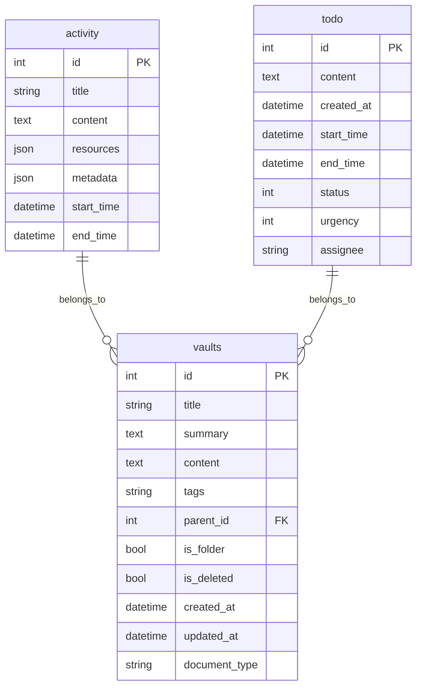
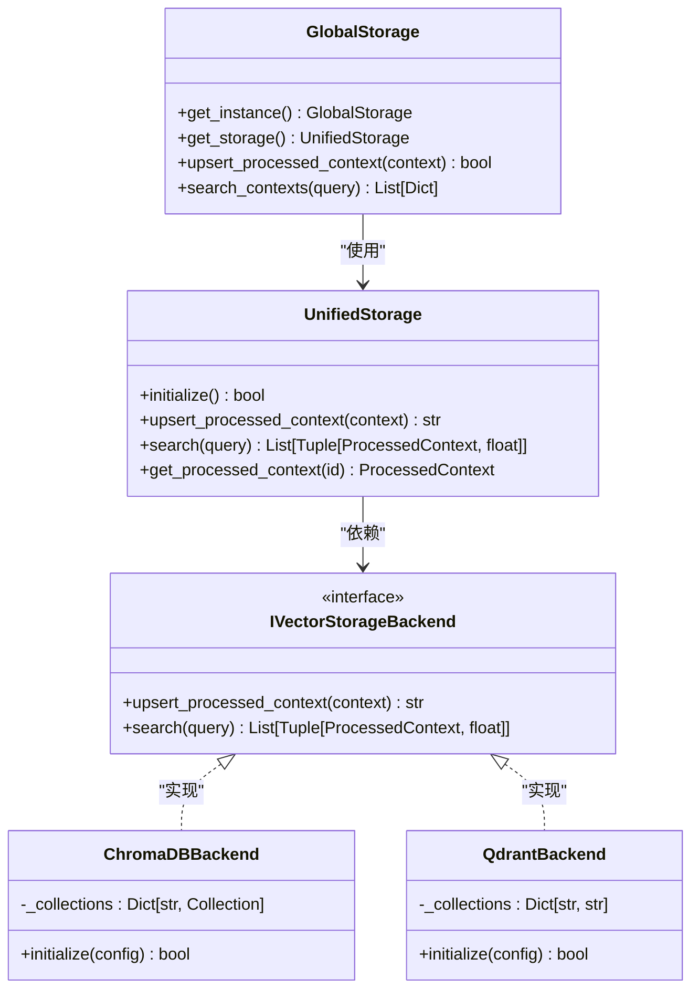

# 数据模型

<cite>
**本文档引用的文件**   
- [context.py](file://opencontext/models/context.py)
- [enums.py](file://opencontext/models/enums.py)
- [schema.sql](file://frontend/src/main/db/schema.sql)
- [global_storage.py](file://opencontext/storage/global_storage.py)
- [unified_storage.py](file://opencontext/storage/unified_storage.py)
- [chromadb_backend.py](file://opencontext/storage/backends/chromadb_backend.py)
- [qdrant_backend.py](file://opencontext/storage/backends/qdrant_backend.py)
- [sqlite_backend.py](file://opencontext/storage/backends/sqlite_backend.py)
</cite>

## 目录
1. [引言](#引言)
2. [核心数据实体 `ProcessedContext`](#核心数据实体-processedcontext)
3. [上下文类型枚举 `ContextType`](#上下文类型枚举-contexttype)
4. [SQLite 数据库模式](#sqlite-数据库模式)
5. [向量存储与统一存储接口](#向量存储与统一存储接口)
6. [数据生命周期与归档机制](#数据生命周期与归档机制)
7. [实体关系图](#实体关系图)

## 引言
本文档旨在全面阐述 MineContext 系统的核心数据模型。系统采用混合存储架构，将结构化数据（如活动记录、待办事项）存储在 SQLite 数据库中，而将经过处理的、富含语义的上下文信息以向量化形式存储在 ChromaDB 或 Qdrant 等专用向量数据库中。`ProcessedContext` 模型是整个系统的核心，它封装了从原始数据中提取的结构化知识，并通过 `ContextType` 枚举进行分类，以支持高效的检索和智能应用。

## 核心数据实体 `ProcessedContext`

`ProcessedContext` 模型是系统中处理后上下文数据的核心表示。它由多个嵌套的 Pydantic 模型组成，结构清晰，旨在捕获信息的丰富语义。该模型的字段及其业务含义如下：

*   **`id`**: 字符串类型，作为该上下文实体的唯一标识符，由系统自动生成。
*   **`properties`**: 类型为 `ContextProperties`，包含上下文的元数据，如创建时间 (`create_time`)、事件发生时间 (`event_time`)、更新时间 (`update_time`) 以及是否已处理 (`is_processed`) 等。
*   **`extracted_data`**: 类型为 `ExtractedData`，包含从原始内容中提取的关键信息，如标题 (`title`)、摘要 (`summary`)、关键词 (`keywords`)、实体 (`entities`)、重要性 (`importance`) 和置信度 (`confidence`)。
*   **`vectorize`**: 类型为 `Vectorize`，包含用于生成向量嵌入的数据。其 `text` 字段是进行向量化的主要内容，`vector` 字段则存储生成的向量数组。
*   **`metadata`**: 可选的字典类型，用于存储额外的结构化信息，例如在 `ENTITY_CONTEXT` 类型中，会存储 `ProfileContextMetadata`，包含实体的类型、规范名称、别名等。

`ProcessedContext` 模型不仅用于数据存储，还提供了 `get_llm_context_string` 方法，可以将其转换为适合大语言模型 (LLM) 输入的字符串格式，便于在智能对话和内容生成中使用。

**Section sources**
- [context.py](file://opencontext/models/context.py#L131-L202)

## 上下文类型枚举 `ContextType`

`ContextType` 枚举定义了系统中上下文信息的分类体系，是实现精准检索和智能应用的基础。该分类体系设计科学，覆盖了用户工作和学习中的主要信息类型：

*   **`ENTITY_CONTEXT` (实体特征信息)**: 用于管理人物、项目、团队等实体的档案信息，支持实体的自主学习和知识积累。
*   **`ACTIVITY_CONTEXT` (行为活动和历史记录)**: 记录用户完成的具体行为、参与的活动或操作，回答“我做了什么”的问题。
*   **`INTENT_CONTEXT` (意图规划和目标信息)**: 记录用户的未来计划、目标设定和行动意图，回答“我将要做什么”的问题。
*   **`SEMANTIC_CONTEXT` (语义知识和概念信息)**: 存储核心知识点、概念定义和技术原理，关注知识本身的内容，而非获取过程。
*   **`PROCEDURAL_CONTEXT` (程序性方法和操作指南)**: 记录用户完成特定任务的操作流程和步骤，基于时间序列捕捉可重复的操作模式。
*   **`STATE_CONTEXT` (状态监控和进度信息)**: 记录当前状态、项目进度和性能指标，用于监控执行情况和评估效果。

该枚举在 `enums.py` 文件中还定义了详细的描述、关键指标和示例，为上下文的自动分类和检索提供了强大的支持。

**Section sources**
- [enums.py](file://opencontext/models/enums.py#L84-L246)

## SQLite 数据库模式

系统使用 SQLite 数据库存储结构化的文档和记录。其 `schema.sql` 文件定义了主要的数据表结构：

*   **`activity` 表**: 用于存储活动记录，包含 `id` (主键), `title` (标题), `content` (内容), `resources` (资源信息，JSON 格式), `metadata` (元数据，JSON 格式), `start_time` (开始时间) 和 `end_time` (结束时间) 等字段。
*   **`todo` 表**: 用于存储待办事项，包含 `id` (主键), `content` (内容), `created_at` (创建时间), `start_time` (开始时间), `end_time` (结束时间), `status` (状态), `urgency` (紧急程度) 和 `assignee` (负责人) 等字段。

此外，系统还定义了 `vaults` (用于存储笔记和报告)、`tips` (用于存储智能提示) 以及用于监控的 `monitoring_*` 系列表。这些表通过外键和索引进行关联和优化，确保了数据查询的高效性。



**Diagram sources **
- [schema.sql](file://frontend/src/main/db/schema.sql#L1-L61)
- [sqlite_backend.py](file://opencontext/storage/backends/sqlite_backend.py#L70-L311)

## 向量存储与统一存储接口

系统采用向量数据库（如 ChromaDB 或 Qdrant）来存储 `ProcessedContext` 的向量化表示，以支持高效的语义搜索。`global_storage.py` 文件提供了 `GlobalStorage` 单例类，作为全局访问统一存储系统的入口。

`UnifiedStorage` 类是存储系统的核心，它通过 `StorageBackendFactory` 工厂模式，根据配置自动初始化向量数据库（`IVectorStorageBackend`）和文档数据库（`IDocumentStorageBackend`）的后端。对于 `ProcessedContext`，系统会调用 `upsert_processed_context` 方法将其存储到对应的向量数据库集合中。每个 `ContextType` 通常对应一个独立的集合（collection），例如 `entity_context`、`activity_context` 等。

`GlobalStorage` 提供了便捷的静态方法（如 `get_global_storage()`），使得系统中的任何组件都可以方便地访问存储功能，而无需在组件间传递存储实例，极大地简化了代码的耦合度。



**Diagram sources **
- [global_storage.py](file://opencontext/storage/global_storage.py#L23-L196)
- [unified_storage.py](file://opencontext/storage/unified_storage.py#L90-L800)
- [chromadb_backend.py](file://opencontext/storage/backends/chromadb_backend.py#L33-L800)
- [qdrant_backend.py](file://opencontext/storage/backends/qdrant_backend.py#L37-L689)

## 数据生命周期与归档机制

系统通过多种机制管理数据的生命周期，确保数据的时效性和存储效率。

*   **数据保留策略**: 系统通过 `ProcessorManager` 中的 `periodic_memory_compression` 功能，定期执行内存压缩。该功能基于“遗忘曲线”模型，计算每个 `ProcessedContext` 的遗忘概率。遗忘概率与上下文的“年龄”（自上次更新以来的时间）成正比，与 `importance`（重要性）成反比。低重要性且长时间未被访问的上下文更有可能被合并或归档。
*   **归档机制**: 虽然核心代码中未直接体现“归档”操作，但数据生命周期的管理主要通过“合并”（merging）策略实现。`MergeStrategy` 基类定义了 `merge_contexts` 方法，允许将相似的上下文进行合并，从而减少冗余数据。此外，系统通过 `is_deleted` 标记（如 `vaults` 表中的字段）实现软删除，被删除的数据在一段时间后可由 `cleanup_old_monitoring_data` 等清理任务彻底移除。

**Section sources**
- [merge_strategies.py](file://opencontext/context_processing/merger/merge_strategies.py#L60-L75)
- [processor_manager.py](file://opencontext/managers/processor_manager.py#L57-L85)
- [sqlite_backend.py](file://opencontext/storage/backends/sqlite_backend.py#L176-L198)

## 实体关系图

下图综合展示了系统中核心数据模型的实体关系。`ProcessedContext` 是中心实体，其 `extracted_data` 包含分类信息 `context_type`，该类型由 `ContextType` 枚举定义。`ProcessedContext` 的向量化数据存储在向量数据库（如 ChromaDB）中，而其原始的结构化记录（如活动、待办事项）则存储在 SQLite 数据库的相应表中。

```mermaid
graph TD
subgraph "向量数据库 (ChromaDB/Qdrant)"
A[ProcessedContext]
A --> B[ContextType]
A --> C[Vector Embedding]
end
subgraph "关系型数据库 (SQLite)"
D[activity 表]
E[todo 表]
F[vaults 表]
D --> G[ProcessedContext]
E --> G
F --> G
end
A --> G : "引用"
B --> A : "分类"
C --> A : "包含"
```

**Diagram sources **
- [context.py](file://opencontext/models/context.py#L131-L343)
- [enums.py](file://opencontext/models/enums.py#L84-L246)
- [schema.sql](file://frontend/src/main/db/schema.sql#L1-L61)
- [unified_storage.py](file://opencontext/storage/unified_storage.py#L90-L800)