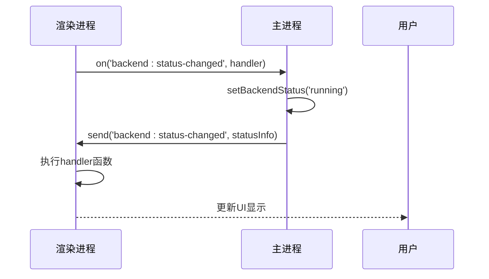

# IPC通信机制

<cite>
**本文档引用的文件**   
- [IpcChannel.ts](file://frontend/packages/shared/IpcChannel.ts)
- [ipc.ts](file://frontend/src/main/ipc.ts)
- [ExpressService.ts](file://frontend/src/main/services/ExpressService.ts)
- [index.ts](file://frontend/src/preload/index.ts)
- [server-push-api.tsx](file://frontend/src/preload/server-push-api.tsx)
- [backend.ts](file://frontend/src/main/backend.ts)
- [index.ts](file://frontend/src/main/index.ts)
- [App.tsx](file://frontend/src/renderer/src/App.tsx)
- [UpdateAvailableButton/index.tsx](file://frontend/src/renderer/src/components/UpdateAvailableButton/index.tsx)
</cite>

## 目录
1. [引言](#引言)
2. [IPC通道枚举](#ipc通道枚举)
3. [主进程IPC处理](#主进程ipc处理)
4. [渲染进程IPC调用](#渲染进程ipc调用)
5. [后端服务集成](#后端服务集成)
6. [事件推送机制](#事件推送机制)
7. [错误处理与数据序列化](#错误处理与数据序列化)
8. [完整通信流程](#完整通信流程)

## 引言
本项目采用Electron框架构建，实现了主进程与渲染进程之间的双向通信机制。通过定义清晰的IPC（进程间通信）通道，系统能够在保证类型安全的同时，实现窗口控制、数据请求、事件推送等多种功能。核心通信机制基于Electron的`ipcMain`和`ipcRenderer`模块，通过预定义的通道名称进行消息传递。

**Section sources**
- [index.ts](file://frontend/src/main/index.ts#L143-L148)
- [index.ts](file://frontend/src/preload/index.ts#L124-L151)

## IPC通道枚举
`IpcChannel`枚举定义了所有可用的IPC通信通道，为不同类型的消息提供了类型安全的标识符。这些通道涵盖了应用控制、文件操作、数据库访问、屏幕监控等多个功能领域。

通道命名采用`模块:操作`的格式，如`app:get-cache-size`表示应用模块的获取缓存大小操作。这种命名约定提高了代码的可读性和可维护性。枚举值分为以下几类：

- **应用控制**：如`App_CheckForUpdate`、`App_QuitAndInstall`等，用于控制应用生命周期
- **窗口操作**：如`Windows_SetMinimumSize`、`Windows_GetSize`等，用于窗口尺寸管理
- **数据库操作**：如`Database_GetAllVaults`、`Database_InsertVault`等，用于数据持久化
- **屏幕监控**：如`Screen_Monitor_Take_Screenshot`、`Screen_Monitor_Get_Visible_Sources`等，用于屏幕捕获功能
- **文件服务**：如`File_Save`、`File_Read`等，用于文件读写操作

这种分类方式使得开发者能够快速定位所需的功能通道。


**Diagram sources **
- [IpcChannel.ts](file://frontend/packages/shared/IpcChannel.ts#L4-L348)

**Section sources**
- [IpcChannel.ts](file://frontend/packages/shared/IpcChannel.ts#L4-L348)

## 主进程IPC处理
主进程通过`ipcMain.handle`方法注册同步处理器，处理来自渲染进程的请求。每个处理器都与`IpcChannel`枚举中的特定通道关联，实现了类型安全的请求处理。

在`ipc.ts`文件中，`registerIpc`函数负责注册所有IPC处理器。处理器的实现遵循以下模式：

1. **参数验证**：检查传入参数的有效性
2. **业务逻辑执行**：调用相应的服务或模块处理请求
3. **结果返回**：将处理结果返回给渲染进程
4. **错误处理**：捕获并处理可能的异常

例如，`App_GetCacheSize`通道的处理器会计算缓存目录的大小并返回结果，而`Database_GetAllVaults`通道则会查询数据库并返回所有vault记录。


**Diagram sources **
- [ipc.ts](file://frontend/src/main/ipc.ts#L45-L610)
- [DatabaseService.ts](file://frontend/src/main/services/DatabaseService.ts)

**Section sources**
- [ipc.ts](file://frontend/src/main/ipc.ts#L45-L610)

## 渲染进程IPC调用
渲染进程通过`ipcRenderer.invoke`方法向主进程发送请求，并通过`ipcRenderer.on`方法监听事件推送。为了简化调用，项目使用`contextBridge`将IPC API暴露给渲染进程。

在`preload/index.ts`文件中，定义了多个API对象，如`api`、`dbAPI`、`screenMonitorAPI`等，这些对象封装了底层的IPC调用，提供了更友好的接口。例如：

- `dbAPI.getAllVaults()`：获取所有vault
- `screenMonitorAPI.takeScreenshot()`：截取屏幕
- `api.checkForUpdate()`：检查更新

这种方式不仅提高了代码的可读性，还降低了耦合度，使得渲染进程无需直接处理IPC细节。


**Diagram sources **
- [index.ts](file://frontend/src/preload/index.ts#L17-L151)

**Section sources**
- [index.ts](file://frontend/src/preload/index.ts#L17-L151)

## 后端服务集成
`ExpressService`通过IPC机制将后端API响应传递给前端。主进程启动Express服务器，监听特定端口，处理HTTP请求并将结果通过IPC通道发送给渲染进程。

在`ExpressService.ts`文件中，`createExpressServer`函数创建并启动Express服务器，`APIChatHandler`函数处理聊天API请求。当收到请求时，处理器会：

1. 解析请求体中的消息和模型参数
2. 调用AI服务进行流式响应
3. 将响应结果通过IPC通道发送回渲染进程

主进程通过`ensureBackendRunning`函数确保后端服务正常运行，并在状态变化时通过`Backend_StatusChanged`通道通知渲染进程。


**Diagram sources **
- [ExpressService.ts](file://frontend/src/main/services/ExpressService.ts#L9-L112)
- [backend.ts](file://frontend/src/main/backend.ts#L316-L345)

**Section sources**
- [ExpressService.ts](file://frontend/src/main/services/ExpressService.ts#L9-L112)
- [backend.ts](file://frontend/src/main/backend.ts#L316-L345)

## 事件推送机制
除了请求-响应模式，系统还实现了事件推送机制，允许主进程主动向渲染进程发送通知。这通过`ipcRenderer.on`方法实现，渲染进程可以订阅特定的事件通道。

`IpcServerPushChannel`枚举定义了所有事件推送通道，如`PushGetInitCheckData`、`PushPowerMonitor`等。主进程在特定事件发生时，通过`webContents.send`方法向渲染进程发送事件。

例如，在`App.tsx`中，渲染进程订阅`backend:status-changed`事件，当后端服务状态变化时，主进程会发送状态更新，渲染进程据此更新UI显示。



**Diagram sources **
- [server-push-api.tsx](file://frontend/src/preload/server-push-api.tsx#L9-L46)
- [App.tsx](file://frontend/src/renderer/src/App.tsx#L73-L74)

**Section sources**
- [server-push-api.tsx](file://frontend/src/preload/server-push-api.tsx#L9-L46)
- [App.tsx](file://frontend/src/renderer/src/App.tsx#L73-L74)

## 错误处理与数据序列化
系统在IPC通信中实现了完善的错误处理机制。每个处理器都包含try-catch块，捕获并处理可能的异常，确保不会因为单个请求的失败而影响整个应用。

在`ipc.ts`文件中，大多数处理器都遵循以下错误处理模式：

```typescript
ipcMain.handle(IpcChannel.App_ClearCache, async () => {
  try {
    // 业务逻辑
    return { success: true }
  } catch (error: any) {
    logger.error('Failed to clear cache:', error)
    return { success: false, error: error.message }
  }
})
```

数据序列化方面，系统使用JSON格式在进程间传递数据。复杂对象（如Date、Error等）会被自动序列化，但需要注意某些特殊对象（如函数、Symbol等）无法通过IPC传递。

## 完整通信流程
完整的IPC通信流程包括以下步骤：

1. **初始化**：主进程启动时注册所有IPC处理器
2. **请求**：渲染进程通过`invoke`发送请求
3. **处理**：主进程执行相应处理器逻辑
4. **响应**：主进程返回处理结果
5. **事件推送**：主进程在特定事件发生时主动推送通知

这种双向通信机制确保了应用各组件之间的高效协作，同时保持了良好的解耦性。


**Diagram sources **
- [index.ts](file://frontend/src/main/index.ts#L286-L286)
- [ipc.ts](file://frontend/src/main/ipc.ts#L45-L610)

**Section sources**
- [index.ts](file://frontend/src/main/index.ts#L286-L286)
- [ipc.ts](file://frontend/src/main/ipc.ts#L45-L610)