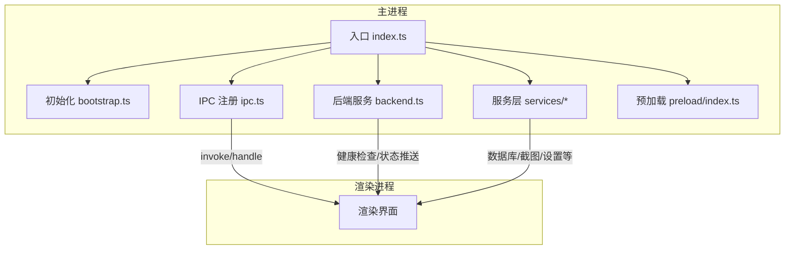
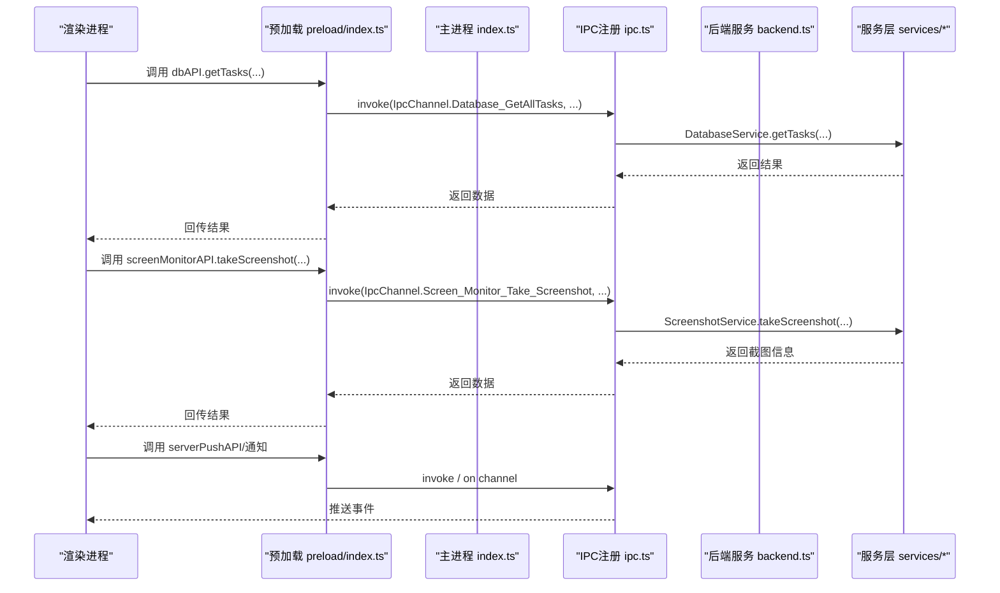
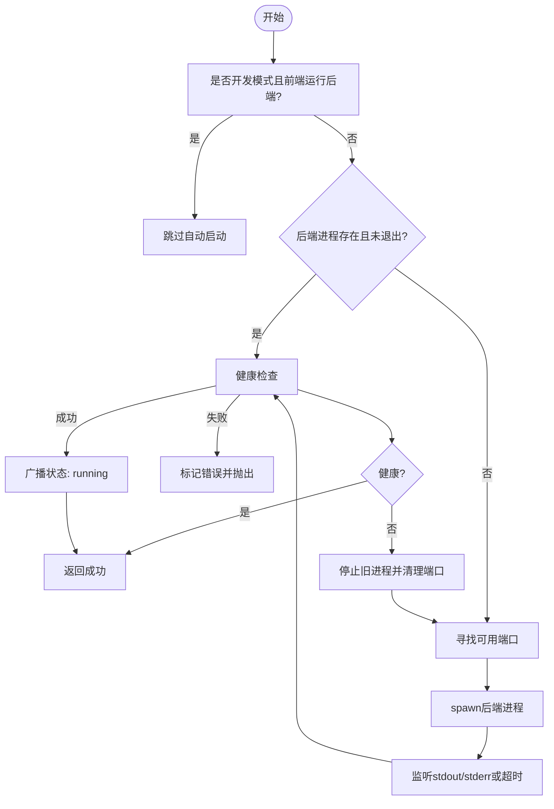
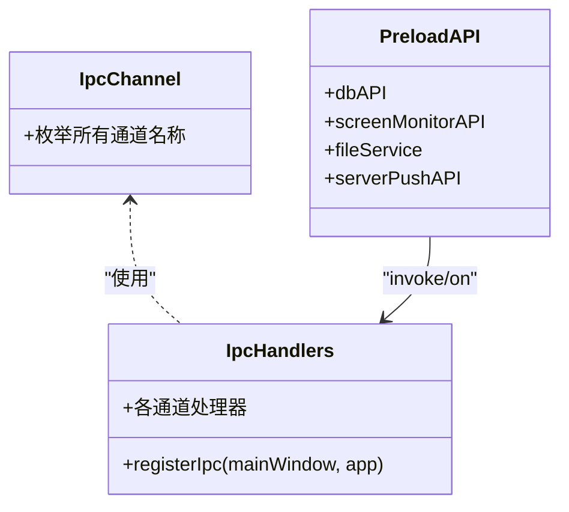
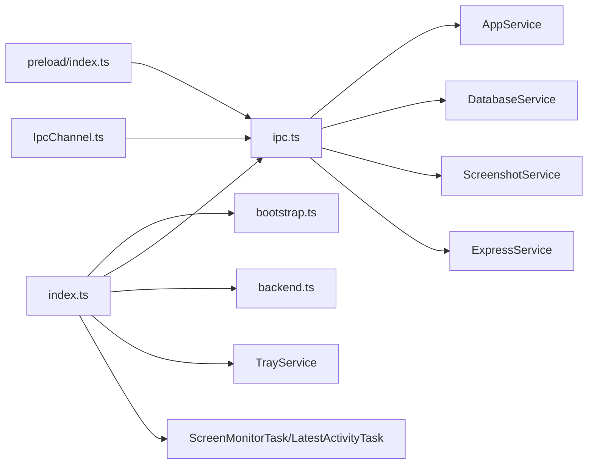

# 主进程

<cite>
**本文引用的文件列表**
- [frontend/src/main/index.ts](file://frontend/src/main/index.ts)
- [frontend/src/main/bootstrap.ts](file://frontend/src/main/bootstrap.ts)
- [frontend/src/main/ipc.ts](file://frontend/src/main/ipc.ts)
- [frontend/src/main/backend.ts](file://frontend/src/main/backend.ts)
- [frontend/src/main/services/AppService.ts](file://frontend/src/main/services/AppService.ts)
- [frontend/src/main/services/DatabaseService.ts](file://frontend/src/main/services/DatabaseService.ts)
- [frontend/src/main/services/ExpressService.ts](file://frontend/src/main/services/ExpressService.ts)
- [frontend/src/main/services/ScreenshotService.ts](file://frontend/src/main/services/ScreenshotService.ts)
- [frontend/src/preload/index.ts](file://frontend/src/preload/index.ts)
- [frontend/packages/shared/IpcChannel.ts](file://frontend/packages/shared/IpcChannel.ts)
</cite>

## 目录
1. [简介](#简介)
2. [项目结构](#项目结构)
3. [核心组件](#核心组件)
4. [架构总览](#架构总览)
5. [详细组件分析](#详细组件分析)
6. [依赖关系分析](#依赖关系分析)
7. [性能考量](#性能考量)
8. [故障排查指南](#故障排查指南)
9. [结论](#结论)

## 简介
本文件面向Electron主进程的职责与实现进行系统化梳理，覆盖应用生命周期管理、窗口创建与管理、系统事件处理（如电源状态变化）、后台任务调度、Python后端服务的启动/监控/健康检查、IPC通信机制、以及各服务类（AppService、DatabaseService、ScreenshotService等）的职责与协作方式。同时给出通过IpcChannel枚举定义与处理IPC消息的方法指引，并说明如何使用ExpressService集成后端API。

## 项目结构
主进程入口位于前端工程的主进程目录，采用“按功能域分层”的组织方式：
- 入口与生命周期：index.ts负责应用启动、协议注册、窗口创建、托盘初始化、后台任务调度与退出清理。
- 初始化与数据迁移：bootstrap.ts负责打包后的应用数据目录初始化与占用目录迁移。
- IPC通信：ipc.ts集中注册各类IPC处理器，连接渲染进程与主进程服务。
- 后端服务：backend.ts封装Python后端可执行程序的启动、端口探测、健康检查、进程管理与错误恢复。
- 服务层：services目录包含AppService、DatabaseService、ScreenshotService、ExpressService等，分别承担应用设置、数据库、截图与本地Express服务等功能。
- 预加载桥接：preload/index.ts通过contextBridge向渲染进程暴露受控API，统一调用IPC通道。

图表来源
- [frontend/src/main/index.ts](file://frontend/src/main/index.ts#L196-L348)
- [frontend/src/main/bootstrap.ts](file://frontend/src/main/bootstrap.ts#L1-L75)
- [frontend/src/main/ipc.ts](file://frontend/src/main/ipc.ts#L1-L610)
- [frontend/src/main/backend.ts](file://frontend/src/main/backend.ts#L1-L740)
- [frontend/src/preload/index.ts](file://frontend/src/preload/index.ts#L1-L157)

章节来源
- [frontend/src/main/index.ts](file://frontend/src/main/index.ts#L196-L348)
- [frontend/src/main/bootstrap.ts](file://frontend/src/main/bootstrap.ts#L1-L75)

## 核心组件
- 应用入口与生命周期
  - 协议注册、窗口创建、托盘初始化、后台任务启动、退出清理。
- IPC注册中心
  - 统一注册各类IpcChannel对应的handle/invoke处理器，连接业务服务与渲染进程。
- 后端服务管理
  - Python后端可执行文件定位、端口探测、启动参数拼装、进程管理、健康检查、状态广播。
- 服务层
  - AppService：开机自启、Linux桌面文件写入/删除。
  - DatabaseService：better-sqlite3数据库初始化、表结构确保、活动/任务/Tips查询与更新。
  - ScreenshotService：屏幕/窗口截图、可见源枚举、历史截图读取与清理。
  - ExpressService：本地Express服务（聊天流式响应），供渲染侧调用或与后端API联动。
- 预加载桥接
  - 通过contextBridge暴露有限API，统一走IPC通道，避免直接访问Node/Electron能力。

章节来源
- [frontend/src/main/index.ts](file://frontend/src/main/index.ts#L196-L348)
- [frontend/src/main/ipc.ts](file://frontend/src/main/ipc.ts#L1-L610)
- [frontend/src/main/backend.ts](file://frontend/src/main/backend.ts#L1-L740)
- [frontend/src/main/services/AppService.ts](file://frontend/src/main/services/AppService.ts#L1-L87)
- [frontend/src/main/services/DatabaseService.ts](file://frontend/src/main/services/DatabaseService.ts#L1-L364)
- [frontend/src/main/services/ScreenshotService.ts](file://frontend/src/main/services/ScreenshotService.ts#L1-L370)
- [frontend/src/main/services/ExpressService.ts](file://frontend/src/main/services/ExpressService.ts#L1-L112)
- [frontend/src/preload/index.ts](file://frontend/src/preload/index.ts#L1-L157)

## 架构总览
主进程以“入口—IPC—服务—后端”为主线，渲染进程通过预加载桥接调用IPC通道，实现UI与系统/业务能力的解耦。

图表来源
- [frontend/src/preload/index.ts](file://frontend/src/preload/index.ts#L1-L157)
- [frontend/src/main/ipc.ts](file://frontend/src/main/ipc.ts#L1-L610)
- [frontend/src/main/services/DatabaseService.ts](file://frontend/src/main/services/DatabaseService.ts#L1-L364)
- [frontend/src/main/services/ScreenshotService.ts](file://frontend/src/main/services/ScreenshotService.ts#L1-L370)
- [frontend/src/main/backend.ts](file://frontend/src/main/backend.ts#L1-L740)

## 详细组件分析

### Python后端服务管理（backend.ts）
- 职责
  - 定位Python后端可执行文件（支持多平台路径），动态选择可用端口，spawn子进程运行。
  - 健康检查：轮询后端健康接口，失败重试，超时兜底。
  - 进程管理：优雅终止与强制终止、跨平台SIGTERM/SIGKILL、端口残留清理。
  - 日志与状态：创建调试日志文件、记录启动/运行/停止/错误状态并向所有窗口广播。
- 关键流程
  - 端口探测：逐个尝试端口，监听127.0.0.1，避免占用。
  - 启动：根据平台选择可执行名，尝试多处资源路径，必要时chmod可执行；设置工作目录与环境变量，detach进程组。
  - 健康检查：HTTP GET /api/health，带超时；成功后广播初始化完成。
  - 错误恢复：启动失败/崩溃/端口冲突时，构造友好错误提示并弹窗（非开发模式）。
- 与IPC的交互
  - 提供获取端口/状态的IPC处理器，供渲染侧查询。
  - 后端状态变更通过IpcChannel.Backend_StatusChanged广播。

图表来源
- [frontend/src/main/backend.ts](file://frontend/src/main/backend.ts#L1-L740)

章节来源
- [frontend/src/main/backend.ts](file://frontend/src/main/backend.ts#L1-L740)
- [frontend/src/main/ipc.ts](file://frontend/src/main/ipc.ts#L534-L544)

### IPC通信机制（ipc.ts 与 IpcChannel.ts）
- IpcChannel枚举
  - 定义了所有IPC通道名称，涵盖应用信息、代理、缓存、窗口尺寸、数据库、截图、后端状态、托盘、热力图、任务等。
- IPC注册
  - 使用ipcMain.handle注册处理器，统一由index.ts在whenReady后调用registerIpc初始化。
  - 处理器内部依赖具体服务类（如DatabaseService、ScreenshotService、AppService等）。
- 渲染侧桥接
  - preload/index.ts通过contextBridge.exposeInMainWorld暴露API，统一走ipcRenderer.invoke/on，避免直接使用ipcRenderer。

图表来源
- [frontend/packages/shared/IpcChannel.ts](file://frontend/packages/shared/IpcChannel.ts#L1-L349)
- [frontend/src/preload/index.ts](file://frontend/src/preload/index.ts#L1-L157)
- [frontend/src/main/ipc.ts](file://frontend/src/main/ipc.ts#L1-L610)

章节来源
- [frontend/packages/shared/IpcChannel.ts](file://frontend/packages/shared/IpcChannel.ts#L1-L349)
- [frontend/src/preload/index.ts](file://frontend/src/preload/index.ts#L1-L157)
- [frontend/src/main/ipc.ts](file://frontend/src/main/ipc.ts#L1-L610)

### 服务类职责与协作

#### AppService（应用设置）
- 职责
  - Windows/macOS开机自启设置。
  - Linux通过desktop文件实现自启/取消。
- 单例模式：getInstance保证全局唯一。

章节来源
- [frontend/src/main/services/AppService.ts](file://frontend/src/main/services/AppService.ts#L1-L87)

#### DatabaseService（数据库）
- 职责
  - better-sqlite3数据库初始化、WAL模式、表结构确保。
  - 提供活动/任务/Tips的查询与更新方法。
  - 通过DB单例访问底层SQL执行。
- 生命周期
  - initialize惰性初始化，ensureInitialized校验；close关闭连接。

章节来源
- [frontend/src/main/services/DatabaseService.ts](file://frontend/src/main/services/DatabaseService.ts#L1-L364)

#### ScreenshotService（截图与可见源）
- 职责
  - 屏幕/窗口截图、可见源枚举、历史截图读取、截图清理（按保留天数）。
  - macOS权限检查与隐私设置跳转。
- 工具复用
  - 继承CaptureSourcesTools，复用可见源与截图工具方法。

章节来源
- [frontend/src/main/services/ScreenshotService.ts](file://frontend/src/main/services/ScreenshotService.ts#L1-L370)

#### ExpressService（本地Express服务）
- 职责
  - 创建本地Express服务，提供聊天流式响应接口，支持CORS与流式输出。
- 适用场景
  - 可作为渲染侧本地API或与后端API联动，便于演示与调试。

章节来源
- [frontend/src/main/services/ExpressService.ts](file://frontend/src/main/services/ExpressService.ts#L1-L112)

### 应用生命周期与窗口管理
- 协议注册
  - 自定义vikingdb协议读取本地资源，返回对应MIME类型。
- 窗口创建
  - 根据平台设置frameless或默认frame，preload脚本注入，禁用sandbox/webSecurity以便开发调试。
- 托盘与最小化
  - 窗口关闭事件拦截为隐藏；托盘服务创建与销毁。
- 退出清理
  - before-quit阶段停止截图清理任务、销毁托盘、关闭后端进程与数据库连接。

章节来源
- [frontend/src/main/index.ts](file://frontend/src/main/index.ts#L196-L348)

### 后台任务调度
- 截图清理定时任务
  - 每日执行，清理超过15天的历史截图，释放磁盘空间。
- 屏幕监控任务与最新活动任务
  - 通过ScreenMonitorTask与LatestActivityTask初始化，配合后台任务队列与计划任务模块。

章节来源
- [frontend/src/main/index.ts](file://frontend/src/main/index.ts#L62-L123)

### 系统事件处理（电源状态）
- powerWatcher.run()
  - 在入口处启动电源状态监听，结合后台任务与窗口行为进行响应（如暂停录制、降低负载等）。

章节来源
- [frontend/src/main/index.ts](file://frontend/src/main/index.ts#L256-L260)

## 依赖关系分析

图表来源
- [frontend/src/main/index.ts](file://frontend/src/main/index.ts#L196-L348)
- [frontend/src/main/ipc.ts](file://frontend/src/main/ipc.ts#L1-L610)
- [frontend/src/main/backend.ts](file://frontend/src/main/backend.ts#L1-L740)
- [frontend/src/preload/index.ts](file://frontend/src/preload/index.ts#L1-L157)
- [frontend/packages/shared/IpcChannel.ts](file://frontend/packages/shared/IpcChannel.ts#L1-L349)

章节来源
- [frontend/src/main/index.ts](file://frontend/src/main/index.ts#L196-L348)
- [frontend/src/main/ipc.ts](file://frontend/src/main/ipc.ts#L1-L610)

## 性能考量
- 后端健康检查
  - 采用轮询+超时策略，最大重试次数与延迟可控，避免长时间阻塞。
- 数据库
  - WAL模式提升并发写入性能；惰性初始化减少冷启动开销。
- 截图清理
  - 每日定时清理，避免历史数据无限增长；计算目录大小时递归遍历，注意I/O成本。
- 进程管理
  - 非Windows平台使用detached创建新会话组，便于统一终止；Windows使用进程PID终止，兼容性更好。

[本节为通用建议，不直接分析具体文件]

## 故障排查指南
- 后端无法启动
  - 检查端口占用与可执行文件路径；查看后端调试日志文件位置；确认开发模式下是否期望外部后端运行。
- 健康检查失败
  - 观察重试间隔与超时时间；确认后端监听地址为127.0.0.1；检查防火墙与代理配置。
- 截图权限问题（macOS）
  - 检查系统隐私设置中的屏幕录制权限；必要时引导用户打开偏好设置。
- 数据库初始化失败
  - 确认数据库目录存在；等待waitForDatabaseDirectory完成；查看日志定位异常。
- 退出时资源未释放
  - 确认before-quit回调中已停止截图清理、销毁托盘、关闭后端与数据库。

章节来源
- [frontend/src/main/backend.ts](file://frontend/src/main/backend.ts#L1-L740)
- [frontend/src/main/services/ScreenshotService.ts](file://frontend/src/main/services/ScreenshotService.ts#L1-L370)
- [frontend/src/main/services/DatabaseService.ts](file://frontend/src/main/services/DatabaseService.ts#L1-L364)
- [frontend/src/main/index.ts](file://frontend/src/main/index.ts#L324-L348)

## 结论
主进程围绕“入口—IPC—服务—后端”的清晰边界构建，既保证了渲染进程的安全隔离，又提供了完善的系统级能力与后台任务调度。Python后端服务通过严格的端口探测、健康检查与进程管理保障稳定性；服务层以职责单一、接口明确的方式支撑渲染侧功能；IPC通道通过IpcChannel统一命名与预加载桥接，形成一致的调用体验。建议在生产环境中进一步完善错误上报与可观测性，持续优化后台任务的资源占用与执行效率。