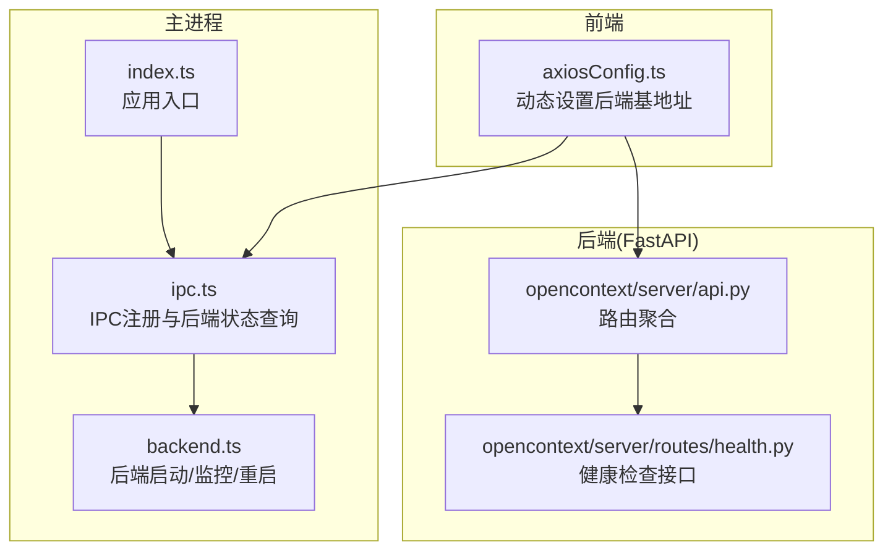
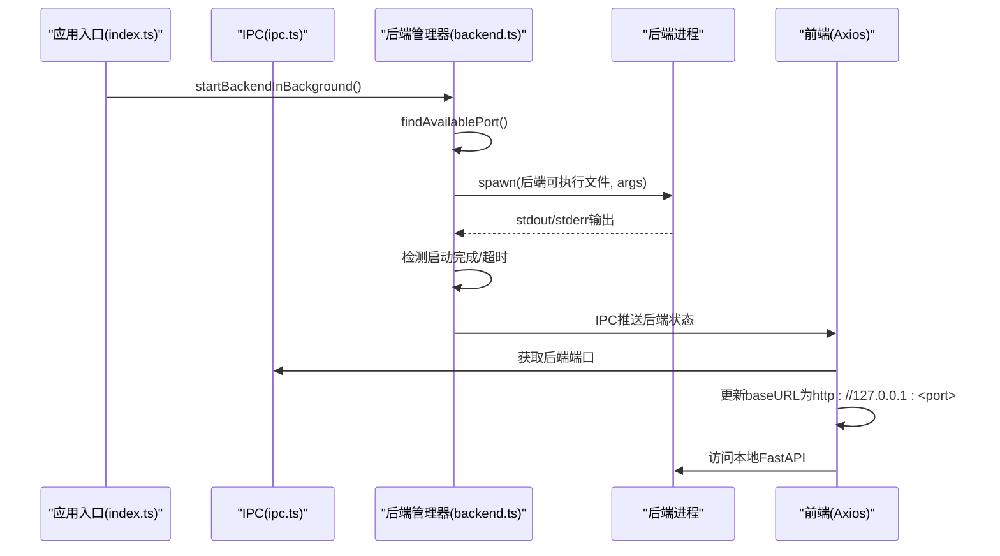
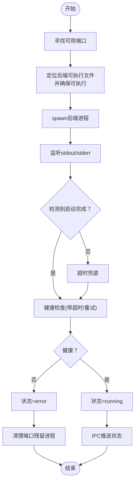
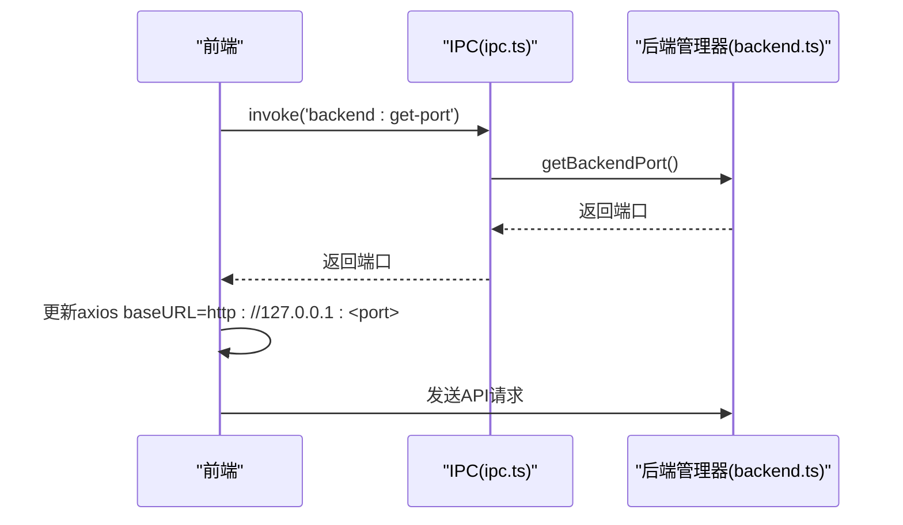
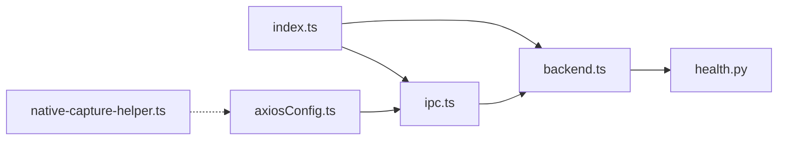

# 后端服务集成

<cite>
**本文引用的文件**
- [frontend/src/main/backend.ts](file://frontend/src/main/backend.ts)
- [frontend/src/main/ipc.ts](file://frontend/src/main/ipc.ts)
- [frontend/src/main/index.ts](file://frontend/src/main/index.ts)
- [frontend/src/renderer/src/services/axiosConfig.ts](file://frontend/src/renderer/src/services/axiosConfig.ts)
- [frontend/src/main/utils/native-capture-helper.ts](file://frontend/src/main/utils/native-capture-helper.ts)
- [opencontext/server/routes/health.py](file://opencontext/server/routes/health.py)
- [opencontext/server/api.py](file://opencontext/server/api.py)
- [frontend/src/main/services/ExpressService.ts](file://frontend/src/main/services/ExpressService.ts)
</cite>

## 目录
1. [简介](#简介)
2. [项目结构](#项目结构)
3. [核心组件](#核心组件)
4. [架构总览](#架构总览)
5. [详细组件分析](#详细组件分析)
6. [依赖关系分析](#依赖关系分析)
7. [性能考量](#性能考量)
8. [故障排查指南](#故障排查指南)
9. [结论](#结论)

## 简介
本文件面向后端服务集成场景，聚焦主进程如何启动、监控并管理本地Python后端服务（FastAPI），以及前端如何通过主进程代理访问该后端。文档重点覆盖：
- 主进程如何使用子进程模块派生Python后端进程，并通过端口探测与健康检查确认服务就绪
- 前端通过主进程IPC通道获取后端端口，动态更新请求基地址，实现对本地FastAPI的访问
- 错误恢复策略：后端崩溃时的自动重启与资源清理
- 进程间通信的超时、错误与数据流处理
- 本地捕获能力与native-capture-helper的协作

## 项目结构
本项目采用Electron主进程+渲染进程的架构，后端服务由主进程负责启动与监控，前端通过主进程代理访问本地FastAPI服务。

图表来源
- [frontend/src/main/index.ts](file://frontend/src/main/index.ts#L256-L260)
- [frontend/src/main/ipc.ts](file://frontend/src/main/ipc.ts#L534-L544)
- [frontend/src/main/backend.ts](file://frontend/src/main/backend.ts#L347-L583)
- [frontend/src/renderer/src/services/axiosConfig.ts](file://frontend/src/renderer/src/services/axiosConfig.ts#L1-L36)
- [opencontext/server/api.py](file://opencontext/server/api.py#L16-L58)
- [opencontext/server/routes/health.py](file://opencontext/server/routes/health.py#L19-L47)

章节来源
- [frontend/src/main/index.ts](file://frontend/src/main/index.ts#L256-L260)
- [frontend/src/main/ipc.ts](file://frontend/src/main/ipc.ts#L534-L544)
- [frontend/src/main/backend.ts](file://frontend/src/main/backend.ts#L347-L583)
- [frontend/src/renderer/src/services/axiosConfig.ts](file://frontend/src/renderer/src/services/axiosConfig.ts#L1-L36)
- [opencontext/server/api.py](file://opencontext/server/api.py#L16-L58)
- [opencontext/server/routes/health.py](file://opencontext/server/routes/health.py#L19-L47)

## 核心组件
- 主进程后端管理器：负责后端可执行文件定位、端口选择、进程启动、健康检查、状态上报与异常恢复
- IPC通道：向渲染进程暴露后端端口与状态，供前端动态配置请求基地址
- 前端Axios配置：在应用启动时通过IPC获取后端端口，动态更新baseURL
- FastAPI后端：提供健康检查等接口，供主进程健康检查调用
- 本地捕获助手：为屏幕/应用捕获提供原生能力封装，与后端无直接耦合

章节来源
- [frontend/src/main/backend.ts](file://frontend/src/main/backend.ts#L347-L583)
- [frontend/src/main/ipc.ts](file://frontend/src/main/ipc.ts#L534-L544)
- [frontend/src/renderer/src/services/axiosConfig.ts](file://frontend/src/renderer/src/services/axiosConfig.ts#L1-L36)
- [opencontext/server/routes/health.py](file://opencontext/server/routes/health.py#L19-L47)
- [frontend/src/main/utils/native-capture-helper.ts](file://frontend/src/main/utils/native-capture-helper.ts#L1-L154)

## 架构总览
主进程在应用启动时调用后端管理器，完成以下流程：
- 选择可用端口
- 定位后端可执行文件并确保可执行权限
- 以detached模式启动后端进程，监听stdout/stderr
- 通过HTTP健康检查确认服务就绪
- 将后端状态通过IPC推送给渲染进程
- 前端根据后端端口动态更新请求基地址，访问本地FastAPI

图表来源
- [frontend/src/main/index.ts](file://frontend/src/main/index.ts#L256-L260)
- [frontend/src/main/ipc.ts](file://frontend/src/main/ipc.ts#L534-L544)
- [frontend/src/main/backend.ts](file://frontend/src/main/backend.ts#L347-L583)
- [frontend/src/renderer/src/services/axiosConfig.ts](file://frontend/src/renderer/src/services/axiosConfig.ts#L1-L36)

## 详细组件分析

### 后端启动与监控（backend.ts）
- 端口探测与选择
  - 使用TCP监听测试端口占用，支持多次重试
  - 默认起始端口为固定值，失败则递增尝试
- 可执行文件定位与权限
  - 在多处候选路径中查找后端可执行文件
  - 若不可执行则尝试修改权限
- 子进程启动
  - 以detached模式启动，Unix系统下创建新进程组
  - 工作目录设为可执行文件所在目录
  - 传递环境变量（如用户数据目录）
- 启动完成判定
  - 监听stdout/stderr，匹配启动关键字触发健康检查
  - 超时兜底：若长时间未检测到关键字，仍进行健康检查
- 健康检查
  - 定期轮询本地健康检查接口，带超时控制
  - 失败重试与最终失败处理
- 状态管理与错误恢复
  - 状态机：starting/running/stopped/error
  - 进程关闭与错误事件处理
  - 异常时清理端口残留进程
- 同步/异步停止
  - 先优雅终止，再强制杀死；同步停止时立即清理端口

图表来源
- [frontend/src/main/backend.ts](file://frontend/src/main/backend.ts#L44-L137)
- [frontend/src/main/backend.ts](file://frontend/src/main/backend.ts#L347-L583)
- [frontend/src/main/backend.ts](file://frontend/src/main/backend.ts#L542-L574)

章节来源
- [frontend/src/main/backend.ts](file://frontend/src/main/backend.ts#L44-L137)
- [frontend/src/main/backend.ts](file://frontend/src/main/backend.ts#L347-L583)
- [frontend/src/main/backend.ts](file://frontend/src/main/backend.ts#L542-L574)

### IPC通道与前端基地址更新（ipc.ts、axiosConfig.ts）
- IPC通道
  - 提供后端端口与状态查询接口，供渲染进程获取
- 前端Axios
  - 应用启动时通过IPC获取后端端口
  - 动态更新baseURL为http://127.0.0.1:<port>
  - 之后所有API请求均指向本地FastAPI

图表来源
- [frontend/src/main/ipc.ts](file://frontend/src/main/ipc.ts#L534-L544)
- [frontend/src/renderer/src/services/axiosConfig.ts](file://frontend/src/renderer/src/services/axiosConfig.ts#L1-L36)

章节来源
- [frontend/src/main/ipc.ts](file://frontend/src/main/ipc.ts#L534-L544)
- [frontend/src/renderer/src/services/axiosConfig.ts](file://frontend/src/renderer/src/services/axiosConfig.ts#L1-L36)

### FastAPI后端健康检查（opencontext/server/routes/health.py）
- 提供健康检查接口，返回服务状态与组件健康信息
- 主进程通过HTTP轮询该接口进行健康检查

章节来源
- [opencontext/server/routes/health.py](file://opencontext/server/routes/health.py#L19-L47)

### 本地捕获功能（native-capture-helper.ts）
- 通过动态导入第三方模块实现屏幕捕获
- 提供纯JavaScript方案下的屏幕捕获能力，不依赖后端
- 与后端无直接耦合，主要用于前端界面的截图/录制预览

章节来源
- [frontend/src/main/utils/native-capture-helper.ts](file://frontend/src/main/utils/native-capture-helper.ts#L1-L154)

## 依赖关系分析
- 主进程入口依赖后端管理器与IPC注册
- IPC依赖后端管理器提供的端口与状态
- 前端Axios依赖IPC提供的端口信息
- 后端管理器依赖FastAPI健康检查接口
- 本地捕获助手独立于后端，仅用于前端功能

图表来源
- [frontend/src/main/index.ts](file://frontend/src/main/index.ts#L256-L260)
- [frontend/src/main/ipc.ts](file://frontend/src/main/ipc.ts#L534-L544)
- [frontend/src/main/backend.ts](file://frontend/src/main/backend.ts#L347-L583)
- [frontend/src/renderer/src/services/axiosConfig.ts](file://frontend/src/renderer/src/services/axiosConfig.ts#L1-L36)
- [opencontext/server/routes/health.py](file://opencontext/server/routes/health.py#L19-L47)
- [frontend/src/main/utils/native-capture-helper.ts](file://frontend/src/main/utils/native-capture-helper.ts#L1-L154)

章节来源
- [frontend/src/main/index.ts](file://frontend/src/main/index.ts#L256-L260)
- [frontend/src/main/ipc.ts](file://frontend/src/main/ipc.ts#L534-L544)
- [frontend/src/main/backend.ts](file://frontend/src/main/backend.ts#L347-L583)
- [frontend/src/renderer/src/services/axiosConfig.ts](file://frontend/src/renderer/src/services/axiosConfig.ts#L1-L36)
- [opencontext/server/routes/health.py](file://opencontext/server/routes/health.py#L19-L47)
- [frontend/src/main/utils/native-capture-helper.ts](file://frontend/src/main/utils/native-capture-helper.ts#L1-L154)

## 性能考量
- 后端进程以detached模式运行，避免阻塞主进程
- 健康检查采用超时与重试策略，降低启动阶段的不确定性
- 前端Axios仅在启动时读取一次端口并缓存，减少IPC调用开销
- 本地捕获助手尽量使用纯JavaScript实现，避免额外进程开销

## 故障排查指南
- 后端无法启动
  - 检查可执行文件是否存在与可执行权限
  - 查看后端日志文件位置与内容
  - 确认端口是否被占用，必要时更换端口范围
- 健康检查失败
  - 观察主进程日志中健康检查重试次数与最终失败原因
  - 确认FastAPI健康检查接口可达
- 前端请求失败
  - 确认前端已通过IPC获取到正确端口并更新了baseURL
  - 检查网络代理设置是否影响本地回环访问
- 进程残留
  - 后端停止时会尝试清理端口残留进程，若失败可在系统层面手动清理

章节来源
- [frontend/src/main/backend.ts](file://frontend/src/main/backend.ts#L203-L313)
- [frontend/src/main/backend.ts](file://frontend/src/main/backend.ts#L81-L137)
- [frontend/src/renderer/src/services/axiosConfig.ts](file://frontend/src/renderer/src/services/axiosConfig.ts#L1-L36)
- [frontend/src/main/ipc.ts](file://frontend/src/main/ipc.ts#L582-L605)

## 结论
本项目通过主进程统一管理本地FastAPI后端，结合健康检查与错误恢复策略，确保前端稳定访问本地服务。前端通过IPC动态获取端口并更新请求基地址，形成清晰的前后端分离与职责边界。本地捕获功能与后端解耦，进一步提升前端体验与性能。建议在生产环境中持续关注后端日志与健康检查指标，以便快速定位与恢复问题。