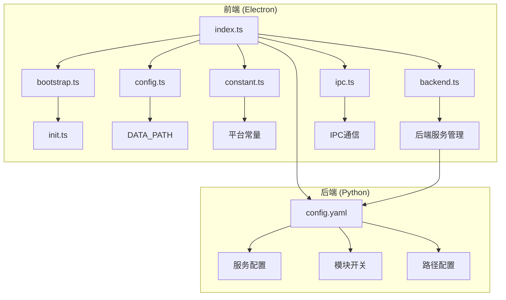
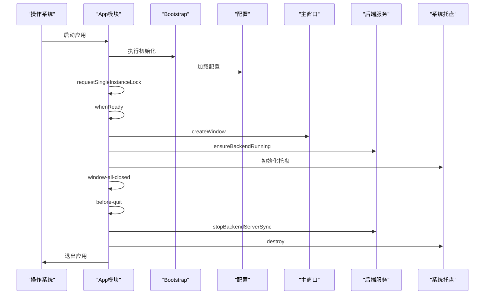
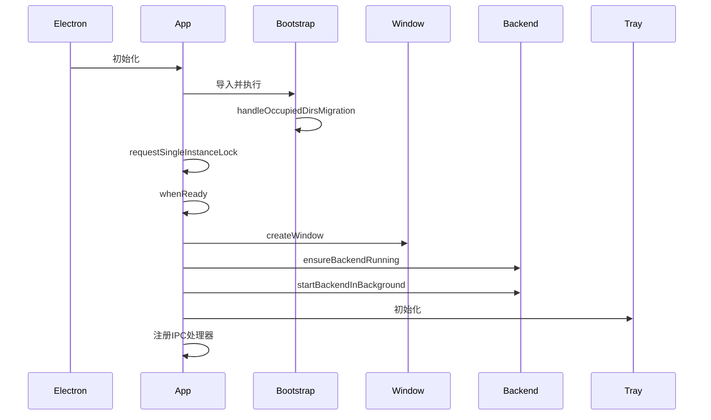
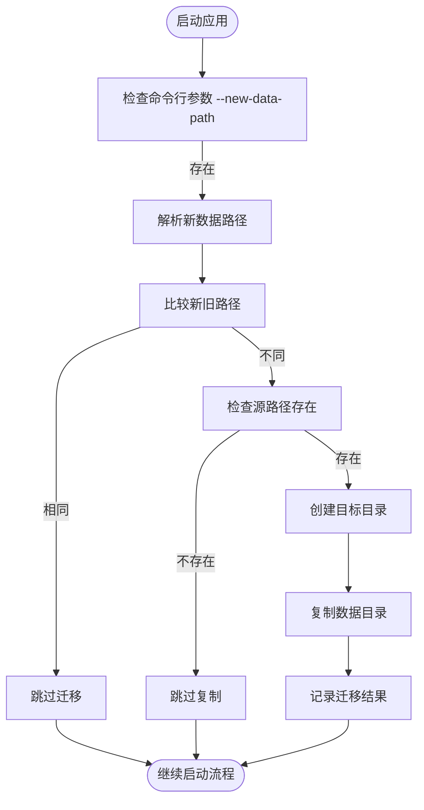
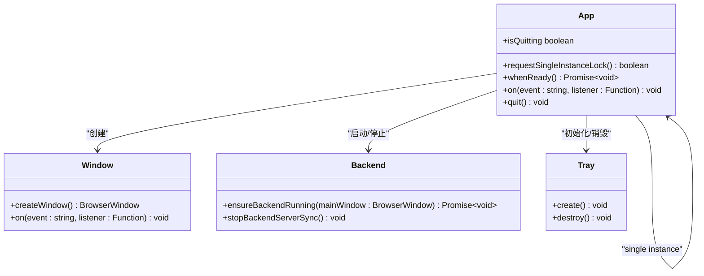
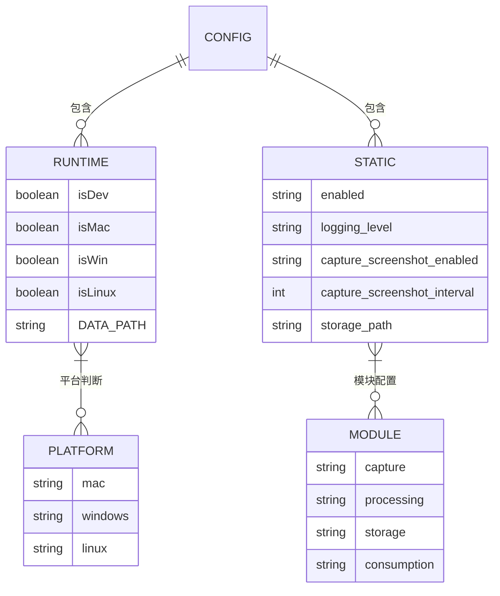
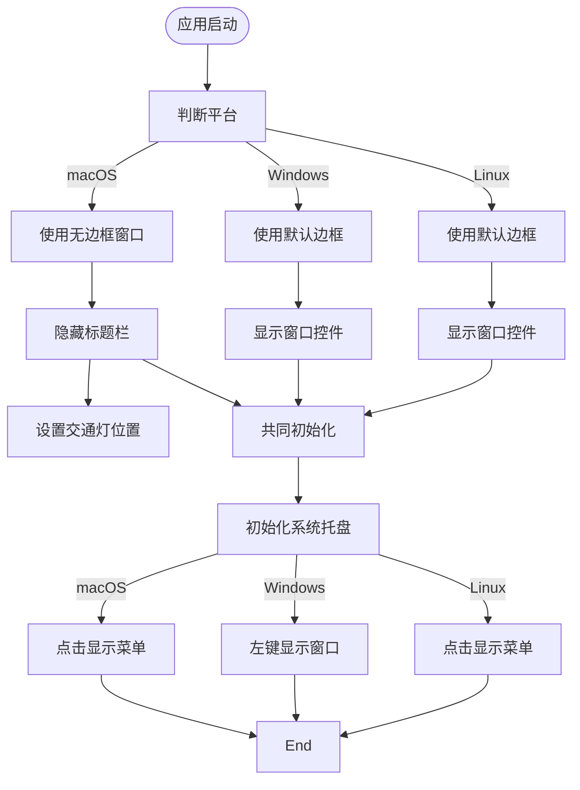
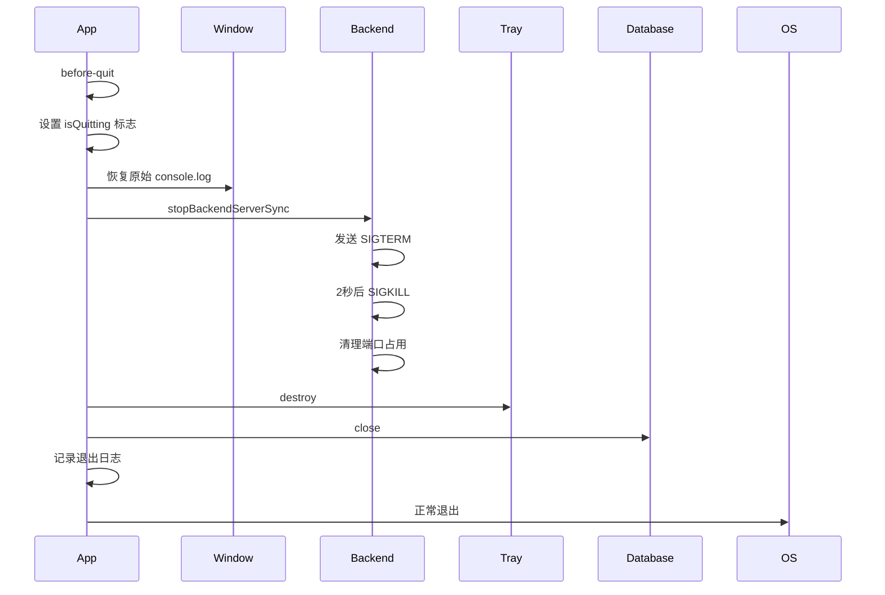
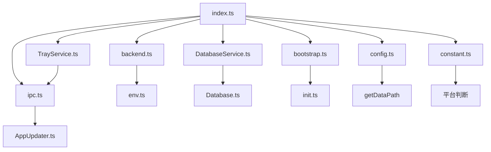

# 应用生命周期管理

<cite>
**本文档引用的文件**   
- [index.ts](file://frontend/src/main/index.ts)
- [bootstrap.ts](file://frontend/src/main/bootstrap.ts)
- [config.ts](file://frontend/src/main/config.ts)
- [constant.ts](file://frontend/src/main/constant.ts)
- [backend.ts](file://frontend/src/main/backend.ts)
- [DatabaseService.ts](file://frontend/src/main/services/DatabaseService.ts)
- [TrayService.ts](file://frontend/src/main/services/TrayService.ts)
- [screen-monitor-task.ts](file://frontend/src/main/background/task/screen-monitor-task.ts)
- [Power.ts](file://frontend/src/main/background/os/Power.ts)
- [ipc.ts](file://frontend/src/main/ipc.ts)
- [config.yaml](file://config/config.yaml)
- [constant.ts](file://frontend/packages/shared/config/constant.ts)
- [init.ts](file://frontend/src/main/utils/init.ts)
- [env.ts](file://frontend/src/main/utils/env.ts)
</cite>

## 目录
1. [简介](#简介)
2. [项目结构](#项目结构)
3. [核心组件](#核心组件)
4. [架构概述](#架构概述)
5. [详细组件分析](#详细组件分析)
6. [依赖分析](#依赖分析)
7. [性能考虑](#性能考虑)
8. [故障排除指南](#故障排除指南)
9. [结论](#结论)
10. [附录](#附录)

## 简介
本文档详细阐述了Electron应用的生命周期管理机制，重点分析主进程的启动、运行和关闭流程。文档深入解析了`index.ts`中`app`模块的事件监听机制如何控制应用的启动和退出行为，描述了`bootstrap.ts`中初始化逻辑的执行顺序，包括配置加载、服务注册和窗口创建。同时，文档说明了`config.ts`和`constant.ts`中定义的常量和配置如何影响应用行为，并提供了代码示例展示应用在不同平台（macOS/Windows）下的生命周期差异处理，以及如何实现优雅关闭和状态持久化。

## 项目结构
本应用采用分层架构设计，主要分为前端（frontend）和后端（opencontext）两个部分。前端使用Electron框架构建桌面应用，后端使用Python实现核心服务。主进程的生命周期管理主要集中在`frontend/src/main`目录下，包含启动、配置、服务初始化等核心逻辑。



**图源**
- [index.ts](file://frontend/src/main/index.ts)
- [bootstrap.ts](file://frontend/src/main/bootstrap.ts)
- [config.ts](file://frontend/src/main/config.ts)
- [constant.ts](file://frontend/src/main/constant.ts)
- [backend.ts](file://frontend/src/main/backend.ts)
- [config.yaml](file://config/config.yaml)

**节源**
- [index.ts](file://frontend/src/main/index.ts)
- [bootstrap.ts](file://frontend/src/main/bootstrap.ts)
- [config.ts](file://frontend/src/main/config.ts)
- [constant.ts](file://frontend/src/main/constant.ts)
- [config.yaml](file://config/config.yaml)

## 核心组件
应用生命周期管理的核心组件包括主进程入口`index.ts`、启动初始化`bootstrap.ts`、配置管理`config.ts`和`constant.ts`、后端服务管理`backend.ts`以及系统托盘服务`TrayService.ts`。这些组件协同工作，确保应用能够正确启动、运行和关闭。

**节源**
- [index.ts](file://frontend/src/main/index.ts)
- [bootstrap.ts](file://frontend/src/main/bootstrap.ts)
- [config.ts](file://frontend/src/main/config.ts)
- [constant.ts](file://frontend/src/main/constant.ts)
- [backend.ts](file://frontend/src/main/backend.ts)
- [TrayService.ts](file://frontend/src/main/services/TrayService.ts)

## 架构概述
应用采用主进程-渲染进程架构，主进程负责管理应用生命周期、创建窗口和与操作系统交互，渲染进程负责UI展示。生命周期管理主要在主进程中完成，通过Electron的`app`模块事件监听机制来控制应用的启动和退出行为。



**图源**
- [index.ts](file://frontend/src/main/index.ts)
- [bootstrap.ts](file://frontend/src/main/bootstrap.ts)
- [config.ts](file://frontend/src/main/config.ts)
- [backend.ts](file://frontend/src/main/backend.ts)
- [TrayService.ts](file://frontend/src/main/services/TrayService.ts)

## 详细组件分析

### 主进程启动流程分析
主进程的启动流程从`index.ts`文件开始，首先导入`bootstrap.ts`进行早期初始化，然后通过`app.whenReady()`事件监听器在Electron初始化完成后创建主窗口并启动各项服务。

#### 启动时序图


**图源**
- [index.ts](file://frontend/src/main/index.ts)
- [bootstrap.ts](file://frontend/src/main/bootstrap.ts)

**节源**
- [index.ts](file://frontend/src/main/index.ts#L1-L348)
- [bootstrap.ts](file://frontend/src/main/bootstrap.ts#L1-L75)

### Bootstrap初始化逻辑
`bootstrap.ts`文件在应用启动早期执行，主要负责数据目录迁移和应用数据目录初始化。该文件的执行顺序非常重要，必须在主窗口创建之前完成。

#### 数据目录迁移流程


**图源**
- [bootstrap.ts](file://frontend/src/main/bootstrap.ts#L25-L74)
- [init.ts](file://frontend/src/main/utils/init.ts#L55-L81)

**节源**
- [bootstrap.ts](file://frontend/src/main/bootstrap.ts#L1-L75)
- [init.ts](file://frontend/src/main/utils/init.ts#L55-L81)

### App模块事件监听机制
`app`模块通过事件监听机制控制应用的启动和退出行为，主要监听`ready`、`window-all-closed`和`before-quit`三个关键事件。

#### 事件监听机制类图


**图源**
- [index.ts](file://frontend/src/main/index.ts#L41-L347)

**节源**
- [index.ts](file://frontend/src/main/index.ts#L41-L347)

### 配置管理分析
配置管理分为运行时常量和静态配置文件两部分。`constant.ts`定义了平台相关的常量，`config.ts`处理数据路径配置，而`config.yaml`则包含后端服务的详细配置。

#### 配置层次结构


**图源**
- [constant.ts](file://frontend/src/main/constant.ts)
- [config.ts](file://frontend/src/main/config.ts)
- [config.yaml](file://config/config.yaml)

**节源**
- [constant.ts](file://frontend/src/main/constant.ts#L1-L11)
- [config.ts](file://frontend/src/main/config.ts#L1-L14)
- [config.yaml](file://config/config.yaml#L1-L253)

### 平台差异处理
应用在不同平台（macOS/Windows）下有不同的生命周期处理方式，主要体现在窗口样式、系统托盘行为和退出机制上。

#### 平台差异处理流程图


**图源**
- [index.ts](file://frontend/src/main/index.ts#L133-L142)
- [TrayService.ts](file://frontend/src/main/services/TrayService.ts#L128-L148)

**节源**
- [index.ts](file://frontend/src/main/index.ts#L133-L142)
- [TrayService.ts](file://frontend/src/main/services/TrayService.ts#L128-L148)

### 优雅关闭与状态持久化
应用通过`before-quit`事件实现优雅关闭，确保在退出前清理所有资源并保存应用状态。同时，通过系统托盘机制实现状态持久化，允许应用在窗口关闭后继续在后台运行。

#### 优雅关闭时序图


**图源**
- [index.ts](file://frontend/src/main/index.ts#L324-L347)
- [backend.ts](file://frontend/src/main/backend.ts#L617-L659)
- [TrayService.ts](file://frontend/src/main/services/TrayService.ts#L279-L284)
- [DatabaseService.ts](file://frontend/src/main/services/DatabaseService.ts#L351-L358)

**节源**
- [index.ts](file://frontend/src/main/index.ts#L324-L347)
- [backend.ts](file://frontend/src/main/backend.ts#L617-L659)
- [TrayService.ts](file://frontend/src/main/services/TrayService.ts#L279-L284)
- [DatabaseService.ts](file://frontend/src/main/services/DatabaseService.ts#L351-L358)

## 依赖分析
应用的生命周期管理组件之间存在明确的依赖关系，`index.ts`依赖`bootstrap.ts`进行早期初始化，`backend.ts`依赖`env.ts`获取环境信息，`TrayService.ts`依赖`ipc.ts`进行进程间通信。



**图源**
- [index.ts](file://frontend/src/main/index.ts)
- [bootstrap.ts](file://frontend/src/main/bootstrap.ts)
- [config.ts](file://frontend/src/main/config.ts)
- [constant.ts](file://frontend/src/main/constant.ts)
- [backend.ts](file://frontend/src/main/backend.ts)
- [ipc.ts](file://frontend/src/main/ipc.ts)
- [TrayService.ts](file://frontend/src/main/services/TrayService.ts)
- [DatabaseService.ts](file://frontend/src/main/services/DatabaseService.ts)
- [env.ts](file://frontend/src/main/utils/env.ts)
- [init.ts](file://frontend/src/main/utils/init.ts)

**节源**
- [index.ts](file://frontend/src/main/index.ts)
- [bootstrap.ts](file://frontend/src/main/bootstrap.ts)
- [config.ts](file://frontend/src/main/config.ts)
- [constant.ts](file://frontend/src/main/constant.ts)
- [backend.ts](file://frontend/src/main/backend.ts)
- [ipc.ts](file://frontend/src/main/ipc.ts)
- [TrayService.ts](file://frontend/src/main/services/TrayService.ts)
- [DatabaseService.ts](file://frontend/src/main/services/DatabaseService.ts)
- [env.ts](file://frontend/src/main/utils/env.ts)
- [init.ts](file://frontend/src/main/utils/init.ts)

## 性能考虑
应用在生命周期管理中考虑了多项性能优化措施，包括单实例锁定、资源延迟加载、后台服务按需启动和内存泄漏预防。

### 性能优化策略
- **单实例锁定**：通过`app.requestSingleInstanceLock()`确保应用只有一个实例运行，避免资源浪费
- **延迟初始化**：数据库连接在首次使用时才初始化，减少启动时间
- **后台服务管理**：后端服务在需要时才启动，避免不必要的资源占用
- **内存泄漏预防**：在`before-quit`事件中清理所有定时器和事件监听器
- **日志管理**：定期清理旧的截图文件，防止磁盘空间耗尽

**节源**
- [index.ts](file://frontend/src/main/index.ts#L41-L45)
- [DatabaseService.ts](file://frontend/src/main/services/DatabaseService.ts#L36-L47)
- [backend.ts](file://frontend/src/main/backend.ts#L585-L594)
- [index.ts](file://frontend/src/main/index.ts#L76-L92)

## 故障排除指南
### 常见问题及解决方案
1. **应用无法启动**
   - 检查是否已有实例在运行
   - 检查数据目录权限
   - 查看日志文件中的错误信息

2. **后端服务启动失败**
   - 检查端口是否被占用
   - 检查后端可执行文件是否存在
   - 查看backend日志文件

3. **截图功能无法使用**
   - 检查屏幕录制权限
   - 检查存储路径权限
   - 检查配置文件中的截图间隔设置

4. **应用无法正常退出**
   - 检查是否有未处理的Promise
   - 检查后台服务是否已正确停止
   - 检查数据库连接是否已关闭

**节源**
- [index.ts](file://frontend/src/main/index.ts#L41-L45)
- [backend.ts](file://frontend/src/main/backend.ts#L596-L613)
- [TrayService.ts](file://frontend/src/main/services/TrayService.ts#L215-L226)
- [index.ts](file://frontend/src/main/index.ts#L324-L347)

## 结论
本文档详细分析了Electron应用的生命周期管理机制，涵盖了从启动到关闭的完整流程。通过`app`模块的事件监听机制，应用能够精确控制启动和退出行为。`bootstrap.ts`中的初始化逻辑确保了应用在不同环境下的正确配置。`config.ts`和`constant.ts`中的常量和配置为应用提供了灵活的行为控制。平台差异处理确保了应用在macOS和Windows上都能提供良好的用户体验。优雅关闭和状态持久化机制保证了应用资源的正确清理和用户状态的持续可用。这些设计共同构成了一个健壮、可靠的应用生命周期管理体系。

## 附录
### 配置文件示例
```yaml
# config.yaml - 后端服务配置
enabled: true
logging:
  level: DEBUG
  log_path: "${CONTEXT_PATH:.}/logs/opencontext.log"

capture:
  screenshot:
    enabled: false
    capture_interval: 5
    storage_path: "${CONTEXT_PATH:.}/screenshots"
```

### 环境变量说明
- `NODE_ENV`: 运行环境 (development/production)
- `PORTABLE_EXECUTABLE_DIR`: 便携版可执行文件目录
- `CONTEXT_PATH`: 应用上下文路径
- `LLM_BASE_URL`: 大语言模型基础URL
- `LLM_API_KEY`: 大语言模型API密钥