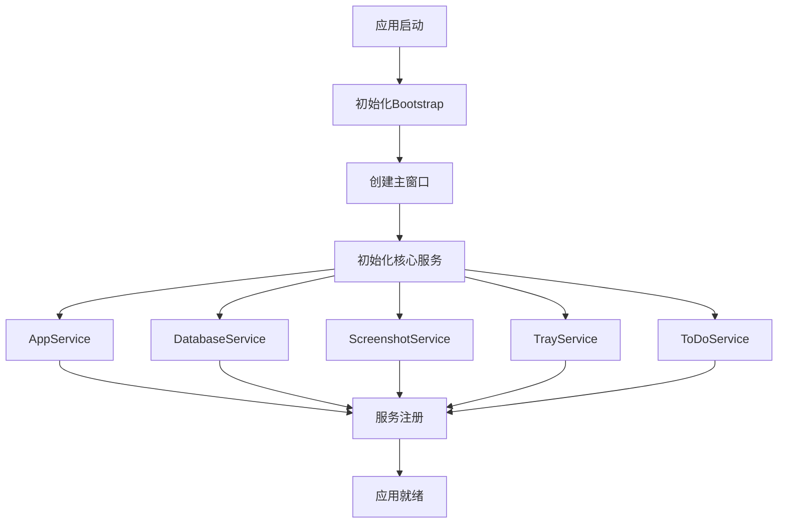
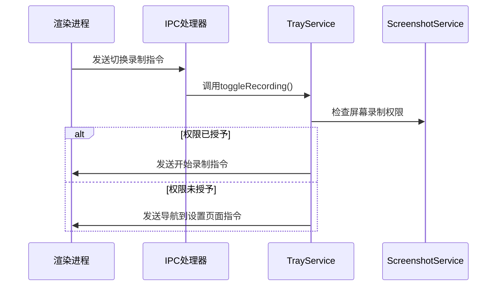
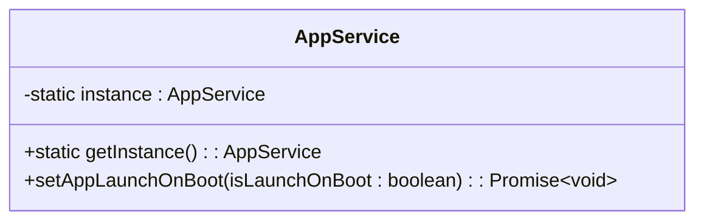
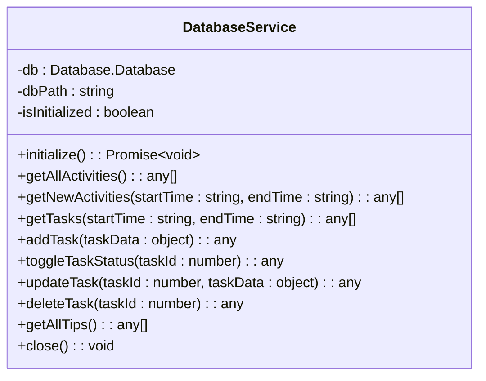
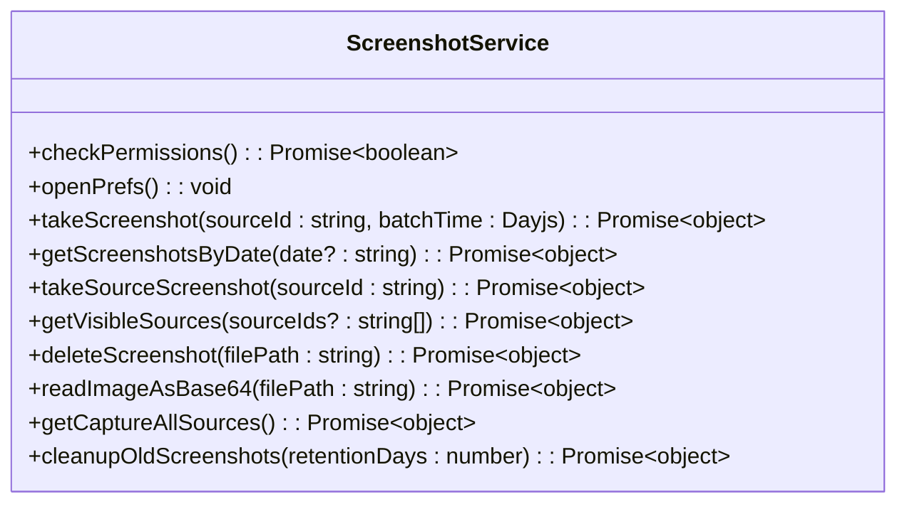
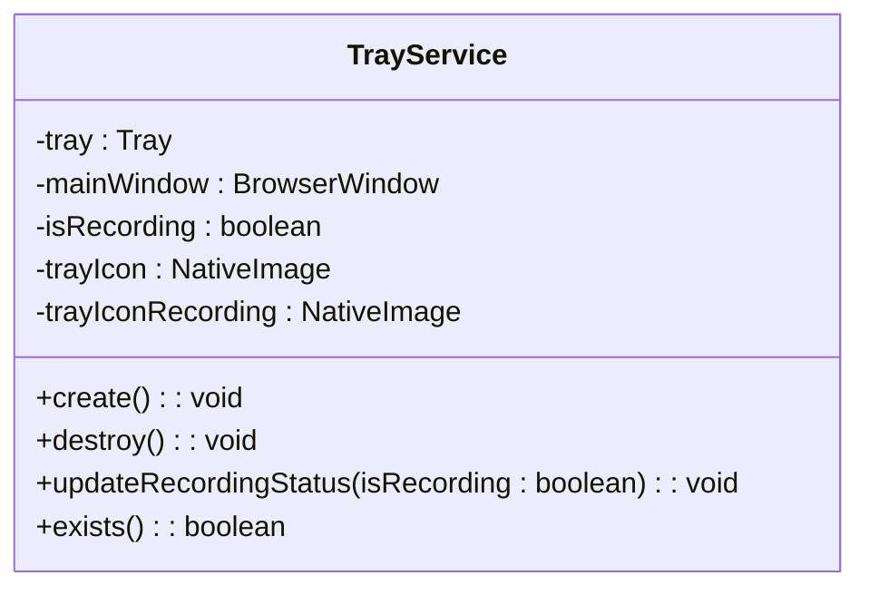
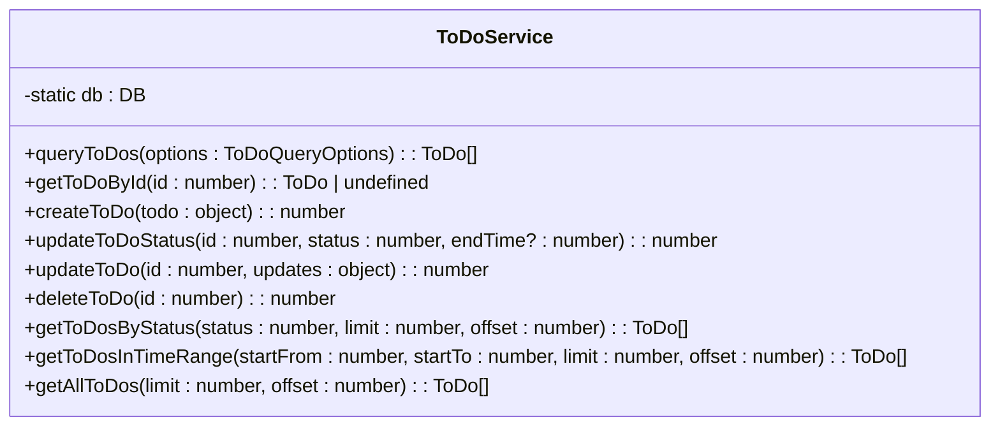
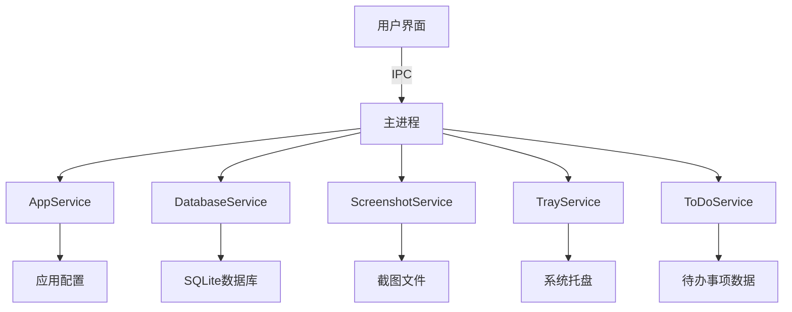
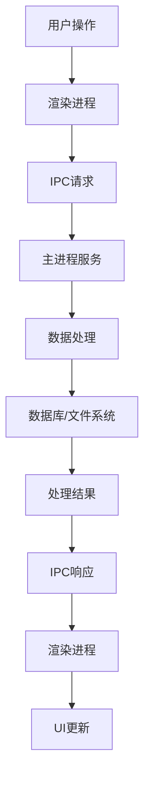

# 核心服务管理

<cite>
**本文档引用的文件**
- [AppService.ts](file://frontend/src/main/services/AppService.ts)
- [DatabaseService.ts](file://frontend/src/main/services/DatabaseService.ts)
- [Database.ts](file://frontend/src/main/services/Database.ts)
- [ScreenshotService.ts](file://frontend/src/main/services/ScreenshotService.ts)
- [TrayService.ts](file://frontend/src/main/services/TrayService.ts)
- [ToDoService.ts](file://frontend/src/main/services/ToDoService.ts)
- [ipc.ts](file://frontend/src/main/ipc.ts)
- [index.ts](file://frontend/src/main/index.ts)
</cite>

## 目录
1. [简介](#简介)
2. [核心服务职责](#核心服务职责)
3. [服务初始化与依赖管理](#服务初始化与依赖管理)
4. [服务协作与调用关系](#服务协作与调用关系)
5. [服务类详细分析](#服务类详细分析)
6. [系统架构与数据流](#系统架构与数据流)
7. [最佳实践与注意事项](#最佳实践与注意事项)

## 简介
本文档系统性地介绍了Electron应用主进程中各个核心服务类的职责与协作机制。文档详细阐述了`AppService`如何管理应用全局状态和配置，`DatabaseService`如何封装SQLite数据库操作，`ScreenshotService`如何协调屏幕捕获任务，`TrayService`如何实现系统托盘图标和菜单，以及`ToDoService`如何管理待办事项的同步。同时，文档说明了这些服务如何通过单例模式在主进程中被初始化和使用，并通过代码示例展示了服务间的调用关系。

## 核心服务职责
主进程中的核心服务类各自承担着特定的职责，共同构成了应用的功能基础。

### AppService
`AppService`负责管理应用的全局状态和配置，主要功能包括：
- 管理应用的开机自启动设置
- 提供跨平台的自启动配置（Windows、macOS、Linux）
- 作为单例模式实现，确保全局状态的一致性

### DatabaseService
`DatabaseService`封装了SQLite数据库的所有操作，其主要职责包括：
- 管理数据库连接的生命周期
- 封装常见的数据库操作（查询、插入、更新、删除）
- 处理数据库表结构的初始化和维护
- 提供数据访问的抽象层，简化上层业务逻辑

### ScreenshotService
`ScreenshotService`协调所有的屏幕捕获任务，具体功能包括：
- 检查和请求屏幕录制权限
- 执行屏幕截图操作
- 管理截图文件的存储和清理
- 获取可见窗口和屏幕源信息
- 清理过期的截图文件

### TrayService
`TrayService`实现了系统托盘图标和菜单的功能，主要职责有：
- 创建和管理系统托盘图标
- 根据应用状态动态更新托盘图标
- 实现托盘菜单的交互逻辑
- 处理托盘图标的点击事件
- 跨平台支持（Windows、macOS、Linux）

### ToDoService
`ToDoService`管理待办事项的创建、查询、更新和删除，其功能包括：
- 提供待办事项的CRUD操作
- 支持按状态、时间范围等条件查询
- 管理待办事项的同步和状态更新
- 提供灵活的查询接口

**Section sources**
- [AppService.ts](file://frontend/src/main/services/AppService.ts#L1-L87)
- [DatabaseService.ts](file://frontend/src/main/services/DatabaseService.ts#L1-L364)
- [ScreenshotService.ts](file://frontend/src/main/services/ScreenshotService.ts#L1-L370)
- [TrayService.ts](file://frontend/src/main/services/TrayService.ts#L1-L296)
- [ToDoService.ts](file://frontend/src/main/services/ToDoService.ts#L1-L259)

## 服务初始化与依赖管理
应用中的服务主要通过单例模式进行管理，确保在整个应用生命周期中只有一个实例存在。

### 单例模式实现
所有核心服务都采用了单例模式，通过静态方法`getInstance()`或默认导出单例实例来获取服务对象。这种设计确保了服务状态的全局一致性，避免了多个实例导致的状态冲突。

### 依赖注入机制
服务之间的依赖关系主要通过直接导入和实例化来实现。例如，`TrayService`在初始化时需要传入主窗口实例，以便能够控制窗口的显示和隐藏。这种依赖关系在服务创建时通过构造函数参数传递。

### 服务生命周期管理
服务的生命周期与应用的生命周期紧密相关。在应用启动时，所有核心服务都会被初始化；在应用退出时，相关的清理工作（如数据库连接关闭、定时任务停止）会被执行。

**Diagram sources**
- [index.ts](file://frontend/src/main/index.ts#L1-L348)
- [bootstrap.ts](file://frontend/src/main/bootstrap.ts#L1-L75)

## 服务协作与调用关系
核心服务之间通过明确的接口和事件机制进行协作，形成了一个松耦合的系统架构。

### 服务间调用示例
以下是一个典型的服务间调用场景：当用户通过托盘菜单切换录制状态时，`TrayService`会通知`ScreenshotService`检查权限，并通过IPC通道向渲染进程发送切换录制的指令。

### IPC通信机制
主进程和渲染进程之间通过IPC（进程间通信）进行交互。`ipc.ts`文件中定义了所有IPC处理器，将渲染进程的请求转发给相应的服务处理。例如，当渲染进程请求获取截图时，IPC处理器会调用`ScreenshotService`的相关方法。

**Diagram sources**
- [ipc.ts](file://frontend/src/main/ipc.ts#L1-L610)
- [TrayService.ts](file://frontend/src/main/services/TrayService.ts#L1-L296)
- [ScreenshotService.ts](file://frontend/src/main/services/ScreenshotService.ts#L1-L370)

## 服务类详细分析

### AppService分析
`AppService`作为应用配置管理的核心，实现了跨平台的开机自启动功能。在Windows和macOS上，它使用Electron的`app.setLoginItemSettings`方法；在Linux上，则通过创建.desktop文件来实现自启动配置。

**Diagram sources**
- [AppService.ts](file://frontend/src/main/services/AppService.ts#L1-L87)

### DatabaseService分析
`DatabaseService`基于`better-sqlite3`库构建，提供了异步初始化、连接池管理和SQL执行的封装。它通过继承`VaultDatabaseService`来扩展功能，并实现了数据库连接的延迟初始化和自动重试机制。

**Diagram sources**
- [DatabaseService.ts](file://frontend/src/main/services/DatabaseService.ts#L1-L364)
- [Database.ts](file://frontend/src/main/services/Database.ts#L1-L192)

### ScreenshotService分析
`ScreenshotService`负责所有与屏幕截图相关的操作。它继承自`CaptureSourcesTools`，扩展了屏幕捕获功能。服务提供了完整的截图生命周期管理，包括权限检查、截图执行、文件存储和过期清理。

**Diagram sources**
- [ScreenshotService.ts](file://frontend/src/main/services/ScreenshotService.ts#L1-L370)

### TrayService分析
`TrayService`实现了跨平台的系统托盘功能。它根据不同的操作系统加载相应的图标资源，并提供了一致的API接口。服务通过监听用户交互来更新应用状态，并相应地更新托盘图标和菜单。

**Diagram sources**
- [TrayService.ts](file://frontend/src/main/services/TrayService.ts#L1-L296)

### ToDoService分析
`ToDoService`提供了待办事项的完整管理功能。它通过静态方法提供服务接口，内部使用`DB`单例进行数据持久化。服务支持复杂的查询条件组合，包括状态、时间范围和优先级等。

**Diagram sources**
- [ToDoService.ts](file://frontend/src/main/services/ToDoService.ts#L1-L259)

## 系统架构与数据流
应用采用分层架构设计，将UI层、服务层和数据层清晰地分离。

### 架构概览
系统由渲染进程和主进程组成，通过IPC进行通信。主进程负责管理核心服务和系统资源，渲染进程负责用户界面展示和交互。

**Diagram sources**
- [index.ts](file://frontend/src/main/index.ts#L1-L348)
- [ipc.ts](file://frontend/src/main/ipc.ts#L1-L610)

### 数据流分析
数据在系统中的流动遵循明确的路径。用户操作首先在渲染进程被捕获，通过IPC发送到主进程，由相应的服务处理，然后将结果返回给渲染进程进行展示。

**Diagram sources**
- [ipc.ts](file://frontend/src/main/ipc.ts#L1-L610)

## 最佳实践与注意事项
在使用这些核心服务时，需要注意以下最佳实践：

1. **服务初始化时机**：确保在使用服务前完成必要的初始化，特别是`DatabaseService`需要异步初始化。
2. **错误处理**：所有服务方法都可能抛出异常，需要适当的错误处理机制。
3. **资源管理**：注意及时释放不再需要的资源，如数据库连接、文件句柄等。
4. **跨平台兼容性**：在实现功能时考虑不同操作系统的差异，提供相应的适配。
5. **性能优化**：对于频繁执行的操作，考虑使用缓存或批量处理来提高性能。

**Section sources**
- [index.ts](file://frontend/src/main/index.ts#L1-L348)
- [ipc.ts](file://frontend/src/main/ipc.ts#L1-L610)
- [bootstrap.ts](file://frontend/src/main/bootstrap.ts#L1-L75)