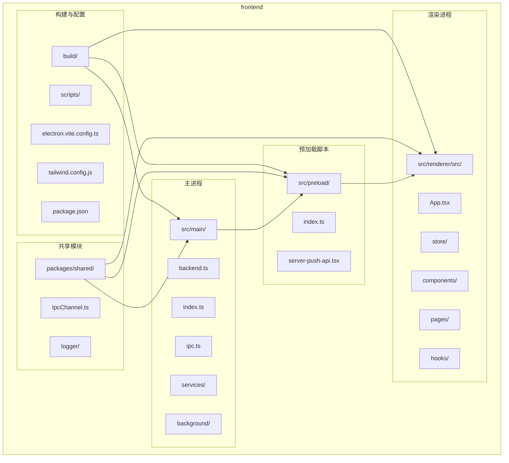
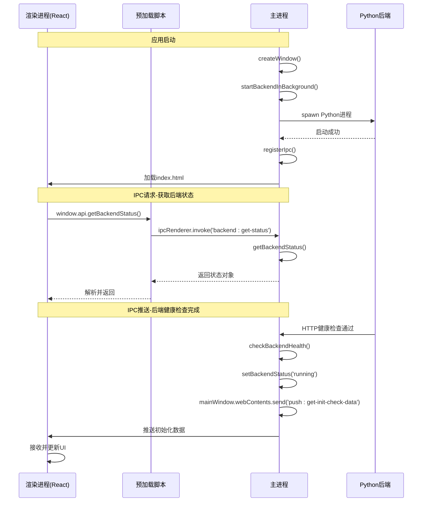
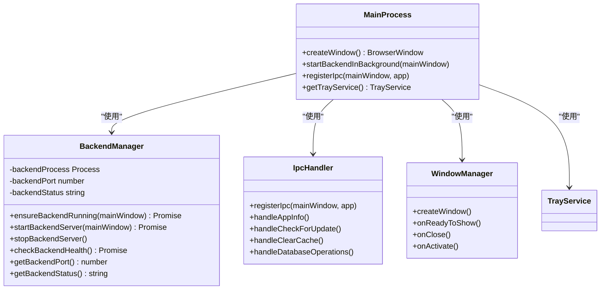
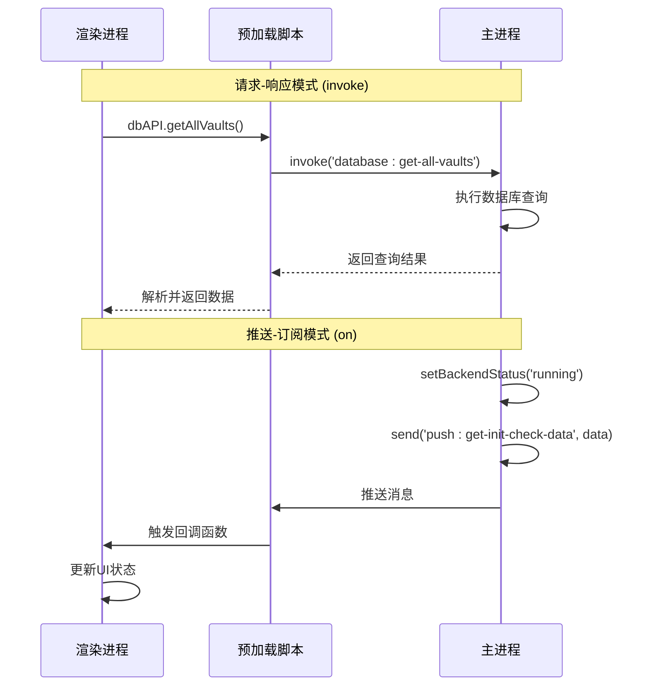
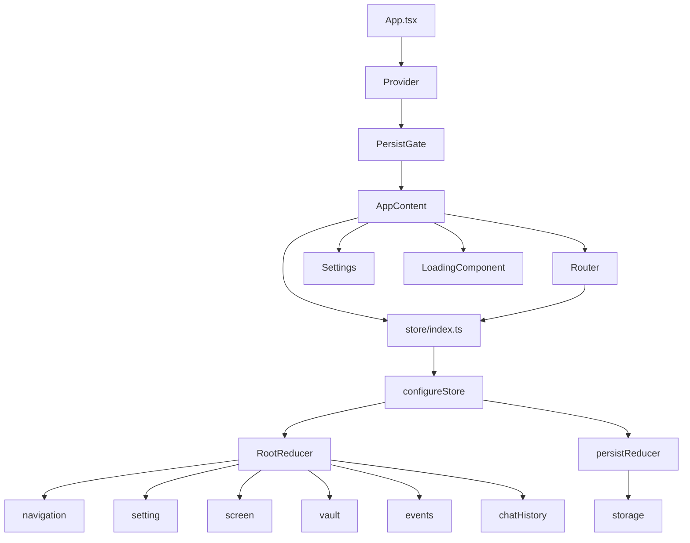
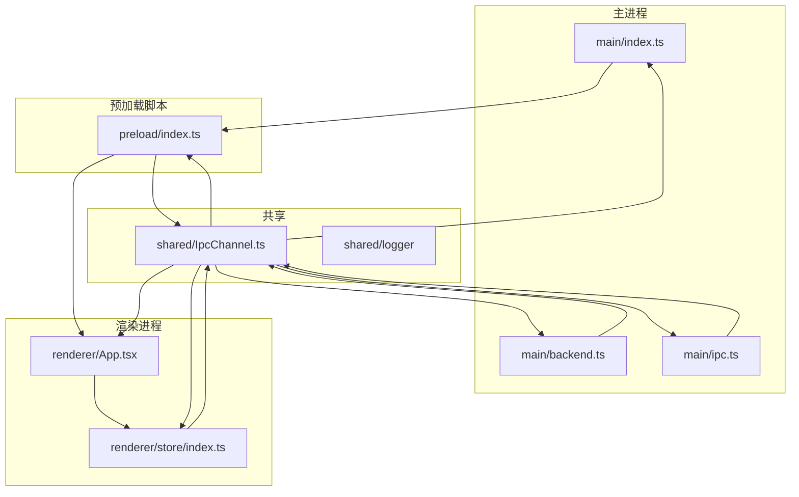

# 前端架构

<cite>
**本文档引用的文件**   
- [backend.ts](file://frontend/src/main/backend.ts)
- [IpcChannel.ts](file://frontend/packages/shared/IpcChannel.ts)
- [index.ts](file://frontend/src/main/index.ts)
- [ipc.ts](file://frontend/src/main/ipc.ts)
- [index.ts](file://frontend/src/preload/index.ts)
- [server-push-api.tsx](file://frontend/src/preload/server-push-api.tsx)
- [App.tsx](file://frontend/src/renderer/src/App.tsx)
- [electron.vite.config.ts](file://frontend/electron.vite.config.ts)
- [tailwind.config.js](file://frontend/tailwind.config.js)
</cite>

## 目录
1. [简介](#简介)
2. [项目结构](#项目结构)
3. [核心组件](#核心组件)
4. [架构概述](#架构概述)
5. [详细组件分析](#详细组件分析)
6. [依赖分析](#依赖分析)
7. [性能考虑](#性能考虑)
8. [故障排除指南](#故障排除指南)
9. [结论](#结论)
10. [附录](#附录)（如有必要）

## 简介
本文档深入解析基于Electron的桌面应用前端架构，重点阐述其三层分离架构设计。该架构将应用划分为主进程（main）、预加载脚本（preload）和渲染进程（renderer），实现了关注点分离和安全边界。主进程负责管理应用生命周期、窗口和与Python后端服务的通信；预加载脚本作为安全桥梁，通过IPC（进程间通信）机制在Node.js API与渲染进程之间进行受控交互；渲染进程则使用React构建现代化的用户界面，并利用Jotai和Redux进行状态管理。文档将详细说明IPC通信通道、后端服务启动流程以及Vite、Tailwind CSS等关键技术选型的优势。

## 项目结构
该项目遵循清晰的分层架构，主要分为`config`、`frontend`、`opencontext`等顶层目录。前端核心位于`frontend`目录，其内部结构体现了模块化和关注点分离的设计原则。

**图源**
- [electron.vite.config.ts](file://frontend/electron.vite.config.ts)
- [IpcChannel.ts](file://frontend/packages/shared/IpcChannel.ts)
- [index.ts](file://frontend/src/main/index.ts)
- [index.ts](file://frontend/src/preload/index.ts)
- [App.tsx](file://frontend/src/renderer/src/App.tsx)

**本节来源**
- [frontend](file://frontend)

## 核心组件
本应用的核心组件围绕Electron的三层架构展开。主进程（`src/main/`）是应用的控制中心，负责创建和管理窗口、处理系统事件、启动和监控Python后端服务，并通过IPC处理来自渲染进程的请求。预加载脚本（`src/preload/`）是安全的关键，它利用`contextBridge` API将受控的Node.js功能暴露给渲染进程，防止直接访问危险的API。渲染进程（`src/renderer/`）是用户交互的前端，使用React构建UI，通过Redux Toolkit管理全局状态，并利用Jotai处理局部状态。`IpcChannel.ts`定义了所有IPC通信的通道名称，确保了主进程和渲染进程之间通信的类型安全和一致性。

**本节来源**
- [backend.ts](file://frontend/src/main/backend.ts)
- [index.ts](file://frontend/src/main/index.ts)
- [index.ts](file://frontend/src/preload/index.ts)
- [App.tsx](file://frontend/src/renderer/src/App.tsx)
- [IpcChannel.ts](file://frontend/packages/shared/IpcChannel.ts)

## 架构概述
该应用采用经典的Electron三层分离架构，实现了高内聚、低耦合的设计。主进程运行在Node.js环境中，拥有完整的系统权限，负责与操作系统和后端服务交互。渲染进程运行在Chromium中，专注于UI渲染和用户交互，通过`contextBridge`与预加载脚本通信。预加载脚本作为中间层，执行`ipcRenderer.invoke`和`ipcRenderer.on`等操作，将渲染进程的请求转发给主进程，并将主进程的响应或推送消息返回给渲染进程。这种设计确保了渲染进程的沙箱安全，同时提供了必要的原生功能。

**图源**
- [backend.ts](file://frontend/src/main/backend.ts)
- [index.ts](file://frontend/src/main/index.ts)
- [ipc.ts](file://frontend/src/main/ipc.ts)
- [index.ts](file://frontend/src/preload/index.ts)
- [server-push-api.tsx](file://frontend/src/preload/server-push-api.tsx)
- [App.tsx](file://frontend/src/renderer/src/App.tsx)

## 详细组件分析
本节将深入分析应用中的关键组件，包括其职责、交互方式和实现细节。

### 主进程分析
主进程是整个应用的“大脑”，负责协调所有原生操作和后台服务。

#### 主进程核心功能
主进程的核心功能包括窗口管理、应用生命周期处理、IPC通信注册和后端服务管理。`index.ts`文件是主进程的入口点，它首先执行`bootstrap`进行数据目录初始化，然后通过`app.whenReady()`钩子创建主窗口并启动后台任务。`ipc.ts`文件通过`registerIpc`函数注册了所有IPC处理程序，将渲染进程的请求映射到具体的服务方法。

**图源**
- [index.ts](file://frontend/src/main/index.ts)
- [backend.ts](file://frontend/src/main/backend.ts)
- [ipc.ts](file://frontend/src/main/ipc.ts)

**本节来源**
- [index.ts](file://frontend/src/main/index.ts)
- [backend.ts](file://frontend/src/main/backend.ts)
- [ipc.ts](file://frontend/src/main/ipc.ts)

### 预加载脚本分析
预加载脚本是连接安全沙箱（渲染进程）和特权环境（主进程）的桥梁。

#### IPC通信模式
预加载脚本通过`contextBridge.exposeInMainWorld`将API暴露给渲染进程。它定义了多个API对象，如`api`、`dbAPI`、`screenMonitorAPI`等，每个对象都封装了对特定IPC通道的调用。例如，`dbAPI.getAllVaults()`会调用`ipcRenderer.invoke(IpcChannel.Database_GetAllVaults)`，这是一个请求-响应模式的同步调用。对于需要持续监听的事件，如后端状态变化，则使用`serverPushAPI`，它通过`ipcRenderer.on`订阅主进程的推送消息。

**图源**
- [index.ts](file://frontend/src/preload/index.ts)
- [server-push-api.tsx](file://frontend/src/preload/server-push-api.tsx)
- [backend.ts](file://frontend/src/main/backend.ts)
- [App.tsx](file://frontend/src/renderer/src/App.tsx)

**本节来源**
- [index.ts](file://frontend/src/preload/index.ts)
- [server-push-api.tsx](file://frontend/src/preload/server-push-api.tsx)

### 渲染进程分析
渲染进程负责构建用户界面和处理用户交互。

#### React组件与状态管理
渲染进程使用React作为UI框架，结合Redux Toolkit进行全局状态管理。`App.tsx`是应用的根组件，它通过`Provider`将Redux store注入到整个组件树中。`store/index.ts`配置了`persistReducer`，利用`redux-persist`将部分状态（如设置、导航）持久化到本地存储。对于局部状态或复杂状态逻辑，应用也采用了Jotai，它提供了一种原子化的状态管理方式，比Redux更轻量。

**图源**
- [App.tsx](file://frontend/src/renderer/src/App.tsx)
- [index.ts](file://frontend/src/renderer/src/store/index.ts)

**本节来源**
- [App.tsx](file://frontend/src/renderer/src/App.tsx)
- [index.ts](file://frontend/src/renderer/src/store/index.ts)

## 依赖分析
该应用的依赖关系清晰地反映了其分层架构。主进程依赖于Electron的核心模块（如`BrowserWindow`、`ipcMain`）以及`packages/shared`中的共享类型和常量。预加载脚本依赖于`electron`的`contextBridge`和`ipcRenderer`，以及共享的`IpcChannel`枚举。渲染进程的依赖最为丰富，包括React、Redux、Tailwind CSS以及`@arco-design/web-react`等UI库。构建工具方面，`electron-vite`用于开发和构建，`tailwindcss`用于样式生成，`@reduxjs/toolkit`用于状态管理。

**图源**
- [index.ts](file://frontend/src/main/index.ts)
- [backend.ts](file://frontend/src/main/backend.ts)
- [ipc.ts](file://frontend/src/main/ipc.ts)
- [index.ts](file://frontend/src/preload/index.ts)
- [App.tsx](file://frontend/src/renderer/src/App.tsx)
- [index.ts](file://frontend/src/renderer/src/store/index.ts)
- [IpcChannel.ts](file://frontend/packages/shared/IpcChannel.ts)

**本节来源**
- [index.ts](file://frontend/src/main/index.ts)
- [backend.ts](file://frontend/src/main/backend.ts)
- [ipc.ts](file://frontend/src/main/ipc.ts)
- [index.ts](file://frontend/src/preload/index.ts)
- [App.tsx](file://frontend/src/renderer/src/App.tsx)
- [index.ts](file://frontend/src/renderer/src/store/index.ts)
- [IpcChannel.ts](file://frontend/packages/shared/IpcChannel.ts)

## 性能考虑
该应用在性能方面进行了多项优化。首先，使用Vite作为构建工具，提供了闪电般的开发服务器启动速度和即时的模块热更新（HMR），极大地提升了开发效率。其次，在渲染进程的状态管理中，`redux-persist`的`blacklist`配置避免了将大型数据集（如`vault`）持久化，减少了I/O开销。此外，主进程通过`startScreenshotCleanup`定时任务，每日清理过期的截图文件，有效管理了磁盘空间。性能监控方面，`@shared/logger/performance`模块被集成，可以记录和分析关键性能指标。

## 故障排除指南
当应用出现问题时，可以从以下几个方面进行排查：
1.  **后端服务未启动**：检查`debug`目录下的`backend-*.log`日志文件，查看Python后端启动失败的原因，常见问题包括端口被占用或依赖缺失。
2.  **IPC通信失败**：确认`IpcChannel.ts`中定义的通道名称在主进程和渲染进程两端完全一致。检查主进程的`ipc.ts`中是否正确注册了`ipcMain.handle`。
3.  **渲染进程白屏**：检查开发工具控制台是否有JavaScript错误。确认`electron.vite.config.ts`中的路径别名配置是否正确。
4.  **应用无法退出**：检查`before-quit`事件处理程序，确保`stopBackendServerSync`等清理函数被正确调用。

**本节来源**
- [backend.ts](file://frontend/src/main/backend.ts)
- [ipc.ts](file://frontend/src/main/ipc.ts)
- [electron.vite.config.ts](file://frontend/electron.vite.config.ts)
- [index.ts](file://frontend/src/main/index.ts)

## 结论
本文档详细解析了该Electron应用的前端架构。其三层分离架构设计合理，有效地隔离了安全边界，同时通过精心设计的IPC通道实现了高效的跨进程通信。主进程稳健地管理着应用生命周期和后端服务，预加载脚本安全地桥接了Node.js能力，而渲染进程则利用React和现代状态管理库提供了流畅的用户体验。技术选型如Vite、Tailwind CSS和Jotai的组合，为应用的开发效率和运行性能提供了有力保障。整体架构清晰、可维护性强，为应用的持续迭代奠定了坚实的基础。