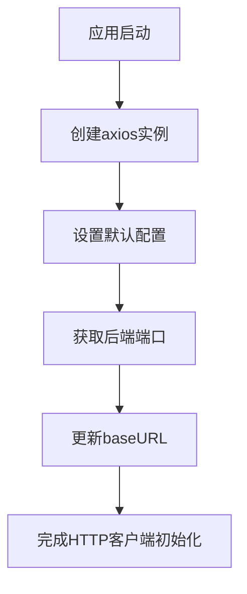
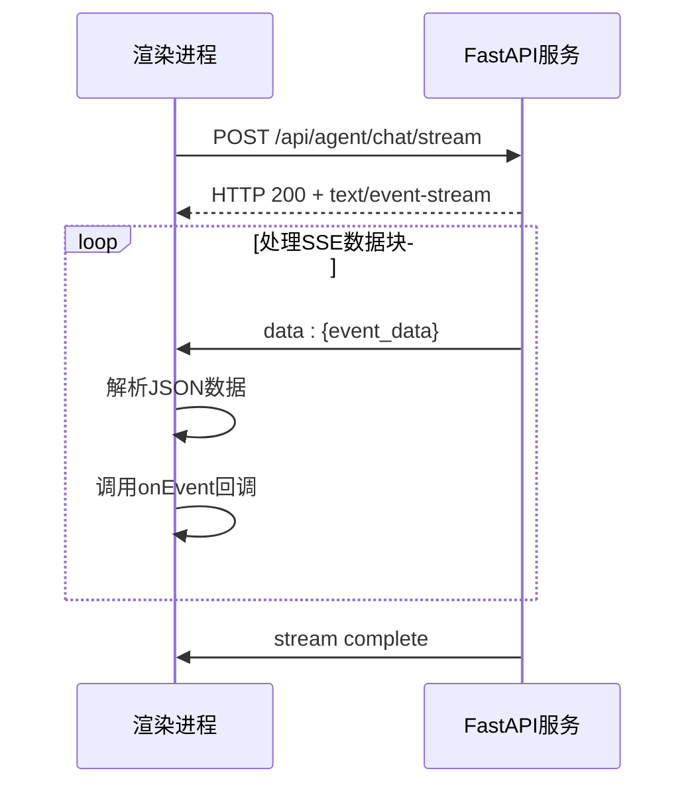
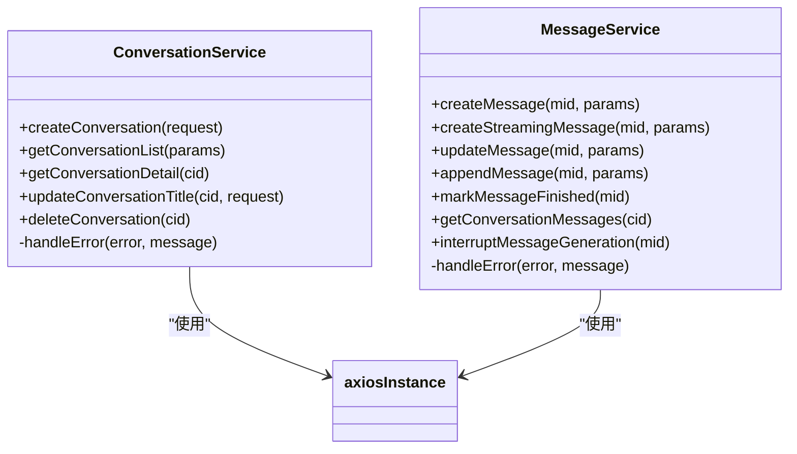
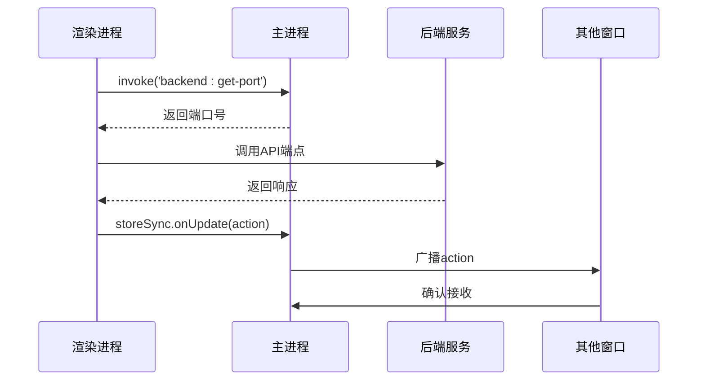
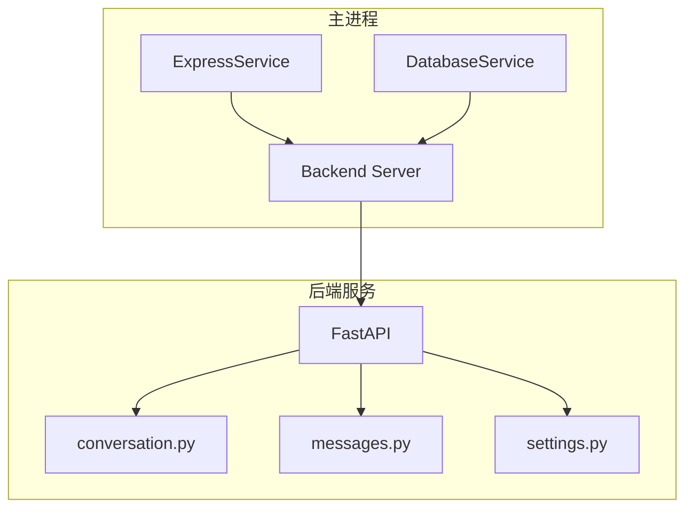

# API服务

<cite>
**本文档引用的文件**   
- [axiosConfig.ts](file://frontend/src/renderer/src/services/axiosConfig.ts)
- [ChatStreamService.ts](file://frontend/src/renderer/src/services/ChatStreamService.ts)
- [conversation-service.ts](file://frontend/src/renderer/src/services/conversation-service.ts)
- [messages-service.ts](file://frontend/src/renderer/src/services/messages-service.ts)
- [Settings.ts](file://frontend/src/renderer/src/services/Settings.ts)
- [StoreSyncService.ts](file://frontend/src/renderer/src/services/StoreSyncService.ts)
- [ExpressService.ts](file://frontend/src/main/services/ExpressService.ts)
- [DatabaseService.ts](file://frontend/src/main/services/DatabaseService.ts)
- [conversation.py](file://opencontext/server/routes/conversation.py)
- [messages.py](file://opencontext/server/routes/messages.py)
- [settings.py](file://opencontext/server/routes/settings.py)
- [IpcChannel.ts](file://frontend/packages/shared/IpcChannel.ts)
- [backend.ts](file://frontend/src/main/backend.ts)
</cite>

## 目录
1. [引言](#引言)
2. [HTTP客户端配置](#http客户端配置)
3. [流式通信实现](#流式通信实现)
4. [会话与消息服务](#会话与消息服务)
5. [配置同步与数据持久化](#配置同步与数据持久化)
6. [主进程服务端点](#主进程服务端点)
7. [通信机制总结](#通信机制总结)

## 引言

本项目采用Electron架构，实现了渲染进程、主进程和后端FastAPI服务之间的复杂通信机制。系统通过axios作为HTTP客户端与后端服务交互，同时利用Electron的IPC机制在渲染进程和主进程之间传递数据。`axiosConfig.ts`文件配置了HTTP客户端的基本参数，`ChatStreamService`实现了与后端的SSE流式通信，而`conversation-service`和`messages-service`则封装了RESTful API调用。`Settings`和`StoreSyncService`通过IPC与主进程通信，实现配置同步和数据持久化。主进程通过`ExpressService`和`DatabaseService`暴露服务端点。

**Section sources**
- [axiosConfig.ts](file://frontend/src/renderer/src/services/axiosConfig.ts#L1-L63)
- [ChatStreamService.ts](file://frontend/src/renderer/src/services/ChatStreamService.ts#L1-L192)
- [conversation-service.ts](file://frontend/src/renderer/src/services/conversation-service.ts#L1-L164)

## HTTP客户端配置

`axiosConfig.ts`文件创建并配置了全局的axios实例，用于与后端服务进行HTTP通信。该配置包括基础URL、超时设置和请求/响应拦截器。基础URL默认指向`http://127.0.0.1:1733`，但会通过IPC调用动态更新为实际的后端端口。超时时间设置为60秒，确保长时间请求不会被过早中断。拦截器目前为空，但为未来的请求预处理和响应后处理提供了扩展点。

**Diagram sources **
- [axiosConfig.ts](file://frontend/src/renderer/src/services/axiosConfig.ts#L8-L63)

**Section sources**
- [axiosConfig.ts](file://frontend/src/renderer/src/services/axiosConfig.ts#L1-L63)

## 流式通信实现

`ChatStreamService`类实现了与后端FastAPI服务的SSE（Server-Sent Events）流式通信。该服务使用`fetch` API直接与后端通信，而不是通过axios，以更好地控制流式响应的处理。`sendStreamMessage`方法发送POST请求到`/api/agent/chat/stream`端点，并通过`ReadableStream`逐块读取响应。服务使用`AbortController`实现请求取消功能，允许用户中断正在进行的流式请求。接收到的数据经过解析后，通过回调函数传递给上层组件。

**Diagram sources **
- [ChatStreamService.ts](file://frontend/src/renderer/src/services/ChatStreamService.ts#L95-L165)

**Section sources**
- [ChatStreamService.ts](file://frontend/src/renderer/src/services/ChatStreamService.ts#L1-L192)

## 会话与消息服务

`conversation-service`和`messages-service`封装了与会话和消息相关的RESTful API调用。这些服务使用axios实例与后端通信，实现了CRUD操作。`conversation-service`提供了创建、获取、更新和删除会话的功能，而`messages-service`则处理消息的创建、更新、追加和删除。两个服务都实现了统一的错误处理机制，通过`handleError`方法记录错误信息并重新抛出异常。

**Diagram sources **
- [conversation-service.ts](file://frontend/src/renderer/src/services/conversation-service.ts#L40-L164)
- [messages-service.ts](file://frontend/src/renderer/src/services/messages-service.ts#L55-L199)

**Section sources**
- [conversation-service.ts](file://frontend/src/renderer/src/services/conversation-service.ts#L1-L164)
- [messages-service.ts](file://frontend/src/renderer/src/services/messages-service.ts#L1-L199)
- [conversation.py](file://opencontext/server/routes/conversation.py#L77-L234)
- [messages.py](file://opencontext/server/routes/messages.py#L102-L316)

## 配置同步与数据持久化

`Settings`和`StoreSyncService`通过Electron IPC与主进程通信，实现配置同步和数据持久化。`Settings`模块提供了获取和更新模型配置的API，通过axios调用后端的`/api/model_settings/get`和`/api/model_settings/update`端点。`StoreSyncService`则使用Redux中间件模式，监听store中的特定action，并通过IPC广播到其他窗口，实现多窗口间的状态同步。

**Diagram sources **
- [Settings.ts](file://frontend/src/renderer/src/services/Settings.ts#L33-L54)
- [StoreSyncService.ts](file://frontend/src/renderer/src/services/StoreSyncService.ts#L57-L78)
- [IpcChannel.ts](file://frontend/packages/shared/IpcChannel.ts#L229-L233)

**Section sources**
- [Settings.ts](file://frontend/src/renderer/src/services/Settings.ts#L1-L55)
- [StoreSyncService.ts](file://frontend/src/renderer/src/services/StoreSyncService.ts#L1-L142)
- [settings.py](file://opencontext/server/routes/settings.py#L79-L206)

## 主进程服务端点

主进程通过`ExpressService`和`DatabaseService`暴露服务端点。`ExpressService`创建了一个Express服务器，监听3001端口，提供了一个简单的聊天API。`DatabaseService`管理SQLite数据库连接，提供了对数据库的CRUD操作。后端FastAPI服务通过`api.py`文件将各个路由模块（如`conversation`、`messages`、`settings`）集成到主路由器中，形成完整的API接口。

**Diagram sources **
- [ExpressService.ts](file://frontend/src/main/services/ExpressService.ts#L9-L112)
- [DatabaseService.ts](file://frontend/src/main/services/DatabaseService.ts#L16-L364)
- [api.py](file://opencontext/server/api.py#L37-L57)

**Section sources**
- [ExpressService.ts](file://frontend/src/main/services/ExpressService.ts#L1-L112)
- [DatabaseService.ts](file://frontend/src/main/services/DatabaseService.ts#L1-L364)
- [backend.ts](file://frontend/src/main/backend.ts#L66-L694)

## 通信机制总结

本系统的通信机制分为三个层次：渲染进程与主进程之间的IPC通信、渲染进程与后端服务之间的HTTP通信，以及主进程与后端服务之间的进程管理。渲染进程通过axios与后端服务进行RESTful API调用，通过IPC与主进程交换数据。主进程负责启动和管理后端服务进程，并通过Express服务器提供额外的服务端点。整个系统通过精心设计的通信机制，实现了前后端的解耦和高效的数据交换。

**Section sources**
- [axiosConfig.ts](file://frontend/src/renderer/src/services/axiosConfig.ts#L1-L63)
- [ChatStreamService.ts](file://frontend/src/renderer/src/services/ChatStreamService.ts#L1-L192)
- [StoreSyncService.ts](file://frontend/src/renderer/src/services/StoreSyncService.ts#L1-L142)
- [backend.ts](file://frontend/src/main/backend.ts#L66-L694)