# UI组件

<cite>
**本文档引用的文件**   
- [button.tsx](file://frontend/src/renderer/src/components/ui/button.tsx)
- [input.tsx](file://frontend/src/renderer/src/components/ui/input.tsx)
- [tooltip.tsx](file://frontend/src/renderer/src/components/ui/tooltip.tsx)
- [avatar.tsx](file://frontend/src/renderer/src/components/ui/avatar.tsx)
- [badge.tsx](file://frontend/src/renderer/src/components/ui/badge.tsx)
- [carousel.tsx](file://frontend/src/renderer/src/components/ui/carousel.tsx)
- [collapsible.tsx](file://frontend/src/renderer/src/components/ui/collapsible.tsx)
- [hover-card.tsx](file://frontend/src/renderer/src/components/ui/hover-card.tsx)
- [AIAssistant/index.tsx](file://frontend/src/renderer/src/components/ai-assistant/index.tsx)
- [ai-elements/conversation.tsx](file://frontend/src/renderer/src/components/ai-elements/conversation.tsx)
- [ai-elements/message.tsx](file://frontend/src/renderer/src/components/ai-elements/message.tsx)
- [ai-elements/response.tsx](file://frontend/src/renderer/src/components/ai-elements/response.tsx)
- [ai-elements/reasoning.tsx](file://frontend/src/renderer/src/components/ai-elements/reasoning.tsx)
- [ai-elements/tool.tsx](file://frontend/src/renderer/src/components/ai-elements/tool.tsx)
- [ai-elements/prompt-input.tsx](file://frontend/src/renderer/src/components/ai-elements/prompt-input.tsx)
- [Sidebar/index.tsx](file://frontend/src/renderer/src/components/Sidebar/index.tsx)
- [StatusBar.tsx](file://frontend/src/renderer/src/components/status-bar/StatusBar.tsx)
- [vault-tree/index.tsx](file://frontend/src/renderer/src/components/vault-tree/index.tsx)
</cite>

## 目录
1. [简介](#简介)
2. [项目结构](#项目结构)
3. [核心组件](#核心组件)
4. [架构概述](#架构概述)
5. [详细组件分析](#详细组件分析)
6. [依赖分析](#依赖分析)
7. [性能考虑](#性能考虑)
8. [故障排除指南](#故障排除指南)
9. [结论](#结论)
10. [附录](#附录)（如有必要）

## 简介
本文档全面解析前端渲染进程中所有可复用的React组件，重点描述`components/ui`目录下的基础UI组件（如button、input、tooltip）的设计与实现，包括其props、事件处理和样式定制机制。深入分析`ai-assistant`和`ai-elements`组件套件，说明AI聊天界面中消息、响应、推理链、工具调用等复杂交互元素的结构与行为。解释`Sidebar`、`StatusBar`、`VaultTree`等核心布局组件如何构建应用的整体界面框架。提供代码示例展示组件的使用方法、状态管理集成以及与主进程IPC通信的交互模式。针对高阶组件如`prompt-input`和`web-preview`，详细说明其富文本处理、实时预览和事件流控制的实现细节。

## 项目结构
本项目采用分层的组件架构，将UI组件分为基础UI组件、AI专用组件和核心布局组件三大类。基础UI组件位于`components/ui`目录下，提供按钮、输入框、提示框等通用界面元素。AI专用组件位于`ai-assistant`和`ai-elements`目录下，专门处理AI聊天界面的复杂交互。核心布局组件如`Sidebar`、`StatusBar`和`VaultTree`构建了应用的整体界面框架。

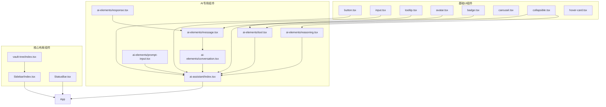

**图示来源**
- [button.tsx](file://frontend/src/renderer/src/components/ui/button.tsx)
- [input.tsx](file://frontend/src/renderer/src/components/ui/input.tsx)
- [tooltip.tsx](file://frontend/src/renderer/src/components/ui/tooltip.tsx)
- [avatar.tsx](file://frontend/src/renderer/src/components/ui/avatar.tsx)
- [badge.tsx](file://frontend/src/renderer/src/components/ui/badge.tsx)
- [carousel.tsx](file://frontend/src/renderer/src/components/ui/carousel.tsx)
- [collapsible.tsx](file://frontend/src/renderer/src/components/ui/collapsible.tsx)
- [hover-card.tsx](file://frontend/src/renderer/src/components/ui/hover-card.tsx)
- [AIAssistant/index.tsx](file://frontend/src/renderer/src/components/ai-assistant/index.tsx)
- [ai-elements/conversation.tsx](file://frontend/src/renderer/src/components/ai-elements/conversation.tsx)
- [ai-elements/message.tsx](file://frontend/src/renderer/src/components/ai-elements/message.tsx)
- [ai-elements/response.tsx](file://frontend/src/renderer/src/components/ai-elements/response.tsx)
- [ai-elements/reasoning.tsx](file://frontend/src/renderer/src/components/ai-elements/reasoning.tsx)
- [ai-elements/tool.tsx](file://frontend/src/renderer/src/components/ai-elements/tool.tsx)
- [ai-elements/prompt-input.tsx](file://frontend/src/renderer/src/components/ai-elements/prompt-input.tsx)
- [Sidebar/index.tsx](file://frontend/src/renderer/src/components/Sidebar/index.tsx)
- [StatusBar.tsx](file://frontend/src/renderer/src/components/status-bar/StatusBar.tsx)
- [vault-tree/index.tsx](file://frontend/src/renderer/src/components/vault-tree/index.tsx)

**本节来源**
- [frontend/src/renderer/src/components](file://frontend/src/renderer/src/components)

## 核心组件
本项目的核心UI组件分为三类：基础UI组件、AI专用组件和核心布局组件。基础UI组件基于Radix UI和Tailwind CSS构建，提供了高度可定制的界面元素。AI专用组件封装了AI聊天界面的复杂交互逻辑，包括消息流、推理过程和工具调用。核心布局组件构建了应用的整体框架，实现了侧边栏、状态栏和文件树等关键界面元素。

**本节来源**
- [frontend/src/renderer/src/components/ui](file://frontend/src/renderer/src/components/ui)
- [frontend/src/renderer/src/components/ai-assistant](file://frontend/src/renderer/src/components/ai-assistant)
- [frontend/src/renderer/src/components/ai-elements](file://frontend/src/renderer/src/components/ai-elements)

## 架构概述
本UI组件库采用分层架构设计，通过组合模式构建复杂的用户界面。基础UI组件提供原子级的界面元素，AI专用组件在基础组件之上构建AI交互逻辑，核心布局组件则组织整个应用的界面结构。

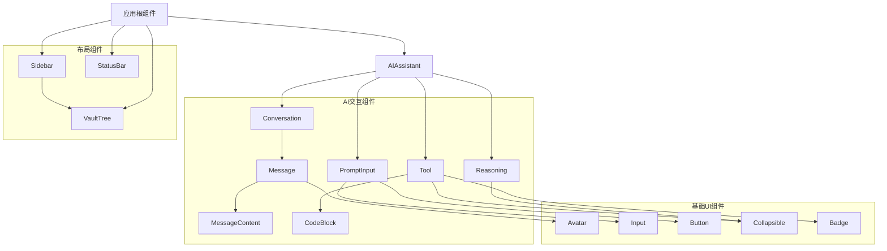

**图示来源**
- [frontend/src/renderer/src/components/Sidebar/index.tsx](file://frontend/src/renderer/src/components/Sidebar/index.tsx)
- [frontend/src/renderer/src/components/status-bar/StatusBar.tsx](file://frontend/src/renderer/src/components/status-bar/StatusBar.tsx)
- [frontend/src/renderer/src/components/ai-assistant/index.tsx](file://frontend/src/renderer/src/components/ai-assistant/index.tsx)
- [frontend/src/renderer/src/components/ai-elements/conversation.tsx](file://frontend/src/renderer/src/components/ai-elements/conversation.tsx)
- [frontend/src/renderer/src/components/ai-elements/message.tsx](file://frontend/src/renderer/src/components/ai-elements/message.tsx)
- [frontend/src/renderer/src/components/ai-elements/prompt-input.tsx](file://frontend/src/renderer/src/components/ai-elements/prompt-input.tsx)
- [frontend/src/renderer/src/components/ai-elements/reasoning.tsx](file://frontend/src/renderer/src/components/ai-elements/reasoning.tsx)
- [frontend/src/renderer/src/components/ai-elements/tool.tsx](file://frontend/src/renderer/src/components/ai-elements/tool.tsx)
- [frontend/src/renderer/src/components/vault-tree/index.tsx](file://frontend/src/renderer/src/components/vault-tree/index.tsx)

## 详细组件分析
本节详细分析各个关键组件的实现细节，包括其props、事件处理和样式定制机制。

### 基础UI组件分析
基础UI组件位于`components/ui`目录下，基于Radix UI原语和Tailwind CSS构建，提供了高度可定制的界面元素。

#### 按钮组件
按钮组件使用`cva`（Class Variant Authority）库定义了多种变体和尺寸，支持通过`asChild`属性将样式应用到子组件上。

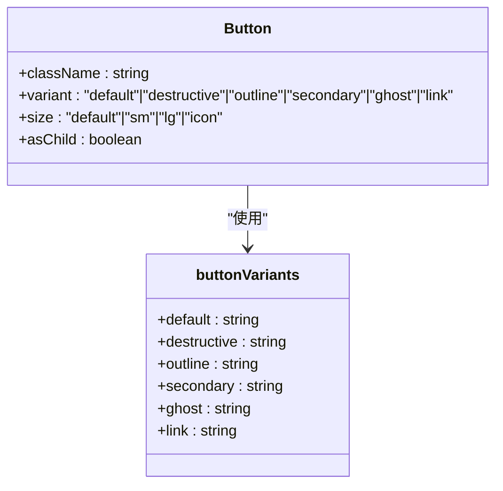

**图示来源**
- [button.tsx](file://frontend/src/renderer/src/components/ui/button.tsx#L10-L36)

**本节来源**
- [button.tsx](file://frontend/src/renderer/src/components/ui/button.tsx)

#### 输入框组件
输入框组件提供了标准的输入样式，包含焦点状态、无效状态和禁用状态的样式处理。

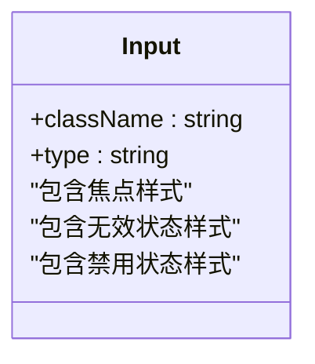

**图示来源**
- [input.tsx](file://frontend/src/renderer/src/components/ui/input.tsx#L8-L24)

**本节来源**
- [input.tsx](file://frontend/src/renderer/src/components/ui/input.tsx)

#### 提示框组件
提示框组件基于Radix UI的Tooltip原语构建，提供了提示框的提供者、触发器和内容组件。

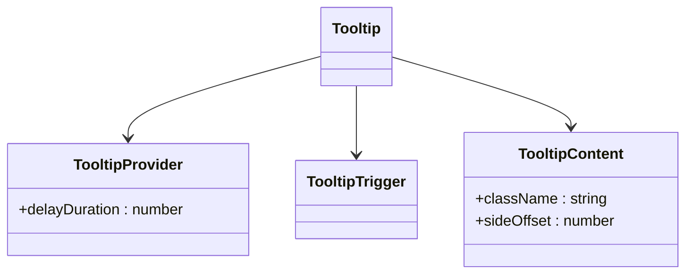

**图示来源**
- [tooltip.tsx](file://frontend/src/renderer/src/components/ui/tooltip.tsx#L9-L48)

**本节来源**
- [tooltip.tsx](file://frontend/src/renderer/src/components/ui/tooltip.tsx)

### AI专用组件分析
AI专用组件封装了AI聊天界面的复杂交互逻辑，包括消息流、推理过程和工具调用。

#### AI助手组件
AI助手组件是AI聊天界面的核心，管理聊天状态、消息流和用户交互。

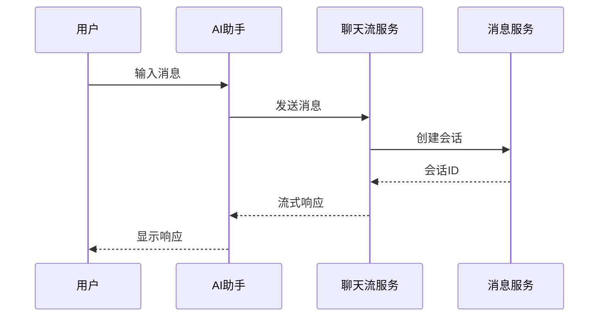

**图示来源**
- [ai-assistant/index.tsx](file://frontend/src/renderer/src/components/ai-assistant/index.tsx#L56-L355)

**本节来源**
- [ai-assistant/index.tsx](file://frontend/src/renderer/src/components/ai-assistant/index.tsx)

#### 消息组件
消息组件用于显示AI聊天中的用户和助手消息，支持Markdown渲染。

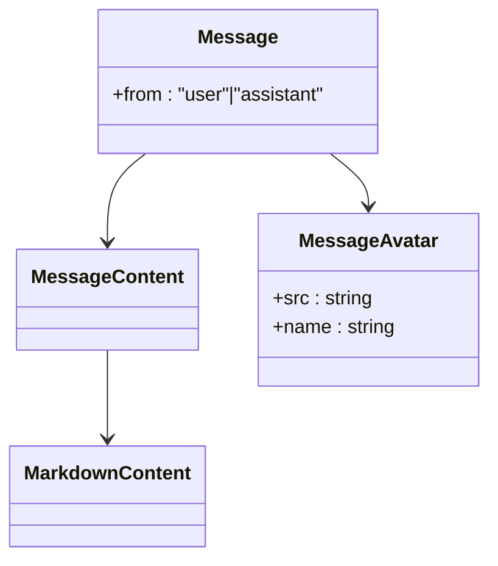

**图示来源**
- [ai-elements/message.tsx](file://frontend/src/renderer/src/components/ai-elements/message.tsx#L9-L51)

**本节来源**
- [ai-elements/message.tsx](file://frontend/src/renderer/src/components/ai-elements/message.tsx)

#### 推理组件
推理组件用于显示AI的思考过程，支持展开/收起交互。

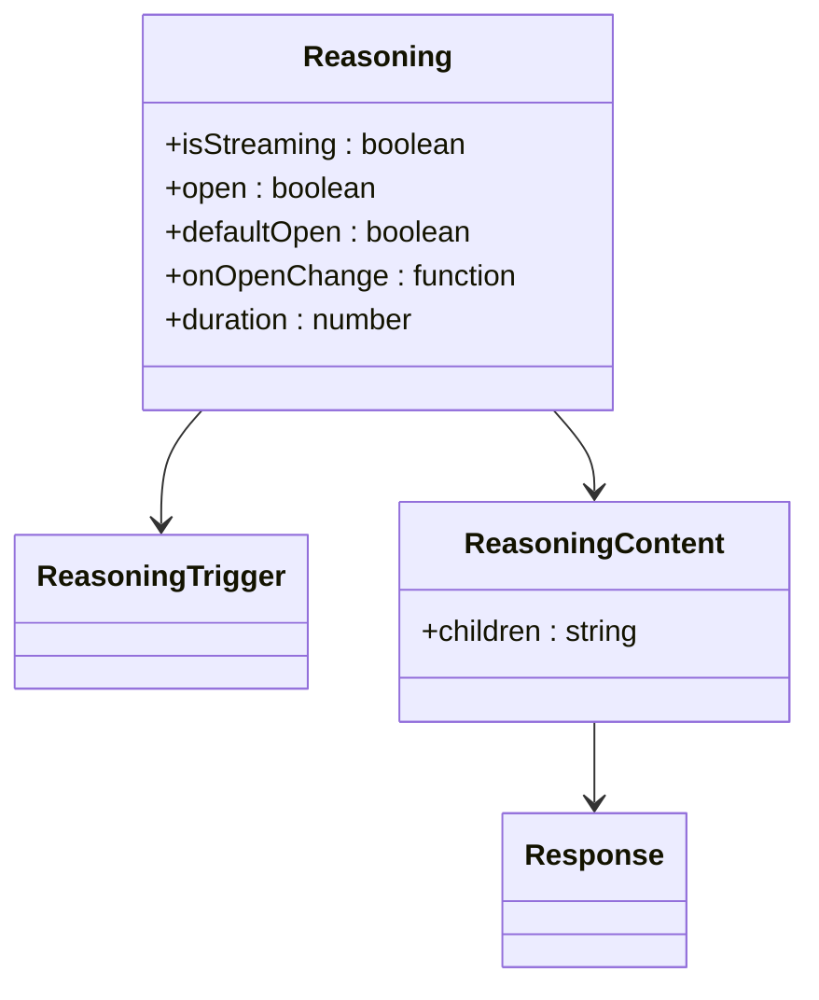

**图示来源**
- [ai-elements/reasoning.tsx](file://frontend/src/renderer/src/components/ai-elements/reasoning.tsx#L31-L154)

**本节来源**
- [ai-elements/reasoning.tsx](file://frontend/src/renderer/src/components/ai-elements/reasoning.tsx)

#### 工具组件
工具组件用于显示AI调用工具的过程和结果。

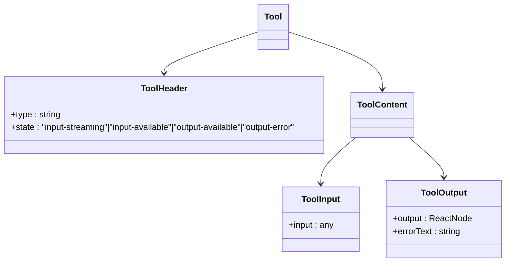

**图示来源**
- [ai-elements/tool.tsx](file://frontend/src/renderer/src/components/ai-elements/tool.tsx#L14-L110)

**本节来源**
- [ai-elements/tool.tsx](file://frontend/src/renderer/src/components/ai-elements/tool.tsx)

#### 提示输入组件
提示输入组件提供了富文本输入功能，支持快捷键提交。

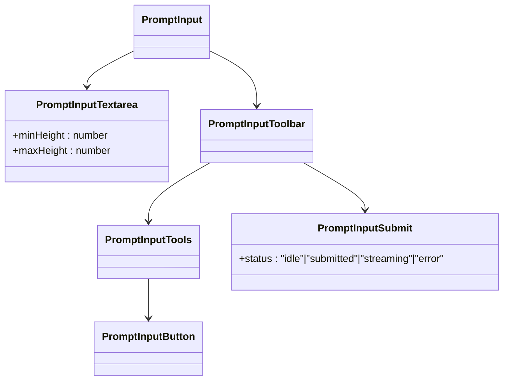

**图示来源**
- [ai-elements/prompt-input.tsx](file://frontend/src/renderer/src/components/ai-elements/prompt-input.tsx#L17-L172)

**本节来源**
- [ai-elements/prompt-input.tsx](file://frontend/src/renderer/src/components/ai-elements/prompt-input.tsx)

### 核心布局组件分析
核心布局组件构建了应用的整体界面框架。

#### 侧边栏组件
侧边栏组件是应用的主要导航区域，包含文件树和其他导航元素。

**本节来源**
- [Sidebar/index.tsx](file://frontend/src/renderer/src/components/Sidebar/index.tsx)

#### 状态栏组件
状态栏组件显示应用的当前状态和系统信息。

**本节来源**
- [StatusBar.tsx](file://frontend/src/renderer/src/components/status-bar/StatusBar.tsx)

#### 文件树组件
文件树组件显示用户的文件和文件夹结构。

**本节来源**
- [vault-tree/index.tsx](file://frontend/src/renderer/src/components/vault-tree/index.tsx)

## 依赖分析
本UI组件库的依赖关系清晰，采用分层架构避免循环依赖。

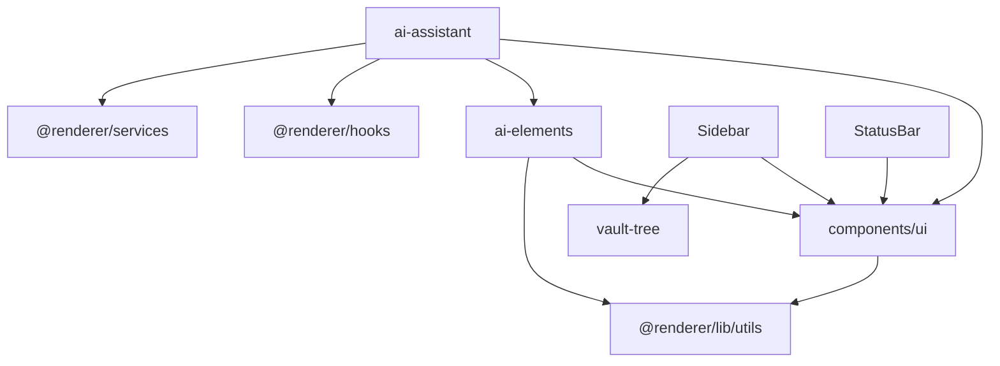

**图示来源**
- [package.json](file://frontend/package.json)
- [tsconfig.json](file://frontend/tsconfig.json)

**本节来源**
- [frontend/package.json](file://frontend/package.json)
- [frontend/tsconfig.json](file://frontend/tsconfig.json)

## 性能考虑
本UI组件库在性能方面做了多项优化：

1. 使用`memo`对组件进行记忆化，避免不必要的重新渲染
2. 使用`useCallback`对事件处理函数进行记忆化
3. 使用流式渲染处理AI响应，避免长时间阻塞
4. 使用虚拟滚动处理大量消息的显示
5. 对图片和资源进行懒加载

## 故障排除指南
### 常见问题
1. **AI响应延迟**：检查网络连接和后端服务状态
2. **组件样式错乱**：检查Tailwind CSS类名是否正确
3. **消息无法发送**：检查输入框是否为空，网络是否正常
4. **工具调用失败**：检查工具参数是否正确，后端服务是否正常

### 调试方法
1. 使用浏览器开发者工具检查组件状态
2. 查看控制台日志获取错误信息
3. 使用React DevTools检查组件树和props
4. 检查网络请求是否正常

**本节来源**
- [ai-assistant/index.tsx](file://frontend/src/renderer/src/components/ai-assistant/index.tsx#L291-L311)
- [logger/renderer.ts](file://frontend/packages/shared/logger/renderer.ts)

## 结论
本文档全面解析了前端UI组件库的设计与实现。该组件库采用分层架构，将基础UI组件、AI专用组件和核心布局组件有机结合，构建了功能丰富且易于维护的用户界面。通过使用现代化的前端技术栈，包括React、TypeScript、Tailwind CSS和Radix UI，实现了高性能、可访问性和可定制性的平衡。AI专用组件特别针对AI聊天场景进行了优化，提供了流畅的交互体验和丰富的功能。