# 渲染进程

<cite>
**本文档引用的文件**  
- [main.tsx](file://frontend/src/renderer/src/main.tsx)
- [App.tsx](file://frontend/src/renderer/src/App.tsx)
- [Router.tsx](file://frontend/src/renderer/src/Router.tsx)
- [store/index.ts](file://frontend/src/renderer/src/store/index.ts)
- [preload/index.ts](file://frontend/src/preload/index.ts)
- [pages/home/home-page.tsx](file://frontend/src/renderer/src/pages/home/home-page.tsx)
- [pages/screen-monitor/screen-monitor.tsx](file://frontend/src/renderer/src/pages/screen-monitor/screen-monitor.tsx)
- [pages/settings/settings.tsx](file://frontend/src/renderer/src/pages/settings/settings.tsx)
- [components/ai-assistant/index.tsx](file://frontend/src/renderer/src/components/ai-assistant/index.tsx)
- [components/status-bar/StatusBar.tsx](file://frontend/src/renderer/src/components/status-bar/StatusBar.tsx)
- [store/navigation.ts](file://frontend/src/renderer/src/store/navigation.ts)
- [store/setting.ts](file://frontend/src/renderer/src/store/setting.ts)
- [store/screen.ts](file://frontend/src/renderer/src/store/screen.ts)
- [services/Settings.ts](file://frontend/src/renderer/src/services/Settings.ts)
- [atom/capture.atom.tsx](file://frontend/src/renderer/src/atom/capture.atom.tsx)
</cite>

## 目录
1. [项目结构](#项目结构)
2. [核心组件](#核心组件)
3. [架构概述](#架构概述)
4. [详细组件分析](#详细组件分析)
5. [依赖分析](#依赖分析)
6. [性能考虑](#性能考虑)
7. [故障排除指南](#故障排除指南)
8. [结论](#结论)

## 项目结构

该项目采用基于Electron的桌面应用程序架构，前端使用React框架。渲染进程位于`frontend/src/renderer/src`目录下，遵循典型的React应用结构，包含`main.tsx`作为入口点，`App.tsx`作为根组件，`Router.tsx`处理路由，`pages`目录存放页面组件，`components`目录存放可复用UI组件，`store`目录管理全局状态，`services`目录封装API调用。

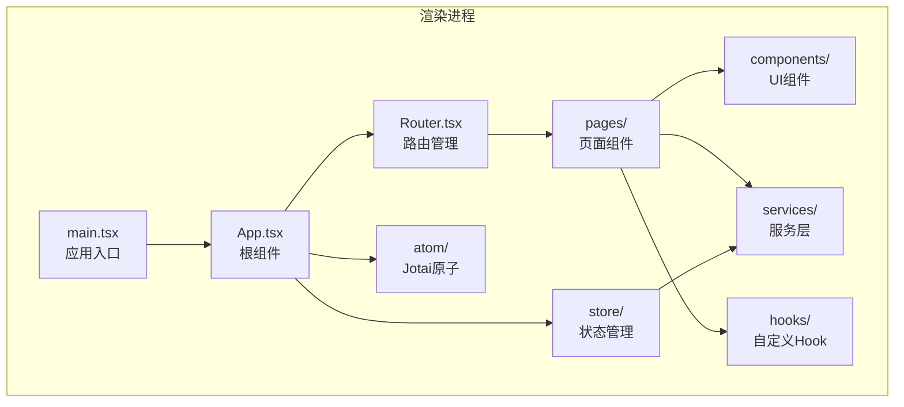

**图源**  
- [main.tsx](file://frontend/src/renderer/src/main.tsx#L1-L9)
- [App.tsx](file://frontend/src/renderer/src/App.tsx#L1-L138)
- [Router.tsx](file://frontend/src/renderer/src/Router.tsx#L1-L103)

## 核心组件

渲染进程的核心组件包括`main.tsx`、`App.tsx`和`Router.tsx`，它们共同负责初始化React应用、管理全局状态和实现应用内路由。

**节源**  
- [main.tsx](file://frontend/src/renderer/src/main.tsx#L1-L9)
- [App.tsx](file://frontend/src/renderer/src/App.tsx#L1-L138)
- [Router.tsx](file://frontend/src/renderer/src/Router.tsx#L1-L103)

## 架构概述

该应用采用现代化的React架构，结合Redux Toolkit进行全局状态管理，并使用Jotai进行局部状态管理。通过Electron的预加载脚本，渲染进程能够安全地与主进程通信，实现桌面应用的原生功能。

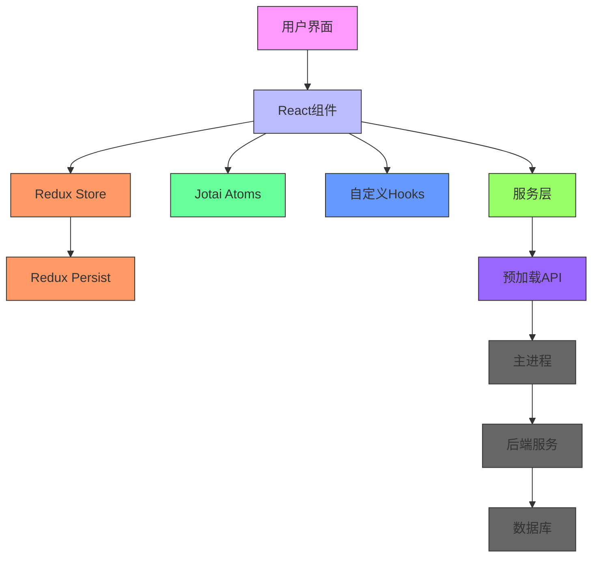

**图源**  
- [App.tsx](file://frontend/src/renderer/src/App.tsx#L1-L138)
- [store/index.ts](file://frontend/src/renderer/src/store/index.ts#L1-L85)
- [preload/index.ts](file://frontend/src/preload/index.ts#L1-L157)

## 详细组件分析

### 主应用组件分析

`App.tsx`是应用的根组件，负责初始化全局状态、监听后端服务状态并根据状态决定渲染内容。

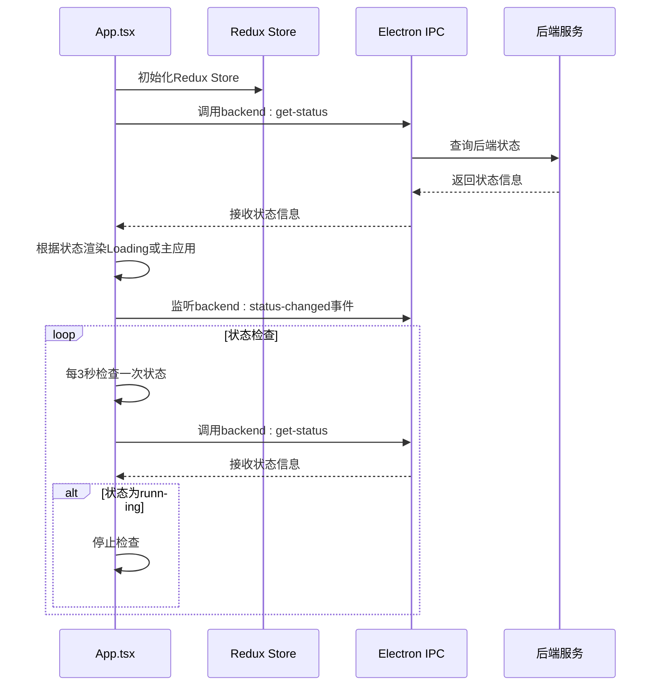

**图源**  
- [App.tsx](file://frontend/src/renderer/src/App.tsx#L1-L138)

### 路由组件分析

`Router.tsx`使用`react-router-dom`实现应用内路由，管理页面导航和全局事件监听。

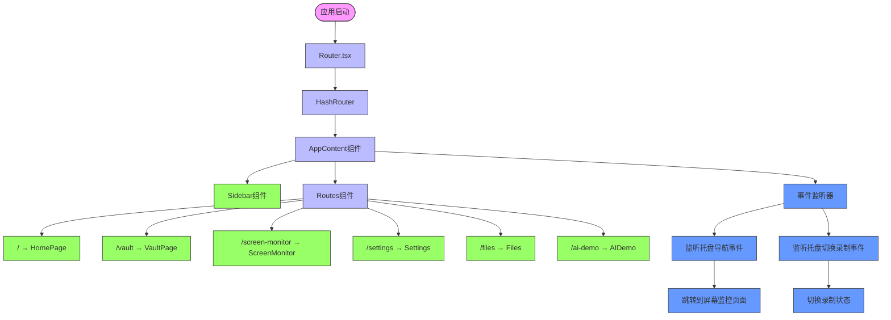

**图源**  
- [Router.tsx](file://frontend/src/renderer/src/Router.tsx#L1-L103)

### 页面组件分析

#### 首页组件

`home-page.tsx`是应用的主页面，展示各种信息卡片和AI助手。

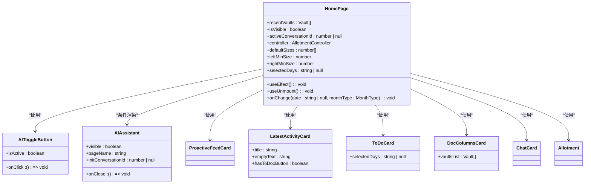

**图源**  
- [pages/home/home-page.tsx](file://frontend/src/renderer/src/pages/home/home-page.tsx#L1-L106)

#### 屏幕监控组件

`screen-monitor.tsx`负责屏幕录制功能的UI展示和状态管理。

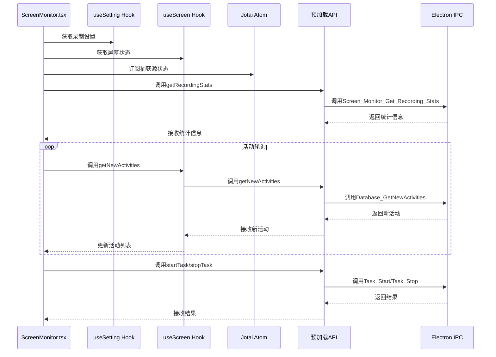

**图源**  
- [pages/screen-monitor/screen-monitor.tsx](file://frontend/src/renderer/src/pages/screen-monitor/screen-monitor.tsx#L1-L575)

#### 设置组件

`settings.tsx`提供AI模型配置界面。

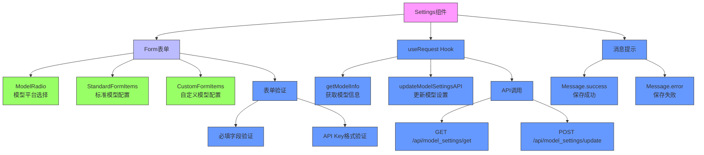

**图源**  
- [pages/settings/settings.tsx](file://frontend/src/renderer/src/pages/settings/settings.tsx#L1-L337)

### UI组件分析

#### AI助手组件

`ai-assistant/index.tsx`提供与AI交互的界面。

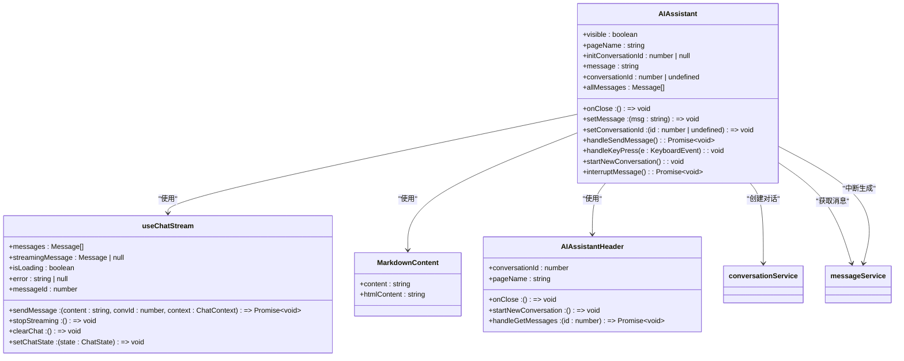

**图源**  
- [components/ai-assistant/index.tsx](file://frontend/src/renderer/src/components/ai-assistant/index.tsx#L1-L356)

#### 状态栏组件

`status-bar/StatusBar.tsx`显示文档的元数据信息。

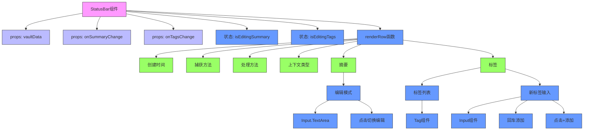

**图源**  
- [components/status-bar/StatusBar.tsx](file://frontend/src/renderer/src/components/status-bar/StatusBar.tsx#L1-L115)

### 状态管理分析

#### Redux状态管理

应用使用Redux Toolkit管理全局状态，通过`store/index.ts`配置store。

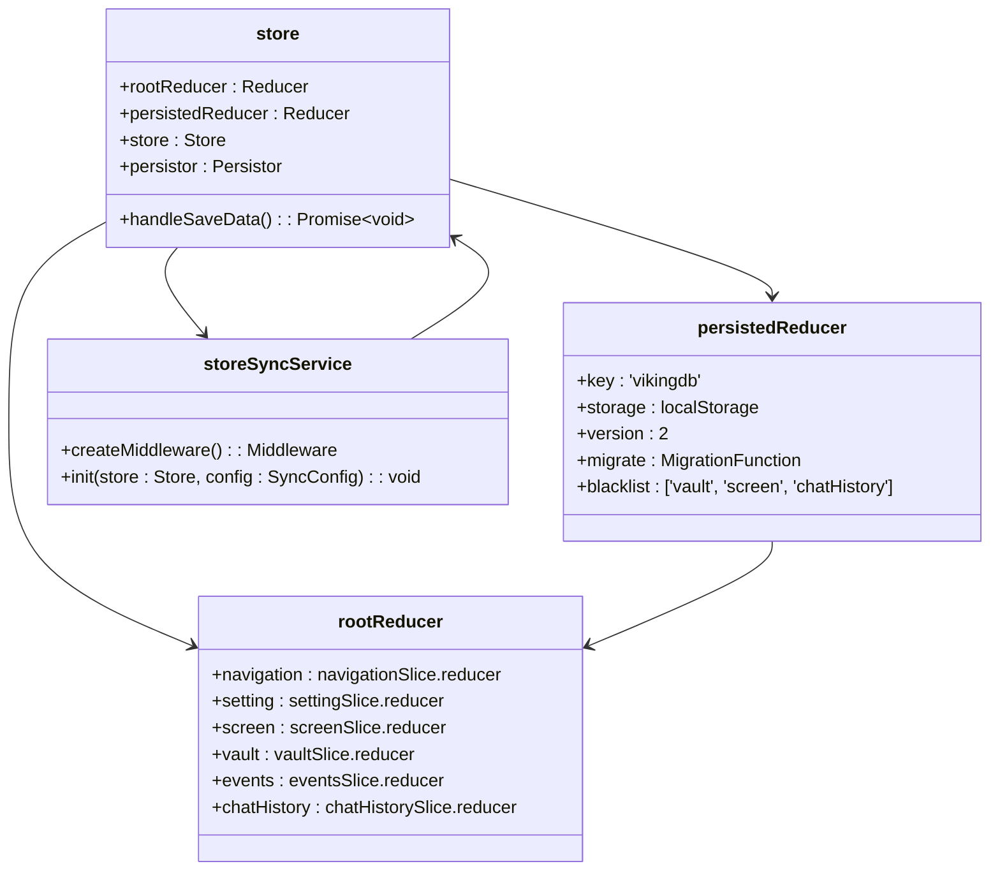

**图源**  
- [store/index.ts](file://frontend/src/renderer/src/store/index.ts#L1-L85)

#### Redux Slice分析

##### 导航状态

`navigation.ts`管理应用的导航状态。

```mermaid
classDiagram
class NavigationState {
+activeNavigationType : 'main' | 'vault'
+activeMainTab : string
+activeVaultId : number | null
}
class navigationSlice {
+setActiveMainTab(tab : string) : Action
+setActiveVault(id : number) : Action
+clearActiveVault() : Action
+initializeFromRoute(path : {pathname : string, search : string}) : Action
}
NavigationState <|-- navigationSlice
```

**图源**  
- [store/navigation.ts](file://frontend/src/renderer/src/store/navigation.ts#L1-L86)

##### 设置状态

`setting.ts`管理屏幕录制的设置。

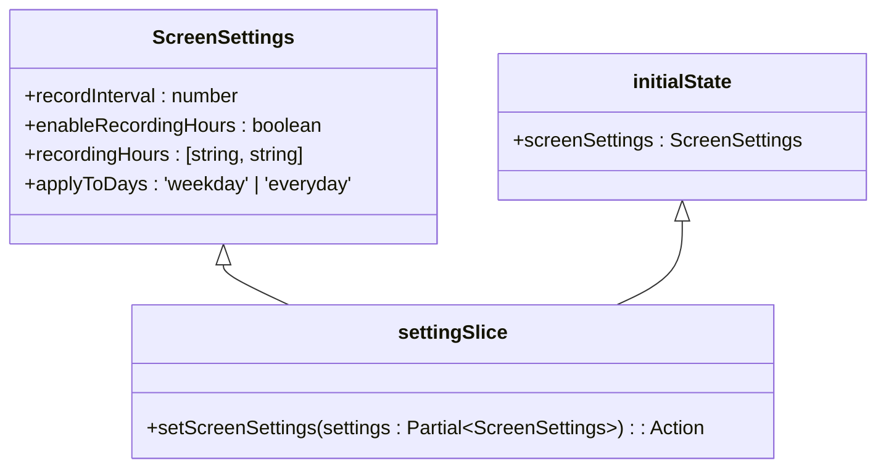

**图源**  
- [store/setting.ts](file://frontend/src/renderer/src/store/setting.ts#L1-L35)

##### 屏幕状态

`screen.ts`管理屏幕录制的状态。

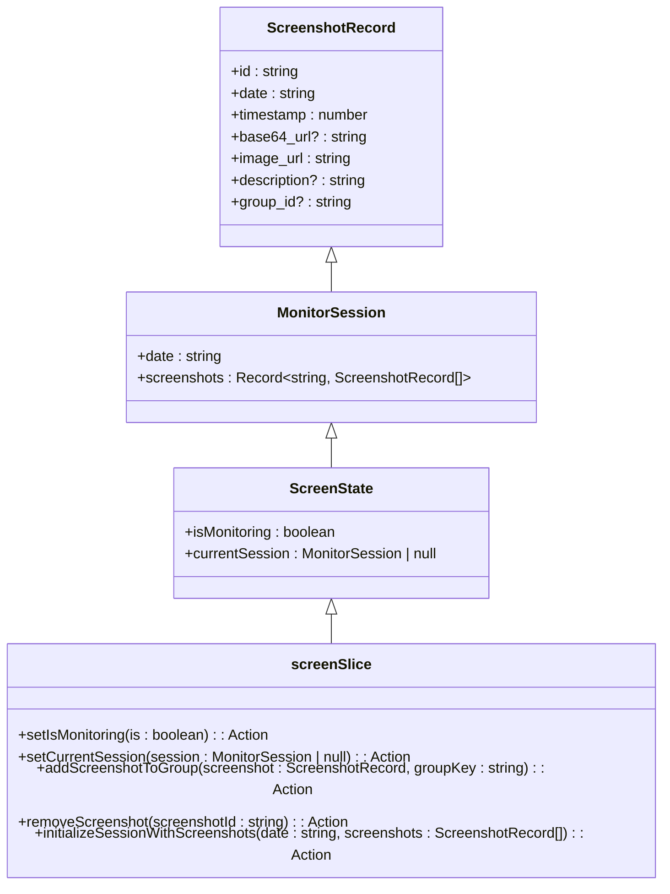

**图源**  
- [store/screen.ts](file://frontend/src/renderer/src/store/screen.ts#L1-L123)

#### Jotai状态管理

`atom/capture.atom.tsx`使用Jotai管理捕获源的状态。

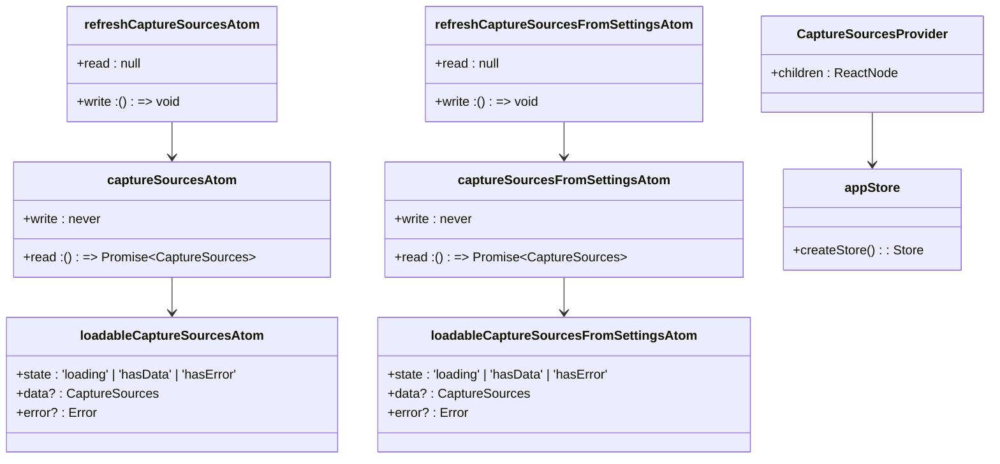

**图源**  
- [atom/capture.atom.tsx](file://frontend/src/renderer/src/atom/capture.atom.tsx#L1-L67)

### 服务层分析

#### 设置服务

`services/Settings.ts`提供与后端API通信的接口。

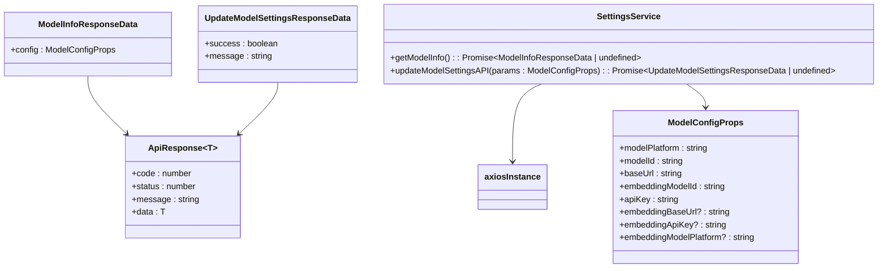

**图源**  
- [services/Settings.ts](file://frontend/src/renderer/src/services/Settings.ts#L1-L55)

## 依赖分析

应用的依赖关系清晰，各组件职责分明，通过合理的状态管理和服务层封装实现了良好的解耦。

```mermaid
graph TD
App["App.tsx"] --> Store["Redux Store"]
App --> Router["Router.tsx"]
App --> atom["Jotai Atoms"]
App --> NotificationProvider["NotificationProvider"]
Router --> Sidebar["Sidebar"]
Router --> HomePage["HomePage"]
Router --> ScreenMonitor["ScreenMonitor"]
Router --> Settings["Settings"]
Router --> Files["Files"]
Router --> AIDemo["AIDemo"]
HomePage --> AIAssistant["AIAssistant"]
HomePage --> AIToggleButton["AIToggleButton"]
HomePage --> ProactiveFeedCard["ProactiveFeedCard"]
HomePage --> LatestActivityCard["LatestActivityCard"]
HomePage --> ToDoCard["ToDoCard"]
HomePage --> DocColumnsCard["DocColumnsCard"]
HomePage --> ChatCard["ChatCard"]
ScreenMonitor --> ScreenMonitorHeader["ScreenMonitorHeader"]
ScreenMonitor --> DateNavigation["DateNavigation"]
ScreenMonitor --> RecordingTimeline["RecordingTimeline"]
ScreenMonitor --> EmptyStatePlaceholder["EmptyStatePlaceholder"]
ScreenMonitor --> SettingsModal["SettingsModal"]
Settings --> ModelRadio["ModelRadio"]
Settings --> StandardFormItems["StandardFormItems"]
Settings --> CustomFormItems["CustomFormItems"]
AIAssistant --> MarkdownContent["MarkdownContent"]
AIAssistant --> AIAssistantHeader["AIAssistantHeader"]
AIAssistant --> useChatStream["useChatStream"]
AIAssistant --> conversationService["conversationService"]
AIAssistant --> messageService["messageService"]
StatusBar --> Tag["Tag"]
StatusBar --> Input["Input"]
useSetting --> settingSlice["settingSlice"]
useScreen --> screenSlice["screenSlice"]
useChatStream --> chatHistorySlice["chatHistorySlice"]
services --> axiosConfig["axiosConfig"]
services --> Settings["Settings"]
services --> ChatStreamService["ChatStreamService"]
services --> GlobalEventService["GlobalEventService"]
services --> StoreSyncService["StoreSyncService"]
services --> conversation-service["conversation-service"]
services --> messages-service["messages-service"]
atom --> capture.atom["capture.atom"]
atom --> event-loop.atom["event-loop.atom"]
preload --> electronAPI["electronAPI"]
preload --> api["api"]
preload --> dbAPI["dbAPI"]
preload --> screenMonitorAPI["screenMonitorAPI"]
preload --> fileService["fileService"]
preload --> serverPushAPI["serverPushAPI"]
preload --> eventLoop["eventLoop"]
style App fill:#f9f,stroke:#333
style Store fill:#f96,stroke:#333
style Router fill:#bbf,stroke:#333
style atom fill:#6f9,stroke:#333
style NotificationProvider fill:#6f9,stroke:#333
style Sidebar fill:#9f6,stroke:#333
style HomePage fill:#9f6,stroke:#333
style ScreenMonitor fill:#9f6,stroke:#333
style Settings fill:#9f6,stroke:#333
style Files fill:#9f6,stroke:#333
style AIDemo fill:#9f6,stroke:#333
style AIAssistant fill:#9f6,stroke:#333
style AIToggleButton fill:#9f6,stroke:#333
style ProactiveFeedCard fill:#9f6,stroke:#333
style LatestActivityCard fill:#9f6,stroke:#333
style ToDoCard fill:#9f6,stroke:#333
style DocColumnsCard fill:#9f6,stroke:#333
style ChatCard fill:#9f6,stroke:#333
style ScreenMonitorHeader fill:#9f6,stroke:#333
style DateNavigation fill:#9f6,stroke:#333
style RecordingTimeline fill:#9f6,stroke:#333
style EmptyStatePlaceholder fill:#9f6,stroke:#333
style SettingsModal fill:#9f6,stroke:#333
style ModelRadio fill:#9f6,stroke:#333
style StandardFormItems fill:#9f6,stroke:#333
style CustomFormItems fill:#9f6,stroke:#333
style MarkdownContent fill:#9f6,stroke:#333
style AIAssistantHeader fill:#9f6,stroke:#333
style useChatStream fill:#69f,stroke:#333
style conversationService fill:#69f,stroke:#333
style messageService fill:#69f,stroke:#333
style StatusBar fill:#9f6,stroke:#333
style Tag fill:#9f6,stroke:#333
style Input fill:#9f6,stroke:#333
style useSetting fill:#69f,stroke:#333
style useScreen fill:#69f,stroke:#333
style settingSlice fill:#f96,stroke:#333
style screenSlice fill:#f96,stroke:#333
style chatHistorySlice fill:#f96,stroke:#333
style services fill:#69f,stroke:#333
style axiosConfig fill:#69f,stroke:#333
style Settings fill:#69f,stroke:#333
style ChatStreamService fill:#69f,stroke:#333
style GlobalEventService fill:#69f,stroke:#333
style StoreSyncService fill:#69f,stroke:#333
style conversation-service fill:#69f,stroke:#333
style messages-service fill:#69f,stroke:#333
style capture.atom fill:#6f9,stroke:#333
style event-loop.atom fill:#6f9,stroke:#333
style electronAPI fill:#96f,stroke:#333
style api fill:#96f,stroke:#333
style dbAPI fill:#96f,stroke:#333
style screenMonitorAPI fill:#96f,stroke:#333
style fileService fill:#96f,stroke:#333
style serverPushAPI fill:#96f,stroke:#333
style eventLoop fill:#96f,stroke:#333
```

**图源**  
- [App.tsx](file://frontend/src/renderer/src/App.tsx#L1-L138)
- [Router.tsx](file://frontend/src/renderer/src/Router.tsx#L1-L103)
- [store/index.ts](file://frontend/src/renderer/src/store/index.ts#L1-L85)
- [preload/index.ts](file://frontend/src/preload/index.ts#L1-L157)

## 性能考虑

应用在性能方面有以下考虑：

1. **状态持久化**：使用`redux-persist`将状态保存到本地存储，避免应用重启时丢失数据。
2. **选择性持久化**：通过`blacklist`配置，避免将大型数据（如`vault`、`screen`）持久化，提高性能。
3. **轮询优化**：在`ScreenMonitor`组件中，只在需要时启动轮询，并在页面切换或屏幕锁定时停止轮询。
4. **内存管理**：在组件卸载时清理定时器和事件监听器，防止内存泄漏。
5. **懒加载**：使用`HashRouter`实现路由，避免不必要的组件加载。

**节源**  
- [store/index.ts](file://frontend/src/renderer/src/store/index.ts#L48-L49)
- [pages/screen-monitor/screen-monitor.tsx](file://frontend/src/renderer/src/pages/screen-monitor/screen-monitor.tsx#L134-L151)
- [App.tsx](file://frontend/src/renderer/src/App.tsx#L78-L81)

## 故障排除指南

### 常见问题

1. **后端服务未启动**
   - 现象：应用显示加载状态，无法进入主界面
   - 解决方案：检查后端服务是否正常运行，查看日志文件

2. **屏幕录制权限问题**
   - 现象：无法开始屏幕录制
   - 解决方案：在系统设置中授予屏幕录制权限

3. **AI模型配置错误**
   - 现象：AI助手无法响应
   - 解决方案：检查API密钥和模型配置是否正确

4. **状态不一致**
   - 现象：页面显示的数据与实际不符
   - 解决方案：尝试刷新页面或重启应用

### 调试技巧

1. **查看控制台日志**：使用开发者工具查看控制台输出的错误信息
2. **检查网络请求**：在开发者工具的网络面板中查看API调用是否成功
3. **状态检查**：使用Redux DevTools检查应用状态
4. **日志文件**：查看应用生成的日志文件获取详细信息

**节源**  
- [App.tsx](file://frontend/src/renderer/src/App.tsx#L41-L43)
- [pages/screen-monitor/screen-monitor.tsx](file://frontend/src/renderer/src/pages/screen-monitor/screen-monitor.tsx#L488-L490)
- [components/ai-assistant/index.tsx](file://frontend/src/renderer/src/components/ai-assistant/index.tsx#L291-L311)

## 结论

该渲染进程实现了完整的React应用架构，通过合理的组件划分、状态管理和服务层封装，构建了一个功能丰富的桌面应用界面。应用采用现代化的技术栈，包括React、Redux Toolkit、Jotai、Electron等，具有良好的可维护性和扩展性。通过预加载脚本，渲染进程能够安全地与主进程通信，实现桌面应用的原生功能。整体架构清晰，各组件职责分明，为后续功能扩展奠定了良好的基础。