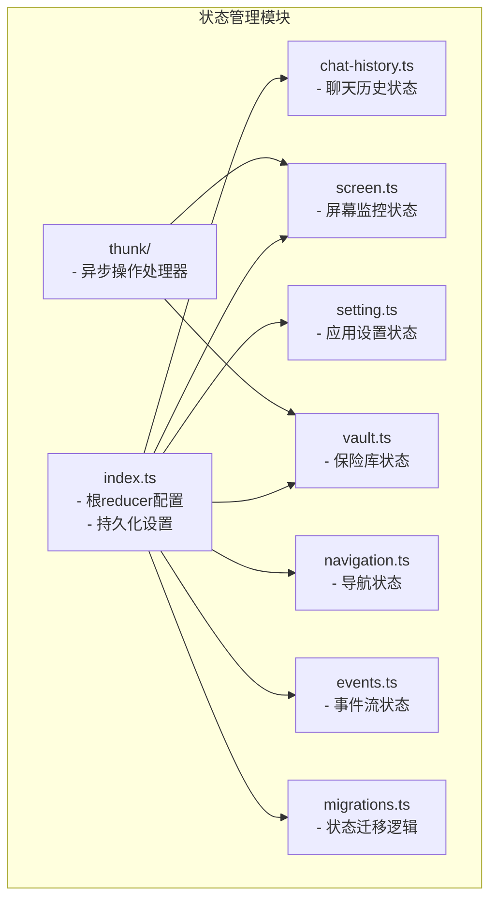
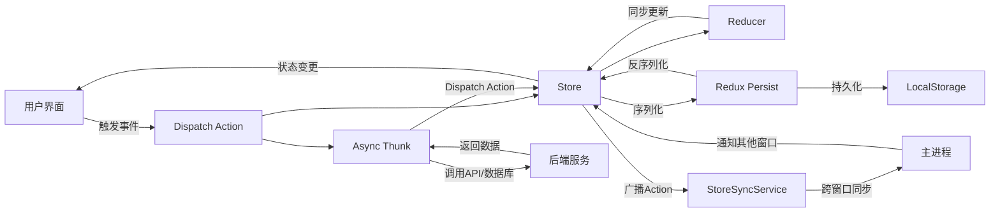
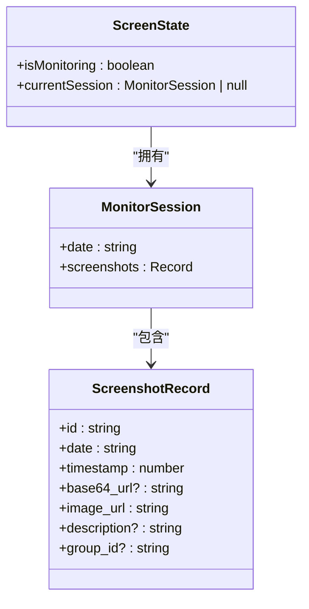
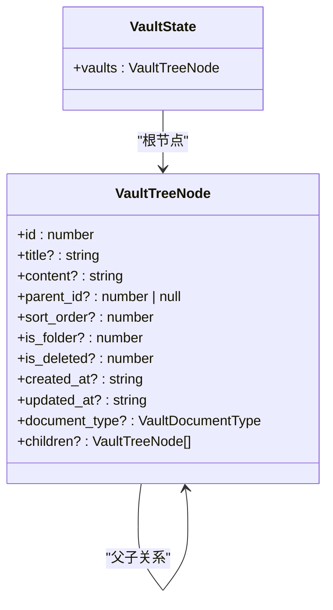
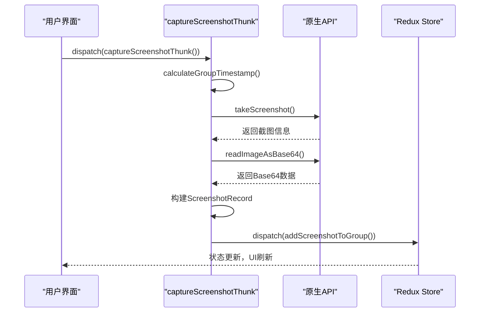
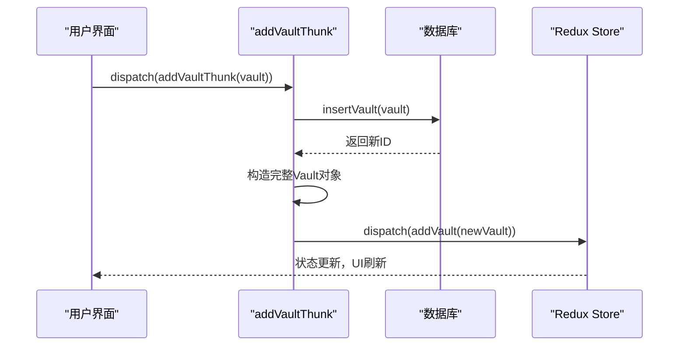
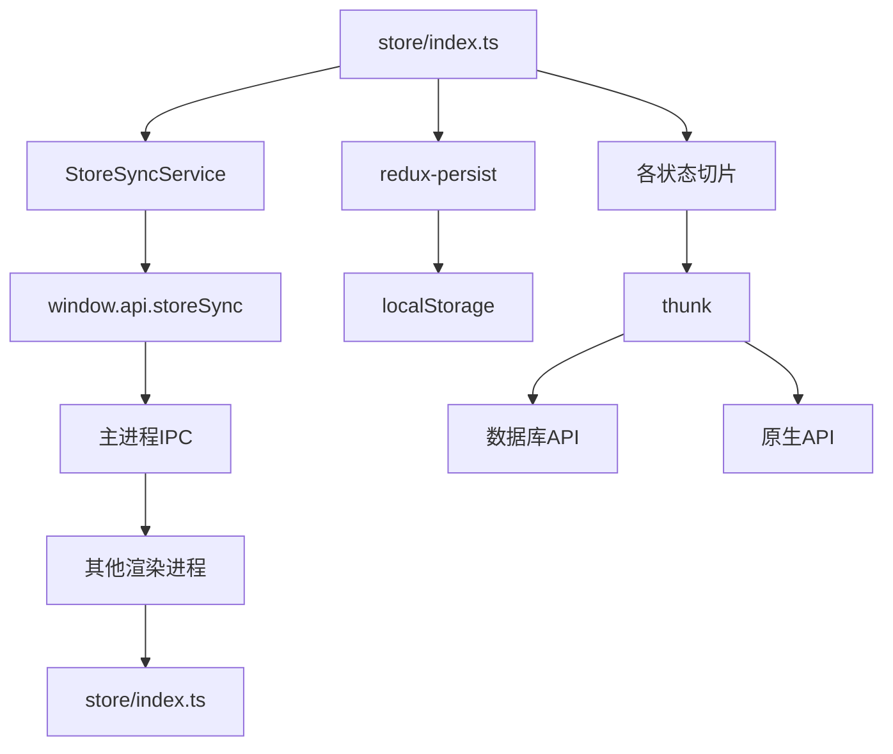

# 状态管理

<cite>
**本文档引用的文件**
- [index.ts](file://frontend/src/renderer/src/store/index.ts)
- [migrations.ts](file://frontend/src/renderer/src/store/migrations.ts)
- [chat-history.ts](file://frontend/src/renderer/src/store/chat-history.ts)
- [screen.ts](file://frontend/src/renderer/src/store/screen.ts)
- [setting.ts](file://frontend/src/renderer/src/store/setting.ts)
- [vault.ts](file://frontend/src/renderer/src/store/vault.ts)
- [navigation.ts](file://frontend/src/renderer/src/store/navigation.ts)
- [events.ts](file://frontend/src/renderer/src/store/events.ts)
- [screen-thunk.ts](file://frontend/src/renderer/src/store/thunk/screen-thunk.ts)
- [vault-thunk.ts](file://frontend/src/renderer/src/store/thunk/vault-thunk.ts)
- [StoreSyncService.ts](file://frontend/src/renderer/src/services/StoreSyncService.ts)
- [vault.ts](file://frontend/src/renderer/src/types/vault.ts)
- [vault.ts](file://frontend/src/renderer/src/utils/vault.ts)
</cite>

## 目录
1. [简介](#简介)
2. [项目结构](#项目结构)
3. [核心组件](#核心组件)
4. [架构概述](#架构概述)
5. [详细组件分析](#详细组件分析)
6. [依赖分析](#依赖分析)
7. [性能考虑](#性能考虑)
8. [故障排除指南](#故障排除指南)
9. [结论](#结论)
10. [附录](#附录)（如有必要）

## 简介
本文档深入解析了基于Redux Toolkit的状态管理架构，重点阐述了全局状态原子的定义、组织方式以及模块化状态单元的设计原则。文档详细说明了`store/index.ts`中全局状态的配置，`migrations.ts`中的状态版本升级处理，以及`chat-history`、`screen`、`setting`、`vault`等模块化状态单元的数据结构和设计模式。同时，分析了`thunk`目录下的异步操作处理器如何封装复杂业务逻辑并与后端服务交互，以及`navigation`和`events`状态模块如何协调应用内路由和事件流。

## 项目结构

前端应用的状态管理模块采用模块化设计，所有状态相关的代码都集中在`frontend/src/renderer/src/store`目录下。该目录包含多个独立的状态切片文件，每个文件负责管理特定功能域的状态，以及一个`thunk`目录用于存放异步操作。



**图示来源**
- [index.ts](file://frontend/src/renderer/src/store/index.ts#L20-L25)
- [migrations.ts](file://frontend/src/renderer/src/store/migrations.ts#L6-L25)
- [thunk/](file://frontend/src/renderer/src/store/thunk/)

**本节来源**
- [index.ts](file://frontend/src/renderer/src/store/index.ts#L1-L85)
- [migrations.ts](file://frontend/src/renderer/src/store/migrations.ts#L1-L27)

## 核心组件

本应用的状态管理核心是Redux Toolkit，通过`configureStore`创建全局store，并使用`redux-persist`实现状态持久化。`store/index.ts`文件定义了根reducer，将各个功能模块的状态切片（如`chatHistory`、`screen`、`vault`等）进行组合。`migrations.ts`文件处理了状态的版本升级，确保在应用更新时用户数据的兼容性。`thunk`目录下的异步操作处理器（如`screen-thunk`和`vault-thunk`）封装了与后端服务的交互逻辑，实现了数据的读写操作。

**本节来源**
- [index.ts](file://frontend/src/renderer/src/store/index.ts#L4-L85)
- [migrations.ts](file://frontend/src/renderer/src/store/migrations.ts#L1-L27)
- [thunk/screen-thunk.ts](file://frontend/src/renderer/src/store/thunk/screen-thunk.ts#L1-L100)
- [thunk/vault-thunk.ts](file://frontend/src/renderer/src/store/thunk/vault-thunk.ts#L1-L220)

## 架构概述

整个状态管理架构遵循单一数据源原则，所有状态都存储在全局store中。应用通过`useAppSelector`和`useAppDispatch`这两个自定义Hook来访问和修改状态。状态的更新通过定义在各个切片中的reducer函数来完成，这些函数是纯函数，确保了状态变更的可预测性。对于需要与外部系统（如数据库或API）交互的异步操作，则通过`thunk`来处理，thunk可以访问`getState`和`dispatch`，从而在异步操作完成后分发新的action来更新状态。



**图示来源**
- [index.ts](file://frontend/src/renderer/src/store/index.ts#L4-L85)
- [StoreSyncService.ts](file://frontend/src/renderer/src/services/StoreSyncService.ts#L1-L142)

## 详细组件分析

### 聊天历史状态分析

`chat-history.ts`模块管理了与AI助手交互的聊天历史记录。它定义了一个`ChatHistoryState`接口，包含了当前会话列表、活动会话ID、消息列表、加载状态和错误信息等属性。该模块通过`createSlice`生成了多个action creator，用于管理会话的增删改查、消息的添加与更新、以及UI状态的切换。

#### 聊天历史状态类图
```mermaid
classDiagram
class ChatHistoryState {
+conversations : ConversationResponse[]
+activeConversationId : number | null
+chatHistoryMessages : Message[]
+loading : boolean
+error : string | null
+home : { aiAssistantVisible : boolean }
+creation : { aiAssistantVisible : boolean }
}
class Message {
+id : number
+conversation_id : number
+role : 'user' | 'assistant' | 'system'
+content : string
+created_at : string
+updated_at : string
+is_complete : boolean
+status : 'streaming' | 'completed' | 'failed' | 'cancelled'
+metadata? : Record<string, any>
}
ChatHistoryState --> Message : "包含"
```

**图示来源**
- [chat-history.ts](file://frontend/src/renderer/src/store/chat-history.ts#L21-L39)

**本节来源**
- [chat-history.ts](file://frontend/src/renderer/src/store/chat-history.ts#L1-L261)

### 屏幕监控状态分析

`screen.ts`模块负责管理屏幕监控功能的状态。它定义了`ScreenState`接口，其中`isMonitoring`表示监控是否开启，`currentSession`则存储了当前会话的截图数据。`ScreenshotRecord`接口定义了单个截图的元数据，包括ID、时间戳、图片URL和分组ID等。

#### 屏幕监控状态类图


**图示来源**
- [screen.ts](file://frontend/src/renderer/src/store/screen.ts#L23-L21)

**本节来源**
- [screen.ts](file://frontend/src/renderer/src/store/screen.ts#L1-L123)

### 设置状态分析

`setting.ts`模块管理了应用的全局设置。它定义了`ScreenSettings`类型，包含了截图间隔、录制时间段和应用日期等配置项。初始状态通过`defaultScreenSettings`常量定义，并通过`setScreenSettings` action来更新。

**本节来源**
- [setting.ts](file://frontend/src/renderer/src/store/setting.ts#L1-L35)

### 保险库状态分析

`vault.ts`模块管理了用户创建的笔记和文件夹的树状结构。其核心是`VaultTreeNode`接口，它扩展了`Vault`接口，增加了`children`属性以形成树结构。该模块的reducer函数实现了对树的增删改查操作，如`addVault`、`deleteVault`和`updateVaultPosition`。

#### 保险库状态类图


**图示来源**
- [vault.ts](file://frontend/src/renderer/src/store/vault.ts#L11-L13)
- [types/vault.ts](file://frontend/src/renderer/src/types/vault.ts#L25-L28)

**本节来源**
- [vault.ts](file://frontend/src/renderer/src/store/vault.ts#L1-L146)
- [types/vault.ts](file://frontend/src/renderer/src/types/vault.ts#L1-L29)

### 导航状态分析

`navigation.ts`模块管理了应用的当前导航状态。它定义了`NavigationState`接口，包含了当前激活的导航类型（主页面或保险库）、主标签页和活动的保险库ID。`initializeFromRoute` action可以根据当前的URL路径来初始化导航状态。

**本节来源**
- [navigation.ts](file://frontend/src/renderer/src/store/navigation.ts#L1-L86)

### 事件状态分析

`events.ts`模块管理了应用内的事件流，如系统通知或用户操作事件。它定义了`EventType`接口，包含了事件ID、类型、数据和时间戳。该模块提供了`addEvent`和`removeExistEvent`等action来管理事件队列。

**本节来源**
- [events.ts](file://frontend/src/renderer/src/store/events.ts#L1-L48)

### Thunk异步操作分析

`thunk`目录下的文件封装了复杂的异步业务逻辑。`screen-thunk.ts`中的`captureScreenshotThunk`负责执行截图操作，包括调用原生API、读取图片数据和构建截图记录。`vault-thunk.ts`中的`initVaultsThunk`、`addVaultThunk`等函数则负责与数据库交互，并在操作成功后更新Redux store。

#### 屏幕截图Thunk序列图


**图示来源**
- [screen-thunk.ts](file://frontend/src/renderer/src/store/thunk/screen-thunk.ts#L50-L100)

#### 保险库操作Thunk序列图


**图示来源**
- [vault-thunk.ts](file://frontend/src/renderer/src/store/thunk/vault-thunk.ts#L33-L55)

**本节来源**
- [thunk/screen-thunk.ts](file://frontend/src/renderer/src/store/thunk/screen-thunk.ts#L1-L100)
- [thunk/vault-thunk.ts](file://frontend/src/renderer/src/store/thunk/vault-thunk.ts#L1-L220)

## 依赖分析

状态管理模块与其他模块存在紧密的依赖关系。`StoreSyncService`是一个关键的服务，它通过IPC（进程间通信）机制实现了多个应用窗口之间的状态同步。当一个窗口的状态发生变化时，`StoreSyncService`的中间件会将该action广播到主进程，再由主进程通知其他窗口，从而保持所有窗口的状态一致。



**图示来源**
- [index.ts](file://frontend/src/renderer/src/store/index.ts#L19-L67)
- [StoreSyncService.ts](file://frontend/src/renderer/src/services/StoreSyncService.ts#L1-L142)

**本节来源**
- [index.ts](file://frontend/src/renderer/src/store/index.ts#L1-L85)
- [StoreSyncService.ts](file://frontend/src/renderer/src/services/StoreSyncService.ts#L1-L142)

## 性能考虑

状态管理的设计充分考虑了性能因素。首先，通过`redux-persist`的`blacklist`配置，将`vault`、`screen`和`chatHistory`等大型数据状态排除在持久化之外，避免了序列化大量数据带来的性能开销，这些数据由专门的数据库服务管理。其次，`StoreSyncService`通过`syncList`白名单机制，只同步`screen/`和`setting/`等前缀的action，减少了不必要的跨进程通信。最后，对于树形结构的操作（如`vault`），使用了高效的递归算法，并在更新后立即进行排序，保证了UI渲染的效率。

## 故障排除指南

在状态管理中可能遇到的常见问题包括：
1.  **状态未持久化**：检查`persistReducer`的`blacklist`配置，确保需要持久化的状态未被排除。
2.  **跨窗口同步失效**：确认`StoreSyncService`已正确初始化，并且`window.api.storeSync`在preload脚本中可用。
3.  **Thunk操作失败**：检查thunk函数中调用的API或数据库方法是否正确处理了异步错误，并在catch块中记录日志。
4.  **状态更新不生效**：确保在reducer中使用了不可变更新模式，避免直接修改state。
5.  **内存泄漏**：在`StoreSyncService`中，`beforeunload`事件监听器确保了在窗口关闭时正确清理订阅，防止内存泄漏。

**本节来源**
- [index.ts](file://frontend/src/renderer/src/store/index.ts#L48-L49)
- [StoreSyncService.ts](file://frontend/src/renderer/src/services/StoreSyncService.ts#L52-L54)
- [screen-thunk.ts](file://frontend/src/renderer/src/store/thunk/screen-thunk.ts#L95-L98)
- [vault-thunk.ts](file://frontend/src/renderer/src/store/thunk/vault-thunk.ts#L24-L27)

## 结论

本文档详细解析了该应用基于Redux Toolkit的全局状态管理架构。通过模块化的状态切片设计，实现了关注点分离，使代码更易于维护。`thunk`的使用优雅地处理了异步副作用，而`redux-persist`和`StoreSyncService`则分别解决了状态持久化和多窗口同步的复杂问题。整体架构清晰、可扩展，为应用的稳定运行提供了坚实的基础。

## 附录

### 状态选择器最佳实践
虽然本文档未直接展示代码，但推荐使用`useAppSelector` Hook结合`reselect`库创建记忆化的选择器，以避免不必要的组件重渲染。

### 状态持久化机制
`handleSaveData`函数提供了一个手动触发持久化的方法，通过调用`persistor.flush()`可以立即将当前状态写入存储，这对于应用关闭前的清理工作非常有用。