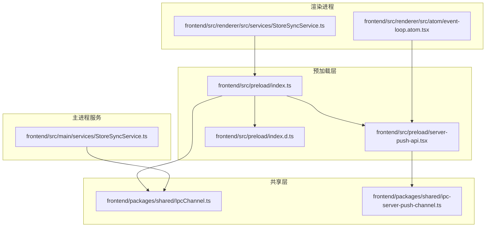
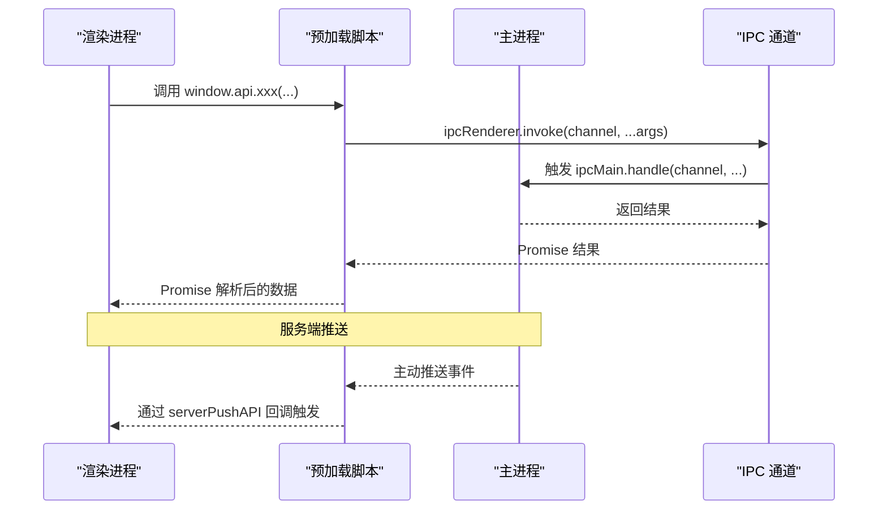
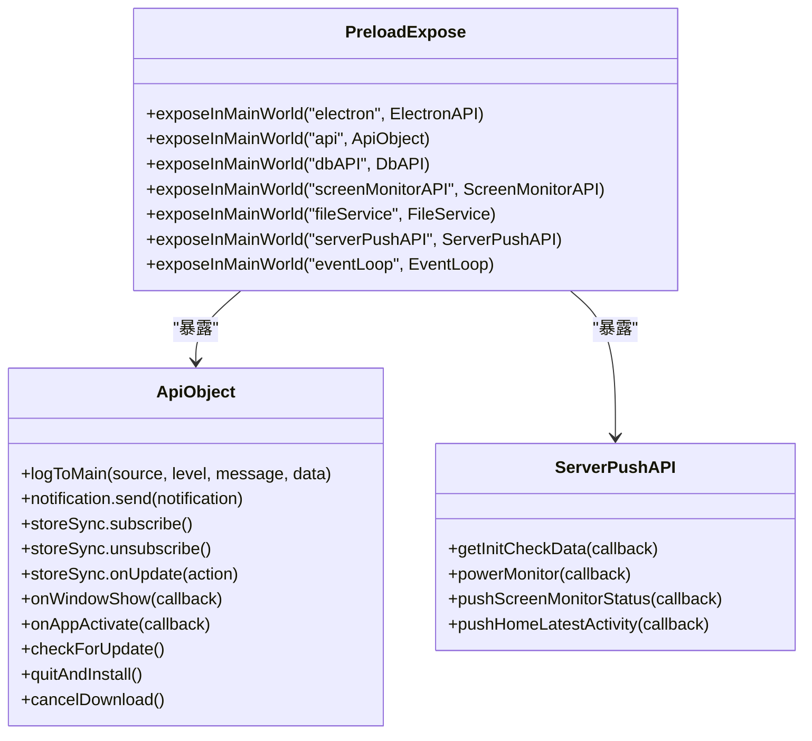
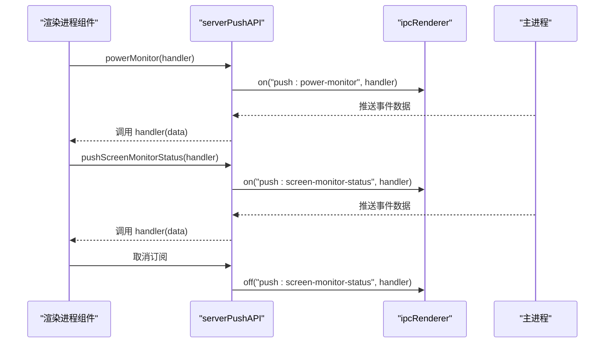
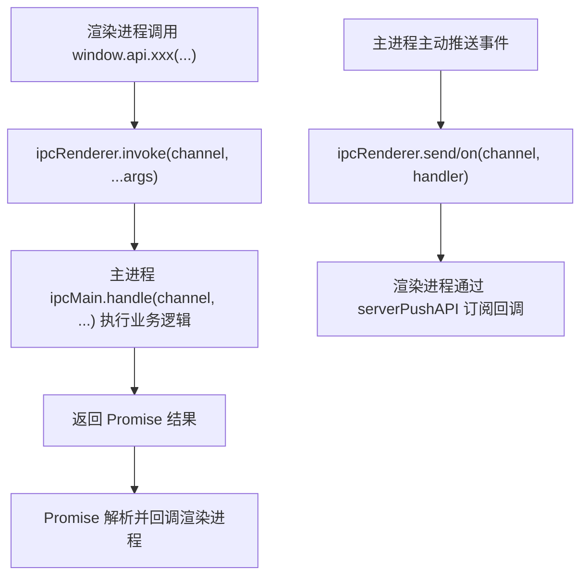
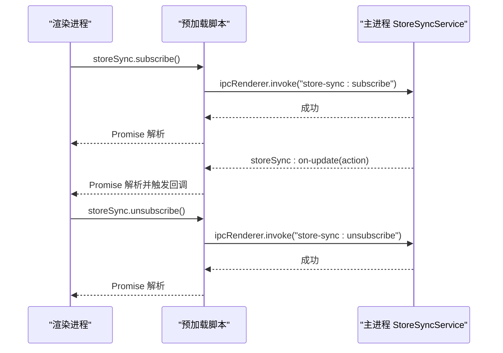
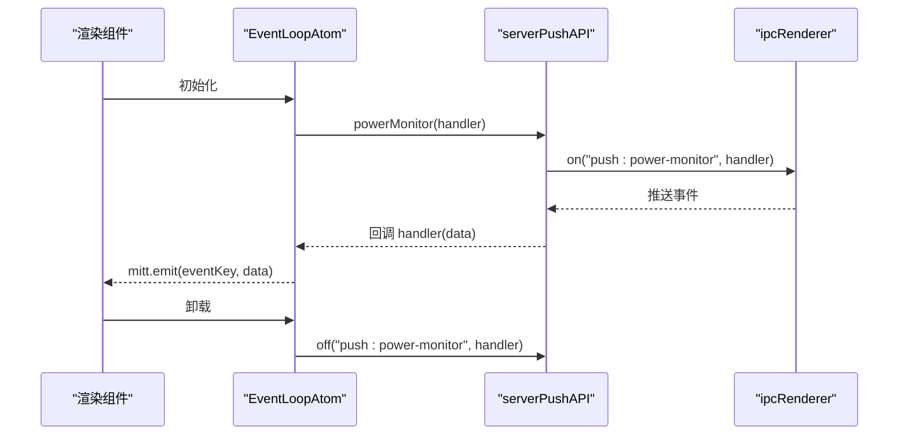
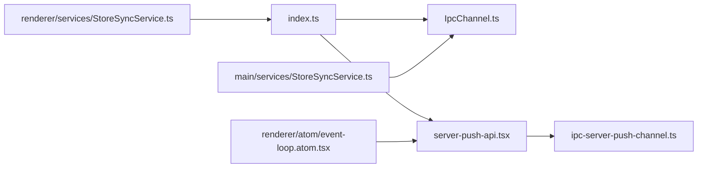

# 预加载脚本

<cite>
**本文引用的文件**
- [frontend/src/preload/index.ts](file://frontend/src/preload/index.ts)
- [frontend/src/preload/server-push-api.tsx](file://frontend/src/preload/server-push-api.tsx)
- [frontend/packages/shared/IpcChannel.ts](file://frontend/packages/shared/IpcChannel.ts)
- [frontend/packages/shared/ipc-server-push-channel.ts](file://frontend/packages/shared/ipc-server-push-channel.ts)
- [frontend/src/preload/index.d.ts](file://frontend/src/preload/index.d.ts)
- [frontend/src/main/services/StoreSyncService.ts](file://frontend/src/main/services/StoreSyncService.ts)
- [frontend/src/renderer/src/atom/event-loop.atom.tsx](file://frontend/src/renderer/src/atom/event-loop.atom.tsx)
- [frontend/src/renderer/src/services/StoreSyncService.ts](file://frontend/src/renderer/src/services/StoreSyncService.ts)
</cite>

## 目录
1. [简介](#简介)
2. [项目结构](#项目结构)
3. [核心组件](#核心组件)
4. [架构总览](#架构总览)
5. [详细组件分析](#详细组件分析)
6. [依赖关系分析](#依赖关系分析)
7. [性能考量](#性能考量)
8. [故障排查指南](#故障排查指南)
9. [结论](#结论)

## 简介
本文件聚焦于 Electron 应用的预加载脚本，系统性阐述其在应用安全模型中的关键作用，以及如何通过预加载脚本安全地向渲染进程暴露 API。重点包括：
- 使用 contextBridge 将受控的 Node.js/Electron 能力暴露到渲染进程，避免直接暴露全局对象导致的远程代码执行风险。
- 通过 IpcChannel 和 ipc-server-push-channel 中的枚举统一定义双向 IPC 通道，确保主进程与渲染进程之间的消息契约清晰、可追踪。
- 服务端推送能力由 server-push-api 实现，渲染进程可通过订阅主进程推送的事件（如电源监控、屏幕录制状态、最新活动等）实现实时更新。
- 提供在预加载脚本中定义安全 API 接口的方法与在渲染进程中调用这些接口的最佳实践路径。

## 项目结构
预加载脚本位于前端子工程的 preload 目录，配合共享的 IPC 通道定义与类型声明，形成“安全桥接 + 双向通信 + 服务端推送”的整体方案。

图表来源
- [frontend/src/preload/index.ts](file://frontend/src/preload/index.ts#L1-L157)
- [frontend/src/preload/server-push-api.tsx](file://frontend/src/preload/server-push-api.tsx#L1-L47)
- [frontend/src/preload/index.d.ts](file://frontend/src/preload/index.d.ts#L1-L47)
- [frontend/packages/shared/IpcChannel.ts](file://frontend/packages/shared/IpcChannel.ts#L1-L349)
- [frontend/packages/shared/ipc-server-push-channel.ts](file://frontend/packages/shared/ipc-server-push-channel.ts#L1-L13)
- [frontend/src/main/services/StoreSyncService.ts](file://frontend/src/main/services/StoreSyncService.ts#L42-L79)
- [frontend/src/renderer/src/atom/event-loop.atom.tsx](file://frontend/src/renderer/src/atom/event-loop.atom.tsx#L1-L32)
- [frontend/src/renderer/src/services/StoreSyncService.ts](file://frontend/src/renderer/src/services/StoreSyncService.ts#L121-L141)

章节来源
- [frontend/src/preload/index.ts](file://frontend/src/preload/index.ts#L1-L157)
- [frontend/src/preload/server-push-api.tsx](file://frontend/src/preload/server-push-api.tsx#L1-L47)
- [frontend/src/preload/index.d.ts](file://frontend/src/preload/index.d.ts#L1-L47)
- [frontend/packages/shared/IpcChannel.ts](file://frontend/packages/shared/IpcChannel.ts#L1-L349)
- [frontend/packages/shared/ipc-server-push-channel.ts](file://frontend/packages/shared/ipc-server-push-channel.ts#L1-L13)

## 核心组件
- 预加载入口：负责在渲染进程上下文中安全地暴露受限 API，包括通用应用控制、数据库操作、屏幕监控、文件服务、事件循环查询以及服务端推送 API。
- 服务端推送 API：封装主进程推送事件的订阅与取消订阅逻辑，屏蔽底层 ipcRenderer 的细节，提供语义化方法。
- IPC 通道定义：集中管理主/渲染进程间的消息通道名称，保证一致性与可维护性。
- 类型声明：为暴露到 window 的 API 提供 TypeScript 声明，提升开发体验与安全性。

章节来源
- [frontend/src/preload/index.ts](file://frontend/src/preload/index.ts#L16-L151)
- [frontend/src/preload/server-push-api.tsx](file://frontend/src/preload/server-push-api.tsx#L1-L47)
- [frontend/packages/shared/IpcChannel.ts](file://frontend/packages/shared/IpcChannel.ts#L1-L349)
- [frontend/packages/shared/ipc-server-push-channel.ts](file://frontend/packages/shared/ipc-server-push-channel.ts#L1-L13)
- [frontend/src/preload/index.d.ts](file://frontend/src/preload/index.d.ts#L1-L47)

## 架构总览
预加载脚本通过 contextBridge 在渲染进程建立“受控 API”面，所有外部调用均经由 ipcRenderer.invoke 或 ipcRenderer.on 进行主/渲染进程间的通信。服务端推送通过 server-push-api 订阅主进程推送事件，渲染侧无需直接接触底层 IPC 细节。

图表来源
- [frontend/src/preload/index.ts](file://frontend/src/preload/index.ts#L16-L151)
- [frontend/packages/shared/IpcChannel.ts](file://frontend/packages/shared/IpcChannel.ts#L1-L349)
- [frontend/src/preload/server-push-api.tsx](file://frontend/src/preload/server-push-api.tsx#L1-L47)

## 详细组件分析

### 预加载脚本安全模型与 API 暴露
- 安全隔离：仅在进程上下文隔离启用时，通过 contextBridge.exposeInMainWorld 将 API 暴露到 window；否则降级为直接挂载，但不暴露完整 Electron 能力。
- 受控 API 面：预加载脚本定义了多个命名空间 API，如 api、dbAPI、screenMonitorAPI、fileService、serverPushAPI、eventLoop，每个命名空间仅暴露必要的方法，避免将 Node/Electron 全部能力暴露给渲染进程。
- 错误处理：对暴露过程进行 try/catch 包裹，避免异常导致整个桥接失败；对日志通道也做了监听与输出。
- 类型声明：通过 index.d.ts 为 window 上的 API 提供类型提示，减少运行期错误。

图表来源
- [frontend/src/preload/index.ts](file://frontend/src/preload/index.ts#L16-L151)
- [frontend/src/preload/index.d.ts](file://frontend/src/preload/index.d.ts#L1-L47)

章节来源
- [frontend/src/preload/index.ts](file://frontend/src/preload/index.ts#L121-L151)
- [frontend/src/preload/index.d.ts](file://frontend/src/preload/index.d.ts#L1-L47)

### 服务端推送 API（server-push-api）
- 设计目标：为渲染进程提供简洁的订阅接口，屏蔽底层 ipcRenderer.on/off 的复杂度，支持多类推送事件。
- 支持事件：
  - 初始化检查数据推送
  - 电源监控事件
  - 屏幕录制状态推送
  - 最新活动推送
- 订阅与取消：返回一个函数用于移除事件监听，便于组件卸载时清理资源。
- 错误处理：对订阅过程进行 try/catch 并记录日志，避免影响其他订阅者。

图表来源
- [frontend/src/preload/server-push-api.tsx](file://frontend/src/preload/server-push-api.tsx#L1-L47)
- [frontend/packages/shared/ipc-server-push-channel.ts](file://frontend/packages/shared/ipc-server-push-channel.ts#L1-L13)

章节来源
- [frontend/src/preload/server-push-api.tsx](file://frontend/src/preload/server-push-api.tsx#L1-L47)
- [frontend/packages/shared/ipc-server-push-channel.ts](file://frontend/packages/shared/ipc-server-push-channel.ts#L1-L13)

### 双向 IPC 通道定义与使用
- IpcChannel：集中定义主/渲染进程间的所有请求/响应通道，涵盖应用控制、通知、文件、备份、数据库、屏幕监控、热图、任务、设置、后端状态等。
- IpcServerPushChannel：集中定义主进程向渲染进程推送的事件通道，如初始化检查数据、电源监控、屏幕录制状态、托盘交互、最新活动等。
- 使用方式：
  - 渲染进程通过 ipcRenderer.invoke 发起请求，主进程通过 ipcMain.handle 处理并返回结果。
  - 主进程通过 ipcRenderer.send 或 ipcRenderer.invoke 主动推送事件，渲染进程通过 serverPushAPI 订阅。

图表来源
- [frontend/packages/shared/IpcChannel.ts](file://frontend/packages/shared/IpcChannel.ts#L1-L349)
- [frontend/packages/shared/ipc-server-push-channel.ts](file://frontend/packages/shared/ipc-server-push-channel.ts#L1-L13)
- [frontend/src/preload/index.ts](file://frontend/src/preload/index.ts#L16-L151)
- [frontend/src/preload/server-push-api.tsx](file://frontend/src/preload/server-push-api.tsx#L1-L47)

章节来源
- [frontend/packages/shared/IpcChannel.ts](file://frontend/packages/shared/IpcChannel.ts#L1-L349)
- [frontend/packages/shared/ipc-server-push-channel.ts](file://frontend/packages/shared/ipc-server-push-channel.ts#L1-L13)
- [frontend/src/preload/index.ts](file://frontend/src/preload/index.ts#L16-L151)

### Store 同步服务（双向通信示例）
- 渲染进程通过 window.api.storeSync.subscribe 订阅状态变更，主进程通过 StoreSyncService 维护订阅集合并在状态变更时广播。
- 主进程对传入 action 做最小验证，避免异常 action 导致崩溃。
- 渲染进程可在组件卸载时调用 window.api.storeSync.unsubscribe 或返回的移除函数清理订阅。

图表来源
- [frontend/src/preload/index.ts](file://frontend/src/preload/index.ts#L16-L44)
- [frontend/src/main/services/StoreSyncService.ts](file://frontend/src/main/services/StoreSyncService.ts#L42-L79)
- [frontend/src/renderer/src/services/StoreSyncService.ts](file://frontend/src/renderer/src/services/StoreSyncService.ts#L121-L141)

章节来源
- [frontend/src/preload/index.ts](file://frontend/src/preload/index.ts#L16-L44)
- [frontend/src/main/services/StoreSyncService.ts](file://frontend/src/main/services/StoreSyncService.ts#L42-L79)
- [frontend/src/renderer/src/services/StoreSyncService.ts](file://frontend/src/renderer/src/services/StoreSyncService.ts#L121-L141)

### 渲染进程中的服务端推送使用示例
- 事件循环原子组件通过 window.serverPushAPI.powerMonitor 订阅电源监控事件，内部使用 mitt 进行事件转发，便于组件内消费。
- 组件卸载时应调用返回的移除函数以取消订阅，避免内存泄漏或重复回调。

图表来源
- [frontend/src/renderer/src/atom/event-loop.atom.tsx](file://frontend/src/renderer/src/atom/event-loop.atom.tsx#L1-L32)
- [frontend/src/preload/server-push-api.tsx](file://frontend/src/preload/server-push-api.tsx#L1-L47)

章节来源
- [frontend/src/renderer/src/atom/event-loop.atom.tsx](file://frontend/src/renderer/src/atom/event-loop.atom.tsx#L1-L32)
- [frontend/src/preload/server-push-api.tsx](file://frontend/src/preload/server-push-api.tsx#L1-L47)

## 依赖关系分析
- 预加载脚本依赖共享的 IPC 通道定义，确保通道名称一致且可维护。
- 服务端推送 API 依赖 IpcServerPushChannel 枚举，保证事件通道的强类型约束。
- 渲染进程通过 window.api 与 window.serverPushAPI 调用预加载脚本暴露的接口，形成清晰的边界。

图表来源
- [frontend/src/preload/index.ts](file://frontend/src/preload/index.ts#L1-L157)
- [frontend/src/preload/server-push-api.tsx](file://frontend/src/preload/server-push-api.tsx#L1-L47)
- [frontend/packages/shared/IpcChannel.ts](file://frontend/packages/shared/IpcChannel.ts#L1-L349)
- [frontend/packages/shared/ipc-server-push-channel.ts](file://frontend/packages/shared/ipc-server-push-channel.ts#L1-L13)
- [frontend/src/renderer/src/atom/event-loop.atom.tsx](file://frontend/src/renderer/src/atom/event-loop.atom.tsx#L1-L32)
- [frontend/src/renderer/src/services/StoreSyncService.ts](file://frontend/src/renderer/src/services/StoreSyncService.ts#L121-L141)
- [frontend/src/main/services/StoreSyncService.ts](file://frontend/src/main/services/StoreSyncService.ts#L42-L79)

章节来源
- [frontend/src/preload/index.ts](file://frontend/src/preload/index.ts#L1-L157)
- [frontend/src/preload/server-push-api.tsx](file://frontend/src/preload/server-push-api.tsx#L1-L47)
- [frontend/packages/shared/IpcChannel.ts](file://frontend/packages/shared/IpcChannel.ts#L1-L349)
- [frontend/packages/shared/ipc-server-push-channel.ts](file://frontend/packages/shared/ipc-server-push-channel.ts#L1-L13)
- [frontend/src/renderer/src/atom/event-loop.atom.tsx](file://frontend/src/renderer/src/atom/event-loop.atom.tsx#L1-L32)
- [frontend/src/renderer/src/services/StoreSyncService.ts](file://frontend/src/renderer/src/services/StoreSyncService.ts#L121-L141)
- [frontend/src/main/services/StoreSyncService.ts](file://frontend/src/main/services/StoreSyncService.ts#L42-L79)

## 性能考量
- 事件订阅与取消：serverPushAPI 返回的移除函数应在组件卸载时调用，避免重复监听导致的内存占用与回调风暴。
- IPC 调用粒度：将高频事件拆分为独立通道，避免单通道承载过多事件造成阻塞。
- 数据最小化：主进程在广播状态变更时尽量传递必要字段，减少序列化与传输开销。
- 日志与错误：预加载脚本对暴露过程与推送订阅进行错误捕获与日志记录，有助于定位性能瓶颈与异常。

[本节为通用指导，不直接分析具体文件]

## 故障排查指南
- 预加载暴露失败：检查 contextIsolated 条件与 try/catch 包裹，确认未抛出异常；查看控制台错误输出。
- IPC 通道不匹配：核对 IpcChannel 与 IpcServerPushChannel 的枚举值是否与主进程 ipcMain.handle 或推送调用一致。
- 订阅无回调：确认渲染进程已正确调用 serverPushAPI 的订阅方法并传入回调；检查主进程是否确实在推送对应事件。
- 订阅无法取消：确保调用了返回的移除函数，或在组件卸载时显式调用 window.api.storeSync.unsubscribe。
- Store 同步异常：检查主进程对 action 的最小验证逻辑，避免非法 action 导致广播失败。

章节来源
- [frontend/src/preload/index.ts](file://frontend/src/preload/index.ts#L121-L151)
- [frontend/src/preload/server-push-api.tsx](file://frontend/src/preload/server-push-api.tsx#L1-L47)
- [frontend/src/main/services/StoreSyncService.ts](file://frontend/src/main/services/StoreSyncService.ts#L42-L79)
- [frontend/src/renderer/src/services/StoreSyncService.ts](file://frontend/src/renderer/src/services/StoreSyncService.ts#L121-L141)

## 结论
预加载脚本通过 contextBridge 在渲染进程与主进程之间建立了“受控 API 面”，既满足功能需求，又有效降低远程代码执行风险。借助 IpcChannel 与 IpcServerPushChannel 的集中定义，系统实现了清晰、可维护的双向通信与服务端推送机制。渲染进程通过 window.api 与 window.serverPushAPI 调用预加载暴露的接口，即可安全地访问受限的 Node/Electron 能力并订阅实时事件，从而构建高性能、低耦合的应用架构。