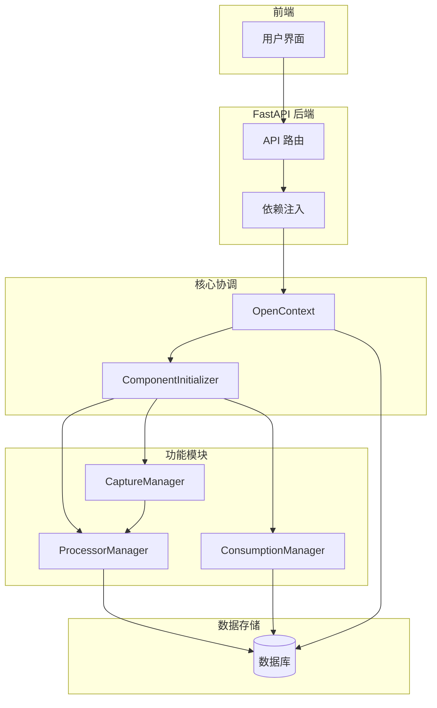
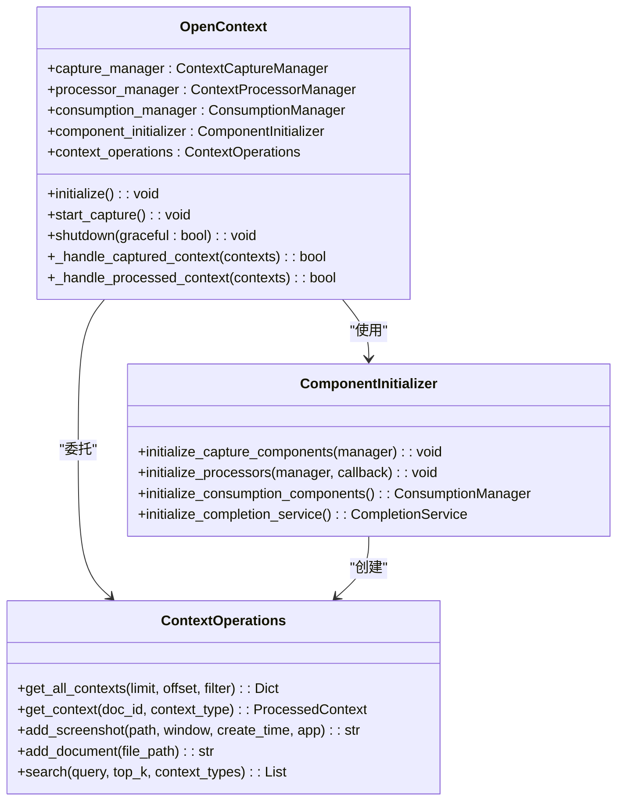
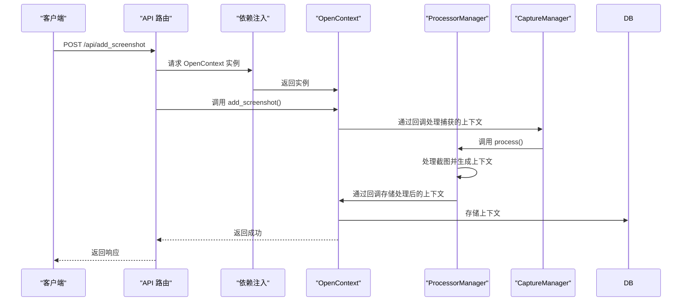
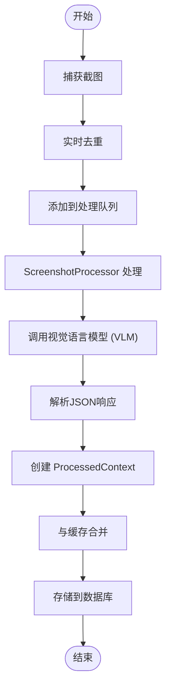
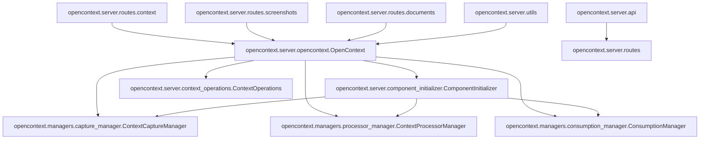

# 后端架构

<cite>
**本文档中引用的文件**   
- [opencontext.py](file://opencontext/server/opencontext.py)
- [component_initializer.py](file://opencontext/server/component_initializer.py)
- [api.py](file://opencontext/server/api.py)
- [capture_manager.py](file://opencontext/managers/capture_manager.py)
- [processor_manager.py](file://opencontext/managers/processor_manager.py)
- [consumption_manager.py](file://opencontext/managers/consumption_manager.py)
- [screenshot_processor.py](file://opencontext/context_processing/processor/screenshot_processor.py)
- [document_processor.py](file://opencontext/context_processing/processor/document_processor.py)
- [context.py](file://opencontext/server/routes/context.py)
- [screenshots.py](file://opencontext/server/routes/screenshots.py)
- [documents.py](file://opencontext/server/routes/documents.py)
- [utils.py](file://opencontext/server/utils.py)
- [cli.py](file://opencontext/cli.py)
</cite>

## 目录
1. [简介](#简介)
2. [核心组件](#核心组件)
3. [架构概览](#架构概览)
4. [详细组件分析](#详细组件分析)
5. [依赖分析](#依赖分析)
6. [性能考量](#性能考量)
7. [故障排除指南](#故障排除指南)
8. [结论](#结论)

## 简介
本文档深入解析了基于FastAPI的Python后端服务架构。该系统以`OpenContext`类为核心协调者，通过`ComponentInitializer`初始化并管理`CaptureManager`、`ProcessorManager`和`ConsumptionManager`等关键模块。文档详细阐述了`api.py`中定义的路由系统如何将HTTP请求分发到各个功能模块，并解释了`_handle_captured_context`和`_handle_processed_context`两个回调函数在数据流中的关键作用。此外，文档还讨论了FastAPI依赖注入系统如何通过`get_context_lab`为所有路由提供`OpenContext`实例。

**Section sources**
- [opencontext.py](file://opencontext/server/opencontext.py#L1-L300)
- [cli.py](file://opencontext/cli.py#L1-L284)

## 核心组件

`OpenContext`是整个系统的入口点和核心协调者，负责集成所有组件并提供统一的API。它在初始化时创建`CaptureManager`和`ProcessorManager`实例，并通过`ComponentInitializer`来初始化所有其他组件。`OpenContext`还维护了`ConsumptionManager`、`workflow_engine`和`completion_service`等可选组件的引用。

`ComponentInitializer`负责以正确的顺序初始化所有组件。它从全局配置中读取配置信息，并根据配置动态创建和注册捕获组件、处理器和消费组件。这种设计实现了关注点分离，使`OpenContext`类更加简洁和易于维护。

`api.py`文件定义了主路由配置，通过`APIRouter`将所有路由模块（如健康检查、上下文管理、内容生成等）聚合在一起。FastAPI的依赖注入系统确保所有路由都能访问到同一个`OpenContext`实例。

**Section sources**
- [opencontext.py](file://opencontext/server/opencontext.py#L31-L299)
- [component_initializer.py](file://opencontext/server/component_initializer.py#L52-L229)
- [api.py](file://opencontext/server/api.py#L1-L58)

## 架构概览

**Diagram sources **
- [opencontext.py](file://opencontext/server/opencontext.py#L31-L299)
- [component_initializer.py](file://opencontext/server/component_initializer.py#L52-L229)
- [api.py](file://opencontext/server/api.py#L1-L58)

## 详细组件分析

### OpenContext 核心协调者分析

`OpenContext`类作为系统的中心枢纽，其主要职责是初始化和协调所有其他组件。在`initialize()`方法中，它首先初始化全局单例（如`GlobalConfig`、`GlobalStorage`），然后通过`ComponentInitializer`来设置捕获、处理和消费组件。

**Diagram sources **
- [opencontext.py](file://opencontext/server/opencontext.py#L31-L299)
- [component_initializer.py](file://opencontext/server/component_initializer.py#L52-L229)
- [context_operations.py](file://opencontext/server/context_operations.py#L1-L224)

### 路由与依赖注入分析

FastAPI的依赖注入系统是连接HTTP请求与后端业务逻辑的关键。`get_context_lab`函数作为依赖项，从`request.app.state`中获取`OpenContext`实例，确保所有路由都能访问到同一个系统实例。

**Diagram sources **
- [utils.py](file://opencontext/server/utils.py#L1-L41)
- [screenshots.py](file://opencontext/server/routes/screenshots.py#L1-L71)
- [opencontext.py](file://opencontext/server/opencontext.py#L103-L139)

### 数据处理流程分析

系统处理一个屏幕截图的完整流程涉及多个组件的协作。从捕获到存储，数据流经了捕获、处理和存储三个主要阶段。

**Diagram sources **
- [screenshot_processor.py](file://opencontext/context_processing/processor/screenshot_processor.py#L1-L590)
- [capture_manager.py](file://opencontext/managers/capture_manager.py#L1-L391)
- [processor_manager.py](file://opencontext/managers/processor_manager.py#L1-L213)

## 依赖分析

**Diagram sources **
- [opencontext.py](file://opencontext/server/opencontext.py#L1-L300)
- [component_initializer.py](file://opencontext/server/component_initializer.py#L1-L229)
- [api.py](file://opencontext/server/api.py#L1-L58)

## 性能考量

系统在设计时考虑了多个性能优化点。`ProcessorManager`使用`ThreadPoolExecutor`进行批量处理，提高了处理效率。`ScreenshotProcessor`采用后台线程模型，将处理任务放入队列异步执行，避免阻塞主线程。此外，系统实现了基于pHash的实时去重机制，减少了不必要的处理开销。

**Section sources**
- [processor_manager.py](file://opencontext/managers/processor_manager.py#L1-L213)
- [screenshot_processor.py](file://opencontext/context_processing/processor/screenshot_processor.py#L1-L590)

## 故障排除指南

当系统出现故障时，应首先检查`OpenContext`的健康状态。通过`check_components_health()`方法可以获取配置、存储、LLM、捕获和消费等组件的健康状况。如果某个组件初始化失败，日志中通常会有详细的错误信息。对于数据处理问题，可以检查`ProcessorManager`和`CaptureManager`的统计信息，了解处理成功率和错误情况。

**Section sources**
- [opencontext.py](file://opencontext/server/opencontext.py#L260-L269)
- [capture_manager.py](file://opencontext/managers/capture_manager.py#L1-L391)
- [processor_manager.py](file://opencontext/managers/processor_manager.py#L1-L213)

## 结论

该后端架构设计良好，通过`OpenContext`核心类实现了组件的集中管理和协调。`ComponentInitializer`的引入使得组件初始化逻辑清晰且可维护。FastAPI的依赖注入系统有效地将HTTP请求与业务逻辑解耦。整个系统从数据捕获、处理到存储形成了一个完整的闭环，为上下文感知应用提供了坚实的基础。