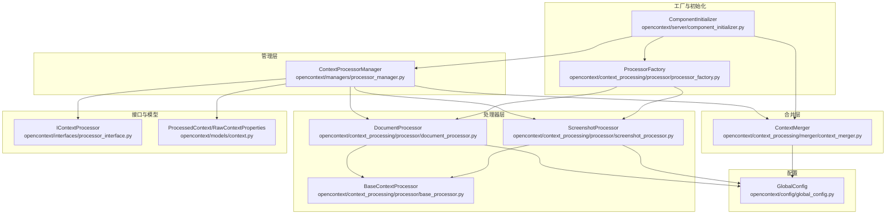
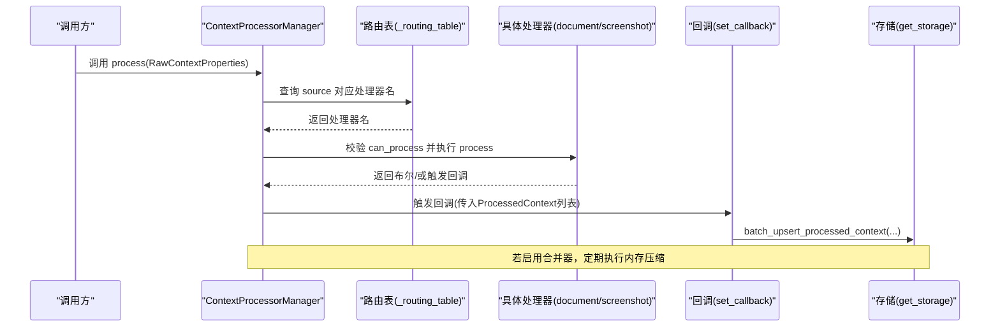
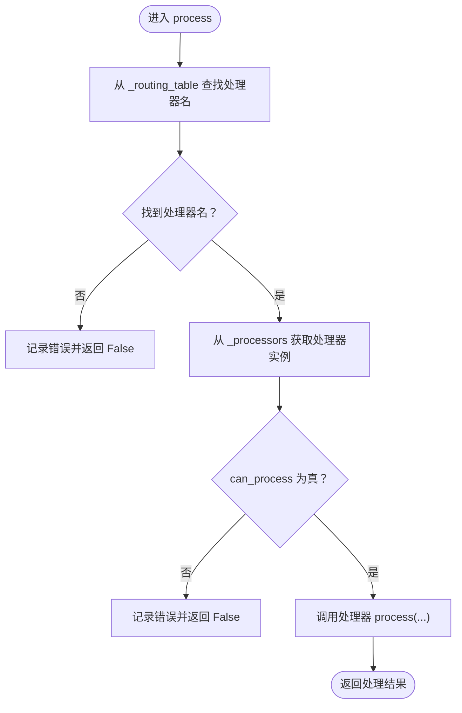
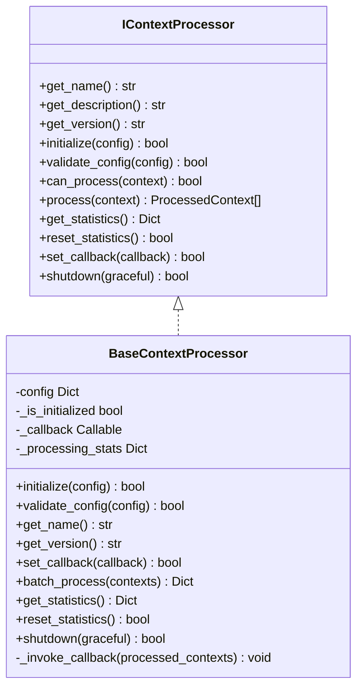
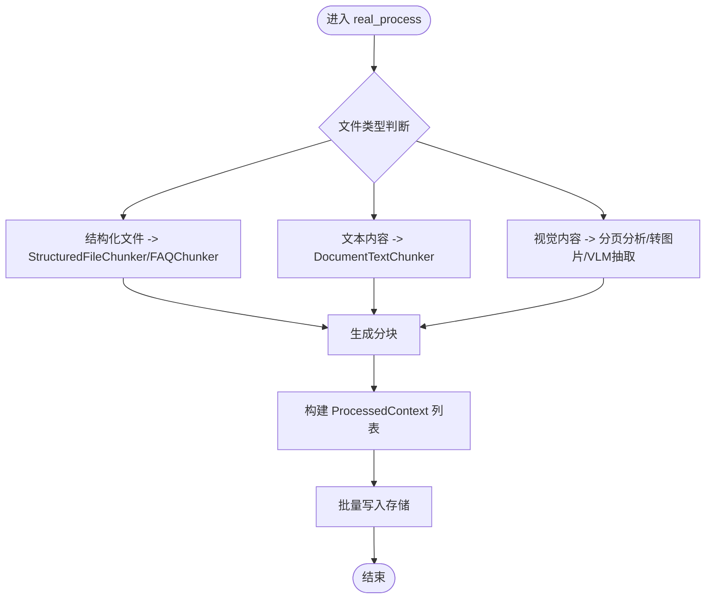
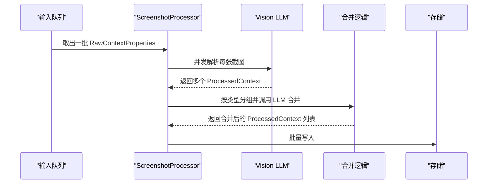
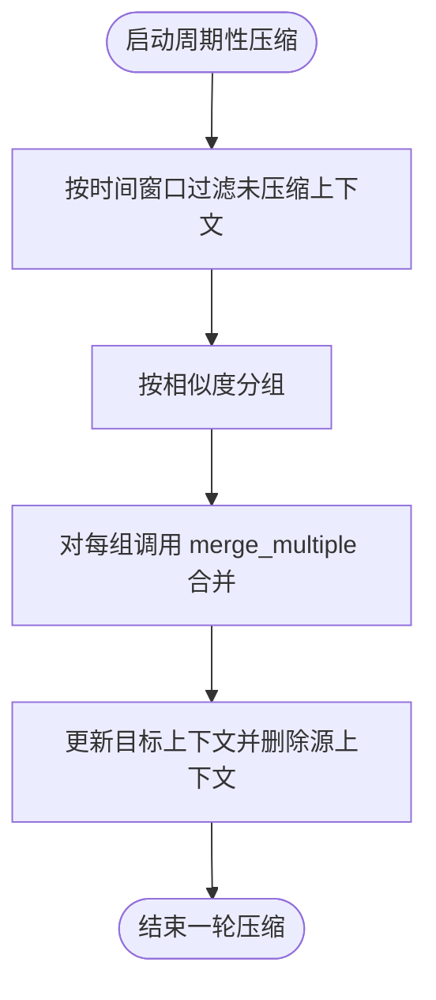
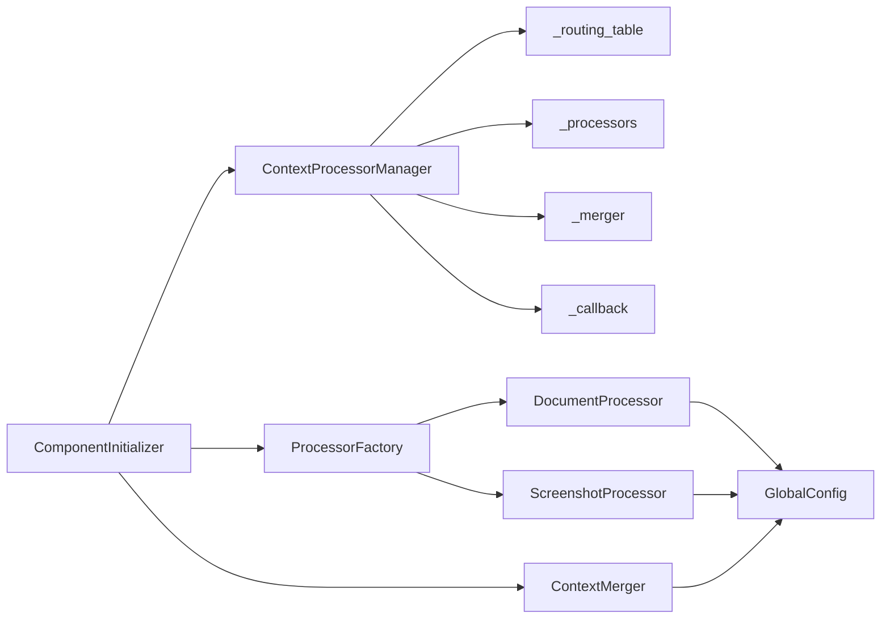

# 处理管理器

<cite>
**本文引用的文件列表**
- [processor_manager.py](file://opencontext/managers/processor_manager.py)
- [base_processor.py](file://opencontext/context_processing/processor/base_processor.py)
- [document_processor.py](file://opencontext/context_processing/processor/document_processor.py)
- [screenshot_processor.py](file://opencontext/context_processing/processor/screenshot_processor.py)
- [context_merger.py](file://opencontext/context_processing/merger/context_merger.py)
- [processor_interface.py](file://opencontext/interfaces/processor_interface.py)
- [context.py](file://opencontext/models/context.py)
- [processor_factory.py](file://opencontext/context_processing/processor/processor_factory.py)
- [component_initializer.py](file://opencontext/server/component_initializer.py)
- [global_config.py](file://opencontext/config/global_config.py)
</cite>

## 目录
1. [简介](#简介)
2. [项目结构](#项目结构)
3. [核心组件](#核心组件)
4. [架构总览](#架构总览)
5. [详细组件分析](#详细组件分析)
6. [依赖关系分析](#依赖关系分析)
7. [性能与并发特性](#性能与并发特性)
8. [故障排查指南](#故障排查指南)
9. [结论](#结论)
10. [附录：扩展与自定义指南](#附录扩展与自定义指南)

## 简介
本文件围绕 ContextProcessorManager 类，系统化阐述其如何协调上下文处理流程，包括：
- 基于 _routing_table 的路由机制，依据 RawContextProperties 的 source 类型（如 SCREENSHOT、LOCAL_FILE）动态选择 document_processor 或 screenshot_processor；
- _set_merger 机制如何集成上下文合并功能；
- _start_periodic_compression 定时任务如何触发 merger 的内存压缩；
- _processor 与 _merger 之间的协作关系；
- 如何通过 _set_callback 将 ProcessedContext 传递给上层存储模块进行持久化；
- 处理链扩展与自定义 IContextProcessor 实现的开发指南。

## 项目结构
与处理管理器直接相关的模块分布如下：
- 管理层：ContextProcessorManager（opencontext/managers/processor_manager.py）
- 处理器基类与具体处理器：BaseContextProcessor、DocumentProcessor、ScreenshotProcessor（opencontext/context_processing/processor/*）
- 合并器：ContextMerger（opencontext/context_processing/merger/context_merger.py）
- 接口与数据模型：IContextProcessor、ProcessedContext、RawContextProperties（opencontext/interfaces/processor_interface.py, opencontext/models/context.py）
- 工厂与初始化：ProcessorFactory、ComponentInitializer（opencontext/context_processing/processor/processor_factory.py, opencontext/server/component_initializer.py）
- 全局配置：GlobalConfig（opencontext/config/global_config.py）

图表来源
- [processor_manager.py](file://opencontext/managers/processor_manager.py#L1-L213)
- [base_processor.py](file://opencontext/context_processing/processor/base_processor.py#L1-L261)
- [document_processor.py](file://opencontext/context_processing/processor/document_processor.py#L1-L653)
- [screenshot_processor.py](file://opencontext/context_processing/processor/screenshot_processor.py#L1-L590)
- [context_merger.py](file://opencontext/context_processing/merger/context_merger.py#L1-L981)
- [processor_interface.py](file://opencontext/interfaces/processor_interface.py#L1-L136)
- [context.py](file://opencontext/models/context.py#L1-L343)
- [processor_factory.py](file://opencontext/context_processing/processor/processor_factory.py#L1-L175)
- [component_initializer.py](file://opencontext/server/component_initializer.py#L1-L229)
- [global_config.py](file://opencontext/config/global_config.py#L1-L331)

章节来源
- [processor_manager.py](file://opencontext/managers/processor_manager.py#L1-L213)
- [processor_factory.py](file://opencontext/context_processing/processor/processor_factory.py#L1-L175)
- [component_initializer.py](file://opencontext/server/component_initializer.py#L1-L229)

## 核心组件
- ContextProcessorManager：统一调度多个处理器，维护路由表、回调、合并器与周期性压缩任务；提供单输入与批量处理入口。
- BaseContextProcessor：所有处理器的抽象基类，提供统计、配置、回调、批处理等通用能力。
- DocumentProcessor：文档类上下文处理，支持结构化/文本/视觉内容，异步批处理与分块。
- ScreenshotProcessor：截图类上下文处理，包含去重、批处理、实体刷新与合并。
- ContextMerger：上下文合并器，提供智能合并、相似度合并、周期性内存压缩等能力。
- IContextProcessor：处理器接口规范。
- ProcessedContext/RawContextProperties：上下文数据模型。
- ProcessorFactory：处理器工厂，负责注册与创建处理器实例。
- ComponentInitializer：组件初始化器，负责创建处理器与合并器并注入回调。

章节来源
- [processor_manager.py](file://opencontext/managers/processor_manager.py#L21-L213)
- [base_processor.py](file://opencontext/context_processing/processor/base_processor.py#L1-L261)
- [document_processor.py](file://opencontext/context_processing/processor/document_processor.py#L1-L653)
- [screenshot_processor.py](file://opencontext/context_processing/processor/screenshot_processor.py#L1-L590)
- [context_merger.py](file://opencontext/context_processing/merger/context_merger.py#L1-L981)
- [processor_interface.py](file://opencontext/interfaces/processor_interface.py#L1-L136)
- [context.py](file://opencontext/models/context.py#L1-L343)
- [processor_factory.py](file://opencontext/context_processing/processor/processor_factory.py#L1-L175)
- [component_initializer.py](file://opencontext/server/component_initializer.py#L120-L175)

## 架构总览
ContextProcessorManager 作为中枢，通过 _routing_table 将不同来源的 RawContextProperties 路由到对应处理器；处理器完成处理后，通过回调将 ProcessedContext 交由上层存储模块持久化；同时，若配置启用合并器，则由 ContextMerger 执行相似上下文的合并与周期性内存压缩。

图表来源
- [processor_manager.py](file://opencontext/managers/processor_manager.py#L132-L159)
- [document_processor.py](file://opencontext/context_processing/processor/document_processor.py#L186-L223)
- [screenshot_processor.py](file://opencontext/context_processing/processor/screenshot_processor.py#L149-L235)
- [context_merger.py](file://opencontext/context_processing/merger/context_merger.py#L462-L547)

## 详细组件分析

### ContextProcessorManager：路由与调度
- 路由机制：_routing_table 将 ContextSource 映射到处理器名称，如 SCREENSHOT -> "screenshot_processor"，LOCAL_FILE/VAULT/WEB_LINK -> "document_processor"。
- 单输入处理：process 方法根据路由选择处理器，校验 can_process 后执行 process；异常捕获并返回失败。
- 批量处理：batch_process 使用线程池并发调用 process，聚合结果。
- 统计与生命周期：get_statistics、reset_statistics、shutdown。
- 回调与合并器：set_callback 设置回调；set_merger 注入合并器；start_periodic_compression 启动定时压缩任务。

图表来源
- [processor_manager.py](file://opencontext/managers/processor_manager.py#L132-L159)

章节来源
- [processor_manager.py](file://opencontext/managers/processor_manager.py#L87-L115)
- [processor_manager.py](file://opencontext/managers/processor_manager.py#L132-L159)
- [processor_manager.py](file://opencontext/managers/processor_manager.py#L161-L179)
- [processor_manager.py](file://opencontext/managers/processor_manager.py#L181-L213)

### 处理器基类：通用能力与回调
- 统计：processed_count、contexts_generated_count、error_count。
- 配置：initialize/validate_config/get_version。
- 回调：set_callback/_invoke_callback，用于将处理结果回传给上层。
- 批处理：batch_process 自动聚合结果并更新统计。

图表来源
- [processor_interface.py](file://opencontext/interfaces/processor_interface.py#L1-L136)
- [base_processor.py](file://opencontext/context_processing/processor/base_processor.py#L1-L261)

章节来源
- [base_processor.py](file://opencontext/context_processing/processor/base_processor.py#L1-L261)
- [processor_interface.py](file://opencontext/interfaces/processor_interface.py#L1-L136)

### 文档处理器：结构化/文本/视觉内容处理
- 能力范围：支持结构化文件（XLSX/CSV/JSONL）、文本（TXT/MD）、视觉（PDF/DOCX/图片/PPT）。
- 内部队列与后台线程：使用队列与线程循环消费，避免阻塞主线程。
- 分块与向量化：根据文件类型选择 StructuredFileChunker、FAQChunker 或 DocumentTextChunker。
- VLM 集成：对视觉内容采用异步 VLM 抽取文本，再进行分块与上下文生成。
- 存储：处理完成后通过全局存储批量写入。

图表来源
- [document_processor.py](file://opencontext/context_processing/processor/document_processor.py#L223-L302)
- [document_processor.py](file://opencontext/context_processing/processor/document_processor.py#L312-L402)
- [document_processor.py](file://opencontext/context_processing/processor/document_processor.py#L404-L545)
- [document_processor.py](file://opencontext/context_processing/processor/document_processor.py#L546-L653)

章节来源
- [document_processor.py](file://opencontext/context_processing/processor/document_processor.py#L1-L653)

### 截图处理器：去重、批处理与合并
- 去重：基于感知哈希（phash）阈值判断重复，支持可选删除重复文件。
- 批处理：异步并发调用 Vision LLM，解析多张截图并生成 ProcessedContext。
- 合并：按上下文类型分组，调用 LLM 进行合并，支持“合并”和“新增”两种模式，随后实体刷新与向量化。
- 存储：将处理结果写入缓存并在后台统一落盘。

图表来源
- [screenshot_processor.py](file://opencontext/context_processing/processor/screenshot_processor.py#L149-L235)
- [screenshot_processor.py](file://opencontext/context_processing/processor/screenshot_processor.py#L236-L335)
- [screenshot_processor.py](file://opencontext/context_processing/processor/screenshot_processor.py#L336-L531)

章节来源
- [screenshot_processor.py](file://opencontext/context_processing/processor/screenshot_processor.py#L1-L590)

### 合并器：相似度与智能合并、周期性压缩
- 目标查找：先尝试智能策略（按类型），否则回退到关联/相似度策略。
- 合并策略：优先使用类型感知策略，否则回退到 LLM 合并。
- 周期性压缩：按时间窗口筛选未压缩且可合并的上下文，按相似度分组，将旧上下文合并到最新上下文并删除源上下文。
- 统计与清理：提供合并统计、智能清理与记忆强化接口。

图表来源
- [context_merger.py](file://opencontext/context_processing/merger/context_merger.py#L462-L547)

章节来源
- [context_merger.py](file://opencontext/context_processing/merger/context_merger.py#L1-L981)

### 回调与存储：ProcessedContext 的落地
- 回调设置：在初始化阶段通过 ComponentInitializer 将回调注入处理器，处理器在处理完成后调用回调。
- 存储写入：处理器内部通过全局存储批量写入 ProcessedContext，确保一致性与性能。

章节来源
- [component_initializer.py](file://opencontext/server/component_initializer.py#L139-L171)
- [base_processor.py](file://opencontext/context_processing/processor/base_processor.py#L216-L245)
- [document_processor.py](file://opencontext/context_processing/processor/document_processor.py#L214-L223)
- [screenshot_processor.py](file://opencontext/context_processing/processor/screenshot_processor.py#L204-L214)

## 依赖关系分析
- ContextProcessorManager 依赖：
  - _routing_table：将 ContextSource 映射到处理器名称；
  - _processors：已注册处理器集合；
  - _merger：合并器实例；
  - _callback：处理完成后的回调函数；
  - 线程锁与定时器：保证并发安全与周期任务。
- 处理器依赖：
  - BaseContextProcessor 提供统一接口与通用能力；
  - DocumentProcessor/ScreenshotProcessor 依赖全局配置、提示词、存储与 LLM；
  - ProcessorFactory 负责处理器实例化；
  - ComponentInitializer 负责装配处理器与合并器，并注入回调。
- 合并器依赖：
  - 策略工厂与跨类型关系管理；
  - 全局嵌入客户端与提示词管理；
  - 存储后端以执行查询与写入。

图表来源
- [processor_manager.py](file://opencontext/managers/processor_manager.py#L28-L45)
- [processor_factory.py](file://opencontext/context_processing/processor/processor_factory.py#L45-L87)
- [component_initializer.py](file://opencontext/server/component_initializer.py#L139-L171)
- [global_config.py](file://opencontext/config/global_config.py#L236-L262)

章节来源
- [processor_manager.py](file://opencontext/managers/processor_manager.py#L28-L45)
- [processor_factory.py](file://opencontext/context_processing/processor/processor_factory.py#L1-L175)
- [component_initializer.py](file://opencontext/server/component_initializer.py#L120-L175)
- [global_config.py](file://opencontext/config/global_config.py#L1-L331)

## 性能与并发特性
- 并发处理：ContextProcessorManager 的批量处理使用线程池，提高吞吐量。
- 异步与批处理：DocumentProcessor 与 ScreenshotProcessor 内部使用队列与后台线程，减少主线程阻塞；ScreenshotProcessor 使用异步 VLM 并发处理。
- 去重与缓存：ScreenshotProcessor 使用 phash 缓存与去重，降低重复计算与存储压力。
- 周期性压缩：ContextMerger 的周期性压缩按时间窗口分批处理，避免一次性大负载。

章节来源
- [processor_manager.py](file://opencontext/managers/processor_manager.py#L161-L179)
- [document_processor.py](file://opencontext/context_processing/processor/document_processor.py#L197-L223)
- [screenshot_processor.py](file://opencontext/context_processing/processor/screenshot_processor.py#L172-L235)
- [context_merger.py](file://opencontext/context_processing/merger/context_merger.py#L462-L547)

## 故障排查指南
- 路由失败：检查 _routing_table 是否包含对应 ContextSource；确认处理器是否已注册。
- 处理器不可用：确认 can_process 返回值与处理器是否已初始化；查看日志中的错误信息。
- 回调未触发：确认已通过 set_callback 注入回调；检查处理器内部是否调用 _invoke_callback。
- 存储异常：关注处理器写入存储时的日志；检查存储后端可用性与权限。
- 周期性压缩无效：确认已调用 start_periodic_compression；检查定时器状态与合并器是否支持 periodic_memory_compression。

章节来源
- [processor_manager.py](file://opencontext/managers/processor_manager.py#L132-L159)
- [base_processor.py](file://opencontext/context_processing/processor/base_processor.py#L216-L245)
- [context_merger.py](file://opencontext/context_processing/merger/context_merger.py#L462-L547)

## 结论
ContextProcessorManager 通过清晰的路由表与回调机制，将不同来源的上下文请求分派至合适的处理器；处理器内部采用异步与批处理优化性能；合并器提供智能合并与周期性压缩，有效控制内存占用与冗余。整体设计具备良好的扩展性与可维护性。

## 附录：扩展与自定义指南

### 开发自定义 IContextProcessor
- 实现步骤
  - 新建类继承 BaseContextProcessor；
  - 实现 get_name/get_description/can_process/process 等抽象方法；
  - 如需批处理，可复用 batch_process 的聚合逻辑；
  - 如需回调，使用 set_callback 注入回调函数，处理完成后调用 _invoke_callback。
- 配置与依赖
  - 处理器构造函数中通过 GlobalConfig.get_config("processing.<your_processor>") 获取配置；
  - 依赖注入：处理器参数为空，依赖从全局配置自动获取。
- 注册与使用
  - 通过 ProcessorFactory.register_processor_type 注册新处理器类型；
  - 在 ComponentInitializer.initialize_processors 中创建并注册处理器实例，设置回调。

章节来源
- [base_processor.py](file://opencontext/context_processing/processor/base_processor.py#L1-L261)
- [processor_interface.py](file://opencontext/interfaces/processor_interface.py#L1-L136)
- [processor_factory.py](file://opencontext/context_processing/processor/processor_factory.py#L62-L87)
- [component_initializer.py](file://opencontext/server/component_initializer.py#L139-L171)
- [global_config.py](file://opencontext/config/global_config.py#L236-L262)