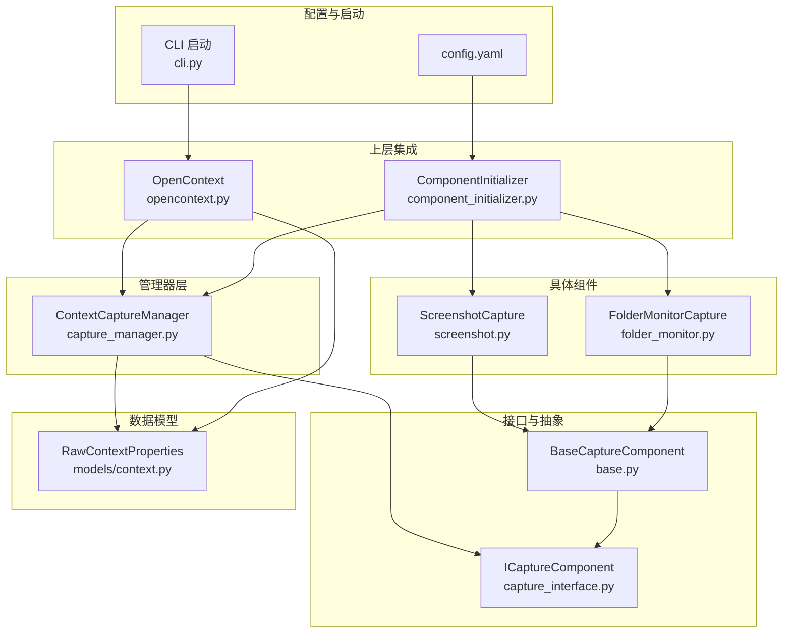
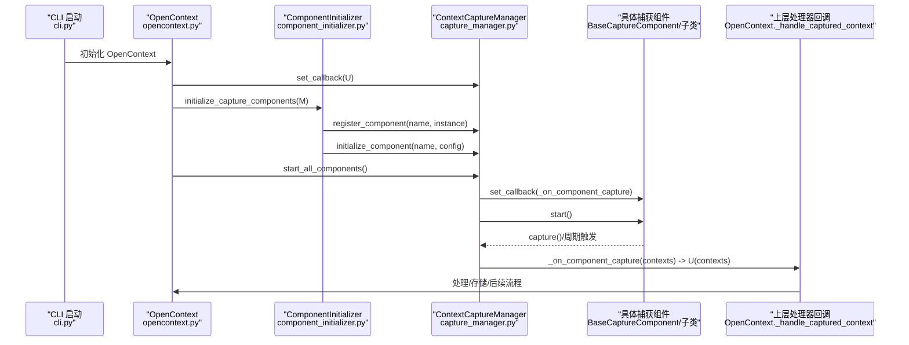
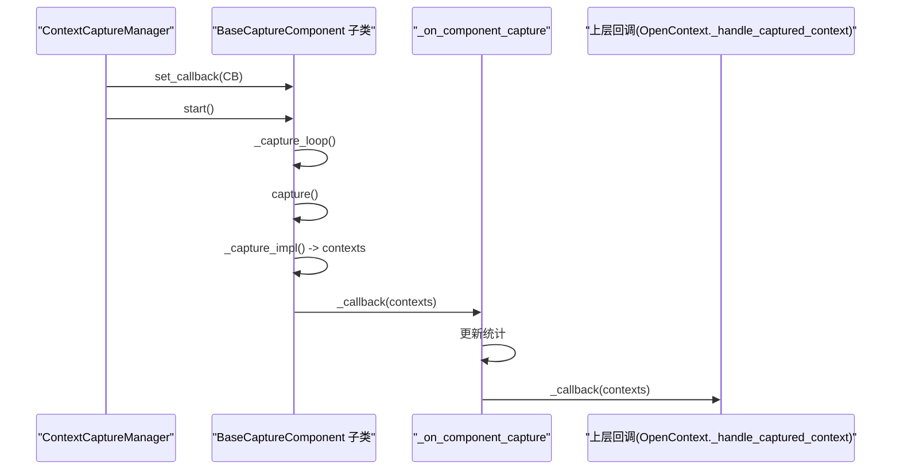
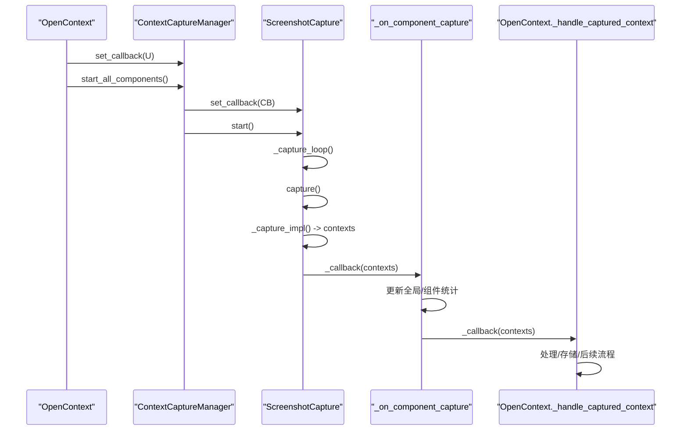
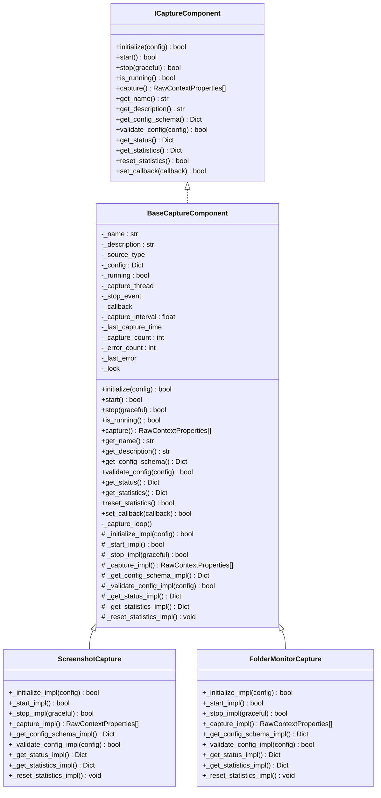
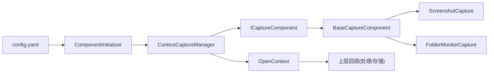

# 捕获管理器

<cite>
**本文引用的文件**
- [opencontext/managers/capture_manager.py](file://opencontext/managers/capture_manager.py)
- [opencontext/interfaces/capture_interface.py](file://opencontext/interfaces/capture_interface.py)
- [opencontext/context_capture/base.py](file://opencontext/context_capture/base.py)
- [opencontext/context_capture/screenshot.py](file://opencontext/context_capture/screenshot.py)
- [opencontext/context_capture/folder_monitor.py](file://opencontext/context_capture/folder_monitor.py)
- [opencontext/models/context.py](file://opencontext/models/context.py)
- [opencontext/server/opencontext.py](file://opencontext/server/opencontext.py)
- [opencontext/server/component_initializer.py](file://opencontext/server/component_initializer.py)
- [config/config.yaml](file://config/config.yaml)
- [opencontext/cli.py](file://opencontext/cli.py)
</cite>

## 目录
1. [简介](#简介)
2. [项目结构](#项目结构)
3. [核心组件](#核心组件)
4. [架构总览](#架构总览)
5. [详细组件分析](#详细组件分析)
6. [依赖关系分析](#依赖关系分析)
7. [性能考量](#性能考量)
8. [故障排查指南](#故障排查指南)
9. [结论](#结论)
10. [附录：自定义ICaptureComponent扩展指南](#附录自定义icapturecomponent扩展指南)

## 简介
本文件围绕 ContextCaptureManager 类，系统性阐述其作为“上下文捕获组件协调中心”的职责与实现，重点覆盖以下方面：
- 注册、初始化与启动捕获组件的生命周期管理机制
- _register_component、_initialize_component、_start_component 的实现细节
- _set_callback 机制如何将捕获到的 RawContextProperties 数据传递给上层处理器
- _start_component 中通过 _set_callback(self._on_component_capture) 建立的回调链路，以及 _on_component_capture 如何更新统计信息并触发 OpenContext._handle_captured_context 回调
- 使用序列图展示从屏幕截图捕获到数据回调的完整流程
- 提供自定义 ICaptureComponent 实现的扩展指南

## 项目结构
与捕获管理器直接相关的模块组织如下：
- 管理器层：opencontext/managers/capture_manager.py
- 接口层：opencontext/interfaces/capture_interface.py
- 抽象基类：opencontext/context_capture/base.py
- 具体组件：opencontext/context_capture/screenshot.py、opencontext/context_capture/folder_monitor.py
- 数据模型：opencontext/models/context.py
- 上层集成：opencontext/server/opencontext.py、opencontext/server/component_initializer.py
- 配置：config/config.yaml
- CLI 启动：opencontext/cli.py

图表来源
- [opencontext/managers/capture_manager.py](file://opencontext/managers/capture_manager.py#L1-L391)
- [opencontext/interfaces/capture_interface.py](file://opencontext/interfaces/capture_interface.py#L1-L153)
- [opencontext/context_capture/base.py](file://opencontext/context_capture/base.py#L1-L515)
- [opencontext/context_capture/screenshot.py](file://opencontext/context_capture/screenshot.py#L1-L508)
- [opencontext/context_capture/folder_monitor.py](file://opencontext/context_capture/folder_monitor.py#L1-L472)
- [opencontext/models/context.py](file://opencontext/models/context.py#L1-L343)
- [opencontext/server/opencontext.py](file://opencontext/server/opencontext.py#L1-L300)
- [opencontext/server/component_initializer.py](file://opencontext/server/component_initializer.py#L1-L229)
- [config/config.yaml](file://config/config.yaml#L1-L253)
- [opencontext/cli.py](file://opencontext/cli.py#L1-L284)

章节来源
- [opencontext/managers/capture_manager.py](file://opencontext/managers/capture_manager.py#L1-L391)
- [opencontext/server/opencontext.py](file://opencontext/server/opencontext.py#L1-L300)
- [opencontext/server/component_initializer.py](file://opencontext/server/component_initializer.py#L1-L229)
- [config/config.yaml](file://config/config.yaml#L1-L253)
- [opencontext/cli.py](file://opencontext/cli.py#L1-L284)

## 核心组件
- ContextCaptureManager：统一注册、初始化、启动、停止多个捕获组件；维护全局统计；对外暴露 set_callback 以承接上层处理器。
- ICaptureComponent：捕获组件接口，定义 initialize/start/stop/capture/set_callback 等标准行为。
- BaseCaptureComponent：实现 ICaptureComponent 的通用骨架（线程、定时采集、回调、状态与统计），子类仅需实现 _initialize_impl/_start_impl/_stop_impl/_capture_impl 等。
- 具体组件：
  - ScreenshotCapture：周期性屏幕截图，生成 RawContextProperties 并通过回调上报。
  - FolderMonitorCapture：监控本地文件夹变化，生成文件变更事件并转换为 RawContextProperties。
- OpenContext：在初始化时设置捕获管理器回调，将捕获到的 RawContextProperties 交给处理器链路。

章节来源
- [opencontext/managers/capture_manager.py](file://opencontext/managers/capture_manager.py#L1-L391)
- [opencontext/interfaces/capture_interface.py](file://opencontext/interfaces/capture_interface.py#L1-L153)
- [opencontext/context_capture/base.py](file://opencontext/context_capture/base.py#L1-L515)
- [opencontext/context_capture/screenshot.py](file://opencontext/context_capture/screenshot.py#L1-L508)
- [opencontext/context_capture/folder_monitor.py](file://opencontext/context_capture/folder_monitor.py#L1-L472)
- [opencontext/server/opencontext.py](file://opencontext/server/opencontext.py#L1-L300)

## 架构总览
下图展示了从组件注册、初始化、启动到回调传递的端到端流程，以及与上层 OpenContext 的集成点。

图表来源
- [opencontext/cli.py](file://opencontext/cli.py#L1-L284)
- [opencontext/server/opencontext.py](file://opencontext/server/opencontext.py#L1-L300)
- [opencontext/server/component_initializer.py](file://opencontext/server/component_initializer.py#L1-L229)
- [opencontext/managers/capture_manager.py](file://opencontext/managers/capture_manager.py#L1-L391)
- [opencontext/context_capture/base.py](file://opencontext/context_capture/base.py#L1-L515)

## 详细组件分析

### ContextCaptureManager 生命周期管理
- 注册组件 register_component
  - 将组件实例存入字典，并初始化该组件的统计项。
  - 若同名组件已存在，默认覆盖并记录告警。
- 初始化组件 initialize_component
  - 校验配置有效性（validate_config）后调用组件 initialize(config)。
  - 异常时记录错误并返回失败。
- 启动组件 start_component
  - 设置组件回调为 _on_component_capture，随后调用组件 start()。
  - 成功后加入运行集合；异常时记录错误并返回失败。
- 停止组件 stop_component
  - 调用组件 stop(graceful)，成功则从运行集合移除。
- 手动捕获 capture/capture_all
  - 直接调用组件 capture()，由组件内部 set_callback 机制上报数据。
- 统计与重置
  - _on_component_capture 更新全局与组件级统计；支持 reset_statistics。

章节来源
- [opencontext/managers/capture_manager.py](file://opencontext/managers/capture_manager.py#L1-L391)

### _set_callback 与回调链路
- ContextCaptureManager.set_callback
  - 设置上层回调，用于接收所有组件上报的 RawContextProperties 列表。
- _on_component_capture
  - 输入非空时更新全局统计（总捕获次数、上下文数、最后捕获时间）。
  - 更新对应组件的统计（按 source.name 分组）。
  - 调用上层回调（如 OpenContext._handle_captured_context），异常时记录日志。
- OpenContext._handle_captured_context
  - 在 OpenContext.initialize 中由 capture_manager.set_callback 设置。
  - 将捕获到的 RawContextProperties 交由处理器链路处理。

章节来源
- [opencontext/managers/capture_manager.py](file://opencontext/managers/capture_manager.py#L1-L391)
- [opencontext/server/opencontext.py](file://opencontext/server/opencontext.py#L1-L300)

### _start_component 的回调绑定与组件内部采集
- 组件基类 BaseCaptureComponent
  - start() 内部若配置了 capture_interval，则启动后台线程执行 _capture_loop。
  - _capture_loop 循环调用 capture()，并在每次捕获后等待间隔。
  - capture() 调用子类 _capture_impl() 获取 RawContextProperties 列表，随后调用 self._callback(result) 上报。
- ContextCaptureManager.start_component
  - 在组件 start() 前先 set_callback(self._on_component_capture)，从而形成“组件内部采集 -> 组件回调 -> 管理器统计 -> 上层回调”的链路。

图表来源
- [opencontext/context_capture/base.py](file://opencontext/context_capture/base.py#L1-L515)
- [opencontext/managers/capture_manager.py](file://opencontext/managers/capture_manager.py#L1-L391)
- [opencontext/server/opencontext.py](file://opencontext/server/opencontext.py#L1-L300)

章节来源
- [opencontext/context_capture/base.py](file://opencontext/context_capture/base.py#L1-L515)
- [opencontext/managers/capture_manager.py](file://opencontext/managers/capture_manager.py#L1-L391)
- [opencontext/server/opencontext.py](file://opencontext/server/opencontext.py#L1-L300)

### 屏幕截图捕获流程（序列图）
以下序列图展示从屏幕截图组件采集到数据回调的完整路径，包括组件内部采集、管理器统计与上层处理。

图表来源
- [opencontext/server/opencontext.py](file://opencontext/server/opencontext.py#L1-L300)
- [opencontext/managers/capture_manager.py](file://opencontext/managers/capture_manager.py#L1-L391)
- [opencontext/context_capture/screenshot.py](file://opencontext/context_capture/screenshot.py#L1-L508)

章节来源
- [opencontext/server/opencontext.py](file://opencontext/server/opencontext.py#L1-L300)
- [opencontext/managers/capture_manager.py](file://opencontext/managers/capture_manager.py#L1-L391)
- [opencontext/context_capture/screenshot.py](file://opencontext/context_capture/screenshot.py#L1-L508)

### 组件类关系图

图表来源
- [opencontext/interfaces/capture_interface.py](file://opencontext/interfaces/capture_interface.py#L1-L153)
- [opencontext/context_capture/base.py](file://opencontext/context_capture/base.py#L1-L515)
- [opencontext/context_capture/screenshot.py](file://opencontext/context_capture/screenshot.py#L1-L508)
- [opencontext/context_capture/folder_monitor.py](file://opencontext/context_capture/folder_monitor.py#L1-L472)

章节来源
- [opencontext/interfaces/capture_interface.py](file://opencontext/interfaces/capture_interface.py#L1-L153)
- [opencontext/context_capture/base.py](file://opencontext/context_capture/base.py#L1-L515)
- [opencontext/context_capture/screenshot.py](file://opencontext/context_capture/screenshot.py#L1-L508)
- [opencontext/context_capture/folder_monitor.py](file://opencontext/context_capture/folder_monitor.py#L1-L472)

### 数据模型与回调参数
- RawContextProperties：承载一次捕获的原始上下文属性，包含内容格式、来源、时间戳、附加信息等。
- 回调签名：上层回调接收 List[RawContextProperties]，便于批量处理。

章节来源
- [opencontext/models/context.py](file://opencontext/models/context.py#L1-L343)
- [opencontext/managers/capture_manager.py](file://opencontext/managers/capture_manager.py#L1-L391)

## 依赖关系分析
- ContextCaptureManager 依赖 ICaptureComponent 接口，不依赖具体实现，耦合度低。
- 具体组件继承 BaseCaptureComponent，复用线程与定时采集逻辑，降低重复实现成本。
- OpenContext 在初始化阶段注入回调，形成“捕获 -> 管理器统计 -> 上层处理”的解耦链路。
- ComponentInitializer 负责读取 config.yaml，动态创建并注册组件，支持启用/禁用与参数化配置。

图表来源
- [config/config.yaml](file://config/config.yaml#L1-L253)
- [opencontext/server/component_initializer.py](file://opencontext/server/component_initializer.py#L1-L229)
- [opencontext/managers/capture_manager.py](file://opencontext/managers/capture_manager.py#L1-L391)
- [opencontext/server/opencontext.py](file://opencontext/server/opencontext.py#L1-L300)

章节来源
- [config/config.yaml](file://config/config.yaml#L1-L253)
- [opencontext/server/component_initializer.py](file://opencontext/server/component_initializer.py#L1-L229)
- [opencontext/managers/capture_manager.py](file://opencontext/managers/capture_manager.py#L1-L391)
- [opencontext/server/opencontext.py](file://opencontext/server/opencontext.py#L1-L300)

## 性能考量
- 定时采集与线程模型
  - BaseCaptureComponent 的 _capture_loop 采用阻塞式等待，避免忙轮询；异常时退避等待，降低资源占用。
- 回调链路开销
  - _on_component_capture 仅做统计与转发，避免在热路径做重计算。
- 组件级统计
  - 通过按 source.name 分组统计，便于定位热点组件与异常。
- 配置驱动
  - 通过 config.yaml 控制各组件的启用、采集间隔、存储策略等，避免硬编码带来的性能隐患。

[本节为通用指导，无需特定文件引用]

## 故障排查指南
- 组件未注册或未初始化
  - 现象：start_component 返回失败；initialize_component 返回失败。
  - 排查：确认 ComponentInitializer 是否正确读取 config.yaml 并调用 register_component/initialize_component。
- 组件启动失败
  - 现象：start_component 返回失败；日志出现异常。
  - 排查：检查组件 _start_impl/_initialize_impl 实现；确认外部依赖（如截图库）可用。
- 回调未触发
  - 现象：上层回调未收到数据。
  - 排查：确认 ContextCaptureManager.set_callback 已设置；确认组件 start() 前已 set_callback；检查 _on_component_capture 是否被调用。
- 统计异常
  - 现象：统计项不增长或错误。
  - 排查：检查 _on_component_capture 的输入是否为空；确认 component_name 来源字段有效。

章节来源
- [opencontext/server/component_initializer.py](file://opencontext/server/component_initializer.py#L1-L229)
- [opencontext/managers/capture_manager.py](file://opencontext/managers/capture_manager.py#L1-L391)
- [opencontext/context_capture/base.py](file://opencontext/context_capture/base.py#L1-L515)

## 结论
ContextCaptureManager 通过接口抽象与回调链路，实现了对多组件的统一协调与统计。其生命周期管理清晰、扩展性强，配合 BaseCaptureComponent 的通用骨架，可快速接入新的捕获组件。上层 OpenContext 通过 set_callback 将捕获数据无缝接入处理/存储流程，形成高内聚、低耦合的上下文捕获体系。

[本节为总结性内容，无需特定文件引用]

## 附录：自定义ICaptureComponent扩展指南
- 步骤
  1) 新建类继承 BaseCaptureComponent，并实现以下抽象方法：
     - _initialize_impl(config)：完成组件所需资源初始化（如外部库、目录、阈值等）。
     - _start_impl()：启动组件前置条件（如检查依赖、准备环境）。
     - _stop_impl(graceful)：优雅停止，必要时提交待处理数据。
     - _capture_impl()：执行一次捕获，返回 List[RawContextProperties]。
     - 可选：_get_config_schema_impl/_validate_config_impl/_get_status_impl/_get_statistics_impl/_reset_statistics_impl。
  2) 在 config.yaml 中添加组件配置（enabled、参数等）。
  3) 在 ComponentInitializer 中注册组件映射或保持默认动态导入规则。
  4) 启动系统，确保 OpenContext 初始化时调用 capture_manager.set_callback，并调用 start_all_components。
- 关键注意
  - 回调链路：组件内部 capture() 会调用 set_callback(result)，因此必须在 start_component 前 set_callback。
  - 统一数据模型：返回的 RawContextProperties 必须包含 source、content_format、create_time 等关键字段。
  - 错误处理：异常应被捕获并记录，避免中断组件生命周期。
  - 统计与日志：建议在 _get_statistics_impl/_get_status_impl 中补充组件级指标，便于运维观测。

章节来源
- [opencontext/context_capture/base.py](file://opencontext/context_capture/base.py#L1-L515)
- [opencontext/context_capture/screenshot.py](file://opencontext/context_capture/screenshot.py#L1-L508)
- [opencontext/context_capture/folder_monitor.py](file://opencontext/context_capture/folder_monitor.py#L1-L472)
- [opencontext/server/component_initializer.py](file://opencontext/server/component_initializer.py#L1-L229)
- [config/config.yaml](file://config/config.yaml#L1-L253)
- [opencontext/server/opencontext.py](file://opencontext/server/opencontext.py#L1-L300)